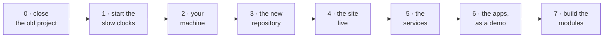
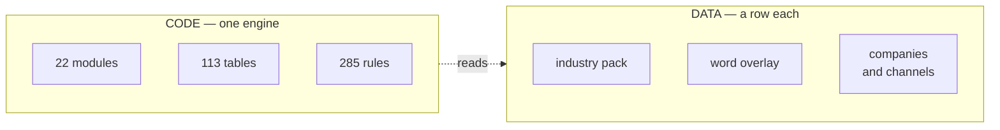

# Medhava — the build guide

**Building the platform, from an empty folder to a running business.**

22 modules · 113 apps · 16 working today · compiled 2026-08-24

---

## What this document is

A runbook. Ten parts, 40 numbered steps, and every step carries three things a plan does not:

- **the command** — what to type, or the exact place to click
- **what you should see** — so "did that work?" has an answer instead of a feeling
- **done when** — the condition that makes it finished rather than attempted

It starts at an empty folder and ends with the modules being built one at a time. It assumes nothing
is installed and nothing is set up.

**This is the platform guide, and there is only one.** Medhava is one business operating
system that any trade can run, because what a trade calls things arrives as a row of configuration
rather than as a separate version of the software.

Everything you build here is the engine every tenant shares. **A tenant is a customer** — a business
that signs up, takes a plan, and runs up to twenty companies inside one account, each selling through
every channel. A tenant creates rows in a browser; it does not clone this repository, run this
toolchain or deploy this server. Onboarding one has its own guide, written for a reader with no
terminal.



---

## Read this before step 0.1

**Every step is labelled, and the labels are the honest part.**

| Label | Means |
|---|---|
| `WORKS TODAY` | The command runs now. Each one was run while writing this. |
| `MANUAL` | No command — a browser, a phone, a form, or somebody else’s website. |
| `DEMO` | It runs, but on its own storage rather than the shared data core. |
| `SPEC` | Designed and documented. The code does not exist yet. |
| `NOT BUILT` | Nothing exists. This step *is* the work. |

**Where this guide sends you somewhere else, go there.** `DEPLOYMENT.md` holds every server command
and is written to be followed line by line. Restating it here would create a second copy that goes
stale the first time the original is corrected — and you would have no way to tell which one was
current.

**What is actually finished, stated once so no step has to hedge:** 16 of 113 apps run
today, and they run on their own storage rather than the shared core. The industry pack engine is
finished and proven — a trade nobody designed for is added during the test run, from a plain
configuration file, with no code written. Tenancy is **not** finished, and Part 8 says exactly what is
missing rather than letting the schema’s completeness imply otherwise.



**What is a row and what is code.** The 22 modules, the 113 tables and the 285 rules
are code — the same for everyone. A company, a channel, a location, a stage, a role and an entire
trade are rows. That is why adding a trade is a file somebody writes rather than a release somebody
ships, and why there is no ceiling on companies or channels anywhere in the software.

---

## Part 0 · Close this project properly

You are archiving the project that produced all of this, and starting fresh. An archive is
only worth having if you can tell, a year from now, which files mattered. Most of what is in there is
generated and will regenerate; a small number of files are the actual source of truth, and losing one
of those means rebuilding a decision rather than copying it.

**One codebase comes out of this, not two.** Medhava is the software — a platform other businesses
sign up to and run their companies inside, the way a business signs up to Zoho or Odoo. A specific
trade is a **tenant**: a row, an industry pack and its own data, created in a browser. A tenant is
never a second repository, a second server or a second version of the software, and the day it
becomes one is the day the product stops being a platform. Onboarding a tenant has its own guide,
written for somebody with no terminal.

#### 0.1 · Check that no key and no customer data ever went into the repository  `WORKS TODAY`

Do this before archiving, not after. An archived repository is still readable, and a key
committed once stays in the history even if the file is deleted later.

```bash
git log --all --diff-filter=A --name-only --format= | sort -u | grep -E "\.env$|^app/data/"
```

**You should see:** Nothing at all. Any line here is a file that was committed and needs the key rotated.

**Done when:** The command prints nothing.

#### 0.2 · Tag the final commit so the archive has a named end  `WORKS TODAY`

```bash
git tag -a archive-final -m "final state before the Medhava and Medhava projects"
git push origin archive-final
```

**You should see:** The tag appears on the repository’s tags page.

**Done when:** You can reach the exact final state by name rather than by scrolling.

#### 0.3 · Build the two sendable archives and download them  `WORKS TODAY`

These hold the finished documents with their screenshots, and resolve outside the repo.

```bash
node brand/delivery/website/mkbundle.js            # the neutral edition
node brand/delivery/website/mkbundle.js <edition>  # the trade edition
```

**You should see:** One .zip per edition at the repository root, each a few MB.

**Done when:** Both ZIPs are downloaded and open on your own machine, pictures and all.

#### 0.4 · Keep this list of what actually matters  `MANUAL`

Everything else in the archive is generated from these. If you had to rebuild the project
from nothing, this is the list you would want.

| File | Why it is irreplaceable |
|---|---|
| `brand/site/modules.js` | The one canonical list. Every module, every app, in order. The website, every document and every count read it. |
| `brand/site/rules.js` | The rulebook — what the system refuses to do. Each rule names the test that proves it. |
| `brand/site/tools.js` | The free-first register: for every capability, the free option and the exact trigger that makes it worth paying. |
| `brand/site/shots.js` | The product screens, as data. What each screen shows, per sector. |
| `brand/site/walkthrough.js` | The reader’s tour, structured so the website and the documents cannot tell it differently. |
| `core/schema.postgres.sql` | The production database. The design decisions in its comments are worth more than the DDL. |
| `core/packs/*.json` | The industry packs. A trade as a row of configuration. |
| `core/*.js` | The engines: money as integer paise, the ledger, stock, audit, events. |
| `brand/identity/` | The logo and brand assets. |
| `CLAUDE.md` | The working agreement, and the lessons already paid for. Carry this into both new projects. |

**Done when:** You have this list somewhere outside the repository.

#### 0.5 · Archive the repository on GitHub  `MANUAL`

Archiving makes it read-only rather than deleting it. Nothing is lost and nothing changes under you.

**Where:** GitHub → the repository → Settings → scroll to the bottom → Archive this repository.

**You should see:** The repository page shows a "This repository has been archived" banner.

**Done when:** The old project is read-only and the two new ones can start without confusion about which is live.

---

## Part 1 · Start the slow clocks — day one, before any technical work

Three of these wait on other people, and nothing you build makes them faster. Meta’s business
verification in particular can take days or weeks. Start them on the first day, then go and do Part 2
while they run — the alternative is finishing the software and then waiting three weeks to send a
message.

#### 1.1 · Start Meta Business verification  `MANUAL`

WhatsApp broadcasting needs a verified business behind it. This is the longest clock and it
cannot be shortened, only started earlier.

**Where:** business.facebook.com → create or open your Business Manager → Business Settings →
Security Centre → Start Verification.

**Have ready:**

- Your business’s legal name, exactly as it appears on the registration
- GST certificate, or a utility bill in the business name
- A business phone number and a business email on your own domain
- **A phone number not currently active on WhatsApp** — this is the one people get wrong. A number already on WhatsApp Business has to be migrated or a different number used.

**You should see:** Status moves to "Pending". Meta comes back by email.

**Done when:** Verification is submitted. Not approved — submitted. Approval is theirs to give.

#### 1.2 · Open the Interakt account and connect it to the verified business  `MANUAL`

Interakt is the WhatsApp provider. It cannot finish onboarding until 1.1 clears, so start
the account now and let it wait at that step rather than starting from zero afterwards.

**Where:** interakt.shop → sign up → connect the WhatsApp Business Account created in 1.1.

**You should see:** The account exists and is waiting on Meta’s verification.

> **Careful.** This is the first line you will genuinely pay for. The free-first register marks WhatsApp
> as one of the few capabilities with **no free path at all** — a monthly platform fee plus Meta’s own
> per-conversation charge. Check both current prices yourself before committing; any figure quoted from
> memory would be out of date.

**Done when:** Everything on your side is submitted; the only thing outstanding is Meta.

#### 1.3 · Point the domain’s nameservers from BigRock to Hostinger  `MANUAL`

One panel then manages both the VPS A-record and the mail MX records. Two panels managing
one domain is how a record ends up edited in the place that is no longer authoritative.

**Where:** BigRock → Manage Domain → Name Servers → replace with the nameservers Hostinger shows in
hPanel → Domains.

**You should see:** Usually live within a few hours; occasionally 24–48.

**Check it:**

```bash
dig +short NS medhava.com
```

**Which should give:** Hostinger’s nameservers, not BigRock’s.

**Done when:** The `dig` command returns Hostinger’s nameservers.

#### 1.4 · Buy the two hosting products  `MANUAL`

They do different jobs and neither replaces the other: shared hosting exists for
`@medhava.com` email, the VPS exists to run things.

| Product | What it is for | Sizing |
|---|---|---|
| Shared hosting | Business email on your own domain | The smallest plan that includes mailboxes |
| VPS | The website, the apps, n8n, Ollama | 4 GB RAM / 2 vCPU |

**You should see:** Ubuntu LTS on the VPS, and an IP address you can SSH to.

> **Careful.** Prices change and I cannot check them from here — read Hostinger’s current pricing rather
> than any figure from me. What is worth knowing is what the 4 GB buys you, and Part 5 does that
> arithmetic honestly.

**Done when:** You have the VPS IP address and root access to it.

---

## Part 2 · Set up your machine

Five tools. Each step has a version check, because "I installed it" and "the right version is
on the PATH" are different facts and only the second one matters. Do these in order — the Node version
in particular is not a preference.

#### 2.1 · Install Node.js 22.5 or newer  `WORKS TODAY`

Not a round number picked for comfort. `core/db.js` uses `node:sqlite`, a built-in that
landed in **Node 22.5**. On Node 20 the database layer does not load at all and 32 tests fail with
"No such built-in module". This is not hypothetical — it is exactly what happened when CI was first
set up with Node 20, and it is why `package.json` declares `engines.node >=22.5.0`.

**Where:** nodejs.org → the LTS download for your operating system.

```bash
node --version
```

**You should see:** `v22.5.0` or higher. If it prints v20 or v18, the install did not take or an older Node is earlier on your PATH.

**Done when:** `node --version` prints 22.5 or higher.

#### 2.2 · Install git and sign in to GitHub  `WORKS TODAY`

```bash
git --version
git config --global user.name  "Your Name"
git config --global user.email "you@medhava.com"
```

**You should see:** A version, then no output from the two config lines — that is success.

**Done when:** You can clone a private repository of your own without being asked for a password.

#### 2.3 · Install Python 3  `WORKS TODAY`

The markdown-to-PDF half of the document pipeline is Python; the browser half is Node.

```bash
python3 --version
python3 -m pip install pdfplumber
```

**You should see:** `Python 3.10` or higher, then pdfplumber installs.

> `pdfplumber` is not needed to make a PDF — it is needed to **read one back and check it**.
> That check is the reason a whole diagram that silently vanished into a blank page was caught at all.

**Done when:** Both commands succeed.

#### 2.4 · Install a code editor  `WORKS TODAY`

**Where:** VS Code from code.visualstudio.com. Any editor works; this one is what the team notes assume.

**Done when:** You can open a folder and edit a file in it.

#### 2.5 · Make sure a Chromium is available for the document and screenshot steps  `WORKS TODAY`

Diagrams are drawn by a real browser, and screenshots are photographs of real screens. Step
3.4 installs one into the project, which is the simplest route — this step is only for confirming
afterwards, or for pointing at a browser you already have.

```bash
# after step 3.4, confirm the project can find one:
node -e "console.log(require('./brand/suite/chrome.js').chromePath())"
```

**You should see:** A path to a chrome binary.

> If it cannot find one, set `CHROME_PATH` to a browser you already have and it will be
> used ahead of everything else. One file answers "where is Chromium" for the whole project —
> `brand/suite/chrome.js`. Seventeen files used to each carry their own answer, all of them correct on
> exactly one machine.

**Done when:** That command prints a path instead of raising an error.

---

## Part 3 · Build the new repository from empty

This part ends with `npm test` green on a machine that has never seen the project. That is
the real gate: not "the files are copied" but "a second person could do this". Everything in Part 3 was
run exactly as written while this guide was being made.

#### 3.1 · Create the empty repository  `MANUAL`

Empty, because the first commit comes from your machine and an auto-generated README just has to be merged around.

**Where:** GitHub → New repository → name it `medhava-bos` → **Private** → no README, no .gitignore, no licence.

**Done when:** The repository exists and is empty.

#### 3.2 · Start it locally and write .gitignore FIRST  `WORKS TODAY`

Before any other file. A `.gitignore` added after the first commit does not un-commit
anything, and the two entries that matter here are a key file and a folder of customer photographs.

```bash
mkdir medhava-bos && cd medhava-bos
git init

cat > .gitignore <<'EOF'
# YOUR WORK AND YOUR KEYS — never commit either.
app/.env
app/data/

# Installed packages — npm ci puts them back from the lockfile.
node_modules/
app/node_modules/

# Generated: rebuild with the script that made them.
brand/suite/deep/out/*.html
brand/site/shots/
brand/site/sec/
engine/out/
*.html.tmp
EOF

git add .gitignore && git commit -m "gitignore first: keys and customer data never enter history"
```

**You should see:** One commit, one file.

**Done when:** The very first commit in the repository is the .gitignore.

#### 3.3 · Copy the source files from the archive  `MANUAL`

Copy the sources, not the generated output. Anything generated will regenerate in 3.6, and
copying a stale generated file is how a document ends up disagreeing with the code that produced it.

| Copy | Leave behind |
|---|---|
| `brand/site/*.js` and `*.css`, `*.html` | `brand/site/index.html` — generated |
| `brand/delivery/website/mk*.js` | the per-edition output folders beside them — generated |
| `brand/suite/` and `brand/identity/` | `brand/suite/deep/out/` — generated |
| `core/` in full, including `tests/` and `packs/` | — |
| `tools/report_pdf.py`, `tools/report_pdf.js` | — |
| `deploy/`, `DEPLOYMENT.md`, `CLAUDE.md` | — |
| `package.json`, `package-lock.json` | `node_modules/` — reinstalled |
| `.github/workflows/ci.yml` | — |
| `app/` **except** `data/`, `.env`, `node_modules/`, `web/` | those four |

```bash
# ARCHIVE is wherever you extracted the old project. Run from inside medhava-bos.
ARCHIVE=../old-project

mkdir -p brand/site brand/delivery/website core tools deploy .github/workflows app

cp $ARCHIVE/brand/site/*.js $ARCHIVE/brand/site/*.css $ARCHIVE/brand/site/*.html brand/site/
rm -f brand/site/index.html brand/site/index_vastrangam.html   # generated, not source

cp $ARCHIVE/brand/delivery/website/mk*.js brand/delivery/website/
cp -r $ARCHIVE/brand/suite $ARCHIVE/brand/identity brand/
rm -rf brand/suite/deep/out                                    # generated, not source

cp -r $ARCHIVE/core/* core/
cp $ARCHIVE/tools/report_pdf.py $ARCHIVE/tools/report_pdf.js tools/
cp -r $ARCHIVE/deploy/* deploy/
cp $ARCHIVE/.github/workflows/ci.yml .github/workflows/
cp $ARCHIVE/package.json $ARCHIVE/package-lock.json .
cp $ARCHIVE/DEPLOYMENT.md $ARCHIVE/CLAUDE.md $ARCHIVE/*PLAN_OF_ACTION.md .

# app/, minus the four that never travel
for f in $ARCHIVE/app/*; do
  case "$(basename "$f")" in data|.env|node_modules|web) ;; *) cp -r "$f" app/ ;; esac
done
```

**You should see:** No errors. The folder is a few hundred MB, most of it the brand assets.

**Check it:**

```bash
test -e app/data && echo "PROBLEM: customer data copied" || echo "app/data: correctly absent"
test -e app/.env && echo "PROBLEM: key file copied"      || echo "app/.env:  correctly absent"
```

**Which should give:** Both lines say correctly absent. If either says PROBLEM, delete it before the next commit.

**Done when:** The folder holds the sources and none of the generated output, and neither the key file nor the data folder came across.

#### 3.4 · Install the toolchain from the lockfile  `WORKS TODAY`

`npm ci` installs exactly what the lockfile pins. `npm install` may resolve something
newer, which is how two machines end up on different versions of a diagram renderer and produce
different documents from the same source.

```bash
npm ci

# A browser is needed for the diagrams and screenshots. Check before downloading one —
# many machines already have a usable Chromium, and this saves a ~150 MB download.
node -e "console.log(require('./brand/suite/chrome.js').chromePath())" \
  || npx playwright install chromium
```

**You should see:** Packages installed from the lockfile, then either a browser path printed or one downloaded.

> If you already have Chrome or Chromium somewhere unusual, set `CHROME_PATH` to it and
> skip the download entirely — an explicit answer wins over every other candidate.

**Done when:** Both finish without an error, and the second line ends with a path to a chrome binary.

#### 3.5 · Run every check before writing a single line of new code  `WORKS TODAY`

This is the gate. If it is green, the project is reproducible and a second developer can
join. If it is not, fix that before anything else — a broken baseline makes every later failure
ambiguous.

```bash
npm test
```

**You should see:** Each suite reports in turn: the industry packs including the added-at-run-time trade,
the two schema files agreeing, the companies-and-channels grid, the rulebook, the free-first register,
the neutrality gate, and the three generated-region idempotency checks.

**Done when:** Every suite passes. No failures, no skips you did not read.

#### 3.6 · Build the website and the documents  `WORKS TODAY`

```bash
npm run build
npm run docs
```

**You should see:** `overflow 0 | errors 0` from each build, then the screenshots and documents regenerate.

**Done when:** Both editions build clean and the documents exist again, generated rather than copied.

#### 3.7 · Commit and push, then confirm CI goes green  `WORKS TODAY`

CI is the thing that tells you the project works somewhere that is not your laptop. It has
already earned its place: it caught three real portability bugs — the wrong Node version, a browser path
that existed on one machine, and a dependency installed at the wrong level. Every one of them would
otherwise have surfaced on the server.

```bash
git add -A
git commit -m "the project, from its sources"
git remote add origin git@github.com:<you>/medhava-bos.git
git push -u origin main
```

**You should see:** GitHub → Actions → the run goes green.

**Done when:** A commit pushed from your machine passes every check on a machine that is not yours.

---

## Part 4 · Put medhava.com live

The website is a built, self-contained file. Publishing it is DNS, nginx and a certificate —
not development. **The server commands live in `DEPLOYMENT.md` and are not repeated here.** That file
is written to be followed line by line and it is current; restating it in this guide would produce a
second copy that goes stale the first time one of them is corrected.

#### 4.1 · Build the site and look at it locally before anyone else can  `WORKS TODAY`

```bash
npm run build
# then open brand/site/index.html in a browser
```

**You should see:** `overflow 0 | errors 0`, and a page that scrolls cleanly with no overlapping text.

> Worth saying plainly, because it cost a whole diagram once: **a green exit code is not a
> legible page.** The build checks what it can measure. It cannot tell you the page reads well.

**Done when:** You have opened it and looked at it. Not just seen the exit code.

#### 4.2 · Secure the VPS before anything listens on it  `MANUAL`

**Where:** `DEPLOYMENT.md` §1.1 — a non-root sudo user, SSH keys only, `ufw` allowing 22/80/443, fail2ban, unattended upgrades.

> **Careful.** Confirm key login in a second terminal before disabling password login. If the key is
> wrong and you have already closed the only working session, you are locked out of your own server.

**Done when:** Password login is off and you have confirmed key login works **in a second terminal you left open**.

#### 4.3 · Add swap  `MANUAL`

Not for speed. So a model loading into memory cannot OOM-kill n8n beside it.

**Where:** `DEPLOYMENT.md` §1.2 — 4 GB of swap.

**Done when:** `free -m` shows a swap line.

#### 4.4 · Point the DNS records at the VPS  `MANUAL`

**Where:** `DEPLOYMENT.md` §1.3 — A records for the bare domain, `www`, `app` and `n8n`; MX records to Hostinger for mail.

**Check it:**

```bash
dig +short medhava.com
```

**Which should give:** Your VPS IP address.

**Done when:** `dig` returns the VPS IP.

#### 4.5 · Install nginx and the TLS certificates  `MANUAL`

**Where:** `DEPLOYMENT.md` §1.4 — the three server blocks from `deploy/nginx/`, then certbot.

**Done when:** Certificates issued for all four hostnames, and auto-renewal is armed.

#### 4.6 · Publish  `WORKS TODAY`

`deploy/publish-site.sh` rebuilds before it uploads, and uploads to a temporary name and
moves the file into place. A visitor mid-request never sees a half-written page.

```bash
./deploy/publish-site.sh
```

**You should see:** The site rebuilds, uploads and is moved into place.

**Check it:**

```bash
curl -sSI https://medhava.com | head -1
curl -sS  https://medhava.com | grep -c "Industry packs"
curl -sSI https://www.medhava.com | head -1
```

**Which should give:** `200 OK`, a non-zero count proving it is the real page and not a placeholder, and `www` resolving too.

**Done when:** The three checks below all pass.

---

## Part 5 · The VPS services — and honest arithmetic about 4 GB

4 GB is a real constraint. Planning around it beats discovering it, so here is the arithmetic
before the steps.

| What | Roughly |
|---|---|
| OS + nginx | 400 MB |
| The Node app | 200 MB |
| n8n | 400 MB |
| **Left for a model** | **~3.0 GB** |
| Ollama with a 3B model, Q4 | 2.0 GB — fits, with room |
| Ollama with a 7B model, Q4 | 4.4 GB — **does not fit** |

#### 5.1 · Put Postgres on the Supabase free tier, not on the VPS  `MANUAL`

It keeps roughly 400 MB of RAM free for the model, and it brings daily backups you would
otherwise have to build. The free-first register already names this as the free option, with the exact
trigger for paying: past 500 MB of data or 50,000 monthly active users, or when point-in-time recovery
is needed.

**Where:** supabase.com → new project → SQL editor → paste `core/schema.postgres.sql` → run.

**You should see:** Every table created.

> Nothing in the schema is Supabase-specific except the row-level security policies reading
> auth context — about a dozen lines. Moving to Postgres on your own VPS later is a restore, not a
> rewrite.

**Done when:** The tables exist and you have the connection string, stored somewhere private.

#### 5.2 · Install n8n behind nginx with authentication  `MANUAL`

**Where:** `DEPLOYMENT.md` §2.2.

**Check it:**

```bash
curl -sSI https://n8n.medhava.com | head -1
```

**Which should give:** `401` or a redirect to a login — reachable **and** protected. A `200` here means it is open to the internet.

**Done when:** It answers, and it does not let you in without credentials.

#### 5.3 · Install Ollama and pull a 3B model  `MANUAL`

**Where:** `DEPLOYMENT.md` §2.3.

**Check it:**

```bash
ollama run llama3.2:3b "reply OK" --verbose
```

**Which should give:** A reply, and a tokens-per-second figure. On 2 vCPU expect roughly 4–10 tokens/second.

> That speed is genuinely useful for classifying, tagging and short summaries, and genuinely
> slow for long drafting. When drafting quality matters, the Provider Router falls through to a paid model
> **with a spend ceiling in front of it** — over the ceiling the paid provider is refused, not warned
> about, and the work finishes on a free one.

**Done when:** You have measured the tokens/sec on your own box rather than taken a number from a document.

#### 5.4 · Set up backups on the first day, not the first incident  `MANUAL`

A backup that lives only on the machine it protects is not a backup.

**Where:** `DEPLOYMENT.md` §2.5 — a nightly dump of the database plus the VPS configuration, copied off the box.

**Done when:** A backup has been restored once, into a scratch database, to prove it restores.

---

## Part 6 · The working apps, published as a labelled demo

16 of the 113 apps run today. Each is a real single-file application carrying its
own self-tests and passing a click-through audit in both editions. They also run on **their own
storage**, not the shared data core — which is why this part says demo and keeps saying it. Rewiring
them onto the core is the first job of Part 7, not a footnote here.

#### 6.1 · Build the apps and run the click-through audit  `WORKS TODAY`

```bash
node brand/suite/deep/build_deep.js
node brand/suite/deep/check_deep.js
```

**You should see:** 0 test failures, and 0 apps with problems.

**Done when:** Both report zero.

#### 6.2 · Put the app server behind nginx, password-gated  `DEMO`

**Where:** `DEPLOYMENT.md` §2.4 — the systemd unit from `deploy/medhava-app.service`, nginx at `app.medhava.com`.

**Check it:**

```bash
curl -sSI https://app.medhava.com | head -1
```

**Which should give:** `401`. Anything else means the demo is open to the internet.

**Done when:** It is reachable and it asks for a password.

#### 6.3 · Put the keys on the server only  `MANUAL`

```bash
# on the server, never in the repository
nano /opt/app/.env
chmod 600 /opt/app/.env
```

> **Careful.** Model keys are entered in-app at runtime and live in a file that is never committed.
> **Nothing in this system ever asks you for a marketplace, bank or account password** — not this guide,
> not the software, not a support conversation. If anything ever does, it is not us.

**Done when:** `.env` exists on the server, is mode 600, and `git status` in your repository shows nothing.

#### 6.4 · Label the demo on the page itself  `MANUAL`

Someone will open it who was not in the conversation where you called it a demo. The label
belongs on the screen, not in the sentence that introduced it.

**Where:** Add a banner to the app’s landing screen reading: "Demo — 16 of 113 apps,
running on their own storage. Figures shown are illustrative."

**Done when:** Anyone opening it can tell in five seconds that this is a demo on its own storage.

---

## Part 7 · Build the modules

22 modules, 113 apps. **16 of them work today** and the rest are designed and not
yet written — each app below says which it is, so no step here quietly assumes software nobody has
built.

The order is the order the modules are numbered, and that is already the build order: what a later
module needs, an earlier one has made. Module 01 is the spine — not a module you open, the layer
everything else stands on — which is why 22 modules is also 21 modules you use plus one
underneath them. Both figures describe the same system.

**A module is finished when its rules are enforced, not when its screens exist.** The rulebook
carries 285 rules and 86 of them are proven by a test today. Each module below lists what it
still owes, and that list is the honest definition of done for it.

### Module 01 · Platform — the spine

*The spine every module runs on*

**1 of 8 apps working · 20 of 25 rules enforced**

| App | State | What it is |
|---|---|---|
| Identity, Settings & Audit | `SPEC` | Users, roles and permissions, company switching, tax and numbering setup — and an immutable record of everything that ever happened. |
| Industry Packs | `SPEC` | What your trade calls things, the stages your work moves through, the extra fields your records need, the documents you issue and the reference data you start with — all of it loaded as a row of configuration, never as a separate version of the software. |
| Ask & Print | `WORKS TODAY` | Ask from your phone, anywhere: a ledger, a bill, today’s packing slips. |
| Communications | `SPEC` | WhatsApp commands and broadcasts, email and SMS, and the handful of scheduled jobs that carry a nudge to the right person without anyone remembering to send it. |
| WhatsApp Command Console | `SPEC` | The shop floor does not open a laptop. |
| Data Privacy & Consent | `SPEC` | What a person’s data may be used for, captured as consent at the point it is given and honoured everywhere downstream — including the right to have it corrected or removed. |
| Provider Router & Cost Guard | `SPEC` | The rule that no capability depends on one outside service, enforced at the moment it matters instead of merely promised. |
| Payment Data Scope | `SPEC` | A written statement of exactly which systems ever see a card or bank credential, and which never do — because every card-capable screen in this system hands that moment to a payment provider’s own secured field and never stores or even passes the number through application code. |

**Needs first:** Every module  
**Feeds:** Every module

**Already proven:**

- `R01.1` Every business record names the company it belongs to — proved by `core/tests/core.test.js › the schema loads and the three companies keep three different codes`
- `R01.2` One company cannot read another company’s records — proved by `core/tests/core.test.js › one company cannot read another company`
- `R01.3` The audit trail has no off switch — proved by `core/tests/core.test.js › an audited insert leaves a before/after trail`
- `R01.4` An update records what it was, not only what it became — proved by `core/tests/core.test.js › an update records what it was as well as what it became`
- `R01.5` A table nobody thought to audit is refused — proved by `core/tests/core.test.js › a table nobody thought to audit is refused, rather than slipping through`
- `R01.6` Deletion is a reversal, never a removal — proved by `core/tests/core.test.js › voiding is the only removal, and it is reversible`
- `R01.7` A module that is not in the canonical list cannot join the bus — proved by `core/tests/core.test.js › a module not in modules.js cannot subscribe`
- `R01.8` A cascade is all of it or none of it — proved by `core/tests/core.test.js › a sale moves stock and posts to the ledger, or does neither`
- `R01.9` A handler that throws takes the transaction with it — proved by `core/tests/core.test.js › a handler that throws takes the whole transaction with it`
- `R01.10` No capability depends on a single outside service — proved by `brand/suite/router.js › no spend ceiling can exhaust any cascade (a free option is always in it)`
- `R01.11` A failing provider is taken out of the list, not hammered — proved by `brand/suite/router.js › three consecutive failures trip the breaker open`
- `R01.12` A spend ceiling refuses, it does not warn — proved by `brand/suite/router.js › a ceiling below the price refuses every paid option, not just the first`
- `R01.18` A trade is added as data, never as a version of the software — proved by `core/tests/packs.test.js › GATE · it loads from a JSON string with no code change`
- `R01.19` A pack is data and can never be code — proved by `core/tests/packs.test.js › a pack containing a function`
- `R01.20` A pack may rename a concept, never invent one — proved by `core/tests/packs.test.js › renaming a concept the engine does not have`
- `R01.21` A pack extends tables that exist, and nothing else — proved by `core/tests/packs.test.js › adding a field to a table that does not exist`
- `R01.22` Money in a pack is money everywhere else — proved by `core/tests/packs.test.js › money declared as a plain number`
- `R01.23` No pack can switch off a guarantee — proved by `core/tests/packs.test.js › switching OFF the audit trail`
- `R01.24` A rule a pack never mentions is on — proved by `core/tests/packs.test.js › a rule the pack never mentions is ON — a pack is an exception list, not a permission list`
- `R01.25` An invalid pack is refused whole, never half-loaded — proved by `core/tests/packs.test.js › a refused pack is refused whole — nothing is half-applied`

**Still owed — 5 rules designed but not yet proven:**

- `R01.13` The system never asks for a marketplace, bank or account password
- `R01.14` Card and bank credentials never reach application code
- `R01.15` Consent and retention are two different clocks
- `R01.16` A scoped key is revocable without touching the login
- `R01.17` A webhook is verified, idempotent and never silently dropped

**Done when:** all 25 rules for this module are ENFORCED — each naming a test that exists and really runs — and its 8 apps read and write the shared data core rather than storage of their own.

### Module 02 · Design & Sampling

*A style exists on paper before it exists as stock*

**0 of 2 apps working · 0 of 7 rules enforced**

| App | State | What it is |
|---|---|---|
| PLM & Development | `SPEC` | First idea to something you can actually make: specification, sample rounds, costed trials and sign-off, with every version kept. |
| Design / IP Register | `SPEC` | What protects a design once it exists — trademark or copyright status, the date it was first shown, and a flag the moment a near-identical listing turns up elsewhere. |

**Needs first:** CRM  
**Feeds:** Inventory & Catalog, Manufacturing

**Still owed — 7 rules designed but not yet proven:**

- `R02.1` A style becomes a SKU only after sign-off
- `R02.2` Every version of a specification is kept
- `R02.3` A costed trial carries the date its rates came from
- `R02.4` A design with no ownership record is flagged, not blocked
- `R02.5` The first-shown date is recorded when it happens
- `R02.6` A rejected sample keeps its reason
- `R02.7` A specification cannot be deleted while stock exists against it

**Done when:** all 7 rules for this module are ENFORCED — each naming a test that exists and really runs — and its 2 apps read and write the shared data core rather than storage of their own.

### Module 03 · Inventory & Catalog

*One number everyone trusts*

**0 of 4 apps working · 7 of 14 rules enforced**

| App | State | What it is |
|---|---|---|
| Stock | `SPEC` | Live quantity by SKU, location and stage, with reorder alerts, batches, kits and dead-stock. |
| Catalog / PIM | `SPEC` | One product record — attributes, images, HSN, MRP and the price each channel actually sells at — pushed to every marketplace and to your own storefront, and scored for each channel’s rules before it lists. |
| Kit & Combo SKU | `SPEC` | A sellable SKU made of component SKUs — a three-piece set sold as one listing. |
| Master-Data Hygiene | `SPEC` | Duplicate detection and merge across customers, vendors and designs, and a dead-stock register for what has not moved in months. |

**Needs first:** Design & Sampling, Every module  
**Feeds:** Every module

**Already proven:**

- `R03.1` Stock is one number per SKU, per location, per stage — proved by `core/tests/core.test.js › stock is one number per SKU, with the channel recorded on the movement`
- `R03.2` Negative stock is a fault, not a state — proved by `core/tests/core.test.js › issuing more than exists is refused — negative stock is a fault, not a state`
- `R03.3` Selling a kit decrements every component — proved by `core/tests/core.test.js › selling a kit decrements every component`
- `R03.4` A kit with no components is refused — proved by `core/tests/core.test.js › a kit that lists no components is refused, not silently sold as nothing`
- `R03.5` Stock value ties to the item cost, always — proved by `core/tests/core.test.js › stock value ties to the item cost`
- `R03.6` Every movement has a source, a destination, or both — proved by `core/tests/core.test.js › a movement with neither a source nor a destination is refused`
- `R03.7` A quantity is a whole number above zero — proved by `core/tests/core.test.js › a quantity must be a whole number above zero`

**Still owed — 7 rules designed but not yet proven:**

- `R03.8` Goods in someone else’s warehouse are still yours
- `R03.9` Fabric in metres and pieces in numbers share one item master
- `R03.10` A listing needs the packed size and weight before it can go out
- `R03.11` The channel’s own code for a product is mapped, not assumed
- `R03.12` A duplicate master record is merged, never left as two
- `R03.13` A price is per channel and dated
- `R03.14` Dead stock is named as dead stock

**Done when:** all 14 rules for this module are ENFORCED — each naming a test that exists and really runs — and its 4 apps read and write the shared data core rather than storage of their own.

### Module 04 · CRM

*Know every customer completely — and answer them fast*

**3 of 4 apps working · 0 of 9 rules enforced**

| App | State | What it is |
|---|---|---|
| CRM & Customer 360 | `WORKS TODAY` | Lead to won, then the full lifetime: orders, returns, value and what to offer next. |
| Documents & eSign | `WORKS TODAY` | Every agreement, receipt, certificate and scan filed against the record it belongs to — an order, a party, a case, an employee — so it is found by that record instead of by remembering a folder. |
| Helpdesk & Live Chat | `WORKS TODAY` | Questions arriving by chat, email or phone become tickets tied to the order or the account they are about, with the whole history already on the screen. |
| Forms & Feedback (NPS) | `SPEC` | A short form after delivery, and the score it produces attached to the design or item it is actually about — not just the buyer — so a complaint-prone item surfaces as a pattern instead of a scatter of individual gripes. |

**Needs first:** Every module  
**Feeds:** Sales, E-commerce / OMS, Marketing

**Still owed — 9 rules designed but not yet proven:**

- `R04.1` One customer, one record, whichever channel they arrived by
- `R04.2` A document is filed against the record it belongs to
- `R04.3` A signed copy files itself back
- `R04.4` A ticket carries the order it is about
- `R04.5` Feedback attaches to the item, not only the buyer
- `R04.6` A customer’s consent travels with their data
- `R04.7` A merged customer keeps both histories
- `R04.8` Credit state is read at the moment of the order
- `R04.9` A closed ticket keeps what resolved it

**Done when:** all 9 rules for this module are ENFORCED — each naming a test that exists and really runs — and its 4 apps read and write the shared data core rather than storage of their own.

### Module 05 · Sales

*Every way you sell, one order book — to the doorstep*

**5 of 8 apps working · 4 of 18 rules enforced**

| App | State | What it is |
|---|---|---|
| D2C Sales | `WORKS TODAY` | Orders from your own storefront — Shopify, WooCommerce or a custom site — cart to dispatch, with loyalty and partial COD. |
| B2B & Credit | `WORKS TODAY` | Wholesale orders with credit limits, tier pricing and outstanding ageing. |
| Export | `WORKS TODAY` | Commercial invoice, packing list, LUT bond and IGST-refund tracking. |
| POS | `WORKS TODAY` | Counter billing that draws on the same stock as your website. |
| Quotes & Proforma | `WORKS TODAY` | Send a quote, convert it to a confirmed order in one click. |
| Couriers & AWB | `SPEC` | Book the shipment on the order itself, compare couriers, print the label and follow the AWB to the door. |
| Subscriptions | `SPEC` | A schedule that raises its own invoice on its cycle and follows up on its own when a payment fails — for anything sold as a standing order rather than a one-off. |
| Customisation & Made-to-Measure | `SPEC` | The order that does not exist in the catalogue: a buyer sends reference pictures and their own measurements, a price is agreed over several messages, and the piece is made for them. |

**Needs first:** Inventory & Catalog, CRM, Warehouse, Logistics  
**Feeds:** Inventory & Catalog, Accounting & GST, Warehouse, Logistics

**Already proven:**

- `R05.1` Every sale carries its company and its channel — proved by `core/tests/core.test.js › every one of the hundred cells posted its own figure, channel by channel`
- `R05.2` A sale posts stock and ledger together — proved by `core/tests/core.test.js › a sale moves stock and posts to the ledger, or does neither`
- `R05.3` If the ledger refuses, the stock never moved — proved by `core/tests/core.test.js › and if the ledger refuses, the stock never moved`
- `R05.13` A sale to a sister company is marked as one — proved by `core/tests/core.test.js › an entry cannot be its own counterparty`

**Still owed — 14 rules designed but not yet proven:**

- `R05.4` A quote becomes an order without being retyped
- `R05.5` A price below the floor needs an approval, not a note
- `R05.6` An export invoice knows it is an export
- `R05.7` A counter sale is the same order record
- `R05.8` A credit sale reserves the credit at the moment it is taken
- `R05.9` A dispatch cannot exceed what was ordered
- `R05.10` A cancelled order releases what it held
- `R05.11` An AWB belongs to the shipment, not the courier integration
- `R05.12` A subscription renewal is a new order
- `R05.14` A quote or proforma number carries its type and financial year
- `R05.15` A quote line with no description, no quantity or a negative rate is not a line
- `R05.16` An export line carries no GST
- `R05.17` A made-to-measure order has two money legs, and both are visible
- `R05.18` A customisation quote keeps every round of the negotiation

**Done when:** all 18 rules for this module are ENFORCED — each naming a test that exists and really runs — and its 8 apps read and write the shared data core rather than storage of their own.

### Module 06 · Planning & Requirements (MRP)

*Turn what is selling into what to buy and make*

**0 of 3 apps working · 0 of 8 rules enforced**

| App | State | What it is |
|---|---|---|
| Demand Forecast & Signal | `SPEC` | What sold, by SKU and by period, turned into a short-term forecast — the number every requisition and every production order downstream is measured against instead of a guess. |
| Requirement Explosion (MRP run) | `SPEC` | Confirmed demand exploded through the bill of materials into what raw material to buy and what to produce, and by when — so a purchase requisition or a production order always traces back to real demand, never to a feeling that stock is getting low. |
| Open-to-Buy / Budget Ceiling | `SPEC` | A spending ceiling set per period regardless of what the demand signal suggests, so a real signal cannot on its own commit more money than the business has decided to risk this season. |

**Needs first:** Sales, E-commerce / OMS, Inventory & Catalog  
**Feeds:** Purchase, Manufacturing

**Still owed — 8 rules designed but not yet proven:**

- `R06.1` A forecast is labelled a forecast wherever it appears
- `R06.2` A requirement run reads live stock, not a snapshot
- `R06.3` A requirement names what caused it
- `R06.4` Stock already on order counts against the shortfall
- `R06.5` A budget ceiling refuses, it does not warn
- `R06.6` A lead time is per vendor and per item
- `R06.7` A run is kept, not overwritten
- `R06.8` A seasonal signal cannot silently become a permanent one

**Done when:** all 8 rules for this module are ENFORCED — each naming a test that exists and really runs — and its 3 apps read and write the shared data core rather than storage of their own.

### Module 07 · Purchase

*Nothing over-billed gets paid*

**2 of 3 apps working · 0 of 12 rules enforced**

| App | State | What it is |
|---|---|---|
| Procurement | `WORKS TODAY` | RFQ to purchase order to goods receipt, with a strict three-way match before any bill is paid. |
| Vendor Management | `WORKS TODAY` | Vendor 360, payables, ageing, a real risk score, and sourcing that follows performance. |
| Insurance Register | `SPEC` | What cover exists over stock in transit, stock in the warehouse and product liability, matched against what is actually moving through Purchase and Warehouse right now — so real value in transit is never quietly running with no cover tracked anywhere. |

**Needs first:** Inventory & Catalog, Planning & Requirements (MRP), Manufacturing  
**Feeds:** Inventory & Catalog, Accounting & GST, Quality & Compliance

**Still owed — 12 rules designed but not yet proven:**

- `R07.1` Nothing is paid without a three-way match
- `R07.2` A short or damaged receipt is recorded as received short
- `R07.3` Input tax credit is claimed against a real document
- `R07.4` Landed cost reaches the item, not just the P&L
- `R07.5` A vendor price is dated
- `R07.6` A purchase order over its approval level waits
- `R07.7` A vendor with no active record cannot be paid
- `R07.8` A change to vendor bank detail is treated as high risk
- `R07.9` A job-work despatch stays on the books
- `R07.10` An insurance policy is linked to what it covers
- `R07.11` The three-way match is arithmetic, not a judgement
- `R07.12` A material is sourced down a ranked list, not from whoever answers

**Done when:** all 12 rules for this module are ENFORCED — each naming a test that exists and really runs — and its 3 apps read and write the shared data core rather than storage of their own.

### Module 08 · Manufacturing

*Know what a unit really costs to make*

**0 of 4 apps working · 9 of 20 rules enforced**

| App | State | What it is |
|---|---|---|
| Production Orders | `SPEC` | Your own stages from first operation to finished goods, with work-in-progress visible at each one. |
| Piece-rate & Contractors | `SPEC` | Output-based pay for anyone paid by the piece rather than the hour — pooled completion, per-unit rates, rework and advances resolved into a single payout. |
| BOM & Consumption | `SPEC` | What each product consumes, costed at today’s material rates. |
| Maintenance | `SPEC` | Machines, tools and assets: what is due for service, when it was last done, what it cost, and what stopped while it was down. |

**Needs first:** Purchase, Planning & Requirements (MRP), Design & Sampling  
**Feeds:** Inventory & Catalog, HR & Payroll, Accounting & GST, Quality & Compliance

**Already proven:**

- `R08.1` Sets are pooled across every karigar before the minimum is taken — proved by `brand/suite/studio/verify_studio.js › pooling happens before the minimum, not per karigar row`
- `R08.2` A surplus piece is paid for, and is not a set — proved by `brand/suite/studio/verify_studio.js › a surplus piece is named, is still paid for, and is never added to the sets`
- `R08.3` A design counts on the garments it actually has — proved by `brand/suite/studio/verify_studio.js › an Anarkali-only design counts on what it has, not zero`
- `R08.4` A missing rate posts zero and is flagged, never guessed — proved by `brand/suite/studio/verify_studio.js › a missing rate posts zero and is flagged, never guessed`
- `R08.5` A two-row heading is read as two rows — proved by `brand/suite/studio/verify_studio.js › the two-row heading is read, so three Dupatta columns stay three garments`
- `R08.6` A karigar written as a pair stays one unit — proved by `brand/suite/studio/verify_studio.js › a karigar written as a pair stays one unit`
- `R08.7` Several years of grids pool into one set of figures — proved by `brand/suite/studio/verify_studio.js › several years of grids pool into one set of figures`
- `R08.8` Cost per piece is independent of set completion — proved by `brand/suite/studio/verify_studio.js › the grand total is the sum of the designs, and of the karigars`
- `R08.17` A set type comes from the rate master, and an inferred one says so — proved by `brand/suite/studio/verify_studio.js › the two-row heading is read, so three Dupatta columns stay three garments`

**Still owed — 11 rules designed but not yet proven:**

- `R08.9` A production report moves stock and pay together
- `R08.10` Material issued to production leaves raw stock at the moment it is issued
- `R08.11` A bill of materials is versioned with the design
- `R08.12` Wastage is recorded, not absorbed
- `R08.13` A stage cannot be skipped without being recorded as skipped
- `R08.14` An advance to a karigar is a balance, not a deduction from nowhere
- `R08.15` A rework carries the cost of the rework
- `R08.16` Material consumed is the average per piece times the pieces made
- `R08.18` An alteration caused by the karigar’s own mistake is unpaid
- `R08.19` Alteration time is paid at the alteration rate, not the piece rate
- `R08.20` A contract worker paid by the hour has no attendance row

**Done when:** all 20 rules for this module are ENFORCED — each naming a test that exists and really runs — and its 4 apps read and write the shared data core rather than storage of their own.

### Module 09 · Quality & Compliance

*Certify what was received and what was made*

**0 of 2 apps working · 0 of 7 rules enforced**

| App | State | What it is |
|---|---|---|
| Quality Control | `SPEC` | Accept, reject or rework — on goods received and on goods made — with reasons that feed the supplier scorecard and the performance flags alike. |
| Certificate & Compliance Register | `SPEC` | Every standard the business or a vendor holds — a safety, labour or environmental certification — with its issue date, its expiry, and the audit that backs it, so a certificate about to lapse is visible before a buyer asks for it and finds it already expired. |

**Needs first:** Purchase, Manufacturing  
**Feeds:** Purchase, Manufacturing, Inventory & Catalog

**Still owed — 7 rules designed but not yet proven:**

- `R09.1` A failed check blocks the next stage
- `R09.2` A check names the person who did it
- `R09.3` An expiring certificate warns before it expires
- `R09.4` A rejected batch cannot be sold as first quality
- `R09.5` A defect is attached to the design and the stage
- `R09.6` A compliance document is evidence, not a checkbox
- `R09.7` A sustainability figure comes from the same evidence

**Done when:** all 7 rules for this module are ENFORCED — each naming a test that exists and really runs — and its 2 apps read and write the shared data core rather than storage of their own.

### Module 10 · Warehouse

*Pick right the first time — and prove what you sent*

**0 of 3 apps working · 0 of 8 rules enforced**

| App | State | What it is |
|---|---|---|
| Picking & Bins | `SPEC` | Pick lists that tell staff exactly which bin to walk to, in walking order. |
| Barcode Operations | `SPEC` | Scan to pick, pack, dispatch and run a physical stock count from a phone — the same scan whether the order came from a marketplace, your Shopify site or the counter. |
| Packing Video | `SPEC` | Every parcel recorded as it is packed and indexed by its order number, so a wrong-item claim is answered with the clip. |

**Needs first:** Sales, E-commerce / OMS, Inventory & Catalog  
**Feeds:** Inventory & Catalog, Sales, E-commerce / OMS

**Still owed — 8 rules designed but not yet proven:**

- `R10.1` A pick is confirmed against the bin it came from
- `R10.2` A short pick stops the pack, it does not silently reduce the order
- `R10.3` A scan is the same event as a keyed entry
- `R10.4` A cycle count adjustment names a reason
- `R10.5` The packing video is linked to the shipment
- `R10.6` A bin holds a location, not a guess
- `R10.7` A dispatch cut-off is per channel
- `R10.8` A returned parcel is inspected before it is anything else

**Done when:** all 8 rules for this module are ENFORCED — each naming a test that exists and really runs — and its 3 apps read and write the shared data core rather than storage of their own.

### Module 11 · Logistics

*The courier network itself — rates, failures and the COD money*

**0 of 5 apps working · 0 of 11 rules enforced**

| App | State | What it is |
|---|---|---|
| Rates & Zones | `SPEC` | Every courier’s rate card by zone, weight slab and service — so the cheapest and the fastest option for this parcel are both known before it is booked. |
| NDR & RTO Rescue | `SPEC` | A failed delivery worked while it can still be saved — reattempt, call, correct the address — before it becomes a return you pay for twice. |
| COD Remittance | `SPEC` | What the courier collected at the door against what reached your bank, parcel by parcel, with every shortfall named and aged. |
| Handover & Manifest | `SPEC` | What is expected out today against what the courier actually took, counted per courier and per service. |
| Fleet | `SPEC` | Your own delivery vehicles, if you run any — what each trip cost, what is due for service, and what that adds to freight. |

**Needs first:** Sales, E-commerce / OMS, Warehouse  
**Feeds:** Accounting & GST, Sales, E-commerce / OMS

**Still owed — 11 rules designed but not yet proven:**

- `R11.1` The courier rate is checked against the packed weight
- `R11.2` A weight dispute is raised with the evidence attached
- `R11.3` An undelivered parcel is chased before it becomes a return
- `R11.4` COD collected is a receivable until it is remitted
- `R11.5` A remittance is matched parcel by parcel
- `R11.6` A manifest is a record, not a printout
- `R11.7` An RTO parcel is stock again only after inspection
- `R11.8` Freight cost reaches the order it belongs to
- `R11.9` A courier can be changed without losing history
- `R11.10` A zone and rate card are dated
- `R11.11` A partial-COD order has two collections and both are tracked

**Done when:** all 11 rules for this module are ENFORCED — each naming a test that exists and really runs — and its 5 apps read and write the shared data core rather than storage of their own.

### Module 12 · Accounting & GST

*Books that always balance*

**0 of 9 apps working · 16 of 24 rules enforced**

| App | State | What it is |
|---|---|---|
| Accounting | `SPEC` | Double-entry books where every voucher balances and the trial balance always ties. |
| Invoicing | `SPEC` | GST tax invoices and receipts, totals computed from the lines to the paise. |
| Expenses | `SPEC` | Spend captured by category with approvals, and bill OCR to save typing. |
| GST & Tax | `SPEC` | CGST, SGST, IGST, TDS, TCS, input credit, GSTR-1 and GSTR-3B — filed per registration, so a group where one company is registered and another is not files exactly what each one owes and nothing it does not. |
| ITC Reconciliation | `SPEC` | Every input credit matched against the government’s own GSTR-2A/2B before a return is filed, so a credit claimed is a credit that is actually on record. |
| Receivables, Payables & PDC | `SPEC` | Payments and receipts allocated against named open invoices, and a register for post-dated cheques that posts only on the date they are realised, not the date they were written. |
| Fixed Assets & Depreciation | `SPEC` | The asset register with both Straight-Line and Written-Down-Value depreciation tracked side by side, and disposal posting its gain or loss straight to the books. |
| Year-End Close & Period Lock | `SPEC` | Profit-and-loss accounts reset and balance-sheet accounts carry forward at year end, and a reviewed period locks against backdated edits until an admin unlocks it — an act that is itself logged. |
| Finance Reports | `SPEC` | P&L, balance sheet, and profit by channel, product and SKU. |

**Needs first:** Every module  
**Feeds:** Finance Reports, Treasury & Financial Planning

**Already proven:**

- `R12.1` Money is an integer count of paise — proved by `core/tests/core.test.js › the classic float error cannot happen here`
- `R12.2` An amount finer than a paisa is refused, not rounded — proved by `core/tests/core.test.js › an amount finer than a paisa is refused rather than silently rounded`
- `R12.3` A split sums back to the original, exactly — proved by `core/tests/core.test.js › a split always sums back to the original — no paisa lost or invented`
- `R12.4` An unbalanced entry is refused, with the gap named — proved by `core/tests/core.test.js › an unbalanced entry is refused, with the gap named`
- `R12.5` A line cannot be a debit and a credit at once — proved by `core/tests/core.test.js › a line cannot be a debit and a credit at once`
- `R12.6` The trial balance is computed, never stored — proved by `core/tests/core.test.js › the trial balance is computed from the lines, never stored`
- `R12.7` A locked period refuses a backdated entry — proved by `core/tests/core.test.js › a locked period refuses a backdated entry`
- `R12.8` Unlocking a period is itself recorded — proved by `core/tests/core.test.js › unlocking a period is itself recorded`
- `R12.9` A tax rate resolves on the date of the document — proved by `core/tests/core.test.js › a tax rate resolves on a date, so old invoices stay correct`
- `R12.10` Two rates covering one date is ambiguous, not a coin toss — proved by `core/tests/core.test.js › two rows covering one month is ambiguous, not a coin toss`
- `R12.11` A voided entry is reversed, never erased — proved by `core/tests/core.test.js › voiding is the only removal, and it is reversible`
- `R12.12` Every figure clicks down to the record that produced it — proved by `core/tests/core.test.js › the trial balance is computed from the lines, never stored`
- `R12.20` Year-end close locks, and the lock is the record — proved by `core/tests/core.test.js › a locked period refuses a backdated entry`
- `R12.21` Every voucher type posts through one engine — proved by `core/tests/core.test.js › a balanced entry posts`
- `R12.23` Money never becomes a float, in any layer — proved by `core/tests/schema.test.js › no money column is a float, in either schema`
- `R12.24` A money column says what unit it is in — proved by `core/tests/schema.test.js › no column is named amount/price/cost without saying what unit it is in`

**Still owed — 8 rules designed but not yet proven:**

- `R12.13` An invoice number is sequential per company and per series
- `R12.14` A GST return is built from vouchers, not from a summary
- `R12.15` ITC is claimed only where the supplier has filed
- `R12.16` A place of supply decides the tax, not the billing address
- `R12.17` A credit note references the invoice it reverses
- `R12.18` Depreciation is posted, not just calculated
- `R12.19` A company with no tax registration is still a company
- `R12.22` Net GST is input against output, per period, per company

**Done when:** all 24 rules for this module are ENFORCED — each naming a test that exists and really runs — and its 9 apps read and write the shared data core rather than storage of their own.

### Module 13 · Treasury & Financial Planning

*Know what cash is coming, not just what already arrived*

**0 of 3 apps working · 1 of 8 rules enforced**

| App | State | What it is |
|---|---|---|
| Cash Flow Forecast | `SPEC` | Expected receipts and expected payments laid out by week, drawn from open invoices and open bills rather than typed in by hand — so a cash shortfall is visible weeks before the date it would actually bite. |
| Banking & Reconciliation | `SPEC` | Bank statement lines matched against the ledger’s own record of what should have moved, with anything unmatched surfaced instead of silently carried forward. |
| Budget vs Actual | `SPEC` | A budget set per category and period, and actual spend from Accounting tracked against it as the period runs — not only after it closes, when the only thing left to do is explain the variance. |

**Needs first:** Accounting & GST, Sales, Purchase  
**Feeds:** Accounting & GST

**Already proven:**

- `R13.7` Inter-company funding is recorded on both sides — proved by `core/tests/core.test.js › an entry cannot be its own counterparty`

**Still owed — 7 rules designed but not yet proven:**

- `R13.1` A forecast never posts to the ledger
- `R13.2` A bank line is matched to a voucher, not to a total
- `R13.3` An unmatched bank line stays visible until it is explained
- `R13.4` A PDC is a commitment before it is cash
- `R13.5` Budget versus actual compares like with like
- `R13.6` A cash forecast names its assumptions
- `R13.8` A currency amount keeps the rate it was converted at

**Done when:** all 8 rules for this module are ENFORCED — each naming a test that exists and really runs — and its 3 apps read and write the shared data core rather than storage of their own.

### Module 14 · Settlement

*Get paid what you are owed — cycle by cycle*

**0 of 3 apps working · 0 of 13 rules enforced**

| App | State | What it is |
|---|---|---|
| Payout Cycles | `SPEC` | Every settlement cycle each panel runs — what it should pay, what actually landed in the bank, and on which day — so a late payout is visible the day it is late, not at month end. |
| Fee & Commission Audit | `SPEC` | The rate card a channel publishes against the rate it actually charged, category by category and SKU by SKU. |
| TCS & TDS Register | `SPEC` | Every rupee the panels deducted as TCS and TDS, matched against the portal’s own figures — so the credit you claim is the credit you are actually owed. |

**Needs first:** E-commerce / OMS, Accounting & GST  
**Feeds:** Accounting & GST

**Still owed — 13 rules designed but not yet proven:**

- `R14.1` A payout is matched line by line to orders
- `R14.2` Every deduction is identified before the payout is accepted
- `R14.3` A variance beyond tolerance raises a claim
- `R14.4` A claim has a deadline and the deadline is tracked
- `R14.5` An expected settlement exists from the moment of the sale
- `R14.6` TCS and TDS are receivables, not costs
- `R14.7` A settlement is reconciled to the bank, not just to the file
- `R14.8` A re-sent settlement file does not double-post
- `R14.9` A fee schedule is dated and compared against
- `R14.10` A settled order is profitable or unprofitable at the SKU
- `R14.11` A claim that is paid closes against the original variance
- `R14.12` A settlement figure never overwrites a sale figure
- `R14.13` The realisation on a marketplace sale is the price minus every deduction

**Done when:** all 13 rules for this module are ENFORCED — each naming a test that exists and really runs — and its 3 apps read and write the shared data core rather than storage of their own.

### Module 15 · E-commerce / OMS

*Every marketplace and your own website, one queue*

**2 of 11 apps working · 10 of 19 rules enforced**

| App | State | What it is |
|---|---|---|
| Marketplace OMS | `WORKS TODAY` | Every marketplace and every storefront in one order queue — Amazon, Flipkart, Myntra, Meesho, Ajio, Nykaa and JioMart alongside Shopify, WooCommerce, Magento, Wix and your own custom site. |
| Order Management | `WORKS TODAY` | One pipeline from new to delivered, whether the order came from a seller panel, your Shopify or WooCommerce site, a dealer or the counter. |
| Manual Data Check | `SPEC` | Upload the sheets you already download — marketplace orders and returns, and your own counter-shop registers, one file or a whole ZIP — and read ten cross-checks back: money, month, item, state, returns, claims, ads, payouts and GST. |
| Reconciliation | `SPEC` | Match every marketplace payout to the order line that earned it, and expose the gap. |
| Claims & Disputes | `SPEC` | Turn shortfalls, weight disputes and lost parcels into filed claims with evidence — and answer them before the clock runs out. |
| Returns / RMA | `SPEC` | Customer, courier and wrong returns — and the dead stock they actually cost you. |
| Channels & Storefronts | `SPEC` | Connect a channel once and it stays in step: catalogue out, price out, stock out, orders in. |
| Labels & Documents | `SPEC` | The channel gives you a PDF; this turns it into something a packer can work from. |
| Listing & Catalog Manager | `SPEC` | Bulk-create and bulk-edit listings across every channel from the one product record in Inventory & Catalog, and catch the mismatches that quietly cost sales: listed but out of stock, or in stock but never listed. |
| Size / Fit Recommendation AI | `SPEC` | A fit suggestion at the point of purchase, built from the item’s own measurements and the return history of buyers who picked each size — aimed straight at the return reason that costs the most: the right item in the wrong size. |
| AR / Virtual Try-On | `SPEC` | A way to see drape, fit and colour on a screen before buying, for items where a flat photo alone leaves too much to guess. |

**Needs first:** Inventory & Catalog, CRM, Sales, Accounting & GST, Logistics, Settlement  
**Feeds:** Inventory & Catalog, Accounting & GST, Warehouse, Logistics, Settlement

**Already proven:**

- `R15.1` Companies and channels are read from the data, never from a list in the code — proved by `brand/suite/studio/verify_studio.js › the companies are found from the sheets, not from a hardcoded list`
- `R15.2` A tenth or eleventh channel needs no code change — proved by `core/tests/core.test.js › an eleventh company and an eleventh channel need no code change`
- `R15.3` A channel belongs to a company — proved by `core/tests/core.test.js › a channel belongs to a company — two companies may both call one AMZN`
- `R15.4` A price is never invented for an item that has none — proved by `brand/suite/studio/verify_studio.js › the price status matches, and no price was ever invented`
- `R15.5` Net is sale minus return, and inventory is net plus wrong return — proved by `brand/suite/studio/verify_studio.js › sale minus return is the net, and net plus wrong return is the inventory`
- `R15.6` A blank cell is blank, not a value — proved by `brand/suite/studio/verify_studio.js › a lone space in the Wrong Return column is not a wrong return`
- `R15.7` An item that only ever came back is still reported — proved by `brand/suite/studio/verify_studio.js › an item that only ever came back is still reported`
- `R15.8` A totals row is the sum of the rows above it — proved by `brand/suite/studio/verify_studio.js › the totals row is the sum of the rows above it`
- `R15.17` Closing stock is opening plus in minus out — proved by `core/tests/core.test.js › a receipt then an issue leaves the right number`
- `R15.19` A wrong return is never added back to stock — proved by `brand/suite/studio/verify_studio.js › sale minus return is the net, and net plus wrong return is the inventory`

**Still owed — 9 rules designed but not yet proven:**

- `R15.9` A marketplace order pull creates a real order
- `R15.10` A cancelled channel order releases its reservation
- `R15.11` A wrong return is dead stock, not stock
- `R15.12` A listing rejected by a channel says why
- `R15.13` A manual data check is a recorded step, not a habit
- `R15.14` A channel-specific SKU code never becomes the master code
- `R15.15` A size recommendation is advice, never a silent substitution
- `R15.16` An order held past its cut-off is escalated, not queued
- `R15.18` Courier return, customer return and wrong return cost three different things

**Done when:** all 19 rules for this module are ENFORCED — each naming a test that exists and really runs — and its 11 apps read and write the shared data core rather than storage of their own.

### Module 16 · HR & Payroll

*Pay people right, on time*

**0 of 5 apps working · 8 of 22 rules enforced**

| App | State | What it is |
|---|---|---|
| Staff & Contractors | `SPEC` | Attendance, effective-dated salary and output-based earnings in a single register, whoever is on it. |
| Time-off & Advances | `SPEC` | Leave, festival advances, and exactly how they change this month’s payout. |
| Appraisal & Hiring | `SPEC` | Performance reviews and a hiring pipeline that ends in an employee record. |
| Recruitment | `SPEC` | The pipeline before someone becomes an employee — an opening, the people who applied for it, a trial piece where the work itself is the interview, and the decision with its reason kept. |
| Payout Execution | `SPEC` | Where the calculation in the earnings register actually turns into money leaving the business — bank batch, UPI, cash against a signed receipt — with the method and the reference recorded against every payout, so the register’s total and the money that actually moved can always be checked against each other. |

**Needs first:** Manufacturing  
**Feeds:** Accounting & GST

**Already proven:**

- `R16.1` A raise closes the old row, it does not overwrite it — proved by `core/tests/core.test.js › a raise closes the open row instead of overwriting it`
- `R16.2` History resolves to what was actually in force — proved by `core/tests/core.test.js › history still resolves to what was actually in force`
- `R16.3` A future-dated raise activates by itself — proved by `core/tests/core.test.js › a future-dated raise activates by itself when that month arrives`
- `R16.4` A month with nothing in force raises, and never returns zero — proved by `core/tests/core.test.js › a nothing-in-force month raises, and never returns zero`
- `R16.5` Backdating over an open row is refused — proved by `core/tests/core.test.js › backdating over an open row is refused — that would rewrite history`
- `R16.6` A person can leave and come back — proved by `core/tests/core.test.js › a spell log lets a person leave and come back`
- `R16.7` Month spans handle February and the year end — proved by `core/tests/core.test.js › month spans handle February and the year end`
- `R16.21` An override is allowed and is always recorded — proved by `core/tests/core.test.js › an update records what it was as well as what it became`

**Still owed — 14 rules designed but not yet proven:**

- `R16.8` Staff and piece-rate workers sit in one register
- `R16.9` An advance is recovered against a named advance
- `R16.10` Attendance drives pay, and both are visible together
- `R16.11` Identity documents are read, never stored in a file that leaves
- `R16.12` A payout that fails to post does not mark as paid
- `R16.13` The daily rate is the monthly salary divided by twenty-seven
- `R16.14` Attendance codes have fixed multipliers and a blank is absent
- `R16.15` Threshold hours do not move when salary moves
- `R16.16` Productivity cost is that month’s salary over the threshold, times hours worked
- `R16.17` A holiday is paid and produces no hours
- `R16.18` A half day is half the hours, from the same start
- `R16.19` The festival flag drives leave and nothing else
- `R16.20` A geofence failure flags, it does not refuse
- `R16.22` A shared document carries the pay rules, never the pay roster

**Done when:** all 22 rules for this module are ENFORCED — each naming a test that exists and really runs — and its 5 apps read and write the shared data core rather than storage of their own.

### Module 17 · Marketing

*Sell more without discounting*

**0 of 8 apps working · 0 of 10 rules enforced**

| App | State | What it is |
|---|---|---|
| Social Calendar | `SPEC` | Plan and publish across every channel from one calendar. |
| Campaigns | `SPEC` | Email, SMS and WhatsApp campaigns measured on real revenue, not opens. |
| Repricing Engine | `SPEC` | Rules per channel and SKU — floor, ceiling, match-lowest, festival overrides — and what each change actually did. |
| Automation | `SPEC` | If this happens, do that — across any module, without writing code. |
| Blog & Pages | `SPEC` | Articles, landing pages and category copy written, scheduled and published straight to your own site — Shopify, WooCommerce, Magento or a custom CMS — with the meta title, description and internal links set before it goes out. |
| Events | `SPEC` | Trade shows and exhibitions worked as a channel of their own — booth, budget and every lead captured on the floor landing straight in CRM instead of on a stack of business cards. |
| Website & Page Builder | `SPEC` | The storefront itself, built by dragging sections into place rather than by editing a theme file — hero, product grid, size guide, lookbook, contact form — each block reading live from the catalogue, so a price or a stock state on a landing page is the same number the order screen uses instead of a figure someone pasted in and forgot. |
| Markdown / Clearance Optimization | `SPEC` | The same rule engine that reprices for competitiveness, aimed at ageing stock instead: when to start discounting it and by how much, before it becomes a warehouse write-off rather than a sale at a lower margin. |

**Needs first:** Inventory & Catalog, CRM  
**Feeds:** Sales, E-commerce / OMS

**Still owed — 10 rules designed but not yet proven:**

- `R17.1` A campaign is measured on revenue, not on opens
- `R17.2` A repricing rule shows what it did
- `R17.3` A price floor is a floor
- `R17.4` A markdown starts before the stock is dead, not after
- `R17.5` A campaign cannot message someone who has not consented
- `R17.6` A published page reads live catalogue data
- `R17.7` An exhibition is a channel
- `R17.8` A marketing automation cannot move money
- `R17.9` A scheduled post that fails is reported as failed
- `R17.10` Return on ad spend is measured against real orders

**Done when:** all 10 rules for this module are ENFORCED — each naming a test that exists and really runs — and its 8 apps read and write the shared data core rather than storage of their own.

### Module 18 · AI Content Engine

*Write it, shoot it, cut it — from the catalogue you already have*

**0 of 8 apps working · 2 of 11 rules enforced**

| App | State | What it is |
|---|---|---|
| Content Engine | `SPEC` | Fourteen stages in your own voice, from buyer research and competitor reading through hooks, channel-ready listings, ads, social posts, video scripts, song lyrics, the publishing calendar and alt text — each written from your own catalogue, so the words match the thing. |
| Image Studio | `SPEC` | Layers, free transform, background removal, channel presets and SEO alt text — a phone photo becomes a channel-compliant product image. |
| Video Studio | `SPEC` | Text and image to video, reels and ad cuts sized for every channel. |
| Design Studio | `SPEC` | A full design surface — templates, layers, undo and redo, any colour, exact sizing, background images and stock elements — exporting PNG, JPG or PDF at whatever size the channel or the printer asks for. |
| Motion Renderer | `SPEC` | A reel rendered from a page of HTML and CSS — the same layers, fonts and brand colours the Design Studio already uses — into a real MP4, on this machine, with nothing uploaded. |
| Narration Studio | `SPEC` | A voice over the reel, in the language the buyer actually speaks — the same script the Content Engine wrote, spoken. |
| Image Generation Slot | `SPEC` | Generated imagery — a model on a background you do not have to shoot, a festival backdrop, a lifestyle scene — as a capability with interchangeable providers rather than a bet on one service: a queue of jobs, a preview while it works, inpainting to fix one region, upscaling and face correction. |
| Publisher | `SPEC` | One push sends the finished listing, picture and copy everywhere it has to appear — your storefront, each marketplace, each social account — and reports back what actually went live and what was rejected, with the reason. |

**Needs first:** Inventory & Catalog  
**Feeds:** Marketing, E-commerce / OMS

**Already proven:**

- `R18.5` A render is seeked, never recorded — proved by `brand/suite/studio/motion_render.js › a second render produces frame-for-frame identical images`
- `R18.6` The same scene renders to the same file — proved by `brand/suite/studio/motion_render.js › and a byte-identical MP4`

**Still owed — 9 rules designed but not yet proven:**

- `R18.1` Content is written from the catalogue, not about the category
- `R18.2` Structured fields get keywords; anything a human reads gets feeling
- `R18.3` Product nouns are banned from creative surfaces
- `R18.4` The engine criticises its own draft before anyone sees it
- `R18.7` A generated asset is labelled as generated
- `R18.8` Generation stays badged a mockup until a real provider is wired
- `R18.9` Image generation states that it needs a graphics card
- `R18.10` A cloned voice needs the consent of the person it came from
- `R18.11` A publish reports what actually went live

**Done when:** all 11 rules for this module are ENFORCED — each naming a test that exists and really runs — and its 8 apps read and write the shared data core rather than storage of their own.

### Module 19 · SEO, AEO & AIO

*Be found by a search box, an answer box and an AI*

**0 of 3 apps working · 0 of 6 rules enforced**

| App | State | What it is |
|---|---|---|
| Technical SEO & Schema | `SPEC` | Structured data, sitemaps and page-level technical checks against your own storefront and content pages, so a search engine can read what a page is actually about instead of guessing from the text alone. |
| Answer-Engine Optimization | `SPEC` | Content shaped to be quoted directly by an answer box or a voice assistant — a clear, citable answer near the top of the page — rather than written only for a person to scroll through. |
| AI-Engine Visibility Tracking | `SPEC` | Whether and how this business is actually cited when someone asks an AI assistant a shopping question in this category, tracked over time — the same discipline as rank tracking, aimed at a newer kind of result page. |

**Needs first:** Inventory & Catalog, AI Content Engine  
**Feeds:** Marketing

**Still owed — 6 rules designed but not yet proven:**

- `R19.1` Structured data describes what is actually on the page
- `R19.2` A ranking figure names where it was measured
- `R19.3` An answer-shaped page still says the same thing as the product record
- `R19.4` A technical fix is verified on the live page
- `R19.5` AI-engine visibility is tracked over time, not sampled once
- `R19.6` A sitemap lists only pages that exist and are meant to be found

**Done when:** all 6 rules for this module are ENFORCED — each naming a test that exists and really runs — and its 3 apps read and write the shared data core rather than storage of their own.

### Module 20 · Projects & Collaboration

*The work that is not an order — and the talking around it*

**0 of 7 apps working · 1 of 9 rules enforced**

| App | State | What it is |
|---|---|---|
| Projects & Cases | `SPEC` | A project, a case file, an engagement or a job — whatever your work is called. |
| Timesheets & Planning | `SPEC` | Who is on what this week, and the hours that actually went in — against a project, a case, a job or a machine. |
| Approvals | `SPEC` | One queue for everything waiting on a yes — a purchase order, a discount, a leave day, a credit note, a payment. |
| Forum | `SPEC` | Questions and answers that outlive a chat — for customers, dealers or staff — with the useful ones kept where the next person will actually find them. |
| Automation Studio | `SPEC` | The place a person builds “when this happens, do that” by dragging it out and watching it run — a trigger, the steps after it, a branch where the answer decides which way to go — over the same event stream every module already writes to. |
| Discuss | `SPEC` | Conversation attached to the record it is about: this order, this bill, this case. |
| Knowledge Base | `SPEC` | A searchable internal wiki of standard operating procedures, scoped to the role it applies to, so how a task is meant to be done is written down once instead of carried in one person’s head. |

**Needs first:** CRM, Sales, HR & Payroll, Inventory & Catalog  
**Feeds:** Accounting & GST, HR & Payroll, CRM

**Already proven:**

- `R20.4` An approval decision goes to the audit trail — proved by `core/tests/core.test.js › an update records what it was as well as what it became`

**Still owed — 8 rules designed but not yet proven:**

- `R20.1` Billable time becomes an invoice line without retyping
- `R20.2` Billable and non-billable are separated at entry
- `R20.3` An approval shows the rule that demanded it
- `R20.5` An automation run is kept step by step
- `R20.6` An automation acts within a named scope
- `R20.7` A project cost includes the time and the material
- `R20.8` A decision is recorded where the decision was made
- `R20.9` A procedure is scoped to the role it applies to

**Done when:** all 9 rules for this module are ENFORCED — each naming a test that exists and really runs — and its 7 apps read and write the shared data core rather than storage of their own.

### Module 21 · Dashboard & BI

*See the whole business without asking anyone*

**3 of 5 apps working · 6 of 9 rules enforced**

| App | State | What it is |
|---|---|---|
| CEO Dashboard | `WORKS TODAY` | Cash, sales, stock, profit and alerts on one screen, refreshed as work happens. |
| Report Builder | `WORKS TODAY` | Drag the fields you want into a report and save it for the whole team. |
| Group Consolidation | `WORKS TODAY` | Several companies, one set of figures — sales, cash, stock and profit rolled up across every company you run, inter-company entries removed, with years of history to compare against. |
| Excel Dashboard Builder | `SPEC` | A full workbook — financial summary, HR, purchase, sales, inventory and production, GST, expenses — generated from the live records behind every other screen, with each company shown as its own row and a consolidated row that is a formula over them, never a separately typed total. |
| ESG / Sustainability Reporting | `SPEC` | Water usage, chemical compliance, waste and packaging, reported from the same certificate and audit records Quality & Compliance already keeps — so a sustainability report is a query over evidence already on file, not a separate exercise assembled once a year from scratch. |

**Needs first:** Every module  
**Feeds:** —

**Already proven:**

- `R21.1` The group figure is the sum minus inter-company trade — proved by `core/tests/core.test.js › the group is the sum MINUS what the companies sold each other`
- `R21.2` An entry cannot be its own counterparty — proved by `core/tests/core.test.js › an entry cannot be its own counterparty`
- `R21.3` The number of companies is data, not a constant — proved by `core/tests/core.test.js › ten companies and ten channels each is a hundred channels, not a limit`
- `R21.4` Every dashboard figure is a live query — proved by `core/tests/core.test.js › the trial balance is computed from the lines, never stored`
- `R21.5` A consolidated row is a formula over the company rows — proved by `brand/suite/studio/verify_studio.js › the totals row is the sum of the rows above it`
- `R21.6` A figure a user may not see is not returned — proved by `core/tests/core.test.js › one company cannot read another company`

**Still owed — 3 rules designed but not yet proven:**

- `R21.7` An exported report says when it was taken
- `R21.8` A saved report keeps its definition, not its results
- `R21.9` A figure with no drill-down is a defect

**Done when:** all 9 rules for this module are ENFORCED — each naming a test that exists and really runs — and its 5 apps read and write the shared data core rather than storage of their own.

### Module 22 · AI Assistant, Agents & Automation

*Ask the business a question — and let the routine work run itself*

**0 of 5 apps working · 2 of 15 rules enforced**

| App | State | What it is |
|---|---|---|
| AI Assistant | `SPEC` | Ask in your own words — “what did Myntra actually pay us last week, and what is still short?” — and get the answer with the rows it came from sitting underneath it, each one clicking through to the record. |
| AI Chatbot | `SPEC` | The same engine turned to face the customer, on your own storefront and on WhatsApp: where is my order, will this size fit me, I want to return this. |
| AI Agents | `SPEC` | A job rather than a question: “chase every unreconciled settlement line from last week and draft the claim for each.” The agent works out the steps, does them, and stops at the point where a person has to decide. |
| Agent Guardrails & Run Log | `SPEC` | What each agent is allowed to touch, written down as a scope rather than trusted to a prompt, and every run recorded step by step: what started it, what it read, what it proposed, what a person approved, what it actually changed. |
| Knowledge & Retrieval | `SPEC` | The index that makes the answers grounded: your own designs, rate cards, settlement files, standard procedures and past decisions, searchable so a reply quotes what is actually on file instead of what a model remembers about the trade in general. |

**Needs first:** Every module  
**Feeds:** Projects & Collaboration, CRM, Marketing

**Already proven:**

- `R22.9` Agent spending goes through the same ceiling as everything else — proved by `brand/suite/router.js › the third call would break the ceiling and is refused`
- `R22.13` An agent is not a hidden actor in the audit trail — proved by `core/tests/core.test.js › an audited insert leaves a before/after trail`

**Still owed — 13 rules designed but not yet proven:**

- `R22.1` An answer carries the records it came from
- `R22.2` An unknown answer is said, never estimated
- `R22.3` The assistant answers only from what the asker may already see
- `R22.4` An agent cannot widen its own scope
- `R22.5` Money never moves without a human yes
- `R22.6` A customer is never messaged by an agent without approval
- `R22.7` A price is never changed by an agent alone
- `R22.8` Every agent run is replayable step by step
- `R22.10` The chatbot hands over rather than guessing about money
- `R22.11` The chatbot never asks a customer for a credential
- `R22.12` A handover lands in the existing queue
- `R22.14` A retrieved document does not become an instruction
- `R22.15` An assistant answer is reproducible from the records it cites

**Done when:** all 15 rules for this module are ENFORCED — each naming a test that exists and really runs — and its 5 apps read and write the shared data core rather than storage of their own.

---

## Part 8 · Start here — Phase 1, and the gate that is not yet proven

Part 7 lists all the work. This part names the single next thing, because it is both the
highest-risk item in the whole plan and one where the design is ahead of the proof.

#### 8.1 · Add the tenants table  `NOT BUILT`

The plan says a tenant is a row, above company — that is what makes onboarding a business
data entry rather than a deployment. **There is no `tenants` table in either schema file.** Companies
exist; the level above them does not.

**Done when:** `tenants` exists in both schema files, `companies` carries `tenant_id`, and the schema test that compares the two files passes.

#### 8.2 · Prove the isolation against a real Postgres  `NOT BUILT`

Row-level security **is** written: every company-scoped table gets a policy carrying both
`USING` and `WITH CHECK`, so a read and a write are separately prevented from crossing. And the test
that guards it checks the **text** of those policies — that every table is covered, that no table is
listed that does not exist, that both clauses are present. It has never started a database.

The gate for this phase is *"two tenants exist and neither can read a single row of the other, **proved
by a test that tries**"*. Nothing tries yet. A policy that is written and never executed is a policy
whose behaviour is assumed.

> **Careful.** The case worth writing carefully is the one where no tenant is set at all. Depending on how
> the setting is read, that either raises or quietly returns **everything**. Assert the behaviour rather
> than reasoning about it.

**Done when:** A test starts a real Postgres, loads the real schema, creates two tenants with data, and
tenant A asking for tenant B’s record by its primary key gets **zero rows**. And the same test, run with
the policy removed, **fails** — because a test that has never failed has not been shown to test
anything.

#### 8.3 · Only then mark the rule enforced  `NOT BUILT`

The rulebook has 285 rules, 86 of them marked ENFORCED, and an ENFORCED rule
must name a test that really exists — the checker fails the build otherwise. There is currently **no
tenancy rule at all**. Add it after 8.2 passes, never before.

**Done when:** A tenancy rule exists, is marked ENFORCED, names the test from 8.2, and the rulebook checker passes.

---

## Part 9 · Running it

What to watch, what it costs, and what to do when something breaks.

#### 9.1 · The health check, whenever something feels wrong  `WORKS TODAY`

```bash
curl -sSI https://medhava.com | head -1
curl -sSI https://app.medhava.com | head -1
curl -sSI https://n8n.medhava.com | head -1
ssh vps 'free -m; systemctl is-active nginx n8n ollama'
```

**You should see:** 200 for the site, 401 for the two protected hosts, every service active.

**Done when:** You know which of the four is unhappy before you start guessing.

#### 9.2 · Watch swap, not RAM  `MANUAL`

On a 4 GB box `free -m` is the number that tells the truth. Swap touched occasionally is
fine. Swap in constant use means the model is too big for the box — and the fix is a bigger VPS or a
smaller model, not patience.

```bash
ssh vps 'free -m'                      # while the model is actually answering
ssh vps 'vmstat 5 5'                   # si/so columns: sustained non-zero is the bad sign
```

**You should see:** Some swap used is normal. The `si`/`so` columns steadily non-zero is not.

**Done when:** You have looked at `free -m` under real load at least once, so you know what normal is.

### What it costs each month

|  | Monthly |
|---|---|
| VPS 4 GB | Check Hostinger’s current price |
| Shared hosting, for mail | Check Hostinger’s current price |
| Domain | Already yours |
| Supabase, GitHub, n8n, Ollama, nginx, certbot | **Free** |
| Interakt + Meta per-conversation | Check both current rates |

Everything except the servers and WhatsApp is free, and stays free until a trigger that is
written down rather than guessed at. The free-first register carries 19 capabilities, and every
paid one names both its free option and the exact condition that makes paying worth it. I have not
checked any live price and will not quote one from memory.

---

## If you decide to fork instead

This guide assumes Medhava is the product and a trade is configuration loaded on top. The alternative
is a hard fork — copy everything twice and let the two diverge.

It is simpler on day one and it costs the thing the product is sold on. `core/packs.js` refuses to
be a fork by construction; `checkneutral.js` and the edition shape gate stop meaning anything once
there are two engines to be neutral about; and the 285-rule rulebook becomes two rulebooks that
have to be corrected in parallel forever. The 6 shipped packs and the test that invents a
seventh trade at run time would all be describing a claim no longer true.

If you fork anyway, the honest move is to delete those gates rather than leave them passing on a
claim that has quietly stopped holding.

---

*Generated by `brand/delivery/website/mkguide.js` from `brand/site/guide.js` and the canonical
lists. Every count in this document is read from its source at generation time — no module count, app
name, rule count or table count is typed by hand. Nothing here is maintained by editing this file:
edit the source and regenerate.*
