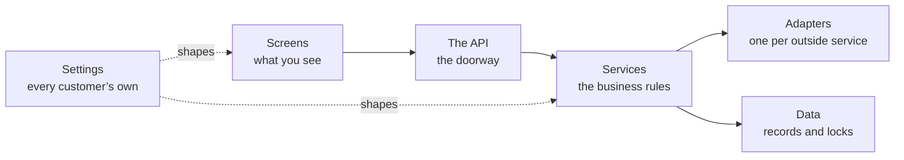

# Medhava — the build guide

**How this platform is designed and built.**

14 parts · 49 decisions · 19 technical layers · compiled 2026-08-24

---

## What this document is

**This describes a design. Nothing in it exists yet, and nothing in it claims to.** Every part is a
decision to be made and built. Where it says *done when*, that means the decision is made, written
down and proven by a test — not that something is running.

It is written for whoever builds the platform. A business using the platform installs nothing and
needs none of this; onboarding one is a separate document written for a reader with no terminal.

**Every technical word is explained the first time it appears**, in plain language, with an everyday
comparison where one helps. No prior knowledge is assumed anywhere in this document.

---

## The two rules everything obeys

**1 · No capability depends on one tool.** Every one of the 19 layers names what it is built
on, **57 named replacements** between them, and the interface the rest of the code talks to.
That last part is what makes switching a settings change rather than a rewrite. A check refuses any
layer with fewer than two alternatives or no interface, so the rule cannot quietly rot into a
paragraph nobody kept.

**2 · Nothing is static, and the past stays correct.** A customer can add, edit or remove anything at
any time, and it takes effect at once. Every change carries the date it starts from and who made it,
and is added rather than written over. So a supervisor can leave on Tuesday and a replacement start on
Wednesday, changed the same morning — and last month’s payroll, already paid, does not move by a
rupee. *Purana record mitta nahin; naye date se naya rule lagta hai.*

Part 13 lists all 18 things a customer can change, and the 6 that can never be switched
off.

---

## Part 0 · What you are building

One piece of software that many separate businesses use at the same time, each seeing only
its own information, each seeing it in its own words.

The businesses will not resemble each other. A steel plant, a clothing manufacturer, a car maker, a
retail chain, an education company, a single creator selling courses — all of them, on the same code.
That is the whole design problem, and every decision in this document exists to serve it.

**The trap to avoid is building one system and then bending it.** The moment a customer needs a
change and the answer is "we will add a setting for you", the software has started to fork, and in
two years there are as many versions as customers. The way out is to decide early that the things
that differ between businesses are **data**, not code — their words, their steps, their extra fields,
their documents, which parts they use at all — and that the code is the same for everyone, forever.

> **platform** — One piece of software that many separate businesses use at the same time, each seeing only its own information. *Ek badi building jisme bahut saare offices hain. Building ek hai, par har office ki chaabi alag — koi kisi aur ke office mein nahin ghus sakta.*
>
> **tenant** — One business using the platform. Its people, its data and its settings are its own. *Us building mein ek office. Aapka office, aapka saamaan, aapka taala.*
>
> **module** — One area of work in the system — sales, purchase, staff, accounts. Each is a set of screens that belong together. *Dukaan ke alag-alag counters. Ek counter bikri ka, ek kharidi ka, ek hisaab-kitaab ka.*

#### 0.1 · Write down what is code and what is data, before writing any code

This is the most expensive decision in the project and the cheapest one to get right at
the start. Anything on the "data" side can be changed by a customer, in the app, in a minute. Anything
on the "code" side needs a developer and a release. Put something on the wrong side and you either
ship a rigid product or an unmaintainable one.

| This is data — the customer changes it | This is code — the same for everyone |
|---|---|
| What they call things | That records have to name their owner |
| The steps their work moves through | That money is exact |
| Extra fields on any record | That every change is recorded |
| Which modules they use | How the modules work |
| Their companies, channels, locations | That one business cannot read another |
| Their documents and numbering | The rulebook the books rely on |
| Which outside services they connect | The shape of the connection |

**Done when:** The two lists exist and the team agrees on them. Every later argument about a feature starts by asking which column it belongs in.

#### 0.2 · Adopt the two rules that everything else obeys

Both exist because of the same fear: that in three years you cannot change something you
need to change. One is about the tools underneath you. The other is about the business on top.

| Rule | What it means in practice |
|---|---|
| **No capability depends on one tool** | Every layer names one default so work can start, at least two replacements, and the interface the rest of the code talks to. Swapping is a settings change, never a rewrite. |
| **Nothing is static, and the past stays correct** | A customer can add, edit or remove anything, any time, taking effect at once. Every change carries the date it starts from — so last month’s figures do not move. |

> The second rule is the harder one and it is worth being blunt about why. A system that
> lets you overwrite freely will happily change a payroll total for a month you already paid out. A
> system that locks the past makes you phone a developer when a supervisor quits on a Tuesday. The
> effective date is what gives you both: *purana record mitta nahin, naye date se naya rule lagta hai.*

**Done when:** Both rules are written into the project’s working agreement, and there is a check that fails the build when either is broken.

#### 0.3 · Decide the shape: one code base, many businesses, one database

> **row-level security** — A lock inside the database itself, so one business physically cannot read another business’s records — even if the software above it has a bug. *Taala darwaze pe nahin, tijori pe. Guard so bhi jaaye toh bhi tijori band rehti hai.*
>
> **database** — Where all the information is kept, arranged so any of it can be found instantly and nothing gets lost. *Ek badi almari jisme har cheez apne fix khaane mein rakhi hai — dhoondhne ke liye poori almari palatni nahin padti.*

Three ways exist to serve many businesses. Give each its own copy of everything —
simple at three customers, unmanageable at fifty, because every fix has to be applied fifty times.
Give each its own database — safer-feeling, but a change to the shape of the data has to run
everywhere and one of them will fail while the others succeed. Or keep everyone in one database with
a lock at the record level, which is one system to fix, one shape to change, and one thing that must
be got exactly right.

**Done when:** The choice is written down with its consequence stated: the record-level lock is now the single most important piece of code in the system, and it is tested before anything is built on top of it.

---

## Part 1 · The shape of the whole thing

Before any single piece, the map. Six layers, each talking only to the one below it, so a
change in one does not ripple through the rest.

#### 1.1 · Separate the six layers and keep them separate

> **frontend** — The part you see and click — the screens, the buttons, the forms. *Hotel ka dining hall aur menu card. Jo aapke saamne hai.*
>
> **backend** — The part of the software you never see, which does the actual work — checks the rules, saves the records, calculates the totals. *Hotel ka kitchen. Customer nahin dekhta, par khaana wahin banta hai.*
>
> **API** — The agreed way two pieces of software talk to each other, so one can ask the other for something and get a predictable answer. *Waiter. Aap kitchen mein nahin jaate — waiter ko order dete ho, wahi khaana le aata hai. Waiter badal jaaye toh bhi order dene ka tarika wahi rehta hai.*
>
> **adapter** — A small piece of code that translates between the system and one outside service, so the rest of the system never has to know which service is in use. *Travel adapter. Andar ka appliance wahi, bas plug ko us desk ke socket ke hisaab se badal diya.*

The reason for layers is not tidiness. It is that a layer with a clear edge can be
replaced without touching anything else, and a layer whose edges have blurred cannot be replaced at
all. Most systems that become impossible to change did not decide to be — they just let the screens
start talking directly to the database, one shortcut at a time.

| Layer | What lives there | What it must never do |
|---|---|---|
| Screens | What the user sees and clicks | Contain a business rule, or reach the database directly |
| The API | The doorway the screens knock on | Decide anything — it only carries requests |
| Services | The business rules. The real system | Know which outside company provides anything |
| Adapters | One per outside service | Contain a business rule |
| Data | The records, and the locks on them | Trust the layers above it |
| Settings | Every customer’s own configuration | Ever require a release to change |

**Done when:** The layer boundaries are agreed and there is a check that fails when the code of one layer mentions another it should not know about.

#### 1.2 · Put every business rule in one place, away from everything replaceable

The rules are the only part of this system that is genuinely yours. Frameworks change,
databases get swapped, the screen library goes out of fashion. If the rule that says a dispatch cannot
exceed what was ordered lives inside a screen or inside a database feature, it dies with that thing.
Written as plain functions that take values and return decisions, it outlives all of them — and it can
be tested without starting a database or opening a browser.

**Done when:** A rule can be tested by calling it directly, with no database, no browser and no network. If a test for a rule needs any of those, the rule is in the wrong place.

#### 1.3 · Forbid any outside company’s code inside the business rules

> **provider** — A company whose service the system uses — for messages, for payments, for artificial intelligence, for delivery. *Supplier. Ek supplier maal na de toh doosre se le lo — kaam nahin rukna chahiye.*
>
> **interface** — A written promise about what a part of the system does, without saying which product does it — so the product underneath can be swapped without anything above noticing. *Bijli ka socket. Socket ka size fix hai; usme koi bhi company ka plug lag jaata hai.*

The instant a service calls a payment provider or a messaging provider directly, that
provider is welded into your system. Every alternative listed in any document becomes decorative,
because reaching it means finding and rewriting every mention. The adapter layer exists precisely to
hold that damage in one small, replaceable place.

**Done when:** A search for any provider’s name outside the adapters folder returns nothing, and that search runs automatically on every change.

---

## Part 2 · The database — where everything is kept

The most important layer, and the one where mistakes are least recoverable. A wrong screen
is a bad afternoon; a wrong data shape is a year of workarounds.

> **schema** — The written plan of what information the system keeps and how the pieces connect. *Makaan ka naksha. Deewar uthane se pehle kaagaz pe tay hota hai kaunsa kamra kahaan hai.*

**The database — Keeps every record — customers, orders, stock, vouchers — and answers questions about them.**

PostgreSQL is open source, runs anywhere, and has the two things this design needs
built in: locks at the record level so one business cannot read another’s rows, and exact whole-number
arithmetic so money never drifts. Any managed Postgres service is a hosting decision, not a database
decision — the same schema runs on all of them.

| This layer | The database |
|---|---|
| **Built on** | PostgreSQL |
| **Can be replaced with** | A managed Postgres service — same database, somebody else runs the machine |
|  | Postgres on your own server — the software is free, you supply the machine |
|  | MySQL or MariaDB, if a team already knows them well — the schema needs rework for the record-level locks |
| **Everything talks to** | `DatabaseService` |
| **Switching costs** | Moving between Postgres hosts is a dump and a restore. Moving off Postgres entirely means rewriting the isolation layer, which is the one part worth not moving. |

#### 2.1 · Build the lock between businesses first, before anything else

> **table** — One kind of information inside the database — all your customers in one, all your orders in another. *Almari ka ek khaana. Ek khaane mein sirf customers, doosre mein sirf orders.*
>
> **row** — One single record — one customer, one order, one payment. *Register mein ek line. Ek line matlab ek entry.*

Everything else in this document assumes it. If it is added later, every table you have
created by then has to be revisited, and the one that gets missed is the one that leaks. It also has to live in
the database rather than only in the application, because the application will one day have a bug and
the lock has to survive it.

> **Careful.** Test the case where no business is selected at all. Depending on how the setting is read,
> that either refuses or quietly returns **everything** — and the second one is a silent, total leak
> that every other test would pass straight over.

**Done when:** A test creates two businesses with real records, asks for the other one’s record by its
exact identifier, and gets nothing back. The same test, run with the lock removed, fails — because a
test that has never failed has not been shown to test anything.

#### 2.2 · Give every business record the same standard columns

> **audit trail** — An automatic record of every change — what changed, who changed it, and when. *Har entry ke saath naam aur time apne aap likha jaata hai. Baad mein koi bole "maine nahin kiya", toh register bata deta hai.*

Repetitive on purpose. Every business table carries the same handful of columns for who
owns the record, when it was made, who made it, when it last changed, and whether it has been ended.
Doing this everywhere means every feature that depends on them — history, undo, audit, reporting —
works everywhere, instead of working on the tables somebody remembered.

| Column | What it is for |
|---|---|
| identifier | Names this one record, unique across the whole system |
| company | Which of the customer’s companies it belongs to |
| created at / created by | When, and by whom |
| updated at / updated by | The same for the last change |
| ended at | Set when a record stops applying. **Never deleted** |
| version | Stops two people silently overwriting each other |

**Done when:** A check reads the schema and fails if any business table is missing one of these.

#### 2.3 · Store money as whole units, never as a decimal

> **integer paise** — Money stored as a whole number of paise instead of a decimal, so amounts are exact and rounding can never quietly lose a rupee. *Paisa hamesha poore paise mein ginte hain, aadha-adhoora kabhi nahin — isliye hisaab kabhi ek rupya idhar-udhar nahin hota.*

Decimal arithmetic on money loses fractions in ways nobody can trace. Every amount is a
whole number of paise, and every column carrying money says so in its name so a value can never be
read as rupees by mistake. Converting for a report is a division by a hundred of an exact number —
there is no rounding decision left to get wrong.

**Done when:** A check fails if any money column is a decimal type, and the arithmetic is proven with a test that would fail under decimals.

#### 2.4 · Make every changeable value effective-dated, and append-only

> **effective date** — The date a change starts applying from. Records made before it keep the old value; records after it use the new one. *Naya rate 1 tarikh se lagu. Purane mahine ka bill purane rate se hi banega — woh apne aap nahin badlega.*

This is the mechanism that gives a customer complete freedom without breaking their
history. A rate, a role, a person’s position, a tax percentage — none is a single value. Each is a
list of values with the date each started applying. Asking "what was the rate on the 3rd of last
month" is then an ordinary question with an exact answer, rather than an archaeology project.

| Column | What it is for |
|---|---|
| what | The thing being set — a rate, a role, a position |
| who it applies to | The person, the item, the company |
| value | What it became |
| from date | When it started applying |
| to date | Empty means still in force |
| changed by | The person who made the change |

> Two rows covering the same date for the same thing is a data error, not a preference.
> The check for it runs on write, because by the time it shows up in a report the wrong number has
> already been paid to somebody.

**Done when:** A report for a past month is run twice — once before a rate change and once after — and
returns the identical figure both times.

#### 2.5 · Record every change automatically, with no way to switch it off

Not a feature — a foundation. A dispute about what a figure was six months ago is answered
by the record or it is not answered at all. Because it cannot be disabled, nobody has to remember to
enable it, and no configuration mistake can quietly remove it.

**Done when:** Changing any record writes a history entry naming what changed, from what, to what, by whom and when — and there is no setting anywhere that stops it.

---

## Part 3 · The backend — where the work actually happens

The part nobody sees, which does everything that matters: checks the rules, saves the
records, calculates the totals, and refuses what should be refused.

**The backend runtime — Runs the business rules, checks permissions, writes records and calculates totals.**

The same language runs on the browser side, so one team can work across the whole system
and code that validates a form can be shared with the code that validates the saved record — no rule
gets written twice and no two versions of it drift apart.

| This layer | The backend runtime |
|---|---|
| **Built on** | Node.js with TypeScript |
| **Can be replaced with** | Any container host — the code is ordinary and carries no host-specific parts |
|  | Python or Go for a service that genuinely suits them, talking over the same API |
|  | A different Node framework — the business logic sits outside the framework on purpose |
| **Everything talks to** | `the HTTP API contract` |
| **Switching costs** | Low, because the rules live in plain functions rather than inside a framework. Moving a service means moving the functions and putting a different door in front of them. |

#### 3.1 · Organise the backend by what it does, not by what technology it uses

Group the code by business area — sales, stock, payroll, accounts — rather than by
technical type. A person fixing how a discount works then opens one folder instead of five, and a
whole area can be lifted into its own service later without unpicking it from everything else.

**Done when:** Someone new can find where a business rule lives from the name of the business area alone, without being told.

#### 3.2 · Make one action do all of its consequences, or none of them

A sale reduces stock, raises an invoice, posts to the ledger and updates what the customer
owes. If three of those succeed and one fails, the books are wrong and nobody knows. All of it happens
together or none of it does — and the middle state never exists, even for a moment, even if the
machine loses power in between.

**Done when:** A test interrupts an action half way through and confirms the records are exactly as they were before it started.

#### 3.3 · Design the API so a screen never decides anything

Screens exist on phones, on laptops, and eventually in places nobody planned for. Every
one of them must reach the same rules. The moment a screen calculates a total or decides whether an
approval is needed, that logic has to be repeated in the next screen — and the two will disagree.

**Done when:** Every calculation and every permission decision can be reproduced by calling the API directly, with no screen involved.

#### 3.4 · Make the API answer honestly when something is refused

A refusal is information. "Not allowed" tells a user nothing and generates a support call;
"this dispatch is 12 more than the order allows" tells them what to do. And a refusal caused by
somebody else’s change must say so, rather than looking like their own mistake.

**Done when:** Every refusal names what was refused and why, in words a user can act on without phoning anyone.

---

## Part 4 · The frontend — the screens, drawn from settings

The single idea that makes one system serve every industry: **screens are described as
data, not written one by one.** A screen definition says which fields, in what order, with what
labels, under what conditions. Change the definition and the screen changes — no code, no release.

**The frontend — Everything a person sees and clicks — screens, forms, tables, dashboards.**

Screens are drawn FROM SETTINGS rather than written one by one. A tenant that renames a
field, adds a column or turns a module off gets a different screen with no new code written — which
is the only way one system can serve a steel plant and a single creator without becoming two systems.

| This layer | The frontend |
|---|---|
| **Built on** | React with TypeScript, screens generated from configuration |
| **Can be replaced with** | Vue or Svelte — the screen definitions are plain data and do not care what draws them |
|  | Server-rendered pages where speed on a weak connection matters more than interaction |
|  | A native mobile shell reading the same screen definitions |
| **Everything talks to** | `the screen definition format` |
| **Switching costs** | Moderate, and bounded: what a screen contains is data, so a rewrite replaces the painter, not the paintings. |

#### 4.1 · Describe screens as settings rather than building them individually

Hand-built screens are the reason most business software cannot be customised. Every
customer request becomes a code change, and the code grows a branch for each customer until nobody
can safely change anything. If the screen is a description, a customer adding a field is a new line in
their own settings — and it affects nobody else at all.

| A screen definition says | So a customer can |
|---|---|
| Which fields appear, and in what order | Hide what they do not use, promote what they do |
| What each field is called | Use their own trade’s words |
| Which are required | Enforce their own discipline |
| Which extra fields they added | Record what only they need |
| What the columns and filters are | See their work the way they think about it |
| Which actions the buttons offer | Match their own process |

**Done when:** Adding a field to a screen for one customer is done in the app, takes effect at once, and changes nothing for any other customer.

#### 4.2 · Build one design system and use it everywhere

Every screen drawn from the same set of parts means the system feels like one product
rather than twenty. It also means an improvement to a table — better sorting, better behaviour on a
phone — arrives everywhere at once instead of being reimplemented per screen.

**Done when:** A new screen can be assembled from existing parts without writing new visual code.

#### 4.3 · Design for a bad connection and a small screen first

The people entering most of the data are not at a desk. They are on a shop floor, in a
godown, on a site, on a phone, on a connection that comes and goes. A screen that only works on a
fast laptop connection is a screen that does not get used, and the data it should have captured gets
written on paper instead.

**Done when:** Every screen that captures data is usable one-handed on a phone, and says clearly what happened if the connection dropped mid-save.

#### 4.4 · Let a customer turn whole modules on and off

A creator selling courses has no godown. A steel plant has no reels to publish. Showing
everybody every module makes the product look bloated to all of them and correct for none. The menu is
a setting, so each business ends up with a system that looks built for it.

**Done when:** Turning a module off removes it from the menu and keeps every record it ever held — tidying a menu never destroys data.

---

## Part 5 · Storage and memory — files, speed, and what is remembered

Three different things that get confused with each other: where files live, what is kept
handy for speed, and what the assistant is allowed to know.

> **storage** — Where files are kept — photographs, invoices, scanned documents. Different from the database, which keeps information rather than files. *Almari ke bagal wala godown. Register almari mein, par bade dabbe aur photo godown mein.*
>
> **cache** — A small, fast copy of information that was just looked up, kept ready in case it is asked for again. *Counter pe rakha hua sabse zyada bikne wala saamaan. Har baar godown tak jaana nahin padta.*

**File storage — Keeps photographs, invoices and scanned documents — the things too big to sit in the database.**

Almost every file service speaks the same request format, so one adapter reaches most of
them. That makes this the cheapest layer in the whole system to change your mind about.

| This layer | File storage |
|---|---|
| **Built on** | Any S3-compatible object store |
| **Can be replaced with** | A different S3-compatible provider — usually a URL and a key change |
|  | Files on your own server’s disk, with a backup copy elsewhere |
|  | A self-hosted object store such as MinIO, which speaks the same format |
| **Everything talks to** | `FileStore` |
| **Switching costs** | Copy the files across and change the address. Nothing above this layer notices. |

#### 5.1 · Keep files outside the database, and never trust their names

Photographs and scans are large, and a database is an expensive place to keep large
things. They go in a file store, with the database holding only a reference. A file also arrives from
outside, so its name and its claimed type are somebody else’s input: both are checked, and the file is
stored under a name the system chose.

**Done when:** A file can be uploaded, fetched and deleted through one interface, and swapping the file store underneath changes one setting.

#### 5.2 · Make every file access ask permission, every time

The most common serious leak in business software is a file link that works for anybody
who has it. A photograph of a signed document is as sensitive as the record it belongs to, and it
must inherit exactly the same permission, checked on every single fetch.

**Done when:** A link to another business’s file, used by someone from a different business, is refused — proven by a test that tries it.

#### 5.3 · Use the cache only for things that can be safely lost

The cache exists to make common screens fast. The moment anything is kept **only** in the
cache, restarting it loses data — and caches get restarted routinely. Everything in there is a copy;
losing the whole thing costs a slow minute and nothing else.

**Done when:** The cache can be wiped completely while the system is running, and nothing is lost but speed.

#### 5.4 · Decide exactly what the assistant may remember, and for how long

> **model** — The piece of artificial intelligence that reads or writes text, tags a photograph, or answers a question. *Ek bahut padha-likha assistant. Kaam accha karta hai, par har baat pe usse poochho toh kharcha aur waqt dono lagta hai.*

An assistant that answers questions about a business needs to see that business’s data —
and must never see another’s, must never keep it after the question is answered, and must never learn
from it in a way that could surface it elsewhere. This is a decision to make deliberately at design
time, because discovering it later means discovering it the wrong way.

| May remember | May never |
|---|---|
| The current conversation, until it ends | Cross a business boundary, ever |
| What the user is looking at right now | Retain business data after answering |
| Settings and vocabulary for this business | Be used to train anything |
| A saved answer the user chose to keep | Hold a password, a key or a card number |

**Done when:** The retention rules are written down, enforced in code, and a test proves one business’s question cannot reach another’s data.

---

## Part 6 · Sign-in and permissions

Two separate questions kept deliberately apart: who are you, and what may you do. The first
can be handed to somebody else. The second never can.

> **authentication** — Proving you are who you say you are, usually by signing in. *Gate pe pehchaan dikhana. "Main kaun hoon" wala sawaal.*
>
> **role** — What a person is allowed to see and do — a manager sees more than a counter staff member. *Chaabi ka guccha. Manager ke paas zyada chaabiyaan, staff ke paas kam.*
>
> **permission** — One specific thing a role is allowed to do, like approving a discount or viewing salaries. *Guchhe ki ek chaabi. Ek chaabi ek darwaza.*

**Sign-in and permissions — Proves who somebody is, then decides what they are allowed to see and change.**

Who you are and what you may do are kept apart deliberately. Sign-in can be handed to an
outside service — or to a customer’s own company login — while permissions stay ours, because they
depend on the company and role structure no outside service knows about.

| This layer | Sign-in and permissions |
|---|---|
| **Built on** | Sessions issued by the platform, with permissions checked in the backend and again in the database |
| **Can be replaced with** | An identity provider for sign-in only, with permissions still decided here |
|  | A customer’s own company sign-in, for enterprises that require it |
|  | Self-hosted Keycloak or Authentik, when nothing may leave the building |
| **Everything talks to** | `IdentityService` |
| **Switching costs** | Low for sign-in, by design. Permissions never move, so the expensive half is never in play. |

#### 6.1 · Separate proving who somebody is from deciding what they may do

Large customers will insist on using their own company sign-in, and that is reasonable —
it is how they remove access when somebody leaves. But no outside sign-in system knows that this
person may approve purchases up to a limit in one of your companies and only view stock in another.
That decision stays here, always.

**Done when:** Sign-in can be switched to an outside provider without any change to how permissions work.

#### 6.2 · Make permissions specific to the company, not just the person

Somebody who works across two companies in a group is not the same person in both. Giving
one blanket level of access across a group is how a figure from one company ends up in a report for
another, and it cannot be untangled afterwards.

**Done when:** A user working in two companies sees exactly what their role allows in each, and this is proven by a test that tries to cross.

#### 6.3 · Check permission in the backend and again in the database

Hiding a button is not security — it is tidiness. The check that matters happens where the
data is. Two layers, because one layer is one mistake away from an incident, and the layers fail
independently.

**Done when:** A request that bypasses the screens entirely is still refused, proven by calling the API directly with a role that should not be allowed.

---

## Part 7 · Talking to the outside world

Messages, storefronts, marketplaces, couriers, payments. Every one is somebody else’s
system, every one will change without warning, and every one will be down at some point. The design
assumes all three.

**Messages to customers and staff — Sends WhatsApp messages, text messages and email — reminders, confirmations, statements.**

**Each tenant connects its own accounts.** The platform is built with a place for them to
plug in and never holds one central account of its own — a business’s conversations with its own
customers belong to that business. The platform’s job is the plug, not the account.

| This layer | Messages to customers and staff |
|---|---|
| **Built on** | A message service with one adapter per provider, per tenant |
| **Can be replaced with** | Any WhatsApp provider — the adapter changes, the code that decides what to send does not |
|  | Text message and email as fallbacks when a message cannot be delivered |
|  | A shared inbox or an export, for a tenant with no messaging account at all |
| **Everything talks to** | `MessageService` |
| **Switching costs** | One adapter per provider. Switching is a settings change made by the tenant, not a release made by us. |

#### 7.1 · Build the plug, not the account — every connection belongs to the customer

**This is worth being exact about.** The platform needs no messaging account, no
marketplace seller account and no payment account of its own. A business’s conversations with its own
customers, and its own selling accounts, belong to that business. What the platform provides is the
place to plug them in, and the code that knows how to talk to each kind.

Building it the other way — one central account that everyone shares — makes the platform the account
holder for other people’s customers, and makes every customer dependent on a relationship they have no
control over.

**Done when:** A customer connects their own accounts in the app, and the platform holds no account of its own for any of these.

#### 7.2 · Give every capability an ordered fallback, ending somewhere that needs nothing

> **fallback** — The next option the system automatically moves to when the first one fails or is unavailable. *Bijli gayi toh inverter. Inverter gaya toh mombatti. Andhera kabhi nahin hota.*
>
> **circuit breaker** — A switch that takes a repeatedly failing service out of use for a while, instead of retrying it endlessly and slowing everything down. *Ghar ka MCB. Baar-baar fault aa raha hai toh woh line hi kaat deta hai, poora ghar band nahin hota.*

A courier service stops answering at nine at night. A messaging provider hits a limit
mid-broadcast. A model provider runs out of quota half way through. In each case the work must
continue down the list rather than stop — and the last item must be something that needs no outside
service at all, even if that means a manual step. That last item is what turns an outage into an
inconvenience.

**Done when:** Every capability has a written fallback order whose final entry needs nothing bought or connected, and a test proves the work completes when the first choice is unavailable.

#### 7.3 · Stop hammering a service that keeps failing

When an outside service is broken, retrying it constantly makes everything slow while
achieving nothing. After a few failures it is taken out of the list, the work moves to the next
option, and it is tried again once after a pause.

**Done when:** A provider failing repeatedly is taken out of use automatically, and returns by itself once it recovers.

#### 7.4 · Never let an outside system be the source of a figure the business reports

Numbers come from your own records. An outside service can tell you a payout happened;
what that payout **means** to your books is decided here, from your own data, against what you
expected. Otherwise a mistake in somebody else’s system silently becomes a mistake in your accounts.

**Done when:** Every figure in every report can be traced to a record in this system, never to an outside response that was taken on trust.

---

## Part 8 · Work that happens on its own, and finding things

Nobody should watch a progress bar while a thousand messages send or a month closes.

> **queue** — A waiting line for work that does not have to finish this second — sending a hundred messages, building a big report. *Darzi ki dukaan ka parchi system. Kaam parchi pe likh ke lag gaya line mein; customer khada intezaar nahin karta.*
>
> **job** — One piece of work taken off the queue and done in the background. *Line mein se uthayi gayi ek parchi, ab uska kaam ho raha hai.*

**Background work — Does the things nobody should have to wait for — sending a thousand messages, building a month-end report, pulling orders overnight.**

Every job is written so that running it twice does the same thing as running it once. That
single discipline is what makes it safe to retry after a failure, and it is worth more than any
particular queue product.

| This layer | Background work |
|---|---|
| **Built on** | A queue backed by the database, with named workers |
| **Can be replaced with** | A Redis-backed queue when volume outgrows the database |
|  | A hosted queue service, behind the same interface |
|  | An external workflow tool such as n8n for steps a non-programmer should be able to edit |
| **Everything talks to** | `JobQueue` |
| **Switching costs** | Low. Jobs are plain functions with a name; the queue only decides when they run. |

#### 8.1 · Make every background job safe to run twice

Machines restart, connections drop, and a job that was half done gets picked up again.
If running it twice sends the message twice or posts the payment twice, every failure becomes a
cleanup. Written so that running it again reaches the same result, a failure becomes a retry.

**Done when:** Every job is run twice deliberately in a test, and the result is identical to running it once.

#### 8.2 · Let a job that fails be seen, understood and retried

A job that fails silently is worse than one that fails loudly — the work simply never
happened and nobody finds out until a customer asks. Failures are visible, keep the reason, and can be
retried without a developer.

**Done when:** A failed job appears in a screen with its reason, and an admin can retry it.

#### 8.3 · Start with the database for search, and keep records the source of truth

> **search index** — A prepared list that makes finding things fast, the way the index at the back of a book beats reading every page. *Kitaab ke peeche wali index. Poori kitaab padhne ki zaroorat nahin, seedha page number mil jaata hai.*

A separate search engine is another thing to run, back up and keep in step. The database
can search well enough for a long time. When a separate engine is eventually needed, it is a faster
copy — never the place the records live — so it can be rebuilt from scratch at any time.

**Done when:** Search can be turned off entirely and every record remains reachable, if less conveniently.

---

## Part 9 · The artificial intelligence layer

Useful for writing descriptions, tagging photographs, summarising and answering questions.
Dangerous when it becomes something the business cannot operate without, or a bill nobody capped.

> **spend ceiling** — A maximum amount the system is allowed to spend on paid services, after which it refuses to spend more instead of warning you. *Jeb mein utne hi paise leke nikle jitna kharch karna hai. Khatam matlab khatam — udhaar nahin.*

**Artificial intelligence — Writes descriptions, tags photographs, summarises, and answers questions about your own data.**

Ordered fallback, a breaker on anything failing repeatedly, and a spend ceiling that REFUSES
rather than warns. Because every capability also has an option that costs nothing, a spent budget can
stop the spending without ever stopping the business.

| This layer | Artificial intelligence |
|---|---|
| **Built on** | A router in front of several providers, ending on one that needs nothing bought |
| **Can be replaced with** | Any hosted model provider — an entry in the router, not a change to the system |
|  | A model running on your own machine, for work that is routine or private |
|  | Templates and rules with no model at all, which must always remain the last resort |
| **Everything talks to** | `ModelRouter` |
| **Switching costs** | A list entry. The router exists precisely so changing provider is never a project. |

#### 9.1 · Put a router in front of every model, never call one directly

Providers change price, change quality, change terms and disappear. A router means the
system asks for a capability — "write a description", "tag this photograph" — and the router decides
who does it, in what order, and what happens when one fails. Adding or removing a provider is a list
entry.

**Done when:** Adding a new provider requires no change to any business rule, and removing one changes nothing but the list.

#### 9.2 · Cap the spending, and make the cap refuse rather than warn

A warning arrives after the money is gone. The ceiling is checked before each paid call,
and over it the paid provider is simply refused — the work then completes on an option that costs
nothing. Because every capability is guaranteed a free path, a spent budget stops the spending without
ever stopping the business.

**Done when:** With the ceiling set to zero, every capability still completes its work, proven by a test that sets it to zero and runs the full set.

#### 9.3 · Never let a model decide anything that moves money or stock

A model is good at language and unreliable about facts. It may draft, suggest, classify
and summarise. It may not approve a payment, adjust a stock figure, post to the ledger or change a
price by itself. The line is not about how good the model is — it is that a wrong number produced by a
person can be traced to a decision, and a wrong number produced by a model cannot.

**Done when:** An assistant asked to move money declines and produces a request for a person to approve. This is tested by asking it to.

#### 9.4 · Make every answer traceable to the records it came from

An assistant that answers "your best-selling item last month" must be answerable when
somebody disagrees. Every answer carries what it looked at, so a wrong answer is a question about the
data rather than a mystery.

**Done when:** Every assistant answer can be expanded to show the records behind it, and those records can be opened.

---

## Part 10 · Running it

Getting it built is half. Being able to change it every week for years without fear is the
other half, and it is the half that decides whether the product survives.

> **environment** — A separate running copy of the system — one for trying things, one that customers actually use. *Rehearsal aur asli show. Practice alag jagah, taaki galti sabke saamne na ho.*
>
> **deployment** — Putting a new version of the software in place so people start using it. *Nayi dukaan kholna ya purani ko naya roop dena — jab tak shutter nahin uthta, customer ko farq nahin padta.*
>
> **continuous integration** — A robot that checks every change automatically, before anyone can put it live. *Quality-check wala banda gate pe khada. Har maal nikalne se pehle usse guzarta hai.*
>
> **rollback** — Putting the previous working version back, quickly, when a new one turns out to be wrong. *Naya taala kharab nikla toh purana taala wapas laga do — do minute ka kaam.*
>
> **observability** — Being able to see what the system is doing and what went wrong, without guessing. *Dukaan mein CCTV aur register. Kuch gadbad ho toh dekh sakte ho ki hua kya, andaaza nahin lagana padta.*

**Source control and automatic checks — Keeps the history of every change and runs every test before anything goes live.**

Git itself is the thing that matters, and git is not owned by anybody. The host is a convenience.

| This layer | Source control and automatic checks |
|---|---|
| **Built on** | Git, with automatic checks on every change |
| **Can be replaced with** | A different hosting service — a git repository moves with one command |
|  | Self-hosted Gitea or Forgejo |
|  | A separate build service reading the same repository |
| **Everything talks to** | `the test commands themselves` |
| **Switching costs** | Very low. The checks are ordinary commands, so any system that can run a command can run them. |

#### 10.1 · Keep separate copies for trying things and for real customers

Nobody should learn that a change breaks payroll by watching it break a real payroll. A
practice copy carries realistic but not real data, so mistakes cost an afternoon rather than a
customer.

**Done when:** A change can be tried end to end somewhere that no customer can see.

#### 10.2 · Make a robot check every change before a person can release it

Human review catches design mistakes. It does not reliably catch that a change broke
something three modules away. Automatic checks do, on every single change, without getting tired or
being in a hurry on a Friday evening.

**Done when:** No change reaches customers without every check passing, and this cannot be skipped by anyone.

#### 10.3 · Be able to put the previous version back in minutes

Something will get through. What separates a scare from an incident is how fast the last
working version can return. If going back is difficult, the pressure will be to fix forward under
stress, which is how a small problem becomes a large one.

**Done when:** Going back to the previous version is one command, practised at least once before anyone depends on it.

#### 10.4 · Package it so it can run anywhere

The moment something host-specific gets in, the hosting choice is locked and moving means
a project. Packaged as an ordinary container with nothing host-specific inside, moving is a decision
rather than an undertaking.

**Done when:** The same package runs on a laptop, on a rented server, and on a managed platform, with only settings differing.

#### 10.5 · Be able to see what is happening without guessing

When something is slow or wrong at four in the afternoon with customers waiting, the
question is where — and guessing is expensive. Structured records of what happened, how long it took
and what failed turn that into a lookup.

**Done when:** A failure can be traced from the user’s click to the exact operation that failed, without adding new logging first.

#### 10.6 · Back it up, and prove the backup by restoring it

> **backup** — A copy of everything, kept somewhere else, so a mistake or a failure does not lose your work. *Zaroori kaagzaat ki photocopy, doosri jagah rakhi hui. Asli jal jaaye toh bhi kaam nahin rukta.*

An untested backup is a belief, not a protection. The only proof is a restore into a
scratch copy, done deliberately, before it is ever needed.

**Done when:** A backup has been restored into a scratch environment and checked, and that is repeated on a schedule.

---

## Part 11 · Security, stated plainly

Short, because these are absolutes rather than preferences.

#### 11.1 · Never ask anyone for a marketplace, bank or account password

Every connection is made with a key the customer creates and can withdraw. A password
hands over an account that cannot be taken back and cannot be limited. This is a promise the product
makes, so nothing in the software, the documents or a support conversation may ever break it.

**Done when:** No screen, no form and no support process anywhere asks for one, and the product says so openly.

#### 11.2 · Keep keys out of the code, always

> **encryption** — Scrambling information so that even somebody who steals the file cannot read it. *Apni hi code-bhasha mein likhna. Chori bhi ho jaaye toh padha nahin jaata.*

A key written into the code is in every copy of that code, forever, including copies you
no longer control. Kept outside, a key can be replaced in a minute.

**Done when:** A search of the whole history finds no key, and that search runs automatically on every change.

#### 11.3 · Treat identity documents and bank details as read-once, never stored

Identity and bank numbers may be needed for a calculation or a payment file. They are used
and not written into anything that is kept, because a stored copy is a liability that grows quietly
until the day it is stolen.

**Done when:** No committed file and no exported document contains an identity number, a bank account or a card number.

#### 11.4 · Let a person’s data be corrected and removed on request

Keeping a record for the law and removing a person’s data on request are two different
obligations that resolve differently, and a system with only one of them will breach the other.

**Done when:** Both are separate, recorded settings, and a request of either kind can be carried out and evidenced.

---

## Part 12 · What order to build it in

The order is not a preference. Each stage exists because the next one cannot be trusted
without it, and each finishes when a test proves it rather than when the code is written.

#### 12.1 · Finish a stage only when its test passes, never when its code is written

"Done" is the most abused word in software. A stage that is finished because somebody
believes it is finished will be discovered later, from the far side of three stages built on top of
it. A stage finished because a test proves it can be built on.

**Done when:** Every stage has one written test that decides it, agreed before the stage starts.

#### 12.2 · Build the modules in the order they are numbered

They are numbered in the order their dependencies allow. A product exists before it is
stock; a customer exists before a sale; demand exists before a purchase; stock exists before it moves;
the books exist before they close. Building out of order means inventing the thing you need and
correcting it later.

**Done when:** No module is started before the ones it reads from can supply real records.

### The modules, in the order they are built

22 modules. Module 01 is the spine — not something you open, the layer everything else
stands on — which is why 22 modules is also 21 you use plus one underneath them.

Each row says what has to exist before it can start, and how many rules it must satisfy before
it is finished.

| # | Module | Needs first | Rules to satisfy |
|---|---|---|---|
| 01 | Platform *(spine)* | Every module | 25 |
| 02 | Design & Sampling | CRM | 7 |
| 03 | Inventory & Catalog | Design & Sampling, Every module | 14 |
| 04 | CRM | Every module | 9 |
| 05 | Sales | Inventory & Catalog, CRM, Warehouse, Logistics | 18 |
| 06 | Planning & Requirements (MRP) | Sales, E-commerce / OMS, Inventory & Catalog | 8 |
| 07 | Purchase | Inventory & Catalog, Planning & Requirements (MRP), Manufacturing | 12 |
| 08 | Manufacturing | Purchase, Planning & Requirements (MRP), Design & Sampling | 20 |
| 09 | Quality & Compliance | Purchase, Manufacturing | 7 |
| 10 | Warehouse | Sales, E-commerce / OMS, Inventory & Catalog | 8 |
| 11 | Logistics | Sales, E-commerce / OMS, Warehouse | 11 |
| 12 | Accounting & GST | Every module | 24 |
| 13 | Treasury & Financial Planning | Accounting & GST, Sales, Purchase | 8 |
| 14 | Settlement | E-commerce / OMS, Accounting & GST | 13 |
| 15 | E-commerce / OMS | Inventory & Catalog, CRM, Sales, Accounting & GST, Logistics, Settlement | 19 |
| 16 | HR & Payroll | Manufacturing | 22 |
| 17 | Marketing | Inventory & Catalog, CRM | 10 |
| 18 | AI Content Engine | Inventory & Catalog | 11 |
| 19 | SEO, AEO & AIO | Inventory & Catalog, AI Content Engine | 6 |
| 20 | Projects & Collaboration | CRM, Sales, HR & Payroll, Inventory & Catalog | 9 |
| 21 | Dashboard & BI | Every module | 9 |
| 22 | AI Assistant, Agents & Automation | Every module | 15 |

**A module is finished when every rule for it is satisfied and proven by a test** — not
when its screens exist. Screens can be demonstrated; rules are what the books rely on.

---

## Part 13 · What a customer can change without you

The measure of whether this design succeeded. Everything in this table is changed by the
customer, in the app, taking effect immediately — and none of it requires a developer, a release or a
phone call.

**18 things, across 4 areas.** For each one, the column that matters
most is the last: what happens to records already made.

### People

| What changes | Who | Immediately | Records already made |
|---|---|---|---|
| Somebody joins — a worker, a supervisor, an office staff member, a contractor | Admin, or an HR role | They exist from their start date and can be assigned work the same minute. | Nothing before their start date mentions them, because they were not there. |
| Somebody leaves, with or without notice | Admin, or an HR role | Marked as left from a date. Their sign-in stops, and no new work is assigned to them. Their record is kept, not deleted. | Every hour they worked, every piece they made and every rupee they were paid stays exactly as it was. Deleting the person would blank all of it and change months already closed — so the record remains and simply has an end date. |
| A replacement starts immediately, in the same position | Admin, or an HR role | Added with their own start date and given the position. Work in progress is reassigned to them from that date. No waiting, no release, no developer. | Work completed under the previous person stays credited to the previous person. Two people held the same position at different times, and every record knows which one applied when. |
| A pay rate, a piece rate or a salary changes | Admin, or an HR role | Applies from the date you set — which may be today, a future date, or a past one you are correcting. | Every completed period recalculates to the rate that applied then, not the new one. This is the single most important line in this register: a rate that silently applied backwards would change payments already made to real people. |
| What somebody is allowed to see and do | Admin | Takes effect on their next action. Screens they may no longer open stop opening. | Everything they did while they held the old permissions stays recorded, with the permissions they had at the time. |

### Structure

| What changes | Who | Immediately | Records already made |
|---|---|---|---|
| A new company is opened, or an existing one is closed | Admin | It exists immediately with its own name, trading name, code and document numbering. The group view includes it from that date. | Group figures for earlier periods are unchanged, because the company did not exist in them. |
| A new way of selling is added — a marketplace, a shop, a counter, an export desk | Admin | Orders can arrive through it the same day. It appears in every report that breaks figures down by channel. | Earlier reports keep their own columns. A channel that did not exist then does not appear then. |
| A godown, a shop, a unit or a stock point is added, renamed or closed | Admin | Stock can move to and from it immediately. | Stock movements already recorded keep pointing at it, under the name it had at the time. |
| Which parts of the system this business uses at all | Admin | Turned on, a module appears in the menu with its screens ready. Turned off, it disappears from the menu. A steel plant, a clothing brand and a single creator each end up with a different system built from identical code. | Turning a module off hides its screens and keeps its records. Nothing is destroyed by tidying a menu. |

### Your words

| What changes | Who | Immediately | Records already made |
|---|---|---|---|
| What the system calls things | Admin | Every screen, every report and every document changes wording at once. One business says order, another says job, another says matter, consignment, batch or booking — the record underneath is identical. | Documents already issued keep the wording they were issued with, because that is what the customer received. |
| Extra information you want to record that nobody else needs | Admin | Added to the screen immediately, with the type you choose — text, number, date, a list to pick from, a yes or no. Reportable from the moment it exists. | Older records simply have no value for it, which is the truth. They are never back-filled with a guess. |
| The steps your work moves through | Admin | Add a stage, rename one, reorder them or remove one. New work follows the new list from that moment. | Work already part-way through keeps the stage it is in, even if that stage has since been removed — a job does not teleport because somebody edited a list. |
| The layout and numbering of invoices, statements, labels and reports | Admin | The next document uses the new layout or the new numbering. | Documents already issued are never re-rendered. What the customer holds and what you hold stay identical. |

### Rules

| What changes | Who | Immediately | Records already made |
|---|---|---|---|
| Turning a discretionary rule on or off | Admin | Applies to the next transaction. One business requires an approval below a price floor; another does not — same software, different setting. | Transactions already posted are not re-judged against a rule that did not apply to them. |
| Who has to approve what, and above which amount | Admin | The next request follows the new path. | Requests already approved keep the path they went through, and the names of who approved them. |
| Tax rates and the categories they attach to | Admin, or an accounts role | Applies from its effective date, which for tax is set by law rather than by you. | Every invoice keeps the rate that applied on its own date. A return filed for an earlier period recalculates to that period’s rate — this is not a convenience, it is the only correct behaviour. |
| Which outside service is used for messages, payments, delivery or artificial intelligence | Admin | The next message, payment or shipment goes through the new one. | Everything already sent keeps the record of which service carried it, which is what you need when you query one. |
| The most the system may spend on paid outside services | Admin | Enforced immediately. Over the ceiling, the paid option is refused and the work completes on one that costs nothing. | Spending already recorded is unchanged. |

### What can never be switched off

Short on purpose. Every line is something a bank, an auditor, a customer or an employee
relies on, and a setting that could remove it would remove their protection too.

| Never changeable | Why |
|---|---|
| The audit trail | Who changed what, and when. A system where this can be switched off cannot be used to answer a dispute, so it cannot be switched off. |
| Every record naming the company it belongs to | Without it, figures from two companies merge and no report can be trusted again. |
| One business being unable to read another’s records | This is not a preference. It is the promise that makes a shared platform usable at all. |
| Money kept as exact whole units | The alternative loses fractions of a rupee in ways nobody can trace afterwards. |
| Deleting nothing — records are ended, never erased | An erased record changes a period that was already closed, filed and possibly audited. |
| Never asking for a marketplace, bank or account password | The system connects through proper keys that you can withdraw. A password would hand over an account you cannot take back. |

---

## Every layer, and what replaces it

The whole of Rule 1 on one page.

| Layer | Built on | Alternatives | Talks to |
|---|---|---|---|
| The database | PostgreSQL | 3 | `DatabaseService` |
| File storage | Any S3-compatible object store | 3 | `FileStore` |
| Cache and short-term memory | Redis, or a Redis-compatible store | 3 | `CacheService` |
| The backend runtime | Node.js with TypeScript | 3 | `the HTTP API contract` |
| The API | REST over HTTPS, with a written schema | 3 | `the published API schema` |
| The frontend | React with TypeScript, screens generated from configuration | 3 | `the screen definition format` |
| Background work | A queue backed by the database, with named workers | 3 | `JobQueue` |
| Search | PostgreSQL full-text search | 3 | `SearchService` |
| Sign-in and permissions | Sessions issued by the platform, with permissions checked in the backend and again in the database | 3 | `IdentityService` |
| Keys and passwords the system uses | Environment variables on the server, readable only by the service account | 3 | `ConfigService` |
| Messages to customers and staff | A message service with one adapter per provider, per tenant | 3 | `MessageService` |
| Storefronts and marketplaces | A channel adapter per storefront or marketplace | 3 | `ChannelAdapter` |
| Taking payments | A payment adapter per provider, with the card field hosted by the provider | 3 | `PaymentService` |
| Delivery and couriers | A courier adapter per carrier | 3 | `CourierService` |
| Artificial intelligence | A router in front of several providers, ending on one that needs nothing bought | 3 | `ModelRouter` |
| Where it runs | Containers on a virtual server | 3 | `the container image` |
| Source control and automatic checks | Git, with automatic checks on every change | 3 | `the test commands themselves` |
| Watching it | Structured logs and error reporting, in an open format | 3 | `Logger and the metric format` |
| Making documents | HTML templates printed to PDF by a headless browser | 3 | `DocumentRenderer` |

---

*Generated by `brand/delivery/website/mkguide.js` from `brand/site/guide.js`, `stack.js`,
`plainwords.js`, `dynamic.js` and the canonical lists. Every count is read from its source at
generation time — no module count, layer count or rule count is typed by hand. Nothing here is
maintained by editing this file: edit the source and regenerate.*
