# MEDHAVA — PLAN OF ACTION
## One business operating system. Any industry. One shared data core.

<!-- COUNTS -->
**22 modules · 113 apps · 285 rules (86 enforced) · 113 tables · 46 product screens across 12 sectors · 19 tool capabilities · 6 industry packs.**
Every count in this line is read from `brand/site/modules.js`, `brand/site/rules.js`,
`brand/site/shots.js`, `brand/site/tools.js`, `core/schema.postgres.sql` and `core/packs/`
by `brand/site/mkcounts.js` — no figure here was typed from memory.
<!-- /COUNTS -->

**What this document is.** The plan for building Medhava as a product that any business can
adopt, from planning through execution. It is not the Vastrangam plan with the names changed.
`PLAN_OF_ACTION.md` is that: one ethnic-wear group in Surat adopting this engine, with its own
karigar payroll, its own three companies, its own migration off an accounting package. That
document stays as it is, and it is the most useful thing in this repository — it is the worked
example of the whole exercise, an entire industry implementation carried to the level of detail
that proves the engine bends.

This document answers the different question: **how does the same engine serve a dental clinic
and a freight forwarder and a dairy co-operative, without becoming a different program each
time?**

---

# PART I — WHAT MEDHAVA IS

## M1 · ONE ENGINE, MANY TRADES

Medhava is a single application over one shared data core. A business event is entered once and
flows everywhere it belongs — that law, and the cascades that follow from it, are set out in full
in `PLAN_OF_ACTION.md` §A0 and are identical here, because it is the same engine. This document
does not restate them.

What is specific to Medhava is the claim that the engine does not know which trade it is in. That
claim is either true in the code or it is marketing, so here is where it is enforced:

| The claim | What makes it true |
|---|---|
| No module assumes an industry | `brand/site/modules.js` is audited at build time; trade vocabulary in it fails the build |
| Trade words live in one place | The edition overlay may change wording only — `build.js` compares the structural shape before and after applying it and exits if a module number, an app name or an app count moved |
| The same structure ships twice already | Two editions build from one module list: MEDHAVA neutral, VASTRANGAM in one trade’s own words |
| The number of companies is data | `core/tests/core.test.js` posts across a 10 × 10 company × channel grid, then runs 11 × 11 with no code changed |

**The sentence the whole product rests on.** A clinic’s appointment, a factory’s work order, a law
firm’s matter, a contractor’s site and a service firm’s job are the same record with different
words on it. Everything below is the work of making that true rather than clever.

Drawn, because the shape is the argument:

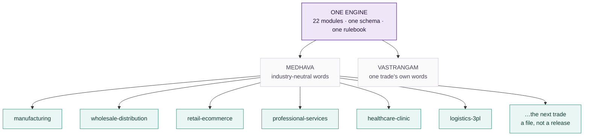

The editions differ in **wording**. The packs differ in **configuration**. Neither is a copy of the
code, and that is the only reason one team can carry all of them.

## M2 · THE INDUSTRY PACK ENGINE

An earlier version of this document said, in this place, that the industry pack was **specified,
not built** — that a third trade meant someone writing a third overlay by hand, and that this
did not scale to a product. That was the honest state of it then. It is built now, and the
paragraphs below say what was built, what it refuses, and which trades it was pointed at first
and why.

### M2.1 · Which trades actually run this software

The pack order was not chosen by taste. It was chosen by looking up who actually buys ERP, order
management and warehouse management, and building for the largest first. Published estimates
differ between research houses — sometimes considerably, because "share of users" and "share of
revenue" are different questions — so the figures below are attributed, and the ranking rather
than any single number is what the build order rests on.

**ERP — who the users are**

| Industry | Share of ERP users | Note |
|---|---|---|
| **Manufacturing** | ~21% of users; ~32% of market revenue | The largest block on every measure. Cited elsewhere as 19.7% of revenue — the spread is why the ranking, not the decimal, is what is used |
| Banking, financial services, insurance | ~16% | Heavily served by specialist systems rather than general ERP |
| **Professional and financial services** | 13.86% | The second-largest block, and the one with no stock at all |
| **Distribution and wholesale** | 9.90% | Credit and movement, not production |
| **Healthcare** | 4.95% | Small today — and the fastest-growing, at **22.37% CAGR to 2030** |
| Construction | 1.98% | |
| Education | 0.99% | |

Finance and insurance, manufacturing and public administration together account for roughly 60%
of total ERP spend.

**WMS — who the users are**

| End user | Share | Note |
|---|---|---|
| **Retail and e-commerce** | ~28%, about $1.37bn in 2025, 10.1% CAGR | The largest WMS segment |
| **Manufacturing** | 23.6–30.22% depending on the source | |
| **Healthcare and pharmaceuticals** | ~10% | **The fastest-growing, at 12.2% CAGR** |

The whole WMS market is put at $3.4bn–$5.92bn in 2025, again depending on who is counting and
what they count as WMS.

**OMS and third-party logistics — which markets are served**

| Market served by 3PLs | Share |
|---|---|
| **Transportation** | 90% |
| **Manufacturing** | 83% |
| **Retail** | 83% |
| **E-commerce** | 68% |
| **Wholesale** | 67% (down from 83% the previous year) |

And among the technology services those providers offer, **order management ranks first** — ahead
of visibility (86%), transport management (84%), optimisation (77%) and ERP integration (75%).
That is the finding that matters most for Medhava’s shape: for a large part of this market the
order, not the ledger, is the system of record.

*Sources, read 2026-08-23: Grand View Research, Mordor Intelligence, HG Insights, MarketsandMarkets,
Manufacturing Lead Generation, Inbound Logistics (3PL Perspectives), Electro IQ, openpr, NetSuite.
These are market-research estimates, not measurements; they are used here to order a build queue,
which is what they are good for, and not quoted anywhere in the product as fact.*

### M2.2 · What a pack is

An industry pack is a row of configuration, loaded as data, that carries:

- **vocabulary** — what this trade calls an order, a customer, a unit of work, a stage
- **stages** — the pipeline a job moves through, named and ordered by the trade
- **fields** — the extra attributes this trade needs on a record, and their types
- **documents** — the papers it issues, and what has to be on them
- **rule switches** — which discretionary rules apply, and at what thresholds
- **starting data** — a chart of accounts, roles, units of measure

The engine reads a pack the way it already reads companies and channels: as rows. Nothing in
`modules.js`, `core/` or the schema changes when a fourteenth trade is added — which is exactly
the property the 10 × 10 test already proves for companies, applied to trades.

### M2.2a · How a pack becomes a screen

Nothing about this is magic, and the picture is the fastest way to see that:

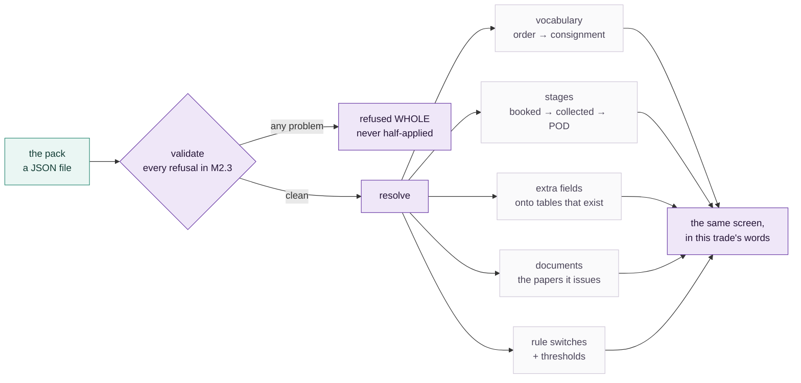

### M2.3 · What a pack may never do

A configuration file that can do anything is not configuration, it is a hole. Six refusals are
enforced in `core/packs.js` and each one is a named test in `core/tests/packs.test.js`:

| A pack may not | Because |
|---|---|
| contain executable code, at any depth | the moment a pack can run code, adding a trade is a code change again and the whole guarantee is worthless |
| invent a concept the engine does not have | "vocabulary" would quietly become a place to put anything, and the screens would carry a name for something that does not exist |
| add a field to a table that does not exist | the shape of the database would move outside the reach of the schema test that guards it |
| declare money as a plain number | the entire schema was built to keep floating-point rupees out; a pack is not a side door |
| switch off an immutable rule | a trade may call an invoice a fee note; it may not decide its audit trail is optional |
| be applied in part | a half-loaded trade is a system whose vocabulary and rules disagree, with no way to tell which half is live |

The rule ids marked immutable in `core/packs.js` cover company scoping, the audit trail, the posting rules,
group elimination and roster privacy — and a test asserts that every one of them really exists in
the rulebook, so the protection cannot silently guard nothing.

One default is worth stating on its own, because getting it backwards would be invisible: **a rule
a pack never mentions is ON.** The rulebook is the default and a pack is an exception list, never
a permission list. The other way round, every rule added after a pack was written would silently
apply to nobody using it.

### M2.4 · Which packs ship

Built in the order the research ranks them:

| Rank | Pack | Sector | What it is really for |
|---|---|---|---|
| 1 | `manufacturing` | Manufacturing | The largest ERP user base, and the vocabulary furthest from a service firm’s |
| 2 | `wholesale-distribution` | Distribution | Credit, not production, is the thing the software has to hold |
| 3 | `retail-ecommerce` | Retail | The largest WMS segment; returns and settlement are the hard part |
| 4 | `professional-services` | Services | No stock at all — the hardest case for the neutrality claim |
| 5 | `healthcare-clinic` | Healthcare | Small now, fastest-growing on every measure |
| 6 | `logistics-3pl` | Logistics | The most-served 3PL market, where the order *is* the product |

### M2.5 · The gate, and what it proves

Phase 2's gate was written before the engine was: *a third trade is added without writing code.*
`core/tests/packs.test.js` §4 runs it, and runs it harder than the phase asked. During the test
run it invents a **commercial laundry** — a trade that appears nowhere in this repository, in no
pack, in no module, in no rule — hands the engine a JSON string, and then requires the whole
system to answer in that trade’s words: an order reads as a docket, a work order as a wash load,
a customer as an account. Its pipeline resolves ordered and terminating, its extra fields land on
real tables, its rule switches resolve against the real rulebook, and it is refused the audit
trail exactly as the six shipped packs are.

A last assertion closes the loop: **`core/packs.js` may not contain a single trade word.** Not
laundry, not clinic, not freight, not dealer, not matter, not patient. If the engine ever learns a
trade, the test fails — because an engine that knows one trade’s words has an opinion about which
trades are normal, and that is the failure this whole section exists to prevent.

What the gate actually does, step by step:

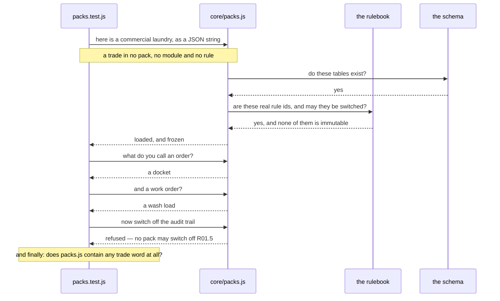

`node core/tests/packs.test.js` → **every check passes, 0 failures.**

## M3 · TENANCY — WHAT IS A ROW AND WHAT IS CODE

| Concept | Row or code | Consequence |
|---|---|---|
| Tenant (a customer of Medhava) | row | Onboarding a business is data entry, not a deployment |
| Company inside a tenant | row | A group with four companies is four rows, consolidated with inter-company trade eliminated |
| Channel | row | A new marketplace is a row; rule R15.1 makes discovery automatic |
| Location, stage, role | row | A warehouse, a production stage and a job title are all configuration |
| **Industry pack** | row | A trade is configuration, not a fork — `core/packs.js`, six packs shipped, a seventh added during the test run |
| The 22 modules | code | The structure is the product; it is the same for everyone |
| The rulebook | code | Which apply is configurable; what they refuse is not — and 22 of them cannot be switched off by any pack |

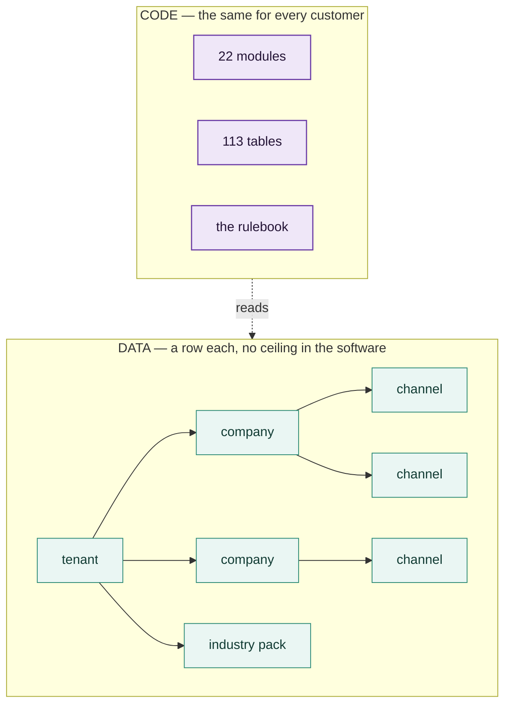

**Isolation.** Every business table carries `company_id` and a row-level security policy carrying
both `USING` and `WITH CHECK`, so a read and a write are separately prevented from crossing a
boundary. `core/tests/schema.test.js` fails the build if any company-scoped table lacks one.
Cross-tenant isolation is the same mechanism one level up and is the single highest-risk item in
this plan — a bug there is not a defect, it is an incident.

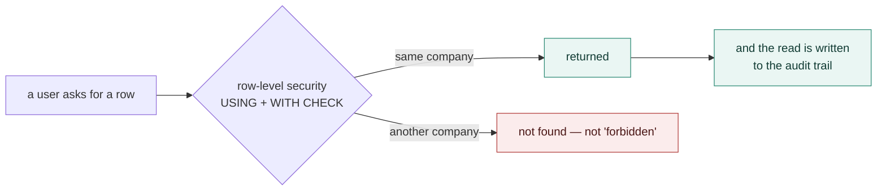

## M4 · THE 22 MODULES, READ FROM TWELVE TRADES

**How the modules feed each other.** Generated from the `reads` field on every module in
`brand/site/modules.js` by `brand/site/mkdiagrams.js` — the same field the website renders as
"Reads from" — so it cannot drift from the module list. Cut into bands because all 22 modules and
all 44 edges on one page rendered as an unreadable tangle; the information is the same, the page
is legible.

<!-- MODULEGRAPH -->
**Foundation** — what it reads, and from where.

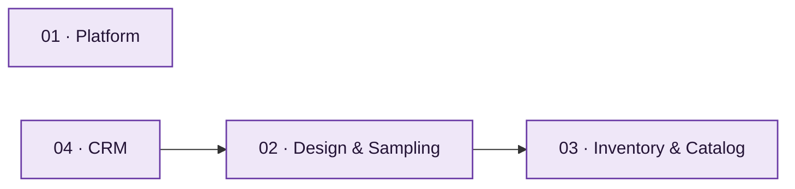

**Selling** — what it reads, and from where.

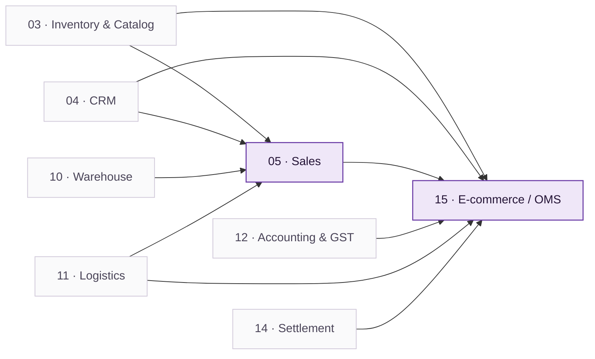

**Planning & making** — what it reads, and from where.

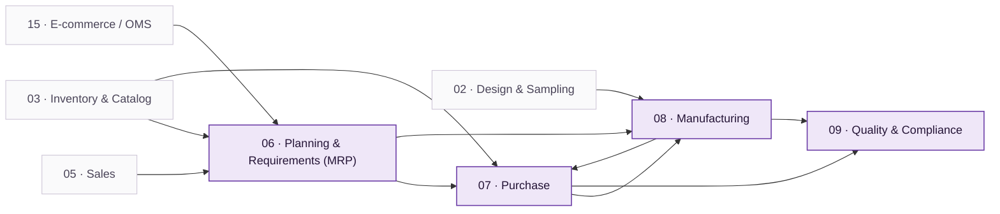

**Moving it** — what it reads, and from where.

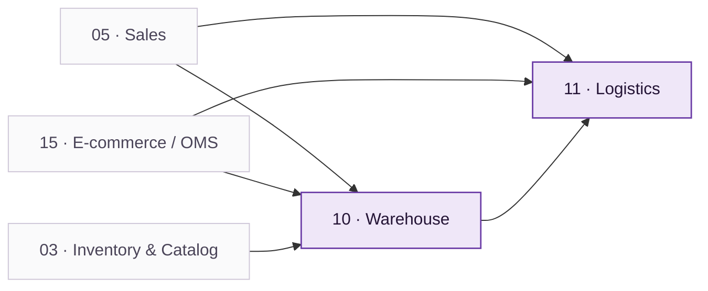

**The money** — what it reads, and from where.

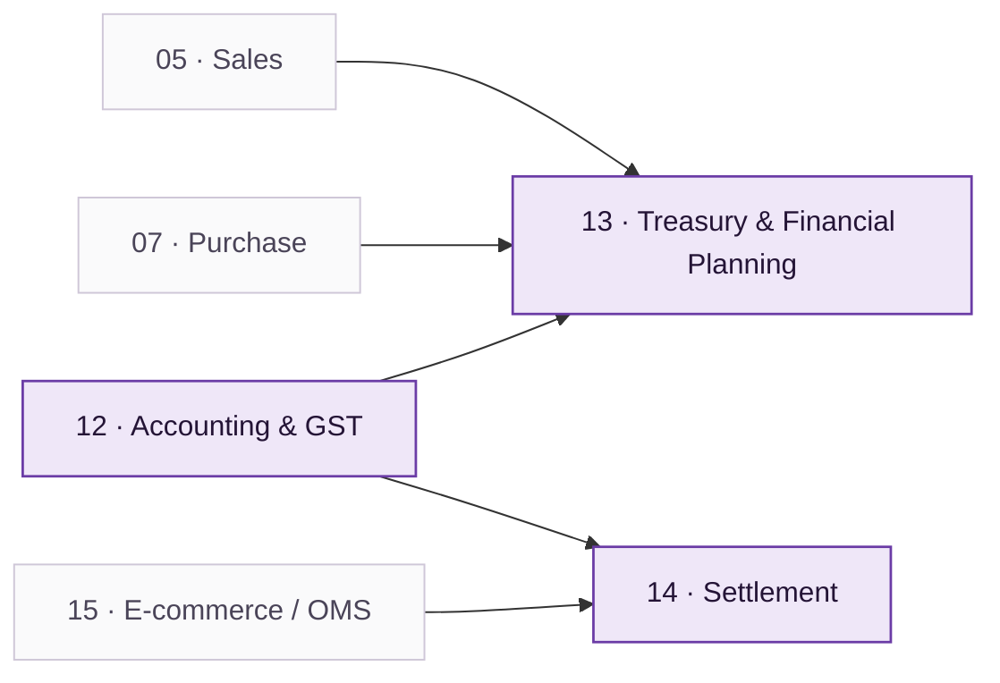

**People & demand** — what it reads, and from where.

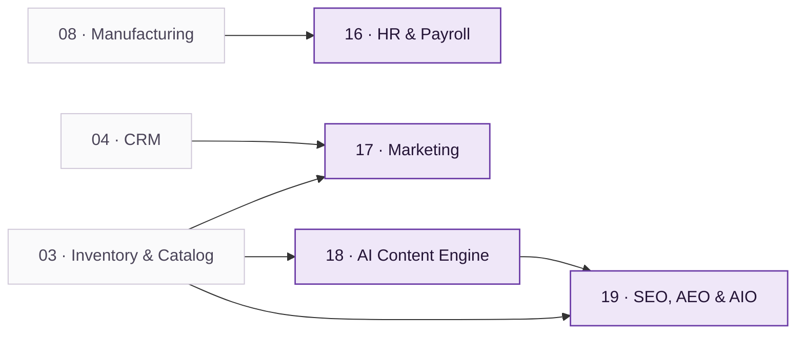

**Across the business** — what it reads, and from where.

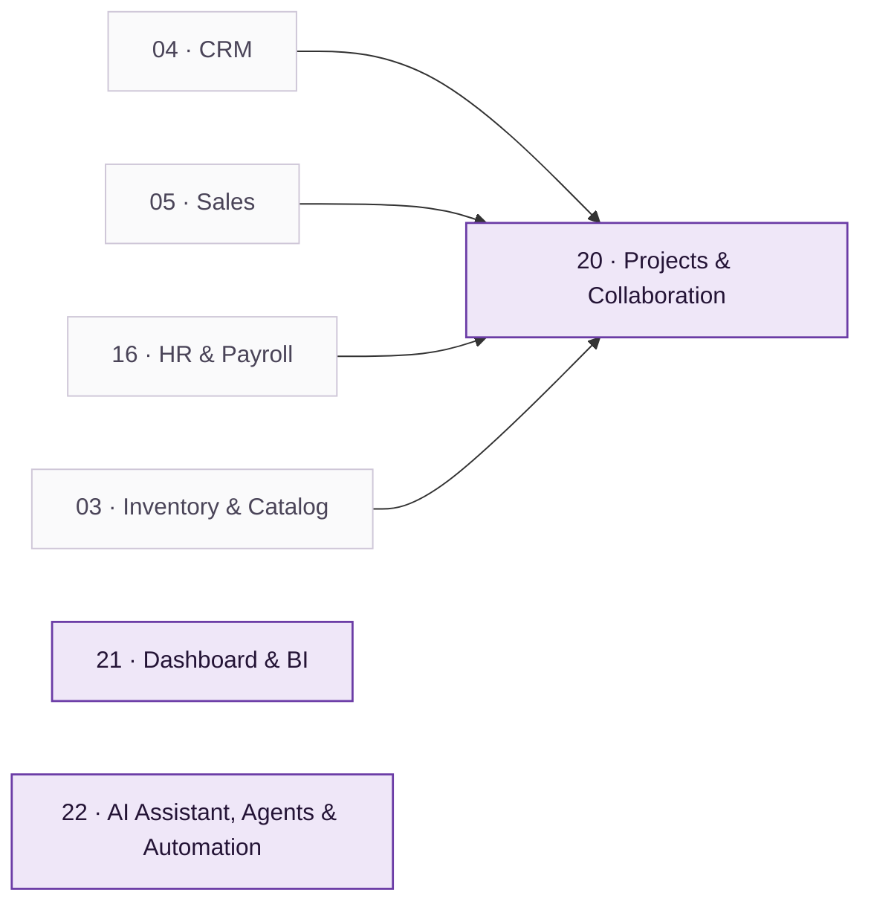

**01, 03, 04, 12, 21, 22** declare that they read *every module*: they sit on the
shared data core rather than on any one upstream module, which is why no arrow into them is
drawn above. Everything else reads exactly what the arrows show.

<!-- /MODULEGRAPH -->

The module list is in `PLAN_OF_ACTION.md` Part II in full, with every app and every rule.
It is not repeated here. What is here is the reading that makes it industry-neutral — the same
module, seen from a different trade:

| Module | Manufacturing | Professional services | Healthcare | Hospitality |
|---|---|---|---|---|
| 02 Design & Sampling | part revision | matter scoping | protocol | recipe development |
| 05 Sales | order book | engagement letter | appointment book | cover forecast |
| 06 Planning | material requirement | resourcing | rota and stock | purchase plan |
| 08 Manufacturing | work order, stages | — | — | batch and prep |
| 09 Quality | inspection | file review | licence and calibration | food safety log |
| 10 Warehouse | pick and pack | — | consumables | store issue |
| 16 HR | shift and piece-rate | timesheets, chargeable | sessions and locums | rota and casuals |
| 20 Projects | improvement work | matters | care pathways | openings |

The landing page carries every one of the product screens counted at the head of this document,
across all twelve sectors, doing exactly this — the same module
rendered with a machine shop’s figures and a clinic’s figures, one under the other. That is the
argument made where it can be checked rather than believed.

---

# PART II — EXECUTION

## M5 · THE STACK, AND WHAT IT COSTS

The full tools register is `brand/site/tools.js`, gated by `brand/site/checktools.js`, which
fails the build if any paid tool does not name **both** the free option it replaces and the
concrete condition that forces the upgrade. "When we grow" is rejected by the checker; a number
or a named event passes.

**19 capabilities. Only three have no free path in existence:**

| Capability | Why there is no free option | What it costs |
|---|---|---|
| WhatsApp Business messaging | Meta requires an approved provider; there is no free tier to outgrow | ~₹1,500–3,000/month plus per-conversation charges |
| SMS | Carrier access is the cost | ~₹0.15–0.25 per message |
| Generated imagery | Free software, but it needs a graphics card | A GPU, or a hosted API per image |

Everything else runs on free tiers or free software until a stated trigger fires: Postgres,
self-hosted automation, a free hosting tier, local AI, the browser’s own speech synthesis,
ffmpeg and Chromium for media, UPI for payments, CSV for every integration, and a progressive
web app instead of a store listing. **A business can run the whole system on zero rupees of
software licence** and pay only for the three lines above, and only when it reaches them.

The Provider Router in Module 01 puts a spend ceiling in front of every paid call and refuses
past it rather than warning — so the AI line in particular cannot quietly become the largest one.

**How a line ever becomes a paid line.** Every capability starts free and only moves when a stated
condition fires — which is the whole discipline `brand/site/checktools.js` exists to enforce:

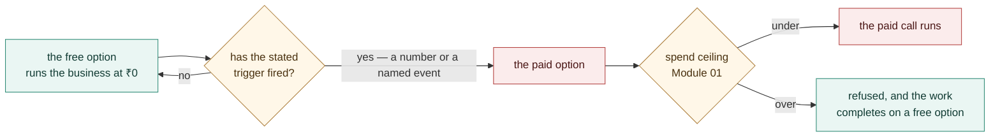

A paid entry with no free predecessor and no concrete trigger **fails the build**. "When we grow"
is not a trigger; a number is.

## M6 · THE EIGHT PHASES

The gate is absolute: **Phase N+1 does not start until Phase N’s tests pass.** A phase is done
when its stated result is reproduced, not when its code is written.

| Phase | What gets built | Done when |
|---|---|---|
| **0 · Setup** | Environments, CI, monitoring, the schema loaded | A commit deploys and a user logs in |
| **1 · Foundation & tenancy** | Tenants, companies, roles, RLS, masters, the SKU/item model | Two tenants exist and neither can read a single row of the other, proved by a test that tries |
| **2 · The industry pack engine** | Vocabulary, stages, fields, documents and starting data as rows | A trade nobody designed for is added **without writing code**, during the test run, from a plain settings file |
| **3 · Core operations** | Inventory, procurement, production, quality, warehouse | Three trades run the same operations screens on their own vocabulary |
| **4 · Commerce & channels** | Sales all channels, OMS, returns, logistics, settlement | A week of orders across channels, settled and reconciled |
| **5 · Finance** | Double-entry, tax, banking, period locks | A month closes: trial balance ties and returns generate from vouchers |
| **6 · The AI layer** | Assistant, chatbot, agents, guardrails, content | An assistant answer matches the books; an agent asked to move money stops |
| **7 · Onboarding & self-serve** | Sign-up, pack selection, import, go-live | A business onboards itself in a day without a call |

**Phase 2 is the one that decides whether this is a product or a project.** Its gate is written
before its engine — *a new trade must be addable without a developer* — and it runs on every test
pass against a trade nobody designed for. Everything from Phase 3 onward stands on that claim, so it
is checked rather than argued.

The same eight phases as a sequence:

```mermaid
gantt
  title The eight phases — each one gated by its own test
  dateFormat X
  axisFormat %s
  section Foundation
  0 · Setup                        :p0, 0, 1
  1 · Foundation and tenancy       :p1, 1, 2
  section The product claim
  2 · The industry pack engine     :p2, 3, 2
  section Operations
  3 · Core operations              :p3, 5, 3
  4 · Commerce and channels        :p4, 8, 3
  5 · Finance                      :p5, 11, 2
  section On top
  6 · The AI layer                 :p6, 13, 3
  7 · Onboarding and self-serve    :p7, 16, 2
```

*Bars show sequence and relative size, not calendar dates — a phase ends when its test passes, and
a date typed here would be a promise the gate does not make.*

## M7 · ONBOARDING A BUSINESS IN A DAY

For a business with no system to migrate from — which is most of the target market — the sixty-day
parallel run in the Vastrangam plan is the wrong shape entirely. The sequence is:

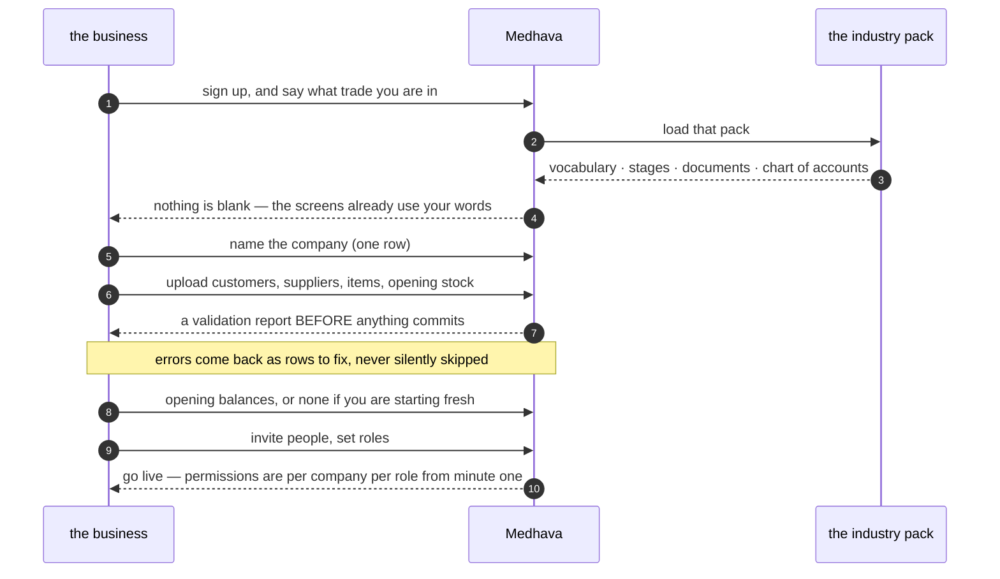

1. **Sign up, pick a trade.** The industry pack loads vocabulary, stages, documents and a chart
   of accounts. Nothing is blank.
2. **Name the company.** One row. A group adds more rows now or later.
3. **Import what exists** — customers, suppliers, items, opening stock — from a spreadsheet, with
   a validation report **before** anything commits. Errors are shown as rows to fix, never
   silently skipped.
4. **Opening balances**, or none at all if the business is starting fresh.
5. **Invite people, set roles.** Permissions are per company per role from the first minute.
6. **Do one real transaction end to end** — one sale, invoiced, stock moved, posted — and click
   the dashboard figure down to the voucher. That is the go-live test, and it takes a minute.

**For a business migrating from an existing system**, the discipline in `PLAN_OF_ACTION.md`
Part IV E5 applies unchanged: export, clean, load, opening balances, parallel run, and a
decommission criterion agreed in advance rather than argued at the end.

## M8 · SECURITY AND COMPLIANCE

Row-level security in the database and permission checks in API middleware — one layer is one
mistake away from a cross-tenant read. Personal data is exportable and erasable on request, with
consent and retention tracked as the two separate clocks they are. Card data never reaches this
system; the gateway’s own secured field takes it, so there is no scope to protect. The audit
trail has no off switch, and R16.22 keeps individual pay and personal attributes out of any
document that leaves the building.

## M9 · PERFORMANCE

| Operation | p95 |
|---|---|
| Page load, cached / uncached | < 1 s / < 3 s |
| Live stock or availability query | < 500 ms |
| Document PDF | < 2 s |
| Channel order pull, per channel | < 60 s |
| Settlement import, 1,000 lines | < 30 s |
| Daily profit-and-loss refresh | < 10 s |

The availability query is the one that decides whether people trust the system: it runs on every
screen showing a quantity or a free slot, and one that takes two seconds is one people stop asking.

## M10 · RISK REGISTER

| Risk | Likelihood | Impact | Mitigation |
|---|---|---|---|
| **Cross-tenant data leak** | Low | **Critical** | RLS with USING and WITH CHECK, middleware checks, a test that actively attempts a cross-tenant read |
| The industry pack engine slips, and trades get hard-coded instead | **High** | **Critical** | Phase 2 gate: a third trade added with no code. Hold the gate |
| A vertical demands a genuine structural exception | Medium | High | Add it as a module or an app for everyone, never as a branch for one customer |
| Free tier terms change or a tier disappears | Medium | Medium | Every capability has a self-host route recorded; the register is dated |
| WhatsApp provider outage | Low | High | Adapter swap; SMS and in-app as fallback |
| Onboarding needs hand-holding, so it does not scale | High | Medium | The day-one sequence above is a tested path, not a document |
| AI spend runs away | Medium | Medium | The spend ceiling refuses rather than warns |

## M11 · SUCCESS METRICS

| Measure | Target |
|---|---|
| A new trade supported without writing code | Yes, from Phase 2 onward — binary, not a percentage |
| Time for a business to onboard itself | Under a day, unattended |
| Cost to run for a business at pilot scale | ₹0 in software licence |
| Rules enforced by a test | the enforced-of-total figure at the head of this document; up every build |
| Cross-tenant incidents | Zero, and this is the only metric with no acceptable non-zero value |

## M12 · RUNBOOKS

**Daily** — error and uptime check, failed integrations queue, onboarding funnel.
**Weekly** — usage per tenant, slow queries, support themes that suggest a missing rule.
**Monthly** — free-tier headroom against triggers, spend against ceilings, backup restore test.
**Quarterly** — re-read the tools register against current published tiers, review which SPECIFIED
rules became enforceable, and check whether any vertical has quietly grown an exception.

## M13 · WHAT A CUSTOMER PAYS FOR

The free-first register is not only how Medhava is built — it is the shape of what it can offer.
Because the system runs on free tiers and free software at pilot scale, a business can be given a
genuinely working system before it pays anything, and the paid lines are the ones it would have
had to pay anyway: messaging, marketplace access, payment processing, courier pickup.

The commercial decision — subscription, per-company, per-user, or usage — is not made in this
document, because it is a business decision rather than an engineering one. What this document
fixes is the constraint it must respect: **nothing in the architecture may make a plan cap
technically necessary.** Companies, channels, users and trades are rows. If a plan limits them,
that is a commercial choice stated in the pricing, and the software says so rather than
pretending to a technical limit it does not have.

---

# PART III — THE PROOF

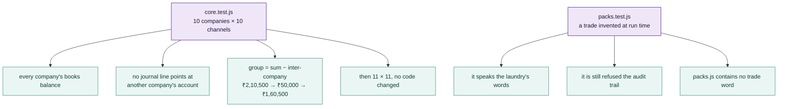

The test of whether this is one system or twenty-two programs sharing a login is a single
transaction followed end to end, and it is re-run at every module boundary. That walkthrough is
in `PLAN_OF_ACTION.md` Part V and is identical here.

The test of whether it is *industry-neutral* is different, and it is this: **take the same
transaction and run it in a trade nobody had in mind when the code was written.** That test used
to be run by hand, by writing an overlay. It is now run by the machine: `core/tests/packs.test.js`
invents a commercial laundry every time it executes, loads it from a JSON string, and requires the
system to answer in that trade’s words — while still refusing it the audit trail. The last
assertion in that file is that `core/packs.js` contains no trade word at all, so the engine cannot
quietly learn one trade and call it neutrality.

**Every check passes, with the shipped packs and a seventh added at run time.** That is the whole
industry-neutrality claim, reduced to something that either passes or does not.

---

*Counts in this document are read from `brand/site/modules.js`, `brand/site/rules.js`,
`brand/site/shots.js`, `brand/site/tools.js` and `core/schema.postgres.sql` when it is generated.
Product screens carry illustrative figures and are labelled with the trade they are drawn from;
they are not case studies, and no business is named as a customer that is not one.*
