# Medhava

**One Business Operating System. Any trade. One shared data core.**

22 modules · 113 apps · 19 technical layers · compiled 2026-08-25

---

## What this document is

Two documents in one, because they answer two different questions and people ask both.

**Part One — The System** is the reader's tour: what Medhava is, how one order moves through it,
every module and every app, how a trade is added as a row of configuration, and the rules that hold
everywhere.

**Part Two — The Plan of Action** is the builder's document: what Medhava is, the tenancy model, the industry pack engine, the eight build phases, the free-first tool register, onboarding, security, risks and what a customer pays for.

**Part Three — How It Is Built** is the technical design: the architecture, the database, the
backend, the frontend, storage, memory, sign-in, integrations and how it is run — every layer with
what it is built on and what can replace it.

Both are generated from `brand/site/modules.js`, the one canonical list. Neither this page nor
either part contains a module count, an app name or an app order typed by hand — which is why they
cannot disagree with each other or with the software.

---

## What this document is

**This describes a design.** Everything in it is what the system is being built to be. Nothing in it
claims to already exist, and no part of it is presented as finished.

Two rules run through every page. **No capability depends on one tool** — 19 technical layers,
57 named alternatives between them, each behind an interface so a supplier can be changed
without a rebuild. **Nothing is static and the past stays correct** — 18 things a business
changes itself, instantly, each carrying the date it starts from so closed months never move.

---

## The claim, and where it is checked

**"Any industry" is a statement about the code, so it is checked in the code.**

A trade is a row, not a fork. What a business calls things, the stages its work moves through, the
extra fields its records need, the documents it issues and the reference data it starts with all
arrive as one configuration file — and a pack may never contain executable code, invent a concept
the engine does not have, extend a table that does not exist, declare money as anything but integer
paise, switch off an immutable rule, or be applied in part.

| | How many | The design |
|---|---|---|
| Industry packs shipped | 10 | a directory, no ceiling |
| Companies | as many as you have | a table; the shipped plan caps a subscription at 20, the software has none |
| Channels per company | as many as you sell on | a table, read from your data |
| Stock | one number per SKU | one number per SKU — never per channel |
| Group | sum minus inter-company trade | sum minus inter-company trade |

`core/tests/packs.test.js` invents a **commercial laundry** during the test run — a trade that
appears nowhere in this software — loads it from a JSON string, and requires every screen to answer
in that trade's words while still refusing it the audit trail. A final assertion fails the build if
the engine file ever contains a single trade word. `core/tests/core.test.js` does the matching
thing for scale: ten companies with ten channels each, then eleven by eleven with no code changed.

---

## The honesty rules this document is written under

1. Nothing is described as finished. This is a design, and it says so on its first page.
2. No count is typed from memory. Every figure is read from the canonical list when this is written.
3. No figure is invented. Where a rate or a price is missing, the tool posts zero and names the
   item rather than guessing — a guessed rate is a wrong payment to a real person.
4. Where something could not be verified, it says so instead of implying it was.

---

# PART ONE — THE SYSTEM

**One Business Operating System for any trade: 22 modules and 113 apps over one shared data core.**

This file is the whole system in plain text — every module, every app, and what each one reads and
writes. It is generated from `brand/site/modules.js`, the same file the website and every PDF read,
so nothing here can disagree with them. The counts below are not typed in; they are counted from that
file each time this page is built.

| | |
|---|---|
| **Modules** | 22, in dependency order — a module comes only after everything it draws on |
| **Apps** | 113 |
| **Companies** | As many as you have. A company is a row, not a setting — the shipped plan caps a subscription at 20 and the software itself has no ceiling |
| **Shared data core** | Company · Item/SKU · Party · Stock · Ledger/Voucher · Order |
| **Key difference** | Not a suite of integrated apps. One application over one database, so there is no sync step and no second copy of any master record |
| **Compliance** | Double-entry books with CGST/SGST/IGST, TDS, TCS, input credit on **accepted** goods, GSTR-1 and GSTR-3B, filed per registration |
| **Channels** | Any storefront, marketplace, counter, wholesale desk or export buyer — read from your own data, never from a list inside the code |
| **Security** | Row-level isolation per company; outside services connect with scoped, revocable keys — **never account passwords** |
| **Deployment** | Hosted, or single-file apps that run by double-clicking with no install and no internet |

---

### The one idea

Every module reads and writes the **same six records**. That is the physical reason a single goods
receipt can touch stock, the books, quality and sourcing in the same instant.

```
                  ┌───────────────────────────────────────┐
                  │          UNIFIED DATA CORE            │
                  │  Company · Item/SKU · Party ·         │
                  │  Stock · Ledger/Voucher · Order       │
                  └───────────────────────────────────────┘
                                   ▲ ▼
       every one of the 113 apps reads and writes these, and only these
```

**One stock number, not one per channel.** The last unit sold at the counter disappears from every
marketplace you sell on in the same instant — not three hours later as a cancellation, because
cancellations are what a seller rating is lost to.

**Accepted — not ordered — is what counts.** You order 100 units. 100 arrive. Quality accepts 96.
Most systems increase stock by 100 and claim tax credit on 100. This one increases stock by **96**,
claims input credit on **96**, raises a debit note for the 4 rejected, and lowers that supplier's
accept rate — automatically.

**Nothing derived is ever stored.** Outstanding, ageing, risk, promise dates, cost per piece and
profit per design are recomputed on read. A stored total is a number that can drift away from the
documents underneath it; a computed one cannot.

---

### How one order moves through it

The test of whether this is one system or 113 programs sharing a login: take a single order and
follow it. The words below are a product business's; a clinic, a law practice and a freight desk run
the same eight modules with their own words on them.

```
  sold on a marketplace
          │
          ▼
  ┌───────────────┐   order lands in one queue, sorted by the time LEFT
  │ 15 OMS        │   on its cut-off — not the time it arrived
  └───────┬───────┘
          ▼
  ┌───────────────┐   stock down by one, on EVERY channel, same instant
  │ 03 Inventory  │
  └───────┬───────┘
          ▼
  ┌───────────────┐   picked from the named bin, in walking order, filmed
  │ 10 Warehouse  │
  └───────┬───────┘
          ▼
  ┌───────────────┐   cheapest and fastest both known before booking;
  │ 11 Logistics  │   COD collected at the door reconciled to the bank
  └───────┬───────┘
          ▼
  ┌───────────────┐   revenue and GST posted through ONE posting engine
  │ 12 Accounting │   — entries balance or they do not post
  └───────┬───────┘
          ▼
  ┌───────────────┐   weeks later the payout is matched to the paise, and
  │ 14 Settlement │   any shortfall is named and claimed before it expires
  └───────┬───────┘
          ▼
  ┌───────────────┐   the person who made it was paid for it, per unit of
  │ 08 + 16 Make  │   work done, whether or not it completed a set
  │    and pay    │
  └───────┬───────┘
          ▼
  ┌───────────────┐   every step a live figure — and every figure clicks
  │ 21 Dashboard  │   down to the record that produced it
  └───────────────┘

     one transaction · eight modules · one database
```

---

### Every industry, as a row of configuration

This is the part that makes "any trade" a fact rather than a claim. A trade is **not** a fork of the
software, a branch, or a bespoke build. It is a file: what this trade calls things, the stages its
work moves through, the extra fields its records need, the documents it issues, which discretionary
rules apply, and the reference data it starts with.

| Rank | Pack | Sector | Its words for customer · order · worker | Pipelines | Documents |
|---|---|---|---|---|---|
| 1 | `manufacturing` | Manufacturing | buyer · sales order · operator | 2 | 4 |
| 2 | `wholesale-distribution` | Distribution | dealer · sales order · salesman | 2 | 5 |
| 3 | `retail-ecommerce` | Retail | shopper · order · associate | 2 | 4 |
| 4 | `professional-services` | Services | client · matter · fee-earner | 1 | 4 |
| 5 | `healthcare-clinic` | Healthcare | patient · appointment · clinician | 2 | 4 |
| 6 | `logistics-3pl` | Logistics | shipper · consignment · driver | 2 | 5 |
| 7 | `hospitality-food` | Hospitality | guest · ticket · crew member | 2 | 5 |
| 8 | `education` | Education | learner · enrolment · faculty member | 2 | 6 |
| 9 | `construction` | Construction | client · contract · site worker | 2 | 6 |
| 10 | `field-service` | Field service | customer · job · technician | 2 | 5 |

The order is not taste. Manufacturing is the largest ERP user base — around a fifth of all users and
roughly a third of market revenue. Professional and financial services is next at 13.86%, and has no
stock at all, which makes it the hardest case for the claim. Distribution is 9.90%. Retail and
e-commerce is the largest warehouse-management segment at about 28%. Healthcare is under 5% of ERP
users today and the fastest-growing of them all at 22.37% a year. Transportation is the most-served
market among third-party logistics providers at 90%, and **order management ranks first** among the
technology services those providers offer.

**What a pack may never do.** A configuration file that can do anything is not configuration, it is
a hole. A pack may not contain executable code at any depth, invent a concept the engine does not
have, add a field to a table that does not exist, declare money as anything but integer paise, switch
off an immutable rule — company scoping, the audit trail, the posting rules, group elimination,
roster privacy — or be applied in part. Each of those refusals is a named test.

**One default worth stating on its own:** a rule a pack never mentions is **on**. The rulebook is the
default and a pack is an exception list, never a permission list. The other way round, every rule
added after a pack was written would silently apply to nobody using it.

**The test that decides whether this is a product.** `core/tests/packs.test.js` invents a
**commercial laundry** — a trade that appears nowhere in this software, in no pack, in no module and
in no rule — hands the engine a JSON string while the tests are running, and requires the whole
system to answer in that trade's words: an order reads as a docket, a work order as a wash load, a
customer as an account. Its pipeline resolves ordered and terminating, its fields land on real
tables, its rule switches resolve against the real rulebook, and it is refused the audit trail
exactly as the shipped packs are. A final assertion fails the build if the engine file ever contains
a single trade word — because an engine that knows one trade's words has an opinion about which
trades are normal.

**And the product screens are drawn from 12 sectors,** not one: Drone & precision manufacturer, Freight forwarder, HVAC service firm, Law practice, Restaurant group, Interior contractor, Homeware brand · D2C, Precision components maker, Multi-doctor clinic, Training institute, Creative agency, Dairy co-operative. The same module is shown with each of
their figures, one under the other, so the argument is made where it can be checked rather than
believed.

---

### How you actually use it — a walkthrough

The sections above say what Medhava is. This one follows a person through it, because "22
modules over one shared data core" is a true sentence that tells you nothing about your Tuesday.

Every screen below is a real render of the software, not an artist's impression — the same markup
and the same stylesheet the product uses. The figures on them are illustrative.

#### Day one — from signing up to working, without a consultant

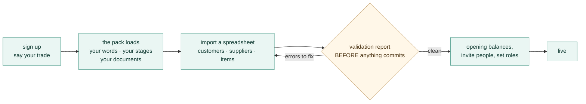
```mermaid
flowchart LR
  classDef s fill:#EAF6F3,stroke:#2E8B76,color:#123C34;
  classDef g fill:#FFF7E8,stroke:#B08343,color:#4A3210;
  A["sign up<br/>say your trade"]:::s --> B["the pack loads<br/>your words · your stages<br/>your documents"]:::s
  B --> C["import a spreadsheet<br/>customers · suppliers · items"]:::s
  C --> D{"validation report<br/>BEFORE anything commits"}:::g
  D -->|"errors to fix"| C
  D -->|"clean"| E["opening balances,<br/>invite people, set roles"]:::s
  E --> F["live"]:::s
```

Nothing is blank when you arrive. Pick manufacturing and the system says sales order;
pick professional services and the same screen says matter; pick
the clinic pack and it says appointment. Same columns underneath, every time.

#### A day in the life — one order, followed all the way

**An order arrives**  ·  Module 15

It lands in one queue with every other channel's orders, sorted by the time **left** on its cut-off rather than the time it arrived. The order that must leave in forty minutes is above the one that came in first and has all day.

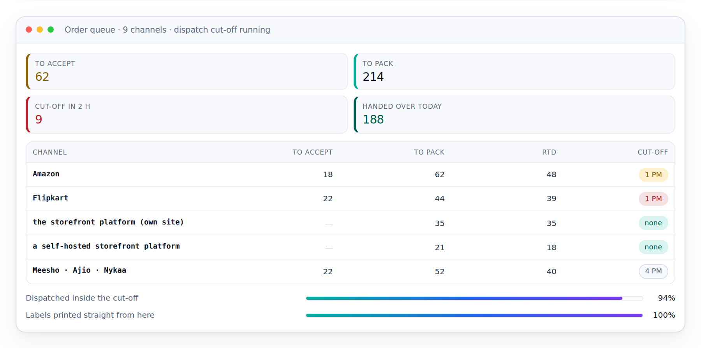


**Stock moves — everywhere at once**  ·  Module 03

One number per SKU. The unit that just sold disappears from every other channel in the same instant, which is the only way to stop the cancellation that costs you a seller rating.

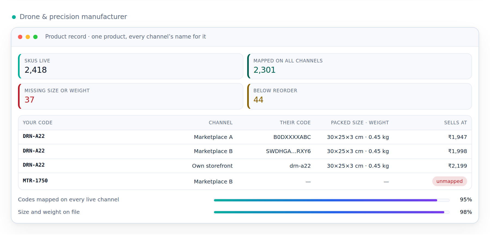


**It gets picked and packed**  ·  Module 10

A pick list in walking order, confirmed against the bin it came from. A short pick stops the pack rather than quietly reducing the order — because an order silently shipped short is a claim you will pay for later.

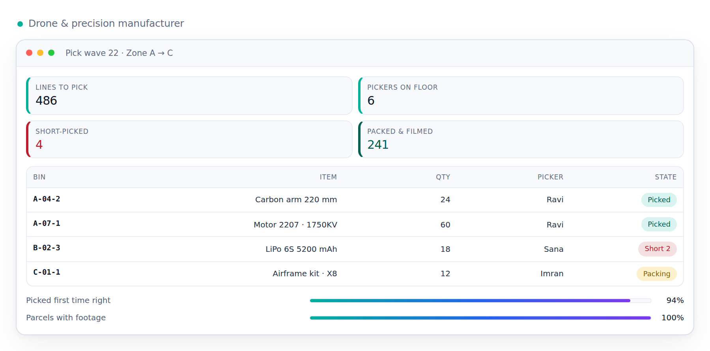


**It ships, and the money is chased**  ·  Module 11

The courier rate is checked against the packed weight before booking, and cash collected at the door stays a receivable until it is actually remitted to your bank.

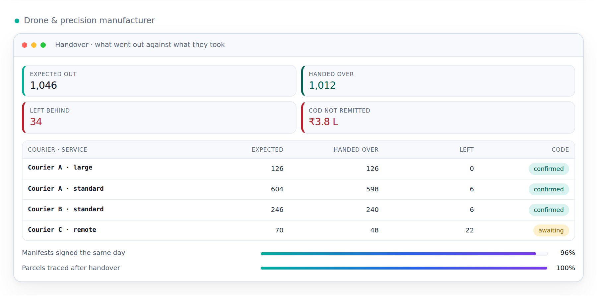


**The books post themselves**  ·  Module 12

Revenue and tax go through one posting engine. Entries balance or they do not post — there is no third option, and no month-end scramble to find out which.

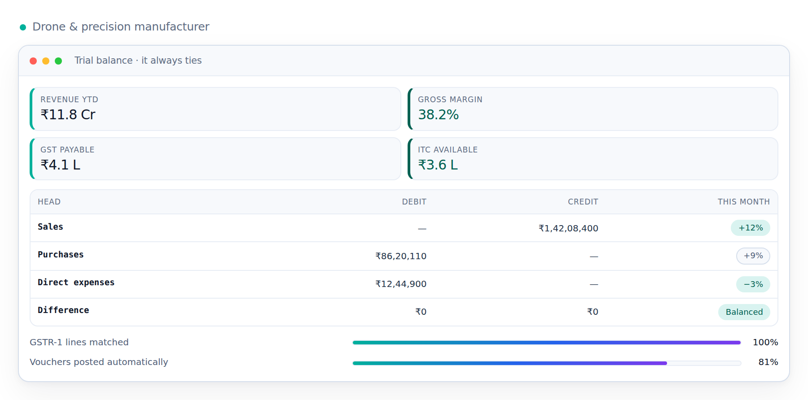


**Weeks later, the payout is checked**  ·  Module 14

What the channel said it would pay, against what arrived, line by line. A shortfall is named and claimed before the window to claim it closes.

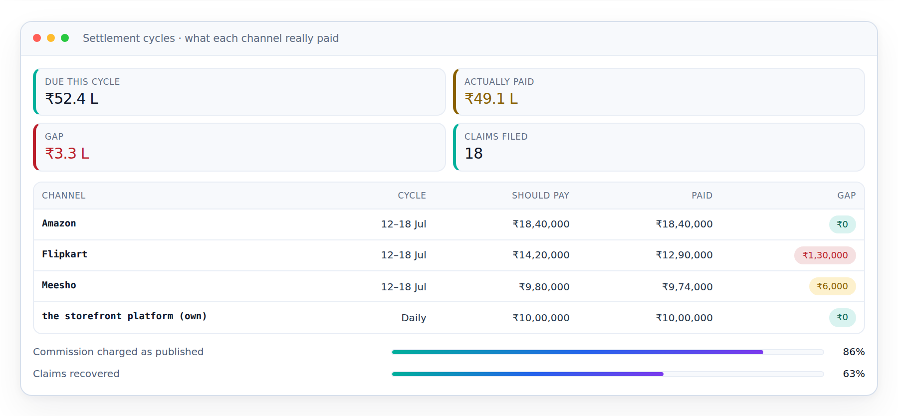


#### The same day, in three trades that have nothing in common

This is the whole argument, and it is easier to see than to read:

**A law practice runs matters**  ·  Module 20

Same record, same columns, same ledger underneath. A matter instead of an order, a fee-earner instead of an operator, hours instead of units.

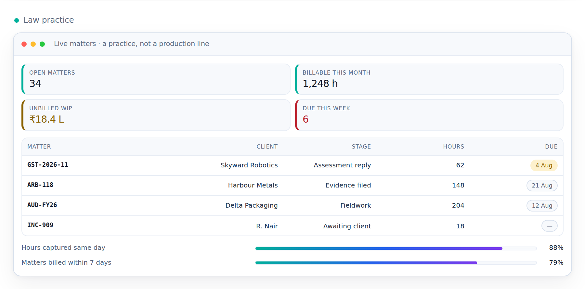


**A clinic runs appointments**  ·  Module 19

A patient instead of a customer, an appointment instead of an order, a clinician instead of a salesman.

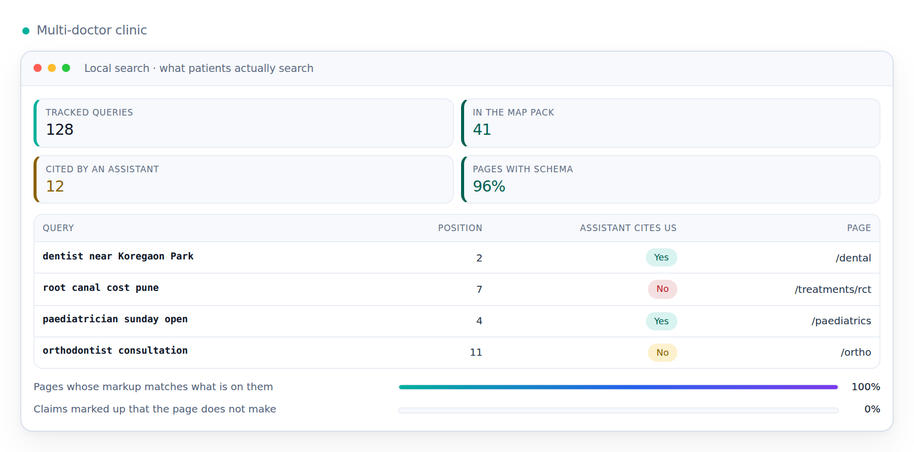


**A restaurant group watches its cash**  ·  Module 13

Four sites, one cash position, fourteen days ahead. No stock module was removed and no code was forked to make any of these three work.

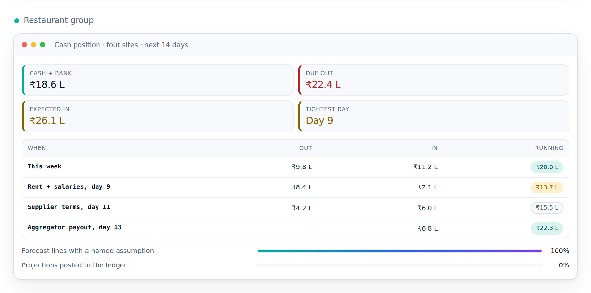


#### Month end

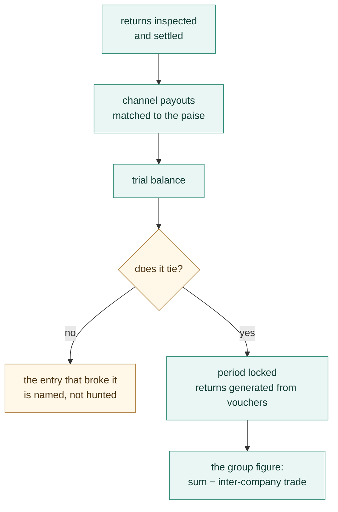
```mermaid
flowchart TB
  classDef s fill:#EAF6F3,stroke:#2E8B76,color:#123C34;
  classDef g fill:#FFF7E8,stroke:#B08343,color:#4A3210;
  R["returns inspected<br/>and settled"]:::s --> S["channel payouts<br/>matched to the paise"]:::s
  S --> T["trial balance"]:::s
  T --> U{"does it tie?"}:::g
  U -->|"no"| V["the entry that broke it<br/>is named, not hunted"]:::g
  U -->|"yes"| W["period locked<br/>returns generated from vouchers"]:::s
  W --> X["the group figure:<br/>sum − inter-company trade"]:::s
```

Then the next month opens, and nothing about the close depended on anybody remembering to run it.

---

### Every module and every app

Listed in build order.
is described as finished that is not.

#### Module 01 · Platform
*The spine every module runs on.*

Not a module you open — the layer underneath all 22. Who can see what, how the system is configured, and a record of everything that ever happened. Foundation first: nothing downstream can be built before identity, roles and the audit trail exist.

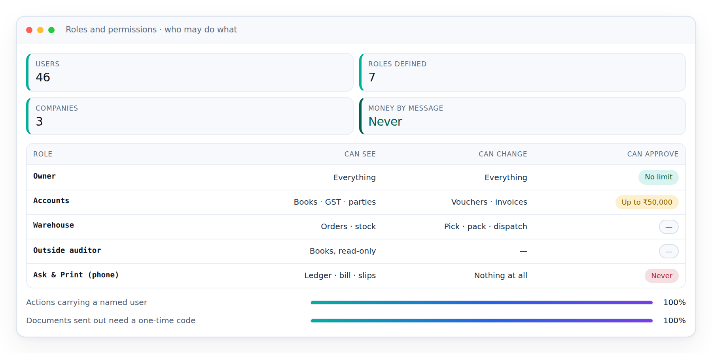

**Reads from:** Every module
**Writes to:** Every module

| App | What it does |
|---|---|
| **Identity, Settings & Audit** | Users, roles and permissions, company switching, tax and numbering setup — and an immutable record of everything that ever happened. |
| **Industry Packs** | What your trade calls things, the stages your work moves through, the extra fields your records need, the documents you issue and the reference data you start with — all of it loaded as a row of configuration, never as a separate version of the software. Pick the pack that matches your trade and the whole system changes its words: the same order screen reads as a job, a matter, a consignment or an appointment, with the same columns underneath. A pack may rename what exists, add fields to tables that exist, and switch discretionary rules off; it may never invent a concept, add a field to a table that does not exist, contain any executable code, or switch off the guarantees — company scoping, the audit trail, money never being a float — because a trade may change its vocabulary and may not opt out of the things the books are trusted for. Adding a trade nobody anticipated is therefore a file somebody writes, not a release somebody ships. |
| **Ask & Print** | Ask from your phone, anywhere: a ledger, a bill, today’s packing slips. It comes back as a PDF — or prints on the office printer, with nothing plugged into your phone. |
| **Communications** | WhatsApp commands and broadcasts, email and SMS, and the handful of scheduled jobs that carry a nudge to the right person without anyone remembering to send it. Every capability here has more than one interchangeable provider — none of them is ever the source of a figure the business reports. |
| **WhatsApp Command Console** | The shop floor does not open a laptop. A worker or a staff member sends a short message — in, out, today’s pieces, leave, an advance — and it becomes a real record: attendance with the time and place it was marked, a production report against the design, a request in the approvals queue. The end-of-day prompt asks what is still open and how long it needs, so tomorrow starts from what is actually pending rather than from memory. Marking attendance checks the phone is at the unit within the radius set for it, with a grace window; a person outside it is not refused, they are flagged for the manager, because a system that locks someone out of being paid for being early at the wrong gate has failed at its job. Every override is recorded with who made it. The words a worker types are in the language they speak, and nothing here ever asks for a password, a bank detail or a document number. |
| **Data Privacy & Consent** | What a person’s data may be used for, captured as consent at the point it is given and honoured everywhere downstream — including the right to have it corrected or removed. Retention (how long a record is kept) and deletion (a person’s right to have their own data removed) are two different policies, tracked separately, because a rule that keeps records for the law and a request from a person to be forgotten do not resolve the same way. |
| **Provider Router & Cost Guard** | The rule that no capability depends on one outside service, enforced at the moment it matters instead of merely promised. Every capability has an ordered fallback list ending on an option that needs nothing connected, so a courier API that stops answering at 9pm, or an AI key that hits its quota mid-catalogue, drops to the next option instead of stopping the work. A provider that keeps failing is tripped out of the list entirely and retried once after a cooldown rather than hammered; retries inside one provider wait twice as long each time. And every paid call is counted in paise against a ceiling you set — over the ceiling the paid provider is refused, not warned about, and the work completes on a free one. Because every capability is guaranteed a built-in or by-hand option, a spent budget can stop the spending without ever stopping the business. |
| **Payment Data Scope** | A written statement of exactly which systems ever see a card or bank credential, and which never do — because every card-capable screen in this system hands that moment to a payment provider’s own secured field and never stores or even passes the number through application code. The statement is what an auditor or a partner asks for before they will connect to this system. |

---

#### Module 02 · Design & Sampling
*A style exists on paper before it exists as stock.*

A product moves from a first idea to something the business can actually make and sell — specification, sample rounds, costed trials and sign-off — before it is ever entered as a catalog record. Building this first means Inventory & Catalog never has to invent a style it has no real specification for.

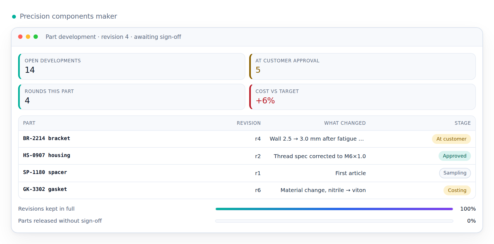

**Reads from:** CRM
**Writes to:** Inventory & Catalog · Manufacturing

| App | What it does |
|---|---|
| **PLM & Development** | First idea to something you can actually make: specification, sample rounds, costed trials and sign-off, with every version kept. A product, a machined part, a formulation or a service package all move through stages you set yourself. |
| **Design / IP Register** | What protects a design once it exists — trademark or copyright status, the date it was first shown, and a flag the moment a near-identical listing turns up elsewhere. Every version already kept by PLM & Development gets a filed status here instead of just a date stamp, because a design with no ownership record on file is a design nobody can defend. |

---

#### Module 03 · Inventory & Catalog
*One number everyone trusts.*

The most important number in the system: one quantity per SKU, per location, per stage — read and written by every other module. And one product record that every channel lists from.


**Reads from:** Design & Sampling · Every module
**Writes to:** Every module

| App | What it does |
|---|---|
| **Stock** | Live quantity by SKU, location and stage, with reorder alerts, batches, kits and dead-stock. Goods you still own but that sit in a channel’s own warehouse are a location like any other, so consignment and sale-or-return stock is counted, valued and aged with everything else instead of disappearing off the books until it sells. |
| **Catalog / PIM** | One product record — attributes, images, HSN, MRP and the price each channel actually sells at — pushed to every marketplace and to your own storefront, and scored for each channel’s rules before it lists. It also holds the two things everything downstream depends on: the code each channel knows this product by, mapped to yours, and the packed size and weight that decide the courier rate and settle every weight dispute. Every listing’s state on every channel is here too — live, waiting for your approval, blocked, archived — with the quality score that decides whether anyone sees it. |
| **Kit & Combo SKU** | A sellable SKU made of component SKUs — a three-piece set sold as one listing. Selling the kit decrements each component at order time, so stock is right for every piece in the set, not just the set itself. |
| **Master-Data Hygiene** | Duplicate detection and merge across customers, vendors and designs, and a dead-stock register for what has not moved in months. Protects every downstream report from the same record existing twice under two names. |

---

#### Module 04 · CRM
*Know every customer completely — and answer them fast.*

One record per customer carrying every lead, order, return, document and conversation, whichever channel it came from. Whoever picks up the next question can already see everything that came before it.

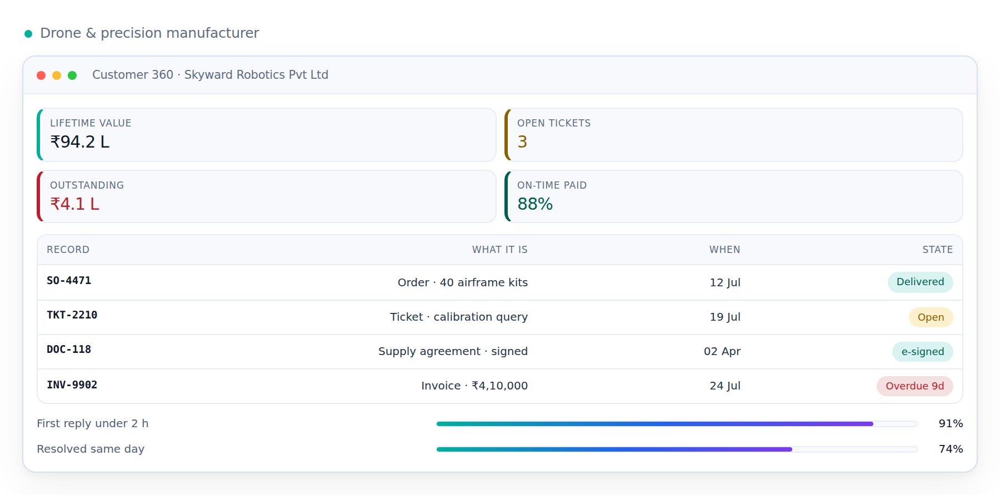

**Reads from:** Every module
**Writes to:** Sales · E-commerce / OMS · Marketing

| App | What it does |
|---|---|
| **CRM & Customer 360** | Lead to won, then the full lifetime: orders, returns, value and what to offer next. |
| **Documents & eSign** | Every agreement, receipt, certificate and scan filed against the record it belongs to — an order, a party, a case, an employee — so it is found by that record instead of by remembering a folder. Send one out for signature and the signed copy files itself back. |
| **Helpdesk & Live Chat** | Questions arriving by chat, email or phone become tickets tied to the order or the account they are about, with the whole history already on the screen. |
| **Forms & Feedback (NPS)** | A short form after delivery, and the score it produces attached to the design or item it is actually about — not just the buyer — so a complaint-prone item surfaces as a pattern instead of a scatter of individual gripes. |

---

#### Module 05 · Sales
*Every way you sell, one order book — to the doorstep.*

Retail counter, wholesale, export and your own website all write to the same order and draw on the same stock number. The courier side lives here too, so a sale is not finished when it is billed — it is finished when it is delivered and the COD money is in.

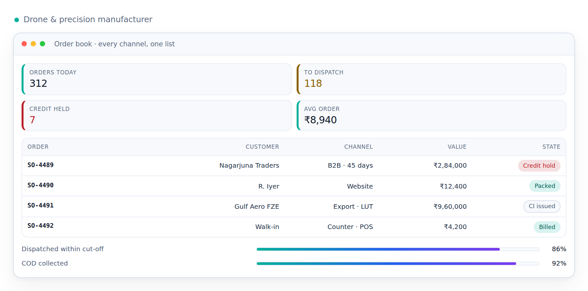

**Reads from:** Inventory & Catalog · CRM · Warehouse · Logistics
**Writes to:** Inventory & Catalog · Accounting & GST · Warehouse · Logistics

| App | What it does |
|---|---|
| **D2C Sales** | Orders from your own storefront — Shopify, WooCommerce or a custom site — cart to dispatch, with loyalty and partial COD. |
| **B2B & Credit** | Wholesale orders with credit limits, tier pricing and outstanding ageing. |
| **Export** | Commercial invoice, packing list, LUT bond and IGST-refund tracking. |
| **POS** | Counter billing that draws on the same stock as your website. |
| **Quotes & Proforma** | Send a quote, convert it to a confirmed order in one click. |
| **Couriers & AWB** | Book the shipment on the order itself, compare couriers, print the label and follow the AWB to the door. |
| **Subscriptions** | A schedule that raises its own invoice on its cycle and follows up on its own when a payment fails — for anything sold as a standing order rather than a one-off. |
| **Customisation & Made-to-Measure** | The order that does not exist in the catalogue: a buyer sends reference pictures and their own measurements, a price is agreed over several messages, and the piece is made for them. All of it is one record — the references, the measurement set, every quote in the negotiation and what was finally agreed, the advance taken to start work and the balance taken before dispatch. When the order is accepted it opens a production order like any other, so a bespoke piece is costed, made, checked and posted exactly as a catalogue piece is. Two legs of money on one order is the part most systems get wrong: the advance is earned when the work starts, the balance is owed until the piece ships, and the ledger shows both separately rather than one payment appearing when the whole thing is over. |

---

#### Module 06 · Planning & Requirements (MRP)
*Turn what is selling into what to buy and make.*

Confirmed orders and demand history have to become a plan before Purchase can buy anything or Manufacturing can start anything — otherwise buying and making are both just guessing. This module sits between the two: it reads what is actually selling and what is already committed, and turns that into requirement, not the other way around.

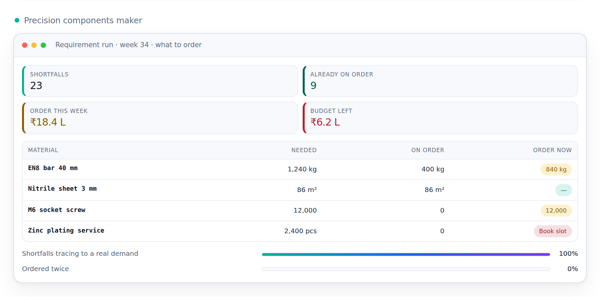

**Reads from:** Sales · E-commerce / OMS · Inventory & Catalog
**Writes to:** Purchase · Manufacturing

| App | What it does |
|---|---|
| **Demand Forecast & Signal** | What sold, by SKU and by period, turned into a short-term forecast — the number every requisition and every production order downstream is measured against instead of a guess. |
| **Requirement Explosion (MRP run)** | Confirmed demand exploded through the bill of materials into what raw material to buy and what to produce, and by when — so a purchase requisition or a production order always traces back to real demand, never to a feeling that stock is getting low. |
| **Open-to-Buy / Budget Ceiling** | A spending ceiling set per period regardless of what the demand signal suggests, so a real signal cannot on its own commit more money than the business has decided to risk this season. Every requisition the MRP run drafts is checked against what is left of the ceiling before it goes to Purchase. |

---

#### Module 07 · Purchase
*Nothing over-billed gets paid.*

The buy side end to end — and the control that stops you paying for goods you rejected.

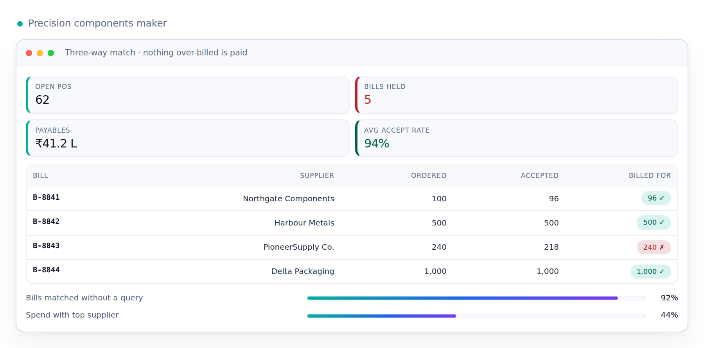

**Reads from:** Inventory & Catalog · Planning & Requirements (MRP) · Manufacturing
**Writes to:** Inventory & Catalog · Accounting & GST · Quality & Compliance

| App | What it does |
|---|---|
| **Procurement** | RFQ to purchase order to goods receipt, with a strict three-way match before any bill is paid. |
| **Vendor Management** | Vendor 360, payables, ageing, a real risk score, and sourcing that follows performance. |
| **Insurance Register** | What cover exists over stock in transit, stock in the warehouse and product liability, matched against what is actually moving through Purchase and Warehouse right now — so real value in transit is never quietly running with no cover tracked anywhere. |

---

#### Module 08 · Manufacturing
*Know what a unit really costs to make.*

From material in the door to the finished unit — including what every worker earned and what each product actually cost. You define the stages, the rates and the rules; nothing here is fixed to one trade. Design and sample sign-off happen upstream now, and quality inspection and the compliance record live in their own module downstream — this module is purely the making.

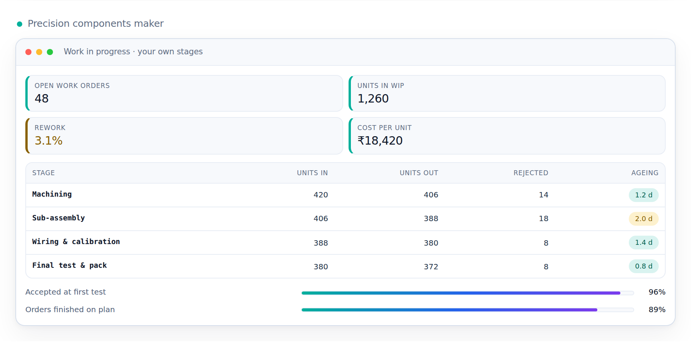

**Reads from:** Purchase · Planning & Requirements (MRP) · Design & Sampling
**Writes to:** Inventory & Catalog · HR & Payroll · Accounting & GST · Quality & Compliance

| App | What it does |
|---|---|
| **Production Orders** | Your own stages from first operation to finished goods, with work-in-progress visible at each one. |
| **Piece-rate & Contractors** | Output-based pay for anyone paid by the piece rather than the hour — pooled completion, per-unit rates, rework and advances resolved into a single payout. |
| **BOM & Consumption** | What each product consumes, costed at today’s material rates. |
| **Maintenance** | Machines, tools and assets: what is due for service, when it was last done, what it cost, and what stopped while it was down. Planned and breakdown work against the same asset record. |

---

#### Module 09 · Quality & Compliance
*Certify what was received and what was made.*

Quality inspection used to live buried as one step inside Manufacturing; it stands on its own here because a rejection at goods-receipt and a rejection on the production floor are the same discipline, and because the certificates a business holds — the proof it follows a standard — belong next to the inspections that back them up, not scattered across email.

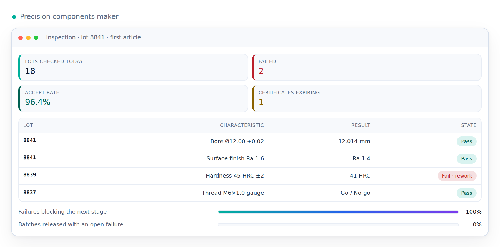

**Reads from:** Purchase · Manufacturing
**Writes to:** Purchase · Manufacturing · Inventory & Catalog

| App | What it does |
|---|---|
| **Quality Control** | Accept, reject or rework — on goods received and on goods made — with reasons that feed the supplier scorecard and the performance flags alike. |
| **Certificate & Compliance Register** | Every standard the business or a vendor holds — a safety, labour or environmental certification — with its issue date, its expiry, and the audit that backs it, so a certificate about to lapse is visible before a buyer asks for it and finds it already expired. What this register tracks is what a sustainability report downstream is actually built from. |

---

#### Module 10 · Warehouse
*Pick right the first time — and prove what you sent.*

Bin-level instructions and barcode scanning, so the right item leaves the building and stock stays honest — and a recording of each parcel being packed, so an argument about what was in it is settled by footage instead of by memory.


**Reads from:** Sales · E-commerce / OMS · Inventory & Catalog
**Writes to:** Inventory & Catalog · Sales · E-commerce / OMS

| App | What it does |
|---|---|
| **Picking & Bins** | Pick lists that tell staff exactly which bin to walk to, in walking order. |
| **Barcode Operations** | Scan to pick, pack, dispatch and run a physical stock count from a phone — the same scan whether the order came from a marketplace, your Shopify site or the counter. |
| **Packing Video** | Every parcel recorded as it is packed and indexed by its order number, so a wrong-item claim is answered with the clip. The footage attaches itself to the claim that needs it. |

---

#### Module 11 · Logistics
*The courier network itself — rates, failures and the COD money.*

Booking one parcel happens on the order, in Sales. This module is the network behind it: what every courier charges before you pick one, what happens to a delivery that fails, and whether the cash collected at the door actually reached your bank.


**Reads from:** Sales · E-commerce / OMS · Warehouse
**Writes to:** Accounting & GST · Sales · E-commerce / OMS

| App | What it does |
|---|---|
| **Rates & Zones** | Every courier’s rate card by zone, weight slab and service — so the cheapest and the fastest option for this parcel are both known before it is booked. |
| **NDR & RTO Rescue** | A failed delivery worked while it can still be saved — reattempt, call, correct the address — before it becomes a return you pay for twice. |
| **COD Remittance** | What the courier collected at the door against what reached your bank, parcel by parcel, with every shortfall named and aged. |
| **Handover & Manifest** | What is expected out today against what the courier actually took, counted per courier and per service. The manifest to hand over, the one-time code to confirm it, and a signed record of the parcels that were left behind — so a parcel lost between your table and their van has an owner. |
| **Fleet** | Your own delivery vehicles, if you run any — what each trip cost, what is due for service, and what that adds to freight. Optional; most businesses run couriers only. |

---

#### Module 12 · Accounting & GST
*Books that always balance.*

A full double-entry ledger built for Indian compliance — not a tax report bolted onto a spreadsheet. Medhava keeps the books on its own: no other accounting package is required, ever.


**Reads from:** Every module
**Writes to:** Finance Reports · Treasury & Financial Planning

| App | What it does |
|---|---|
| **Accounting** | Double-entry books where every voucher balances and the trial balance always ties. |
| **Invoicing** | GST tax invoices and receipts, totals computed from the lines to the paise. Where a channel raises its own invoice, both numbers live on the order — theirs and yours — so the panel’s paperwork and your books point at the same sale and neither has to be re-keyed to find the other. |
| **Expenses** | Spend captured by category with approvals, and bill OCR to save typing. |
| **GST & Tax** | CGST, SGST, IGST, TDS, TCS, input credit, GSTR-1 and GSTR-3B — filed per registration, so a group where one company is registered and another is not files exactly what each one owes and nothing it does not. |
| **ITC Reconciliation** | Every input credit matched against the government’s own GSTR-2A/2B before a return is filed, so a credit claimed is a credit that is actually on record. |
| **Receivables, Payables & PDC** | Payments and receipts allocated against named open invoices, and a register for post-dated cheques that posts only on the date they are realised, not the date they were written. |
| **Fixed Assets & Depreciation** | The asset register with both Straight-Line and Written-Down-Value depreciation tracked side by side, and disposal posting its gain or loss straight to the books. |
| **Year-End Close & Period Lock** | Profit-and-loss accounts reset and balance-sheet accounts carry forward at year end, and a reviewed period locks against backdated edits until an admin unlocks it — an act that is itself logged. |
| **Finance Reports** | P&L, balance sheet, and profit by channel, product and SKU. |

---

#### Module 13 · Treasury & Financial Planning
*Know what cash is coming, not just what already arrived.*

Accounting records what happened; this module is concerned with what happens next — how much cash is actually expected, when, and whether spend against a budget is on track before the month closes and turns the answer into history.


**Reads from:** Accounting & GST · Sales · Purchase
**Writes to:** Accounting & GST

| App | What it does |
|---|---|
| **Cash Flow Forecast** | Expected receipts and expected payments laid out by week, drawn from open invoices and open bills rather than typed in by hand — so a cash shortfall is visible weeks before the date it would actually bite. |
| **Banking & Reconciliation** | Bank statement lines matched against the ledger’s own record of what should have moved, with anything unmatched surfaced instead of silently carried forward. |
| **Budget vs Actual** | A budget set per category and period, and actual spend from Accounting tracked against it as the period runs — not only after it closes, when the only thing left to do is explain the variance. |

---

#### Module 14 · Settlement
*Get paid what you are owed — cycle by cycle.*

Matching one payout to one order line happens in OMS. This module is the level above it: the settlement cycles each panel runs, the fees it actually charged against the fees it published, and the tax it deducted on your behalf.


**Reads from:** E-commerce / OMS · Accounting & GST
**Writes to:** Accounting & GST

| App | What it does |
|---|---|
| **Payout Cycles** | Every settlement cycle each panel runs — what it should pay, what actually landed in the bank, and on which day — so a late payout is visible the day it is late, not at month end. |
| **Fee & Commission Audit** | The rate card a channel publishes against the rate it actually charged, category by category and SKU by SKU. A silent commission increase is caught the first time it is applied — and the tier you are rated in is on the same screen, because the tier is what the rate card hangs off, and losing one quietly costs more than any single deduction. |
| **TCS & TDS Register** | Every rupee the panels deducted as TCS and TDS, matched against the portal’s own figures — so the credit you claim is the credit you are actually owed. |

---

#### Module 15 · E-commerce / OMS
*Every marketplace and your own website, one queue.*

Stop logging into seven seller panels and your own store admin. Every order — Amazon, Flipkart, Meesho, Ajio, Nykaa, JioMart, Myntra, and your Shopify, WooCommerce, Magento or custom site — lands in one pipeline, and one stock number goes back out to all of them. Then the money side closes in the same module: what each channel paid, what it kept, what came back, and what you are still owed.


**Reads from:** Inventory & Catalog · CRM · Sales · Accounting & GST · Logistics · Settlement
**Writes to:** Inventory & Catalog · Accounting & GST · Warehouse · Logistics · Settlement

| App | What it does |
|---|---|
| **Marketplace OMS** | Every marketplace and every storefront in one order queue — Amazon, Flipkart, Myntra, Meesho, Ajio, Nykaa and JioMart alongside Shopify, WooCommerce, Magento, Wix and your own custom site. The stages each channel really uses — to accept, to pack, ready to dispatch, handed over, in transit — with the right cut-off counting down on every order, because a quick-commerce or air-shipped order is not due at the same hour as a standard one. Priority orders first, the day grouped by product so one item is picked once instead of once per parcel. |
| **Order Management** | One pipeline from new to delivered, whether the order came from a seller panel, your Shopify or WooCommerce site, a dealer or the counter. |
| **Manual Data Check** | Upload the sheets you already download — marketplace orders and returns, and your own counter-shop registers, one file or a whole ZIP — and read ten cross-checks back: money, month, item, state, returns, claims, ads, payouts and GST. Every figure is clickable down to the transactions behind it, and the whole result downloads as Excel. |
| **Reconciliation** | Match every marketplace payout to the order line that earned it, and expose the gap. |
| **Claims & Disputes** | Turn shortfalls, weight disputes and lost parcels into filed claims with evidence — and answer them before the clock runs out. A claim that is awaiting your response is worth money; one closed for no response is worth nothing, so the days remaining sit on the screen next to the amount. |
| **Returns / RMA** | Customer, courier and wrong returns — and the dead stock they actually cost you. |
| **Channels & Storefronts** | Connect a channel once and it stays in step: catalogue out, price out, stock out, orders in. Seven marketplaces and any website platform — Shopify, WooCommerce, Magento, BigCommerce, Wix or a custom site over its own API — each switchable without touching your data. Shopsy and any other storefront a channel runs alongside its main one counts as its own channel here. Where a channel has no open interface, its own downloaded report is a first-class way in. A channel may also know you by a different trading name — that is a label on the channel, not a second company, so it tags the order and the payout without ever splitting your books. |
| **Labels & Documents** | The channel gives you a PDF; this turns it into something a packer can work from. Cropped to your label size, your own product code printed large where the channel left it off, the invoice and the packing slip merged behind it, and the whole batch sent to the label printer in one job. Reprint a single parcel without redoing the batch — and nothing is ever uploaded to an outside website to be cropped. |
| **Listing & Catalog Manager** | Bulk-create and bulk-edit listings across every channel from the one product record in Inventory & Catalog, and catch the mismatches that quietly cost sales: listed but out of stock, or in stock but never listed. |
| **Size / Fit Recommendation AI** | A fit suggestion at the point of purchase, built from the item’s own measurements and the return history of buyers who picked each size — aimed straight at the return reason that costs the most: the right item in the wrong size. |
| **AR / Virtual Try-On** | A way to see drape, fit and colour on a screen before buying, for items where a flat photo alone leaves too much to guess. |

---

#### Module 16 · HR & Payroll
*Pay people right, on time.*

Salaries and output-based earnings in one register, with attendance driving both — whether people are on a monthly wage, an hourly rate or paid by what they finish.

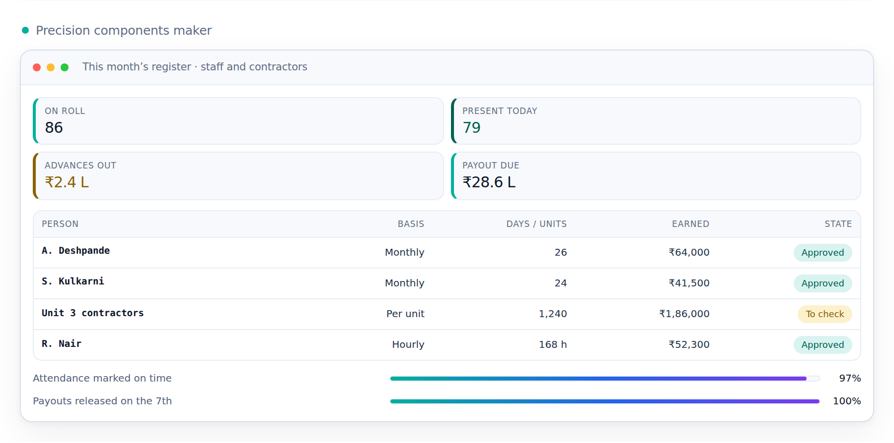

**Reads from:** Manufacturing
**Writes to:** Accounting & GST

| App | What it does |
|---|---|
| **Staff & Contractors** | Attendance, effective-dated salary and output-based earnings in a single register, whoever is on it. |
| **Time-off & Advances** | Leave, festival advances, and exactly how they change this month’s payout. |
| **Appraisal & Hiring** | Performance reviews and a hiring pipeline that ends in an employee record. |
| **Recruitment** | The pipeline before someone becomes an employee — an opening, the people who applied for it, a trial piece where the work itself is the interview, and the decision with its reason kept. It matters more in a skilled trade than in most: a person is taken on for skill at one particular kind of work, and the trial output is the evidence, so it is recorded against that work and the rate that would apply rather than remembered as an impression. A candidate who is not taken on now stays findable when the same skill is needed in a busy month, and their personal documents are held under the same consent and retention rules as anyone else’s, not in a folder on somebody’s phone. |
| **Payout Execution** | Where the calculation in the earnings register actually turns into money leaving the business — bank batch, UPI, cash against a signed receipt — with the method and the reference recorded against every payout, so the register’s total and the money that actually moved can always be checked against each other. |

---

#### Module 17 · Marketing
*Sell more without discounting.*

Plan content, run campaigns, and let rules keep your prices competitive while protecting margin.

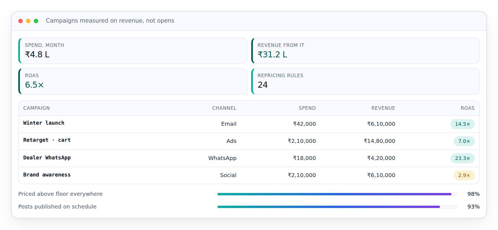

**Reads from:** Inventory & Catalog · CRM
**Writes to:** Sales · E-commerce / OMS

| App | What it does |
|---|---|
| **Social Calendar** | Plan and publish across every channel from one calendar. |
| **Campaigns** | Email, SMS and WhatsApp campaigns measured on real revenue, not opens. |
| **Repricing Engine** | Rules per channel and SKU — floor, ceiling, match-lowest, festival overrides — and what each change actually did. A price that went up and took the orders down with it shows as exactly that, next to the rule that raised it, so the rule can be reversed on evidence rather than on a feeling. |
| **Automation** | If this happens, do that — across any module, without writing code. |
| **Blog & Pages** | Articles, landing pages and category copy written, scheduled and published straight to your own site — Shopify, WooCommerce, Magento or a custom CMS — with the meta title, description and internal links set before it goes out. |
| **Events** | Trade shows and exhibitions worked as a channel of their own — booth, budget and every lead captured on the floor landing straight in CRM instead of on a stack of business cards. |
| **Website & Page Builder** | The storefront itself, built by dragging sections into place rather than by editing a theme file — hero, product grid, size guide, lookbook, contact form — each block reading live from the catalogue, so a price or a stock state on a landing page is the same number the order screen uses instead of a figure someone pasted in and forgot. Blog & Pages above writes articles into a site that already exists; this is for the businesses that do not have one, and it is the gap that shows up plainly when this module list is set beside a mature open-source ERP: they ship a full site builder next to the blog, and until now this did not. |
| **Markdown / Clearance Optimization** | The same rule engine that reprices for competitiveness, aimed at ageing stock instead: when to start discounting it and by how much, before it becomes a warehouse write-off rather than a sale at a lower margin. |

---

#### Module 18 · AI Content Engine
*Write it, shoot it, cut it — from the catalogue you already have.*

Listings, ads, email, product photography and reels, all generated from your own catalogue — so the words match the product and the picture is the right size for the channel it is going to. Words, images and video sit in one module because they are one job.

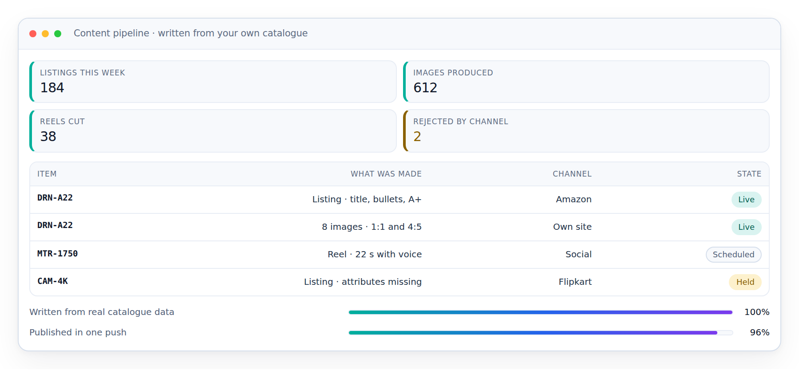

**Reads from:** Inventory & Catalog
**Writes to:** Marketing · E-commerce / OMS

| App | What it does |
|---|---|
| **Content Engine** | Fourteen stages in your own voice, from buyer research and competitor reading through hooks, channel-ready listings, ads, social posts, video scripts, song lyrics, the publishing calendar and alt text — each written from your own catalogue, so the words match the thing. |
| **Image Studio** | Layers, free transform, background removal, channel presets and SEO alt text — a phone photo becomes a channel-compliant product image. |
| **Video Studio** | Text and image to video, reels and ad cuts sized for every channel. |
| **Design Studio** | A full design surface — templates, layers, undo and redo, any colour, exact sizing, background images and stock elements — exporting PNG, JPG or PDF at whatever size the channel or the printer asks for. |
| **Motion Renderer** | A reel rendered from a page of HTML and CSS — the same layers, fonts and brand colours the Design Studio already uses — into a real MP4, on this machine, with nothing uploaded. It is not a screen recording: the clock is faked, the animation is seeked to the exact instant of each frame, and only then is that frame captured, so the render does not care whether the machine was busy. Rendering the same festival banner twice produces the same file to the byte, which is what makes a reel something you can check and re-cut rather than something you have to watch all the way through and hope about. |
| **Narration Studio** | A voice over the reel, in the language the buyer actually speaks — the same script the Content Engine wrote, spoken. The default needs nothing installed and no key, because every modern browser can already speak; a self-hosted or cloud voice sits behind it as an interchangeable provider for anyone who wants a cloned or branded one. Long scripts are split at sentence boundaries and rejoined, so a two-minute description is not cut off at whatever limit a service imposes. A voice cloned from a real person is only ever used with that person’s recorded consent, filed against them in Data Privacy & Consent like any other permission. |
| **Image Generation Slot** | Generated imagery — a model on a background you do not have to shoot, a festival backdrop, a lifestyle scene — as a capability with interchangeable providers rather than a bet on one service: a queue of jobs, a preview while it works, inpainting to fix one region, upscaling and face correction. This one needs a graphics card. Image models cannot run on an ordinary office machine or on the container this system is built in, so what ships is the queue, the review screen and the provider slot, with the generating itself done by whichever engine you point it at — your own GPU box, or a cloud service, swapped without touching anything else. Said plainly here because the alternative is a screen that looks finished and produces nothing. |
| **Publisher** | One push sends the finished listing, picture and copy everywhere it has to appear — your storefront, each marketplace, each social account — and reports back what actually went live and what was rejected, with the reason. |

---

#### Module 19 · SEO, AEO & AIO
*Be found by a search box, an answer box and an AI.*

Content already exists once this module is reached; here it is made findable — by a traditional search engine, by the answer box above the results, and by the AI assistants now answering shopping questions directly instead of sending someone to a results page.


**Reads from:** Inventory & Catalog · AI Content Engine
**Writes to:** Marketing

| App | What it does |
|---|---|
| **Technical SEO & Schema** | Structured data, sitemaps and page-level technical checks against your own storefront and content pages, so a search engine can read what a page is actually about instead of guessing from the text alone. |
| **Answer-Engine Optimization** | Content shaped to be quoted directly by an answer box or a voice assistant — a clear, citable answer near the top of the page — rather than written only for a person to scroll through. |
| **AI-Engine Visibility Tracking** | Whether and how this business is actually cited when someone asks an AI assistant a shopping question in this category, tracked over time — the same discipline as rank tracking, aimed at a newer kind of result page. |

---

#### Module 20 · Projects & Collaboration
*The work that is not an order — and the talking around it.*

Not every business runs on orders. A law firm runs on cases, an agency on engagements, a workshop on jobs, a builder on sites. This module holds that work on the same records as everything else, so the time, the cost, the documents and the decisions attached to it end up in the books rather than in somebody’s inbox.


**Reads from:** CRM · Sales · HR & Payroll · Inventory & Catalog
**Writes to:** Accounting & GST · HR & Payroll · CRM

| App | What it does |
|---|---|
| **Projects & Cases** | A project, a case file, an engagement or a job — whatever your work is called. Stages you define, owners, deadlines, documents, billable time and real cost, all on one record the ledger can see. |
| **Timesheets & Planning** | Who is on what this week, and the hours that actually went in — against a project, a case, a job or a machine. Billable and non-billable separated, so a rate card turns straight into an invoice and a real cost. |
| **Approvals** | One queue for everything waiting on a yes — a purchase order, a discount, a leave day, a credit note, a payment. The rule that sent it there is on the screen next to it, and the decision goes to the audit record. |
| **Forum** | Questions and answers that outlive a chat — for customers, dealers or staff — with the useful ones kept where the next person will actually find them. |
| **Automation Studio** | The place a person builds “when this happens, do that” by dragging it out and watching it run — a trigger, the steps after it, a branch where the answer decides which way to go — over the same event stream every module already writes to. Marketing’s Automation aims that idea at campaigns; this is the general one, reaching any module: a payment marked short holds the next dispatch and opens a claim, a worker’s pooled output crossing a threshold raises the payout for approval, a return marked damaged writes off the piece and messages the buyer. Every run is kept — what fired it, each step, what each step returned — because an automation nobody can inspect afterwards is a rule the business cannot trust with its money. |
| **Discuss** | Conversation attached to the record it is about: this order, this bill, this case. A year later the reason for a decision is still sitting next to the decision. |
| **Knowledge Base** | A searchable internal wiki of standard operating procedures, scoped to the role it applies to, so how a task is meant to be done is written down once instead of carried in one person’s head. |

---

#### Module 21 · Dashboard & BI
*See the whole business without asking anyone.*

Every number in Medhava rolls up here as work happens — no exports, no waiting for month-end, no asking three people for their sheet. It is the last module built for a reason: it has nothing to show until the other twenty are producing real records for it to read.

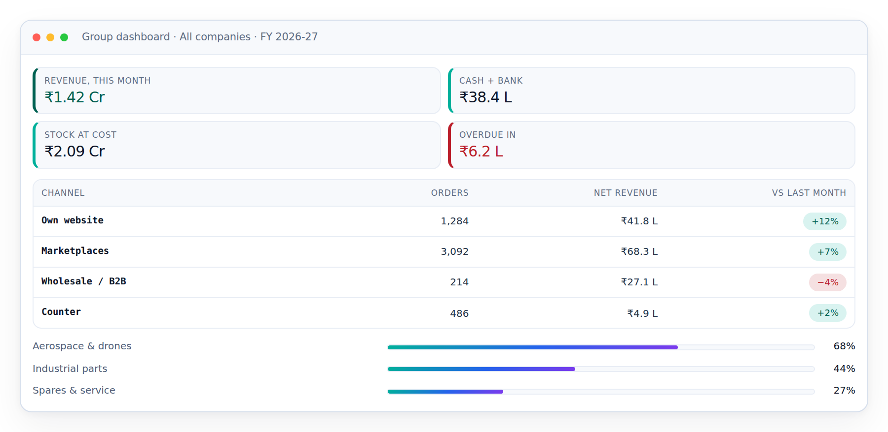

**Reads from:** Every module
**Writes to:** —

| App | What it does |
|---|---|
| **CEO Dashboard** | Cash, sales, stock, profit and alerts on one screen, refreshed as work happens. |
| **Report Builder** | Drag the fields you want into a report and save it for the whole team. |
| **Group Consolidation** | Several companies, one set of figures — sales, cash, stock and profit rolled up across every company you run, inter-company entries removed, with years of history to compare against. Add a company whenever the business grows one; nothing in the software caps the number, only the plan does. And a company with no tax registration of its own — a job-work arm, a new venture not yet registered — is a company like any other here, kept in the group figures without being dragged into a return it does not belong in. |
| **Excel Dashboard Builder** | A full workbook — financial summary, HR, purchase, sales, inventory and production, GST, expenses — generated from the live records behind every other screen, with each company shown as its own row and a consolidated row that is a formula over them, never a separately typed total. |
| **ESG / Sustainability Reporting** | Water usage, chemical compliance, waste and packaging, reported from the same certificate and audit records Quality & Compliance already keeps — so a sustainability report is a query over evidence already on file, not a separate exercise assembled once a year from scratch. |

---

#### Module 22 · AI Assistant, Agents & Automation
*Ask the business a question — and let the routine work run itself.*

Last for the same reason Dashboard & BI is late: something that answers questions about the whole business can only be built once the whole business is in one place. Three different things live here and the difference between them matters. An ASSISTANT answers a question you asked, from the records, with the records attached. A CHATBOT holds the same conversation with your customer instead of you. An AGENT is given a job rather than a question and works out the steps itself. That last one is what separates this module from Automation Studio in Module 20, where a person draws the steps in advance and the rule runs the same way every time; and from Automation in Module 17, which fires marketing campaigns and nothing else. Both of those stay exactly as they are — this module sits above them and calls them, rather than replacing either. Module 18 writes content; this module answers and acts.

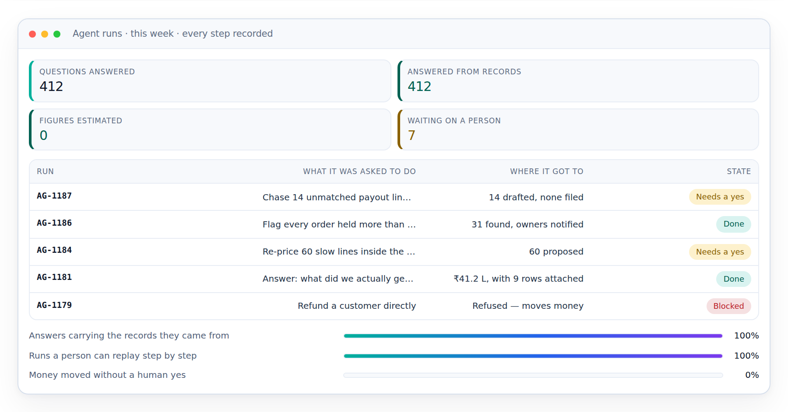

**Reads from:** Every module
**Writes to:** Projects & Collaboration · CRM · Marketing

| App | What it does |
|---|---|
| **AI Assistant** | Ask in your own words — “what did Myntra actually pay us last week, and what is still short?” — and get the answer with the rows it came from sitting underneath it, each one clicking through to the record. It reads the ledger, the stock table and the settlement lines the same way a report does, so the figure it gives is the figure the books give. When it cannot find the answer it says so and shows what it looked at; it never estimates a number and presents it as a fact, because a plausible wrong figure is far more expensive than an honest blank. It answers only from records the person asking is already allowed to open, so it can never become a way around permissions. |
| **AI Chatbot** | The same engine turned to face the customer, on your own storefront and on WhatsApp: where is my order, will this size fit me, I want to return this. It reads the real order and the real size chart rather than a script written six months ago, and it will say “let me get someone” instead of guessing at anything about money, a refund or a complaint. The handover goes into the Module 04 Helpdesk queue with the whole conversation already attached, so the person picking it up starts where the customer left off instead of asking them to explain again. It never asks a customer for a card number, a bank detail or a password — that promise does not get a chatbot-shaped exception. |
| **AI Agents** | A job rather than a question: “chase every unreconciled settlement line from last week and draft the claim for each.” The agent works out the steps, does them, and stops at the point where a person has to decide. It runs inside a scope you set — which records it may read, which it may write, and how much it may spend through the Module 01 Provider Router — and it cannot quietly widen that scope mid-run. Anything that moves money, files a claim, changes a price or sends a customer a message waits for a human yes. |
| **Agent Guardrails & Run Log** | What each agent is allowed to touch, written down as a scope rather than trusted to a prompt, and every run recorded step by step: what started it, what it read, what it proposed, what a person approved, what it actually changed. Kept in the same audit trail as everything else, with the same absence of an off switch. An agent whose working nobody can inspect afterwards is not a colleague, it is an unexplained entry in the books. |
| **Knowledge & Retrieval** | The index that makes the answers grounded: your own designs, rate cards, settlement files, standard procedures and past decisions, searchable so a reply quotes what is actually on file instead of what a model remembers about the trade in general. Permission-scoped at the row, so two people asking the same question get answers drawn only from what each of them may already see. |

---

### Companies and channels — how many is up to you

Whatever number you have, it is not a setting this system was built around, and it is not a ceiling.
A company is a **row**. A channel is a **row**. Every business record carries the company it belongs
to, and every sale carries the channel it came through. Ten companies selling on ten channels each is
the same three tables and the same code as one company selling on one.

```
   COMPANIES (a row each)          CHANNELS (a row each, per company)
   ┌──────────────┐                ┌───────────────────────────────────────┐
   │ Company 1    │───────────────▶│ Own storefront · marketplace ·        │
   │ Company 2    │───────────────▶│ counter · wholesale desk ·            │
   │ Company 3    │───────────────▶│ export buyer · …                      │
   │ …the eighth  │───────────────▶│ …the eleventh                         │
   └──────────────┘                └───────────────────────────────────────┘
          │                                          │
          └──────────────┬───────────────────────────┘
                         ▼
              ONE stock number per SKU
        the channel is on the sale, never on the stock
```

**Three things this buys you, and one it deliberately refuses.**

**Each company's books are its own.** Its trial balance balances on its own. No report can reach
across into another company's rows — not by convention, but because a journal line can only point at
an account that belongs to the same company, and a test checks that no line anywhere ever does.

**The group is the sum minus what you sold yourselves.** When one company in a group sells to
another, that is revenue in one set of books and cost in another. Adding the companies up would
report a group turnover the group never earned from the outside world. Every entry that names a
sister company is eliminated at group level, and the consolidation returns all three numbers —
gross, eliminated, group — so you can see the elimination rather than take it on trust.

**The channel is a dimension of the sale, never of the stock.** You can read this month by channel,
by company, or by both. What you cannot do is keep a separate stock number per channel, and that is
on purpose: the last unit sold on one marketplace has to vanish from the others at that instant,
which per-channel inventory cannot do.

**And the reporting follows your own sheets.** The report's columns come from the sheets that are
actually in the workbook you give it. A fourth company is a new sheet, not a new version of the
software.

> **This is checked, not claimed.** `core/tests/core.test.js` builds ten companies with ten
> channels each — a hundred channels — posts an order down every one plus ten inter-company sales,
> and asserts every company's books balance, that no journal line points at another company's
> account, and that the group figure is the plain sum **minus** inter-company trade: ₹2,10,500
> gross, ₹50,000 eliminated, ₹1,60,500 group. It then calls the same builder for eleven companies
> and eleven channels with no code changed.

---

### The rules that hold everywhere

1. **No app depends on any single outside company.** Every capability — books, marketplaces, AI
   writing, couriers, payments, messaging, storage, GST, printing, barcode — has several
   interchangeable providers and a by-hand option, so the system works with nothing connected at all.
   **A provider named as the source of a figure is a bug**; providers move messages and money, the
   ledger originates numbers.
2. **The books are this system's own.** No other accounting package is required, ever. Tally, BUSY
   and Zoho remain available for anyone already running one — nothing assumes them, and no figure is
   ever sourced from one.
3. **Nothing ever asks for an account password.** Outside services connect with a scoped, revocable
   key. *This system will never ask you for a marketplace, bank or account password. If any screen
   ever does, it is not this system.*
4. **Money is integer paise, never a floating-point number**, because float arithmetic accumulates
   the error that eventually shows up as a trial balance that will not tie.
5. **Values that change over time are effective-dated** — a salary, a price, a tax rate, a
   commission. March payroll resolves the salary in force *in March*. A missing value is an error,
   never silently treated as zero.
6. **Nothing is deleted, only deactivated.** A person who leaves keeps their name attached to years
   of earnings, approvals and audit rows that must still resolve.
7. **The audit trail has no off switch.** Eight years, before-and-after values, as the MCA rule
   requires — because an audit trail that can be switched off is one that gets silenced exactly when
   it matters.
8. **Gates, not warnings.** Each app refuses one thing outright, because a warning gets clicked
   through on a busy afternoon. A cash-on-delivery order cannot be packed below its advance. A bill
   for more than was accepted cannot be paid. Every gate is also a self-test.
9. **It is not trained. It is built.** No model learns from your data. Every rule is written down,
   visible on the Wiring screen, and checked by a self-test — so it is right on day one.
10. **You can reach it from anywhere, but it cannot be reached into.** Ask & Print takes a plain line
    from your phone and sends a PDF back. The office reaches out; the internet never reaches in.

---

### How it is verified

Nothing ships because it looked right on a screen.

1. **The arithmetic, with no screen involved.** Each engine runs in isolation and its self-tests
   execute against seeded data.
2. **Every screen and every control, in a real browser.** Each build opens in headless Chromium;
   every screen is visited and every interactive control on it is clicked. Any console error fails
   the build.
3. **The real job, with the result asserted.** Not "does the button click" but "did the thing
   happen". A control that looks alive but changes nothing fails the build.
4. **Against a business's own figures.** Where a business already knows the answer, the software has
   to reproduce it — and where it cannot, the reason is named rather than the number quietly
   adjusted. In the worked implementation carried furthest, every record in the owner's hand-made
   reference report is placed into a bucket with a named cause — matched exactly, changed at source,
   rate added since, a rule that applies, or present only in a source file that has since been
   restructured and can no longer be read — and the check fails on any record whose difference has
   no explanation. A mismatch is a bug, not a rounding difference; an unreadable input is a stated
   limitation, not a passing test.
5. **A structural audit.** Every "comes from" on every Wiring screen must name a module that actually
   exists, no vendor name may ever be the source of a figure, and the app count in every file must
   match this one.
6. **The shipped copy, not the working copy.** The packaged archive is extracted and re-tested in the
   folder a customer would open it in, because a packaging step that quietly renames a file breaks
   nothing until it is in somebody's Downloads folder.

---

### The honesty charter

This is the standard the build is held to, and it is written down because a standard nobody wrote
down is a standard nobody can be held to.

1. **This page describes a design.** Everything on it is what the system is being built to be, and
   nothing on it claims to already exist. When a part of it is finished, it will say so with the test
   that proves it — never before.
2. **Counts are counted, never claimed.** Every module and app figure on this page is read from the
   canonical module list when the page is built. No number here was typed by hand.
3. **Progress is reported as it is.** If tests fail, the failure is shown with its output. If a step
   was skipped, it is named as skipped. "Done" means implemented, tested and checked against the
   original request — not "the code has been written".
4. **Every capability names its alternatives.** No part of this system depends on a single outside
   company. Each layer names what it is built on, at least two replacements, and the interface the
   rest of the code talks to — so changing a supplier is a setting, not a rebuild.
5. **Uncertainty is surfaced, not smoothed over.** Where something cannot be verified, it is reported
   as unverified rather than presented as fact.

---

### Every technical word on this page, in plain language

**This page uses ordinary words wherever ordinary words will do.** Where it could not, the term is
here — with an everyday comparison, because a sales page that assumes you already know the jargon is
selling to somebody else.

Only the words this page actually uses are listed. Padding it with definitions of terms that never
appear would improve a count and make the page worse.

#### platform

One piece of software that many separate businesses use at the same time, each seeing only its own information.

*Ek badi building jisme bahut saare offices hain. Building ek hai, par har office ki chaabi alag — koi kisi aur ke office mein nahin ghus sakta.*

#### module

One area of work in the system — sales, purchase, staff, accounts. Each is a set of screens that belong together.

*Dukaan ke alag-alag counters. Ek counter bikri ka, ek kharidi ka, ek hisaab-kitaab ka.*

#### industry pack

A settings file that teaches the system your trade — what you call things, the stages your work moves through, the documents you issue.

*Ek hi machine, alag-alag saancha. Saancha badal do, wahi machine doosri cheez banane lagti hai.*

#### database

Where all the information is kept, arranged so any of it can be found instantly and nothing gets lost.

*Ek badi almari jisme har cheez apne fix khaane mein rakhi hai — dhoondhne ke liye poori almari palatni nahin padti.*

#### table

One kind of information inside the database — all your customers in one, all your orders in another.

*Almari ka ek khaana. Ek khaane mein sirf customers, doosre mein sirf orders.*

#### row

One single record — one customer, one order, one payment.

*Register mein ek line. Ek line matlab ek entry.*

#### schema

The written plan of what information the system keeps and how the pieces connect.

*Makaan ka naksha. Deewar uthane se pehle kaagaz pe tay hota hai kaunsa kamra kahaan hai.*

#### integer paise

Money stored as a whole number of paise instead of a decimal, so amounts are exact and rounding can never quietly lose a rupee.

*Paisa hamesha poore paise mein ginte hain, aadha-adhoora kabhi nahin — isliye hisaab kabhi ek rupya idhar-udhar nahin hota.*

#### audit trail

An automatic record of every change — what changed, who changed it, and when.

*Har entry ke saath naam aur time apne aap likha jaata hai. Baad mein koi bole "maine nahin kiya", toh register bata deta hai.*

#### API

The agreed way two pieces of software talk to each other, so one can ask the other for something and get a predictable answer.

*Waiter. Aap kitchen mein nahin jaate — waiter ko order dete ho, wahi khaana le aata hai. Waiter badal jaaye toh bhi order dene ka tarika wahi rehta hai.*

#### interface

A written promise about what a part of the system does, without saying which product does it — so the product underneath can be swapped without anything above noticing.

*Bijli ka socket. Socket ka size fix hai; usme koi bhi company ka plug lag jaata hai.*

#### storage

Where files are kept — photographs, invoices, scanned documents. Different from the database, which keeps information rather than files.

*Almari ke bagal wala godown. Register almari mein, par bade dabbe aur photo godown mein.*

#### queue

A waiting line for work that does not have to finish this second — sending a hundred messages, building a big report.

*Darzi ki dukaan ka parchi system. Kaam parchi pe likh ke lag gaya line mein; customer khada intezaar nahin karta.*

#### job

One piece of work taken off the queue and done in the background.

*Line mein se uthayi gayi ek parchi, ab uska kaam ho raha hai.*

#### deployment

Putting a new version of the software in place so people start using it.

*Nayi dukaan kholna ya purani ko naya roop dena — jab tak shutter nahin uthta, customer ko farq nahin padta.*

#### model

The piece of artificial intelligence that reads or writes text, tags a photograph, or answers a question.

*Ek bahut padha-likha assistant. Kaam accha karta hai, par har baat pe usse poochho toh kharcha aur waqt dono lagta hai.*

#### provider

A company whose service the system uses — for messages, for payments, for artificial intelligence, for delivery.

*Supplier. Ek supplier maal na de toh doosre se le lo — kaam nahin rukna chahiye.*

#### fallback

The next option the system automatically moves to when the first one fails or is unavailable.

*Bijli gayi toh inverter. Inverter gaya toh mombatti. Andhera kabhi nahin hota.*

#### role

What a person is allowed to see and do — a manager sees more than a counter staff member.

*Chaabi ka guccha. Manager ke paas zyada chaabiyaan, staff ke paas kam.*

#### permission

One specific thing a role is allowed to do, like approving a discount or viewing salaries.

*Guchhe ki ek chaabi. Ek chaabi ek darwaza.*


---

*Medhava · one business, one brain · 22 modules · 113 apps · one shared data core*


---

# PART TWO — THE PLAN OF ACTION

### One business operating system. Any industry. One shared data core.

<!-- COUNTS -->
**22 modules · 113 apps · 285 rules (86 enforced) · 113 tables · 46 product screens across 12 sectors · 19 tool capabilities · 10 industry packs.**
Every count in this line is read from `brand/site/modules.js`, `brand/site/rules.js`,
`brand/site/shots.js`, `brand/site/tools.js`, `core/schema.postgres.sql` and `core/packs/`
by `brand/site/mkcounts.js` — no figure here was typed from memory.
<!-- /COUNTS -->

**What this document is.** The plan for building Medhava as a product that any business can
adopt, from planning through execution. It is not the Vastrangam plan with the names changed.
`PLAN_OF_ACTION.md` is that: one ethnic-wear group in Surat adopting this engine, with its own
karigar payroll, its own three companies, its own migration off an accounting package. That
document stays as it is, and it is the most useful thing in this repository — it is the worked
example of the whole exercise, an entire industry implementation carried to the level of detail
that proves the engine bends.

This document answers the different question: **how does the same engine serve a dental clinic
and a freight forwarder and a dairy co-operative, without becoming a different program each
time?**

---

## PART I — WHAT MEDHAVA IS

### M1 · ONE ENGINE, MANY TRADES

Medhava is a single application over one shared data core. A business event is entered once and
flows everywhere it belongs — that law, and the cascades that follow from it, are set out in full
in `PLAN_OF_ACTION.md` §A0 and are identical here, because it is the same engine. This document
does not restate them.

What is specific to Medhava is the claim that the engine does not know which trade it is in. That
claim is either true in the code or it is marketing, so here is where it is enforced:

| The claim | What makes it true |
|---|---|
| No module assumes an industry | `brand/site/modules.js` is audited at build time; trade vocabulary in it fails the build |
| Trade words live in one place | The edition overlay may change wording only — `build.js` compares the structural shape before and after applying it and exits if a module number, an app name or an app count moved |
| The same structure ships twice already | Two editions build from one module list: MEDHAVA neutral, VASTRANGAM in one trade’s own words |
| The number of companies is data | `core/tests/core.test.js` posts across a 10 × 10 company × channel grid, then runs 11 × 11 with no code changed |

**The sentence the whole product rests on.** A clinic’s appointment, a factory’s work order, a law
firm’s matter, a contractor’s site and a service firm’s job are the same record with different
words on it. Everything below is the work of making that true rather than clever.

Drawn, because the shape is the argument:

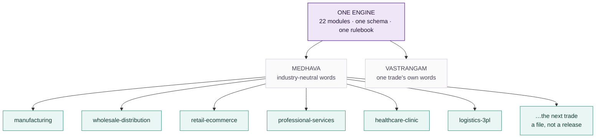
```mermaid
flowchart TB
  classDef core fill:#EFE7F8,stroke:#6B3CA6,color:#241436,stroke-width:1.4px;
  classDef ed fill:#FAFAFB,stroke:#CFC7D8,color:#4A4458;
  classDef pack fill:#EAF6F3,stroke:#2E8B76,color:#123C34;
  ENG["ONE ENGINE<br/>22 modules · one schema · one rulebook"]:::core
  ENG --> MED["MEDHAVA<br/>industry-neutral words"]:::ed
  ENG --> VAS["VASTRANGAM<br/>one trade's own words"]:::ed
  MED --> P1["manufacturing"]:::pack
  MED --> P2["wholesale-distribution"]:::pack
  MED --> P3["retail-ecommerce"]:::pack
  MED --> P4["professional-services"]:::pack
  MED --> P5["healthcare-clinic"]:::pack
  MED --> P6["logistics-3pl"]:::pack
  MED --> PN["…the next trade<br/>a file, not a release"]:::pack
```

The editions differ in **wording**. The packs differ in **configuration**. Neither is a copy of the
code, and that is the only reason one team can carry all of them.

### M2 · THE INDUSTRY PACK ENGINE

An earlier version of this document said, in this place, that the industry pack was **specified,
not built** — that a third trade meant someone writing a third overlay by hand, and that this
did not scale to a product. That was the honest state of it then. It is built now, and the
paragraphs below say what was built, what it refuses, and which trades it was pointed at first
and why.

#### M2.1 · Which trades actually run this software

The pack order was not chosen by taste. It was chosen by looking up who actually buys ERP, order
management and warehouse management, and building for the largest first. Published estimates
differ between research houses — sometimes considerably, because "share of users" and "share of
revenue" are different questions — so the figures below are attributed, and the ranking rather
than any single number is what the build order rests on.

**ERP — who the users are**

| Industry | Share of ERP users | Note |
|---|---|---|
| **Manufacturing** | ~21% of users; ~32% of market revenue | The largest block on every measure. Cited elsewhere as 19.7% of revenue — the spread is why the ranking, not the decimal, is what is used |
| Banking, financial services, insurance | ~16% | Heavily served by specialist systems rather than general ERP |
| **Professional and financial services** | 13.86% | The second-largest block, and the one with no stock at all |
| **Distribution and wholesale** | 9.90% | Credit and movement, not production |
| **Healthcare** | 4.95% | Small today — and the fastest-growing, at **22.37% CAGR to 2030** |
| Construction | 1.98% | |
| Education | 0.99% | |

Finance and insurance, manufacturing and public administration together account for roughly 60%
of total ERP spend.

**WMS — who the users are**

| End user | Share | Note |
|---|---|---|
| **Retail and e-commerce** | ~28%, about $1.37bn in 2025, 10.1% CAGR | The largest WMS segment |
| **Manufacturing** | 23.6–30.22% depending on the source | |
| **Healthcare and pharmaceuticals** | ~10% | **The fastest-growing, at 12.2% CAGR** |

The whole WMS market is put at $3.4bn–$5.92bn in 2025, again depending on who is counting and
what they count as WMS.

**OMS and third-party logistics — which markets are served**

| Market served by 3PLs | Share |
|---|---|
| **Transportation** | 90% |
| **Manufacturing** | 83% |
| **Retail** | 83% |
| **E-commerce** | 68% |
| **Wholesale** | 67% (down from 83% the previous year) |

And among the technology services those providers offer, **order management ranks first** — ahead
of visibility (86%), transport management (84%), optimisation (77%) and ERP integration (75%).
That is the finding that matters most for Medhava’s shape: for a large part of this market the
order, not the ledger, is the system of record.

*Sources, read 2026-08-23: Grand View Research, Mordor Intelligence, HG Insights, MarketsandMarkets,
Manufacturing Lead Generation, Inbound Logistics (3PL Perspectives), Electro IQ, openpr, NetSuite.
These are market-research estimates, not measurements; they are used here to order a build queue,
which is what they are good for, and not quoted anywhere in the product as fact.*

#### M2.2 · What a pack is

An industry pack is a row of configuration, loaded as data, that carries:

- **vocabulary** — what this trade calls an order, a customer, a unit of work, a stage
- **stages** — the pipeline a job moves through, named and ordered by the trade
- **fields** — the extra attributes this trade needs on a record, and their types
- **documents** — the papers it issues, and what has to be on them
- **rule switches** — which discretionary rules apply, and at what thresholds
- **starting data** — a chart of accounts, roles, units of measure

The engine reads a pack the way it already reads companies and channels: as rows. Nothing in
`modules.js`, `core/` or the schema changes when a fourteenth trade is added — which is exactly
the property the 10 × 10 test already proves for companies, applied to trades.

#### M2.2a · How a pack becomes a screen

Nothing about this is magic, and the picture is the fastest way to see that:

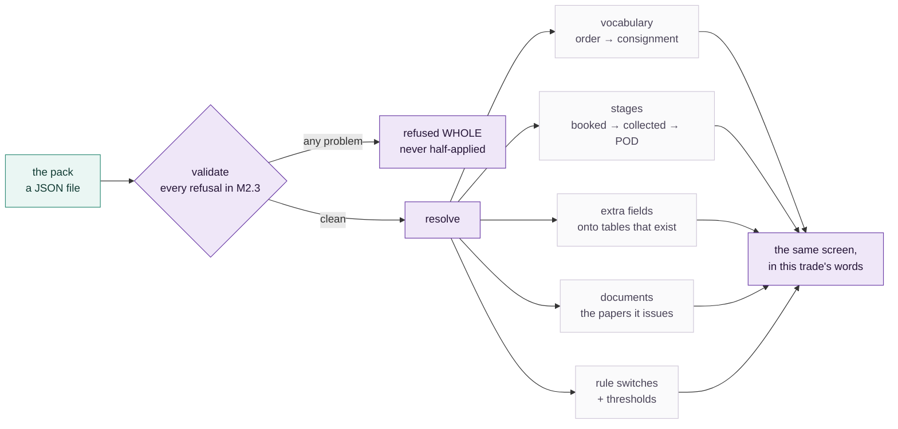
```mermaid
flowchart LR
  classDef d fill:#EAF6F3,stroke:#2E8B76,color:#123C34;
  classDef e fill:#EFE7F8,stroke:#6B3CA6,color:#241436;
  classDef s fill:#FAFAFB,stroke:#CFC7D8,color:#4A4458;
  PACK["the pack<br/>a JSON file"]:::d --> V{"validate<br/>every refusal in M2.3"}:::e
  V -->|"any problem"| NO["refused WHOLE<br/>never half-applied"]:::e
  V -->|"clean"| R["resolve"]:::e
  R --> W["vocabulary<br/>order → consignment"]:::s
  R --> ST["stages<br/>booked → collected → POD"]:::s
  R --> F["extra fields<br/>onto tables that exist"]:::s
  R --> DOC["documents<br/>the papers it issues"]:::s
  R --> RU["rule switches<br/>+ thresholds"]:::s
  W --> SC["the same screen,<br/>in this trade's words"]:::e
  ST --> SC
  F --> SC
  DOC --> SC
  RU --> SC
```

#### M2.3 · What a pack may never do

A configuration file that can do anything is not configuration, it is a hole. Six refusals are
enforced in `core/packs.js` and each one is a named test in `core/tests/packs.test.js`:

| A pack may not | Because |
|---|---|
| contain executable code, at any depth | the moment a pack can run code, adding a trade is a code change again and the whole guarantee is worthless |
| invent a concept the engine does not have | "vocabulary" would quietly become a place to put anything, and the screens would carry a name for something that does not exist |
| add a field to a table that does not exist | the shape of the database would move outside the reach of the schema test that guards it |
| declare money as a plain number | the entire schema was built to keep floating-point rupees out; a pack is not a side door |
| switch off an immutable rule | a trade may call an invoice a fee note; it may not decide its audit trail is optional |
| be applied in part | a half-loaded trade is a system whose vocabulary and rules disagree, with no way to tell which half is live |

The rule ids marked immutable in `core/packs.js` cover company scoping, the audit trail, the posting rules,
group elimination and roster privacy — and a test asserts that every one of them really exists in
the rulebook, so the protection cannot silently guard nothing.

One default is worth stating on its own, because getting it backwards would be invisible: **a rule
a pack never mentions is ON.** The rulebook is the default and a pack is an exception list, never
a permission list. The other way round, every rule added after a pack was written would silently
apply to nobody using it.

#### M2.4 · Which packs ship

Built in the order the research ranks them:

| Rank | Pack | Sector | What it is really for |
|---|---|---|---|
| 1 | `manufacturing` | Manufacturing | The largest ERP user base, and the vocabulary furthest from a service firm’s |
| 2 | `wholesale-distribution` | Distribution | Credit, not production, is the thing the software has to hold |
| 3 | `retail-ecommerce` | Retail | The largest WMS segment; returns and settlement are the hard part |
| 4 | `professional-services` | Services | No stock at all — the hardest case for the neutrality claim |
| 5 | `healthcare-clinic` | Healthcare | Small now, fastest-growing on every measure |
| 6 | `logistics-3pl` | Logistics | The most-served 3PL market, where the order *is* the product |

#### M2.5 · The gate, and what it proves

Phase 2's gate was written before the engine was: *a third trade is added without writing code.*
`core/tests/packs.test.js` §4 runs it, and runs it harder than the phase asked. During the test
run it invents a **commercial laundry** — a trade that appears nowhere in this repository, in no
pack, in no module, in no rule — hands the engine a JSON string, and then requires the whole
system to answer in that trade’s words: an order reads as a docket, a work order as a wash load,
a customer as an account. Its pipeline resolves ordered and terminating, its extra fields land on
real tables, its rule switches resolve against the real rulebook, and it is refused the audit
trail exactly as the six shipped packs are.

A last assertion closes the loop: **`core/packs.js` may not contain a single trade word.** Not
laundry, not clinic, not freight, not dealer, not matter, not patient. If the engine ever learns a
trade, the test fails — because an engine that knows one trade’s words has an opinion about which
trades are normal, and that is the failure this whole section exists to prevent.

What the gate actually does, step by step:

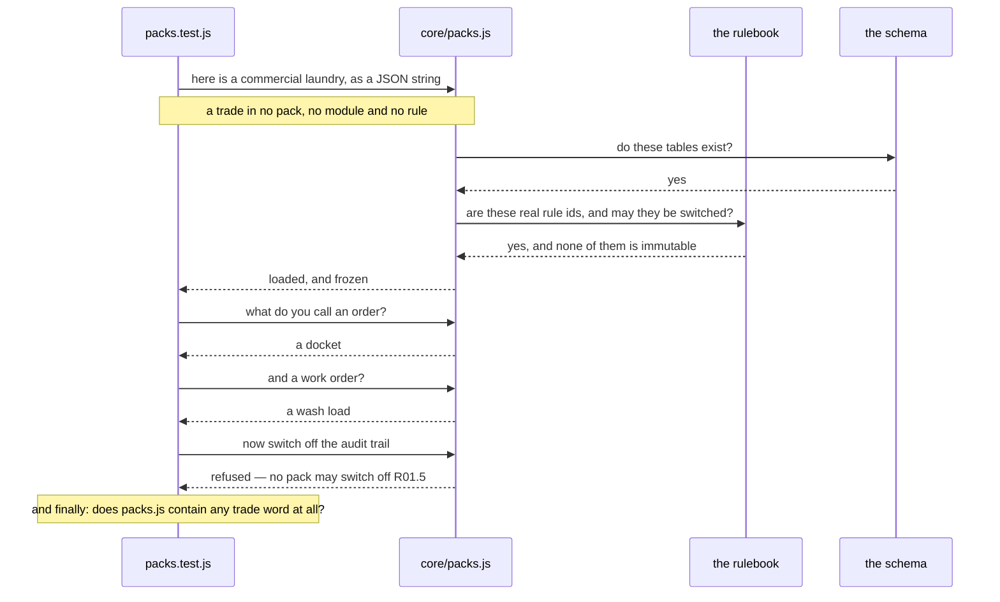
```mermaid
sequenceDiagram
  participant T as packs.test.js
  participant E as core/packs.js
  participant R as the rulebook
  participant S as the schema
  T->>E: here is a commercial laundry, as a JSON string
  Note over T,E: a trade in no pack, no module and no rule
  E->>S: do these tables exist?
  S-->>E: yes
  E->>R: are these real rule ids, and may they be switched?
  R-->>E: yes, and none of them is immutable
  E-->>T: loaded, and frozen
  T->>E: what do you call an order?
  E-->>T: a docket
  T->>E: and a work order?
  E-->>T: a wash load
  T->>E: now switch off the audit trail
  E-->>T: refused — no pack may switch off R01.5
  Note over T: and finally: does packs.js contain any trade word at all?
```

`node core/tests/packs.test.js` → **every check passes, 0 failures.**

### M3 · TENANCY — WHAT IS A ROW AND WHAT IS CODE

| Concept | Row or code | Consequence |
|---|---|---|
| Tenant (a customer of Medhava) | row | Onboarding a business is data entry, not a deployment |
| Company inside a tenant | row | A group with four companies is four rows, consolidated with inter-company trade eliminated |
| Channel | row | A new marketplace is a row; rule R15.1 makes discovery automatic |
| Location, stage, role | row | A warehouse, a production stage and a job title are all configuration |
| **Industry pack** | row | A trade is configuration, not a fork — `core/packs.js`, six packs shipped, a seventh added during the test run |
| The 22 modules | code | The structure is the product; it is the same for everyone |
| The rulebook | code | Which apply is configurable; what they refuse is not — and 22 of them cannot be switched off by any pack |

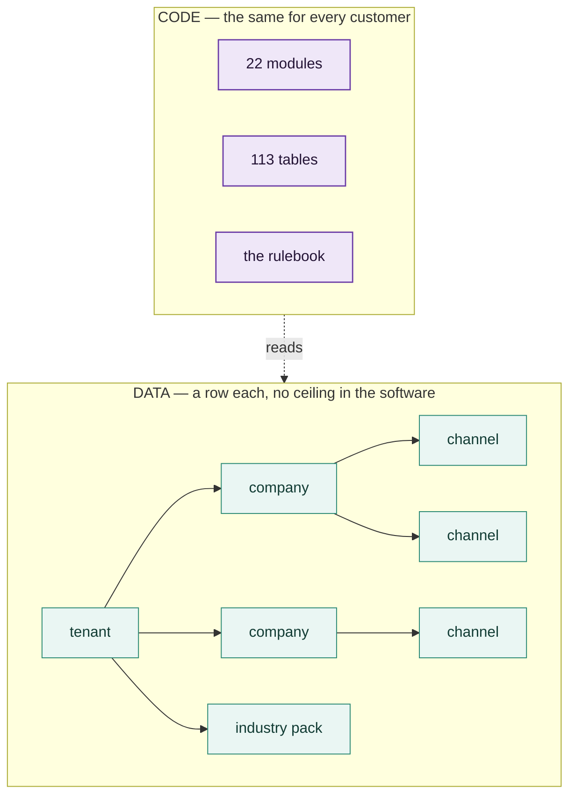
```mermaid
flowchart TB
  classDef row fill:#EAF6F3,stroke:#2E8B76,color:#123C34;
  classDef code fill:#EFE7F8,stroke:#6B3CA6,color:#241436,stroke-width:1.4px;
  subgraph CODE["CODE — the same for every customer"]
    M["22 modules"]:::code
    SCH["113 tables"]:::code
    RB["the rulebook"]:::code
  end
  subgraph DATA["DATA — a row each, no ceiling in the software"]
    T["tenant"]:::row --> C1["company"]:::row
    T --> C2["company"]:::row
    C1 --> CH1["channel"]:::row
    C1 --> CH2["channel"]:::row
    C2 --> CH3["channel"]:::row
    T --> PK["industry pack"]:::row
  end
  CODE -.->|"reads"| DATA
```

**Isolation.** Every business table carries `company_id` and a row-level security policy carrying
both `USING` and `WITH CHECK`, so a read and a write are separately prevented from crossing a
boundary. `core/tests/schema.test.js` fails the build if any company-scoped table lacks one.
Cross-tenant isolation is the same mechanism one level up and is the single highest-risk item in
this plan — a bug there is not a defect, it is an incident.

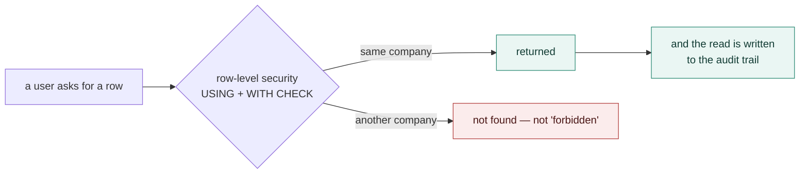
```mermaid
flowchart LR
  classDef ok fill:#EAF6F3,stroke:#2E8B76,color:#123C34;
  classDef no fill:#FBECEC,stroke:#B3403F,color:#4A1615;
  U["a user asks for a row"] --> RLS{"row-level security<br/>USING + WITH CHECK"}
  RLS -->|"same company"| Y["returned"]:::ok
  RLS -->|"another company"| N["not found — not 'forbidden'"]:::no
  Y --> A["and the read is written<br/>to the audit trail"]:::ok
```

### M4 · THE 22 MODULES, READ FROM TWELVE TRADES

**How the modules feed each other.** Generated from the `reads` field on every module in
`brand/site/modules.js` by `brand/site/mkdiagrams.js` — the same field the website renders as
"Reads from" — so it cannot drift from the module list. Cut into bands because all 22 modules and
all 44 edges on one page rendered as an unreadable tangle; the information is the same, the page
is legible.

<!-- MODULEGRAPH -->
**Foundation** — what it reads, and from where.

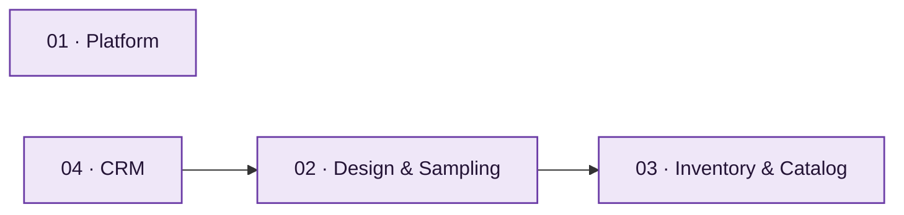
```mermaid
flowchart LR
  classDef me fill:#EFE7F8,stroke:#6B3CA6,color:#241436,stroke-width:1.4px;
  classDef up fill:#FAFAFB,stroke:#CFC7D8,color:#4A4458;
  M01["01 · Platform"]:::me
  M02["02 · Design & Sampling"]:::me
  M03["03 · Inventory & Catalog"]:::me
  M04["04 · CRM"]:::me
  M04 --> M02
  M02 --> M03
```

**Selling** — what it reads, and from where.

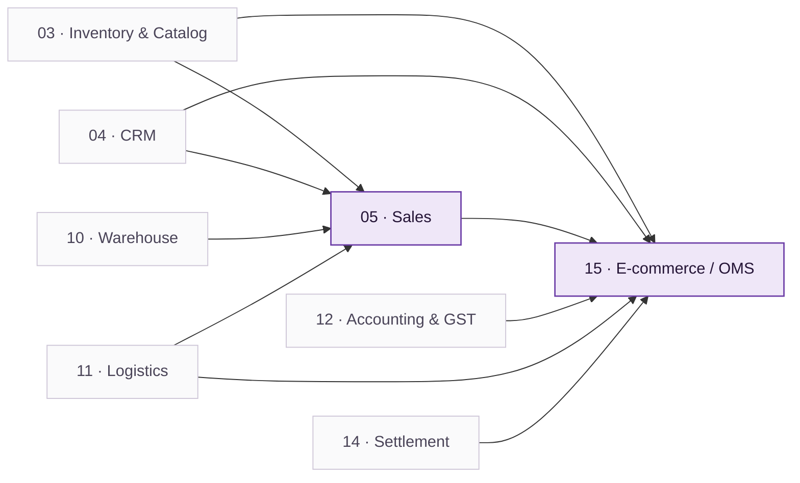
```mermaid
flowchart LR
  classDef me fill:#EFE7F8,stroke:#6B3CA6,color:#241436,stroke-width:1.4px;
  classDef up fill:#FAFAFB,stroke:#CFC7D8,color:#4A4458;
  M03["03 · Inventory & Catalog"]:::up
  M04["04 · CRM"]:::up
  M10["10 · Warehouse"]:::up
  M11["11 · Logistics"]:::up
  M12["12 · Accounting & GST"]:::up
  M14["14 · Settlement"]:::up
  M05["05 · Sales"]:::me
  M15["15 · E-commerce / OMS"]:::me
  M03 --> M05
  M04 --> M05
  M10 --> M05
  M11 --> M05
  M03 --> M15
  M04 --> M15
  M05 --> M15
  M12 --> M15
  M11 --> M15
  M14 --> M15
```

**Planning & making** — what it reads, and from where.

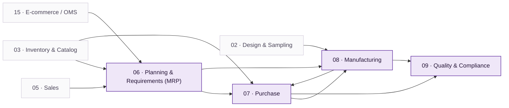
```mermaid
flowchart LR
  classDef me fill:#EFE7F8,stroke:#6B3CA6,color:#241436,stroke-width:1.4px;
  classDef up fill:#FAFAFB,stroke:#CFC7D8,color:#4A4458;
  M05["05 · Sales"]:::up
  M15["15 · E-commerce / OMS"]:::up
  M03["03 · Inventory & Catalog"]:::up
  M02["02 · Design & Sampling"]:::up
  M06["06 · Planning & Requirements (MRP)"]:::me
  M07["07 · Purchase"]:::me
  M08["08 · Manufacturing"]:::me
  M09["09 · Quality & Compliance"]:::me
  M05 --> M06
  M15 --> M06
  M03 --> M06
  M03 --> M07
  M06 --> M07
  M08 --> M07
  M07 --> M08
  M06 --> M08
  M02 --> M08
  M07 --> M09
  M08 --> M09
```

**Moving it** — what it reads, and from where.

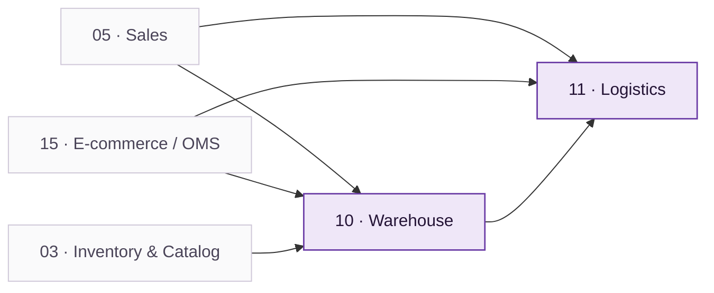
```mermaid
flowchart LR
  classDef me fill:#EFE7F8,stroke:#6B3CA6,color:#241436,stroke-width:1.4px;
  classDef up fill:#FAFAFB,stroke:#CFC7D8,color:#4A4458;
  M05["05 · Sales"]:::up
  M15["15 · E-commerce / OMS"]:::up
  M03["03 · Inventory & Catalog"]:::up
  M10["10 · Warehouse"]:::me
  M11["11 · Logistics"]:::me
  M05 --> M10
  M15 --> M10
  M03 --> M10
  M05 --> M11
  M15 --> M11
  M10 --> M11
```

**The money** — what it reads, and from where.

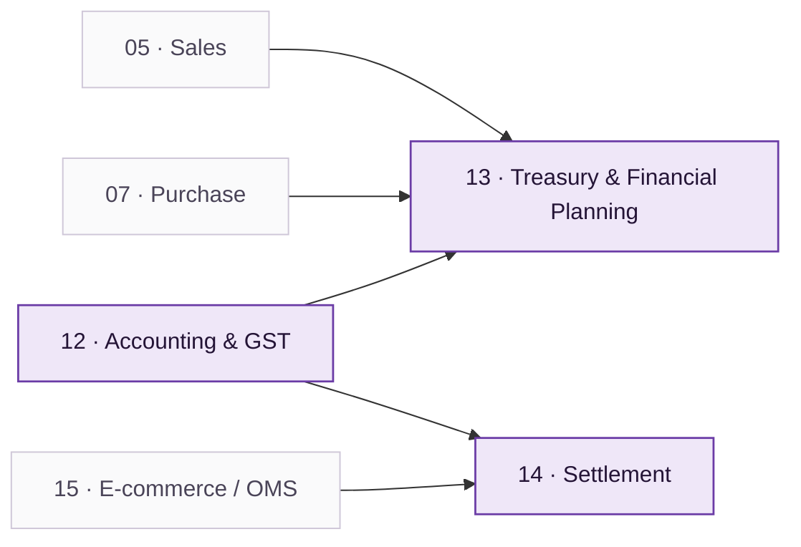
```mermaid
flowchart LR
  classDef me fill:#EFE7F8,stroke:#6B3CA6,color:#241436,stroke-width:1.4px;
  classDef up fill:#FAFAFB,stroke:#CFC7D8,color:#4A4458;
  M05["05 · Sales"]:::up
  M07["07 · Purchase"]:::up
  M15["15 · E-commerce / OMS"]:::up
  M12["12 · Accounting & GST"]:::me
  M13["13 · Treasury & Financial Planning"]:::me
  M14["14 · Settlement"]:::me
  M12 --> M13
  M05 --> M13
  M07 --> M13
  M15 --> M14
  M12 --> M14
```

**People & demand** — what it reads, and from where.

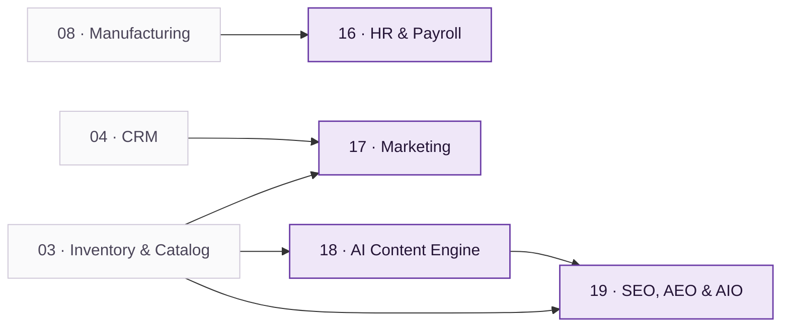
```mermaid
flowchart LR
  classDef me fill:#EFE7F8,stroke:#6B3CA6,color:#241436,stroke-width:1.4px;
  classDef up fill:#FAFAFB,stroke:#CFC7D8,color:#4A4458;
  M08["08 · Manufacturing"]:::up
  M03["03 · Inventory & Catalog"]:::up
  M04["04 · CRM"]:::up
  M16["16 · HR & Payroll"]:::me
  M17["17 · Marketing"]:::me
  M18["18 · AI Content Engine"]:::me
  M19["19 · SEO, AEO & AIO"]:::me
  M08 --> M16
  M03 --> M17
  M04 --> M17
  M03 --> M18
  M03 --> M19
  M18 --> M19
```

**Across the business** — what it reads, and from where.

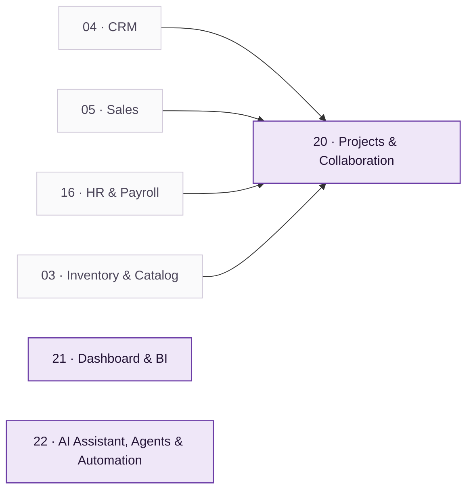
```mermaid
flowchart LR
  classDef me fill:#EFE7F8,stroke:#6B3CA6,color:#241436,stroke-width:1.4px;
  classDef up fill:#FAFAFB,stroke:#CFC7D8,color:#4A4458;
  M04["04 · CRM"]:::up
  M05["05 · Sales"]:::up
  M16["16 · HR & Payroll"]:::up
  M03["03 · Inventory & Catalog"]:::up
  M20["20 · Projects & Collaboration"]:::me
  M21["21 · Dashboard & BI"]:::me
  M22["22 · AI Assistant, Agents & Automation"]:::me
  M04 --> M20
  M05 --> M20
  M16 --> M20
  M03 --> M20
```

**01, 03, 04, 12, 21, 22** declare that they read *every module*: they sit on the
shared data core rather than on any one upstream module, which is why no arrow into them is
drawn above. Everything else reads exactly what the arrows show.

<!-- /MODULEGRAPH -->


The module list is in `PLAN_OF_ACTION.md` Part II in full, with every app and every rule.
It is not repeated here. What is here is the reading that makes it industry-neutral — the same
module, seen from a different trade:

| Module | Manufacturing | Professional services | Healthcare | Hospitality |
|---|---|---|---|---|
| 02 Design & Sampling | part revision | matter scoping | protocol | recipe development |
| 05 Sales | order book | engagement letter | appointment book | cover forecast |
| 06 Planning | material requirement | resourcing | rota and stock | purchase plan |
| 08 Manufacturing | work order, stages | — | — | batch and prep |
| 09 Quality | inspection | file review | licence and calibration | food safety log |
| 10 Warehouse | pick and pack | — | consumables | store issue |
| 16 HR | shift and piece-rate | timesheets, chargeable | sessions and locums | rota and casuals |
| 20 Projects | improvement work | matters | care pathways | openings |

The landing page carries every one of the product screens counted at the head of this document,
across all twelve sectors, doing exactly this — the same module
rendered with a machine shop’s figures and a clinic’s figures, one under the other. That is the
argument made where it can be checked rather than believed.

---

## PART II — EXECUTION

### M5 · THE STACK, AND WHAT IT COSTS

The full tools register is `brand/site/tools.js`, gated by `brand/site/checktools.js`, which
fails the build if any paid tool does not name **both** the free option it replaces and the
concrete condition that forces the upgrade. "When we grow" is rejected by the checker; a number
or a named event passes.

**19 capabilities. Only three have no free path in existence:**

| Capability | Why there is no free option | What it costs |
|---|---|---|
| WhatsApp Business messaging | Meta requires an approved provider; there is no free tier to outgrow | ~₹1,500–3,000/month plus per-conversation charges |
| SMS | Carrier access is the cost | ~₹0.15–0.25 per message |
| Generated imagery | Free software, but it needs a graphics card | A GPU, or a hosted API per image |

Everything else runs on free tiers or free software until a stated trigger fires: Postgres,
self-hosted automation, a free hosting tier, local AI, the browser’s own speech synthesis,
ffmpeg and Chromium for media, UPI for payments, CSV for every integration, and a progressive
web app instead of a store listing. **A business can run the whole system on zero rupees of
software licence** and pay only for the three lines above, and only when it reaches them.

The Provider Router in Module 01 puts a spend ceiling in front of every paid call and refuses
past it rather than warning — so the AI line in particular cannot quietly become the largest one.

**How a line ever becomes a paid line.** Every capability starts free and only moves when a stated
condition fires — which is the whole discipline `brand/site/checktools.js` exists to enforce:

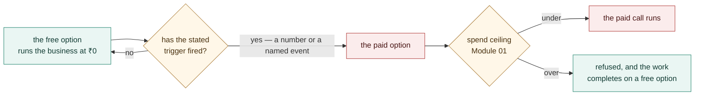
```mermaid
flowchart LR
  classDef free fill:#EAF6F3,stroke:#2E8B76,color:#123C34;
  classDef gate fill:#FFF7E8,stroke:#B08343,color:#4A3210;
  classDef paid fill:#FBECEC,stroke:#B3403F,color:#4A1615;
  F["the free option<br/>runs the business at ₹0"]:::free --> T{"has the stated<br/>trigger fired?"}:::gate
  T -->|"no"| F
  T -->|"yes — a number or a named event"| P["the paid option"]:::paid
  P --> C{"spend ceiling<br/>Module 01"}:::gate
  C -->|"under"| GO["the paid call runs"]:::paid
  C -->|"over"| BACK["refused, and the work<br/>completes on a free option"]:::free
```

A paid entry with no free predecessor and no concrete trigger **fails the build**. "When we grow"
is not a trigger; a number is.

### M6 · THE EIGHT PHASES

The gate is absolute: **Phase N+1 does not start until Phase N’s tests pass.** A phase is done
when its stated result is reproduced, not when its code is written.

| Phase | What gets built | Done when |
|---|---|---|
| **0 · Setup** | Environments, CI, monitoring, the schema loaded | A commit deploys and a user logs in |
| **1 · Foundation & tenancy** | Tenants, companies, roles, RLS, masters, the SKU/item model | Two tenants exist and neither can read a single row of the other, proved by a test that tries |
| **2 · The industry pack engine** | Vocabulary, stages, fields, documents and starting data as rows | A trade nobody designed for is added **without writing code**, during the test run, from a plain settings file |
| **3 · Core operations** | Inventory, procurement, production, quality, warehouse | Three trades run the same operations screens on their own vocabulary |
| **4 · Commerce & channels** | Sales all channels, OMS, returns, logistics, settlement | A week of orders across channels, settled and reconciled |
| **5 · Finance** | Double-entry, tax, banking, period locks | A month closes: trial balance ties and returns generate from vouchers |
| **6 · The AI layer** | Assistant, chatbot, agents, guardrails, content | An assistant answer matches the books; an agent asked to move money stops |
| **7 · Onboarding & self-serve** | Sign-up, pack selection, import, go-live | A business onboards itself in a day without a call |

**Phase 2 is the one that decides whether this is a product or a project.** Its gate is written
before its engine — *a new trade must be addable without a developer* — and it runs on every test
pass against a trade nobody designed for. Everything from Phase 3 onward stands on that claim, so it
is checked rather than argued.

The same eight phases as a sequence:


```mermaid
gantt
  title The eight phases — each one gated by its own test
  dateFormat X
  axisFormat %s
  section Foundation
  0 · Setup                        :p0, 0, 1
  1 · Foundation and tenancy       :p1, 1, 2
  section The product claim
  2 · The industry pack engine     :p2, 3, 2
  section Operations
  3 · Core operations              :p3, 5, 3
  4 · Commerce and channels        :p4, 8, 3
  5 · Finance                      :p5, 11, 2
  section On top
  6 · The AI layer                 :p6, 13, 3
  7 · Onboarding and self-serve    :p7, 16, 2
```

*Bars show sequence and relative size, not calendar dates — a phase ends when its test passes, and
a date typed here would be a promise the gate does not make.*

### M7 · ONBOARDING A BUSINESS IN A DAY

For a business with no system to migrate from — which is most of the target market — the sixty-day
parallel run in the Vastrangam plan is the wrong shape entirely. The sequence is:

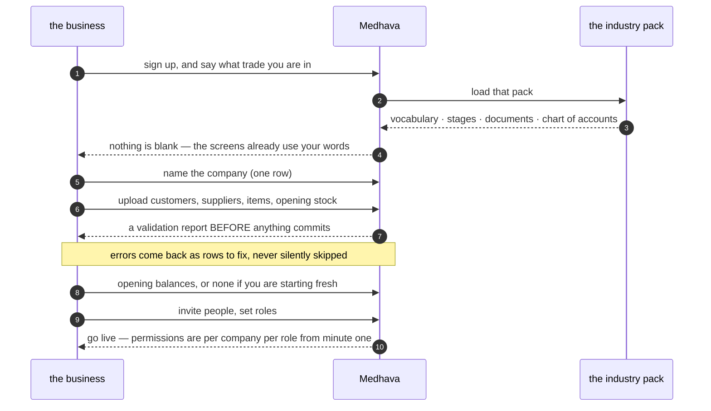
```mermaid
sequenceDiagram
  autonumber
  participant B as the business
  participant M as Medhava
  participant P as the industry pack
  B->>M: sign up, and say what trade you are in
  M->>P: load that pack
  P-->>M: vocabulary · stages · documents · chart of accounts
  M-->>B: nothing is blank — the screens already use your words
  B->>M: name the company (one row)
  B->>M: upload customers, suppliers, items, opening stock
  M-->>B: a validation report BEFORE anything commits
  Note over B,M: errors come back as rows to fix, never silently skipped
  B->>M: opening balances, or none if you are starting fresh
  B->>M: invite people, set roles
  M-->>B: go live — permissions are per company per role from minute one
```


1. **Sign up, pick a trade.** The industry pack loads vocabulary, stages, documents and a chart
   of accounts. Nothing is blank.
2. **Name the company.** One row. A group adds more rows now or later.
3. **Import what exists** — customers, suppliers, items, opening stock — from a spreadsheet, with
   a validation report **before** anything commits. Errors are shown as rows to fix, never
   silently skipped.
4. **Opening balances**, or none at all if the business is starting fresh.
5. **Invite people, set roles.** Permissions are per company per role from the first minute.
6. **Do one real transaction end to end** — one sale, invoiced, stock moved, posted — and click
   the dashboard figure down to the voucher. That is the go-live test, and it takes a minute.

**For a business migrating from an existing system**, the discipline in `PLAN_OF_ACTION.md`
Part IV E5 applies unchanged: export, clean, load, opening balances, parallel run, and a
decommission criterion agreed in advance rather than argued at the end.

### M8 · SECURITY AND COMPLIANCE

Row-level security in the database and permission checks in API middleware — one layer is one
mistake away from a cross-tenant read. Personal data is exportable and erasable on request, with
consent and retention tracked as the two separate clocks they are. Card data never reaches this
system; the gateway’s own secured field takes it, so there is no scope to protect. The audit
trail has no off switch, and R16.22 keeps individual pay and personal attributes out of any
document that leaves the building.

### M9 · PERFORMANCE

| Operation | p95 |
|---|---|
| Page load, cached / uncached | < 1 s / < 3 s |
| Live stock or availability query | < 500 ms |
| Document PDF | < 2 s |
| Channel order pull, per channel | < 60 s |
| Settlement import, 1,000 lines | < 30 s |
| Daily profit-and-loss refresh | < 10 s |

The availability query is the one that decides whether people trust the system: it runs on every
screen showing a quantity or a free slot, and one that takes two seconds is one people stop asking.

### M10 · RISK REGISTER

| Risk | Likelihood | Impact | Mitigation |
|---|---|---|---|
| **Cross-tenant data leak** | Low | **Critical** | RLS with USING and WITH CHECK, middleware checks, a test that actively attempts a cross-tenant read |
| The industry pack engine slips, and trades get hard-coded instead | **High** | **Critical** | Phase 2 gate: a third trade added with no code. Hold the gate |
| A vertical demands a genuine structural exception | Medium | High | Add it as a module or an app for everyone, never as a branch for one customer |
| Free tier terms change or a tier disappears | Medium | Medium | Every capability has a self-host route recorded; the register is dated |
| WhatsApp provider outage | Low | High | Adapter swap; SMS and in-app as fallback |
| Onboarding needs hand-holding, so it does not scale | High | Medium | The day-one sequence above is a tested path, not a document |
| AI spend runs away | Medium | Medium | The spend ceiling refuses rather than warns |

### M11 · SUCCESS METRICS

| Measure | Target |
|---|---|
| A new trade supported without writing code | Yes, from Phase 2 onward — binary, not a percentage |
| Time for a business to onboard itself | Under a day, unattended |
| Cost to run for a business at pilot scale | ₹0 in software licence |
| Rules enforced by a test | the enforced-of-total figure at the head of this document; up every build |
| Cross-tenant incidents | Zero, and this is the only metric with no acceptable non-zero value |

### M12 · RUNBOOKS

**Daily** — error and uptime check, failed integrations queue, onboarding funnel.
**Weekly** — usage per tenant, slow queries, support themes that suggest a missing rule.
**Monthly** — free-tier headroom against triggers, spend against ceilings, backup restore test.
**Quarterly** — re-read the tools register against current published tiers, review which SPECIFIED
rules became enforceable, and check whether any vertical has quietly grown an exception.

### M13 · WHAT A CUSTOMER PAYS FOR

The free-first register is not only how Medhava is built — it is the shape of what it can offer.
Because the system runs on free tiers and free software at pilot scale, a business can be given a
genuinely working system before it pays anything, and the paid lines are the ones it would have
had to pay anyway: messaging, marketplace access, payment processing, courier pickup.

The commercial decision — subscription, per-company, per-user, or usage — is not made in this
document, because it is a business decision rather than an engineering one. What this document
fixes is the constraint it must respect: **nothing in the architecture may make a plan cap
technically necessary.** Companies, channels, users and trades are rows. If a plan limits them,
that is a commercial choice stated in the pricing, and the software says so rather than
pretending to a technical limit it does not have.

---

## PART III — THE PROOF

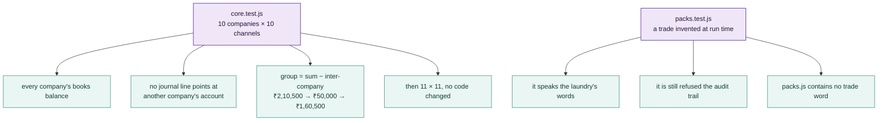
```mermaid
flowchart TB
  classDef t fill:#EFE7F8,stroke:#6B3CA6,color:#241436,stroke-width:1.3px;
  classDef r fill:#EAF6F3,stroke:#2E8B76,color:#123C34;
  A["core.test.js<br/>10 companies × 10 channels"]:::t --> A1["every company's books balance"]:::r
  A --> A2["no journal line points at<br/>another company's account"]:::r
  A --> A3["group = sum − inter-company<br/>₹2,10,500 → ₹50,000 → ₹1,60,500"]:::r
  A --> A4["then 11 × 11, no code changed"]:::r
  B["packs.test.js<br/>a trade invented at run time"]:::t --> B1["it speaks the laundry's words"]:::r
  B --> B2["it is still refused the audit trail"]:::r
  B --> B3["packs.js contains no trade word"]:::r
```


The test of whether this is one system or twenty-two programs sharing a login is a single
transaction followed end to end, and it is re-run at every module boundary. That walkthrough is
in `PLAN_OF_ACTION.md` Part V and is identical here.

The test of whether it is *industry-neutral* is different, and it is this: **take the same
transaction and run it in a trade nobody had in mind when the code was written.** That test used
to be run by hand, by writing an overlay. It is now run by the machine: `core/tests/packs.test.js`
invents a commercial laundry every time it executes, loads it from a JSON string, and requires the
system to answer in that trade’s words — while still refusing it the audit trail. The last
assertion in that file is that `core/packs.js` contains no trade word at all, so the engine cannot
quietly learn one trade and call it neutrality.

**Every check passes, with the shipped packs and a seventh added at run time.** That is the whole
industry-neutrality claim, reduced to something that either passes or does not.

---

### M14 · THE RULEBOOK

The specification a developer implements, and the promise a customer relies on. Counted in every
other section of this plan; printed here in full, because a count tells a reader how much they are
not being shown.

<!-- RULEBOOK -->
**285 rules.** Every one states what happens **and what the system will
never do instead**. The second half is the part worth reading — it is what you are relying on when
nobody is looking.

#### Module 01 · Platform — 25 rules

**`R01.1` Every business record names the company it belongs to**

- **When** any record is written — a sale, a movement, a voucher, an employee
- **Then** its company is stored on the row itself
- **Never** inferring the company from who happens to be logged in, which silently mis-files every record made by someone who works across two of them

**`R01.2` One company cannot read another company’s records**

- **When** a query runs for a user scoped to one company
- **Then** rows belonging to any other company are not returned at all
- **Never** filtering in the screen while the data is already loaded — a filter can be removed, a scope cannot

**`R01.3` The audit trail has no off switch**

- **When** anything touching money, stock, price, tax, pay or master data changes
- **Then** the change and its before-image are written in the same transaction as the change itself
- **Never** allowing a setting, a role or a migration to disable it — either both land or neither does

**`R01.4` An update records what it was, not only what it became**

- **When** a row is changed
- **Then** the current row is read first so the before-image is what was really there
- **Never** trusting the caller’s idea of the old value, which makes the trail a record of intentions rather than of facts

**`R01.5` A table nobody thought to audit is refused**

- **When** code writes to a table that is not on the audited list
- **Then** the write is refused and the table is named
- **Never** letting it through quietly, which is how a money column ends up outside the trail without anyone deciding that

**`R01.6` Deletion is a reversal, never a removal**

- **When** a user deletes anything
- **Then** the record is voided, marked, and still readable with the reason
- **Never** removing the row — eight years of trail cannot survive a DELETE

**`R01.7` A module that is not in the canonical list cannot join the bus**

- **When** code subscribes to a business event
- **Then** the module number is checked against modules.js and refused if unknown
- **Never** letting an unregistered listener attach, which is how a cascade gains a step nobody can find later

**`R01.8` A cascade is all of it or none of it**

- **When** one business event fans out to stock, ledger, customer and documents
- **Then** every step commits together, or the whole thing is rolled back
- **Never** leaving stock moved and the ledger unposted, which is the exact state no report can ever explain

**`R01.9` A handler that throws takes the transaction with it**

- **When** any subscriber to an event fails
- **Then** the emitting transaction fails too
- **Never** swallowing the error so the originating action appears to have succeeded

**`R01.10` No capability depends on a single outside service**

- **When** any capability is used — books, courier, payments, AI, storage, GST
- **Then** an ordered list of interchangeable providers is tried, ending on one that needs nothing connected
- **Never** having one provider whose outage stops the work, however good that provider is

**`R01.11` A failing provider is taken out of the list, not hammered**

- **When** a provider fails repeatedly
- **Then** it is tripped open, skipped entirely, and retried once after a cooldown
- **Never** retrying into a dead service on every call while a working alternative sits further down the list

**`R01.12` A spend ceiling refuses, it does not warn**

- **When** a paid call would take spending past the ceiling set for it
- **Then** that provider is refused and the work completes on a free one
- **Never** letting it through with a warning nobody reads, and never refusing only the first provider while the same spend reroutes to the next

**`R01.13` The system never asks for a marketplace, bank or account password**

- **When** any integration is connected, by any module, including a chatbot or an agent
- **Then** a scoped, revocable key is requested instead, cancellable from the provider’s side without changing the login
- **Never** accepting, storing, echoing or transmitting an account password — there is no screen, no import and no support flow that takes one

**`R01.14` Card and bank credentials never reach application code**

- **When** a payment needs a card or bank detail
- **Then** the provider’s own secured field takes it directly
- **Never** passing it through this system, even in transit, even unlogged — what is never received cannot be leaked

**`R01.15` Consent and retention are two different clocks**

- **When** a person’s data is held
- **Then** why it may be used and how long it is kept are tracked separately, and an erasure request is resolved against both
- **Never** treating a legal retention period as consent to keep using the data for anything else

**`R01.16` A scoped key is revocable without touching the login**

- **When** an outside service is connected
- **Then** a key limited to what that capability needs is stored, and the connection records which capability it serves
- **Never** storing a credential that can do more than the capability requires, because the day it leaks is the day that difference matters

**`R01.17` A webhook is verified, idempotent and never silently dropped**

- **When** a payment, courier, storefront or messaging provider calls in
- **Then** the signature is checked, the external id makes a repeat delivery a no-op, and a failure is logged with its payload for retry
- **Never** trusting an unsigned call, and never processing the same external id twice — a duplicated payout or a duplicated order is indistinguishable from a real one afterwards

**`R01.18` A trade is added as data, never as a version of the software**

- **When** a business in a trade the system has never seen signs up
- **Then** its vocabulary, stages, extra fields, documents, rule switches and starting reference data arrive as one configuration file, and every screen reads back in that trade’s words
- **Never** a branch, a fork or a bespoke build per industry — that is a consultancy with software attached, and it is the thing that stops a product from being one

**`R01.19` A pack is data and can never be code**

- **When** a pack is loaded from any source
- **Then** every value in it is inspected, at any depth, and a function anywhere inside it refuses the whole pack
- **Never** letting configuration carry behaviour — the moment a pack can run code, adding a trade is a code change again and the guarantee in R01.18 is worthless

**`R01.20` A pack may rename a concept, never invent one**

- **When** a pack declares its vocabulary
- **Then** each entry is matched against the fixed list of concepts the engine has, and an unknown one refuses the pack
- **Never** accepting an unrecognised word as a new concept, which turns "vocabulary" into a place to put anything and leaves the screens with a name for something that does not exist

**`R01.21` A pack extends tables that exist, and nothing else**

- **When** a pack adds fields
- **Then** the table is checked against the real schema and the field type against the types the engine can store
- **Never** creating a table on a customer’s behalf from a configuration file, which puts the shape of the database outside the reach of the schema test that guards it

**`R01.22` Money in a pack is money everywhere else**

- **When** a pack adds a field whose name reads as an amount, a price, a cost, a total, a fee or a rate
- **Then** it must be declared in paise, and a plain number refuses the pack
- **Never** letting a trade introduce a floating-point rupee through the side door after the whole schema was built to keep them out

**`R01.23` No pack can switch off a guarantee**

- **When** a pack sets a rule off
- **Then** the rule id is checked against the rulebook, and against the list of rules no pack may touch — company scoping, the audit trail, the posting rules, group elimination and roster privacy
- **Never** a trade opting out of the things that make the books trustworthy; it may call an invoice whatever it likes and may not decide its trail is optional

**`R01.24` A rule a pack never mentions is on**

- **When** a rule is looked up for a trade
- **Then** the rulebook is the default and the pack is read as an exception list — silence means the rule applies
- **Never** treating the pack as a permission list, which would mean every rule added after a pack was written silently applies to nobody who is using it

**`R01.25` An invalid pack is refused whole, never half-loaded**

- **When** a pack fails any check
- **Then** every problem in it is reported at once and none of it is applied
- **Never** partially loading a trade, which leaves a system whose vocabulary and rules disagree with each other and no way to tell which half is live

#### Module 02 · Design & Sampling — 7 rules

**`R02.1` A style becomes a SKU only after sign-off**

- **When** someone tries to create a catalogue record for a design
- **Then** the design must already have passed sample sign-off
- **Never** letting a SKU exist for something with no agreed specification, which puts an unmakeable item on sale

**`R02.2` Every version of a specification is kept**

- **When** a sample round changes a measurement, a fabric or a trim
- **Then** a new version is written and the old one stays readable
- **Never** editing the specification in place — a karigar paid against last month’s spec must still be able to show what it said

**`R02.3` A costed trial carries the date its rates came from**

- **When** a sample is costed
- **Then** the rate and the date it was in force are both stored on the trial
- **Never** recosting an old trial with today’s rates and presenting the result as what it cost then

**`R02.4` A design with no ownership record is flagged, not blocked**

- **When** a design reaches sign-off with no trademark or copyright status on file
- **Then** it proceeds and is listed as unprotected
- **Never** silently treating it as protected, which is only discovered when a near-identical listing appears and there is nothing to act on

**`R02.5` The first-shown date is recorded when it happens**

- **When** a design is first shown publicly — an exhibition, a listing, a lookbook
- **Then** that date is stamped and never editable afterwards
- **Never** backdating it later, which is precisely the field a dispute turns on

**`R02.6` A rejected sample keeps its reason**

- **When** a sample round is rejected
- **Then** the reason is recorded against the version
- **Never** closing it with a status alone, which loses the only information that stops the same mistake in the next round

**`R02.7` A specification cannot be deleted while stock exists against it**

- **When** someone removes a design that has ever been made
- **Then** it is archived and stays linked to every piece produced from it
- **Never** orphaning finished stock from the specification it was made to

#### Module 03 · Inventory & Catalog — 14 rules

**`R03.1` Stock is one number per SKU, per location, per stage**

- **When** any module asks how much there is
- **Then** it reads the one quantity, with the channel recorded on the movement rather than on the stock
- **Never** keeping a separate stock figure per channel — the last piece sold on one marketplace has to vanish from the other ten at the same instant, which per-channel inventory cannot do

**`R03.2` Negative stock is a fault, not a state**

- **When** an issue would take a quantity below zero
- **Then** the issue is refused
- **Never** recording a negative balance and leaving someone to explain it at month-end

**`R03.3` Selling a kit decrements every component**

- **When** a kit or combo SKU is sold
- **Then** each component SKU is decremented at order time
- **Never** decrementing only the kit, which leaves the components sellable twice

**`R03.4` A kit with no components is refused**

- **When** an item is marked a kit but lists nothing
- **Then** the record is refused and named
- **Never** accepting it and silently decrementing nothing on every sale

**`R03.5` Stock value ties to the item cost, always**

- **When** stock is valued
- **Then** the value is computed from the quantity and the item cost
- **Never** storing a valuation that can drift from the quantity it is supposed to describe

**`R03.6` Every movement has a source, a destination, or both**

- **When** a stock movement is recorded
- **Then** at least one end is named
- **Never** accepting a movement from nowhere to nowhere, which is how quantity appears without a cause

**`R03.7` A quantity is a whole number above zero**

- **When** a movement is written
- **Then** a non-integer or non-positive quantity is refused
- **Never** accepting a negative movement as a shorthand for a reversal — a reversal is its own movement with its own reason

**`R03.8` Goods in someone else’s warehouse are still yours**

- **When** stock sits in a channel’s own warehouse under consignment or sale-or-return
- **Then** that warehouse is a location like any other and the stock is counted, valued and aged there
- **Never** letting it drop off the books until it sells, which understates both stock and exposure

**`R03.9` Fabric in metres and pieces in numbers share one item master**

- **When** an item is defined
- **Then** its unit of measure is a property of the item
- **Never** building a second item master for a second unit, which splits the one stock number this module exists to protect

**`R03.10` A listing needs the packed size and weight before it can go out**

- **When** a product is pushed to a channel
- **Then** packed dimensions and weight must be present
- **Never** listing without them, because that is the field every courier weight dispute is settled on

**`R03.11` The channel’s own code for a product is mapped, not assumed**

- **When** a product exists on a marketplace
- **Then** that channel’s identifier is stored against ours
- **Never** matching on name or on a code we invented, which mis-posts every settlement line for that product

**`R03.12` A duplicate master record is merged, never left as two**

- **When** the same customer, vendor or design is detected twice
- **Then** they are merged and both old identifiers keep resolving
- **Never** leaving two live records, which splits every total that record appears in

**`R03.13` A price is per channel and dated**

- **When** a channel price is set
- **Then** it is stored against that channel with the date it takes effect
- **Never** holding one price and reading it as if it applied everywhere and always

**`R03.14` Dead stock is named as dead stock**

- **When** an item has not moved for the period set for it
- **Then** it appears on the dead-stock register with its age and carrying value
- **Never** leaving it inside the general stock figure where it reads as healthy inventory

#### Module 04 · CRM — 9 rules

**`R04.1` One customer, one record, whichever channel they arrived by**

- **When** the same person orders on a marketplace and later at the counter
- **Then** both land on one record with the channel noted on each order
- **Never** creating a second customer per channel, which makes lifetime value meaningless

**`R04.2` A document is filed against the record it belongs to**

- **When** any agreement, receipt, certificate or scan is stored
- **Then** it is attached to the order, party, case or employee it concerns
- **Never** filing it in a folder that has to be remembered rather than found

**`R04.3` A signed copy files itself back**

- **When** a document sent for signature is signed
- **Then** the signed version returns to the same record automatically
- **Never** leaving the signed copy in an inbox while the record still shows it as pending

**`R04.4` A ticket carries the order it is about**

- **When** a question arrives by chat, email or phone
- **Then** it is tied to the order or account it concerns, with the history already on screen
- **Never** opening a ticket with no link, which makes the first reply a request to explain again

**`R04.5` Feedback attaches to the item, not only the buyer**

- **When** a rating or complaint arrives after delivery
- **Then** it is attached to the design or item it is actually about
- **Never** holding it only against the customer, which hides a complaint-prone item as a scatter of unrelated gripes

**`R04.6` A customer’s consent travels with their data**

- **When** a customer record is used for marketing or profiling
- **Then** the consent captured at the point it was given is checked first
- **Never** assuming that having the data implies permission to use it for anything

**`R04.7` A merged customer keeps both histories**

- **When** two customer records are merged
- **Then** every order, ticket and document from both survives on the surviving record
- **Never** discarding the shorter history to make the merge simple

**`R04.8` Credit state is read at the moment of the order**

- **When** a B2B order is placed
- **Then** the customer’s outstanding and limit are evaluated then
- **Never** using a figure cached from the last sync, which is how a party goes past its limit between refreshes

**`R04.9` A closed ticket keeps what resolved it**

- **When** a ticket is closed
- **Then** the resolution is recorded on it
- **Never** closing with a status alone, which loses the answer the next identical question needs

#### Module 05 · Sales — 18 rules

**`R05.1` Every sale carries its company and its channel**

- **When** an order is created on any channel
- **Then** both are written on the order
- **Never** leaving either to be inferred later from the document number or the warehouse

**`R05.2` A sale posts stock and ledger together**

- **When** a sale is confirmed
- **Then** stock is deducted, the invoice is raised, and the ledger is posted in one transaction
- **Never** invoicing without moving stock, or moving stock without posting

**`R05.3` If the ledger refuses, the stock never moved**

- **When** the posting half of a sale fails
- **Then** the stock movement is rolled back with it
- **Never** leaving the goods gone and the books untouched

**`R05.4` A quote becomes an order without being retyped**

- **When** a quotation is accepted
- **Then** the order is created from it, carrying the same lines and prices
- **Never** re-entering the lines, which is where the price on the quote and the price on the invoice start to differ

**`R05.5` A price below the floor needs an approval, not a note**

- **When** a line is priced under the floor set for it
- **Then** the order waits in the approvals queue with the rule that stopped it named
- **Never** letting it through with a comment box, which is a discount policy nobody can enforce

**`R05.6` An export invoice knows it is an export**

- **When** an order ships outside the country
- **Then** the LUT or IGST treatment, currency and shipping terms are set on the order itself
- **Never** treating it as a domestic invoice and correcting the tax afterwards

**`R05.7` A counter sale is the same order record**

- **When** someone buys at the counter
- **Then** the same order table records it, with the counter as the channel
- **Never** running the till on a separate book that has to be merged later

**`R05.8` A credit sale reserves the credit at the moment it is taken**

- **When** a B2B order is accepted on credit
- **Then** the exposure is committed against the party immediately
- **Never** counting it only when the invoice is raised, which lets several orders each fit inside the same limit

**`R05.9` A dispatch cannot exceed what was ordered**

- **When** a shipment is prepared
- **Then** quantities are checked against the order line
- **Never** shipping over, which becomes an invoice the customer never agreed to

**`R05.10` A cancelled order releases what it held**

- **When** an order is cancelled
- **Then** reserved stock and committed credit are both released
- **Never** leaving stock reserved against a dead order, which shows the business as out of goods it actually has

**`R05.11` An AWB belongs to the shipment, not the courier integration**

- **When** a tracking number is recorded, typed in or fetched
- **Then** it is stored on the shipment
- **Never** making the number reachable only through whichever courier API produced it, which loses it the day that courier is dropped

**`R05.12` A subscription renewal is a new order**

- **When** a subscription renews
- **Then** a fresh order is created with its own stock, invoice and posting
- **Never** extending the original order, which makes the revenue of two periods indistinguishable

**`R05.13` A sale to a sister company is marked as one**

- **When** the counterparty is another company in the group
- **Then** the counterparty company is recorded on the entry
- **Never** posting it as an ordinary outside sale, which inflates the group turnover by trade it never did

**`R05.14` A quote or proforma number carries its type and financial year**

- **When** a quotation or proforma is raised
- **Then** it is numbered Q-{FY}-#### or PI-{FY}-####, sequential within that company and year
- **Never** sharing one sequence between quotations and proformas, which makes a proforma indistinguishable from a quote in the register

**`R05.15` A quote line with no description, no quantity or a negative rate is not a line**

- **When** a quotation is totalled
- **Then** only lines with a description, a quantity above zero and a rate of zero or more are counted
- **Never** letting a half-filled row contribute a number to the total

**`R05.16` An export line carries no GST**

- **When** a quotation or invoice is marked export under LUT
- **Then** the GST percentage is zero and the document says why
- **Never** applying the domestic rate and correcting it after the buyer queries the total

**`R05.17` A made-to-measure order has two money legs, and both are visible**

- **When** a customisation order is accepted
- **Then** the advance and the balance are recorded as separate amounts with their own dates, and the balance stays owed until dispatch
- **Never** showing one payment at the end, which hides money already taken and work already owed

**`R05.18` A customisation quote keeps every round of the negotiation**

- **When** a price is revised during a bespoke enquiry
- **Then** each quoted figure is kept in order with what changed
- **Never** overwriting the earlier figure, which is the one the customer remembers agreeing to

#### Module 06 · Planning & Requirements (MRP) — 8 rules

**`R06.1` A forecast is labelled a forecast wherever it appears**

- **When** a projected figure is shown beside actuals
- **Then** it is visually and structurally distinct
- **Never** letting a forecast total sit in the same column as a real one, which is how a plan becomes a reported result

**`R06.2` A requirement run reads live stock, not a snapshot**

- **When** the MRP run explodes requirements
- **Then** it reads the current quantity at the moment it runs
- **Never** planning against a nightly copy, which orders material the business already has

**`R06.3` A requirement names what caused it**

- **When** the run produces a shortfall
- **Then** the order, forecast or reorder level that generated it is recorded on the line
- **Never** producing a bare quantity nobody can trace back to a demand

**`R06.4` Stock already on order counts against the shortfall**

- **When** the run computes what to buy
- **Then** open purchase orders are netted off first
- **Never** ignoring them and ordering the same material twice

**`R06.5` A budget ceiling refuses, it does not warn**

- **When** a proposed purchase would exceed the open-to-buy ceiling
- **Then** it is held for approval with the ceiling named
- **Never** raising it with a warning, which makes the ceiling advisory and therefore not a ceiling

**`R06.6` A lead time is per vendor and per item**

- **When** a run works out when to order
- **Then** it uses the lead time recorded for that vendor and that item
- **Never** applying one global lead time, which under-orders the slow lines and over-orders the fast ones

**`R06.7` A run is kept, not overwritten**

- **When** the MRP run executes again
- **Then** the previous run stays readable with its inputs
- **Never** replacing it, which makes it impossible to see why last week’s decision was taken

**`R06.8` A seasonal signal cannot silently become a permanent one**

- **When** a festival or season inflates demand
- **Then** the period it applies to is stored with the signal
- **Never** folding a spike into the baseline, which keeps ordering for a festival all year

#### Module 07 · Purchase — 12 rules

**`R07.1` Nothing is paid without a three-way match**

- **When** a vendor invoice is approved
- **Then** the purchase order, the goods received note and the invoice must agree
- **Never** paying on the invoice alone, which pays for goods that never arrived

**`R07.2` A short or damaged receipt is recorded as received short**

- **When** the GRN quantity is below the PO quantity
- **Then** the difference is recorded with its reason and the payable follows the received quantity
- **Never** receiving the full quantity to make the match pass

**`R07.3` Input tax credit is claimed against a real document**

- **When** ITC is taken on a purchase
- **Then** the vendor invoice and its tax detail are on file
- **Never** claiming credit from a payment record alone, which is the claim that fails reconciliation

**`R07.4` Landed cost reaches the item, not just the P&L**

- **When** freight, duty or insurance is attached to a purchase
- **Then** it is apportioned into the cost of the items received
- **Never** expensing it separately, which understates the cost of every piece made from that material

**`R07.5` A vendor price is dated**

- **When** a rate is agreed with a supplier
- **Then** it is stored with the date it takes effect
- **Never** overwriting the old rate, which makes last month’s purchase look mispriced

**`R07.6` A purchase order over its approval level waits**

- **When** a PO exceeds the value a role may approve
- **Then** it goes to the approvals queue naming the rule and the level
- **Never** splitting it into smaller orders to fit under the limit — the split is detected and the parts are assessed together

**`R07.7` A vendor with no active record cannot be paid**

- **When** a payment is raised
- **Then** the vendor must exist, be active, and have its bank detail verified
- **Never** paying to detail typed onto the payment itself, which is the single most common route for payment fraud

**`R07.8` A change to vendor bank detail is treated as high risk**

- **When** a vendor’s bank account is changed
- **Then** the change is approved by a second person and the old detail is kept
- **Never** accepting a change from an email instruction alone

**`R07.9` A job-work despatch stays on the books**

- **When** material is sent to a contractor
- **Then** it moves to a job-work location and remains this company’s stock
- **Never** writing it out on despatch, which loses material the business still owns

**`R07.10` An insurance policy is linked to what it covers**

- **When** a policy is recorded
- **Then** the stock, premises or shipment it covers is named on it
- **Never** holding policies as documents with no link, which is discovered only at the moment of a claim

**`R07.11` The three-way match is arithmetic, not a judgement**

- **When** a vendor invoice is checked
- **Then** the payable equals the received quantity × the purchase-order rate, and the purchase order, the goods receipt and the invoice must all agree on quantity and value
- **Never** passing an invoice whose value exceeds received quantity × agreed rate, and never letting an override happen without recording who made it and why

**`R07.12` A material is sourced down a ranked list, not from whoever answers**

- **When** a material has to be bought
- **Then** the vendors ranked for that material are approached in their priority order
- **Never** defaulting to the last vendor used, which is how a price rise becomes permanent without anyone deciding

#### Module 08 · Manufacturing — 20 rules

**`R08.1` Sets are pooled across every karigar before the minimum is taken**

- **When** completed sets are counted for a design
- **Then** every karigar’s pieces for that design are pooled first, and the set count is the minimum across the populated member columns of the pool
- **Never** counting sets per karigar row and adding them up, which loses every set completed by two people between them

**`R08.2` A surplus piece is paid for, and is not a set**

- **When** a karigar makes more of one garment than the set needs
- **Then** the extra is named individually and paid at its own piece rate
- **Never** adding it to the set count, and never leaving it unpaid because it did not complete a set — the person made it either way

**`R08.3` A design counts on the garments it actually has**

- **When** a design is made of fewer garment types than the usual set
- **Then** it is counted on the members it does have
- **Never** returning zero because an optional member is absent, which silently unpays a whole design

**`R08.4` A missing rate posts zero and is flagged, never guessed**

- **When** a design has no entry in the stitching rate master
- **Then** it costs zero and the design is named in the summary
- **Never** inferring a rate from a similar design — a guessed rate is a wrong payment to a real person

**`R08.5` A two-row heading is read as two rows**

- **When** the production grid uses a merged heading over garment columns
- **Then** both header rows are read so repeated garment names stay distinct columns
- **Never** reading only the first row, which collapses three Dupatta columns into one and undercounts the work

**`R08.6` A karigar written as a pair stays one unit**

- **When** two names share one row as a working pair
- **Then** they are treated as a single paying unit
- **Never** splitting them into two karigars, which halves each person’s recorded output and breaks the payout

**`R08.7` Several years of grids pool into one set of figures**

- **When** more than one production workbook is supplied
- **Then** their grids pool into a single costing
- **Never** reporting each file separately, which double-counts nothing but hides the sets completed across a year boundary

**`R08.8` Cost per piece is independent of set completion**

- **When** the cost of a design is worked out
- **Then** each raw piece is costed at its own rate
- **Never** costing by completed sets, which values an unfinished set at nothing while the labour has already been spent

**`R08.9` A production report moves stock and pay together**

- **When** a karigar production report is accepted
- **Then** finished stock comes in, the payout is raised in HR, wages post to the ledger, and the design cost updates — in one transaction
- **Never** taking the stock in and settling the pay in a separate pass, which is how the two disagree

**`R08.10` Material issued to production leaves raw stock at the moment it is issued**

- **When** a production order consumes material
- **Then** raw stock is reduced and work in progress increases
- **Never** consuming at completion, which shows material as available while it is already cut

**`R08.11` A bill of materials is versioned with the design**

- **When** a production order is created
- **Then** it captures the BOM version in force at that moment
- **Never** reading the current BOM when costing an old order, which recosts history

**`R08.12` Wastage is recorded, not absorbed**

- **When** consumption exceeds the BOM
- **Then** the excess is recorded as wastage against the order with its reason
- **Never** quietly increasing the BOM to match what was used, which destroys the only signal that something is going wrong

**`R08.13` A stage cannot be skipped without being recorded as skipped**

- **When** work moves past a defined stage without that stage being marked
- **Then** the skip is recorded on the order
- **Never** letting the stage silently complete, which makes every stage-time figure fiction

**`R08.14` An advance to a karigar is a balance, not a deduction from nowhere**

- **When** an advance is paid
- **Then** it is held against that karigar and recovered from later payouts, with the running balance visible
- **Never** deducting an amount at payout time that cannot be traced to a specific advance

**`R08.15` A rework carries the cost of the rework**

- **When** a piece is returned to a stage to be redone
- **Then** the additional labour is costed to the design that caused it
- **Never** costing it as new production, which makes a failing design look as profitable as a good one

**`R08.16` Material consumed is the average per piece times the pieces made**

- **When** consumption is costed against a production run
- **Then** consumption equals the average consumption per piece × pieces produced, and the difference against the bill of materials is recorded as wastage
- **Never** back-fitting the average to whatever was issued, which makes wastage mathematically impossible to see

**`R08.17` A set type comes from the rate master, and an inferred one says so**

- **When** a design is classified into a set type
- **Then** the rate master’s Set column decides it; when the design is absent, the type is inferred from which garment columns actually carry pieces and the design is flagged as inferred
- **Never** presenting an inferred classification as though it came from the master

**`R08.18` An alteration caused by the karigar’s own mistake is unpaid**

- **When** a piece is reworked because of an error by the person who made it
- **Then** the alteration hours are recorded and paid at zero
- **Never** paying for the rework at the standard alteration rate, and never leaving the hours unrecorded — the time still happened and the design still bore the cost

**`R08.19` Alteration time is paid at the alteration rate, not the piece rate**

- **When** admin-assigned alteration hours are settled
- **Then** they are paid at the hourly alteration rate in force and added to that karigar’s payout
- **Never** folding alteration hours into the piece count, which corrupts both the production figure and the earnings figure at once

**`R08.20` A contract worker paid by the hour has no attendance row**

- **When** a contract role is settled
- **Then** payment is hours worked × the agreed hourly rate, recorded against the person without an attendance record
- **Never** forcing a contract worker through the salaried attendance model, which produces a monthly figure nobody agreed to

#### Module 09 · Quality & Compliance — 7 rules

**`R09.1` A failed check blocks the next stage**

- **When** an inspection fails
- **Then** the batch cannot progress until it is passed, reworked or written off
- **Never** letting it move with the failure noted, which sends a known defect to a customer

**`R09.2` A check names the person who did it**

- **When** any inspection is recorded
- **Then** the inspector, the time and the sample size are stored
- **Never** accepting an anonymous pass, which cannot be investigated when the complaints arrive

**`R09.3` An expiring certificate warns before it expires**

- **When** a certificate approaches its expiry
- **Then** it is raised while there is still time to renew
- **Never** discovering the lapse at the moment a buyer asks for it

**`R09.4` A rejected batch cannot be sold as first quality**

- **When** a batch is rejected
- **Then** it is marked and can only be sold through a channel that accepts seconds
- **Never** letting it re-enter the ordinary sellable pool

**`R09.5` A defect is attached to the design and the stage**

- **When** a defect is recorded
- **Then** both the design and the stage that produced it are named
- **Never** recording it against the batch alone, which loses the pattern that would have prevented the next one

**`R09.6` A compliance document is evidence, not a checkbox**

- **When** a compliance requirement is marked met
- **Then** the document proving it is attached
- **Never** accepting a tick with nothing behind it, which is what fails an audit

**`R09.7` A sustainability figure comes from the same evidence**

- **When** an ESG figure is reported
- **Then** it is computed from the certificate and audit records already on file
- **Never** assembling it separately once a year from numbers nobody can trace

#### Module 10 · Warehouse — 8 rules

**`R10.1` A pick is confirmed against the bin it came from**

- **When** an item is picked
- **Then** the bin is recorded on the movement
- **Never** decrementing a warehouse total with no bin, which makes the next cycle count unexplainable

**`R10.2` A short pick stops the pack, it does not silently reduce the order**

- **When** the picker cannot find the full quantity
- **Then** the shortage is raised against the order and the pack waits
- **Never** packing what was found and invoicing for it as though that was the order

**`R10.3` A scan is the same event as a keyed entry**

- **When** a code is captured by scanner, phone camera or typing
- **Then** the same movement is written
- **Never** having a scanning path that writes different records from the manual path

**`R10.4` A cycle count adjustment names a reason**

- **When** a count differs from the system
- **Then** the adjustment records the reason and the person
- **Never** writing the system down to the counted figure with no explanation, which hides theft and damage equally well

**`R10.5` The packing video is linked to the shipment**

- **When** a parcel is recorded on video at packing
- **Then** the recording is attached to that shipment
- **Never** keeping the footage in a folder by date, which makes it unusable in the dispute it exists for

**`R10.6` A bin holds a location, not a guess**

- **When** stock is put away
- **Then** the destination bin is captured at put-away
- **Never** assigning a default bin so the step can be skipped

**`R10.7` A dispatch cut-off is per channel**

- **When** a channel has a handover deadline
- **Then** the queue is ordered and warned against that channel’s own cut-off
- **Never** applying one cut-off to all of them, which misses the earliest and idles for the latest

**`R10.8` A returned parcel is inspected before it is anything else**

- **When** a return arrives at the warehouse
- **Then** it is booked into a return-inspection location first
- **Never** restocking on arrival, which puts an unchecked item back on sale

#### Module 11 · Logistics — 11 rules

**`R11.1` The courier rate is checked against the packed weight**

- **When** a courier bills for a shipment
- **Then** the billed weight is compared with the packed weight recorded at packing
- **Never** accepting the courier’s weight without comparison, which is the most consistently overcharged line in the business

**`R11.2` A weight dispute is raised with the evidence attached**

- **When** billed and packed weight differ beyond tolerance
- **Then** a dispute is raised carrying the packing record
- **Never** absorbing the difference because each one is small

**`R11.3` An undelivered parcel is chased before it becomes a return**

- **When** a delivery attempt fails
- **Then** the NDR is actioned within the window the courier allows
- **Never** letting it lapse into a return, which costs the freight twice and the sale once

**`R11.4` COD collected is a receivable until it is remitted**

- **When** a COD parcel is delivered
- **Then** the amount is a receivable from the courier
- **Never** treating delivery as payment, which reports cash the business does not have

**`R11.5` A remittance is matched parcel by parcel**

- **When** a courier remits COD
- **Then** each parcel in the remittance is matched individually
- **Never** accepting the total, which is how short remittances go unnoticed for months

**`R11.6` A manifest is a record, not a printout**

- **When** parcels are handed over
- **Then** the handover is recorded against each shipment with the time and the person
- **Never** keeping only a signed sheet, which cannot be queried when a parcel is disputed

**`R11.7` An RTO parcel is stock again only after inspection**

- **When** a return to origin is received
- **Then** it goes through inspection before it can be sold
- **Never** restocking it automatically on scan

**`R11.8` Freight cost reaches the order it belongs to**

- **When** a shipment is costed
- **Then** the freight is attributed to the order
- **Never** holding freight only as a monthly expense, which makes per-order and per-channel profit fiction

**`R11.9` A courier can be changed without losing history**

- **When** a courier is switched off
- **Then** every past shipment, AWB and dispute stays readable
- **Never** making history depend on an integration that is still connected

**`R11.10` A zone and rate card are dated**

- **When** courier rates change
- **Then** the new card is stored with its effective date
- **Never** overwriting the card, which makes every past shipment look mischarged

**`R11.11` A partial-COD order has two collections and both are tracked**

- **When** an order is placed with an advance online and the balance on delivery
- **Then** the advance is a receipt now and the balance is a receivable from the courier until it is remitted
- **Never** treating the advance as the whole payment, which makes every such order look settled while most of the money is still outstanding

#### Module 12 · Accounting & GST — 24 rules

**`R12.1` Money is an integer count of paise**

- **When** any amount is held, added or compared
- **Then** it is an integer number of paise, becoming a decimal string only where a person reads it
- **Never** holding money in a floating-point number, where ₹0.10 + ₹0.20 is not ₹0.30 and a trial balance stops balancing

**`R12.2` An amount finer than a paisa is refused, not rounded**

- **When** a computation produces a fraction of a paisa
- **Then** it is refused and the caller must round deliberately
- **Never** rounding silently, which is how two sides of the same figure drift apart and nobody can say which is right

**`R12.3` A split sums back to the original, exactly**

- **When** an amount is divided — across lines, across companies, across periods
- **Then** the parts add back to the whole, with the round-off returned as its own figure
- **Never** losing or inventing a paisa in the split, and never hiding the remainder inside the largest part

**`R12.4` An unbalanced entry is refused, with the gap named**

- **When** a voucher is posted whose debits and credits differ
- **Then** it is refused and the difference is stated
- **Never** posting it to a suspense account to make it balance, which converts an error into a permanent record

**`R12.5` A line cannot be a debit and a credit at once**

- **When** a posting line carries both
- **Then** it is refused
- **Never** netting the two into whichever is larger

**`R12.6` The trial balance is computed, never stored**

- **When** the trial balance is asked for
- **Then** it is summed from the posting lines at that moment
- **Never** reading a maintained total, which is a number that can be wrong without anything looking wrong

**`R12.7` A locked period refuses a backdated entry**

- **When** a voucher is dated inside a closed period
- **Then** it is refused and the lock that stopped it is named
- **Never** posting it into the current period instead, which silently moves last year’s result into this one

**`R12.8` Unlocking a period is itself recorded**

- **When** a closed period is reopened
- **Then** who reopened it, when and why is written to the trail
- **Never** allowing a quiet reopen, which is the one action that could undo every other guarantee here

**`R12.9` A tax rate resolves on the date of the document**

- **When** tax is computed for any invoice
- **Then** the rate in force on that document’s date is used
- **Never** applying today’s rate to an old invoice, which makes correct history look like an error

**`R12.10` Two rates covering one date is ambiguous, not a coin toss**

- **When** two effective-dated rows overlap for the same date
- **Then** the resolution is refused and the overlap is named
- **Never** picking the newer one, which makes the answer depend on insertion order

**`R12.11` A voided entry is reversed, never erased**

- **When** a posted voucher is wrong
- **Then** a reversing entry is posted and both stay visible
- **Never** editing or deleting the original, which is the difference between a correction and a cover-up

**`R12.12` Every figure clicks down to the record that produced it**

- **When** any total appears on any screen
- **Then** it is a live query that can be opened down to its vouchers and their documents
- **Never** showing a figure that cannot be traced — an untraceable number is a defect, not a rounding difference

**`R12.13` An invoice number is sequential per company and per series**

- **When** an invoice is raised
- **Then** it takes the next number in that company’s series
- **Never** reusing, skipping or back-filling a number, which is the first thing a tax audit tests

**`R12.14` A GST return is built from vouchers, not from a summary**

- **When** GSTR-1 or 3B is prepared
- **Then** it is computed from the underlying invoices
- **Never** accepting a typed summary figure, which cannot be reconciled when the portal disagrees

**`R12.15` ITC is claimed only where the supplier has filed**

- **When** input credit is taken
- **Then** it is matched against the supplier’s filed data and the unmatched part is held
- **Never** claiming everything and reversing later, which turns a reconciliation into a liability

**`R12.16` A place of supply decides the tax, not the billing address**

- **When** GST is computed
- **Then** the place of supply determines CGST/SGST or IGST
- **Never** defaulting to the billing address, which mis-splits the tax on every drop-ship

**`R12.17` A credit note references the invoice it reverses**

- **When** a credit note is raised
- **Then** the original invoice is named on it
- **Never** issuing a free-standing credit note, which cannot be matched in either set of books

**`R12.18` Depreciation is posted, not just calculated**

- **When** a period closes
- **Then** depreciation is posted as an entry like any other
- **Never** showing it as a computed figure on a report while the ledger disagrees

**`R12.19` A company with no tax registration is still a company**

- **When** a group company has no registration of its own
- **Then** it keeps its own books and joins the group figures
- **Never** dragging it into a return it does not belong in, and never leaving it out of the group result

**`R12.20` Year-end close locks, and the lock is the record**

- **When** a financial year is closed
- **Then** the period is locked and the closing balances are carried forward as an entry
- **Never** leaving the year open indefinitely so late entries can drift in unnoticed

**`R12.21` Every voucher type posts through one engine**

- **When** a sale, purchase, credit note, debit note, payment, receipt, journal, contra or counter sale is recorded
- **Then** all nine post through the same ledger routine
- **Never** giving a voucher type its own posting logic — this is where home-built accounting breaks and the modules stop agreeing about the same figure

**`R12.22` Net GST is input against output, per period, per company**

- **When** the GST position for a period is computed
- **Then** it is output tax less eligible input credit for that company and that period
- **Never** netting across companies, which offsets one registration’s liability with another’s credit and is not a return anyone may file

**`R12.23` Money never becomes a float, in any layer**

- **When** an amount is stored, moved between the engine and the database, or exported
- **Then** it stays an integer count of paise end to end, converted for display only
- **Never** a real, double, float or an unlabelled decimal column anywhere a money value lives

**`R12.24` A money column says what unit it is in**

- **When** a column holds an amount
- **Then** its name ends in paise
- **Never** a column called total, amount or cost with no unit — the same name read as rupees by one developer and paise by the next is a factor of a hundred in the books

#### Module 13 · Treasury & Financial Planning — 8 rules

**`R13.1` A forecast never posts to the ledger**

- **When** a cash-flow projection is produced
- **Then** it is held as a projection, separate from posted entries
- **Never** writing an expected receipt into the books, which reports money that has not arrived

**`R13.2` A bank line is matched to a voucher, not to a total**

- **When** a bank statement is reconciled
- **Then** each line is matched to the entry that caused it
- **Never** reconciling on the closing balance alone, which hides two errors that happen to cancel

**`R13.3` An unmatched bank line stays visible until it is explained**

- **When** a statement line cannot be matched
- **Then** it stays on the unreconciled list with its age
- **Never** writing it off to a sundry account to clear the screen

**`R13.4` A PDC is a commitment before it is cash**

- **When** a post-dated cheque is received
- **Then** it is tracked as a commitment until it clears
- **Never** recognising it as cash on receipt

**`R13.5` Budget versus actual compares like with like**

- **When** a variance is shown
- **Then** both sides use the same period, company and account basis
- **Never** comparing a full-year budget against a part-year actual without saying so

**`R13.6` A cash forecast names its assumptions**

- **When** a projection is produced
- **Then** the collection and payment assumptions behind it are stored with it
- **Never** presenting a projection whose basis cannot be recovered a month later

**`R13.7` Inter-company funding is recorded on both sides**

- **When** one group company funds another
- **Then** both companies post it, naming each other as counterparty
- **Never** recording it in one set of books only, which leaves the group permanently out of balance

**`R13.8` A currency amount keeps the rate it was converted at**

- **When** a foreign-currency transaction is recorded
- **Then** the original amount, the currency and the rate used are all stored
- **Never** storing only the converted figure, which cannot be revalued or explained afterwards

#### Module 14 · Settlement — 13 rules

**`R14.1` A payout is matched line by line to orders**

- **When** a marketplace settlement file arrives
- **Then** every line is matched to the order it belongs to
- **Never** accepting the net credited amount, which is how a short payment becomes invisible

**`R14.2` Every deduction is identified before the payout is accepted**

- **When** commission, shipping, penalty, TCS or TDS is deducted
- **Then** each is posted to its own account
- **Never** posting the deductions as one lump, which makes an overcharge impossible to find

**`R14.3` A variance beyond tolerance raises a claim**

- **When** the settled amount differs from the expected amount
- **Then** a claim is raised carrying the order, the expectation and the difference
- **Never** absorbing it because it is small — the small ones are the recurring ones

**`R14.4` A claim has a deadline and the deadline is tracked**

- **When** a claim is raised
- **Then** the channel’s filing window is stored and warned on
- **Never** letting a valid claim expire unfiled

**`R14.5` An expected settlement exists from the moment of the sale**

- **When** an order is confirmed on a marketplace
- **Then** a settlement expectation is created then
- **Never** waiting for the payout to discover what should have arrived

**`R14.6` TCS and TDS are receivables, not costs**

- **When** a marketplace deducts tax at source
- **Then** it is posted as a receivable against the tax authority
- **Never** expensing it, which understates profit and loses the credit

**`R14.7` A settlement is reconciled to the bank, not just to the file**

- **When** a payout is recorded
- **Then** it is matched to the actual bank credit
- **Never** treating the settlement report as proof that the money arrived

**`R14.8` A re-sent settlement file does not double-post**

- **When** the same settlement file is imported twice
- **Then** already-matched lines are recognised and skipped
- **Never** posting them again, which doubles both revenue and deductions

**`R14.9` A fee schedule is dated and compared against**

- **When** a commission is deducted
- **Then** it is checked against the agreed rate in force on that date
- **Never** accepting whatever rate the file states, which is the single largest silent leak in marketplace trade

**`R14.10` A settled order is profitable or unprofitable at the SKU**

- **When** a payout is fully matched
- **Then** the true net per SKU is computed after every deduction
- **Never** judging profitability on the listed price, which ignores the third of it that never arrives

**`R14.11` A claim that is paid closes against the original variance**

- **When** a channel credits a claim
- **Then** it is matched back to the variance it settles
- **Never** posting the credit as unrelated income, which leaves the variance open forever

**`R14.12` A settlement figure never overwrites a sale figure**

- **When** the settlement disagrees with the order
- **Then** both are kept and the difference is the variance
- **Never** adjusting the original sale to match the payout, which erases the evidence of the shortfall

**`R14.13` The realisation on a marketplace sale is the price minus every deduction**

- **When** what a channel sale actually earned is computed
- **Then** it is the selling price less shipping, commission, fixed fee, GST on those fees, TCS and TDS — each taken from the settlement file
- **Never** judging a sale on its listed price, which ignores the part of it that never arrives, and never applying an assumed commission percentage when the file states the real one

#### Module 15 · E-commerce / OMS — 19 rules

**`R15.1` Companies and channels are read from the data, never from a list in the code**

- **When** orders or sheets from any number of companies and channels are processed
- **Then** the companies and channels present are discovered and each gets its own columns
- **Never** writing a fixed set of companies or channels into the software, which caps the business at whatever it happened to have on the day the code was written

**`R15.2` A tenth or eleventh channel needs no code change**

- **When** a new marketplace or company is added
- **Then** it is a row, and every figure, column and consolidation follows
- **Never** requiring a release to sell somewhere new

**`R15.3` A channel belongs to a company**

- **When** two companies both sell on the same marketplace
- **Then** each has its own channel record, and both may use the same short code
- **Never** sharing one channel across companies, which merges two companies’ sales into one figure

**`R15.4` A price is never invented for an item that has none**

- **When** an item has no price on file
- **Then** it is reported as having no price and named in the summary
- **Never** substituting an average or a similar item’s price, which quietly fabricates revenue

**`R15.5` Net is sale minus return, and inventory is net plus wrong return**

- **When** quantities are rolled up
- **Then** net sale is sale minus return, and the inventory figure adds back the wrong returns
- **Never** treating a wrong return as ordinary saleable stock, because it is not the item that was sent out

**`R15.6` A blank cell is blank, not a value**

- **When** a column contains only whitespace
- **Then** it is read as empty
- **Never** treating a lone space as a marked entry, which converts formatting into business fact

**`R15.7` An item that only ever came back is still reported**

- **When** an item has returns but no sales in the period
- **Then** it appears with its returns
- **Never** dropping it because it has no sale line, which hides the worst-performing items entirely

**`R15.8` A totals row is the sum of the rows above it**

- **When** a report shows a total
- **Then** it equals the rows it sits under
- **Never** computing the total by a different route from the detail, which is how a report disagrees with itself

**`R15.9` A marketplace order pull creates a real order**

- **When** orders are fetched from a channel
- **Then** a sales order is created, stock is reserved, and the pick list follows
- **Never** holding channel orders in a staging area that has to be re-entered to become real

**`R15.10` A cancelled channel order releases its reservation**

- **When** the channel cancels an order
- **Then** the reservation is released and the cancellation recorded
- **Never** leaving stock reserved against an order the channel has already dropped

**`R15.11` A wrong return is dead stock, not stock**

- **When** a return is inspected and found to be a different or damaged item
- **Then** it is written to dead stock with its cost recognised as a loss
- **Never** restocking it as first quality, which sells a customer the same problem twice

**`R15.12` A listing rejected by a channel says why**

- **When** a push to a channel fails
- **Then** the rejection and its reason are reported back against the listing
- **Never** reporting a push as successful when part of it failed, which leaves the business believing it is present where it is not

**`R15.13` A manual data check is a recorded step, not a habit**

- **When** figures are checked by hand before a cycle closes
- **Then** the check, the person and the outcome are recorded
- **Never** relying on someone remembering to look

**`R15.14` A channel-specific SKU code never becomes the master code**

- **When** a channel uses its own identifier
- **Then** it is stored as a mapping against our SKU
- **Never** adopting the channel’s code as the item code, which breaks the moment a second channel does the same

**`R15.15` A size recommendation is advice, never a silent substitution**

- **When** a fit suggestion is offered
- **Then** it is shown as a recommendation the customer chooses
- **Never** changing the size on an order on the customer’s behalf

**`R15.16` An order held past its cut-off is escalated, not queued**

- **When** an order approaches the channel’s dispatch deadline
- **Then** it is raised to the person who can act, naming the deadline
- **Never** letting it age quietly into a penalty

**`R15.17` Closing stock is opening plus in minus out**

- **When** a stock position is computed for a period
- **Then** closing = opening + receipts − issues, from the movements themselves
- **Never** carrying a maintained closing figure that can drift from the movements that produced it

**`R15.18` Courier return, customer return and wrong return cost three different things**

- **When** a return is processed
- **Then** a courier return costs repacking only, a customer return costs alteration plus iron plus packing at the rate set for that design, and a wrong return is written off at the full selling price
- **Never** applying one blended return cost to all three, which hides the expensive kind inside the cheap kind

**`R15.19` A wrong return is never added back to stock**

- **When** a return is found to be a different item from the one sent
- **Then** it becomes dead stock and the selling price is recognised as a loss
- **Never** restocking it, at any value, however sellable it looks

#### Module 16 · HR & Payroll — 22 rules

**`R16.1` A raise closes the old row, it does not overwrite it**

- **When** a salary or rate changes
- **Then** the row in force is closed on the day before, and a new row opens
- **Never** editing the existing figure, which rewrites what the person was actually paid last year

**`R16.2` History resolves to what was actually in force**

- **When** a past month is recomputed
- **Then** the rate in force in that month is used
- **Never** recomputing an old payslip at today’s rate

**`R16.3` A future-dated raise activates by itself**

- **When** a raise is entered with a future date
- **Then** it takes effect when that month arrives, with nobody remembering to apply it
- **Never** requiring a manual step, which is how an agreed raise is missed

**`R16.4` A month with nothing in force raises, and never returns zero**

- **When** no rate covers the month being computed
- **Then** the computation is refused and the gap is named
- **Never** returning zero, which pays a real person nothing and looks like a valid answer

**`R16.5` Backdating over an open row is refused**

- **When** a change is entered with a date inside a period already settled
- **Then** it is refused
- **Never** silently rewriting history that has already been paid and posted

**`R16.6` A person can leave and come back**

- **When** someone rejoins after a break
- **Then** the spell log holds both periods and the gap between them
- **Never** creating a second employee record, which splits their history and their service

**`R16.7` Month spans handle February and the year end**

- **When** a period is computed across month or year boundaries
- **Then** the real calendar is used
- **Never** assuming thirty-day months, which is wrong twelve times a year and badly wrong in February

**`R16.8` Staff and piece-rate workers sit in one register**

- **When** payroll is prepared
- **Then** monthly staff and piece-rate karigars are computed in the same run and paid from the same register
- **Never** running two payrolls that have to be added together by hand

**`R16.9` An advance is recovered against a named advance**

- **When** a deduction is made at payout
- **Then** it names the advance it is recovering and reduces that balance
- **Never** deducting an amount that cannot be traced to a specific advance

**`R16.10` Attendance drives pay, and both are visible together**

- **When** a payout is computed
- **Then** the attendance it was computed from is shown beside it
- **Never** presenting a pay figure whose basis the person being paid cannot see

**`R16.11` Identity documents are read, never stored in a file that leaves**

- **When** Aadhaar, PAN, bank or UPI detail is used for a computation
- **Then** it is used and not serialised into any exported or committed artifact
- **Never** writing personal identifiers into a report, a backup file or a repository

**`R16.12` A payout that fails to post does not mark as paid**

- **When** the bank transfer or the ledger posting fails
- **Then** the payout stays unpaid and the failure is raised
- **Never** marking it paid on submission, which loses a real person’s wages in the gap

**`R16.13` The daily rate is the monthly salary divided by twenty-seven**

- **When** a day of attendance is priced
- **Then** the daily rate is that month’s salary ÷ 27, using the salary in force in that month
- **Never** using calendar days, working days, or a rate carried over from a month with a different salary

**`R16.14` Attendance codes have fixed multipliers and a blank is absent**

- **When** earned pay is computed from attendance
- **Then** present, holiday, on-duty and paid leave count 1, a half day counts 0.5, absent and unpaid leave count 0, and an empty cell counts as absent
- **Never** treating a blank as present, or as unknown to be filled in later — a blank that pays is a blank that will be left blank

**`R16.15` Threshold hours do not move when salary moves**

- **When** a raise takes effect
- **Then** the monthly hour threshold for that role stays as it was
- **Never** scaling the threshold with the salary, which silently changes what the person is expected to work in exchange for a raise

**`R16.16` Productivity cost is that month’s salary over the threshold, times hours worked**

- **When** the cost of a person’s time is charged to work
- **Then** it is (salary in force that month ÷ threshold hours) × the hours actually active
- **Never** using a single annual figure, which misprices every month on either side of a raise

**`R16.17` A holiday is paid and produces no hours**

- **When** a holiday is marked
- **Then** it pays a full day and contributes zero productive hours
- **Never** counting holiday hours as production, which flatters every efficiency figure that reads them

**`R16.18` A half day is half the hours, from the same start**

- **When** a half day is marked
- **Then** it starts at the normal in-time and its hours are half the full shift for that person’s pattern
- **Never** assuming a fixed midday finish for everyone, when the male and female shift lengths differ

**`R16.19` The festival flag drives leave and nothing else**

- **When** a religion is recorded against a person
- **Then** it is used only to match a festival-leave request
- **Never** using it as a filter, a grouping or a report dimension anywhere else in the system

**`R16.20` A geofence failure flags, it does not refuse**

- **When** attendance is marked outside the radius set for the unit, or outside the grace window
- **Then** it is recorded with the flag and raised to the manager
- **Never** refusing the mark — a system that locks someone out of being paid for standing at the wrong gate has failed at its actual job

**`R16.22` A shared document carries the pay rules, never the pay roster**

- **When** a plan, a specification or any document that leaves this building is generated
- **Then** it carries the formulas, thresholds and effective-dating that decide pay, and refers to the roster rather than reproducing it
- **Never** printing an individual’s name beside their salary, or their religion at all, into a document that is committed to a repository and travels with every copy — the software needs those fields, a reader of the plan does not

**`R16.21` An override is allowed and is always recorded**

- **When** an administrator corrects attendance, a geofence flag or a payroll figure
- **Then** the change, the person and the reason go to the audit trail
- **Never** an override that leaves no trace, which is indistinguishable from the system having been wrong

#### Module 17 · Marketing — 10 rules

**`R17.1` A campaign is measured on revenue, not on opens**

- **When** campaign performance is reported
- **Then** it is attributed to actual orders
- **Never** reporting opens and clicks as the result, which measures the message rather than the business

**`R17.2` A repricing rule shows what it did**

- **When** a rule changes a price
- **Then** the change, the rule that made it and the effect on orders are recorded together
- **Never** changing prices with no record, which makes a bad rule impossible to identify or reverse

**`R17.3` A price floor is a floor**

- **When** a repricing rule would go below the floor set for a SKU
- **Then** it stops at the floor
- **Never** undercutting to match a competitor below cost

**`R17.4` A markdown starts before the stock is dead, not after**

- **When** stock reaches the age set for it
- **Then** the markdown schedule begins
- **Never** waiting until it is unsellable, which converts a lower-margin sale into a write-off

**`R17.5` A campaign cannot message someone who has not consented**

- **When** a marketing send is prepared
- **Then** the recipient list is filtered by consent at send time
- **Never** sending to a list captured before the consent was checked

**`R17.6` A published page reads live catalogue data**

- **When** a page shows a price or a stock state
- **Then** it reads the same record the order screen reads
- **Never** pasting a figure into the page, which goes stale the first time the price changes

**`R17.7` An exhibition is a channel**

- **When** leads and sales come from a trade show
- **Then** they land in CRM and the order book against that channel
- **Never** collecting them on paper to be entered later, which is where they are lost

**`R17.8` A marketing automation cannot move money**

- **When** a campaign rule fires
- **Then** it may message, tag, schedule or reprice within its limits
- **Never** issuing a refund, a credit note or a payment — that is not what this engine is allowed to do

**`R17.9` A scheduled post that fails is reported as failed**

- **When** a scheduled publication does not go out
- **Then** it is raised with the reason
- **Never** showing it as published in the calendar while nothing was posted

**`R17.10` Return on ad spend is measured against real orders**

- **When** campaign performance is computed
- **Then** it is revenue from attributed orders ÷ spend actually incurred
- **Never** using a platform’s own reported conversions as the revenue figure, which counts orders this system has no record of

#### Module 18 · AI Content Engine — 11 rules

**`R18.1` Content is written from the catalogue, not about the category**

- **When** a listing or description is generated
- **Then** it is generated from that product’s own attributes
- **Never** writing plausible copy about the kind of thing it is, which is how a listing describes features the product does not have

**`R18.2` Structured fields get keywords; anything a human reads gets feeling**

- **When** text is produced for a back-end field versus a caption
- **Then** each is written for its own reader
- **Never** writing both the same way, which is the clearest signal of machine-written content

**`R18.3` Product nouns are banned from creative surfaces**

- **When** a caption or a hook is written
- **Then** the product noun is excluded
- **Never** letting search vocabulary bleed into copy meant to be felt

**`R18.4` The engine criticises its own draft before anyone sees it**

- **When** a draft is produced
- **Then** it is put through the self-critique pass and the second draft is what is shown
- **Never** showing the first attempt, which is rarely the best one

**`R18.5` A render is seeked, never recorded**

- **When** a video is produced from a page
- **Then** the clock is driven by hand and each frame is captured at its exact instant
- **Never** playing the animation and recording the screen, which bakes whatever else the machine was doing into the customer’s reel

**`R18.6` The same scene renders to the same file**

- **When** a render is repeated
- **Then** the output is identical to the byte
- **Never** producing a different file each time, which makes the output impossible to check or approve

**`R18.7` A generated asset is labelled as generated**

- **When** an image or video is produced by a model
- **Then** it carries that fact in the asset record
- **Never** letting a generated image become indistinguishable from a photograph of the actual product

**`R18.8` Generation stays badged a mockup until a real provider is wired**

- **When** a capability is demonstrated without a live provider behind it
- **Then** it is labelled a mockup wherever it appears
- **Never** showing a simulated render as a finished one

**`R18.9` Image generation states that it needs a graphics card**

- **When** the image generation slot is opened with no provider attached
- **Then** it says so plainly and produces nothing
- **Never** presenting a finished-looking screen that cannot generate anything

**`R18.10` A cloned voice needs the consent of the person it came from**

- **When** a voice is cloned for narration
- **Then** that person’s recorded consent is on file against them
- **Never** cloning from a recording merely because it was available

**`R18.11` A publish reports what actually went live**

- **When** content is pushed to several destinations
- **Then** each result comes back individually, with reasons for rejections
- **Never** reporting one overall success, which leaves the business absent where it believes it is present

#### Module 19 · SEO, AEO & AIO — 6 rules

**`R19.1` Structured data describes what is actually on the page**

- **When** schema markup is generated
- **Then** it is generated from the same record the page renders
- **Never** marking up a price or availability that differs from the page, which is penalised and deserved

**`R19.2` A ranking figure names where it was measured**

- **When** a position or citation is reported
- **Then** the engine, the query and the date are stored with it
- **Never** reporting a bare position, which cannot be compared with anything

**`R19.3` An answer-shaped page still says the same thing as the product record**

- **When** content is shaped to be quoted by an answer box
- **Then** the claims match the catalogue
- **Never** writing a more quotable claim than the product supports

**`R19.4` A technical fix is verified on the live page**

- **When** a technical SEO issue is marked resolved
- **Then** the live page is re-fetched and re-checked
- **Never** closing it because the change was deployed

**`R19.5` AI-engine visibility is tracked over time, not sampled once**

- **When** citation in an AI answer is measured
- **Then** it is measured repeatedly and stored as a series
- **Never** quoting a single lucky result as the position

**`R19.6` A sitemap lists only pages that exist and are meant to be found**

- **When** a sitemap is generated
- **Then** it contains live, indexable pages
- **Never** listing archived or blocked pages, which wastes the crawl on nothing

#### Module 20 · Projects & Collaboration — 9 rules

**`R20.1` Billable time becomes an invoice line without retyping**

- **When** approved time exists against a project
- **Then** the rate card turns it into an invoice line and a real cost
- **Never** re-entering hours into an invoice, which is where the two figures start to differ

**`R20.2` Billable and non-billable are separated at entry**

- **When** time is recorded
- **Then** it is marked billable or not as it is entered
- **Never** deciding at invoice time, which quietly turns unbillable work into a charge

**`R20.3` An approval shows the rule that demanded it**

- **When** anything lands in the approvals queue
- **Then** the rule that sent it there is displayed beside it
- **Never** presenting a request with no stated reason, which makes approval a formality

**`R20.4` An approval decision goes to the audit trail**

- **When** a request is approved or refused
- **Then** the decision, the person and the time are recorded
- **Never** recording only the outcome on the record, which loses who accepted the risk

**`R20.5` An automation run is kept step by step**

- **When** a rule fires
- **Then** what triggered it, each step, and what each step returned are stored
- **Never** keeping only the outcome — an automation nobody can inspect afterwards is a rule the business cannot trust with its money

**`R20.6` An automation acts within a named scope**

- **When** a rule is built
- **Then** the records it may read and write are declared on it
- **Never** letting a rule reach anywhere in the system because it happens to run as an administrator

**`R20.7` A project cost includes the time and the material**

- **When** project profitability is computed
- **Then** labour, material and expenses booked to it are all included
- **Never** reporting on revenue and time alone, which shows a loss-making project as profitable

**`R20.8` A decision is recorded where the decision was made**

- **When** a discussion resolves something
- **Then** it is attached to the record it concerns
- **Never** leaving the reasoning in a chat thread that will not be found in a year

**`R20.9` A procedure is scoped to the role it applies to**

- **When** a standard procedure is published
- **Then** it is scoped to the role that performs it
- **Never** publishing one undifferentiated manual that nobody reads

#### Module 21 · Dashboard & BI — 9 rules

**`R21.1` The group figure is the sum minus inter-company trade**

- **When** several companies are consolidated
- **Then** entries naming a counterparty inside the group are eliminated, and gross, eliminated and group are all shown
- **Never** presenting the plain sum as the group result, which inflates turnover by trade the group never did with the outside world

**`R21.2` An entry cannot be its own counterparty**

- **When** an entry names a counterparty company
- **Then** it is refused if that is the same company
- **Never** allowing a company to trade with itself, which eliminates a figure that was never doubled

**`R21.3` The number of companies is data, not a constant**

- **When** the group grows
- **Then** a company is a row and every consolidation follows
- **Never** building around a fixed number of companies or channels

**`R21.4` Every dashboard figure is a live query**

- **When** a KPI is displayed
- **Then** it is computed from the ledger and the stock table at that moment
- **Never** reading a maintained summary table, which can be wrong without looking wrong

**`R21.5` A consolidated row is a formula over the company rows**

- **When** a workbook or report shows a consolidated figure
- **Then** it is computed from the company rows beside it
- **Never** typing a separate consolidated total, which is a second copy that will disagree

**`R21.6` A figure a user may not see is not returned**

- **When** a report runs for a scoped user
- **Then** out-of-scope rows are excluded from the query
- **Never** computing the full figure and hiding part of it in the display

**`R21.7` An exported report says when it was taken**

- **When** a report is exported
- **Then** the as-at time and the filters are printed on it
- **Never** producing an undated export, which is quoted months later as though it were current

**`R21.8` A saved report keeps its definition, not its results**

- **When** a report is saved and re-run
- **Then** the definition re-runs against current data
- **Never** storing a snapshot and presenting it as live

**`R21.9` A figure with no drill-down is a defect**

- **When** any total is shown
- **Then** it opens to the records beneath it
- **Never** shipping a number that cannot be explained by clicking it

#### Module 22 · AI Assistant, Agents & Automation — 15 rules

**`R22.1` An answer carries the records it came from**

- **When** the assistant answers a question about a figure
- **Then** the rows it used are attached and each one opens to its record
- **Never** giving a bare number, which cannot be checked and therefore cannot be trusted

**`R22.2` An unknown answer is said, never estimated**

- **When** the assistant cannot find the figure
- **Then** it says so and shows what it looked at
- **Never** producing a plausible number — a confident wrong figure costs far more than an honest blank

**`R22.3` The assistant answers only from what the asker may already see**

- **When** a question is asked by a scoped user
- **Then** retrieval is filtered to that user’s permissions before the answer is composed
- **Never** letting the assistant become a way around permissions that every other screen enforces

**`R22.4` An agent cannot widen its own scope**

- **When** an agent runs
- **Then** it works within the records and the spend it was given
- **Never** expanding its scope mid-run, however sensible the next step would be

**`R22.5` Money never moves without a human yes**

- **When** an agent proposes a refund, a payment, a payout or a credit note
- **Then** it stops and waits for a person
- **Never** executing it, no matter how confident or how small the amount

**`R22.6` A customer is never messaged by an agent without approval**

- **When** an agent drafts a message to a real customer
- **Then** a person approves it before it is sent
- **Never** sending on the agent’s own judgement

**`R22.7` A price is never changed by an agent alone**

- **When** an agent proposes a price change
- **Then** it enters the approvals queue with the reasoning attached
- **Never** writing the new price directly

**`R22.8` Every agent run is replayable step by step**

- **When** an agent finishes, stops or fails
- **Then** what started it, what it read, what it proposed and what was approved are all recorded
- **Never** keeping only the outcome — an unexplained change made by software is worse than one made by a person

**`R22.9` Agent spending goes through the same ceiling as everything else**

- **When** an agent calls a paid provider
- **Then** it is routed through the Provider Router and refused past the ceiling
- **Never** giving an agent its own unmetered budget

**`R22.10` The chatbot hands over rather than guessing about money**

- **When** a customer asks about a refund, a charge or a complaint
- **Then** it hands to a person with the whole conversation attached
- **Never** answering from a general idea of the policy

**`R22.11` The chatbot never asks a customer for a credential**

- **When** a customer is identified in a chat
- **Then** identity is established through the order and the contact already on file
- **Never** asking for a card number, a bank detail or a password — the promise made everywhere else does not get a chatbot-shaped exception

**`R22.12` A handover lands in the existing queue**

- **When** a conversation is passed to a person
- **Then** it enters the Module 04 Helpdesk queue with its history
- **Never** creating a second inbox that someone has to remember to watch

**`R22.13` An agent is not a hidden actor in the audit trail**

- **When** an agent changes anything
- **Then** the change is attributed to the agent, its run, and the person who approved it
- **Never** recording it under a service account, which makes an automated change indistinguishable from a human one

**`R22.14` A retrieved document does not become an instruction**

- **When** the assistant reads a document, a review or a message while answering
- **Then** that content is treated as data to report on
- **Never** following instructions found inside retrieved content, which is how a supplier’s PDF ends up steering the system

**`R22.15` An assistant answer is reproducible from the records it cites**

- **When** the assistant states a figure
- **Then** re-running the same query over the same records gives the same figure
- **Never** an answer that cannot be reproduced, which is a guess with citations attached

<!-- /RULEBOOK -->

---

### M15 · EVERY APP, UNDER ITS MODULE

Not a count — the list. A count tells a reader how much they are not being shown.

<!-- APPS -->
**22 modules · 113 apps.** The whole of what is being built,
named. A module is a part of the business; an app is one screen-and-its-work inside it. Any of them
can be switched off for a business that does not need it — see the changeable things.


#### Module 01 · Platform — 8 apps

- **Identity, Settings & Audit** — Users, roles and permissions, company switching, tax and numbering setup — and an immutable record of everything that ever happened.
- **Industry Packs** — What your trade calls things, the stages your work moves through, the extra fields your records need, the documents you issue and the reference data you start with — all of it loaded as a row of configuration, never as a separate version of the software. Pick the pack that matches your trade and the whole system changes its words: the same order screen reads as a job, a matter, a consignment or an appointment, with the same columns underneath. A pack may rename what exists, add fields to tables that exist, and switch discretionary rules off; it may never invent a concept, add a field to a table that does not exist, contain any executable code, or switch off the guarantees — company scoping, the audit trail, money never being a float — because a trade may change its vocabulary and may not opt out of the things the books are trusted for. Adding a trade nobody anticipated is therefore a file somebody writes, not a release somebody ships.
- **Ask & Print** — Ask from your phone, anywhere: a ledger, a bill, today’s packing slips. It comes back as a PDF — or prints on the office printer, with nothing plugged into your phone.
- **Communications** — WhatsApp commands and broadcasts, email and SMS, and the handful of scheduled jobs that carry a nudge to the right person without anyone remembering to send it. Every capability here has more than one interchangeable provider — none of them is ever the source of a figure the business reports.
- **WhatsApp Command Console** — The shop floor does not open a laptop. A worker or a staff member sends a short message — in, out, today’s pieces, leave, an advance — and it becomes a real record: attendance with the time and place it was marked, a production report against the design, a request in the approvals queue. The end-of-day prompt asks what is still open and how long it needs, so tomorrow starts from what is actually pending rather than from memory. Marking attendance checks the phone is at the unit within the radius set for it, with a grace window; a person outside it is not refused, they are flagged for the manager, because a system that locks someone out of being paid for being early at the wrong gate has failed at its job. Every override is recorded with who made it. The words a worker types are in the language they speak, and nothing here ever asks for a password, a bank detail or a document number.
- **Data Privacy & Consent** — What a person’s data may be used for, captured as consent at the point it is given and honoured everywhere downstream — including the right to have it corrected or removed. Retention (how long a record is kept) and deletion (a person’s right to have their own data removed) are two different policies, tracked separately, because a rule that keeps records for the law and a request from a person to be forgotten do not resolve the same way.
- **Provider Router & Cost Guard** — The rule that no capability depends on one outside service, enforced at the moment it matters instead of merely promised. Every capability has an ordered fallback list ending on an option that needs nothing connected, so a courier API that stops answering at 9pm, or an AI key that hits its quota mid-catalogue, drops to the next option instead of stopping the work. A provider that keeps failing is tripped out of the list entirely and retried once after a cooldown rather than hammered; retries inside one provider wait twice as long each time. And every paid call is counted in paise against a ceiling you set — over the ceiling the paid provider is refused, not warned about, and the work completes on a free one. Because every capability is guaranteed a built-in or by-hand option, a spent budget can stop the spending without ever stopping the business.
- **Payment Data Scope** — A written statement of exactly which systems ever see a card or bank credential, and which never do — because every card-capable screen in this system hands that moment to a payment provider’s own secured field and never stores or even passes the number through application code. The statement is what an auditor or a partner asks for before they will connect to this system.

#### Module 02 · Design & Sampling — 2 apps

- **PLM & Development** — First idea to something you can actually make: specification, sample rounds, costed trials and sign-off, with every version kept. A product, a machined part, a formulation or a service package all move through stages you set yourself.
- **Design / IP Register** — What protects a design once it exists — trademark or copyright status, the date it was first shown, and a flag the moment a near-identical listing turns up elsewhere. Every version already kept by PLM & Development gets a filed status here instead of just a date stamp, because a design with no ownership record on file is a design nobody can defend.

#### Module 03 · Inventory & Catalog — 4 apps

- **Stock** — Live quantity by SKU, location and stage, with reorder alerts, batches, kits and dead-stock. Goods you still own but that sit in a channel’s own warehouse are a location like any other, so consignment and sale-or-return stock is counted, valued and aged with everything else instead of disappearing off the books until it sells.
- **Catalog / PIM** — One product record — attributes, images, HSN, MRP and the price each channel actually sells at — pushed to every marketplace and to your own storefront, and scored for each channel’s rules before it lists. It also holds the two things everything downstream depends on: the code each channel knows this product by, mapped to yours, and the packed size and weight that decide the courier rate and settle every weight dispute. Every listing’s state on every channel is here too — live, waiting for your approval, blocked, archived — with the quality score that decides whether anyone sees it.
- **Kit & Combo SKU** — A sellable SKU made of component SKUs — a three-piece set sold as one listing. Selling the kit decrements each component at order time, so stock is right for every piece in the set, not just the set itself.
- **Master-Data Hygiene** — Duplicate detection and merge across customers, vendors and designs, and a dead-stock register for what has not moved in months. Protects every downstream report from the same record existing twice under two names.

#### Module 04 · CRM — 4 apps

- **CRM & Customer 360** — Lead to won, then the full lifetime: orders, returns, value and what to offer next.
- **Documents & eSign** — Every agreement, receipt, certificate and scan filed against the record it belongs to — an order, a party, a case, an employee — so it is found by that record instead of by remembering a folder. Send one out for signature and the signed copy files itself back.
- **Helpdesk & Live Chat** — Questions arriving by chat, email or phone become tickets tied to the order or the account they are about, with the whole history already on the screen.
- **Forms & Feedback (NPS)** — A short form after delivery, and the score it produces attached to the design or item it is actually about — not just the buyer — so a complaint-prone item surfaces as a pattern instead of a scatter of individual gripes.

#### Module 05 · Sales — 8 apps

- **D2C Sales** — Orders from your own storefront — Shopify, WooCommerce or a custom site — cart to dispatch, with loyalty and partial COD.
- **B2B & Credit** — Wholesale orders with credit limits, tier pricing and outstanding ageing.
- **Export** — Commercial invoice, packing list, LUT bond and IGST-refund tracking.
- **POS** — Counter billing that draws on the same stock as your website.
- **Quotes & Proforma** — Send a quote, convert it to a confirmed order in one click.
- **Couriers & AWB** — Book the shipment on the order itself, compare couriers, print the label and follow the AWB to the door.
- **Subscriptions** — A schedule that raises its own invoice on its cycle and follows up on its own when a payment fails — for anything sold as a standing order rather than a one-off.
- **Customisation & Made-to-Measure** — The order that does not exist in the catalogue: a buyer sends reference pictures and their own measurements, a price is agreed over several messages, and the piece is made for them. All of it is one record — the references, the measurement set, every quote in the negotiation and what was finally agreed, the advance taken to start work and the balance taken before dispatch. When the order is accepted it opens a production order like any other, so a bespoke piece is costed, made, checked and posted exactly as a catalogue piece is. Two legs of money on one order is the part most systems get wrong: the advance is earned when the work starts, the balance is owed until the piece ships, and the ledger shows both separately rather than one payment appearing when the whole thing is over.

#### Module 06 · Planning & Requirements (MRP) — 3 apps

- **Demand Forecast & Signal** — What sold, by SKU and by period, turned into a short-term forecast — the number every requisition and every production order downstream is measured against instead of a guess.
- **Requirement Explosion (MRP run)** — Confirmed demand exploded through the bill of materials into what raw material to buy and what to produce, and by when — so a purchase requisition or a production order always traces back to real demand, never to a feeling that stock is getting low.
- **Open-to-Buy / Budget Ceiling** — A spending ceiling set per period regardless of what the demand signal suggests, so a real signal cannot on its own commit more money than the business has decided to risk this season. Every requisition the MRP run drafts is checked against what is left of the ceiling before it goes to Purchase.

#### Module 07 · Purchase — 3 apps

- **Procurement** — RFQ to purchase order to goods receipt, with a strict three-way match before any bill is paid.
- **Vendor Management** — Vendor 360, payables, ageing, a real risk score, and sourcing that follows performance.
- **Insurance Register** — What cover exists over stock in transit, stock in the warehouse and product liability, matched against what is actually moving through Purchase and Warehouse right now — so real value in transit is never quietly running with no cover tracked anywhere.

#### Module 08 · Manufacturing — 4 apps

- **Production Orders** — Your own stages from first operation to finished goods, with work-in-progress visible at each one.
- **Piece-rate & Contractors** — Output-based pay for anyone paid by the piece rather than the hour — pooled completion, per-unit rates, rework and advances resolved into a single payout.
- **BOM & Consumption** — What each product consumes, costed at today’s material rates.
- **Maintenance** — Machines, tools and assets: what is due for service, when it was last done, what it cost, and what stopped while it was down. Planned and breakdown work against the same asset record.

#### Module 09 · Quality & Compliance — 2 apps

- **Quality Control** — Accept, reject or rework — on goods received and on goods made — with reasons that feed the supplier scorecard and the performance flags alike.
- **Certificate & Compliance Register** — Every standard the business or a vendor holds — a safety, labour or environmental certification — with its issue date, its expiry, and the audit that backs it, so a certificate about to lapse is visible before a buyer asks for it and finds it already expired. What this register tracks is what a sustainability report downstream is actually built from.

#### Module 10 · Warehouse — 3 apps

- **Picking & Bins** — Pick lists that tell staff exactly which bin to walk to, in walking order.
- **Barcode Operations** — Scan to pick, pack, dispatch and run a physical stock count from a phone — the same scan whether the order came from a marketplace, your Shopify site or the counter.
- **Packing Video** — Every parcel recorded as it is packed and indexed by its order number, so a wrong-item claim is answered with the clip. The footage attaches itself to the claim that needs it.

#### Module 11 · Logistics — 5 apps

- **Rates & Zones** — Every courier’s rate card by zone, weight slab and service — so the cheapest and the fastest option for this parcel are both known before it is booked.
- **NDR & RTO Rescue** — A failed delivery worked while it can still be saved — reattempt, call, correct the address — before it becomes a return you pay for twice.
- **COD Remittance** — What the courier collected at the door against what reached your bank, parcel by parcel, with every shortfall named and aged.
- **Handover & Manifest** — What is expected out today against what the courier actually took, counted per courier and per service. The manifest to hand over, the one-time code to confirm it, and a signed record of the parcels that were left behind — so a parcel lost between your table and their van has an owner.
- **Fleet** — Your own delivery vehicles, if you run any — what each trip cost, what is due for service, and what that adds to freight. Optional; most businesses run couriers only.

#### Module 12 · Accounting & GST — 9 apps

- **Accounting** — Double-entry books where every voucher balances and the trial balance always ties.
- **Invoicing** — GST tax invoices and receipts, totals computed from the lines to the paise. Where a channel raises its own invoice, both numbers live on the order — theirs and yours — so the panel’s paperwork and your books point at the same sale and neither has to be re-keyed to find the other.
- **Expenses** — Spend captured by category with approvals, and bill OCR to save typing.
- **GST & Tax** — CGST, SGST, IGST, TDS, TCS, input credit, GSTR-1 and GSTR-3B — filed per registration, so a group where one company is registered and another is not files exactly what each one owes and nothing it does not.
- **ITC Reconciliation** — Every input credit matched against the government’s own GSTR-2A/2B before a return is filed, so a credit claimed is a credit that is actually on record.
- **Receivables, Payables & PDC** — Payments and receipts allocated against named open invoices, and a register for post-dated cheques that posts only on the date they are realised, not the date they were written.
- **Fixed Assets & Depreciation** — The asset register with both Straight-Line and Written-Down-Value depreciation tracked side by side, and disposal posting its gain or loss straight to the books.
- **Year-End Close & Period Lock** — Profit-and-loss accounts reset and balance-sheet accounts carry forward at year end, and a reviewed period locks against backdated edits until an admin unlocks it — an act that is itself logged.
- **Finance Reports** — P&L, balance sheet, and profit by channel, product and SKU.

#### Module 13 · Treasury & Financial Planning — 3 apps

- **Cash Flow Forecast** — Expected receipts and expected payments laid out by week, drawn from open invoices and open bills rather than typed in by hand — so a cash shortfall is visible weeks before the date it would actually bite.
- **Banking & Reconciliation** — Bank statement lines matched against the ledger’s own record of what should have moved, with anything unmatched surfaced instead of silently carried forward.
- **Budget vs Actual** — A budget set per category and period, and actual spend from Accounting tracked against it as the period runs — not only after it closes, when the only thing left to do is explain the variance.

#### Module 14 · Settlement — 3 apps

- **Payout Cycles** — Every settlement cycle each panel runs — what it should pay, what actually landed in the bank, and on which day — so a late payout is visible the day it is late, not at month end.
- **Fee & Commission Audit** — The rate card a channel publishes against the rate it actually charged, category by category and SKU by SKU. A silent commission increase is caught the first time it is applied — and the tier you are rated in is on the same screen, because the tier is what the rate card hangs off, and losing one quietly costs more than any single deduction.
- **TCS & TDS Register** — Every rupee the panels deducted as TCS and TDS, matched against the portal’s own figures — so the credit you claim is the credit you are actually owed.

#### Module 15 · E-commerce / OMS — 11 apps

- **Marketplace OMS** — Every marketplace and every storefront in one order queue — Amazon, Flipkart, Myntra, Meesho, Ajio, Nykaa and JioMart alongside Shopify, WooCommerce, Magento, Wix and your own custom site. The stages each channel really uses — to accept, to pack, ready to dispatch, handed over, in transit — with the right cut-off counting down on every order, because a quick-commerce or air-shipped order is not due at the same hour as a standard one. Priority orders first, the day grouped by product so one item is picked once instead of once per parcel.
- **Order Management** — One pipeline from new to delivered, whether the order came from a seller panel, your Shopify or WooCommerce site, a dealer or the counter.
- **Manual Data Check** — Upload the sheets you already download — marketplace orders and returns, and your own counter-shop registers, one file or a whole ZIP — and read ten cross-checks back: money, month, item, state, returns, claims, ads, payouts and GST. Every figure is clickable down to the transactions behind it, and the whole result downloads as Excel.
- **Reconciliation** — Match every marketplace payout to the order line that earned it, and expose the gap.
- **Claims & Disputes** — Turn shortfalls, weight disputes and lost parcels into filed claims with evidence — and answer them before the clock runs out. A claim that is awaiting your response is worth money; one closed for no response is worth nothing, so the days remaining sit on the screen next to the amount.
- **Returns / RMA** — Customer, courier and wrong returns — and the dead stock they actually cost you.
- **Channels & Storefronts** — Connect a channel once and it stays in step: catalogue out, price out, stock out, orders in. Seven marketplaces and any website platform — Shopify, WooCommerce, Magento, BigCommerce, Wix or a custom site over its own API — each switchable without touching your data. Shopsy and any other storefront a channel runs alongside its main one counts as its own channel here. Where a channel has no open interface, its own downloaded report is a first-class way in. A channel may also know you by a different trading name — that is a label on the channel, not a second company, so it tags the order and the payout without ever splitting your books.
- **Labels & Documents** — The channel gives you a PDF; this turns it into something a packer can work from. Cropped to your label size, your own product code printed large where the channel left it off, the invoice and the packing slip merged behind it, and the whole batch sent to the label printer in one job. Reprint a single parcel without redoing the batch — and nothing is ever uploaded to an outside website to be cropped.
- **Listing & Catalog Manager** — Bulk-create and bulk-edit listings across every channel from the one product record in Inventory & Catalog, and catch the mismatches that quietly cost sales: listed but out of stock, or in stock but never listed.
- **Size / Fit Recommendation AI** — A fit suggestion at the point of purchase, built from the item’s own measurements and the return history of buyers who picked each size — aimed straight at the return reason that costs the most: the right item in the wrong size.
- **AR / Virtual Try-On** — A way to see drape, fit and colour on a screen before buying, for items where a flat photo alone leaves too much to guess.

#### Module 16 · HR & Payroll — 5 apps

- **Staff & Contractors** — Attendance, effective-dated salary and output-based earnings in a single register, whoever is on it.
- **Time-off & Advances** — Leave, festival advances, and exactly how they change this month’s payout.
- **Appraisal & Hiring** — Performance reviews and a hiring pipeline that ends in an employee record.
- **Recruitment** — The pipeline before someone becomes an employee — an opening, the people who applied for it, a trial piece where the work itself is the interview, and the decision with its reason kept. It matters more in a skilled trade than in most: a person is taken on for skill at one particular kind of work, and the trial output is the evidence, so it is recorded against that work and the rate that would apply rather than remembered as an impression. A candidate who is not taken on now stays findable when the same skill is needed in a busy month, and their personal documents are held under the same consent and retention rules as anyone else’s, not in a folder on somebody’s phone.
- **Payout Execution** — Where the calculation in the earnings register actually turns into money leaving the business — bank batch, UPI, cash against a signed receipt — with the method and the reference recorded against every payout, so the register’s total and the money that actually moved can always be checked against each other.

#### Module 17 · Marketing — 8 apps

- **Social Calendar** — Plan and publish across every channel from one calendar.
- **Campaigns** — Email, SMS and WhatsApp campaigns measured on real revenue, not opens.
- **Repricing Engine** — Rules per channel and SKU — floor, ceiling, match-lowest, festival overrides — and what each change actually did. A price that went up and took the orders down with it shows as exactly that, next to the rule that raised it, so the rule can be reversed on evidence rather than on a feeling.
- **Automation** — If this happens, do that — across any module, without writing code.
- **Blog & Pages** — Articles, landing pages and category copy written, scheduled and published straight to your own site — Shopify, WooCommerce, Magento or a custom CMS — with the meta title, description and internal links set before it goes out.
- **Events** — Trade shows and exhibitions worked as a channel of their own — booth, budget and every lead captured on the floor landing straight in CRM instead of on a stack of business cards.
- **Website & Page Builder** — The storefront itself, built by dragging sections into place rather than by editing a theme file — hero, product grid, size guide, lookbook, contact form — each block reading live from the catalogue, so a price or a stock state on a landing page is the same number the order screen uses instead of a figure someone pasted in and forgot. Blog & Pages above writes articles into a site that already exists; this is for the businesses that do not have one, and it is the gap that shows up plainly when this module list is set beside a mature open-source ERP: they ship a full site builder next to the blog, and until now this did not.
- **Markdown / Clearance Optimization** — The same rule engine that reprices for competitiveness, aimed at ageing stock instead: when to start discounting it and by how much, before it becomes a warehouse write-off rather than a sale at a lower margin.

#### Module 18 · AI Content Engine — 8 apps

- **Content Engine** — Fourteen stages in your own voice, from buyer research and competitor reading through hooks, channel-ready listings, ads, social posts, video scripts, song lyrics, the publishing calendar and alt text — each written from your own catalogue, so the words match the thing.
- **Image Studio** — Layers, free transform, background removal, channel presets and SEO alt text — a phone photo becomes a channel-compliant product image.
- **Video Studio** — Text and image to video, reels and ad cuts sized for every channel.
- **Design Studio** — A full design surface — templates, layers, undo and redo, any colour, exact sizing, background images and stock elements — exporting PNG, JPG or PDF at whatever size the channel or the printer asks for.
- **Motion Renderer** — A reel rendered from a page of HTML and CSS — the same layers, fonts and brand colours the Design Studio already uses — into a real MP4, on this machine, with nothing uploaded. It is not a screen recording: the clock is faked, the animation is seeked to the exact instant of each frame, and only then is that frame captured, so the render does not care whether the machine was busy. Rendering the same festival banner twice produces the same file to the byte, which is what makes a reel something you can check and re-cut rather than something you have to watch all the way through and hope about.
- **Narration Studio** — A voice over the reel, in the language the buyer actually speaks — the same script the Content Engine wrote, spoken. The default needs nothing installed and no key, because every modern browser can already speak; a self-hosted or cloud voice sits behind it as an interchangeable provider for anyone who wants a cloned or branded one. Long scripts are split at sentence boundaries and rejoined, so a two-minute description is not cut off at whatever limit a service imposes. A voice cloned from a real person is only ever used with that person’s recorded consent, filed against them in Data Privacy & Consent like any other permission.
- **Image Generation Slot** — Generated imagery — a model on a background you do not have to shoot, a festival backdrop, a lifestyle scene — as a capability with interchangeable providers rather than a bet on one service: a queue of jobs, a preview while it works, inpainting to fix one region, upscaling and face correction. This one needs a graphics card. Image models cannot run on an ordinary office machine or on the container this system is built in, so what ships is the queue, the review screen and the provider slot, with the generating itself done by whichever engine you point it at — your own GPU box, or a cloud service, swapped without touching anything else. Said plainly here because the alternative is a screen that looks finished and produces nothing.
- **Publisher** — One push sends the finished listing, picture and copy everywhere it has to appear — your storefront, each marketplace, each social account — and reports back what actually went live and what was rejected, with the reason.

#### Module 19 · SEO, AEO & AIO — 3 apps

- **Technical SEO & Schema** — Structured data, sitemaps and page-level technical checks against your own storefront and content pages, so a search engine can read what a page is actually about instead of guessing from the text alone.
- **Answer-Engine Optimization** — Content shaped to be quoted directly by an answer box or a voice assistant — a clear, citable answer near the top of the page — rather than written only for a person to scroll through.
- **AI-Engine Visibility Tracking** — Whether and how this business is actually cited when someone asks an AI assistant a shopping question in this category, tracked over time — the same discipline as rank tracking, aimed at a newer kind of result page.

#### Module 20 · Projects & Collaboration — 7 apps

- **Projects & Cases** — A project, a case file, an engagement or a job — whatever your work is called. Stages you define, owners, deadlines, documents, billable time and real cost, all on one record the ledger can see.
- **Timesheets & Planning** — Who is on what this week, and the hours that actually went in — against a project, a case, a job or a machine. Billable and non-billable separated, so a rate card turns straight into an invoice and a real cost.
- **Approvals** — One queue for everything waiting on a yes — a purchase order, a discount, a leave day, a credit note, a payment. The rule that sent it there is on the screen next to it, and the decision goes to the audit record.
- **Forum** — Questions and answers that outlive a chat — for customers, dealers or staff — with the useful ones kept where the next person will actually find them.
- **Automation Studio** — The place a person builds “when this happens, do that” by dragging it out and watching it run — a trigger, the steps after it, a branch where the answer decides which way to go — over the same event stream every module already writes to. Marketing’s Automation aims that idea at campaigns; this is the general one, reaching any module: a payment marked short holds the next dispatch and opens a claim, a worker’s pooled output crossing a threshold raises the payout for approval, a return marked damaged writes off the piece and messages the buyer. Every run is kept — what fired it, each step, what each step returned — because an automation nobody can inspect afterwards is a rule the business cannot trust with its money.
- **Discuss** — Conversation attached to the record it is about: this order, this bill, this case. A year later the reason for a decision is still sitting next to the decision.
- **Knowledge Base** — A searchable internal wiki of standard operating procedures, scoped to the role it applies to, so how a task is meant to be done is written down once instead of carried in one person’s head.

#### Module 21 · Dashboard & BI — 5 apps

- **CEO Dashboard** — Cash, sales, stock, profit and alerts on one screen, refreshed as work happens.
- **Report Builder** — Drag the fields you want into a report and save it for the whole team.
- **Group Consolidation** — Several companies, one set of figures — sales, cash, stock and profit rolled up across every company you run, inter-company entries removed, with years of history to compare against. Add a company whenever the business grows one; nothing in the software caps the number, only the plan does. And a company with no tax registration of its own — a job-work arm, a new venture not yet registered — is a company like any other here, kept in the group figures without being dragged into a return it does not belong in.
- **Excel Dashboard Builder** — A full workbook — financial summary, HR, purchase, sales, inventory and production, GST, expenses — generated from the live records behind every other screen, with each company shown as its own row and a consolidated row that is a formula over them, never a separately typed total.
- **ESG / Sustainability Reporting** — Water usage, chemical compliance, waste and packaging, reported from the same certificate and audit records Quality & Compliance already keeps — so a sustainability report is a query over evidence already on file, not a separate exercise assembled once a year from scratch.

#### Module 22 · AI Assistant, Agents & Automation — 5 apps

- **AI Assistant** — Ask in your own words — “what did Myntra actually pay us last week, and what is still short?” — and get the answer with the rows it came from sitting underneath it, each one clicking through to the record. It reads the ledger, the stock table and the settlement lines the same way a report does, so the figure it gives is the figure the books give. When it cannot find the answer it says so and shows what it looked at; it never estimates a number and presents it as a fact, because a plausible wrong figure is far more expensive than an honest blank. It answers only from records the person asking is already allowed to open, so it can never become a way around permissions.
- **AI Chatbot** — The same engine turned to face the customer, on your own storefront and on WhatsApp: where is my order, will this size fit me, I want to return this. It reads the real order and the real size chart rather than a script written six months ago, and it will say “let me get someone” instead of guessing at anything about money, a refund or a complaint. The handover goes into the Module 04 Helpdesk queue with the whole conversation already attached, so the person picking it up starts where the customer left off instead of asking them to explain again. It never asks a customer for a card number, a bank detail or a password — that promise does not get a chatbot-shaped exception.
- **AI Agents** — A job rather than a question: “chase every unreconciled settlement line from last week and draft the claim for each.” The agent works out the steps, does them, and stops at the point where a person has to decide. It runs inside a scope you set — which records it may read, which it may write, and how much it may spend through the Module 01 Provider Router — and it cannot quietly widen that scope mid-run. Anything that moves money, files a claim, changes a price or sends a customer a message waits for a human yes.
- **Agent Guardrails & Run Log** — What each agent is allowed to touch, written down as a scope rather than trusted to a prompt, and every run recorded step by step: what started it, what it read, what it proposed, what a person approved, what it actually changed. Kept in the same audit trail as everything else, with the same absence of an off switch. An agent whose working nobody can inspect afterwards is not a colleague, it is an unexplained entry in the books.
- **Knowledge & Retrieval** — The index that makes the answers grounded: your own designs, rate cards, settlement files, standard procedures and past decisions, searchable so a reply quotes what is actually on file instead of what a model remembers about the trade in general. Permission-scoped at the row, so two people asking the same question get answers drawn only from what each of them may already see.

<!-- /APPS -->

---

### M16 · EVERY LAYER, AND WHAT REPLACES IT

**Rule 1 in full.** M5 says what the stack costs; this says what it is, and — the part that
matters — what takes its place. Every layer names what it is built on today, at least two named
replacements, and the one interface the rest of the code talks to. That interface is what makes a
swap a settings change instead of a rewrite.

`brand/site/checkstack.js` refuses a layer with fewer than two alternatives, a vague alternative
("something else", "any other tool") or no interface — so this cannot rot into a paragraph nobody
kept.

<!-- STACK -->
**19 layers · 57 named replacements.** No capability here depends
on one company staying in business, keeping its prices or keeping its terms. Each layer names what it
is built on today, what can take its place, and the one interface the rest of the code talks to —
that last part is what makes a swap a settings change instead of a rewrite.

A check refuses any layer with fewer than two alternatives, a vague alternative
("something else", "any other tool") or no interface, so this cannot rot into a paragraph nobody
kept.


#### The database — PostgreSQL

**What it does.** Keeps every record — customers, orders, stock, vouchers — and answers questions about them.

**Why this one.** PostgreSQL is open source, runs anywhere, and has the two things this design needs built in: locks at the record level so one business cannot read another’s rows, and exact whole-number arithmetic so money never drifts. Any managed Postgres service is a hosting decision, not a database decision — the same schema runs on all of them.

**What can replace it**

- A managed Postgres service — same database, somebody else runs the machine
- Postgres on your own server — the software is free, you supply the machine
- MySQL or MariaDB, if a team already knows them well — the schema needs rework for the record-level locks

**The rest of the code only ever talks to** `DatabaseService` — so changing the line above
changes one file, not the application.

**What the move actually costs.** Moving between Postgres hosts is a dump and a restore. Moving off Postgres entirely means rewriting the isolation layer, which is the one part worth not moving.

#### File storage — Any S3-compatible object store

**What it does.** Keeps photographs, invoices and scanned documents — the things too big to sit in the database.

**Why this one.** Almost every file service speaks the same request format, so one adapter reaches most of them. That makes this the cheapest layer in the whole system to change your mind about.

**What can replace it**

- A different S3-compatible provider — usually a URL and a key change
- Files on your own server’s disk, with a backup copy elsewhere
- A self-hosted object store such as MinIO, which speaks the same format

**The rest of the code only ever talks to** `FileStore` — so changing the line above
changes one file, not the application.

**What the move actually costs.** Copy the files across and change the address. Nothing above this layer notices.

#### Cache and short-term memory — Redis, or a Redis-compatible store

**What it does.** Holds recently used answers and sign-in sessions so common screens open instantly.

**Why this one.** Nothing here is the only copy of anything. If the cache is wiped the system simply asks the database again and is a little slower for a minute — so this layer can be replaced, restarted or removed entirely without risking a single record.

**What can replace it**

- Valkey — the open-source continuation of the same thing, same commands
- Memory inside the application itself, which is enough until traffic grows
- A database table, slower but with nothing extra to run

**The rest of the code only ever talks to** `CacheService` — so changing the line above
changes one file, not the application.

**What the move actually costs.** Near zero by design. Losing the cache loses no data, which is the whole reason it is safe to change.

#### The backend runtime — Node.js with TypeScript

**What it does.** Runs the business rules, checks permissions, writes records and calculates totals.

**Why this one.** The same language runs on the browser side, so one team can work across the whole system and code that validates a form can be shared with the code that validates the saved record — no rule gets written twice and no two versions of it drift apart.

**What can replace it**

- Any container host — the code is ordinary and carries no host-specific parts
- Python or Go for a service that genuinely suits them, talking over the same API
- A different Node framework — the business logic sits outside the framework on purpose

**The rest of the code only ever talks to** `the HTTP API contract` — so changing the line above
changes one file, not the application.

**What the move actually costs.** Low, because the rules live in plain functions rather than inside a framework. Moving a service means moving the functions and putting a different door in front of them.

#### The API — REST over HTTPS, with a written schema

**What it does.** The agreed way the screens, the mobile view and any outside system ask the backend for things.

**Why this one.** Ordinary web requests over predictable addresses. Anything can call it — a browser, a phone, a spreadsheet, another company’s software — without a special library.

**What can replace it**

- GraphQL for read-heavy screens, over the same underlying services
- A direct connection for live screens that must update by themselves
- Scheduled file exchange for partners who cannot call an API at all

**The rest of the code only ever talks to** `the published API schema` — so changing the line above
changes one file, not the application.

**What the move actually costs.** Adding a second style is additive — the services underneath do not change.

#### The frontend — React with TypeScript, screens generated from configuration

**What it does.** Everything a person sees and clicks — screens, forms, tables, dashboards.

**Why this one.** Screens are drawn FROM SETTINGS rather than written one by one. A tenant that renames a field, adds a column or turns a module off gets a different screen with no new code written — which is the only way one system can serve a steel plant and a single creator without becoming two systems.

**What can replace it**

- Vue or Svelte — the screen definitions are plain data and do not care what draws them
- Server-rendered pages where speed on a weak connection matters more than interaction
- A native mobile shell reading the same screen definitions

**The rest of the code only ever talks to** `the screen definition format` — so changing the line above
changes one file, not the application.

**What the move actually costs.** Moderate, and bounded: what a screen contains is data, so a rewrite replaces the painter, not the paintings.

#### Background work — A queue backed by the database, with named workers

**What it does.** Does the things nobody should have to wait for — sending a thousand messages, building a month-end report, pulling orders overnight.

**Why this one.** Every job is written so that running it twice does the same thing as running it once. That single discipline is what makes it safe to retry after a failure, and it is worth more than any particular queue product.

**What can replace it**

- A Redis-backed queue when volume outgrows the database
- A hosted queue service, behind the same interface
- An external workflow tool such as n8n for steps a non-programmer should be able to edit

**The rest of the code only ever talks to** `JobQueue` — so changing the line above
changes one file, not the application.

**What the move actually costs.** Low. Jobs are plain functions with a name; the queue only decides when they run.

#### Search — PostgreSQL full-text search

**What it does.** Finds a product, a customer or a document by a few typed letters, instantly.

**Why this one.** Postgres can search well enough for a long time, and starting there means one less thing running, one less thing to back up, and one less thing to keep in step with the database.

**What can replace it**

- OpenSearch or Elasticsearch when catalogues grow large
- Meilisearch or Typesense — small, fast, self-hostable
- A hosted search service behind the same interface

**The rest of the code only ever talks to** `SearchService` — so changing the line above
changes one file, not the application.

**What the move actually costs.** Low, and it is a one-way door you can walk back through: the records stay in the database either way, so a search engine is only ever a faster copy.

#### Sign-in and permissions — Sessions issued by the platform, with permissions checked in the backend and again in the database

**What it does.** Proves who somebody is, then decides what they are allowed to see and change.

**Why this one.** Who you are and what you may do are kept apart deliberately. Sign-in can be handed to an outside service — or to a customer’s own company login — while permissions stay ours, because they depend on the company and role structure no outside service knows about.

**What can replace it**

- An identity provider for sign-in only, with permissions still decided here
- A customer’s own company sign-in, for enterprises that require it
- Self-hosted Keycloak or Authentik, when nothing may leave the building

**The rest of the code only ever talks to** `IdentityService` — so changing the line above
changes one file, not the application.

**What the move actually costs.** Low for sign-in, by design. Permissions never move, so the expensive half is never in play.

#### Keys and passwords the system uses — Environment variables on the server, readable only by the service account

**What it does.** Holds the connection details and keys the software needs, away from the code.

**Why this one.** A key in the code is a key in every copy of the code forever. Keeping them outside means one can be replaced in a minute without changing a line.

**What can replace it**

- A managed secrets service, when there are enough of them to be worth it
- Self-hosted Vault or Infisical
- Encrypted files kept outside source control

**The rest of the code only ever talks to** `ConfigService` — so changing the line above
changes one file, not the application.

**What the move actually costs.** Very low — the code asks for a name and does not care where the value came from.

#### Messages to customers and staff — A message service with one adapter per provider, per tenant

**What it does.** Sends WhatsApp messages, text messages and email — reminders, confirmations, statements.

**Why this one.** **Each tenant connects its own accounts.** The platform is built with a place for them to plug in and never holds one central account of its own — a business’s conversations with its own customers belong to that business. The platform’s job is the plug, not the account.

**What can replace it**

- Any WhatsApp provider — the adapter changes, the code that decides what to send does not
- Text message and email as fallbacks when a message cannot be delivered
- A shared inbox or an export, for a tenant with no messaging account at all

**The rest of the code only ever talks to** `MessageService` — so changing the line above
changes one file, not the application.

**What the move actually costs.** One adapter per provider. Switching is a settings change made by the tenant, not a release made by us.

#### Storefronts and marketplaces — A channel adapter per storefront or marketplace

**What it does.** Brings orders in from a shop website or a marketplace, and sends stock and prices back out.

**Why this one.** Every one of these is treated as a channel with an adapter. Adding a marketplace is writing one adapter and creating one record — never a change to how orders work.

**What can replace it**

- A different storefront platform — a new adapter, and orders keep arriving
- File import for a channel with no connection available
- Manual entry, which must always remain possible

**The rest of the code only ever talks to** `ChannelAdapter` — so changing the line above
changes one file, not the application.

**What the move actually costs.** One adapter each. The order, the stock number and the books never change shape.

#### Taking payments — A payment adapter per provider, with the card field hosted by the provider

**What it does.** Collects money from customers online.

**Why this one.** Card details are handed straight to the payment provider’s own secured field and never touch this system — so there is nothing sensitive here to protect, and switching provider moves no card data, because none was ever held.

**What can replace it**

- Any other payment provider, behind the same interface
- Bank transfer and UPI details recorded against the invoice
- Cash on delivery, reconciled when the courier settles

**The rest of the code only ever talks to** `PaymentService` — so changing the line above
changes one file, not the application.

**What the move actually costs.** One adapter. No card data ever moves, because none is ever stored.

#### Delivery and couriers — A courier adapter per carrier

**What it does.** Books a shipment, prints the label, and follows it to the door.

**Why this one.** Rate cards and tracking differ per courier; what a shipment IS does not.

**What can replace it**

- A courier aggregator, which is itself just one more adapter
- A different carrier directly
- Manual booking with the tracking number typed in — always available

**The rest of the code only ever talks to** `CourierService` — so changing the line above
changes one file, not the application.

**What the move actually costs.** One adapter each.

#### Artificial intelligence — A router in front of several providers, ending on one that needs nothing bought

**What it does.** Writes descriptions, tags photographs, summarises, and answers questions about your own data.

**Why this one.** Ordered fallback, a breaker on anything failing repeatedly, and a spend ceiling that REFUSES rather than warns. Because every capability also has an option that costs nothing, a spent budget can stop the spending without ever stopping the business.

**What can replace it**

- Any hosted model provider — an entry in the router, not a change to the system
- A model running on your own machine, for work that is routine or private
- Templates and rules with no model at all, which must always remain the last resort

**The rest of the code only ever talks to** `ModelRouter` — so changing the line above
changes one file, not the application.

**What the move actually costs.** A list entry. The router exists precisely so changing provider is never a project.

#### Where it runs — Containers on a virtual server

**What it does.** The machines that serve the website and the application.

**Why this one.** The application is packaged as an ordinary container with nothing host-specific inside it. That single decision is what keeps every hosting option open, forever.

**What can replace it**

- A managed container platform, when scaling by hand stops being fun
- A different cloud, or a different country, for the same container
- A machine in your own office, for data that must not leave it

**The rest of the code only ever talks to** `the container image` — so changing the line above
changes one file, not the application.

**What the move actually costs.** Low by construction. If moving hosts is ever hard, something host-specific has leaked in and that is the bug.

#### Source control and automatic checks — Git, with automatic checks on every change

**What it does.** Keeps the history of every change and runs every test before anything goes live.

**Why this one.** Git itself is the thing that matters, and git is not owned by anybody. The host is a convenience.

**What can replace it**

- A different hosting service — a git repository moves with one command
- Self-hosted Gitea or Forgejo
- A separate build service reading the same repository

**The rest of the code only ever talks to** `the test commands themselves` — so changing the line above
changes one file, not the application.

**What the move actually costs.** Very low. The checks are ordinary commands, so any system that can run a command can run them.

#### Watching it — Structured logs and error reporting, in an open format

**What it does.** Reports errors, measures speed, and tells you when something stops answering.

**Why this one.** Standard formats mean the tool that reads them is replaceable without changing what the system emits.

**What can replace it**

- Any hosted error-tracking service
- Self-hosted GlitchTip, or a Grafana and Prometheus stack
- Log files plus an uptime checker, which is enough at the start

**The rest of the code only ever talks to** `Logger and the metric format` — so changing the line above
changes one file, not the application.

**What the move actually costs.** Low — the system emits a standard shape and does not know who is reading it.

#### Making documents — HTML templates printed to PDF by a headless browser

**What it does.** Produces invoices, statements, labels and reports as files a person can print or send.

**Why this one.** What a document SAYS is data. How it is drawn is replaceable, and should be.

**What can replace it**

- A dedicated PDF library for very high volume
- A hosted document service
- Spreadsheet or CSV output, which some readers prefer anyway

**The rest of the code only ever talks to** `DocumentRenderer` — so changing the line above
changes one file, not the application.

**What the move actually costs.** Low. Templates are content; the renderer is a tool.

<!-- /STACK -->

---

### M17 · WHAT A BUSINESS CAN CHANGE ITSELF

**Rule 2 in full.** Everything below is changed by the business, in the app, taking effect the same
minute — no developer, no release, no phone call. And every change carries the date it starts from
and is added rather than written over, so what was already recorded does not move.

<!-- DYNAMIC -->
**18 things you can change, across 4 areas —
and 6 that can never be switched off.** Everything below is changed in the app,
by you, taking effect the same minute. None of it needs a developer, a release or a phone call.

The column that matters most is the last one: **what happens to records already made.**
A change carries the date it starts from and is added rather than written over, so a supervisor can
leave on Tuesday and a replacement start on Wednesday — and last month’s payroll, already paid, does
not move by a rupee. *Purana record mitta nahin; naye date se naya rule lagta hai.*


#### People

| What changes | Who can | Takes effect | Records already made |
|---|---|---|---|
| Somebody joins — a worker, a supervisor, an office staff member, a contractor | Admin, or an HR role | They exist from their start date and can be assigned work the same minute. | Nothing before their start date mentions them, because they were not there. |
| Somebody leaves, with or without notice | Admin, or an HR role | Marked as left from a date. Their sign-in stops, and no new work is assigned to them. Their record is kept, not deleted. | Every hour they worked, every piece they made and every rupee they were paid stays exactly as it was. Deleting the person would blank all of it and change months already closed — so the record remains and simply has an end date. |
| A replacement starts immediately, in the same position | Admin, or an HR role | Added with their own start date and given the position. Work in progress is reassigned to them from that date. No waiting, no release, no developer. | Work completed under the previous person stays credited to the previous person. Two people held the same position at different times, and every record knows which one applied when. |
| A pay rate, a piece rate or a salary changes | Admin, or an HR role | Applies from the date you set — which may be today, a future date, or a past one you are correcting. | Every completed period recalculates to the rate that applied then, not the new one. This is the single most important line in this register: a rate that silently applied backwards would change payments already made to real people. |
| What somebody is allowed to see and do | Admin | Takes effect on their next action. Screens they may no longer open stop opening. | Everything they did while they held the old permissions stays recorded, with the permissions they had at the time. |

#### Structure

| What changes | Who can | Takes effect | Records already made |
|---|---|---|---|
| A new company is opened, or an existing one is closed | Admin | It exists immediately with its own name, trading name, code and document numbering. The group view includes it from that date. | Group figures for earlier periods are unchanged, because the company did not exist in them. |
| A new way of selling is added — a marketplace, a shop, a counter, an export desk | Admin | Orders can arrive through it the same day. It appears in every report that breaks figures down by channel. | Earlier reports keep their own columns. A channel that did not exist then does not appear then. |
| A godown, a shop, a unit or a stock point is added, renamed or closed | Admin | Stock can move to and from it immediately. | Stock movements already recorded keep pointing at it, under the name it had at the time. |
| Which parts of the system this business uses at all | Admin | Turned on, a module appears in the menu with its screens ready. Turned off, it disappears from the menu. A steel plant, a clothing brand and a single creator each end up with a different system built from identical code. | Turning a module off hides its screens and keeps its records. Nothing is destroyed by tidying a menu. |

#### Your words

| What changes | Who can | Takes effect | Records already made |
|---|---|---|---|
| What the system calls things | Admin | Every screen, every report and every document changes wording at once. One business says order, another says job, another says matter, consignment, batch or booking — the record underneath is identical. | Documents already issued keep the wording they were issued with, because that is what the customer received. |
| Extra information you want to record that nobody else needs | Admin | Added to the screen immediately, with the type you choose — text, number, date, a list to pick from, a yes or no. Reportable from the moment it exists. | Older records simply have no value for it, which is the truth. They are never back-filled with a guess. |
| The steps your work moves through | Admin | Add a stage, rename one, reorder them or remove one. New work follows the new list from that moment. | Work already part-way through keeps the stage it is in, even if that stage has since been removed — a job does not teleport because somebody edited a list. |
| The layout and numbering of invoices, statements, labels and reports | Admin | The next document uses the new layout or the new numbering. | Documents already issued are never re-rendered. What the customer holds and what you hold stay identical. |

#### Rules

| What changes | Who can | Takes effect | Records already made |
|---|---|---|---|
| Turning a discretionary rule on or off | Admin | Applies to the next transaction. One business requires an approval below a price floor; another does not — same software, different setting. | Transactions already posted are not re-judged against a rule that did not apply to them. |
| Who has to approve what, and above which amount | Admin | The next request follows the new path. | Requests already approved keep the path they went through, and the names of who approved them. |
| Tax rates and the categories they attach to | Admin, or an accounts role | Applies from its effective date, which for tax is set by law rather than by you. | Every invoice keeps the rate that applied on its own date. A return filed for an earlier period recalculates to that period’s rate — this is not a convenience, it is the only correct behaviour. |
| Which outside service is used for messages, payments, delivery or artificial intelligence | Admin | The next message, payment or shipment goes through the new one. | Everything already sent keeps the record of which service carried it, which is what you need when you query one. |
| The most the system may spend on paid outside services | Admin | Enforced immediately. Over the ceiling, the paid option is refused and the work completes on one that costs nothing. | Spending already recorded is unchanged. |

#### What can never be switched off

Short on purpose. Every line is something a bank, an auditor, a customer or an employee
relies on, and a setting that could remove it would remove their protection too.

| Never changeable | Why |
|---|---|
| The audit trail | Who changed what, and when. A system where this can be switched off cannot be used to answer a dispute, so it cannot be switched off. |
| Every record naming the company it belongs to | Without it, figures from two companies merge and no report can be trusted again. |
| One business being unable to read another’s records | This is not a preference. It is the promise that makes a shared platform usable at all. |
| Money kept as exact whole units | The alternative loses fractions of a rupee in ways nobody can trace afterwards. |
| Deleting nothing — records are ended, never erased | An erased record changes a period that was already closed, filed and possibly audited. |
| Never asking for a marketplace, bank or account password | The system connects through proper keys that you can withdraw. A password would hand over an account you cannot take back. |

<!-- /DYNAMIC -->

---

### M18 · EVERY TECHNICAL WORD, IN PLAIN LANGUAGE

No prior knowledge is assumed anywhere in this document. Every technical term it uses is here, in
plain language, with an everyday comparison where one helps.

<!-- GLOSSARY -->
**39 words.** Every technical term this document uses, in plain
language, with an everyday comparison. Nothing here assumes you already know any of them.


#### platform

One piece of software that many separate businesses use at the same time, each seeing only its own information.

*Ek badi building jisme bahut saare offices hain. Building ek hai, par har office ki chaabi alag — koi kisi aur ke office mein nahin ghus sakta.*

#### tenant

One business using the platform. Its people, its data and its settings are its own.

*Us building mein ek office. Aapka office, aapka saamaan, aapka taala.*

#### module

One area of work in the system — sales, purchase, staff, accounts. Each is a set of screens that belong together.

*Dukaan ke alag-alag counters. Ek counter bikri ka, ek kharidi ka, ek hisaab-kitaab ka.*

#### industry pack

A settings file that teaches the system your trade — what you call things, the stages your work moves through, the documents you issue.

*Ek hi machine, alag-alag saancha. Saancha badal do, wahi machine doosri cheez banane lagti hai.*

#### database

Where all the information is kept, arranged so any of it can be found instantly and nothing gets lost.

*Ek badi almari jisme har cheez apne fix khaane mein rakhi hai — dhoondhne ke liye poori almari palatni nahin padti.*

#### table

One kind of information inside the database — all your customers in one, all your orders in another.

*Almari ka ek khaana. Ek khaane mein sirf customers, doosre mein sirf orders.*

#### row

One single record — one customer, one order, one payment.

*Register mein ek line. Ek line matlab ek entry.*

#### schema

The written plan of what information the system keeps and how the pieces connect.

*Makaan ka naksha. Deewar uthane se pehle kaagaz pe tay hota hai kaunsa kamra kahaan hai.*

#### row-level security

A lock inside the database itself, so one business physically cannot read another business’s records — even if the software above it has a bug.

*Taala darwaze pe nahin, tijori pe. Guard so bhi jaaye toh bhi tijori band rehti hai.*

#### migration

A recorded change to the shape of the database, so every copy of the system can be updated the same way, in the same order.

*Naksha badla toh likh ke rakha — taaki har site pe wahi badlav, usi tarike se ho.*

#### backup

A copy of everything, kept somewhere else, so a mistake or a failure does not lose your work.

*Zaroori kaagzaat ki photocopy, doosri jagah rakhi hui. Asli jal jaaye toh bhi kaam nahin rukta.*

#### integer paise

Money stored as a whole number of paise instead of a decimal, so amounts are exact and rounding can never quietly lose a rupee.

*Paisa hamesha poore paise mein ginte hain, aadha-adhoora kabhi nahin — isliye hisaab kabhi ek rupya idhar-udhar nahin hota.*

#### effective date

The date a change starts applying from. Records made before it keep the old value; records after it use the new one.

*Naya rate 1 tarikh se lagu. Purane mahine ka bill purane rate se hi banega — woh apne aap nahin badlega.*

#### audit trail

An automatic record of every change — what changed, who changed it, and when.

*Har entry ke saath naam aur time apne aap likha jaata hai. Baad mein koi bole "maine nahin kiya", toh register bata deta hai.*

#### backend

The part of the software you never see, which does the actual work — checks the rules, saves the records, calculates the totals.

*Hotel ka kitchen. Customer nahin dekhta, par khaana wahin banta hai.*

#### frontend

The part you see and click — the screens, the buttons, the forms.

*Hotel ka dining hall aur menu card. Jo aapke saamne hai.*

#### API

The agreed way two pieces of software talk to each other, so one can ask the other for something and get a predictable answer.

*Waiter. Aap kitchen mein nahin jaate — waiter ko order dete ho, wahi khaana le aata hai. Waiter badal jaaye toh bhi order dene ka tarika wahi rehta hai.*

#### interface

A written promise about what a part of the system does, without saying which product does it — so the product underneath can be swapped without anything above noticing.

*Bijli ka socket. Socket ka size fix hai; usme koi bhi company ka plug lag jaata hai.*

#### adapter

A small piece of code that translates between the system and one outside service, so the rest of the system never has to know which service is in use.

*Travel adapter. Andar ka appliance wahi, bas plug ko us desk ke socket ke hisaab se badal diya.*

#### storage

Where files are kept — photographs, invoices, scanned documents. Different from the database, which keeps information rather than files.

*Almari ke bagal wala godown. Register almari mein, par bade dabbe aur photo godown mein.*

#### cache

A small, fast copy of information that was just looked up, kept ready in case it is asked for again.

*Counter pe rakha hua sabse zyada bikne wala saamaan. Har baar godown tak jaana nahin padta.*

#### queue

A waiting line for work that does not have to finish this second — sending a hundred messages, building a big report.

*Darzi ki dukaan ka parchi system. Kaam parchi pe likh ke lag gaya line mein; customer khada intezaar nahin karta.*

#### job

One piece of work taken off the queue and done in the background.

*Line mein se uthayi gayi ek parchi, ab uska kaam ho raha hai.*

#### search index

A prepared list that makes finding things fast, the way the index at the back of a book beats reading every page.

*Kitaab ke peeche wali index. Poori kitaab padhne ki zaroorat nahin, seedha page number mil jaata hai.*

#### environment

A separate running copy of the system — one for trying things, one that customers actually use.

*Rehearsal aur asli show. Practice alag jagah, taaki galti sabke saamne na ho.*

#### deployment

Putting a new version of the software in place so people start using it.

*Nayi dukaan kholna ya purani ko naya roop dena — jab tak shutter nahin uthta, customer ko farq nahin padta.*

#### continuous integration

A robot that checks every change automatically, before anyone can put it live.

*Quality-check wala banda gate pe khada. Har maal nikalne se pehle usse guzarta hai.*

#### rollback

Putting the previous working version back, quickly, when a new one turns out to be wrong.

*Naya taala kharab nikla toh purana taala wapas laga do — do minute ka kaam.*

#### observability

Being able to see what the system is doing and what went wrong, without guessing.

*Dukaan mein CCTV aur register. Kuch gadbad ho toh dekh sakte ho ki hua kya, andaaza nahin lagana padta.*

#### uptime

How much of the time the system is actually working and reachable.

*Dukaan mahine mein kitne din khuli rahi. Band rahi toh customer wapas chala gaya.*

#### model

The piece of artificial intelligence that reads or writes text, tags a photograph, or answers a question.

*Ek bahut padha-likha assistant. Kaam accha karta hai, par har baat pe usse poochho toh kharcha aur waqt dono lagta hai.*

#### provider

A company whose service the system uses — for messages, for payments, for artificial intelligence, for delivery.

*Supplier. Ek supplier maal na de toh doosre se le lo — kaam nahin rukna chahiye.*

#### fallback

The next option the system automatically moves to when the first one fails or is unavailable.

*Bijli gayi toh inverter. Inverter gaya toh mombatti. Andhera kabhi nahin hota.*

#### spend ceiling

A maximum amount the system is allowed to spend on paid services, after which it refuses to spend more instead of warning you.

*Jeb mein utne hi paise leke nikle jitna kharch karna hai. Khatam matlab khatam — udhaar nahin.*

#### circuit breaker

A switch that takes a repeatedly failing service out of use for a while, instead of retrying it endlessly and slowing everything down.

*Ghar ka MCB. Baar-baar fault aa raha hai toh woh line hi kaat deta hai, poora ghar band nahin hota.*

#### role

What a person is allowed to see and do — a manager sees more than a counter staff member.

*Chaabi ka guccha. Manager ke paas zyada chaabiyaan, staff ke paas kam.*

#### permission

One specific thing a role is allowed to do, like approving a discount or viewing salaries.

*Guchhe ki ek chaabi. Ek chaabi ek darwaza.*

#### authentication

Proving you are who you say you are, usually by signing in.

*Gate pe pehchaan dikhana. "Main kaun hoon" wala sawaal.*

#### encryption

Scrambling information so that even somebody who steals the file cannot read it.

*Apni hi code-bhasha mein likhna. Chori bhi ho jaaye toh padha nahin jaata.*

<!-- /GLOSSARY -->


---

*Counts in this document are read from `brand/site/modules.js`, `brand/site/rules.js`,
`brand/site/shots.js`, `brand/site/tools.js` and `core/schema.postgres.sql` when it is generated.
Product screens carry illustrative figures and are labelled with the trade they are drawn from;
they are not case studies, and no business is named as a customer that is not one.*


---

# PART THREE — HOW IT IS BUILT

**How this platform is designed and built.**

14 parts · 49 decisions · 19 technical layers · compiled 2026-08-25

---

### What this document is

**This describes a design. Nothing in it exists yet, and nothing in it claims to.** Every part is a
decision to be made and built. Where it says *done when*, that means the decision is made, written
down and proven by a test — not that something is running.

It is written for whoever builds the platform. A business using the platform installs nothing and
needs none of this; onboarding one is a separate document written for a reader with no terminal.

**Every technical word is explained the first time it appears**, in plain language, with an everyday
comparison where one helps. No prior knowledge is assumed anywhere in this document.

---

### The two rules everything obeys

**1 · No capability depends on one tool.** Every one of the 19 layers names what it is built
on, **57 named replacements** between them, and the interface the rest of the code talks to.
That last part is what makes switching a settings change rather than a rewrite. A check refuses any
layer with fewer than two alternatives or no interface, so the rule cannot quietly rot into a
paragraph nobody kept.

**2 · Nothing is static, and the past stays correct.** A customer can add, edit or remove anything at
any time, and it takes effect at once. Every change carries the date it starts from and who made it,
and is added rather than written over. So a supervisor can leave on Tuesday and a replacement start on
Wednesday, changed the same morning — and last month’s payroll, already paid, does not move by a
rupee. *Purana record mitta nahin; naye date se naya rule lagta hai.*

Part 13 lists all 18 things a customer can change, and the 6 that can never be switched
off.

---

### Part 0 · What you are building

One piece of software that many separate businesses use at the same time, each seeing only
its own information, each seeing it in its own words.

The businesses will not resemble each other. A steel plant, a clothing manufacturer, a car maker, a
retail chain, an education company, a single creator selling courses — all of them, on the same code.
That is the whole design problem, and every decision in this document exists to serve it.

**The trap to avoid is building one system and then bending it.** The moment a customer needs a
change and the answer is "we will add a setting for you", the software has started to fork, and in
two years there are as many versions as customers. The way out is to decide early that the things
that differ between businesses are **data**, not code — their words, their steps, their extra fields,
their documents, which parts they use at all — and that the code is the same for everyone, forever.

> **platform** — One piece of software that many separate businesses use at the same time, each seeing only its own information. *Ek badi building jisme bahut saare offices hain. Building ek hai, par har office ki chaabi alag — koi kisi aur ke office mein nahin ghus sakta.*
>
> **tenant** — One business using the platform. Its people, its data and its settings are its own. *Us building mein ek office. Aapka office, aapka saamaan, aapka taala.*
>
> **module** — One area of work in the system — sales, purchase, staff, accounts. Each is a set of screens that belong together. *Dukaan ke alag-alag counters. Ek counter bikri ka, ek kharidi ka, ek hisaab-kitaab ka.*

##### 0.1 · Write down what is code and what is data, before writing any code

This is the most expensive decision in the project and the cheapest one to get right at
the start. Anything on the "data" side can be changed by a customer, in the app, in a minute. Anything
on the "code" side needs a developer and a release. Put something on the wrong side and you either
ship a rigid product or an unmaintainable one.

| This is data — the customer changes it | This is code — the same for everyone |
|---|---|
| What they call things | That records have to name their owner |
| The steps their work moves through | That money is exact |
| Extra fields on any record | That every change is recorded |
| Which modules they use | How the modules work |
| Their companies, channels, locations | That one business cannot read another |
| Their documents and numbering | The rulebook the books rely on |
| Which outside services they connect | The shape of the connection |

**Done when:** The two lists exist and the team agrees on them. Every later argument about a feature starts by asking which column it belongs in.

##### 0.2 · Adopt the two rules that everything else obeys

Both exist because of the same fear: that in three years you cannot change something you
need to change. One is about the tools underneath you. The other is about the business on top.

| Rule | What it means in practice |
|---|---|
| **No capability depends on one tool** | Every layer names one default so work can start, at least two replacements, and the interface the rest of the code talks to. Swapping is a settings change, never a rewrite. |
| **Nothing is static, and the past stays correct** | A customer can add, edit or remove anything, any time, taking effect at once. Every change carries the date it starts from — so last month’s figures do not move. |

> The second rule is the harder one and it is worth being blunt about why. A system that
> lets you overwrite freely will happily change a payroll total for a month you already paid out. A
> system that locks the past makes you phone a developer when a supervisor quits on a Tuesday. The
> effective date is what gives you both: *purana record mitta nahin, naye date se naya rule lagta hai.*

**Done when:** Both rules are written into the project’s working agreement, and there is a check that fails the build when either is broken.

##### 0.3 · Decide the shape: one code base, many businesses, one database

> **row-level security** — A lock inside the database itself, so one business physically cannot read another business’s records — even if the software above it has a bug. *Taala darwaze pe nahin, tijori pe. Guard so bhi jaaye toh bhi tijori band rehti hai.*
>
> **database** — Where all the information is kept, arranged so any of it can be found instantly and nothing gets lost. *Ek badi almari jisme har cheez apne fix khaane mein rakhi hai — dhoondhne ke liye poori almari palatni nahin padti.*

Three ways exist to serve many businesses. Give each its own copy of everything —
simple at three customers, unmanageable at fifty, because every fix has to be applied fifty times.
Give each its own database — safer-feeling, but a change to the shape of the data has to run
everywhere and one of them will fail while the others succeed. Or keep everyone in one database with
a lock at the record level, which is one system to fix, one shape to change, and one thing that must
be got exactly right.

**Done when:** The choice is written down with its consequence stated: the record-level lock is now the single most important piece of code in the system, and it is tested before anything is built on top of it.

---

### Part 1 · The shape of the whole thing

Before any single piece, the map. Six layers, each talking only to the one below it, so a
change in one does not ripple through the rest.

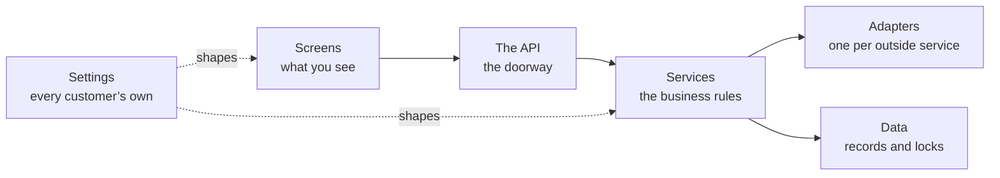
```mermaid
flowchart LR
  A["Screens<br/>what you see"] --> B["The API<br/>the doorway"]
  B --> C["Services<br/>the business rules"]
  C --> D["Adapters<br/>one per outside service"]
  C --> E["Data<br/>records and locks"]
  F["Settings<br/>every customer’s own"] -.->|"shapes"| A
  F -.->|"shapes"| C
```

##### 1.1 · Separate the six layers and keep them separate

> **frontend** — The part you see and click — the screens, the buttons, the forms. *Hotel ka dining hall aur menu card. Jo aapke saamne hai.*
>
> **backend** — The part of the software you never see, which does the actual work — checks the rules, saves the records, calculates the totals. *Hotel ka kitchen. Customer nahin dekhta, par khaana wahin banta hai.*
>
> **API** — The agreed way two pieces of software talk to each other, so one can ask the other for something and get a predictable answer. *Waiter. Aap kitchen mein nahin jaate — waiter ko order dete ho, wahi khaana le aata hai. Waiter badal jaaye toh bhi order dene ka tarika wahi rehta hai.*
>
> **adapter** — A small piece of code that translates between the system and one outside service, so the rest of the system never has to know which service is in use. *Travel adapter. Andar ka appliance wahi, bas plug ko us desk ke socket ke hisaab se badal diya.*

The reason for layers is not tidiness. It is that a layer with a clear edge can be
replaced without touching anything else, and a layer whose edges have blurred cannot be replaced at
all. Most systems that become impossible to change did not decide to be — they just let the screens
start talking directly to the database, one shortcut at a time.

| Layer | What lives there | What it must never do |
|---|---|---|
| Screens | What the user sees and clicks | Contain a business rule, or reach the database directly |
| The API | The doorway the screens knock on | Decide anything — it only carries requests |
| Services | The business rules. The real system | Know which outside company provides anything |
| Adapters | One per outside service | Contain a business rule |
| Data | The records, and the locks on them | Trust the layers above it |
| Settings | Every customer’s own configuration | Ever require a release to change |

**Done when:** The layer boundaries are agreed and there is a check that fails when the code of one layer mentions another it should not know about.

##### 1.2 · Put every business rule in one place, away from everything replaceable

The rules are the only part of this system that is genuinely yours. Frameworks change,
databases get swapped, the screen library goes out of fashion. If the rule that says a dispatch cannot
exceed what was ordered lives inside a screen or inside a database feature, it dies with that thing.
Written as plain functions that take values and return decisions, it outlives all of them — and it can
be tested without starting a database or opening a browser.

**Done when:** A rule can be tested by calling it directly, with no database, no browser and no network. If a test for a rule needs any of those, the rule is in the wrong place.

##### 1.3 · Forbid any outside company’s code inside the business rules

> **provider** — A company whose service the system uses — for messages, for payments, for artificial intelligence, for delivery. *Supplier. Ek supplier maal na de toh doosre se le lo — kaam nahin rukna chahiye.*
>
> **interface** — A written promise about what a part of the system does, without saying which product does it — so the product underneath can be swapped without anything above noticing. *Bijli ka socket. Socket ka size fix hai; usme koi bhi company ka plug lag jaata hai.*

The instant a service calls a payment provider or a messaging provider directly, that
provider is welded into your system. Every alternative listed in any document becomes decorative,
because reaching it means finding and rewriting every mention. The adapter layer exists precisely to
hold that damage in one small, replaceable place.

**Done when:** A search for any provider’s name outside the adapters folder returns nothing, and that search runs automatically on every change.

---

### Part 2 · The database — where everything is kept

The most important layer, and the one where mistakes are least recoverable. A wrong screen
is a bad afternoon; a wrong data shape is a year of workarounds.

> **schema** — The written plan of what information the system keeps and how the pieces connect. *Makaan ka naksha. Deewar uthane se pehle kaagaz pe tay hota hai kaunsa kamra kahaan hai.*
>
> **migration** — A recorded change to the shape of the database, so every copy of the system can be updated the same way, in the same order. *Naksha badla toh likh ke rakha — taaki har site pe wahi badlav, usi tarike se ho.*

**The database — Keeps every record — customers, orders, stock, vouchers — and answers questions about them.**

PostgreSQL is open source, runs anywhere, and has the two things this design needs
built in: locks at the record level so one business cannot read another’s rows, and exact whole-number
arithmetic so money never drifts. Any managed Postgres service is a hosting decision, not a database
decision — the same schema runs on all of them.

| This layer | The database |
|---|---|
| **Built on** | PostgreSQL |
| **Can be replaced with** | A managed Postgres service — same database, somebody else runs the machine |
|  | Postgres on your own server — the software is free, you supply the machine |
|  | MySQL or MariaDB, if a team already knows them well — the schema needs rework for the record-level locks |
| **Everything talks to** | `DatabaseService` |
| **Switching costs** | Moving between Postgres hosts is a dump and a restore. Moving off Postgres entirely means rewriting the isolation layer, which is the one part worth not moving. |

##### 2.1 · Build the lock between businesses first, before anything else

> **table** — One kind of information inside the database — all your customers in one, all your orders in another. *Almari ka ek khaana. Ek khaane mein sirf customers, doosre mein sirf orders.*
>
> **row** — One single record — one customer, one order, one payment. *Register mein ek line. Ek line matlab ek entry.*

Everything else in this document assumes it. If it is added later, every table you have
created by then has to be revisited, and the one that gets missed is the one that leaks. It also has to live in
the database rather than only in the application, because the application will one day have a bug and
the lock has to survive it.

> **Careful.** Test the case where no business is selected at all. Depending on how the setting is read,
> that either refuses or quietly returns **everything** — and the second one is a silent, total leak
> that every other test would pass straight over.

**Done when:** A test creates two businesses with real records, asks for the other one’s record by its
exact identifier, and gets nothing back. The same test, run with the lock removed, fails — because a
test that has never failed has not been shown to test anything.

##### 2.2 · Give every business record the same standard columns

> **audit trail** — An automatic record of every change — what changed, who changed it, and when. *Har entry ke saath naam aur time apne aap likha jaata hai. Baad mein koi bole "maine nahin kiya", toh register bata deta hai.*

Repetitive on purpose. Every business table carries the same handful of columns for who
owns the record, when it was made, who made it, when it last changed, and whether it has been ended.
Doing this everywhere means every feature that depends on them — history, undo, audit, reporting —
works everywhere, instead of working on the tables somebody remembered.

| Column | What it is for |
|---|---|
| identifier | Names this one record, unique across the whole system |
| company | Which of the customer’s companies it belongs to |
| created at / created by | When, and by whom |
| updated at / updated by | The same for the last change |
| ended at | Set when a record stops applying. **Never deleted** |
| version | Stops two people silently overwriting each other |

**Done when:** A check reads the schema and fails if any business table is missing one of these.

##### 2.3 · Store money as whole units, never as a decimal

> **integer paise** — Money stored as a whole number of paise instead of a decimal, so amounts are exact and rounding can never quietly lose a rupee. *Paisa hamesha poore paise mein ginte hain, aadha-adhoora kabhi nahin — isliye hisaab kabhi ek rupya idhar-udhar nahin hota.*

Decimal arithmetic on money loses fractions in ways nobody can trace. Every amount is a
whole number of paise, and every column carrying money says so in its name so a value can never be
read as rupees by mistake. Converting for a report is a division by a hundred of an exact number —
there is no rounding decision left to get wrong.

**Done when:** A check fails if any money column is a decimal type, and the arithmetic is proven with a test that would fail under decimals.

##### 2.4 · Make every changeable value effective-dated, and append-only

> **effective date** — The date a change starts applying from. Records made before it keep the old value; records after it use the new one. *Naya rate 1 tarikh se lagu. Purane mahine ka bill purane rate se hi banega — woh apne aap nahin badlega.*

This is the mechanism that gives a customer complete freedom without breaking their
history. A rate, a role, a person’s position, a tax percentage — none is a single value. Each is a
list of values with the date each started applying. Asking "what was the rate on the 3rd of last
month" is then an ordinary question with an exact answer, rather than an archaeology project.

| Column | What it is for |
|---|---|
| what | The thing being set — a rate, a role, a position |
| who it applies to | The person, the item, the company |
| value | What it became |
| from date | When it started applying |
| to date | Empty means still in force |
| changed by | The person who made the change |

> Two rows covering the same date for the same thing is a data error, not a preference.
> The check for it runs on write, because by the time it shows up in a report the wrong number has
> already been paid to somebody.

**Done when:** A report for a past month is run twice — once before a rate change and once after — and
returns the identical figure both times.

##### 2.5 · Record every change automatically, with no way to switch it off

Not a feature — a foundation. A dispute about what a figure was six months ago is answered
by the record or it is not answered at all. Because it cannot be disabled, nobody has to remember to
enable it, and no configuration mistake can quietly remove it.

**Done when:** Changing any record writes a history entry naming what changed, from what, to what, by whom and when — and there is no setting anywhere that stops it.

---

### Part 3 · The backend — where the work actually happens

The part nobody sees, which does everything that matters: checks the rules, saves the
records, calculates the totals, and refuses what should be refused.

**The backend runtime — Runs the business rules, checks permissions, writes records and calculates totals.**

The same language runs on the browser side, so one team can work across the whole system
and code that validates a form can be shared with the code that validates the saved record — no rule
gets written twice and no two versions of it drift apart.

| This layer | The backend runtime |
|---|---|
| **Built on** | Node.js with TypeScript |
| **Can be replaced with** | Any container host — the code is ordinary and carries no host-specific parts |
|  | Python or Go for a service that genuinely suits them, talking over the same API |
|  | A different Node framework — the business logic sits outside the framework on purpose |
| **Everything talks to** | `the HTTP API contract` |
| **Switching costs** | Low, because the rules live in plain functions rather than inside a framework. Moving a service means moving the functions and putting a different door in front of them. |

##### 3.1 · Organise the backend by what it does, not by what technology it uses

Group the code by business area — sales, stock, payroll, accounts — rather than by
technical type. A person fixing how a discount works then opens one folder instead of five, and a
whole area can be lifted into its own service later without unpicking it from everything else.

**Done when:** Someone new can find where a business rule lives from the name of the business area alone, without being told.

##### 3.2 · Make one action do all of its consequences, or none of them

A sale reduces stock, raises an invoice, posts to the ledger and updates what the customer
owes. If three of those succeed and one fails, the books are wrong and nobody knows. All of it happens
together or none of it does — and the middle state never exists, even for a moment, even if the
machine loses power in between.

**Done when:** A test interrupts an action half way through and confirms the records are exactly as they were before it started.

##### 3.3 · Design the API so a screen never decides anything

Screens exist on phones, on laptops, and eventually in places nobody planned for. Every
one of them must reach the same rules. The moment a screen calculates a total or decides whether an
approval is needed, that logic has to be repeated in the next screen — and the two will disagree.

**Done when:** Every calculation and every permission decision can be reproduced by calling the API directly, with no screen involved.

##### 3.4 · Make the API answer honestly when something is refused

A refusal is information. "Not allowed" tells a user nothing and generates a support call;
"this dispatch is 12 more than the order allows" tells them what to do. And a refusal caused by
somebody else’s change must say so, rather than looking like their own mistake.

**Done when:** Every refusal names what was refused and why, in words a user can act on without phoning anyone.

---

### Part 4 · The frontend — the screens, drawn from settings

The single idea that makes one system serve every industry: **screens are described as
data, not written one by one.** A screen definition says which fields, in what order, with what
labels, under what conditions. Change the definition and the screen changes — no code, no release.

**The frontend — Everything a person sees and clicks — screens, forms, tables, dashboards.**

Screens are drawn FROM SETTINGS rather than written one by one. A tenant that renames a
field, adds a column or turns a module off gets a different screen with no new code written — which
is the only way one system can serve a steel plant and a single creator without becoming two systems.

| This layer | The frontend |
|---|---|
| **Built on** | React with TypeScript, screens generated from configuration |
| **Can be replaced with** | Vue or Svelte — the screen definitions are plain data and do not care what draws them |
|  | Server-rendered pages where speed on a weak connection matters more than interaction |
|  | A native mobile shell reading the same screen definitions |
| **Everything talks to** | `the screen definition format` |
| **Switching costs** | Moderate, and bounded: what a screen contains is data, so a rewrite replaces the painter, not the paintings. |

##### 4.1 · Describe screens as settings rather than building them individually

Hand-built screens are the reason most business software cannot be customised. Every
customer request becomes a code change, and the code grows a branch for each customer until nobody
can safely change anything. If the screen is a description, a customer adding a field is a new line in
their own settings — and it affects nobody else at all.

| A screen definition says | So a customer can |
|---|---|
| Which fields appear, and in what order | Hide what they do not use, promote what they do |
| What each field is called | Use their own trade’s words |
| Which are required | Enforce their own discipline |
| Which extra fields they added | Record what only they need |
| What the columns and filters are | See their work the way they think about it |
| Which actions the buttons offer | Match their own process |

**Done when:** Adding a field to a screen for one customer is done in the app, takes effect at once, and changes nothing for any other customer.

##### 4.2 · Build one design system and use it everywhere

Every screen drawn from the same set of parts means the system feels like one product
rather than twenty. It also means an improvement to a table — better sorting, better behaviour on a
phone — arrives everywhere at once instead of being reimplemented per screen.

**Done when:** A new screen can be assembled from existing parts without writing new visual code.

##### 4.3 · Design for a bad connection and a small screen first

The people entering most of the data are not at a desk. They are on a shop floor, in a
godown, on a site, on a phone, on a connection that comes and goes. A screen that only works on a
fast laptop connection is a screen that does not get used, and the data it should have captured gets
written on paper instead.

**Done when:** Every screen that captures data is usable one-handed on a phone, and says clearly what happened if the connection dropped mid-save.

##### 4.4 · Let a customer turn whole modules on and off

A creator selling courses has no godown. A steel plant has no reels to publish. Showing
everybody every module makes the product look bloated to all of them and correct for none. The menu is
a setting, so each business ends up with a system that looks built for it.

**Done when:** Turning a module off removes it from the menu and keeps every record it ever held — tidying a menu never destroys data.

---

### Part 5 · Storage and memory — files, speed, and what is remembered

Three different things that get confused with each other: where files live, what is kept
handy for speed, and what the assistant is allowed to know.

> **storage** — Where files are kept — photographs, invoices, scanned documents. Different from the database, which keeps information rather than files. *Almari ke bagal wala godown. Register almari mein, par bade dabbe aur photo godown mein.*
>
> **cache** — A small, fast copy of information that was just looked up, kept ready in case it is asked for again. *Counter pe rakha hua sabse zyada bikne wala saamaan. Har baar godown tak jaana nahin padta.*

**File storage — Keeps photographs, invoices and scanned documents — the things too big to sit in the database.**

Almost every file service speaks the same request format, so one adapter reaches most of
them. That makes this the cheapest layer in the whole system to change your mind about.

| This layer | File storage |
|---|---|
| **Built on** | Any S3-compatible object store |
| **Can be replaced with** | A different S3-compatible provider — usually a URL and a key change |
|  | Files on your own server’s disk, with a backup copy elsewhere |
|  | A self-hosted object store such as MinIO, which speaks the same format |
| **Everything talks to** | `FileStore` |
| **Switching costs** | Copy the files across and change the address. Nothing above this layer notices. |

##### 5.1 · Keep files outside the database, and never trust their names

Photographs and scans are large, and a database is an expensive place to keep large
things. They go in a file store, with the database holding only a reference. A file also arrives from
outside, so its name and its claimed type are somebody else’s input: both are checked, and the file is
stored under a name the system chose.

**Done when:** A file can be uploaded, fetched and deleted through one interface, and swapping the file store underneath changes one setting.

##### 5.2 · Make every file access ask permission, every time

The most common serious leak in business software is a file link that works for anybody
who has it. A photograph of a signed document is as sensitive as the record it belongs to, and it
must inherit exactly the same permission, checked on every single fetch.

**Done when:** A link to another business’s file, used by someone from a different business, is refused — proven by a test that tries it.

##### 5.3 · Use the cache only for things that can be safely lost

The cache exists to make common screens fast. The moment anything is kept **only** in the
cache, restarting it loses data — and caches get restarted routinely. Everything in there is a copy;
losing the whole thing costs a slow minute and nothing else.

**Done when:** The cache can be wiped completely while the system is running, and nothing is lost but speed.

##### 5.4 · Decide exactly what the assistant may remember, and for how long

> **model** — The piece of artificial intelligence that reads or writes text, tags a photograph, or answers a question. *Ek bahut padha-likha assistant. Kaam accha karta hai, par har baat pe usse poochho toh kharcha aur waqt dono lagta hai.*

An assistant that answers questions about a business needs to see that business’s data —
and must never see another’s, must never keep it after the question is answered, and must never learn
from it in a way that could surface it elsewhere. This is a decision to make deliberately at design
time, because discovering it later means discovering it the wrong way.

| May remember | May never |
|---|---|
| The current conversation, until it ends | Cross a business boundary, ever |
| What the user is looking at right now | Retain business data after answering |
| Settings and vocabulary for this business | Be used to train anything |
| A saved answer the user chose to keep | Hold a password, a key or a card number |

**Done when:** The retention rules are written down, enforced in code, and a test proves one business’s question cannot reach another’s data.

---

### Part 6 · Sign-in and permissions

Two separate questions kept deliberately apart: who are you, and what may you do. The first
can be handed to somebody else. The second never can.

> **authentication** — Proving you are who you say you are, usually by signing in. *Gate pe pehchaan dikhana. "Main kaun hoon" wala sawaal.*
>
> **role** — What a person is allowed to see and do — a manager sees more than a counter staff member. *Chaabi ka guccha. Manager ke paas zyada chaabiyaan, staff ke paas kam.*
>
> **permission** — One specific thing a role is allowed to do, like approving a discount or viewing salaries. *Guchhe ki ek chaabi. Ek chaabi ek darwaza.*

**Sign-in and permissions — Proves who somebody is, then decides what they are allowed to see and change.**

Who you are and what you may do are kept apart deliberately. Sign-in can be handed to an
outside service — or to a customer’s own company login — while permissions stay ours, because they
depend on the company and role structure no outside service knows about.

| This layer | Sign-in and permissions |
|---|---|
| **Built on** | Sessions issued by the platform, with permissions checked in the backend and again in the database |
| **Can be replaced with** | An identity provider for sign-in only, with permissions still decided here |
|  | A customer’s own company sign-in, for enterprises that require it |
|  | Self-hosted Keycloak or Authentik, when nothing may leave the building |
| **Everything talks to** | `IdentityService` |
| **Switching costs** | Low for sign-in, by design. Permissions never move, so the expensive half is never in play. |

##### 6.1 · Separate proving who somebody is from deciding what they may do

Large customers will insist on using their own company sign-in, and that is reasonable —
it is how they remove access when somebody leaves. But no outside sign-in system knows that this
person may approve purchases up to a limit in one of your companies and only view stock in another.
That decision stays here, always.

**Done when:** Sign-in can be switched to an outside provider without any change to how permissions work.

##### 6.2 · Make permissions specific to the company, not just the person

Somebody who works across two companies in a group is not the same person in both. Giving
one blanket level of access across a group is how a figure from one company ends up in a report for
another, and it cannot be untangled afterwards.

**Done when:** A user working in two companies sees exactly what their role allows in each, and this is proven by a test that tries to cross.

##### 6.3 · Check permission in the backend and again in the database

Hiding a button is not security — it is tidiness. The check that matters happens where the
data is. Two layers, because one layer is one mistake away from an incident, and the layers fail
independently.

**Done when:** A request that bypasses the screens entirely is still refused, proven by calling the API directly with a role that should not be allowed.

---

### Part 7 · Talking to the outside world

Messages, storefronts, marketplaces, couriers, payments. Every one is somebody else’s
system, every one will change without warning, and every one will be down at some point. The design
assumes all three.

**Messages to customers and staff — Sends WhatsApp messages, text messages and email — reminders, confirmations, statements.**

**Each tenant connects its own accounts.** The platform is built with a place for them to
plug in and never holds one central account of its own — a business’s conversations with its own
customers belong to that business. The platform’s job is the plug, not the account.

| This layer | Messages to customers and staff |
|---|---|
| **Built on** | A message service with one adapter per provider, per tenant |
| **Can be replaced with** | Any WhatsApp provider — the adapter changes, the code that decides what to send does not |
|  | Text message and email as fallbacks when a message cannot be delivered |
|  | A shared inbox or an export, for a tenant with no messaging account at all |
| **Everything talks to** | `MessageService` |
| **Switching costs** | One adapter per provider. Switching is a settings change made by the tenant, not a release made by us. |

##### 7.1 · Build the plug, not the account — every connection belongs to the customer

**This is worth being exact about.** The platform needs no messaging account, no
marketplace seller account and no payment account of its own. A business’s conversations with its own
customers, and its own selling accounts, belong to that business. What the platform provides is the
place to plug them in, and the code that knows how to talk to each kind.

Building it the other way — one central account that everyone shares — makes the platform the account
holder for other people’s customers, and makes every customer dependent on a relationship they have no
control over.

**Done when:** A customer connects their own accounts in the app, and the platform holds no account of its own for any of these.

##### 7.2 · Give every capability an ordered fallback, ending somewhere that needs nothing

> **fallback** — The next option the system automatically moves to when the first one fails or is unavailable. *Bijli gayi toh inverter. Inverter gaya toh mombatti. Andhera kabhi nahin hota.*
>
> **circuit breaker** — A switch that takes a repeatedly failing service out of use for a while, instead of retrying it endlessly and slowing everything down. *Ghar ka MCB. Baar-baar fault aa raha hai toh woh line hi kaat deta hai, poora ghar band nahin hota.*

A courier service stops answering at nine at night. A messaging provider hits a limit
mid-broadcast. A model provider runs out of quota half way through. In each case the work must
continue down the list rather than stop — and the last item must be something that needs no outside
service at all, even if that means a manual step. That last item is what turns an outage into an
inconvenience.

**Done when:** Every capability has a written fallback order whose final entry needs nothing bought or connected, and a test proves the work completes when the first choice is unavailable.

##### 7.3 · Stop hammering a service that keeps failing

When an outside service is broken, retrying it constantly makes everything slow while
achieving nothing. After a few failures it is taken out of the list, the work moves to the next
option, and it is tried again once after a pause.

**Done when:** A provider failing repeatedly is taken out of use automatically, and returns by itself once it recovers.

##### 7.4 · Never let an outside system be the source of a figure the business reports

Numbers come from your own records. An outside service can tell you a payout happened;
what that payout **means** to your books is decided here, from your own data, against what you
expected. Otherwise a mistake in somebody else’s system silently becomes a mistake in your accounts.

**Done when:** Every figure in every report can be traced to a record in this system, never to an outside response that was taken on trust.

---

### Part 8 · Work that happens on its own, and finding things

Nobody should watch a progress bar while a thousand messages send or a month closes.

> **queue** — A waiting line for work that does not have to finish this second — sending a hundred messages, building a big report. *Darzi ki dukaan ka parchi system. Kaam parchi pe likh ke lag gaya line mein; customer khada intezaar nahin karta.*
>
> **job** — One piece of work taken off the queue and done in the background. *Line mein se uthayi gayi ek parchi, ab uska kaam ho raha hai.*

**Background work — Does the things nobody should have to wait for — sending a thousand messages, building a month-end report, pulling orders overnight.**

Every job is written so that running it twice does the same thing as running it once. That
single discipline is what makes it safe to retry after a failure, and it is worth more than any
particular queue product.

| This layer | Background work |
|---|---|
| **Built on** | A queue backed by the database, with named workers |
| **Can be replaced with** | A Redis-backed queue when volume outgrows the database |
|  | A hosted queue service, behind the same interface |
|  | An external workflow tool such as n8n for steps a non-programmer should be able to edit |
| **Everything talks to** | `JobQueue` |
| **Switching costs** | Low. Jobs are plain functions with a name; the queue only decides when they run. |

##### 8.1 · Make every background job safe to run twice

Machines restart, connections drop, and a job that was half done gets picked up again.
If running it twice sends the message twice or posts the payment twice, every failure becomes a
cleanup. Written so that running it again reaches the same result, a failure becomes a retry.

**Done when:** Every job is run twice deliberately in a test, and the result is identical to running it once.

##### 8.2 · Let a job that fails be seen, understood and retried

A job that fails silently is worse than one that fails loudly — the work simply never
happened and nobody finds out until a customer asks. Failures are visible, keep the reason, and can be
retried without a developer.

**Done when:** A failed job appears in a screen with its reason, and an admin can retry it.

##### 8.3 · Start with the database for search, and keep records the source of truth

> **search index** — A prepared list that makes finding things fast, the way the index at the back of a book beats reading every page. *Kitaab ke peeche wali index. Poori kitaab padhne ki zaroorat nahin, seedha page number mil jaata hai.*

A separate search engine is another thing to run, back up and keep in step. The database
can search well enough for a long time. When a separate engine is eventually needed, it is a faster
copy — never the place the records live — so it can be rebuilt from scratch at any time.

**Done when:** Search can be turned off entirely and every record remains reachable, if less conveniently.

---

### Part 9 · The artificial intelligence layer

Useful for writing descriptions, tagging photographs, summarising and answering questions.
Dangerous when it becomes something the business cannot operate without, or a bill nobody capped.

> **spend ceiling** — A maximum amount the system is allowed to spend on paid services, after which it refuses to spend more instead of warning you. *Jeb mein utne hi paise leke nikle jitna kharch karna hai. Khatam matlab khatam — udhaar nahin.*

**Artificial intelligence — Writes descriptions, tags photographs, summarises, and answers questions about your own data.**

Ordered fallback, a breaker on anything failing repeatedly, and a spend ceiling that REFUSES
rather than warns. Because every capability also has an option that costs nothing, a spent budget can
stop the spending without ever stopping the business.

| This layer | Artificial intelligence |
|---|---|
| **Built on** | A router in front of several providers, ending on one that needs nothing bought |
| **Can be replaced with** | Any hosted model provider — an entry in the router, not a change to the system |
|  | A model running on your own machine, for work that is routine or private |
|  | Templates and rules with no model at all, which must always remain the last resort |
| **Everything talks to** | `ModelRouter` |
| **Switching costs** | A list entry. The router exists precisely so changing provider is never a project. |

##### 9.1 · Put a router in front of every model, never call one directly

Providers change price, change quality, change terms and disappear. A router means the
system asks for a capability — "write a description", "tag this photograph" — and the router decides
who does it, in what order, and what happens when one fails. Adding or removing a provider is a list
entry.

**Done when:** Adding a new provider requires no change to any business rule, and removing one changes nothing but the list.

##### 9.2 · Cap the spending, and make the cap refuse rather than warn

A warning arrives after the money is gone. The ceiling is checked before each paid call,
and over it the paid provider is simply refused — the work then completes on an option that costs
nothing. Because every capability is guaranteed a free path, a spent budget stops the spending without
ever stopping the business.

**Done when:** With the ceiling set to zero, every capability still completes its work, proven by a test that sets it to zero and runs the full set.

##### 9.3 · Never let a model decide anything that moves money or stock

A model is good at language and unreliable about facts. It may draft, suggest, classify
and summarise. It may not approve a payment, adjust a stock figure, post to the ledger or change a
price by itself. The line is not about how good the model is — it is that a wrong number produced by a
person can be traced to a decision, and a wrong number produced by a model cannot.

**Done when:** An assistant asked to move money declines and produces a request for a person to approve. This is tested by asking it to.

##### 9.4 · Make every answer traceable to the records it came from

An assistant that answers "your best-selling item last month" must be answerable when
somebody disagrees. Every answer carries what it looked at, so a wrong answer is a question about the
data rather than a mystery.

**Done when:** Every assistant answer can be expanded to show the records behind it, and those records can be opened.

---

### Part 10 · Running it

Getting it built is half. Being able to change it every week for years without fear is the
other half, and it is the half that decides whether the product survives.

> **environment** — A separate running copy of the system — one for trying things, one that customers actually use. *Rehearsal aur asli show. Practice alag jagah, taaki galti sabke saamne na ho.*
>
> **deployment** — Putting a new version of the software in place so people start using it. *Nayi dukaan kholna ya purani ko naya roop dena — jab tak shutter nahin uthta, customer ko farq nahin padta.*
>
> **continuous integration** — A robot that checks every change automatically, before anyone can put it live. *Quality-check wala banda gate pe khada. Har maal nikalne se pehle usse guzarta hai.*
>
> **rollback** — Putting the previous working version back, quickly, when a new one turns out to be wrong. *Naya taala kharab nikla toh purana taala wapas laga do — do minute ka kaam.*
>
> **observability** — Being able to see what the system is doing and what went wrong, without guessing. *Dukaan mein CCTV aur register. Kuch gadbad ho toh dekh sakte ho ki hua kya, andaaza nahin lagana padta.*
>
> **uptime** — How much of the time the system is actually working and reachable. *Dukaan mahine mein kitne din khuli rahi. Band rahi toh customer wapas chala gaya.*

**Source control and automatic checks — Keeps the history of every change and runs every test before anything goes live.**

Git itself is the thing that matters, and git is not owned by anybody. The host is a convenience.

| This layer | Source control and automatic checks |
|---|---|
| **Built on** | Git, with automatic checks on every change |
| **Can be replaced with** | A different hosting service — a git repository moves with one command |
|  | Self-hosted Gitea or Forgejo |
|  | A separate build service reading the same repository |
| **Everything talks to** | `the test commands themselves` |
| **Switching costs** | Very low. The checks are ordinary commands, so any system that can run a command can run them. |

##### 10.1 · Keep separate copies for trying things and for real customers

Nobody should learn that a change breaks payroll by watching it break a real payroll. A
practice copy carries realistic but not real data, so mistakes cost an afternoon rather than a
customer.

**Done when:** A change can be tried end to end somewhere that no customer can see.

##### 10.2 · Make a robot check every change before a person can release it

Human review catches design mistakes. It does not reliably catch that a change broke
something three modules away. Automatic checks do, on every single change, without getting tired or
being in a hurry on a Friday evening.

**Done when:** No change reaches customers without every check passing, and this cannot be skipped by anyone.

##### 10.3 · Be able to put the previous version back in minutes

Something will get through. What separates a scare from an incident is how fast the last
working version can return. If going back is difficult, the pressure will be to fix forward under
stress, which is how a small problem becomes a large one.

**Done when:** Going back to the previous version is one command, practised at least once before anyone depends on it.

##### 10.4 · Package it so it can run anywhere

The moment something host-specific gets in, the hosting choice is locked and moving means
a project. Packaged as an ordinary container with nothing host-specific inside, moving is a decision
rather than an undertaking.

**Done when:** The same package runs on a laptop, on a rented server, and on a managed platform, with only settings differing.

##### 10.5 · Be able to see what is happening without guessing

When something is slow or wrong at four in the afternoon with customers waiting, the
question is where — and guessing is expensive. Structured records of what happened, how long it took
and what failed turn that into a lookup.

**Done when:** A failure can be traced from the user’s click to the exact operation that failed, without adding new logging first.

##### 10.6 · Back it up, and prove the backup by restoring it

> **backup** — A copy of everything, kept somewhere else, so a mistake or a failure does not lose your work. *Zaroori kaagzaat ki photocopy, doosri jagah rakhi hui. Asli jal jaaye toh bhi kaam nahin rukta.*

An untested backup is a belief, not a protection. The only proof is a restore into a
scratch copy, done deliberately, before it is ever needed.

**Done when:** A backup has been restored into a scratch environment and checked, and that is repeated on a schedule.

---

### Part 11 · Security, stated plainly

Short, because these are absolutes rather than preferences.

##### 11.1 · Never ask anyone for a marketplace, bank or account password

Every connection is made with a key the customer creates and can withdraw. A password
hands over an account that cannot be taken back and cannot be limited. This is a promise the product
makes, so nothing in the software, the documents or a support conversation may ever break it.

**Done when:** No screen, no form and no support process anywhere asks for one, and the product says so openly.

##### 11.2 · Keep keys out of the code, always

> **encryption** — Scrambling information so that even somebody who steals the file cannot read it. *Apni hi code-bhasha mein likhna. Chori bhi ho jaaye toh padha nahin jaata.*

A key written into the code is in every copy of that code, forever, including copies you
no longer control. Kept outside, a key can be replaced in a minute.

**Done when:** A search of the whole history finds no key, and that search runs automatically on every change.

##### 11.3 · Treat identity documents and bank details as read-once, never stored

Identity and bank numbers may be needed for a calculation or a payment file. They are used
and not written into anything that is kept, because a stored copy is a liability that grows quietly
until the day it is stolen.

**Done when:** No committed file and no exported document contains an identity number, a bank account or a card number.

##### 11.4 · Let a person’s data be corrected and removed on request

Keeping a record for the law and removing a person’s data on request are two different
obligations that resolve differently, and a system with only one of them will breach the other.

**Done when:** Both are separate, recorded settings, and a request of either kind can be carried out and evidenced.

---

### Part 12 · What order to build it in

The order is not a preference. Each stage exists because the next one cannot be trusted
without it, and each finishes when a test proves it rather than when the code is written.

##### 12.1 · Finish a stage only when its test passes, never when its code is written

"Done" is the most abused word in software. A stage that is finished because somebody
believes it is finished will be discovered later, from the far side of three stages built on top of
it. A stage finished because a test proves it can be built on.

**Done when:** Every stage has one written test that decides it, agreed before the stage starts.

##### 12.2 · Build the modules in the order they are numbered

They are numbered in the order their dependencies allow. A product exists before it is
stock; a customer exists before a sale; demand exists before a purchase; stock exists before it moves;
the books exist before they close. Building out of order means inventing the thing you need and
correcting it later.

**Done when:** No module is started before the ones it reads from can supply real records.

#### The modules, in the order they are built

22 modules. Module 01 is the spine — not something you open, the layer everything else
stands on — which is why 22 modules is also 21 you use plus one underneath them.

Each row says what has to exist before it can start, and how many rules it must satisfy before
it is finished.

| # | Module | Needs first | Rules to satisfy |
|---|---|---|---|
| 01 | Platform *(spine)* | Every module | 25 |
| 02 | Design & Sampling | CRM | 7 |
| 03 | Inventory & Catalog | Design & Sampling, Every module | 14 |
| 04 | CRM | Every module | 9 |
| 05 | Sales | Inventory & Catalog, CRM, Warehouse, Logistics | 18 |
| 06 | Planning & Requirements (MRP) | Sales, E-commerce / OMS, Inventory & Catalog | 8 |
| 07 | Purchase | Inventory & Catalog, Planning & Requirements (MRP), Manufacturing | 12 |
| 08 | Manufacturing | Purchase, Planning & Requirements (MRP), Design & Sampling | 20 |
| 09 | Quality & Compliance | Purchase, Manufacturing | 7 |
| 10 | Warehouse | Sales, E-commerce / OMS, Inventory & Catalog | 8 |
| 11 | Logistics | Sales, E-commerce / OMS, Warehouse | 11 |
| 12 | Accounting & GST | Every module | 24 |
| 13 | Treasury & Financial Planning | Accounting & GST, Sales, Purchase | 8 |
| 14 | Settlement | E-commerce / OMS, Accounting & GST | 13 |
| 15 | E-commerce / OMS | Inventory & Catalog, CRM, Sales, Accounting & GST, Logistics, Settlement | 19 |
| 16 | HR & Payroll | Manufacturing | 22 |
| 17 | Marketing | Inventory & Catalog, CRM | 10 |
| 18 | AI Content Engine | Inventory & Catalog | 11 |
| 19 | SEO, AEO & AIO | Inventory & Catalog, AI Content Engine | 6 |
| 20 | Projects & Collaboration | CRM, Sales, HR & Payroll, Inventory & Catalog | 9 |
| 21 | Dashboard & BI | Every module | 9 |
| 22 | AI Assistant, Agents & Automation | Every module | 15 |

**A module is finished when every rule for it is satisfied and proven by a test** — not
when its screens exist. Screens can be demonstrated; rules are what the books rely on.

---

### Part 13 · What a customer can change without you

The measure of whether this design succeeded. Everything in this table is changed by the
customer, in the app, taking effect immediately — and none of it requires a developer, a release or a
phone call.

**18 things, across 4 areas.** For each one, the column that matters
most is the last: what happens to records already made.

#### People

| What changes | Who can | Takes effect | Records already made |
|---|---|---|---|
| Somebody joins — a worker, a supervisor, an office staff member, a contractor | Admin, or an HR role | They exist from their start date and can be assigned work the same minute. | Nothing before their start date mentions them, because they were not there. |
| Somebody leaves, with or without notice | Admin, or an HR role | Marked as left from a date. Their sign-in stops, and no new work is assigned to them. Their record is kept, not deleted. | Every hour they worked, every piece they made and every rupee they were paid stays exactly as it was. Deleting the person would blank all of it and change months already closed — so the record remains and simply has an end date. |
| A replacement starts immediately, in the same position | Admin, or an HR role | Added with their own start date and given the position. Work in progress is reassigned to them from that date. No waiting, no release, no developer. | Work completed under the previous person stays credited to the previous person. Two people held the same position at different times, and every record knows which one applied when. |
| A pay rate, a piece rate or a salary changes | Admin, or an HR role | Applies from the date you set — which may be today, a future date, or a past one you are correcting. | Every completed period recalculates to the rate that applied then, not the new one. This is the single most important line in this register: a rate that silently applied backwards would change payments already made to real people. |
| What somebody is allowed to see and do | Admin | Takes effect on their next action. Screens they may no longer open stop opening. | Everything they did while they held the old permissions stays recorded, with the permissions they had at the time. |

#### Structure

| What changes | Who can | Takes effect | Records already made |
|---|---|---|---|
| A new company is opened, or an existing one is closed | Admin | It exists immediately with its own name, trading name, code and document numbering. The group view includes it from that date. | Group figures for earlier periods are unchanged, because the company did not exist in them. |
| A new way of selling is added — a marketplace, a shop, a counter, an export desk | Admin | Orders can arrive through it the same day. It appears in every report that breaks figures down by channel. | Earlier reports keep their own columns. A channel that did not exist then does not appear then. |
| A godown, a shop, a unit or a stock point is added, renamed or closed | Admin | Stock can move to and from it immediately. | Stock movements already recorded keep pointing at it, under the name it had at the time. |
| Which parts of the system this business uses at all | Admin | Turned on, a module appears in the menu with its screens ready. Turned off, it disappears from the menu. A steel plant, a clothing brand and a single creator each end up with a different system built from identical code. | Turning a module off hides its screens and keeps its records. Nothing is destroyed by tidying a menu. |

#### Your words

| What changes | Who can | Takes effect | Records already made |
|---|---|---|---|
| What the system calls things | Admin | Every screen, every report and every document changes wording at once. One business says order, another says job, another says matter, consignment, batch or booking — the record underneath is identical. | Documents already issued keep the wording they were issued with, because that is what the customer received. |
| Extra information you want to record that nobody else needs | Admin | Added to the screen immediately, with the type you choose — text, number, date, a list to pick from, a yes or no. Reportable from the moment it exists. | Older records simply have no value for it, which is the truth. They are never back-filled with a guess. |
| The steps your work moves through | Admin | Add a stage, rename one, reorder them or remove one. New work follows the new list from that moment. | Work already part-way through keeps the stage it is in, even if that stage has since been removed — a job does not teleport because somebody edited a list. |
| The layout and numbering of invoices, statements, labels and reports | Admin | The next document uses the new layout or the new numbering. | Documents already issued are never re-rendered. What the customer holds and what you hold stay identical. |

#### Rules

| What changes | Who can | Takes effect | Records already made |
|---|---|---|---|
| Turning a discretionary rule on or off | Admin | Applies to the next transaction. One business requires an approval below a price floor; another does not — same software, different setting. | Transactions already posted are not re-judged against a rule that did not apply to them. |
| Who has to approve what, and above which amount | Admin | The next request follows the new path. | Requests already approved keep the path they went through, and the names of who approved them. |
| Tax rates and the categories they attach to | Admin, or an accounts role | Applies from its effective date, which for tax is set by law rather than by you. | Every invoice keeps the rate that applied on its own date. A return filed for an earlier period recalculates to that period’s rate — this is not a convenience, it is the only correct behaviour. |
| Which outside service is used for messages, payments, delivery or artificial intelligence | Admin | The next message, payment or shipment goes through the new one. | Everything already sent keeps the record of which service carried it, which is what you need when you query one. |
| The most the system may spend on paid outside services | Admin | Enforced immediately. Over the ceiling, the paid option is refused and the work completes on one that costs nothing. | Spending already recorded is unchanged. |

#### What can never be switched off

Short on purpose. Every line is something a bank, an auditor, a customer or an employee
relies on, and a setting that could remove it would remove their protection too.

| Never changeable | Why |
|---|---|
| The audit trail | Who changed what, and when. A system where this can be switched off cannot be used to answer a dispute, so it cannot be switched off. |
| Every record naming the company it belongs to | Without it, figures from two companies merge and no report can be trusted again. |
| One business being unable to read another’s records | This is not a preference. It is the promise that makes a shared platform usable at all. |
| Money kept as exact whole units | The alternative loses fractions of a rupee in ways nobody can trace afterwards. |
| Deleting nothing — records are ended, never erased | An erased record changes a period that was already closed, filed and possibly audited. |
| Never asking for a marketplace, bank or account password | The system connects through proper keys that you can withdraw. A password would hand over an account you cannot take back. |

---

### Part 14 · The rulebook — what the system must refuse

Every module is finished when its rules hold. Not when its screens exist — screens can be
demonstrated, rules are what the books rely on. So they are here in full rather than counted.

**285 rules.** Every one states what happens **and what the system will
never do instead**. The second half is the part worth reading — it is what you are relying on when
nobody is looking.

#### Module 01 · Platform — 25 rules

**`R01.1` Every business record names the company it belongs to**

- **When** any record is written — a sale, a movement, a voucher, an employee
- **Then** its company is stored on the row itself
- **Never** inferring the company from who happens to be logged in, which silently mis-files every record made by someone who works across two of them

**`R01.2` One company cannot read another company’s records**

- **When** a query runs for a user scoped to one company
- **Then** rows belonging to any other company are not returned at all
- **Never** filtering in the screen while the data is already loaded — a filter can be removed, a scope cannot

**`R01.3` The audit trail has no off switch**

- **When** anything touching money, stock, price, tax, pay or master data changes
- **Then** the change and its before-image are written in the same transaction as the change itself
- **Never** allowing a setting, a role or a migration to disable it — either both land or neither does

**`R01.4` An update records what it was, not only what it became**

- **When** a row is changed
- **Then** the current row is read first so the before-image is what was really there
- **Never** trusting the caller’s idea of the old value, which makes the trail a record of intentions rather than of facts

**`R01.5` A table nobody thought to audit is refused**

- **When** code writes to a table that is not on the audited list
- **Then** the write is refused and the table is named
- **Never** letting it through quietly, which is how a money column ends up outside the trail without anyone deciding that

**`R01.6` Deletion is a reversal, never a removal**

- **When** a user deletes anything
- **Then** the record is voided, marked, and still readable with the reason
- **Never** removing the row — eight years of trail cannot survive a DELETE

**`R01.7` A module that is not in the canonical list cannot join the bus**

- **When** code subscribes to a business event
- **Then** the module number is checked against modules.js and refused if unknown
- **Never** letting an unregistered listener attach, which is how a cascade gains a step nobody can find later

**`R01.8` A cascade is all of it or none of it**

- **When** one business event fans out to stock, ledger, customer and documents
- **Then** every step commits together, or the whole thing is rolled back
- **Never** leaving stock moved and the ledger unposted, which is the exact state no report can ever explain

**`R01.9` A handler that throws takes the transaction with it**

- **When** any subscriber to an event fails
- **Then** the emitting transaction fails too
- **Never** swallowing the error so the originating action appears to have succeeded

**`R01.10` No capability depends on a single outside service**

- **When** any capability is used — books, courier, payments, AI, storage, GST
- **Then** an ordered list of interchangeable providers is tried, ending on one that needs nothing connected
- **Never** having one provider whose outage stops the work, however good that provider is

**`R01.11` A failing provider is taken out of the list, not hammered**

- **When** a provider fails repeatedly
- **Then** it is tripped open, skipped entirely, and retried once after a cooldown
- **Never** retrying into a dead service on every call while a working alternative sits further down the list

**`R01.12` A spend ceiling refuses, it does not warn**

- **When** a paid call would take spending past the ceiling set for it
- **Then** that provider is refused and the work completes on a free one
- **Never** letting it through with a warning nobody reads, and never refusing only the first provider while the same spend reroutes to the next

**`R01.13` The system never asks for a marketplace, bank or account password**

- **When** any integration is connected, by any module, including a chatbot or an agent
- **Then** a scoped, revocable key is requested instead, cancellable from the provider’s side without changing the login
- **Never** accepting, storing, echoing or transmitting an account password — there is no screen, no import and no support flow that takes one

**`R01.14` Card and bank credentials never reach application code**

- **When** a payment needs a card or bank detail
- **Then** the provider’s own secured field takes it directly
- **Never** passing it through this system, even in transit, even unlogged — what is never received cannot be leaked

**`R01.15` Consent and retention are two different clocks**

- **When** a person’s data is held
- **Then** why it may be used and how long it is kept are tracked separately, and an erasure request is resolved against both
- **Never** treating a legal retention period as consent to keep using the data for anything else

**`R01.16` A scoped key is revocable without touching the login**

- **When** an outside service is connected
- **Then** a key limited to what that capability needs is stored, and the connection records which capability it serves
- **Never** storing a credential that can do more than the capability requires, because the day it leaks is the day that difference matters

**`R01.17` A webhook is verified, idempotent and never silently dropped**

- **When** a payment, courier, storefront or messaging provider calls in
- **Then** the signature is checked, the external id makes a repeat delivery a no-op, and a failure is logged with its payload for retry
- **Never** trusting an unsigned call, and never processing the same external id twice — a duplicated payout or a duplicated order is indistinguishable from a real one afterwards

**`R01.18` A trade is added as data, never as a version of the software**

- **When** a business in a trade the system has never seen signs up
- **Then** its vocabulary, stages, extra fields, documents, rule switches and starting reference data arrive as one configuration file, and every screen reads back in that trade’s words
- **Never** a branch, a fork or a bespoke build per industry — that is a consultancy with software attached, and it is the thing that stops a product from being one

**`R01.19` A pack is data and can never be code**

- **When** a pack is loaded from any source
- **Then** every value in it is inspected, at any depth, and a function anywhere inside it refuses the whole pack
- **Never** letting configuration carry behaviour — the moment a pack can run code, adding a trade is a code change again and the guarantee in R01.18 is worthless

**`R01.20` A pack may rename a concept, never invent one**

- **When** a pack declares its vocabulary
- **Then** each entry is matched against the fixed list of concepts the engine has, and an unknown one refuses the pack
- **Never** accepting an unrecognised word as a new concept, which turns "vocabulary" into a place to put anything and leaves the screens with a name for something that does not exist

**`R01.21` A pack extends tables that exist, and nothing else**

- **When** a pack adds fields
- **Then** the table is checked against the real schema and the field type against the types the engine can store
- **Never** creating a table on a customer’s behalf from a configuration file, which puts the shape of the database outside the reach of the schema test that guards it

**`R01.22` Money in a pack is money everywhere else**

- **When** a pack adds a field whose name reads as an amount, a price, a cost, a total, a fee or a rate
- **Then** it must be declared in paise, and a plain number refuses the pack
- **Never** letting a trade introduce a floating-point rupee through the side door after the whole schema was built to keep them out

**`R01.23` No pack can switch off a guarantee**

- **When** a pack sets a rule off
- **Then** the rule id is checked against the rulebook, and against the list of rules no pack may touch — company scoping, the audit trail, the posting rules, group elimination and roster privacy
- **Never** a trade opting out of the things that make the books trustworthy; it may call an invoice whatever it likes and may not decide its trail is optional

**`R01.24` A rule a pack never mentions is on**

- **When** a rule is looked up for a trade
- **Then** the rulebook is the default and the pack is read as an exception list — silence means the rule applies
- **Never** treating the pack as a permission list, which would mean every rule added after a pack was written silently applies to nobody who is using it

**`R01.25` An invalid pack is refused whole, never half-loaded**

- **When** a pack fails any check
- **Then** every problem in it is reported at once and none of it is applied
- **Never** partially loading a trade, which leaves a system whose vocabulary and rules disagree with each other and no way to tell which half is live

#### Module 02 · Design & Sampling — 7 rules

**`R02.1` A style becomes a SKU only after sign-off**

- **When** someone tries to create a catalogue record for a design
- **Then** the design must already have passed sample sign-off
- **Never** letting a SKU exist for something with no agreed specification, which puts an unmakeable item on sale

**`R02.2` Every version of a specification is kept**

- **When** a sample round changes a measurement, a fabric or a trim
- **Then** a new version is written and the old one stays readable
- **Never** editing the specification in place — a karigar paid against last month’s spec must still be able to show what it said

**`R02.3` A costed trial carries the date its rates came from**

- **When** a sample is costed
- **Then** the rate and the date it was in force are both stored on the trial
- **Never** recosting an old trial with today’s rates and presenting the result as what it cost then

**`R02.4` A design with no ownership record is flagged, not blocked**

- **When** a design reaches sign-off with no trademark or copyright status on file
- **Then** it proceeds and is listed as unprotected
- **Never** silently treating it as protected, which is only discovered when a near-identical listing appears and there is nothing to act on

**`R02.5` The first-shown date is recorded when it happens**

- **When** a design is first shown publicly — an exhibition, a listing, a lookbook
- **Then** that date is stamped and never editable afterwards
- **Never** backdating it later, which is precisely the field a dispute turns on

**`R02.6` A rejected sample keeps its reason**

- **When** a sample round is rejected
- **Then** the reason is recorded against the version
- **Never** closing it with a status alone, which loses the only information that stops the same mistake in the next round

**`R02.7` A specification cannot be deleted while stock exists against it**

- **When** someone removes a design that has ever been made
- **Then** it is archived and stays linked to every piece produced from it
- **Never** orphaning finished stock from the specification it was made to

#### Module 03 · Inventory & Catalog — 14 rules

**`R03.1` Stock is one number per SKU, per location, per stage**

- **When** any module asks how much there is
- **Then** it reads the one quantity, with the channel recorded on the movement rather than on the stock
- **Never** keeping a separate stock figure per channel — the last piece sold on one marketplace has to vanish from the other ten at the same instant, which per-channel inventory cannot do

**`R03.2` Negative stock is a fault, not a state**

- **When** an issue would take a quantity below zero
- **Then** the issue is refused
- **Never** recording a negative balance and leaving someone to explain it at month-end

**`R03.3` Selling a kit decrements every component**

- **When** a kit or combo SKU is sold
- **Then** each component SKU is decremented at order time
- **Never** decrementing only the kit, which leaves the components sellable twice

**`R03.4` A kit with no components is refused**

- **When** an item is marked a kit but lists nothing
- **Then** the record is refused and named
- **Never** accepting it and silently decrementing nothing on every sale

**`R03.5` Stock value ties to the item cost, always**

- **When** stock is valued
- **Then** the value is computed from the quantity and the item cost
- **Never** storing a valuation that can drift from the quantity it is supposed to describe

**`R03.6` Every movement has a source, a destination, or both**

- **When** a stock movement is recorded
- **Then** at least one end is named
- **Never** accepting a movement from nowhere to nowhere, which is how quantity appears without a cause

**`R03.7` A quantity is a whole number above zero**

- **When** a movement is written
- **Then** a non-integer or non-positive quantity is refused
- **Never** accepting a negative movement as a shorthand for a reversal — a reversal is its own movement with its own reason

**`R03.8` Goods in someone else’s warehouse are still yours**

- **When** stock sits in a channel’s own warehouse under consignment or sale-or-return
- **Then** that warehouse is a location like any other and the stock is counted, valued and aged there
- **Never** letting it drop off the books until it sells, which understates both stock and exposure

**`R03.9` Fabric in metres and pieces in numbers share one item master**

- **When** an item is defined
- **Then** its unit of measure is a property of the item
- **Never** building a second item master for a second unit, which splits the one stock number this module exists to protect

**`R03.10` A listing needs the packed size and weight before it can go out**

- **When** a product is pushed to a channel
- **Then** packed dimensions and weight must be present
- **Never** listing without them, because that is the field every courier weight dispute is settled on

**`R03.11` The channel’s own code for a product is mapped, not assumed**

- **When** a product exists on a marketplace
- **Then** that channel’s identifier is stored against ours
- **Never** matching on name or on a code we invented, which mis-posts every settlement line for that product

**`R03.12` A duplicate master record is merged, never left as two**

- **When** the same customer, vendor or design is detected twice
- **Then** they are merged and both old identifiers keep resolving
- **Never** leaving two live records, which splits every total that record appears in

**`R03.13` A price is per channel and dated**

- **When** a channel price is set
- **Then** it is stored against that channel with the date it takes effect
- **Never** holding one price and reading it as if it applied everywhere and always

**`R03.14` Dead stock is named as dead stock**

- **When** an item has not moved for the period set for it
- **Then** it appears on the dead-stock register with its age and carrying value
- **Never** leaving it inside the general stock figure where it reads as healthy inventory

#### Module 04 · CRM — 9 rules

**`R04.1` One customer, one record, whichever channel they arrived by**

- **When** the same person orders on a marketplace and later at the counter
- **Then** both land on one record with the channel noted on each order
- **Never** creating a second customer per channel, which makes lifetime value meaningless

**`R04.2` A document is filed against the record it belongs to**

- **When** any agreement, receipt, certificate or scan is stored
- **Then** it is attached to the order, party, case or employee it concerns
- **Never** filing it in a folder that has to be remembered rather than found

**`R04.3` A signed copy files itself back**

- **When** a document sent for signature is signed
- **Then** the signed version returns to the same record automatically
- **Never** leaving the signed copy in an inbox while the record still shows it as pending

**`R04.4` A ticket carries the order it is about**

- **When** a question arrives by chat, email or phone
- **Then** it is tied to the order or account it concerns, with the history already on screen
- **Never** opening a ticket with no link, which makes the first reply a request to explain again

**`R04.5` Feedback attaches to the item, not only the buyer**

- **When** a rating or complaint arrives after delivery
- **Then** it is attached to the design or item it is actually about
- **Never** holding it only against the customer, which hides a complaint-prone item as a scatter of unrelated gripes

**`R04.6` A customer’s consent travels with their data**

- **When** a customer record is used for marketing or profiling
- **Then** the consent captured at the point it was given is checked first
- **Never** assuming that having the data implies permission to use it for anything

**`R04.7` A merged customer keeps both histories**

- **When** two customer records are merged
- **Then** every order, ticket and document from both survives on the surviving record
- **Never** discarding the shorter history to make the merge simple

**`R04.8` Credit state is read at the moment of the order**

- **When** a B2B order is placed
- **Then** the customer’s outstanding and limit are evaluated then
- **Never** using a figure cached from the last sync, which is how a party goes past its limit between refreshes

**`R04.9` A closed ticket keeps what resolved it**

- **When** a ticket is closed
- **Then** the resolution is recorded on it
- **Never** closing with a status alone, which loses the answer the next identical question needs

#### Module 05 · Sales — 18 rules

**`R05.1` Every sale carries its company and its channel**

- **When** an order is created on any channel
- **Then** both are written on the order
- **Never** leaving either to be inferred later from the document number or the warehouse

**`R05.2` A sale posts stock and ledger together**

- **When** a sale is confirmed
- **Then** stock is deducted, the invoice is raised, and the ledger is posted in one transaction
- **Never** invoicing without moving stock, or moving stock without posting

**`R05.3` If the ledger refuses, the stock never moved**

- **When** the posting half of a sale fails
- **Then** the stock movement is rolled back with it
- **Never** leaving the goods gone and the books untouched

**`R05.4` A quote becomes an order without being retyped**

- **When** a quotation is accepted
- **Then** the order is created from it, carrying the same lines and prices
- **Never** re-entering the lines, which is where the price on the quote and the price on the invoice start to differ

**`R05.5` A price below the floor needs an approval, not a note**

- **When** a line is priced under the floor set for it
- **Then** the order waits in the approvals queue with the rule that stopped it named
- **Never** letting it through with a comment box, which is a discount policy nobody can enforce

**`R05.6` An export invoice knows it is an export**

- **When** an order ships outside the country
- **Then** the LUT or IGST treatment, currency and shipping terms are set on the order itself
- **Never** treating it as a domestic invoice and correcting the tax afterwards

**`R05.7` A counter sale is the same order record**

- **When** someone buys at the counter
- **Then** the same order table records it, with the counter as the channel
- **Never** running the till on a separate book that has to be merged later

**`R05.8` A credit sale reserves the credit at the moment it is taken**

- **When** a B2B order is accepted on credit
- **Then** the exposure is committed against the party immediately
- **Never** counting it only when the invoice is raised, which lets several orders each fit inside the same limit

**`R05.9` A dispatch cannot exceed what was ordered**

- **When** a shipment is prepared
- **Then** quantities are checked against the order line
- **Never** shipping over, which becomes an invoice the customer never agreed to

**`R05.10` A cancelled order releases what it held**

- **When** an order is cancelled
- **Then** reserved stock and committed credit are both released
- **Never** leaving stock reserved against a dead order, which shows the business as out of goods it actually has

**`R05.11` An AWB belongs to the shipment, not the courier integration**

- **When** a tracking number is recorded, typed in or fetched
- **Then** it is stored on the shipment
- **Never** making the number reachable only through whichever courier API produced it, which loses it the day that courier is dropped

**`R05.12` A subscription renewal is a new order**

- **When** a subscription renews
- **Then** a fresh order is created with its own stock, invoice and posting
- **Never** extending the original order, which makes the revenue of two periods indistinguishable

**`R05.13` A sale to a sister company is marked as one**

- **When** the counterparty is another company in the group
- **Then** the counterparty company is recorded on the entry
- **Never** posting it as an ordinary outside sale, which inflates the group turnover by trade it never did

**`R05.14` A quote or proforma number carries its type and financial year**

- **When** a quotation or proforma is raised
- **Then** it is numbered Q-{FY}-#### or PI-{FY}-####, sequential within that company and year
- **Never** sharing one sequence between quotations and proformas, which makes a proforma indistinguishable from a quote in the register

**`R05.15` A quote line with no description, no quantity or a negative rate is not a line**

- **When** a quotation is totalled
- **Then** only lines with a description, a quantity above zero and a rate of zero or more are counted
- **Never** letting a half-filled row contribute a number to the total

**`R05.16` An export line carries no GST**

- **When** a quotation or invoice is marked export under LUT
- **Then** the GST percentage is zero and the document says why
- **Never** applying the domestic rate and correcting it after the buyer queries the total

**`R05.17` A made-to-measure order has two money legs, and both are visible**

- **When** a customisation order is accepted
- **Then** the advance and the balance are recorded as separate amounts with their own dates, and the balance stays owed until dispatch
- **Never** showing one payment at the end, which hides money already taken and work already owed

**`R05.18` A customisation quote keeps every round of the negotiation**

- **When** a price is revised during a bespoke enquiry
- **Then** each quoted figure is kept in order with what changed
- **Never** overwriting the earlier figure, which is the one the customer remembers agreeing to

#### Module 06 · Planning & Requirements (MRP) — 8 rules

**`R06.1` A forecast is labelled a forecast wherever it appears**

- **When** a projected figure is shown beside actuals
- **Then** it is visually and structurally distinct
- **Never** letting a forecast total sit in the same column as a real one, which is how a plan becomes a reported result

**`R06.2` A requirement run reads live stock, not a snapshot**

- **When** the MRP run explodes requirements
- **Then** it reads the current quantity at the moment it runs
- **Never** planning against a nightly copy, which orders material the business already has

**`R06.3` A requirement names what caused it**

- **When** the run produces a shortfall
- **Then** the order, forecast or reorder level that generated it is recorded on the line
- **Never** producing a bare quantity nobody can trace back to a demand

**`R06.4` Stock already on order counts against the shortfall**

- **When** the run computes what to buy
- **Then** open purchase orders are netted off first
- **Never** ignoring them and ordering the same material twice

**`R06.5` A budget ceiling refuses, it does not warn**

- **When** a proposed purchase would exceed the open-to-buy ceiling
- **Then** it is held for approval with the ceiling named
- **Never** raising it with a warning, which makes the ceiling advisory and therefore not a ceiling

**`R06.6` A lead time is per vendor and per item**

- **When** a run works out when to order
- **Then** it uses the lead time recorded for that vendor and that item
- **Never** applying one global lead time, which under-orders the slow lines and over-orders the fast ones

**`R06.7` A run is kept, not overwritten**

- **When** the MRP run executes again
- **Then** the previous run stays readable with its inputs
- **Never** replacing it, which makes it impossible to see why last week’s decision was taken

**`R06.8` A seasonal signal cannot silently become a permanent one**

- **When** a festival or season inflates demand
- **Then** the period it applies to is stored with the signal
- **Never** folding a spike into the baseline, which keeps ordering for a festival all year

#### Module 07 · Purchase — 12 rules

**`R07.1` Nothing is paid without a three-way match**

- **When** a vendor invoice is approved
- **Then** the purchase order, the goods received note and the invoice must agree
- **Never** paying on the invoice alone, which pays for goods that never arrived

**`R07.2` A short or damaged receipt is recorded as received short**

- **When** the GRN quantity is below the PO quantity
- **Then** the difference is recorded with its reason and the payable follows the received quantity
- **Never** receiving the full quantity to make the match pass

**`R07.3` Input tax credit is claimed against a real document**

- **When** ITC is taken on a purchase
- **Then** the vendor invoice and its tax detail are on file
- **Never** claiming credit from a payment record alone, which is the claim that fails reconciliation

**`R07.4` Landed cost reaches the item, not just the P&L**

- **When** freight, duty or insurance is attached to a purchase
- **Then** it is apportioned into the cost of the items received
- **Never** expensing it separately, which understates the cost of every piece made from that material

**`R07.5` A vendor price is dated**

- **When** a rate is agreed with a supplier
- **Then** it is stored with the date it takes effect
- **Never** overwriting the old rate, which makes last month’s purchase look mispriced

**`R07.6` A purchase order over its approval level waits**

- **When** a PO exceeds the value a role may approve
- **Then** it goes to the approvals queue naming the rule and the level
- **Never** splitting it into smaller orders to fit under the limit — the split is detected and the parts are assessed together

**`R07.7` A vendor with no active record cannot be paid**

- **When** a payment is raised
- **Then** the vendor must exist, be active, and have its bank detail verified
- **Never** paying to detail typed onto the payment itself, which is the single most common route for payment fraud

**`R07.8` A change to vendor bank detail is treated as high risk**

- **When** a vendor’s bank account is changed
- **Then** the change is approved by a second person and the old detail is kept
- **Never** accepting a change from an email instruction alone

**`R07.9` A job-work despatch stays on the books**

- **When** material is sent to a contractor
- **Then** it moves to a job-work location and remains this company’s stock
- **Never** writing it out on despatch, which loses material the business still owns

**`R07.10` An insurance policy is linked to what it covers**

- **When** a policy is recorded
- **Then** the stock, premises or shipment it covers is named on it
- **Never** holding policies as documents with no link, which is discovered only at the moment of a claim

**`R07.11` The three-way match is arithmetic, not a judgement**

- **When** a vendor invoice is checked
- **Then** the payable equals the received quantity × the purchase-order rate, and the purchase order, the goods receipt and the invoice must all agree on quantity and value
- **Never** passing an invoice whose value exceeds received quantity × agreed rate, and never letting an override happen without recording who made it and why

**`R07.12` A material is sourced down a ranked list, not from whoever answers**

- **When** a material has to be bought
- **Then** the vendors ranked for that material are approached in their priority order
- **Never** defaulting to the last vendor used, which is how a price rise becomes permanent without anyone deciding

#### Module 08 · Manufacturing — 20 rules

**`R08.1` Sets are pooled across every karigar before the minimum is taken**

- **When** completed sets are counted for a design
- **Then** every karigar’s pieces for that design are pooled first, and the set count is the minimum across the populated member columns of the pool
- **Never** counting sets per karigar row and adding them up, which loses every set completed by two people between them

**`R08.2` A surplus piece is paid for, and is not a set**

- **When** a karigar makes more of one garment than the set needs
- **Then** the extra is named individually and paid at its own piece rate
- **Never** adding it to the set count, and never leaving it unpaid because it did not complete a set — the person made it either way

**`R08.3` A design counts on the garments it actually has**

- **When** a design is made of fewer garment types than the usual set
- **Then** it is counted on the members it does have
- **Never** returning zero because an optional member is absent, which silently unpays a whole design

**`R08.4` A missing rate posts zero and is flagged, never guessed**

- **When** a design has no entry in the stitching rate master
- **Then** it costs zero and the design is named in the summary
- **Never** inferring a rate from a similar design — a guessed rate is a wrong payment to a real person

**`R08.5` A two-row heading is read as two rows**

- **When** the production grid uses a merged heading over garment columns
- **Then** both header rows are read so repeated garment names stay distinct columns
- **Never** reading only the first row, which collapses three Dupatta columns into one and undercounts the work

**`R08.6` A karigar written as a pair stays one unit**

- **When** two names share one row as a working pair
- **Then** they are treated as a single paying unit
- **Never** splitting them into two karigars, which halves each person’s recorded output and breaks the payout

**`R08.7` Several years of grids pool into one set of figures**

- **When** more than one production workbook is supplied
- **Then** their grids pool into a single costing
- **Never** reporting each file separately, which double-counts nothing but hides the sets completed across a year boundary

**`R08.8` Cost per piece is independent of set completion**

- **When** the cost of a design is worked out
- **Then** each raw piece is costed at its own rate
- **Never** costing by completed sets, which values an unfinished set at nothing while the labour has already been spent

**`R08.9` A production report moves stock and pay together**

- **When** a karigar production report is accepted
- **Then** finished stock comes in, the payout is raised in HR, wages post to the ledger, and the design cost updates — in one transaction
- **Never** taking the stock in and settling the pay in a separate pass, which is how the two disagree

**`R08.10` Material issued to production leaves raw stock at the moment it is issued**

- **When** a production order consumes material
- **Then** raw stock is reduced and work in progress increases
- **Never** consuming at completion, which shows material as available while it is already cut

**`R08.11` A bill of materials is versioned with the design**

- **When** a production order is created
- **Then** it captures the BOM version in force at that moment
- **Never** reading the current BOM when costing an old order, which recosts history

**`R08.12` Wastage is recorded, not absorbed**

- **When** consumption exceeds the BOM
- **Then** the excess is recorded as wastage against the order with its reason
- **Never** quietly increasing the BOM to match what was used, which destroys the only signal that something is going wrong

**`R08.13` A stage cannot be skipped without being recorded as skipped**

- **When** work moves past a defined stage without that stage being marked
- **Then** the skip is recorded on the order
- **Never** letting the stage silently complete, which makes every stage-time figure fiction

**`R08.14` An advance to a karigar is a balance, not a deduction from nowhere**

- **When** an advance is paid
- **Then** it is held against that karigar and recovered from later payouts, with the running balance visible
- **Never** deducting an amount at payout time that cannot be traced to a specific advance

**`R08.15` A rework carries the cost of the rework**

- **When** a piece is returned to a stage to be redone
- **Then** the additional labour is costed to the design that caused it
- **Never** costing it as new production, which makes a failing design look as profitable as a good one

**`R08.16` Material consumed is the average per piece times the pieces made**

- **When** consumption is costed against a production run
- **Then** consumption equals the average consumption per piece × pieces produced, and the difference against the bill of materials is recorded as wastage
- **Never** back-fitting the average to whatever was issued, which makes wastage mathematically impossible to see

**`R08.17` A set type comes from the rate master, and an inferred one says so**

- **When** a design is classified into a set type
- **Then** the rate master’s Set column decides it; when the design is absent, the type is inferred from which garment columns actually carry pieces and the design is flagged as inferred
- **Never** presenting an inferred classification as though it came from the master

**`R08.18` An alteration caused by the karigar’s own mistake is unpaid**

- **When** a piece is reworked because of an error by the person who made it
- **Then** the alteration hours are recorded and paid at zero
- **Never** paying for the rework at the standard alteration rate, and never leaving the hours unrecorded — the time still happened and the design still bore the cost

**`R08.19` Alteration time is paid at the alteration rate, not the piece rate**

- **When** admin-assigned alteration hours are settled
- **Then** they are paid at the hourly alteration rate in force and added to that karigar’s payout
- **Never** folding alteration hours into the piece count, which corrupts both the production figure and the earnings figure at once

**`R08.20` A contract worker paid by the hour has no attendance row**

- **When** a contract role is settled
- **Then** payment is hours worked × the agreed hourly rate, recorded against the person without an attendance record
- **Never** forcing a contract worker through the salaried attendance model, which produces a monthly figure nobody agreed to

#### Module 09 · Quality & Compliance — 7 rules

**`R09.1` A failed check blocks the next stage**

- **When** an inspection fails
- **Then** the batch cannot progress until it is passed, reworked or written off
- **Never** letting it move with the failure noted, which sends a known defect to a customer

**`R09.2` A check names the person who did it**

- **When** any inspection is recorded
- **Then** the inspector, the time and the sample size are stored
- **Never** accepting an anonymous pass, which cannot be investigated when the complaints arrive

**`R09.3` An expiring certificate warns before it expires**

- **When** a certificate approaches its expiry
- **Then** it is raised while there is still time to renew
- **Never** discovering the lapse at the moment a buyer asks for it

**`R09.4` A rejected batch cannot be sold as first quality**

- **When** a batch is rejected
- **Then** it is marked and can only be sold through a channel that accepts seconds
- **Never** letting it re-enter the ordinary sellable pool

**`R09.5` A defect is attached to the design and the stage**

- **When** a defect is recorded
- **Then** both the design and the stage that produced it are named
- **Never** recording it against the batch alone, which loses the pattern that would have prevented the next one

**`R09.6` A compliance document is evidence, not a checkbox**

- **When** a compliance requirement is marked met
- **Then** the document proving it is attached
- **Never** accepting a tick with nothing behind it, which is what fails an audit

**`R09.7` A sustainability figure comes from the same evidence**

- **When** an ESG figure is reported
- **Then** it is computed from the certificate and audit records already on file
- **Never** assembling it separately once a year from numbers nobody can trace

#### Module 10 · Warehouse — 8 rules

**`R10.1` A pick is confirmed against the bin it came from**

- **When** an item is picked
- **Then** the bin is recorded on the movement
- **Never** decrementing a warehouse total with no bin, which makes the next cycle count unexplainable

**`R10.2` A short pick stops the pack, it does not silently reduce the order**

- **When** the picker cannot find the full quantity
- **Then** the shortage is raised against the order and the pack waits
- **Never** packing what was found and invoicing for it as though that was the order

**`R10.3` A scan is the same event as a keyed entry**

- **When** a code is captured by scanner, phone camera or typing
- **Then** the same movement is written
- **Never** having a scanning path that writes different records from the manual path

**`R10.4` A cycle count adjustment names a reason**

- **When** a count differs from the system
- **Then** the adjustment records the reason and the person
- **Never** writing the system down to the counted figure with no explanation, which hides theft and damage equally well

**`R10.5` The packing video is linked to the shipment**

- **When** a parcel is recorded on video at packing
- **Then** the recording is attached to that shipment
- **Never** keeping the footage in a folder by date, which makes it unusable in the dispute it exists for

**`R10.6` A bin holds a location, not a guess**

- **When** stock is put away
- **Then** the destination bin is captured at put-away
- **Never** assigning a default bin so the step can be skipped

**`R10.7` A dispatch cut-off is per channel**

- **When** a channel has a handover deadline
- **Then** the queue is ordered and warned against that channel’s own cut-off
- **Never** applying one cut-off to all of them, which misses the earliest and idles for the latest

**`R10.8` A returned parcel is inspected before it is anything else**

- **When** a return arrives at the warehouse
- **Then** it is booked into a return-inspection location first
- **Never** restocking on arrival, which puts an unchecked item back on sale

#### Module 11 · Logistics — 11 rules

**`R11.1` The courier rate is checked against the packed weight**

- **When** a courier bills for a shipment
- **Then** the billed weight is compared with the packed weight recorded at packing
- **Never** accepting the courier’s weight without comparison, which is the most consistently overcharged line in the business

**`R11.2` A weight dispute is raised with the evidence attached**

- **When** billed and packed weight differ beyond tolerance
- **Then** a dispute is raised carrying the packing record
- **Never** absorbing the difference because each one is small

**`R11.3` An undelivered parcel is chased before it becomes a return**

- **When** a delivery attempt fails
- **Then** the NDR is actioned within the window the courier allows
- **Never** letting it lapse into a return, which costs the freight twice and the sale once

**`R11.4` COD collected is a receivable until it is remitted**

- **When** a COD parcel is delivered
- **Then** the amount is a receivable from the courier
- **Never** treating delivery as payment, which reports cash the business does not have

**`R11.5` A remittance is matched parcel by parcel**

- **When** a courier remits COD
- **Then** each parcel in the remittance is matched individually
- **Never** accepting the total, which is how short remittances go unnoticed for months

**`R11.6` A manifest is a record, not a printout**

- **When** parcels are handed over
- **Then** the handover is recorded against each shipment with the time and the person
- **Never** keeping only a signed sheet, which cannot be queried when a parcel is disputed

**`R11.7` An RTO parcel is stock again only after inspection**

- **When** a return to origin is received
- **Then** it goes through inspection before it can be sold
- **Never** restocking it automatically on scan

**`R11.8` Freight cost reaches the order it belongs to**

- **When** a shipment is costed
- **Then** the freight is attributed to the order
- **Never** holding freight only as a monthly expense, which makes per-order and per-channel profit fiction

**`R11.9` A courier can be changed without losing history**

- **When** a courier is switched off
- **Then** every past shipment, AWB and dispute stays readable
- **Never** making history depend on an integration that is still connected

**`R11.10` A zone and rate card are dated**

- **When** courier rates change
- **Then** the new card is stored with its effective date
- **Never** overwriting the card, which makes every past shipment look mischarged

**`R11.11` A partial-COD order has two collections and both are tracked**

- **When** an order is placed with an advance online and the balance on delivery
- **Then** the advance is a receipt now and the balance is a receivable from the courier until it is remitted
- **Never** treating the advance as the whole payment, which makes every such order look settled while most of the money is still outstanding

#### Module 12 · Accounting & GST — 24 rules

**`R12.1` Money is an integer count of paise**

- **When** any amount is held, added or compared
- **Then** it is an integer number of paise, becoming a decimal string only where a person reads it
- **Never** holding money in a floating-point number, where ₹0.10 + ₹0.20 is not ₹0.30 and a trial balance stops balancing

**`R12.2` An amount finer than a paisa is refused, not rounded**

- **When** a computation produces a fraction of a paisa
- **Then** it is refused and the caller must round deliberately
- **Never** rounding silently, which is how two sides of the same figure drift apart and nobody can say which is right

**`R12.3` A split sums back to the original, exactly**

- **When** an amount is divided — across lines, across companies, across periods
- **Then** the parts add back to the whole, with the round-off returned as its own figure
- **Never** losing or inventing a paisa in the split, and never hiding the remainder inside the largest part

**`R12.4` An unbalanced entry is refused, with the gap named**

- **When** a voucher is posted whose debits and credits differ
- **Then** it is refused and the difference is stated
- **Never** posting it to a suspense account to make it balance, which converts an error into a permanent record

**`R12.5` A line cannot be a debit and a credit at once**

- **When** a posting line carries both
- **Then** it is refused
- **Never** netting the two into whichever is larger

**`R12.6` The trial balance is computed, never stored**

- **When** the trial balance is asked for
- **Then** it is summed from the posting lines at that moment
- **Never** reading a maintained total, which is a number that can be wrong without anything looking wrong

**`R12.7` A locked period refuses a backdated entry**

- **When** a voucher is dated inside a closed period
- **Then** it is refused and the lock that stopped it is named
- **Never** posting it into the current period instead, which silently moves last year’s result into this one

**`R12.8` Unlocking a period is itself recorded**

- **When** a closed period is reopened
- **Then** who reopened it, when and why is written to the trail
- **Never** allowing a quiet reopen, which is the one action that could undo every other guarantee here

**`R12.9` A tax rate resolves on the date of the document**

- **When** tax is computed for any invoice
- **Then** the rate in force on that document’s date is used
- **Never** applying today’s rate to an old invoice, which makes correct history look like an error

**`R12.10` Two rates covering one date is ambiguous, not a coin toss**

- **When** two effective-dated rows overlap for the same date
- **Then** the resolution is refused and the overlap is named
- **Never** picking the newer one, which makes the answer depend on insertion order

**`R12.11` A voided entry is reversed, never erased**

- **When** a posted voucher is wrong
- **Then** a reversing entry is posted and both stay visible
- **Never** editing or deleting the original, which is the difference between a correction and a cover-up

**`R12.12` Every figure clicks down to the record that produced it**

- **When** any total appears on any screen
- **Then** it is a live query that can be opened down to its vouchers and their documents
- **Never** showing a figure that cannot be traced — an untraceable number is a defect, not a rounding difference

**`R12.13` An invoice number is sequential per company and per series**

- **When** an invoice is raised
- **Then** it takes the next number in that company’s series
- **Never** reusing, skipping or back-filling a number, which is the first thing a tax audit tests

**`R12.14` A GST return is built from vouchers, not from a summary**

- **When** GSTR-1 or 3B is prepared
- **Then** it is computed from the underlying invoices
- **Never** accepting a typed summary figure, which cannot be reconciled when the portal disagrees

**`R12.15` ITC is claimed only where the supplier has filed**

- **When** input credit is taken
- **Then** it is matched against the supplier’s filed data and the unmatched part is held
- **Never** claiming everything and reversing later, which turns a reconciliation into a liability

**`R12.16` A place of supply decides the tax, not the billing address**

- **When** GST is computed
- **Then** the place of supply determines CGST/SGST or IGST
- **Never** defaulting to the billing address, which mis-splits the tax on every drop-ship

**`R12.17` A credit note references the invoice it reverses**

- **When** a credit note is raised
- **Then** the original invoice is named on it
- **Never** issuing a free-standing credit note, which cannot be matched in either set of books

**`R12.18` Depreciation is posted, not just calculated**

- **When** a period closes
- **Then** depreciation is posted as an entry like any other
- **Never** showing it as a computed figure on a report while the ledger disagrees

**`R12.19` A company with no tax registration is still a company**

- **When** a group company has no registration of its own
- **Then** it keeps its own books and joins the group figures
- **Never** dragging it into a return it does not belong in, and never leaving it out of the group result

**`R12.20` Year-end close locks, and the lock is the record**

- **When** a financial year is closed
- **Then** the period is locked and the closing balances are carried forward as an entry
- **Never** leaving the year open indefinitely so late entries can drift in unnoticed

**`R12.21` Every voucher type posts through one engine**

- **When** a sale, purchase, credit note, debit note, payment, receipt, journal, contra or counter sale is recorded
- **Then** all nine post through the same ledger routine
- **Never** giving a voucher type its own posting logic — this is where home-built accounting breaks and the modules stop agreeing about the same figure

**`R12.22` Net GST is input against output, per period, per company**

- **When** the GST position for a period is computed
- **Then** it is output tax less eligible input credit for that company and that period
- **Never** netting across companies, which offsets one registration’s liability with another’s credit and is not a return anyone may file

**`R12.23` Money never becomes a float, in any layer**

- **When** an amount is stored, moved between the engine and the database, or exported
- **Then** it stays an integer count of paise end to end, converted for display only
- **Never** a real, double, float or an unlabelled decimal column anywhere a money value lives

**`R12.24` A money column says what unit it is in**

- **When** a column holds an amount
- **Then** its name ends in paise
- **Never** a column called total, amount or cost with no unit — the same name read as rupees by one developer and paise by the next is a factor of a hundred in the books

#### Module 13 · Treasury & Financial Planning — 8 rules

**`R13.1` A forecast never posts to the ledger**

- **When** a cash-flow projection is produced
- **Then** it is held as a projection, separate from posted entries
- **Never** writing an expected receipt into the books, which reports money that has not arrived

**`R13.2` A bank line is matched to a voucher, not to a total**

- **When** a bank statement is reconciled
- **Then** each line is matched to the entry that caused it
- **Never** reconciling on the closing balance alone, which hides two errors that happen to cancel

**`R13.3` An unmatched bank line stays visible until it is explained**

- **When** a statement line cannot be matched
- **Then** it stays on the unreconciled list with its age
- **Never** writing it off to a sundry account to clear the screen

**`R13.4` A PDC is a commitment before it is cash**

- **When** a post-dated cheque is received
- **Then** it is tracked as a commitment until it clears
- **Never** recognising it as cash on receipt

**`R13.5` Budget versus actual compares like with like**

- **When** a variance is shown
- **Then** both sides use the same period, company and account basis
- **Never** comparing a full-year budget against a part-year actual without saying so

**`R13.6` A cash forecast names its assumptions**

- **When** a projection is produced
- **Then** the collection and payment assumptions behind it are stored with it
- **Never** presenting a projection whose basis cannot be recovered a month later

**`R13.7` Inter-company funding is recorded on both sides**

- **When** one group company funds another
- **Then** both companies post it, naming each other as counterparty
- **Never** recording it in one set of books only, which leaves the group permanently out of balance

**`R13.8` A currency amount keeps the rate it was converted at**

- **When** a foreign-currency transaction is recorded
- **Then** the original amount, the currency and the rate used are all stored
- **Never** storing only the converted figure, which cannot be revalued or explained afterwards

#### Module 14 · Settlement — 13 rules

**`R14.1` A payout is matched line by line to orders**

- **When** a marketplace settlement file arrives
- **Then** every line is matched to the order it belongs to
- **Never** accepting the net credited amount, which is how a short payment becomes invisible

**`R14.2` Every deduction is identified before the payout is accepted**

- **When** commission, shipping, penalty, TCS or TDS is deducted
- **Then** each is posted to its own account
- **Never** posting the deductions as one lump, which makes an overcharge impossible to find

**`R14.3` A variance beyond tolerance raises a claim**

- **When** the settled amount differs from the expected amount
- **Then** a claim is raised carrying the order, the expectation and the difference
- **Never** absorbing it because it is small — the small ones are the recurring ones

**`R14.4` A claim has a deadline and the deadline is tracked**

- **When** a claim is raised
- **Then** the channel’s filing window is stored and warned on
- **Never** letting a valid claim expire unfiled

**`R14.5` An expected settlement exists from the moment of the sale**

- **When** an order is confirmed on a marketplace
- **Then** a settlement expectation is created then
- **Never** waiting for the payout to discover what should have arrived

**`R14.6` TCS and TDS are receivables, not costs**

- **When** a marketplace deducts tax at source
- **Then** it is posted as a receivable against the tax authority
- **Never** expensing it, which understates profit and loses the credit

**`R14.7` A settlement is reconciled to the bank, not just to the file**

- **When** a payout is recorded
- **Then** it is matched to the actual bank credit
- **Never** treating the settlement report as proof that the money arrived

**`R14.8` A re-sent settlement file does not double-post**

- **When** the same settlement file is imported twice
- **Then** already-matched lines are recognised and skipped
- **Never** posting them again, which doubles both revenue and deductions

**`R14.9` A fee schedule is dated and compared against**

- **When** a commission is deducted
- **Then** it is checked against the agreed rate in force on that date
- **Never** accepting whatever rate the file states, which is the single largest silent leak in marketplace trade

**`R14.10` A settled order is profitable or unprofitable at the SKU**

- **When** a payout is fully matched
- **Then** the true net per SKU is computed after every deduction
- **Never** judging profitability on the listed price, which ignores the third of it that never arrives

**`R14.11` A claim that is paid closes against the original variance**

- **When** a channel credits a claim
- **Then** it is matched back to the variance it settles
- **Never** posting the credit as unrelated income, which leaves the variance open forever

**`R14.12` A settlement figure never overwrites a sale figure**

- **When** the settlement disagrees with the order
- **Then** both are kept and the difference is the variance
- **Never** adjusting the original sale to match the payout, which erases the evidence of the shortfall

**`R14.13` The realisation on a marketplace sale is the price minus every deduction**

- **When** what a channel sale actually earned is computed
- **Then** it is the selling price less shipping, commission, fixed fee, GST on those fees, TCS and TDS — each taken from the settlement file
- **Never** judging a sale on its listed price, which ignores the part of it that never arrives, and never applying an assumed commission percentage when the file states the real one

#### Module 15 · E-commerce / OMS — 19 rules

**`R15.1` Companies and channels are read from the data, never from a list in the code**

- **When** orders or sheets from any number of companies and channels are processed
- **Then** the companies and channels present are discovered and each gets its own columns
- **Never** writing a fixed set of companies or channels into the software, which caps the business at whatever it happened to have on the day the code was written

**`R15.2` A tenth or eleventh channel needs no code change**

- **When** a new marketplace or company is added
- **Then** it is a row, and every figure, column and consolidation follows
- **Never** requiring a release to sell somewhere new

**`R15.3` A channel belongs to a company**

- **When** two companies both sell on the same marketplace
- **Then** each has its own channel record, and both may use the same short code
- **Never** sharing one channel across companies, which merges two companies’ sales into one figure

**`R15.4` A price is never invented for an item that has none**

- **When** an item has no price on file
- **Then** it is reported as having no price and named in the summary
- **Never** substituting an average or a similar item’s price, which quietly fabricates revenue

**`R15.5` Net is sale minus return, and inventory is net plus wrong return**

- **When** quantities are rolled up
- **Then** net sale is sale minus return, and the inventory figure adds back the wrong returns
- **Never** treating a wrong return as ordinary saleable stock, because it is not the item that was sent out

**`R15.6` A blank cell is blank, not a value**

- **When** a column contains only whitespace
- **Then** it is read as empty
- **Never** treating a lone space as a marked entry, which converts formatting into business fact

**`R15.7` An item that only ever came back is still reported**

- **When** an item has returns but no sales in the period
- **Then** it appears with its returns
- **Never** dropping it because it has no sale line, which hides the worst-performing items entirely

**`R15.8` A totals row is the sum of the rows above it**

- **When** a report shows a total
- **Then** it equals the rows it sits under
- **Never** computing the total by a different route from the detail, which is how a report disagrees with itself

**`R15.9` A marketplace order pull creates a real order**

- **When** orders are fetched from a channel
- **Then** a sales order is created, stock is reserved, and the pick list follows
- **Never** holding channel orders in a staging area that has to be re-entered to become real

**`R15.10` A cancelled channel order releases its reservation**

- **When** the channel cancels an order
- **Then** the reservation is released and the cancellation recorded
- **Never** leaving stock reserved against an order the channel has already dropped

**`R15.11` A wrong return is dead stock, not stock**

- **When** a return is inspected and found to be a different or damaged item
- **Then** it is written to dead stock with its cost recognised as a loss
- **Never** restocking it as first quality, which sells a customer the same problem twice

**`R15.12` A listing rejected by a channel says why**

- **When** a push to a channel fails
- **Then** the rejection and its reason are reported back against the listing
- **Never** reporting a push as successful when part of it failed, which leaves the business believing it is present where it is not

**`R15.13` A manual data check is a recorded step, not a habit**

- **When** figures are checked by hand before a cycle closes
- **Then** the check, the person and the outcome are recorded
- **Never** relying on someone remembering to look

**`R15.14` A channel-specific SKU code never becomes the master code**

- **When** a channel uses its own identifier
- **Then** it is stored as a mapping against our SKU
- **Never** adopting the channel’s code as the item code, which breaks the moment a second channel does the same

**`R15.15` A size recommendation is advice, never a silent substitution**

- **When** a fit suggestion is offered
- **Then** it is shown as a recommendation the customer chooses
- **Never** changing the size on an order on the customer’s behalf

**`R15.16` An order held past its cut-off is escalated, not queued**

- **When** an order approaches the channel’s dispatch deadline
- **Then** it is raised to the person who can act, naming the deadline
- **Never** letting it age quietly into a penalty

**`R15.17` Closing stock is opening plus in minus out**

- **When** a stock position is computed for a period
- **Then** closing = opening + receipts − issues, from the movements themselves
- **Never** carrying a maintained closing figure that can drift from the movements that produced it

**`R15.18` Courier return, customer return and wrong return cost three different things**

- **When** a return is processed
- **Then** a courier return costs repacking only, a customer return costs alteration plus iron plus packing at the rate set for that design, and a wrong return is written off at the full selling price
- **Never** applying one blended return cost to all three, which hides the expensive kind inside the cheap kind

**`R15.19` A wrong return is never added back to stock**

- **When** a return is found to be a different item from the one sent
- **Then** it becomes dead stock and the selling price is recognised as a loss
- **Never** restocking it, at any value, however sellable it looks

#### Module 16 · HR & Payroll — 22 rules

**`R16.1` A raise closes the old row, it does not overwrite it**

- **When** a salary or rate changes
- **Then** the row in force is closed on the day before, and a new row opens
- **Never** editing the existing figure, which rewrites what the person was actually paid last year

**`R16.2` History resolves to what was actually in force**

- **When** a past month is recomputed
- **Then** the rate in force in that month is used
- **Never** recomputing an old payslip at today’s rate

**`R16.3` A future-dated raise activates by itself**

- **When** a raise is entered with a future date
- **Then** it takes effect when that month arrives, with nobody remembering to apply it
- **Never** requiring a manual step, which is how an agreed raise is missed

**`R16.4` A month with nothing in force raises, and never returns zero**

- **When** no rate covers the month being computed
- **Then** the computation is refused and the gap is named
- **Never** returning zero, which pays a real person nothing and looks like a valid answer

**`R16.5` Backdating over an open row is refused**

- **When** a change is entered with a date inside a period already settled
- **Then** it is refused
- **Never** silently rewriting history that has already been paid and posted

**`R16.6` A person can leave and come back**

- **When** someone rejoins after a break
- **Then** the spell log holds both periods and the gap between them
- **Never** creating a second employee record, which splits their history and their service

**`R16.7` Month spans handle February and the year end**

- **When** a period is computed across month or year boundaries
- **Then** the real calendar is used
- **Never** assuming thirty-day months, which is wrong twelve times a year and badly wrong in February

**`R16.8` Staff and piece-rate workers sit in one register**

- **When** payroll is prepared
- **Then** monthly staff and piece-rate karigars are computed in the same run and paid from the same register
- **Never** running two payrolls that have to be added together by hand

**`R16.9` An advance is recovered against a named advance**

- **When** a deduction is made at payout
- **Then** it names the advance it is recovering and reduces that balance
- **Never** deducting an amount that cannot be traced to a specific advance

**`R16.10` Attendance drives pay, and both are visible together**

- **When** a payout is computed
- **Then** the attendance it was computed from is shown beside it
- **Never** presenting a pay figure whose basis the person being paid cannot see

**`R16.11` Identity documents are read, never stored in a file that leaves**

- **When** Aadhaar, PAN, bank or UPI detail is used for a computation
- **Then** it is used and not serialised into any exported or committed artifact
- **Never** writing personal identifiers into a report, a backup file or a repository

**`R16.12` A payout that fails to post does not mark as paid**

- **When** the bank transfer or the ledger posting fails
- **Then** the payout stays unpaid and the failure is raised
- **Never** marking it paid on submission, which loses a real person’s wages in the gap

**`R16.13` The daily rate is the monthly salary divided by twenty-seven**

- **When** a day of attendance is priced
- **Then** the daily rate is that month’s salary ÷ 27, using the salary in force in that month
- **Never** using calendar days, working days, or a rate carried over from a month with a different salary

**`R16.14` Attendance codes have fixed multipliers and a blank is absent**

- **When** earned pay is computed from attendance
- **Then** present, holiday, on-duty and paid leave count 1, a half day counts 0.5, absent and unpaid leave count 0, and an empty cell counts as absent
- **Never** treating a blank as present, or as unknown to be filled in later — a blank that pays is a blank that will be left blank

**`R16.15` Threshold hours do not move when salary moves**

- **When** a raise takes effect
- **Then** the monthly hour threshold for that role stays as it was
- **Never** scaling the threshold with the salary, which silently changes what the person is expected to work in exchange for a raise

**`R16.16` Productivity cost is that month’s salary over the threshold, times hours worked**

- **When** the cost of a person’s time is charged to work
- **Then** it is (salary in force that month ÷ threshold hours) × the hours actually active
- **Never** using a single annual figure, which misprices every month on either side of a raise

**`R16.17` A holiday is paid and produces no hours**

- **When** a holiday is marked
- **Then** it pays a full day and contributes zero productive hours
- **Never** counting holiday hours as production, which flatters every efficiency figure that reads them

**`R16.18` A half day is half the hours, from the same start**

- **When** a half day is marked
- **Then** it starts at the normal in-time and its hours are half the full shift for that person’s pattern
- **Never** assuming a fixed midday finish for everyone, when the male and female shift lengths differ

**`R16.19` The festival flag drives leave and nothing else**

- **When** a religion is recorded against a person
- **Then** it is used only to match a festival-leave request
- **Never** using it as a filter, a grouping or a report dimension anywhere else in the system

**`R16.20` A geofence failure flags, it does not refuse**

- **When** attendance is marked outside the radius set for the unit, or outside the grace window
- **Then** it is recorded with the flag and raised to the manager
- **Never** refusing the mark — a system that locks someone out of being paid for standing at the wrong gate has failed at its actual job

**`R16.22` A shared document carries the pay rules, never the pay roster**

- **When** a plan, a specification or any document that leaves this building is generated
- **Then** it carries the formulas, thresholds and effective-dating that decide pay, and refers to the roster rather than reproducing it
- **Never** printing an individual’s name beside their salary, or their religion at all, into a document that is committed to a repository and travels with every copy — the software needs those fields, a reader of the plan does not

**`R16.21` An override is allowed and is always recorded**

- **When** an administrator corrects attendance, a geofence flag or a payroll figure
- **Then** the change, the person and the reason go to the audit trail
- **Never** an override that leaves no trace, which is indistinguishable from the system having been wrong

#### Module 17 · Marketing — 10 rules

**`R17.1` A campaign is measured on revenue, not on opens**

- **When** campaign performance is reported
- **Then** it is attributed to actual orders
- **Never** reporting opens and clicks as the result, which measures the message rather than the business

**`R17.2` A repricing rule shows what it did**

- **When** a rule changes a price
- **Then** the change, the rule that made it and the effect on orders are recorded together
- **Never** changing prices with no record, which makes a bad rule impossible to identify or reverse

**`R17.3` A price floor is a floor**

- **When** a repricing rule would go below the floor set for a SKU
- **Then** it stops at the floor
- **Never** undercutting to match a competitor below cost

**`R17.4` A markdown starts before the stock is dead, not after**

- **When** stock reaches the age set for it
- **Then** the markdown schedule begins
- **Never** waiting until it is unsellable, which converts a lower-margin sale into a write-off

**`R17.5` A campaign cannot message someone who has not consented**

- **When** a marketing send is prepared
- **Then** the recipient list is filtered by consent at send time
- **Never** sending to a list captured before the consent was checked

**`R17.6` A published page reads live catalogue data**

- **When** a page shows a price or a stock state
- **Then** it reads the same record the order screen reads
- **Never** pasting a figure into the page, which goes stale the first time the price changes

**`R17.7` An exhibition is a channel**

- **When** leads and sales come from a trade show
- **Then** they land in CRM and the order book against that channel
- **Never** collecting them on paper to be entered later, which is where they are lost

**`R17.8` A marketing automation cannot move money**

- **When** a campaign rule fires
- **Then** it may message, tag, schedule or reprice within its limits
- **Never** issuing a refund, a credit note or a payment — that is not what this engine is allowed to do

**`R17.9` A scheduled post that fails is reported as failed**

- **When** a scheduled publication does not go out
- **Then** it is raised with the reason
- **Never** showing it as published in the calendar while nothing was posted

**`R17.10` Return on ad spend is measured against real orders**

- **When** campaign performance is computed
- **Then** it is revenue from attributed orders ÷ spend actually incurred
- **Never** using a platform’s own reported conversions as the revenue figure, which counts orders this system has no record of

#### Module 18 · AI Content Engine — 11 rules

**`R18.1` Content is written from the catalogue, not about the category**

- **When** a listing or description is generated
- **Then** it is generated from that product’s own attributes
- **Never** writing plausible copy about the kind of thing it is, which is how a listing describes features the product does not have

**`R18.2` Structured fields get keywords; anything a human reads gets feeling**

- **When** text is produced for a back-end field versus a caption
- **Then** each is written for its own reader
- **Never** writing both the same way, which is the clearest signal of machine-written content

**`R18.3` Product nouns are banned from creative surfaces**

- **When** a caption or a hook is written
- **Then** the product noun is excluded
- **Never** letting search vocabulary bleed into copy meant to be felt

**`R18.4` The engine criticises its own draft before anyone sees it**

- **When** a draft is produced
- **Then** it is put through the self-critique pass and the second draft is what is shown
- **Never** showing the first attempt, which is rarely the best one

**`R18.5` A render is seeked, never recorded**

- **When** a video is produced from a page
- **Then** the clock is driven by hand and each frame is captured at its exact instant
- **Never** playing the animation and recording the screen, which bakes whatever else the machine was doing into the customer’s reel

**`R18.6` The same scene renders to the same file**

- **When** a render is repeated
- **Then** the output is identical to the byte
- **Never** producing a different file each time, which makes the output impossible to check or approve

**`R18.7` A generated asset is labelled as generated**

- **When** an image or video is produced by a model
- **Then** it carries that fact in the asset record
- **Never** letting a generated image become indistinguishable from a photograph of the actual product

**`R18.8` Generation stays badged a mockup until a real provider is wired**

- **When** a capability is demonstrated without a live provider behind it
- **Then** it is labelled a mockup wherever it appears
- **Never** showing a simulated render as a finished one

**`R18.9` Image generation states that it needs a graphics card**

- **When** the image generation slot is opened with no provider attached
- **Then** it says so plainly and produces nothing
- **Never** presenting a finished-looking screen that cannot generate anything

**`R18.10` A cloned voice needs the consent of the person it came from**

- **When** a voice is cloned for narration
- **Then** that person’s recorded consent is on file against them
- **Never** cloning from a recording merely because it was available

**`R18.11` A publish reports what actually went live**

- **When** content is pushed to several destinations
- **Then** each result comes back individually, with reasons for rejections
- **Never** reporting one overall success, which leaves the business absent where it believes it is present

#### Module 19 · SEO, AEO & AIO — 6 rules

**`R19.1` Structured data describes what is actually on the page**

- **When** schema markup is generated
- **Then** it is generated from the same record the page renders
- **Never** marking up a price or availability that differs from the page, which is penalised and deserved

**`R19.2` A ranking figure names where it was measured**

- **When** a position or citation is reported
- **Then** the engine, the query and the date are stored with it
- **Never** reporting a bare position, which cannot be compared with anything

**`R19.3` An answer-shaped page still says the same thing as the product record**

- **When** content is shaped to be quoted by an answer box
- **Then** the claims match the catalogue
- **Never** writing a more quotable claim than the product supports

**`R19.4` A technical fix is verified on the live page**

- **When** a technical SEO issue is marked resolved
- **Then** the live page is re-fetched and re-checked
- **Never** closing it because the change was deployed

**`R19.5` AI-engine visibility is tracked over time, not sampled once**

- **When** citation in an AI answer is measured
- **Then** it is measured repeatedly and stored as a series
- **Never** quoting a single lucky result as the position

**`R19.6` A sitemap lists only pages that exist and are meant to be found**

- **When** a sitemap is generated
- **Then** it contains live, indexable pages
- **Never** listing archived or blocked pages, which wastes the crawl on nothing

#### Module 20 · Projects & Collaboration — 9 rules

**`R20.1` Billable time becomes an invoice line without retyping**

- **When** approved time exists against a project
- **Then** the rate card turns it into an invoice line and a real cost
- **Never** re-entering hours into an invoice, which is where the two figures start to differ

**`R20.2` Billable and non-billable are separated at entry**

- **When** time is recorded
- **Then** it is marked billable or not as it is entered
- **Never** deciding at invoice time, which quietly turns unbillable work into a charge

**`R20.3` An approval shows the rule that demanded it**

- **When** anything lands in the approvals queue
- **Then** the rule that sent it there is displayed beside it
- **Never** presenting a request with no stated reason, which makes approval a formality

**`R20.4` An approval decision goes to the audit trail**

- **When** a request is approved or refused
- **Then** the decision, the person and the time are recorded
- **Never** recording only the outcome on the record, which loses who accepted the risk

**`R20.5` An automation run is kept step by step**

- **When** a rule fires
- **Then** what triggered it, each step, and what each step returned are stored
- **Never** keeping only the outcome — an automation nobody can inspect afterwards is a rule the business cannot trust with its money

**`R20.6` An automation acts within a named scope**

- **When** a rule is built
- **Then** the records it may read and write are declared on it
- **Never** letting a rule reach anywhere in the system because it happens to run as an administrator

**`R20.7` A project cost includes the time and the material**

- **When** project profitability is computed
- **Then** labour, material and expenses booked to it are all included
- **Never** reporting on revenue and time alone, which shows a loss-making project as profitable

**`R20.8` A decision is recorded where the decision was made**

- **When** a discussion resolves something
- **Then** it is attached to the record it concerns
- **Never** leaving the reasoning in a chat thread that will not be found in a year

**`R20.9` A procedure is scoped to the role it applies to**

- **When** a standard procedure is published
- **Then** it is scoped to the role that performs it
- **Never** publishing one undifferentiated manual that nobody reads

#### Module 21 · Dashboard & BI — 9 rules

**`R21.1` The group figure is the sum minus inter-company trade**

- **When** several companies are consolidated
- **Then** entries naming a counterparty inside the group are eliminated, and gross, eliminated and group are all shown
- **Never** presenting the plain sum as the group result, which inflates turnover by trade the group never did with the outside world

**`R21.2` An entry cannot be its own counterparty**

- **When** an entry names a counterparty company
- **Then** it is refused if that is the same company
- **Never** allowing a company to trade with itself, which eliminates a figure that was never doubled

**`R21.3` The number of companies is data, not a constant**

- **When** the group grows
- **Then** a company is a row and every consolidation follows
- **Never** building around a fixed number of companies or channels

**`R21.4` Every dashboard figure is a live query**

- **When** a KPI is displayed
- **Then** it is computed from the ledger and the stock table at that moment
- **Never** reading a maintained summary table, which can be wrong without looking wrong

**`R21.5` A consolidated row is a formula over the company rows**

- **When** a workbook or report shows a consolidated figure
- **Then** it is computed from the company rows beside it
- **Never** typing a separate consolidated total, which is a second copy that will disagree

**`R21.6` A figure a user may not see is not returned**

- **When** a report runs for a scoped user
- **Then** out-of-scope rows are excluded from the query
- **Never** computing the full figure and hiding part of it in the display

**`R21.7` An exported report says when it was taken**

- **When** a report is exported
- **Then** the as-at time and the filters are printed on it
- **Never** producing an undated export, which is quoted months later as though it were current

**`R21.8` A saved report keeps its definition, not its results**

- **When** a report is saved and re-run
- **Then** the definition re-runs against current data
- **Never** storing a snapshot and presenting it as live

**`R21.9` A figure with no drill-down is a defect**

- **When** any total is shown
- **Then** it opens to the records beneath it
- **Never** shipping a number that cannot be explained by clicking it

#### Module 22 · AI Assistant, Agents & Automation — 15 rules

**`R22.1` An answer carries the records it came from**

- **When** the assistant answers a question about a figure
- **Then** the rows it used are attached and each one opens to its record
- **Never** giving a bare number, which cannot be checked and therefore cannot be trusted

**`R22.2` An unknown answer is said, never estimated**

- **When** the assistant cannot find the figure
- **Then** it says so and shows what it looked at
- **Never** producing a plausible number — a confident wrong figure costs far more than an honest blank

**`R22.3` The assistant answers only from what the asker may already see**

- **When** a question is asked by a scoped user
- **Then** retrieval is filtered to that user’s permissions before the answer is composed
- **Never** letting the assistant become a way around permissions that every other screen enforces

**`R22.4` An agent cannot widen its own scope**

- **When** an agent runs
- **Then** it works within the records and the spend it was given
- **Never** expanding its scope mid-run, however sensible the next step would be

**`R22.5` Money never moves without a human yes**

- **When** an agent proposes a refund, a payment, a payout or a credit note
- **Then** it stops and waits for a person
- **Never** executing it, no matter how confident or how small the amount

**`R22.6` A customer is never messaged by an agent without approval**

- **When** an agent drafts a message to a real customer
- **Then** a person approves it before it is sent
- **Never** sending on the agent’s own judgement

**`R22.7` A price is never changed by an agent alone**

- **When** an agent proposes a price change
- **Then** it enters the approvals queue with the reasoning attached
- **Never** writing the new price directly

**`R22.8` Every agent run is replayable step by step**

- **When** an agent finishes, stops or fails
- **Then** what started it, what it read, what it proposed and what was approved are all recorded
- **Never** keeping only the outcome — an unexplained change made by software is worse than one made by a person

**`R22.9` Agent spending goes through the same ceiling as everything else**

- **When** an agent calls a paid provider
- **Then** it is routed through the Provider Router and refused past the ceiling
- **Never** giving an agent its own unmetered budget

**`R22.10` The chatbot hands over rather than guessing about money**

- **When** a customer asks about a refund, a charge or a complaint
- **Then** it hands to a person with the whole conversation attached
- **Never** answering from a general idea of the policy

**`R22.11` The chatbot never asks a customer for a credential**

- **When** a customer is identified in a chat
- **Then** identity is established through the order and the contact already on file
- **Never** asking for a card number, a bank detail or a password — the promise made everywhere else does not get a chatbot-shaped exception

**`R22.12` A handover lands in the existing queue**

- **When** a conversation is passed to a person
- **Then** it enters the Module 04 Helpdesk queue with its history
- **Never** creating a second inbox that someone has to remember to watch

**`R22.13` An agent is not a hidden actor in the audit trail**

- **When** an agent changes anything
- **Then** the change is attributed to the agent, its run, and the person who approved it
- **Never** recording it under a service account, which makes an automated change indistinguishable from a human one

**`R22.14` A retrieved document does not become an instruction**

- **When** the assistant reads a document, a review or a message while answering
- **Then** that content is treated as data to report on
- **Never** following instructions found inside retrieved content, which is how a supplier’s PDF ends up steering the system

**`R22.15` An assistant answer is reproducible from the records it cites**

- **When** the assistant states a figure
- **Then** re-running the same query over the same records gives the same figure
- **Never** an answer that cannot be reproduced, which is a guess with citations attached

---

### Every layer, and what replaces it

The whole of Rule 1. The index first, then each layer in full.

**A count of alternatives is not Rule 1.** This table used to end at the third column — the number
of replacements — and ten of the 19 layers appeared nowhere else in the document, so for
those ten the promise "you are not locked in" was a digit with nothing behind it. The list follows.

| Layer | Built on | Alternatives | Talks to |
|---|---|---|---|
| The database | PostgreSQL | 3 | `DatabaseService` |
| File storage | Any S3-compatible object store | 3 | `FileStore` |
| Cache and short-term memory | Redis, or a Redis-compatible store | 3 | `CacheService` |
| The backend runtime | Node.js with TypeScript | 3 | `the HTTP API contract` |
| The API | REST over HTTPS, with a written schema | 3 | `the published API schema` |
| The frontend | React with TypeScript, screens generated from configuration | 3 | `the screen definition format` |
| Background work | A queue backed by the database, with named workers | 3 | `JobQueue` |
| Search | PostgreSQL full-text search | 3 | `SearchService` |
| Sign-in and permissions | Sessions issued by the platform, with permissions checked in the backend and again in the database | 3 | `IdentityService` |
| Keys and passwords the system uses | Environment variables on the server, readable only by the service account | 3 | `ConfigService` |
| Messages to customers and staff | A message service with one adapter per provider, per tenant | 3 | `MessageService` |
| Storefronts and marketplaces | A channel adapter per storefront or marketplace | 3 | `ChannelAdapter` |
| Taking payments | A payment adapter per provider, with the card field hosted by the provider | 3 | `PaymentService` |
| Delivery and couriers | A courier adapter per carrier | 3 | `CourierService` |
| Artificial intelligence | A router in front of several providers, ending on one that needs nothing bought | 3 | `ModelRouter` |
| Where it runs | Containers on a virtual server | 3 | `the container image` |
| Source control and automatic checks | Git, with automatic checks on every change | 3 | `the test commands themselves` |
| Watching it | Structured logs and error reporting, in an open format | 3 | `Logger and the metric format` |
| Making documents | HTML templates printed to PDF by a headless browser | 3 | `DocumentRenderer` |

#### The database — PostgreSQL

**What it does.** Keeps every record — customers, orders, stock, vouchers — and answers questions about them.

**Why this one.** PostgreSQL is open source, runs anywhere, and has the two things this design needs built in: locks at the record level so one business cannot read another’s rows, and exact whole-number arithmetic so money never drifts. Any managed Postgres service is a hosting decision, not a database decision — the same schema runs on all of them.

**What can replace it**

- A managed Postgres service — same database, somebody else runs the machine
- Postgres on your own server — the software is free, you supply the machine
- MySQL or MariaDB, if a team already knows them well — the schema needs rework for the record-level locks

**The rest of the code only ever talks to** `DatabaseService` — so changing the line above
changes one file, not the application.

**What the move actually costs.** Moving between Postgres hosts is a dump and a restore. Moving off Postgres entirely means rewriting the isolation layer, which is the one part worth not moving.

#### File storage — Any S3-compatible object store

**What it does.** Keeps photographs, invoices and scanned documents — the things too big to sit in the database.

**Why this one.** Almost every file service speaks the same request format, so one adapter reaches most of them. That makes this the cheapest layer in the whole system to change your mind about.

**What can replace it**

- A different S3-compatible provider — usually a URL and a key change
- Files on your own server’s disk, with a backup copy elsewhere
- A self-hosted object store such as MinIO, which speaks the same format

**The rest of the code only ever talks to** `FileStore` — so changing the line above
changes one file, not the application.

**What the move actually costs.** Copy the files across and change the address. Nothing above this layer notices.

#### Cache and short-term memory — Redis, or a Redis-compatible store

**What it does.** Holds recently used answers and sign-in sessions so common screens open instantly.

**Why this one.** Nothing here is the only copy of anything. If the cache is wiped the system simply asks the database again and is a little slower for a minute — so this layer can be replaced, restarted or removed entirely without risking a single record.

**What can replace it**

- Valkey — the open-source continuation of the same thing, same commands
- Memory inside the application itself, which is enough until traffic grows
- A database table, slower but with nothing extra to run

**The rest of the code only ever talks to** `CacheService` — so changing the line above
changes one file, not the application.

**What the move actually costs.** Near zero by design. Losing the cache loses no data, which is the whole reason it is safe to change.

#### The backend runtime — Node.js with TypeScript

**What it does.** Runs the business rules, checks permissions, writes records and calculates totals.

**Why this one.** The same language runs on the browser side, so one team can work across the whole system and code that validates a form can be shared with the code that validates the saved record — no rule gets written twice and no two versions of it drift apart.

**What can replace it**

- Any container host — the code is ordinary and carries no host-specific parts
- Python or Go for a service that genuinely suits them, talking over the same API
- A different Node framework — the business logic sits outside the framework on purpose

**The rest of the code only ever talks to** `the HTTP API contract` — so changing the line above
changes one file, not the application.

**What the move actually costs.** Low, because the rules live in plain functions rather than inside a framework. Moving a service means moving the functions and putting a different door in front of them.

#### The API — REST over HTTPS, with a written schema

**What it does.** The agreed way the screens, the mobile view and any outside system ask the backend for things.

**Why this one.** Ordinary web requests over predictable addresses. Anything can call it — a browser, a phone, a spreadsheet, another company’s software — without a special library.

**What can replace it**

- GraphQL for read-heavy screens, over the same underlying services
- A direct connection for live screens that must update by themselves
- Scheduled file exchange for partners who cannot call an API at all

**The rest of the code only ever talks to** `the published API schema` — so changing the line above
changes one file, not the application.

**What the move actually costs.** Adding a second style is additive — the services underneath do not change.

#### The frontend — React with TypeScript, screens generated from configuration

**What it does.** Everything a person sees and clicks — screens, forms, tables, dashboards.

**Why this one.** Screens are drawn FROM SETTINGS rather than written one by one. A tenant that renames a field, adds a column or turns a module off gets a different screen with no new code written — which is the only way one system can serve a steel plant and a single creator without becoming two systems.

**What can replace it**

- Vue or Svelte — the screen definitions are plain data and do not care what draws them
- Server-rendered pages where speed on a weak connection matters more than interaction
- A native mobile shell reading the same screen definitions

**The rest of the code only ever talks to** `the screen definition format` — so changing the line above
changes one file, not the application.

**What the move actually costs.** Moderate, and bounded: what a screen contains is data, so a rewrite replaces the painter, not the paintings.

#### Background work — A queue backed by the database, with named workers

**What it does.** Does the things nobody should have to wait for — sending a thousand messages, building a month-end report, pulling orders overnight.

**Why this one.** Every job is written so that running it twice does the same thing as running it once. That single discipline is what makes it safe to retry after a failure, and it is worth more than any particular queue product.

**What can replace it**

- A Redis-backed queue when volume outgrows the database
- A hosted queue service, behind the same interface
- An external workflow tool such as n8n for steps a non-programmer should be able to edit

**The rest of the code only ever talks to** `JobQueue` — so changing the line above
changes one file, not the application.

**What the move actually costs.** Low. Jobs are plain functions with a name; the queue only decides when they run.

#### Search — PostgreSQL full-text search

**What it does.** Finds a product, a customer or a document by a few typed letters, instantly.

**Why this one.** Postgres can search well enough for a long time, and starting there means one less thing running, one less thing to back up, and one less thing to keep in step with the database.

**What can replace it**

- OpenSearch or Elasticsearch when catalogues grow large
- Meilisearch or Typesense — small, fast, self-hostable
- A hosted search service behind the same interface

**The rest of the code only ever talks to** `SearchService` — so changing the line above
changes one file, not the application.

**What the move actually costs.** Low, and it is a one-way door you can walk back through: the records stay in the database either way, so a search engine is only ever a faster copy.

#### Sign-in and permissions — Sessions issued by the platform, with permissions checked in the backend and again in the database

**What it does.** Proves who somebody is, then decides what they are allowed to see and change.

**Why this one.** Who you are and what you may do are kept apart deliberately. Sign-in can be handed to an outside service — or to a customer’s own company login — while permissions stay ours, because they depend on the company and role structure no outside service knows about.

**What can replace it**

- An identity provider for sign-in only, with permissions still decided here
- A customer’s own company sign-in, for enterprises that require it
- Self-hosted Keycloak or Authentik, when nothing may leave the building

**The rest of the code only ever talks to** `IdentityService` — so changing the line above
changes one file, not the application.

**What the move actually costs.** Low for sign-in, by design. Permissions never move, so the expensive half is never in play.

#### Keys and passwords the system uses — Environment variables on the server, readable only by the service account

**What it does.** Holds the connection details and keys the software needs, away from the code.

**Why this one.** A key in the code is a key in every copy of the code forever. Keeping them outside means one can be replaced in a minute without changing a line.

**What can replace it**

- A managed secrets service, when there are enough of them to be worth it
- Self-hosted Vault or Infisical
- Encrypted files kept outside source control

**The rest of the code only ever talks to** `ConfigService` — so changing the line above
changes one file, not the application.

**What the move actually costs.** Very low — the code asks for a name and does not care where the value came from.

#### Messages to customers and staff — A message service with one adapter per provider, per tenant

**What it does.** Sends WhatsApp messages, text messages and email — reminders, confirmations, statements.

**Why this one.** **Each tenant connects its own accounts.** The platform is built with a place for them to plug in and never holds one central account of its own — a business’s conversations with its own customers belong to that business. The platform’s job is the plug, not the account.

**What can replace it**

- Any WhatsApp provider — the adapter changes, the code that decides what to send does not
- Text message and email as fallbacks when a message cannot be delivered
- A shared inbox or an export, for a tenant with no messaging account at all

**The rest of the code only ever talks to** `MessageService` — so changing the line above
changes one file, not the application.

**What the move actually costs.** One adapter per provider. Switching is a settings change made by the tenant, not a release made by us.

#### Storefronts and marketplaces — A channel adapter per storefront or marketplace

**What it does.** Brings orders in from a shop website or a marketplace, and sends stock and prices back out.

**Why this one.** Every one of these is treated as a channel with an adapter. Adding a marketplace is writing one adapter and creating one record — never a change to how orders work.

**What can replace it**

- A different storefront platform — a new adapter, and orders keep arriving
- File import for a channel with no connection available
- Manual entry, which must always remain possible

**The rest of the code only ever talks to** `ChannelAdapter` — so changing the line above
changes one file, not the application.

**What the move actually costs.** One adapter each. The order, the stock number and the books never change shape.

#### Taking payments — A payment adapter per provider, with the card field hosted by the provider

**What it does.** Collects money from customers online.

**Why this one.** Card details are handed straight to the payment provider’s own secured field and never touch this system — so there is nothing sensitive here to protect, and switching provider moves no card data, because none was ever held.

**What can replace it**

- Any other payment provider, behind the same interface
- Bank transfer and UPI details recorded against the invoice
- Cash on delivery, reconciled when the courier settles

**The rest of the code only ever talks to** `PaymentService` — so changing the line above
changes one file, not the application.

**What the move actually costs.** One adapter. No card data ever moves, because none is ever stored.

#### Delivery and couriers — A courier adapter per carrier

**What it does.** Books a shipment, prints the label, and follows it to the door.

**Why this one.** Rate cards and tracking differ per courier; what a shipment IS does not.

**What can replace it**

- A courier aggregator, which is itself just one more adapter
- A different carrier directly
- Manual booking with the tracking number typed in — always available

**The rest of the code only ever talks to** `CourierService` — so changing the line above
changes one file, not the application.

**What the move actually costs.** One adapter each.

#### Artificial intelligence — A router in front of several providers, ending on one that needs nothing bought

**What it does.** Writes descriptions, tags photographs, summarises, and answers questions about your own data.

**Why this one.** Ordered fallback, a breaker on anything failing repeatedly, and a spend ceiling that REFUSES rather than warns. Because every capability also has an option that costs nothing, a spent budget can stop the spending without ever stopping the business.

**What can replace it**

- Any hosted model provider — an entry in the router, not a change to the system
- A model running on your own machine, for work that is routine or private
- Templates and rules with no model at all, which must always remain the last resort

**The rest of the code only ever talks to** `ModelRouter` — so changing the line above
changes one file, not the application.

**What the move actually costs.** A list entry. The router exists precisely so changing provider is never a project.

#### Where it runs — Containers on a virtual server

**What it does.** The machines that serve the website and the application.

**Why this one.** The application is packaged as an ordinary container with nothing host-specific inside it. That single decision is what keeps every hosting option open, forever.

**What can replace it**

- A managed container platform, when scaling by hand stops being fun
- A different cloud, or a different country, for the same container
- A machine in your own office, for data that must not leave it

**The rest of the code only ever talks to** `the container image` — so changing the line above
changes one file, not the application.

**What the move actually costs.** Low by construction. If moving hosts is ever hard, something host-specific has leaked in and that is the bug.

#### Source control and automatic checks — Git, with automatic checks on every change

**What it does.** Keeps the history of every change and runs every test before anything goes live.

**Why this one.** Git itself is the thing that matters, and git is not owned by anybody. The host is a convenience.

**What can replace it**

- A different hosting service — a git repository moves with one command
- Self-hosted Gitea or Forgejo
- A separate build service reading the same repository

**The rest of the code only ever talks to** `the test commands themselves` — so changing the line above
changes one file, not the application.

**What the move actually costs.** Very low. The checks are ordinary commands, so any system that can run a command can run them.

#### Watching it — Structured logs and error reporting, in an open format

**What it does.** Reports errors, measures speed, and tells you when something stops answering.

**Why this one.** Standard formats mean the tool that reads them is replaceable without changing what the system emits.

**What can replace it**

- Any hosted error-tracking service
- Self-hosted GlitchTip, or a Grafana and Prometheus stack
- Log files plus an uptime checker, which is enough at the start

**The rest of the code only ever talks to** `Logger and the metric format` — so changing the line above
changes one file, not the application.

**What the move actually costs.** Low — the system emits a standard shape and does not know who is reading it.

#### Making documents — HTML templates printed to PDF by a headless browser

**What it does.** Produces invoices, statements, labels and reports as files a person can print or send.

**Why this one.** What a document SAYS is data. How it is drawn is replaceable, and should be.

**What can replace it**

- A dedicated PDF library for very high volume
- A hosted document service
- Spreadsheet or CSV output, which some readers prefer anyway

**The rest of the code only ever talks to** `DocumentRenderer` — so changing the line above
changes one file, not the application.

**What the move actually costs.** Low. Templates are content; the renderer is a tool.


---

*Generated by `brand/delivery/website/mkguide.js` from `brand/site/guide.js`, `stack.js`,
`plainwords.js`, `dynamic.js` and the canonical lists. Every count is read from its source at
generation time — no module count, layer count or rule count is typed by hand. Nothing here is
maintained by editing this file: edit the source and regenerate.*

