# PLAN OF ACTION — VASTRANGAM GROUP BUSINESS OPERATING SYSTEM

## How to read this

The last version presented modules in build order — 16, then 07, then 11, then 04 — which is
unreadable as a plan. This one runs **MODULE 01 → MODULE 16 in sequence**.

Every module carries the same seven headings, so any two can be compared at a glance:

> what it is · its apps in a numbered table · every point it must carry ·
> what it reads · what it writes · a wiring diagram · what "done" means

Build order is a **separate section at the end** (Part D). "What is module 5" and "what do we
build third" are different questions, and mixing them is what made the last version useless.

Nothing here gets built until you have read it and said so.

---

# A · THE COUNT

**16 modules · 78 apps · 16 built.** `modules.js` says 65; that file predates the feature-gap
additions, the BUSY accounting specification and the Power BI prompt. Thirteen apps had no
home anywhere, four of them in accounting alone.

Modules stay at 16 — the ERP prompt's 20-module cut is the same ground sliced differently
(Identity + Settings → 16 · Master Data → 07 · Finance-Books + Finance-Reports → 11 ·
Communications → 16 · Documents → 02).

---

# B · HOW THE WHOLE THING FITS

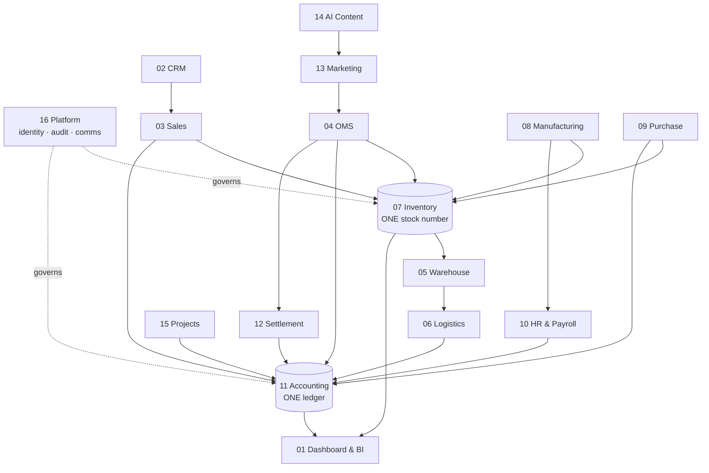

Everything funnels into **one stock number** and **one ledger**. That is what makes the
dashboard true and every current app false — today each keeps its own copy.

**The one law:** every figure traces to a record, every record traces to the document that
created it. No screen keeps its own counter.

---

# C · THE MODULES

---
## MODULE 01 · DASHBOARD & BI
*See the whole business without asking anyone*

**What it is.** Every number rolls up here as work happens — no exports, no month-end wait, no
asking three people for their sheet.

**Apps — 4** (3 built)

| # | App | Must do |
|---|---|---|
| 1 | CEO Dashboard | cash, sales, stock, profit, alerts on one screen ✅ built |
| 2 | Report Builder | drag fields into a report, save for the team ✅ built |
| 3 | Group Consolidation | several companies, one set of figures, inter-company removed ✅ built |
| 4 | **Excel Dashboard Builder** | **NEW** — the 9-sheet workbook from 14 source tables |

**Every point it must carry**
- Every number is a **query on the ledger and the stock table** — never a separate counter
- **Every sheet shows Vastrangam / Ethnic Fashion / Adini + one CONSOLIDATED row. No exceptions**
- Consolidated is `=SUM` of the three above it, never a separate calculation
- Group P&L = Σ(3) − inter-company sales − inter-company purchases
- A company with no tax registration of its own still belongs in the group figures
- 9 dashboard sheets: Index · Financial Summary · HR · Purchase · Sales · Inventory &
  Production · GST · Expenses
- 14 source tables; FY auto-detected from the data, never hardcoded; zero hardcoded values
- 5 role dashboards: Admin · Manager · Staff · Karigar · Customer
- Refresh under 10s; stock query under 500ms

**Reads** every module · **Writes** nothing

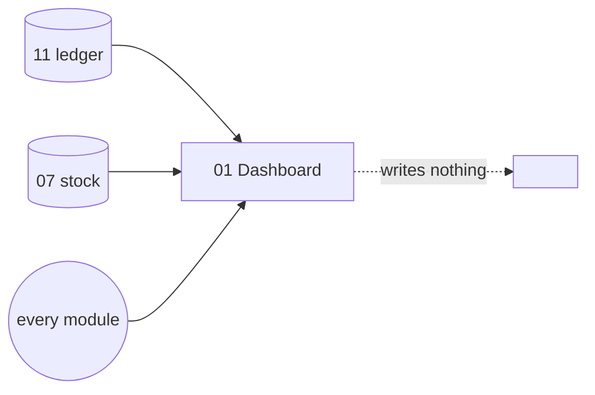

**Done when** every figure on every screen can be clicked down to the ledger entry or stock
movement behind it, and the three companies plus consolidated appear on every sheet.

---
## MODULE 02 · CRM
*Know every customer completely — and answer them fast*

**What it is.** One record per customer carrying every lead, order, return, document and
conversation, whichever channel it came from.

**Apps — 4** (3 built)

| # | App | Must do |
|---|---|---|
| 1 | CRM & Customer 360 | lead to won, then the full lifetime ✅ built |
| 2 | Documents & eSign | filed against the record, not a folder; signed copy files itself back ✅ built |
| 3 | Helpdesk & Live Chat | chat/email/phone become tickets tied to the order ✅ built |
| 4 | **Forms & Feedback (NPS)** | **NEW** — post-delivery NPS feeding design analytics |

**Every point it must carry**
- Pipeline, locked: **Lead → Qualified → Quoted → Negotiation → Won → Lost**; advance stops at
  Negotiation because Won/Lost are explicit decisions
- Sources, locked: IndiaMART · Website · WhatsApp · Walk-in · Forum
- Follow-up when an open lead is untouched ≥7 days; Won/Lost never follow up
- Win rate = won / (won + lost), null when there are no decisions
- Lifecycle by order count: **New ≥1 · Repeat ≥2 · Loyal ≥4 · VIP ≥7**; 90 days idle → Lapsed
- Triggers: VIP welcome exactly at the 7th order · win-back when a Loyal/VIP goes 90 days idle
  (a lapsed New gets none) · review request 3 days after first delivery
- D2C + B2B + export + walk-in + WhatsApp merge to one customer by mobile and email
- Marketplace customers stay separate — panels share no PII — but are tied by pattern
- **NPS answers attach to the design**, so you learn which designs draw complaints

**Reads** every module · **Writes** Sales · OMS · Marketing

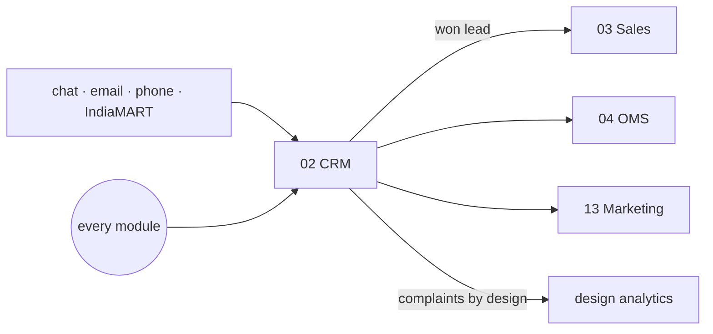

**Done when** one customer's whole history — every channel — is on one screen, and a 7th order
fires the VIP trigger by itself.

---
## MODULE 03 · SALES
*Every way you sell, one order book — to the doorstep*

**What it is.** Counter, wholesale, export and your own website write to the same order and
draw on the same stock number. A sale is finished when it is delivered and the COD money is in.

**Apps — 7** (5 built)

| # | App | Must do |
|---|---|---|
| 1 | D2C Sales | Shopify/Woo/custom, cart to dispatch, loyalty, partial COD ✅ built |
| 2 | B2B & Credit | credit limits, tier pricing, ageing ✅ built |
| 3 | Export | commercial invoice, packing list, LUT, IGST refund ✅ built |
| 4 | POS | counter billing on the same stock as the website ✅ built |
| 5 | Quotes & Proforma | quote → confirmed order in one click ✅ built |
| 6 | Couriers & AWB | book on the order, compare couriers, print, follow to the door |
| 7 | **Subscriptions** | **NEW** — recurring/festive boxes, auto-invoice, dunning |

**Every point it must carry**
- Shopify webhooks: order created → reserve stock → invoice → fulfilment; paid → picklist;
  cancelled → release stock. Inventory pushed **to** Shopify every 15 min so it never oversells
- Three shopping modes: Shop · Swipe/Lookbook · Customisation (upload reference, negotiate,
  50% advance, becomes a production order)
- **Partial COD:** ₹99 default advance on Razorpay, balance collected at the door, remitted by
  the courier, **both legs auto-reconciled to one invoice**
- Loyalty: ₹100 spent = 1 point, 6-month expiry; tiers New 10% · Regular 3+ 15% · Loyal 7+ 20%
- B2B tiers: Silver <₹2L · Gold ₹2L–10L · Platinum ₹10L+, setting discount and terms
- Credit checked before acceptance; reminders −3 days, +1 day, **+7 days soft block** with
  override
- Export: FOB/CIF/EXW, LUT bond, shipping bill, FIRA, IGST refund tracking, **FX variance
  posted to FX gain/loss**; INR/USD/EUR/GBP/MYR at RBI daily rates
- Quote numbering `Q-{FY}-####`, proforma `PI-{FY}-####`; export/LUT lines are 0% GST
- Delivery date is **derived** — cut-off + transit from the warehouse that actually has stock —
  never typed. An order no warehouse can serve gets **no date at all**

**Reads** Inventory · CRM · Warehouse · Logistics · **Writes** Inventory · Accounting ·
Warehouse · Logistics

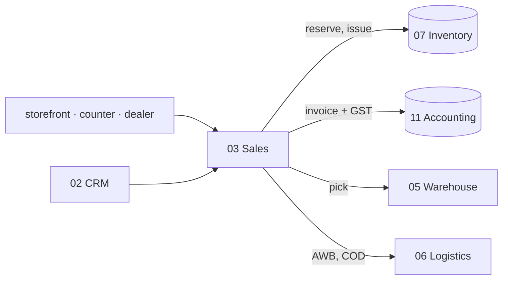

**Done when** an order placed on Shopify appears within 60s with stock reserved and an invoice
raised, and a partial-COD order reconciles both legs by itself.

---
## MODULE 04 · E-COMMERCE / OMS
*Every marketplace and your own website, one queue*

**What it is.** Seven seller panels and your own store in one pipeline, one stock number going
back out to all of them — and the money side closing in the same module.

**Apps — 9** (2 built)

| # | App | Must do |
|---|---|---|
| 1 | Marketplace OMS | one queue, real channel stages, per-channel cut-offs ✅ built |
| 2 | Order Management | new → delivered whatever the source ✅ built |
| 3 | Manual Data Check | upload the sheets you already download, 10 cross-checks back |
| 4 | Reconciliation | payout matched to the order line that earned it |
| 5 | Claims & Disputes | shortfalls, weight disputes, lost parcels — filed with evidence |
| 6 | Returns / RMA | customer, courier, wrong — and the dead stock they cost |
| 7 | Channels & Storefronts | connect once, stays in step; switchable without touching data |
| 8 | Labels & Documents | crop, own code large, invoice merged, batch print |
| 9 | **Listing & Catalog Manager** | **NEW** — bulk push, detect listed-but-out-of-stock |

**Every point it must carry**
- Channels: Amazon · Flipkart · Myntra · Meesho · Ajio · **Nykaa · JioMart** + Shopify ·
  WooCommerce · Magento · Wix · custom
- Orders pulled every 15 min, **idempotent by external ID**, raw JSON stored before normalising
- **Queue sorts by time remaining, not time received** — Amazon gives 12 hours, Ajio 48
- Day grouped by product so an item is picked once, not once per parcel
- Commission is **read from the settlement file, never assumed**
- Return costs: **customer ₹20 · courier ₹5 · wrong = full selling price, dead stock, never
  restocked**; a repeat pattern is flagged as marketplace abuse
- Price parity checked across all panels — a leftover festival discount buries your listings
- Labels **never uploaded to an outside website** to be cropped
- A channel's own downloaded report is a first-class input where there is no API
- A trading name a channel knows you by is a label on the channel, **not a second company**
- Stock reserved on pull, auto-released after 48h

**Reads** Inventory · CRM · Sales · Accounting · Logistics · Settlement ·
**Writes** Inventory · Accounting · Warehouse · Logistics · Settlement

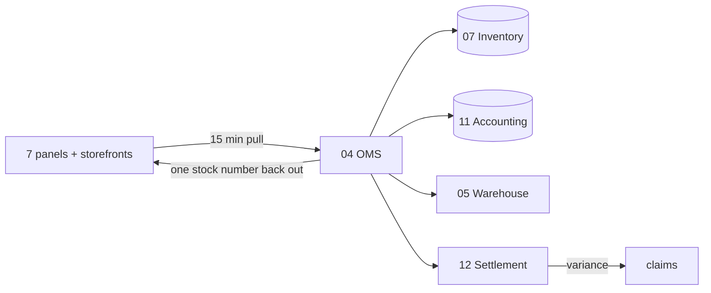

**Done when** a full week runs with every channel live, settlements reconciled, and no panel
oversells.

---
## MODULE 05 · WAREHOUSE
*Pick right the first time — and prove what you sent*

**Apps — 3** (0 built)

| # | App | Must do |
|---|---|---|
| 1 | Picking & Bins | pick lists naming the bin, in walking order |
| 2 | Barcode Operations | scan to pick, pack, dispatch and stock-count from a phone |
| 3 | Packing Video | every parcel filmed, indexed by order number |

**Every point it must carry**
- Bin-level instructions so a picker is never sent to an empty rack
- The same scan whatever the channel — marketplace, storefront or counter
- Physical stock count from the phone, posting movements live
- **Footage attaches itself to the claim that needs it** — a wrong-item dispute is answered
  with the clip, not with memory
- Every scan writes a stock movement; nothing moves without a row

**Reads** Sales · OMS · Inventory · **Writes** Inventory · Sales · OMS

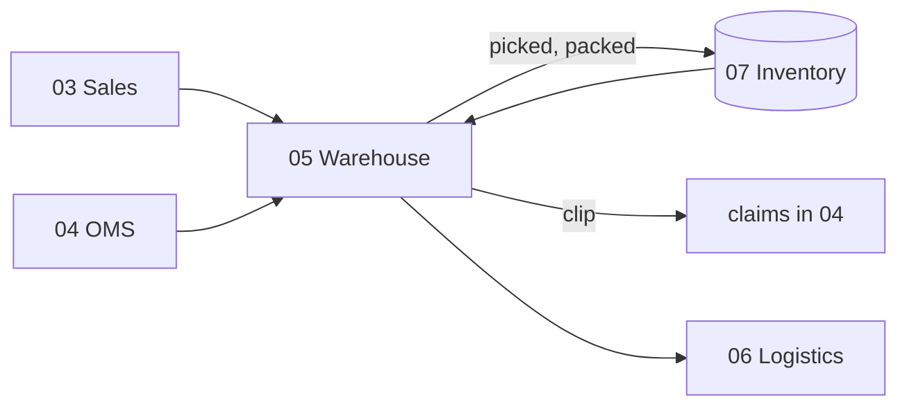

**Done when** a parcel is picked from the right bin, filmed, and its clip is already attached
when the claim arrives.

---
## MODULE 06 · LOGISTICS
*The courier network — rates, failures and the COD money*

**Apps — 4 (+1 optional)** (0 built)

| # | App | Must do |
|---|---|---|
| 1 | Rates & Zones | every courier's card by zone, weight slab and service |
| 2 | NDR & RTO Rescue | work a failed delivery while it can still be saved |
| 3 | COD Remittance | collected at the door vs reached the bank, parcel by parcel |
| 4 | Handover & Manifest | expected out vs actually taken, with a one-time code |
| 5 | **Fleet** *(optional)* | **NEW** — own vans: fuel, maintenance, trip costing |

**Every point it must carry**
- Cheapest **and** fastest option known before booking, not after
- NDR: auto WhatsApp/call to reconfirm the address → reattempt or cancel, **before** it becomes
  a return you pay for twice; RTO analytics by pincode and courier
- COD: every shortfall named and aged; the second leg of a partial COD reconciled here
- Manifest: a signed record of parcels left behind, **so a parcel lost between your table and
  their van has an owner**
- Freight posts to the ledger; export courier costs separated

**Reads** Sales · OMS · Warehouse · **Writes** Accounting · Sales · OMS

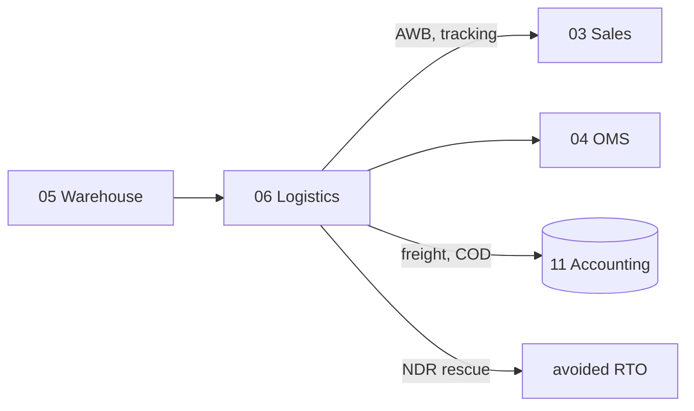

**Done when** COD collected reconciles to COD banked parcel by parcel, and an NDR is worked
before it turns into an RTO.

---
## MODULE 07 · INVENTORY & CATALOG
*One number everyone trusts*

**What it is.** The most important number in the system — one quantity per SKU, per location,
per stage, read and written by every other module.

**Apps — 4** (0 built)

| # | App | Must do |
|---|---|---|
| 1 | Stock | live quantity by SKU × location × stage, reorder, batches, dead stock |
| 2 | Catalog / PIM | one product record every channel lists from |
| 3 | **Kit & Combo SKU** | **NEW** — a set sold as one listing decrements each component |
| 4 | **Master-Data Hygiene** | **NEW** — fuzzy duplicate detect and merge |

**Every point it must carry**
- **One stock number, event-driven — not per channel.** The last piece sold on Amazon leaves
  Flipkart in the same instant, not three hours later as a cancellation, because cancellations
  are what account ratings are lost to
- Stages: raw → cut → stitched → thread-cut → QC passed → ironed → packed → dispatched
- **Movements are the ledger; quantities are the running balance.** Every transition is a row
- 4-level SKU: **Brand → Design → Style-Variant → SKU**, `{BRAND}-{DESIGN}-{COLOR}-{SIZE}`.
  The string is **derived**; search and analytics use the structured fields, never substrings
- Closing = Opening + Net Purchase + Production (Set + Unset + Job Work) − Net Sales
- **Wrong returns are dead stock — never added back**, held in their own register
- Valuation method explicit: FIFO / weighted average / specific cost — it sets the balance
  sheet, and stock value must equal the balance-sheet figure
- Multi-UOM: fabric bought in kg, sold as pieces, converted through the BOM
- Consignment stock in a channel's warehouse is a location like any other — counted, valued
  and aged, not invisible until it sells
- Dead stock: not moved 60+ days, ranked by tied-up capital
- Catalog holds **the code each channel knows this product by**, and the **packed size and
  weight** that decide the courier rate and settle every weight dispute
- Listing state per channel — live, awaiting approval, blocked, archived — with a quality score
- Status flags: 🟢 ≥10% of opening · 🟡 <10% · 🔴 negative · ⚫ dead stock

**Reads** every module · **Writes** every module

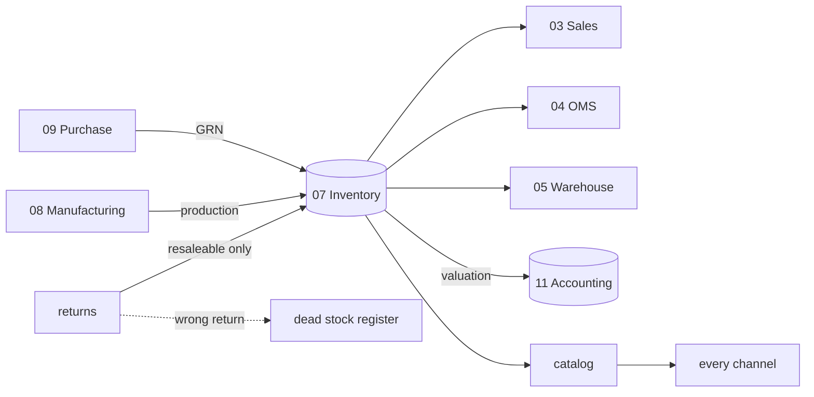

**Done when** stock is one number across every channel, a kit sale decrements all components,
and stock valuation equals the balance sheet.

---
## MODULE 08 · MANUFACTURING
*Know what a unit really costs to make*

**Apps — 6** (0 built)

| # | App | Must do |
|---|---|---|
| 1 | PLM & Development | idea → spec → sample rounds → costed trial → sign-off, versioned |
| 2 | Production Orders | your own stages, WIP visible at each |
| 3 | Piece-rate & Contractors | pooled completion, per-unit rates, rework, advances |
| 4 | BOM & Consumption | what each product consumes, at today's rates |
| 5 | Quality Control | accept / reject / rework, reasons feeding the supplier scorecard |
| 6 | Maintenance | machines and tools: due, last done, cost, downtime |

**Every point it must carry**
- 10 stages: purchase · material check · sampling/3P · pattern+cutting · stitching · thread cut
  · QC · iron · packing · dispatch
- Four production modes: self · full job work · partial job work · mixed
- BOM versioned; sample BOMs separate from bulk (different wastage %)
- 7 named third-party services: embroidery · digital print · foil · hand dyeing · handwork ·
  full stitching · partial stitching
- **Performance flags:** same person + same design + same task + similar qty → hours >
  previous × 1.2 → flag → WhatsApp asks why → 5 preset reasons auto-approve, custom needs admin

**Karigar costing — locked, and already implemented and tested**
- **23 garment columns → 13 set types**
- **Pool across ALL karigars per design first**, then apply the set formula
- **Sets = min across the populated member columns.** Lehenga Choli = MIN(Blouse, Lehenga,
  Dupatta) when Dupatta > 0, else MIN(Blouse, Lehenga). Anarkali-only → MIN(Anarkali, Dupatta),
  or Anarkali alone
- **Extras named** — Extra Anarkali, Extra Plazo — never a generic bucket. **No "Total Pieces
  (Set + Extra)" column anywhere**, explicitly rejected
- **Cost is per raw piece, independent of set completion** — a surplus piece still gets paid
- Set type from the Rates Master; inferred only as a fallback, in the order Lehenga → Anarkali
  → Kurti Palazzo → Kurti Plazo → Co-Ords → single-column, **and flagged as inferred**
- Missing rate → **₹0 and a flag, never a guess**
- Alter earnings: `+ admin-assigned alter hours × ₹100`; **own-mistake alterations = ₹0**
- Material: consumed = avg per piece × pieces produced; missing rate → N/A, never 0; three
  views (line, design, material) must agree or the output is marked untrustworthy

**Acceptance gate (§16A):** 143 designs · 29 karigar units · **25,307 sets · 59,110 pieces ·
₹26,90,062** · 5 no-rate designs flagged. A mismatch is a bug, not a new answer.

**Reads** Sales · Purchase · Inventory · **Writes** Inventory · HR & Payroll · Accounting

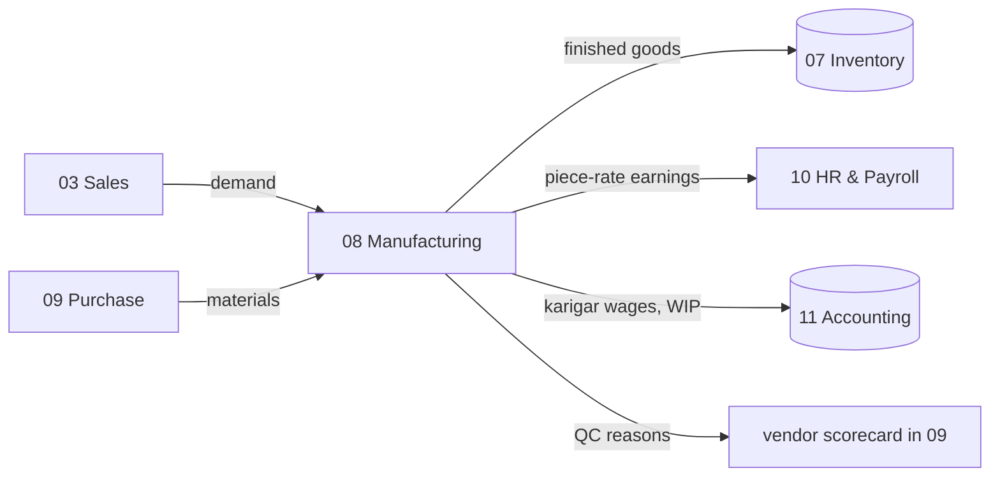

**Done when** three production orders run to completion — self, full job work, partial — and
the §16A totals reproduce exactly.

---
## MODULE 09 · PURCHASE
*Nothing over-billed gets paid*

**Apps — 2** (2 built ✅)

| # | App | Must do |
|---|---|---|
| 1 | Procurement | RFQ → PO → GRN with a strict three-way match ✅ built |
| 2 | Vendor Management | vendor 360, payables, ageing, risk score ✅ built |

**Every point it must carry**
- Low stock triggers a requisition draft; admin converts to PO; system suggests the
  **priority-1 vendor with their last rate**
- Vendor escalation P1 → P2 → P3 on no response
- Last-rate auto-suggest: most recent PO rate for that vendor and material, else that vendor's
  most recent any-material rate, else null
- **3-way match locked: invoice must equal received qty × PO rate.** Flags — GRN qty ≠ PO qty ·
  invoice ≠ grnQty × rate · invoice entered before GRN
- PO number `PO-{FY}-####`; status DRAFT → SENT → GRN → MATCHED | MISMATCH
- Hygiene flags: a material with no priority-1 vendor; two vendors sharing priority-1
- Scorecard auto-computed per transaction: quality % · on-time % · rate vs market

**Reads** Inventory · Manufacturing · **Writes** Inventory · Accounting · Quality Control

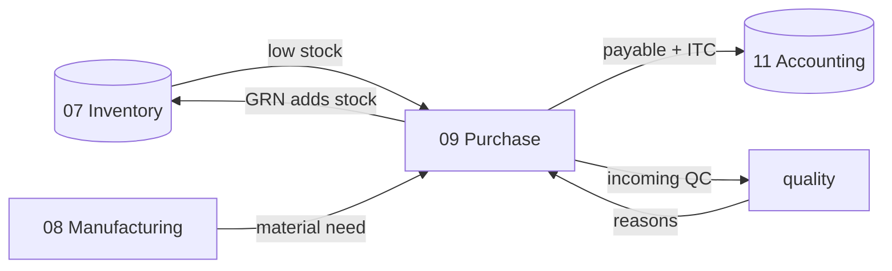

**Done when** a vendor invoice for more than was received is blocked before payment.

---
## MODULE 10 · HR & PAYROLL
*Pay people right, on time*

**Apps — 3** (0 built)

| # | App | Must do |
|---|---|---|
| 1 | Staff & Contractors | attendance, effective-dated salary, output earnings, one register |
| 2 | Time-off & Advances | leave, festival advances, and what they do to this month |
| 3 | Appraisal & Hiring | reviews, and a pipeline ending in an employee record (ATS) |

**Every point it must carry — these are FINAL, from the Combined Master Prompt**
- Attendance codes **P · H · A · HL · OD · PL · UL**; blank = Absent. Pay multipliers
  {P 1 · H 0.5 · A 0 · HL 1 · OD 1 · PL 1 · UL 0}
- **Days-Equivalent = Present + Holiday + 0.5 × Half-days.** A holiday pays as a full present day
- **Daily Rate = resolved monthly salary ÷ resolved threshold DAYS**, both looked up for that
  specific month from the effective-dated logs
- Earning = Daily Rate × Days-Equivalent, **uncapped both ways** — 30 days against a 27-day
  threshold pays 30
- **Flat basis** — full salary every month regardless of attendance
- **Piece-rate basis** — no salary, no threshold, no attendance row; wage = Work Report hours ×
  flat ₹/hr (₹100)
- Threshold days 28 (26P+4H), moving to 27 (26P+2H) for two men from Nov 2025
- Hours are **reference only**: male 10h weekday / 5h Sunday, female 8h / 5.5h. Threshold hours
  are a **legacy column that drives nothing**
- Blended FY Hourly Rate = blended daily rate ÷ that person's weekday shift, averaged over
  **months actually employed**
- Effective-dated salary: editing from one screen with an effective-from date auto-closes the
  prior period; past months keep their old rate; a future raise activates itself
- Three-state month: Not employed / **No Data** / real month. A blank month is a tracking gap,
  never "Below Average"
- Geofence 50 m, 15-minute buffer, late flags, admin override; EOD wizard
- Festival leave from a religion-based calendar; universal Diwali shutdown 4–5 days
- Advances deducted at payout; net may go negative and is flagged
- Staff are **Active / On Leave / Inactive — never deleted**

**Reads** Manufacturing · **Writes** Accounting

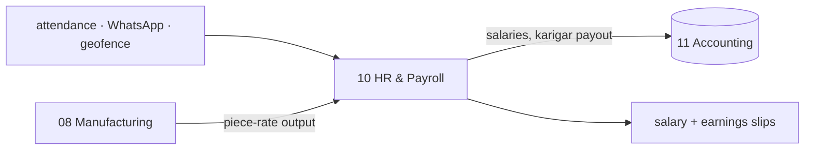

**Done when** a full month's payroll runs end to end with zero manual touch and reconciles to
your own figures.

---
## MODULE 11 · ACCOUNTING & GST
*Books that always balance*

**What it is.** A full double-entry ledger built for Indian compliance. **Medhava keeps the
books on its own — no other accounting package is required, ever.** Tally, BUSY and Zoho stay
as connectors for people who already run one; **no figure is ever sourced from them.**

**Apps — 9** (0 built) — *the largest module, and 5 in `modules.js` was wrong*

| # | App | Must do |
|---|---|---|
| 1 | Accounting | chart of accounts, 9 voucher types, **one posting engine** |
| 2 | Invoicing | GST invoices to the paise, templates, round-off, e-invoice IRN |
| 3 | Expenses | category capture, approvals, bill OCR |
| 4 | GST & Tax | CGST/SGST/IGST, TDS, TCS, GSTR-1/3B/9 per registration |
| 5 | **ITC Reconciliation** | **NEW** — GSTR-2A/2B matching |
| 6 | **Receivables, Payables & PDC** | **NEW** — bill-wise allocation, post-dated cheques |
| 7 | **Fixed Assets & Depreciation** | **NEW** — SLM *and* WDV |
| 8 | **Year-End Close & Period Lock** | **NEW** — carry-forward, locking |
| 9 | Finance Reports | P&L, balance sheet, profit by channel/product/SKU, MIS, ratios |

**Every point it must carry**
- **One posting engine.** Every voucher writes the ledger through it — *"this is where most
  home-built accounting tools break"*
- 9 voucher types: Sales · Purchase · Credit Note · Debit Note · Payment · Receipt · Journal ·
  Contra · POS. Credit/debit notes **must** reference the original invoice
- CGST+SGST vs IGST **auto-determined by comparing the two GSTINs' state codes** — never chosen
  by hand
- Rates default from HSN, overridable per line; **tax rates versioned by effective date** so old
  invoices stay correct
- RCM flag; **ITC-eligibility flag per purchase line** — some GST paid is not claimable
- **ITC reconciliation against GSTR-2A/2B** — without it, GSTR-3B is a guess
- **Bill-wise allocation** — a payment settles named invoices (FIFO or chosen), partial
  settlement, true per-invoice balance
- **Post-dated cheques** — a register posting on the realisation date, not the cheque date
- **Fixed assets — SLM and WDV both**, because book and tax depreciation differ; disposal P&L
- **Year-end close** — P&L resets, balance-sheet accounts carry forward, years stay separable
- **Period locking** — no backdated edit without an admin unlock, **and the unlock is logged**
- **Round-off posts to its own ledger** — never absorbed into the sale, which corrupts the GST
- TDS by section (194C, 194J…), Form 26Q, Form 16A; TCS on marketplace settlements
- Bank reconciliation by amount + date + reference; unmatched queued
- The 11 core reports: Day Book · Ledger with running balance · Trial Balance · P&L · Balance
  Sheet · Ageing both sides · Cash Flow · GST · TDS/TCS · **Stock valuation tying to the
  balance sheet** · BRS
- Ratios, Budget vs Actual, cost-centre P&L
- **The MCA audit trail** — every edit, old and new value, **cannot be disabled**, 8 years
- P&L structure is locked and reproduced exactly as specified

**Reads** every module · **Writes** Finance Reports

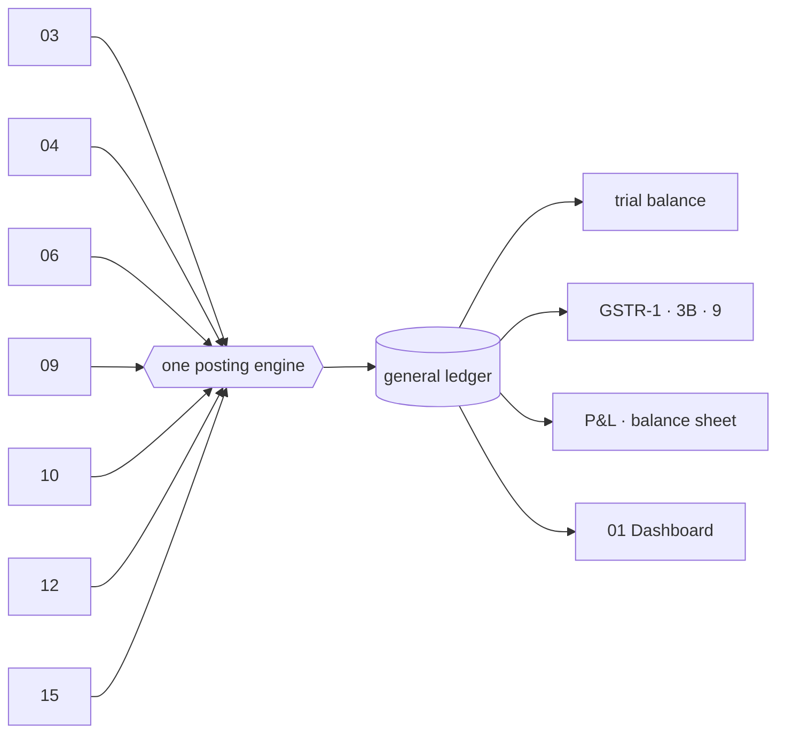

**Internal build order, prescribed by the specification itself:** posting engine first · audit
trail wrapping every write from day one · Sales and Purchase Invoice verified against Trial
Balance · the other seven vouchers · year-end and period locking · **GST returns and 2A/2B
last**.

**Done when** one month of books closes cleanly and GSTR-1 + GSTR-3B generate and verify.

---
## MODULE 12 · SETTLEMENT
*Get paid what you are owed — cycle by cycle*

**Apps — 3** (0 built)

| # | App | Must do |
|---|---|---|
| 1 | Payout Cycles | what should land, what did, on which day — late is visible the day it is late |
| 2 | Fee & Commission Audit | published rate card vs rate actually charged, by category and SKU |
| 3 | TCS & TDS Register | every rupee deducted, matched against the portal's own figures |

**Every point it must carry**
- Portal **auto-detected from the file shape** — Amazon, Flipkart, Myntra, Meesho, Ajio, Nykaa
- Expected = SP − commission − TCS − GST; **flag variance > ₹1 or > 0.5%**
- **Commission never assumed** — read from the actual settlement file, invoice by invoice
- Variance categories: commission overcharged · TCS miscalculated · SPF higher than agreed ·
  unbilled returns · **weight discrepancy · lost in transit**
- One-click dispute with an evidence pack; **a claim awaiting your response is worth money, one
  closed for no response is worth nothing** — so days remaining sit next to the amount
- **A silent commission increase is caught the first time it is applied**; the tier you are
  rated in is on the same screen, because losing a tier quietly costs more than any deduction
- Per-order and per-SKU P&L, 20 columns, profit after every fee
- Reconciled lines post to books with channel-specific GL splits
- **Acceptance gate: ≥98% settlement match; SKU profit within ₹10 of your records**

**Reads** OMS · Accounting · **Writes** Accounting

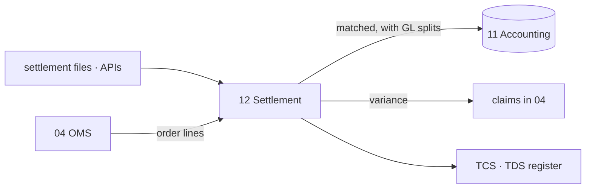

**Done when** a real settlement file reconciles ≥98% and the variances it finds are ones you
agree are real.

---
## MODULE 13 · MARKETING
*Sell more without discounting*

**Apps — 6** (0 built)

| # | App | Must do |
|---|---|---|
| 1 | Social Calendar | plan and publish across every channel from one calendar |
| 2 | Campaigns | email, SMS, WhatsApp measured on **real revenue, not opens** |
| 3 | Repricing Engine | floor, ceiling, match-lowest, festival overrides — and what each did |
| 4 | Automation | if this happens, do that — across any module, without code |
| 5 | Blog & Pages | articles and landing pages straight to your own site, meta set |
| 6 | **Events** | **NEW** — Surat expos: booth, budget, leads → CRM |

**Every point it must carry**
- Calendar across 7 platforms; each card carries pillar, format, copy, hashtags, asset, music
  brief and an AI-generated flag
- Campaign spend pulled from the ad platforms; **ROAS computed on revenue**
- **A price that went up and took the orders down with it shows as exactly that, next to the
  rule that raised it** — so the rule is reversed on evidence, not on a feeling
- Every price change audited; repricing never breaks the single stock number
- Automation recipes seeded: stock below reorder → draft PO to the priority-1 vendor + WhatsApp
  the admin; B2B invoice 3 days from due → reminder
- Influencer CRM with collaboration history and payment timeline
- Asset library tagged by mood, occasion and colour, with an approved-for-use flag

**Reads** Inventory · CRM · **Writes** Sales · OMS

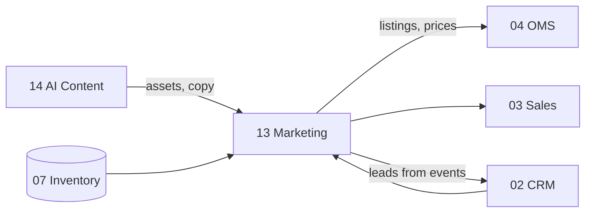

**Done when** a month of content publishes on schedule and a repricing rule can be judged on
what it did to orders.

---
## MODULE 14 · AI CONTENT ENGINE
*Write it, shoot it, cut it — from the catalogue you already have*

**Apps — 5** (0 built on the core; substantial work exists standalone)

| # | App | Must do |
|---|---|---|
| 1 | Content Engine | 14 stages in your own voice, from research to alt text |
| 2 | Image Studio | layers, free transform, background removal, channel presets, alt text |
| 3 | Video Studio | text and image to video, reels and ad cuts per channel |
| 4 | Design Studio | templates, layers, undo/redo, exact sizing, PNG/JPG/PDF export |
| 5 | Publisher | one push everywhere, reporting what went live and what was rejected |

**Every point it must carry**
- **The one law of content:** structured data (CSV, titles, attributes) gets keywords; anything
  a human reads gets feelings. Product nouns banned from creative surfaces, banned outright
  from song lyrics
- Self-improving loop: draft → 12-point self-critique → rewrite, with session voice memory
- Songwriting Mukhda → Antara → Mukhda, Hinglish, emotion not product, original lines
- Image Studio: all website-size presets incl. circle, auto-fit crop-fill, AI background and
  erase, Ctrl+T transform, layers, quality-first export, white background for marketplaces
- Design Studio: full design surface with elements, alignment, any-colour picker
- **Generation Studio stays badged a mockup until a paid API is wired — never presented as live**
- The Canva/Photoshop blueprint sets the depth: rendering engine split (Canvas 2D for layout,
  WebGL for pixels), command-pattern undo storing deltas, autosave as non-negotiable, video
  rendered server-side never in-browser. Its own estimate is **12–20 months for full parity**,
  so this module **ships in labelled stages**

**Reads** Inventory · **Writes** Marketing · OMS

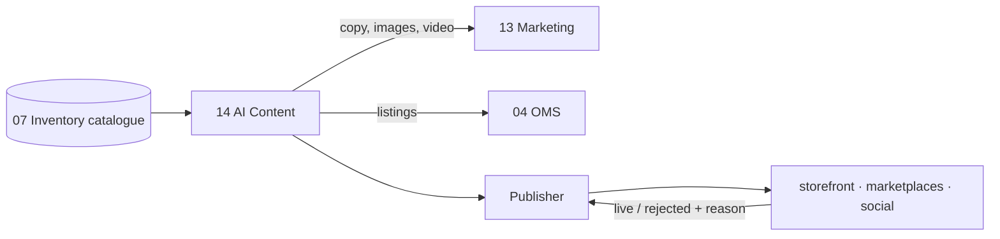

**Done when** a listing generates for one design across six platforms in under 20 seconds and
publishes, with rejections reported and explained.

---
## MODULE 15 · PROJECTS & COLLABORATION
*The work that is not an order — and the talking around it*

**Apps — 6** (0 built)

| # | App | Must do |
|---|---|---|
| 1 | Projects & Cases | stages you define, owners, deadlines, documents, billable time, real cost |
| 2 | Timesheets & Planning | who is on what, hours in, billable separated from not |
| 3 | Approvals | one queue for everything waiting on a yes, with the rule that sent it |
| 4 | Forum | questions and answers that outlive a chat |
| 5 | Discuss | conversation attached to the record it is about |
| 6 | **Knowledge Base** | **NEW** — cutting SOP, QC checklist, packing standard, playbooks |

**Every point it must carry**
- A project, case, engagement or job — the same record with different words on it
- Time and cost land **in the ledger**, not in somebody's inbox
- A rate card turns straight into an invoice and a real cost
- Every approval decision goes to the audit record
- **A year later the reason for a decision is still sitting next to the decision**
- Knowledge base is role-scoped and searchable

**Reads** CRM · Sales · HR · Inventory · **Writes** Accounting · HR · CRM

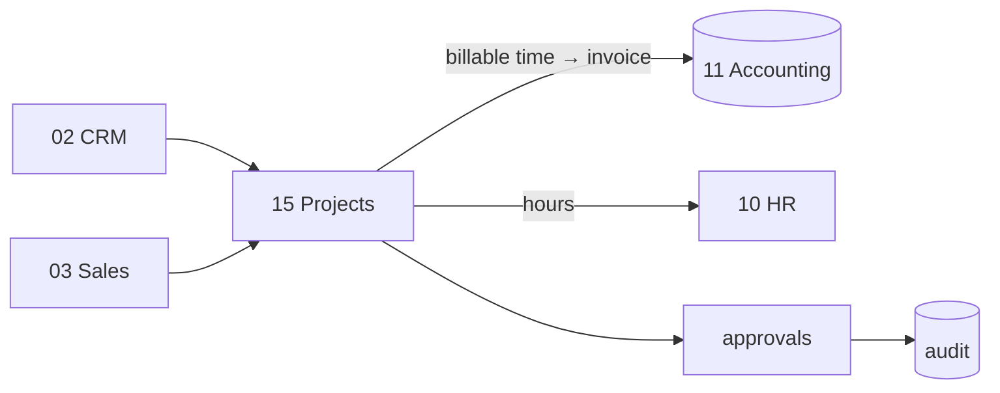

**Done when** billable time on a case becomes an invoice and a cost without being re-keyed.

---
## MODULE 16 · PLATFORM
*The spine every module runs on*

**What it is.** Not a module you open — the layer underneath all the others.

**Apps — 3** (1 built)

| # | App | Must do |
|---|---|---|
| 1 | Identity, Settings & Audit | users, roles, permissions, company switching, tax setup, **an immutable record of everything that ever happened** |
| 2 | Ask & Print | ask from your phone; back as a PDF or on the office printer |
| 3 | **Communications** | **NEW** — WhatsApp commands, broadcasts, email, SMS, notifications |

**Every point it must carry**
- Roles: Admin · Manager · Staff · Karigar · Customer, with the permission matrix
- **Per-company per-role** — Praveen and Vishal see all three; staff can be scoped to one
- Company switcher, default Vastrangam; **read-only Group view**
- Company ≠ brand ≠ prefix: Ethnic Fashion / Go4Fashion / EF / GF are separate fields
- Staff lifecycle Active / On Leave / Inactive — **no data is ever deleted**
- **Audit trail that cannot be switched off** — MCA rule, 8 years, before and after values
- Provider config: every capability has **3+ interchangeable vendors**, switchable in a click.
  A vendor name on the Connectors screen is the promise working; the same name as the **source
  of a figure** is a bug
- Environment variables encrypted; integration health green/red with last sync and error count
- WhatsApp commands `IN` `OUT` `LEAVE` `ADVANCE` `REPORT` `Print Invoice` `Print Barcode`
- 5 scheduled jobs: 8am schedules · 7pm stock summary · 8pm EOD reminder · B2B due reminders ·
  1st-of-month payroll
- Broadcast safety: official API only, 200/day warm-up, mandatory STOP keyword, time windows
- **This app will never ask for a marketplace, bank or account password**

**Reads** every module · **Writes** every module

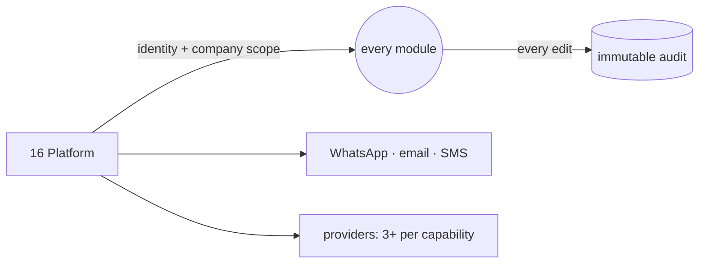

**Done when** a karigar sees only their own earnings, an admin switches all three companies and
the figures change, and every edit made during the test is in the audit browser.

---

# D · THE ORDER TO BUILD THEM IN

**Straight down the list: 01, 02, 03 … 16.** No reordering. You said module 1 to the last
module, numbered 1, 2, 3 — that is the order.

The only thing that comes before Module 01 is the **Foundation** — the shared database, the
audit trail and the cascade bus. It is not a numbered module; it is the ground all sixteen
stand on, so it is laid once and then never touched as a "module" again.

| Order | Module | Apps | Built | To build |
|---|---|---|---|---|
| **Foundation** | shared core: one database · audit · cascades | — | parked | wire it in |
| **01** | Dashboard & BI | 4 | 3 | Excel Dashboard Builder |
| **02** | CRM | 4 | 3 | Forms & Feedback (NPS) |
| **03** | Sales | 7 | 5 | Couriers & AWB · Subscriptions |
| **04** | E-commerce / OMS | 9 | 2 | 7 apps |
| **05** | Warehouse | 3 | 0 | 3 apps |
| **06** | Logistics | 4 (+1) | 0 | 4 apps (+ Fleet) |
| **07** | Inventory & Catalog | 4 | 0 | 4 apps |
| **08** | Manufacturing | 6 | 0 | 6 apps |
| **09** | Purchase | 2 | 2 | rewire onto the core |
| **10** | HR & Payroll | 3 | 0 | 3 apps |
| **11** | Accounting & GST | 9 | 0 | 9 apps |
| **12** | Settlement | 3 | 0 | 3 apps |
| **13** | Marketing | 6 | 0 | 6 apps |
| **14** | AI Content Engine | 5 | 0 | 5 apps |
| **15** | Projects & Collaboration | 6 | 0 | 6 apps |
| **16** | Platform | 3 | 1 | Identity/Audit · Communications |

**One honest note, not a request to reorder.** Some modules read data that a later-numbered
module writes — Module 01's dashboard reads the ledger that Module 11 fills. Built in order,
each module is finished against the data that exists when its turn comes and grows richer as
later modules land: Module 01 shows what is real on the day it is built, and the same screen
shows more the day Module 11 is done. Nothing waits, nothing is faked, and the order stays
1 → 16.

**Start with the Foundation, then MODULE 01.**

---

# E · THE STANDARD EVERY MODULE MUST MEET

A module is **done** only when all eight hold. This is written down so it cannot be quietly
softened later.

1. Every app built, not stubbed
2. Reads and writes the shared core — no private store
3. Every cascade it declares actually fires, proved by a test
4. Figures reconcile to your own records (§16A where targets exist)
5. Real headless-browser run: every screen, every action, **zero console errors**
6. Both editions build — Medhava (industry-neutral) and Vastrangam
7. Manual, PDF and screenshots generated
8. Labelled honestly: **tool / stub / mockup / spec**

**The end-to-end proof, re-run at every module boundary:** sell one garment on a marketplace
and follow it — order in OMS, stock down in Inventory, pick list in Warehouse, AWB in
Logistics, revenue and GST in Accounting, payout matched in Settlement, karigar paid in
Manufacturing, all of it on the dashboard. One transaction, eight modules, one database.

```
node core/tests/cascades.js       every declared cascade fires
node core/tests/acceptance.js     the §16A known-good totals
node brand/suite/deep/audit.js    structural audit
node brand/suite/deep/verify_mNN  real browser, zero errors
python3 engine/tests/selftest.py  the karigar/staff oracle stays green
```

---

# F · WHAT EXISTS, AND WHAT I STILL OWE YOU

| | Count | What happens |
|---|---|---|
| Deep apps (01, 02, 03, 04, 09, 16) | 16 | rewired onto the core when their module's turn comes in the 01→16 pass |
| Shallow demos in `brand/suite/out/` | 16 | superseded module by module, never deleted before their replacement is verified |
| Karigar/staff engine (Python, 251 tests) | — | ported when Module 08 and 10 come up, Python kept as the checker |
| `core/` foundation code | — | **built but parked** — nothing depends on it |

**Still reading:** 68 images, the Material tool spec, Part III's fuller Power BI text, the
Universal prompt, one `.docx`. Recorded in `SOURCE_REGISTER.md` with line references.

**Files still needed:** `Vastrangam_Master_Excel_Sheet_[FY].xlsx` (14 sheets, contains the
stitching rate master) · `Karigar_Reports_April_2025_to_June_2027.xlsx` (the §16A gate) · the
5 BUSY `.bds` files (opening balances).
