# VASTRANGAM GROUP ERP — PLAN OF ACTION
## One platform. Every function. Wired together.

The build plan for a multi-company operating system covering a Surat ethnic & western fashion
manufacturer running three sister companies — D2C, seven marketplaces, B2B and export on one order
book, one stock number and one ledger.

**21 modules · 104 apps · 16 apps working today · 2 more with their engine running · 86 to build.** Built in dependency order, Module 01
first through Module 21 last. Every module is finished — every app on the shared database, verified
in a browser — before the next begins.

**How to read this.** Part I is the integration layer: the law the whole system obeys, the data core
that makes it one system rather than 21 programs, and the wiring between modules. Part II is the 21
modules one at a time, each with a diagram of how it actually functions. Every section carries a
diagram because the point of this document is that you can see the machine working, not just read a
list of features.

**Honest framing.** Nothing in this document is described as finished unless it is. Each app is
marked **BUILT** (a working file you can open today, carrying its own self-tests), **ENGINE WORKING**
(the arithmetic written and passing its own tests on the command line, with no screen on it yet) or
**SPEC** (designed to this behaviour, not yet written). The count above is the true one: 16 built and
2 engines, of 104. Section A7 gives the two commands that check the engines in about a minute.

---

# PART I — HOW THE SYSTEM WORKS

---

## A0 · THE ONE LAW — INTEGRATION

**A business event is entered once and flows everywhere it belongs.** No module re-enters data
another module already has. No number is maintained separately from the record that created it.

This is the whole design. Everything else in this document serves it.

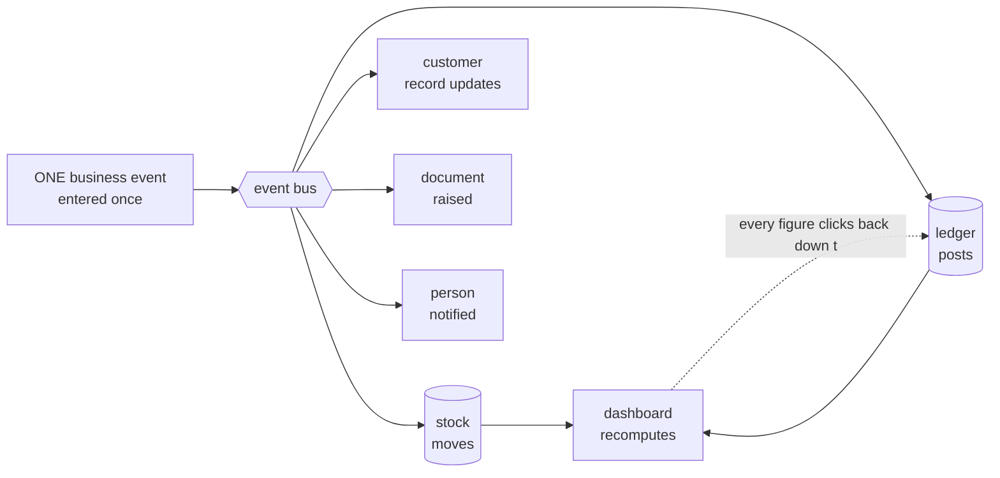

**The test of the law.** Any figure on any screen can be clicked down to the record that produced it,
and that record down to the document that created it. A dashboard number is a live query over the
ledger — never a total someone maintained on the side. If a figure cannot be traced, it is a defect,
not a rounding difference.

### The eight cascades that must fire by themselves

These are the specific chains the platform has to make automatic. If one of them needs a human to
re-key something, the system has failed at the only thing that makes it a system.

| A single action… | …updates every one of these, in one transaction |
|---|---|
| **A sale**, any channel | stock deducted → invoice with GST → ledger (Dr Debtor/Bank, Cr Sales + Output GST) → customer outstanding and lifecycle → settlement expectation → dashboard |
| **A marketplace order pull** | sales order created → stock reserved → pick list → fulfilment → on payout, reconciliation and variance check → books |
| **A settlement import** | each line matched to its order → commission, fees, TCS, TDS to books → variance → claim raised → bank reconciliation → SKU profit → dashboard |
| **A return** | credit note → refund → a wrong return becomes dead stock, never restocked → return cost to P&L → return rate feeds design analytics |
| **A karigar production report** | pooled set completion and piece-rate earnings → finished stock in → payout in HR → Karigar Wages posted → cost per piece → design profit |
| **A material purchase** | PO → GRN → three-way match → raw stock in → vendor payable → input tax credit → landed cost into COGS |
| **A staff attendance mark** | effective-dated salary resolved → payroll → Salaries posted → productivity cost → design cost |
| **A generated image or listing** | asset library → product listing on the storefront and each marketplace → marketing calendar → published → campaign return tracked back |

---

## A1 · THE THREE COMPANIES

The single most common way a multi-company system goes quietly wrong is collapsing three different
ideas into one field. They are kept apart at the root of the database.

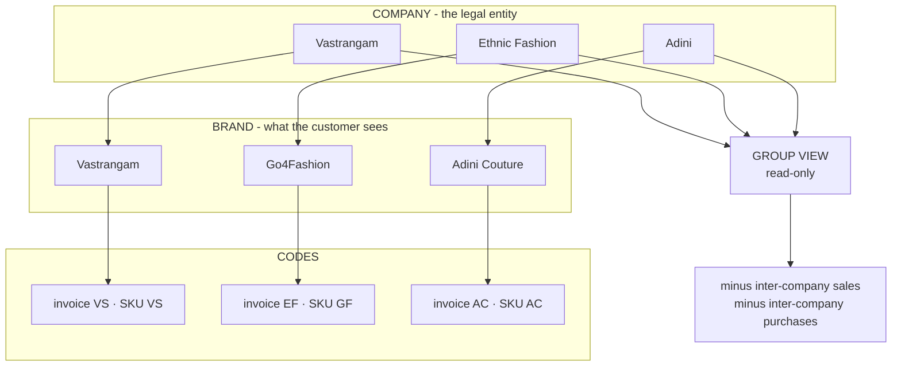

**Company ≠ brand ≠ prefix.** Ethnic Fashion the company trades as Go4Fashion the brand; its invoices
read EF and its SKUs read GF. Reports group by *company*. SKUs use the *brand code*. Invoices use the
*company prefix*. Three separate fields, because they genuinely are three different things.

**Group is a lens, not an entity.** The consolidated view is read-only. Group profit is the sum of
the three companies minus inter-company sales and purchases — a real elimination, so moving stock
from one pocket to another never inflates group turnover. Editing happens inside a company; the group
only reports.

**A company without its own registration is still a company.** A job-work arm that holds no GSTIN
counts in the group figures without being dragged into a return it does not belong in.

**Three is today's data, not the design.** Nothing above is built for the number three. `companies`
is an ordinary table; adding an eighth is inserting a row. The next section is about the other half
of that — the channels those companies sell through.

---

## A1b · COMPANIES × CHANNELS — WHY NEITHER NUMBER IS FIXED

A **channel** is a way a company sells: its own site, a marketplace seller account, a POS counter, a
B2B desk, an export buyer. Like a company it is a row, not a column and not a list in the code. Three
companies on seven marketplaces is the data this business has now; ten on ten is the same three
tables.

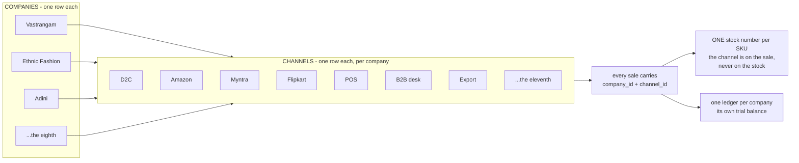

**Every business row carries its company.** A journal line can only point at an account belonging to
the same company, so one company cannot read another's figures — checked by a test rather than left
to discipline.

**The channel is a dimension of the sale.** `channel_id` sits on the stock movement and on the
journal entry, so any figure can be read by channel, by company, or by both. It deliberately does
*not* sit on the stock row: inventory is not per channel, because the last piece sold on one
marketplace must vanish from the other ten in the same instant.

**The group eliminates what the companies sold each other.** An entry whose other side is a sister
company carries `counterparty_company_id`, and consolidation removes exactly those.

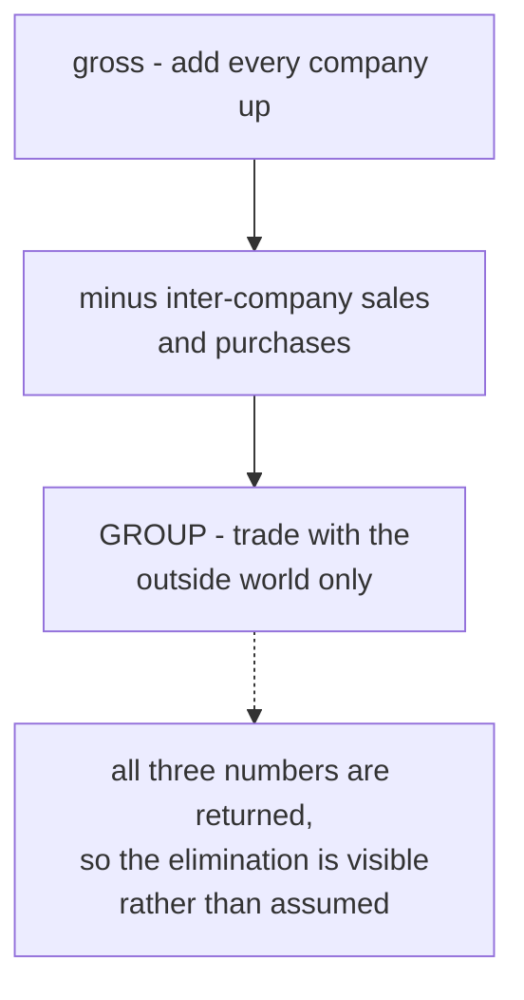

**This is proved, not asserted.** `core/tests/core.test.js` builds **10 companies × 10 channels =
100 channels**, posts one order down every channel plus ten inter-company sales, and checks each
company's figures channel by channel, that every trial balance still balances, that no journal line
anywhere points at another company's account, and that the group figure is the sum minus
inter-company trade — **₹2,10,500 gross, ₹50,000 eliminated, ₹1,60,500 group**. The same builder is
then called for 11 × 11 with nothing in the code changed.

The reporting side matches: the Data Studio detects every `<Company> Sale` / `<Company> Return`
sheet pair present in an uploaded workbook and emits one pair of quantity columns per company. A
fourth company is a new sheet, not a new release.

---

## A2 · THE UNIFIED DATA CORE

This is the physical reason a sale can touch stock and the books at the same instant: there is one
set of master records underneath every module, not one silo per module.

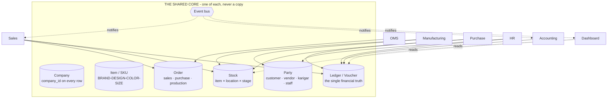

**The seven things there is exactly one of.** Company · Item/SKU · Party · Stock · Ledger · Order ·
the event bus that lets modules notify each other. Every business table carries `company_id`, and
row-level security enforces it in the database — so even a bug in application code cannot leak one
company's data into another's.

**Why this matters more than any feature.** The predecessor to this system was a set of separate
browser tools, each with its own private storage. A sale recorded in the sales tool never reached the
accounting tool. Every integration promise in this document rests on that being fixed: one core, one
event bus, and the order the sales module writes is the identical row the accounting module reads.

### Four rules the core enforces before any module is built

1. **Money is integer paise, never a floating-point number.** Currency arithmetic in floats
   accumulates error that eventually shows up as a trial balance that will not tie.
2. **Values that change over time are effective-dated** — a salary, a price, a tax rate, a
   commission. A payroll run for March resolves the salary in force *in March*, not today's. Zero
   rows in force is an error, never treated as zero.
3. **Nothing is deleted, only deactivated.** A person who leaves is marked inactive; their name is
   attached to years of earnings, approvals and audit rows that must still resolve.
4. **The audit trail cannot be switched off.** Every edit records who, when, and the value before and
   after, kept for eight years as the MCA rule requires. It is not a setting that defaults to on —
   there is no switch, because an audit trail with an off switch is one that gets silenced exactly
   when it matters.

---

## A3 · THE MODULE MAP — 21 MODULES

Every module lives inside one application: one login, one company switcher, one data core. The
numbering below is the build order, and the build order is dependency order — a module is only built
once everything it needs already exists.

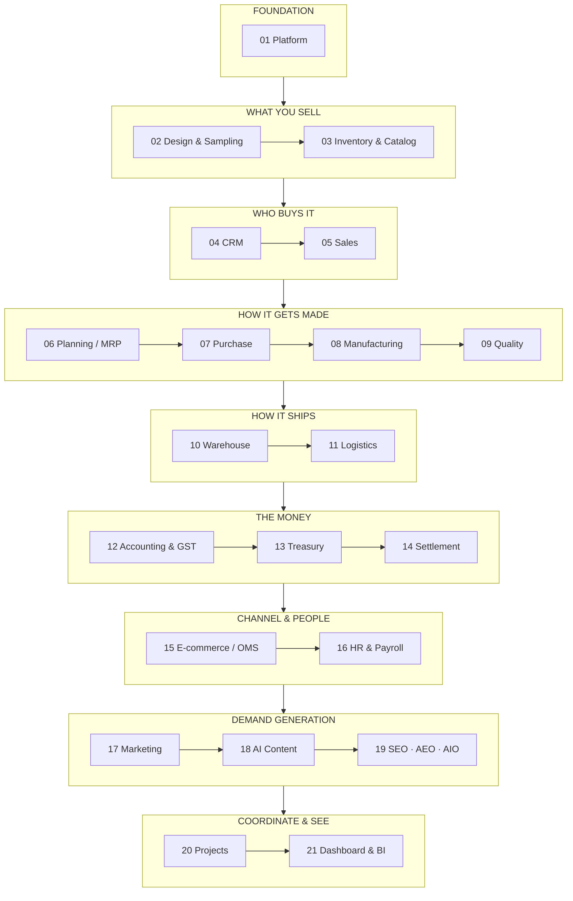

| # | Module | Apps | Built | Engine | To build |
|---|---|---|---|---|---|
| 01 | Platform | 6 | 1 | 1 | 4 |
| 02 | Design & Sampling | 2 | 0 | 0 | 2 |
| 03 | Inventory & Catalog | 4 | 0 | 0 | 4 |
| 04 | CRM | 4 | 3 | 0 | 1 |
| 05 | Sales | 7 | 5 | 0 | 2 |
| 06 | Planning & Requirements (MRP) | 3 | 0 | 0 | 3 |
| 07 | Purchase | 3 | 2 | 0 | 1 |
| 08 | Manufacturing | 4 | 0 | 0 | 4 |
| 09 | Quality & Compliance | 2 | 0 | 0 | 2 |
| 10 | Warehouse | 3 | 0 | 0 | 3 |
| 11 | Logistics | 5 | 0 | 0 | 5 |
| 12 | Accounting & GST | 9 | 0 | 0 | 9 |
| 13 | Treasury & Financial Planning | 3 | 0 | 0 | 3 |
| 14 | Settlement | 3 | 0 | 0 | 3 |
| 15 | E-commerce / OMS | 11 | 2 | 0 | 9 |
| 16 | HR & Payroll | 4 | 0 | 0 | 4 |
| 17 | Marketing | 8 | 0 | 0 | 8 |
| 18 | AI Content Engine | 8 | 0 | 1 | 7 |
| 19 | SEO, AEO & AIO | 3 | 0 | 0 | 3 |
| 20 | Projects & Collaboration | 7 | 0 | 0 | 7 |
| 21 | Dashboard & BI | 5 | 3 | 0 | 2 |
| | **Total** | **104** | **16** | **2** | **86** |

---

## A4 · MODULE-TO-MODULE WIRING

Every arrow here is a real, required data flow — not an aspiration. This is the fabric that turns 21
modules into one system.

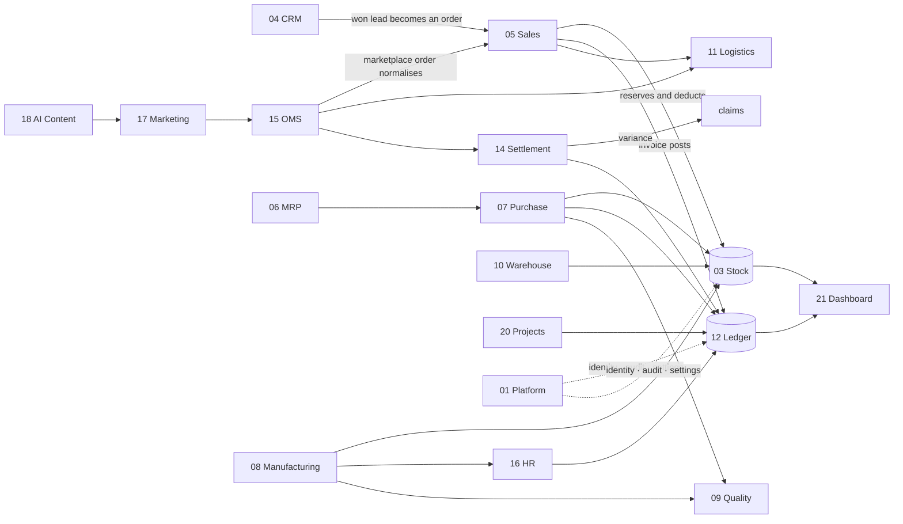

**Reading the important arrows.**

1. **CRM → Sales.** A won lead becomes a sales order carrying the customer, their price list and
   their credit tier — nothing re-typed.
2. **Sales → Inventory.** The order reserves and then deducts the single stock number, so the last
   piece sold anywhere disappears everywhere in the same instant.
3. **Sales → Accounting.** The invoice posts Dr Debtor/Bank, Cr Sales plus output GST, with
   CGST+SGST or IGST decided from the two GSTINs' state codes — never picked from a dropdown.
4. **OMS → Settlement → Accounting.** Payouts reconcile per line; commission, fees, TCS and TDS post
   to the books; any variance opens a claim with its evidence.
5. **Purchase → Inventory + Accounting.** The GRN adds stock; the three-way match gates the payable;
   the GST becomes input credit.
6. **Manufacturing → Inventory + HR + Accounting.** Production adds finished stock, computes karigar
   piece-rate earnings, posts wages, and rolls cost per piece into design profit.
7. **Accounting → Dashboard.** Every dashboard figure is a query on the ledger, never a separate
   counter. This is the integrity rule the whole system exists to keep.

---

## A5 · THE FIVE END-TO-END FLOWS

Four of these are the journeys the business actually runs on. Each crosses many modules, which is
exactly the point — no single module completes any of them alone.

### Flow 1 · Design to dispatch

```mermaid
flowchart LR
  A["02 spec + sample"] --> B["02 sign-off"] --> C["03 becomes SKUs"]
  C --> D["06 demand becomes requirement"] --> E["07 buy the material"]
  E --> F["09 inspect on receipt"] --> G["08 make it, 10 stages"]
  G --> H["09 QC accept or rework"] --> I["03 finished stock in"]
  I --> J["10 pick and pack"] --> K["11 book the courier"]
```

### Flow 2 · Order to cash

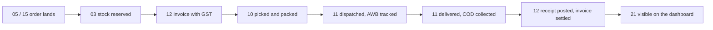

### Flow 3 · Settlement to books

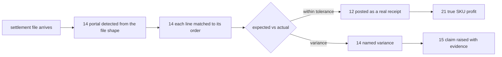

### Flow 4 · Karigar to payroll

```mermaid
flowchart LR
  A["karigar reports pieces by WhatsApp"] --> B["08 pooled across all karigars per design"]
  B --> C["08 sets = min across populated columns"]
  C --> D["08 earnings per raw piece"] --> E["16 into the month's register"]
  E --> F["16 advances deducted"] --> G["16 paid, method and reference recorded"]
  G --> H["12 Karigar Wages posted"] --> I["08 true cost per piece"]
```

### Flow 5 · Content to published

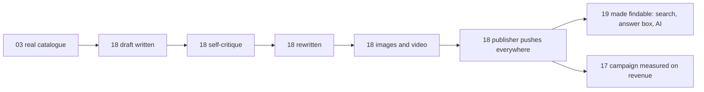

---

## A6 · WHY THIS BUILD ORDER

The order is not a preference. Each module needs something the previous one produces, and building
out of order means building against data that does not exist yet.


**Four decisions worth explaining, because they differ from the obvious arrangement.**

- **Platform is first, not last.** Identity, permissions and the audit trail are what every other
  module writes through. Retrofitting an audit trail means going back through every module.
- **Design & Sampling comes before Inventory.** A product must be specified and approved before it
  can exist as a catalogue record. Building the catalogue first means inventing styles with no real
  specification behind them.
- **Quality is its own module, not a step inside Manufacturing.** Rejecting goods at receipt and
  rejecting goods on the floor are the same discipline, and the certificates that prove a standard is
  followed belong beside the inspections that back them.
- **Dashboard is last.** It has nothing true to show until the other twenty produce real records. A
  dashboard built first can only display invented figures.

**What a module does when a later module is not built yet.** It is finished against the data that
exists on its day, and shows more as later modules come online. Module 21's dashboard is real from
the moment it is built and grows richer as Module 12's ledger fills.

---

## A7 · THE HONEST STATE TODAY

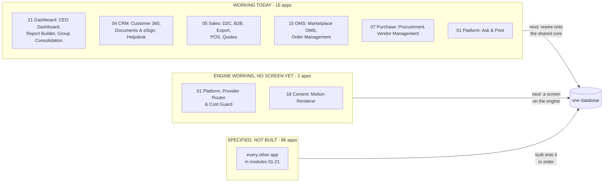

**What "built" means here.** Sixteen single-file apps that open in a browser, carry their own
self-tests, and pass a full click-through audit with zero console errors in both editions. That is
verified, not claimed.

**What "engine working" means, and why it is a third word rather than a generous reading of the
first.** Two apps have their hard part written and passing its own tests on the command line, with
no screen on them yet. They are not counted among the sixteen, because the sentence beside that
number promises a browser check these have not had. They are not called "specified" either, because
the arithmetic exists and runs. Anyone can check both in the time it takes to read this:

```bash
node brand/suite/router.js --selftest                  # 31 passed, 0 failed
node brand/suite/studio/motion_render.js --selftest    # 14 passed, 0 failed
```

**What is honestly not done.** Those sixteen apps still run on their own storage. The first work of
each module is rewiring its built apps onto the shared core so they read and write the same records
as everything else. Until that happens they are good tools, not yet one system.

---

## A7b · WHERE THE SIX NEWEST APPS CAME FROM

Ten open-source projects were read to answer one question: what do they have that this does not?
Not to copy — nothing from any of them is in this codebase, and the licences below are the reason
that distinction is written down rather than assumed. Six gaps were real enough to specify, and two
of the six were built rather than merely described.

| Project | Licence | What was taken |
|---|---|---|
| OmniRoute | MIT | The mechanisms behind **Provider Router & Cost Guard** — cascade, breaker, backoff, budget |
| HyperFrames | Apache-2.0 | Deterministic frame-seeking, now the **Motion Renderer** |
| voicebox | MIT | The shape of **Narration Studio** — chunked long text, many languages, local by default |
| easydiffusion | CreativeML Open RAIL-M | The shape of the **Image Generation Slot** — queue, preview, inpaint, upscale |
| n8n | fair-code | The idea behind **Automation Studio** — a visual when-X-then-Y over an event bus |
| Odoo | LGPL | Read for gap-finding only; it surfaced the missing **Website & Page Builder** |
| OpenMontage | AGPLv3 | Idea only — copying any of it would force this codebase to be published |
| ideogram4 | **Non-Commercial** | Nothing usable. The model may not be used in a commercial product at all; only the capability it demonstrates is described |
| palmier-pro | GPLv3, macOS-only | Nothing — wrong platform |
| higgsfield | — | Nothing — GPU training infrastructure, unrelated to this business |

**Why these six and not others.** Provider Router was first because this document already *claimed*
no capability depends on one outside service, and a claim with nothing enforcing it is the kind of
gap that only shows up on the evening a courier API stops answering. Motion Renderer was built
because the two things it needs — a headless browser and an ffmpeg binary — are already in this
repository for other reasons, so it was buildable today rather than someday. The other four are
specified honestly: a website builder is a large piece of work, image generation needs hardware
this system does not have, and saying so is cheaper than discovering it later.

---

# PART II — THE 21 MODULES

Each module below carries: what it is, a diagram of how it functions, its apps with an honest built
or spec mark, the data it owns, the rules that actually govern it, what it reads and writes, and the
condition that decides it is finished.

---

# MODULE 01 · PLATFORM
*The spine every module runs on*

**What it is.** Not a module you open — the layer underneath the other twenty. Who can see what, how
the business is configured, and an unalterable record of everything that ever happened. It is built
first because every module above it writes through it, and an audit trail added later is an audit
trail with a hole in it.

**How it works**

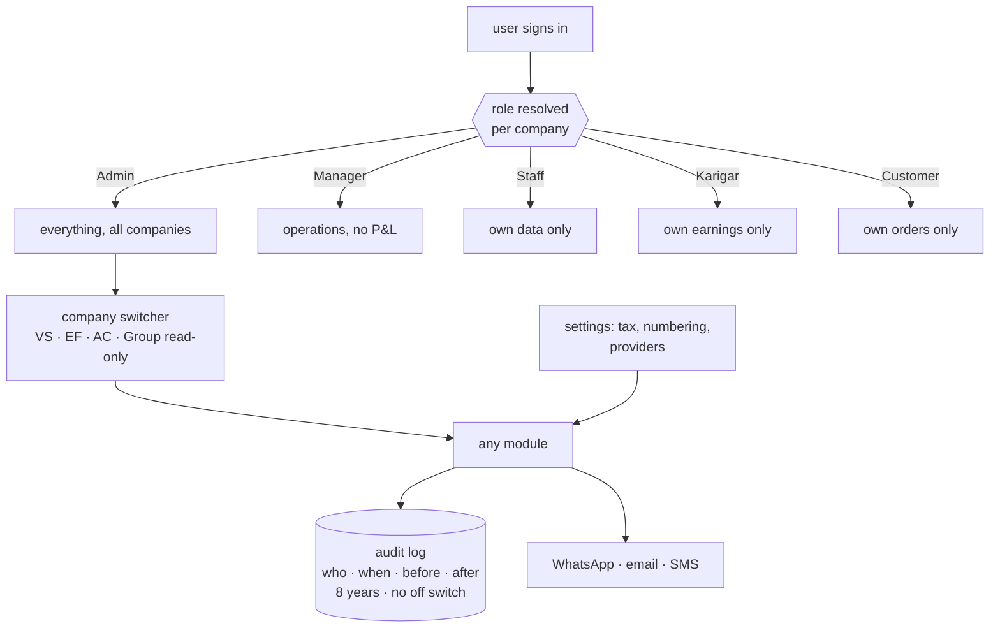

**The apps (6)**

| App | State | What it does |
|---|---|---|
| Identity, Settings & Audit | SPEC | Users, per-company per-role permissions, company switcher, tax and numbering setup, provider config with an integration-health view, and the browser over the audit trail |
| **Provider Router & Cost Guard** | **ENGINE WORKING** | The no-single-provider rule enforced instead of promised: an ordered fallback per capability, a breaker that trips a failing provider out, backoff between retries, and a spend ceiling in paise that refuses rather than warns |
| Ask & Print | **BUILT** | Ask from a phone — a ledger, a bill, today's packing slips — and get a PDF back, or print at the office with nothing plugged into the phone |
| Communications | SPEC | WhatsApp command console, broadcasts, email and SMS, and the scheduled jobs that carry a nudge without anyone remembering to send it |
| Data Privacy & Consent | SPEC | Consent captured where it is given and honoured downstream; retention and erasure tracked as the two different policies they are |
| Payment Data Scope | SPEC | The written statement of which systems ever see a card or bank credential — and which never do |

**What it owns.** `companies` · `users` · `user_companies` · `audit_log` · `integration_errors` ·
`settings_environment` · `whatsapp_messages` · `whatsapp_broadcasts` · `email_campaigns` ·
`notifications` · `consents`

**The rules that matter**

- Permissions are a matrix — per company, per role — not one global level. A group of sister
  companies is exactly where a single global level leaks data across a boundary it should not cross.
- The audit trail has no off switch. Eight years, before-and-after values, MCA rule.
- Every capability runs through at least three interchangeable providers. **A provider named as the
  source of a figure is a bug** — providers move messages and money; the ledger originates numbers.
- Broadcasts go through the official API, warm up at 200/day, and honour a STOP keyword.
- **This system never asks anyone for a marketplace, bank or account password.** A tool that asks for
  those has become the thing it should protect its users from.

**Reads** ← every module · **Writes** → every module

**Done when.** A karigar sees only their own earnings, an admin switches all three companies and
every figure changes with the company, and every edit made during the test is already in the audit
browser.

---

# MODULE 02 · DESIGN & SAMPLING
*A style exists on paper before it exists as stock*

**What it is.** Where a product moves from a first idea to something the business can actually make
and sell — specification, sample rounds, costed trials, sign-off — before it is ever entered as a
catalogue record. Building this before Inventory means the catalogue is never populated with styles
that have no real specification behind them.

**How it works**

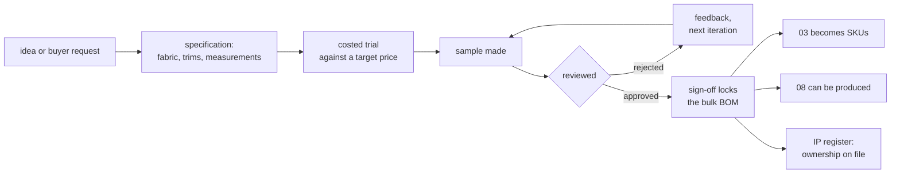

**The apps (2)**

| App | State | What it does |
|---|---|---|
| PLM & Development | SPEC | Specification → sample rounds → costed trials → sign-off, every version kept, so last season's costing is still there |
| Design / IP Register | SPEC | Trademark and copyright status, the date a design was first shown, and a flag when a near-identical listing appears elsewhere |

**What it owns.** `designs` (the development record) · `samples` · `sample_iterations` ·
`design_ip_register` · `tech_packs`

**The rules that matter**

- Every version is kept, never overwritten. A design's cost history is the evidence behind this
  season's price.
- Sign-off is the event that locks the bulk bill of materials. Sample BOMs and bulk BOMs carry
  different wastage percentages and are not the same record.
- A design with no ownership record on file is a design nobody can defend — which matters most for
  exactly the designs Module 18 is built to promote at scale.

**Reads** ← CRM · **Writes** → Inventory & Catalog · Manufacturing

**Done when.** A design goes idea → sample → rejection → second sample → approval, and only the
approved version can generate SKUs.

---

# MODULE 03 · INVENTORY & CATALOG
*One number everyone trusts*

**What it is.** The most important number in the system: one quantity per SKU, per location, per
stage — read and written by every other module. And one product record that every channel lists from.

**How it works**

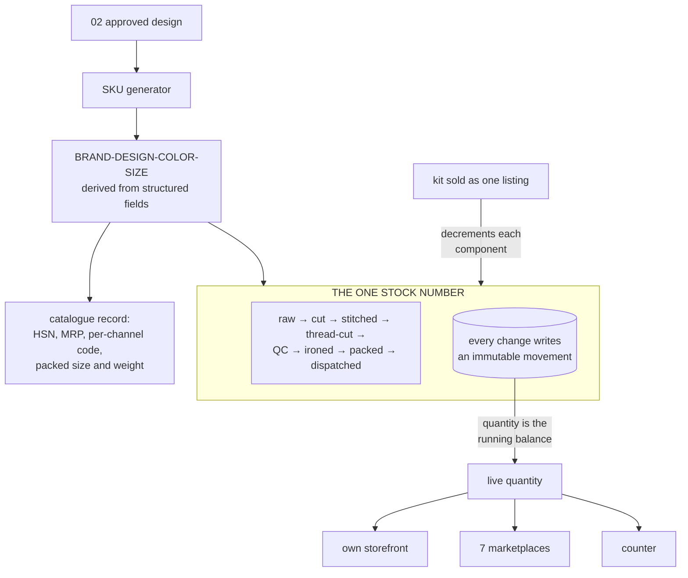

**The apps (4)**

| App | State | What it does |
|---|---|---|
| Stock | SPEC | Live quantity by SKU, location and stage, with reorder alerts, batches and dead-stock ageing |
| Catalog / PIM | SPEC | One product record with each channel's own code mapped to yours, and the packed size and weight that decide courier rate and settle weight disputes |
| Kit & Combo SKU | SPEC | A sellable SKU made of component SKUs; selling it decrements every component |
| Master-Data Hygiene | SPEC | Duplicate detection and merge across customers, vendors and designs |

**What it owns.** `designs` · `colors` · `sizes` · `items` · `item_aliases` · `kit_items` · `stock` ·
`stock_movements` · `batches` · `opening_stock` · `hsn_codes` · `gst_rates` · `locations`

**The rules that matter**

- **Movements are the ledger; the quantity is its running balance.** Every transition writes an
  immutable row, so "how did we get to 4?" is always answerable.
- Stock is event-driven and **not per channel**. The last piece sold on one marketplace leaves every
  other in the same instant — not three hours later as a cancellation, because cancellations are what
  a seller rating is lost to.
- The SKU string is *derived* from structured fields. Search, grouping and analytics use the fields,
  never substring-matching on the string.
- Negative stock is a data fault, not a state the business can be in. An issue beyond what exists is
  refused and recounted.
- A wrong return is dead stock and is **never added back**.
- Stock valuation sets the balance-sheet figure — the two must be equal, or one of them is wrong.

**Reads** ← Design & Sampling, every module · **Writes** → every module

**Done when.** Stock is one number across every channel, a kit sale decrements all components, and
stock valuation equals the balance sheet.

---

# MODULE 04 · CRM
*Know every customer completely — and answer them fast*

**What it is.** One record per customer carrying every lead, order, return, document and conversation,
whichever channel it arrived on. Whoever picks up the next question can already see everything that
came before it.

**How it works**

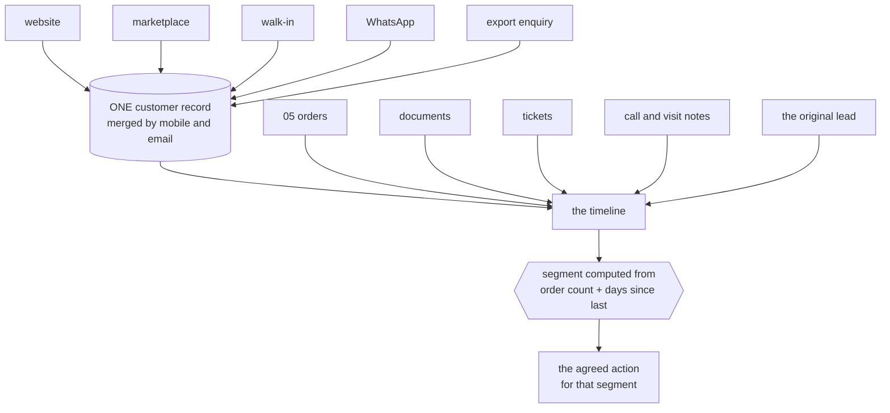

**The apps (4)**

| App | State | What it does |
|---|---|---|
| CRM & Customer 360 | **BUILT** | Lead to won, then the full lifetime — orders, returns, value, and what to offer next, on one screen |
| Documents & eSign | **BUILT** | Every agreement and certificate filed against the record it belongs to; send for signature and the signed copy files itself back |
| Helpdesk & Live Chat | **BUILT** | Questions become tickets tied to the order they are about, with the whole history already open |
| Forms & Feedback (NPS) | SPEC | Post-delivery feedback attached to the *design*, so a complaint-prone design surfaces as a pattern |

**What it owns.** `customers` · `customer_addresses` · `customer_interactions` ·
`customer_lifecycle_events` · `loyalty_ledger` · `documents` · `tickets` · `nps_responses`

**The rules that matter**

- Nobody tags anybody. A customer's segment is computed from two facts only — how many orders and how
  long since the last — so a buyer moves segment by themselves the moment they buy or go quiet.
  Hand-tagged segments are always six months out of date.
- D2C, B2B, export, walk-in and WhatsApp merge to one customer by mobile and email. Marketplace
  customers stay separate because the channel does not share their details, but tie by pattern.
- The pipeline advances Lead → Qualified → Quoted → Negotiation and stops there; won or lost is a
  separate deliberate act.
- Feedback attaches to the design, not only the buyer — that is what turns a scatter of complaints
  into a fault Manufacturing can fix.

**Reads** ← every module · **Writes** → Sales · E-commerce/OMS · Marketing

**Done when.** One customer's whole cross-channel history is on one screen, and crossing an order
threshold moves their segment without anyone touching it.

---

# MODULE 05 · SALES
*Every way you sell, one order book — to the doorstep*

**What it is.** Counter, wholesale, export and your own website all writing to the same order and
drawing on the same stock number. A sale is not finished when it is billed — it is finished when it
is delivered and the cash-on-delivery money is in.

**How it works**

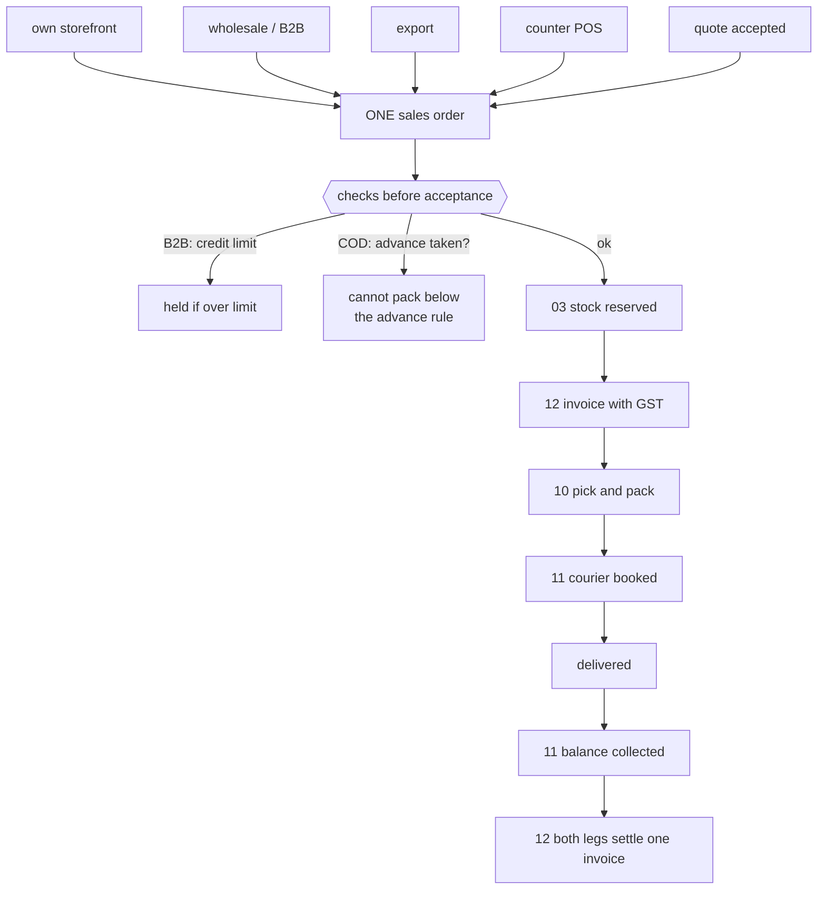

**The apps (7)**

| App | State | What it does |
|---|---|---|
| D2C Sales | **BUILT** | Own-storefront orders cart to dispatch, with loyalty and partial COD |
| B2B & Credit | **BUILT** | Wholesale orders with credit limits, tier pricing and outstanding ageing |
| Export | **BUILT** | Commercial invoice, packing list, LUT bond and IGST-refund tracking |
| POS | **BUILT** | Counter billing drawing on the same stock as the website |
| Quotes & Proforma | **BUILT** | Send a quote, convert it to a confirmed order in one step |
| Couriers & AWB | SPEC | Compare couriers on the order, print the label, follow the AWB to the door |
| Subscriptions | SPEC | A schedule that raises its own invoice and follows up when a payment fails |

**What it owns.** `sales_orders` · `sales_order_items` · `invoices` · `invoice_items` · `b2b_orders` ·
`b2b_credit_ledger` · `export_orders` · `customization_orders` · `subscriptions`

**The rules that matter**

- **A COD order cannot be packed until it carries its advance.** A refused COD parcel costs the
  courier fee both ways and comes back handled; a customer who has paid something almost always
  accepts. This one rule is the cheapest defence the business has.
- **Partial COD reconciles both legs to one invoice** — the advance taken online and the balance the
  courier remits.
- Credit is checked *before* acceptance, not discovered later as a bad debt. Reminders at −3 days,
  +1 day, and a +7-day soft block.
- The delivery date is **derived** — cut-off plus transit from the warehouse that actually holds
  stock — never typed. An order no warehouse can serve gets no date at all, because a promise nobody
  can keep is worse than no promise.
- Export lines are zero-rated under LUT; FX difference between billing rate and realisation rate
  posts to FX gain/loss.

**Reads** ← Inventory & Catalog · CRM · Warehouse · Logistics ·
**Writes** → Inventory & Catalog · Accounting & GST · Warehouse · Logistics

**Done when.** A storefront order appears within a minute with stock reserved and an invoice raised,
and a partial-COD order reconciles both legs by itself.

---

# MODULE 06 · PLANNING & REQUIREMENTS (MRP)
*Turn what is selling into what to buy and make*

**What it is.** The module that sits between demand and supply. Confirmed orders and sales history
become a requirement before Purchase buys anything or Manufacturing starts anything — otherwise both
are guessing.

**How it works**

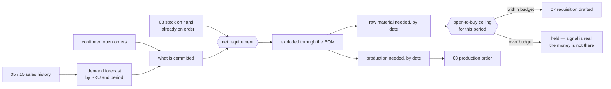

**The apps (3)**

| App | State | What it does |
|---|---|---|
| Demand Forecast & Signal | SPEC | What sold, by SKU and period, turned into a short-term forecast — the number every downstream requisition is measured against |
| Requirement Explosion (MRP run) | SPEC | Demand exploded through the bill of materials into what to buy and what to make, and by when |
| Open-to-Buy / Budget Ceiling | SPEC | A spending ceiling per period that a demand signal alone cannot exceed |

**What it owns.** `demand_forecast` · `mrp_runs` · `mrp_requirements` · `open_to_buy_budgets`

**The rules that matter**

- Net requirement is demand minus stock on hand minus what is already on order. Buying against gross
  demand is how a business ends up holding two seasons of the same fabric.
- Every requisition traces back to the run that produced it, and that run back to the demand behind
  it. A purchase order whose only justification is "stock looked low" is exactly what this module
  exists to eliminate.
- **The budget ceiling is a hard guardrail, not a warning.** A genuine demand signal can still commit
  more money than the business decided to risk this season, and without a ceiling it will.

**Reads** ← Sales · E-commerce/OMS · Inventory & Catalog · **Writes** → Purchase · Manufacturing

**Done when.** An MRP run turns a month of real demand into requisitions and production orders that
each trace back to the orders that caused them, and the ceiling blocks the run that exceeds it.

---

# MODULE 07 · PURCHASE
*Nothing over-billed gets paid*

**What it is.** The buy side end to end — mills, dyers, job workers, packing suppliers — and the
control that stops you paying for goods you rejected.

**How it works**

```mermaid
flowchart LR
  REQ["06 requisition"] --> PO["purchase order<br/>PO-FY-####"]
  PO --> V{{"vendor by score<br/>P1 → P2 → P3"}}
  V --> SENT["sent to vendor"]
  SENT --> GRN["goods received<br/>qty accepted / rejected"]
  GRN --> QC["09 inspected"]
  GRN --> STK["03 raw stock in"]
  BILL["vendor invoice"] --> M3{{"THREE-WAY MATCH"}}
  PO --> M3; GRN --> M3
  M3 -->|"invoice = accepted qty × PO rate"| PAY["12 payable created<br/>ITC claimed"]
  M3 -->|mismatch| STOPP["blocked before payment"]
  GRN --> SCORE["vendor scorecard:<br/>quality %, on-time %, rate"]
  SCORE --> V
```

**The apps (3)**

| App | State | What it does |
|---|---|---|
| Procurement | **BUILT** | Requisition → PO → GRN, with a strict three-way match before any bill is paid |
| Vendor Management | **BUILT** | Vendor 360, payables, ageing, a real risk score, and sourcing that follows performance |
| Insurance Register | SPEC | Cover over stock in transit, stock in the warehouse and product liability, matched against what is actually moving |

**What it owns.** `purchase_requisitions` · `purchase_orders` · `purchase_order_items` · `grn` ·
`grn_items` · `vendor_invoices` · `three_way_match` · `vendors` · `vendor_materials` ·
`third_party_services` · `insurance_policies`

**The rules that matter**

- **The three-way match is the whole point.** You ordered 100 metres, 100 arrived, quality accepted
  96 — the bill clears for 96 and not a metre more. The system flags GRN ≠ PO, invoice ≠ accepted ×
  rate, and any invoice arriving before its GRN.
- The vendor scorecard is computed per transaction from real outcomes — accept rate, on-time
  delivery, rate against market — and it drives the priority order for the next requisition. Sourcing
  follows performance rather than habit.
- Real stock value moves through purchase and the warehouse continuously; cover that nobody tracks is
  cover nobody can claim on.

**Reads** ← Inventory & Catalog · Planning/MRP · Manufacturing ·
**Writes** → Inventory & Catalog · Accounting & GST · Quality & Compliance

**Done when.** A vendor invoice for more than was accepted is blocked before payment, and the
rejection reason is on the record.

---

# MODULE 08 · MANUFACTURING
*Know what a unit really costs to make*

**What it is.** From material in the door to the finished unit — every operation, every worker's
earning, and what each design actually cost before it was priced. Design sign-off happens upstream in
Module 02; inspection and the compliance record live downstream in Module 09. This module is purely
the making.

**How it works**

```mermaid
flowchart TB
  PO["06 production order"] --> ST["10 stages, WIP visible at each"]
  ST --> S1["cut"] --> S2["stitch"] --> S3["thread cut"]
  S3 --> S4["09 QC"] --> S5["iron"] --> S6["pack"]
  S6 --> FIN["03 finished stock in"]
  BOM["BOM: what it consumes,<br/>at today's rates"] --> COST["cost per unit"]
  RPT["karigar reports pieces<br/>by garment type"] --> POOL{{"pooled across ALL karigars<br/>per design first"}}
  POOL --> SETS["sets = min across the<br/>POPULATED member columns"]
  SETS --> EXTRA["surplus named individually<br/>Extra Anarkali, Extra Plazo"]
  SETS --> EARN["paid per RAW PIECE,<br/>independent of set completion"]
  EXTRA --> EARN
  EARN --> HR["16 into the payout register"]
  EARN --> COST
  COST --> PL["design profit"]
```

**The apps (4)**

| App | State | What it does |
|---|---|---|
| Production Orders | SPEC | Your own stages from first operation to finished goods, with work-in-progress visible at each |
| Piece-rate & Contractors | SPEC | Output-based pay: pooled set completion, per-unit rates, rework and advances resolved into one payout |
| BOM & Consumption | SPEC | What each design consumes — fabric, zari, lining, trims, packing — costed at today's rates |
| Maintenance | SPEC | Machines and tools: what is due for service, what it cost, what stopped while it was down |

**What it owns.** `production_orders` · `production_stages` · `bom` · `bom_items` ·
`karigar_assignments` · `karigar_reports` · `performance_flags`

**The karigar costing rules — the heart of this module**

These are settled and already proven in a working engine. They are unusual enough to be worth stating
exactly, because getting any one of them wrong changes what a person gets paid.

1. **23 garment columns collapse to 13 set types.** A set is a named combination, not an arbitrary
   grouping.
2. **Pool across all karigars per design first, then apply the rule.** Pooling after applying the
   rule produces a different, wrong answer.
3. **Sets = the minimum across the *populated* member columns of that set type.** A column nobody
   worked on is not a zero that drags the set count to nothing — it is simply not part of the
   calculation.
4. **Extras are named individually** — Extra Anarkali, Extra Plazo — never a generic leftover bucket,
   and there is **no combined "Set + Extra" total column**, because that column would double-count.
5. **Cost is per raw piece, independent of set completion.** A surplus piece that completes no set is
   still work somebody did, and is still paid.
6. **A missing rate posts ₹0 and raises a flag — never a guessed rate.** A guessed rate is a silent
   error in someone's wages.
7. Alteration earning is alteration hours × ₹100; an alteration caused by the worker's own mistake is
   ₹0.
8. A performance flag fires when the same person, design and task takes more than 1.2× the previous
   hours, and asks why by WhatsApp.

**The acceptance gate — figures that must reproduce to the rupee**

| Source | Designs | Karigar units | Sets | Pieces | Total | Flagged |
|---|---|---|---|---|---|---|
| The owner's hand-made report, Apr 2025 – Jun 2027 | 143 | 29 | **25,307** | **59,110** | **₹26,90,062** | 5 designs with no rate |
| The engine, run today on the workbooks as they now stand | 128 | 20 | **16,662** | **36,229** | **₹17,45,911** | 0 designs with no rate |

**Why the two rows differ, stated rather than reconciled away.** The FY2026-27 workbook has since
been restructured into one payment sheet per team — `Sajid & Team`, `Sohrab & Team` and so on — and
no longer carries a design grid at all, so that year's rows cannot be read from it. The five
previously unrated designs have since been given rates, which is why nothing is flagged now.

The verification does not weaken the gate to make it pass. It places **every** design in the
reference report into exactly one bucket with a named cause — matched exactly, changed at source,
rate added since, incomplete-set rule, or present only in the FY2026-27 grid — prints the buckets,
and fails on any design whose difference has no explanation. There are currently none. A mismatch
with no cause is a bug, not a rounding difference; an input the engine cannot read is a stated
limitation, not a passing test.

**What closing this needs.** A reader for the per-team sheet layout, so the FY2026-27 year is
costed from the file the business actually keeps today rather than from one it no longer maintains.

**Reads** ← Purchase · Planning/MRP · Design & Sampling ·
**Writes** → Inventory & Catalog · HR & Payroll · Accounting & GST · Quality & Compliance

**Done when.** Three production orders run to completion — self-made, full job work, partial job work
— and the acceptance-gate totals reproduce exactly.

---

# MODULE 09 · QUALITY & COMPLIANCE
*Certify what was received and what was made*

**What it is.** Inspection used to be one step buried inside Manufacturing. It stands on its own here
because rejecting goods at receipt and rejecting goods on the floor are the same discipline — and
because the certificates that prove a standard is followed belong beside the inspections that back
them up, not scattered across email.

**How it works**

```mermaid
flowchart TB
  IN1["07 goods received"] --> INSP{{"inspect"}}
  IN2["08 production output"] --> INSP
  INSP -->|accept| OK["03 into stock"]
  INSP -->|rework| RW["08 back to the floor"]
  INSP -->|reject| REJ["07 bill blocked for<br/>the rejected quantity"]
  INSP --> REASON["reason recorded"]
  REASON --> VS["07 vendor scorecard"]
  REASON --> PF["08 performance flag"]
  CERT["certificate register:<br/>standard, issued, expires,<br/>the audit behind it"] --> WARN["expiry warning<br/>before a buyer asks"]
  CERT --> ESG["21 sustainability reporting<br/>reads this evidence"]
```

**The apps (2)**

| App | State | What it does |
|---|---|---|
| Quality Control | SPEC | Accept, reject or rework — on goods received and goods made — with reasons that feed the vendor scorecard and the performance flags alike |
| Certificate & Compliance Register | SPEC | Every standard held, with issue date, expiry and the audit that backs it |

**What it owns.** `qc_records` · `qc_defect_categories` · `compliance_certificates` ·
`compliance_audits`

**The rules that matter**

- A rejection is never just a number — it carries a reason, and that reason is what makes the vendor
  scorecard and the performance flag meaningful rather than decorative.
- The quantity accepted at QC, not the quantity delivered, is what the three-way match pays against.
  This is the join between this module and the money.
- A certificate about to lapse is visible *before* a buyer asks for it and finds it expired.
- What this register holds is precisely what a sustainability report is later built from — which is
  why the reporting app in Module 21 reads it rather than collecting evidence separately.

**Reads** ← Purchase · Manufacturing · **Writes** → Purchase · Manufacturing · Inventory & Catalog

**Done when.** A rejected receipt blocks payment for exactly the rejected quantity, and an expiring
certificate raises a warning before its expiry date.

---

# MODULE 10 · WAREHOUSE
*Pick right the first time — and prove what you sent*

**What it is.** Bin-level instructions and barcode scanning so the right item leaves the building and
stock stays honest — and a recording of each parcel as it is packed, so an argument about what was in
it is settled by footage instead of memory.

**How it works**

```mermaid
flowchart LR
  ORD["open orders"] --> WAVE["pick wave built"]
  WAVE --> ROUTE["one route in walking order,<br/>grouped so an item is<br/>picked once for many parcels"]
  ROUTE --> SCAN{{"scan: pick"}}
  SCAN --> PACK{{"scan: pack"}}
  PACK --> VID["filmed, indexed<br/>by order number"]
  PACK --> DISP{{"scan: dispatch"}}
  SCAN -.every scan writes.-> MOV[("03 stock movement")]
  PACK -.->MOV; DISP -.-> MOV
  VID --> CLM["15 attaches itself<br/>to the claim that needs it"]
```

**The apps (3)**

| App | State | What it does |
|---|---|---|
| Picking & Bins | SPEC | Pick lists that name the bin, in walking order, so nobody crosses the floor twice |
| Barcode Operations | SPEC | Scan to pick, pack, dispatch and count from a phone — the same scan whatever channel the order came from |
| Packing Video | SPEC | Every parcel filmed as it is packed and indexed by order number |

**What it owns.** `bins` · `pick_lists` · `pick_list_lines` · `barcode_scans` · `packing_videos`

**The rules that matter**

- A picker is never sent to an empty rack — the wave is built from the stock record, not from hope.
- **Every scan writes a stock movement.** That is what keeps the running balance real rather than a
  number someone updates at the end of the day.
- The day is grouped by product, so one design is picked once for eleven parcels instead of eleven
  times.
- The footage attaches to the claim by order number automatically. A wrong-item claim answered with
  the clip is a claim won on evidence rather than argument.

**Reads** ← Sales · E-commerce/OMS · Inventory & Catalog ·
**Writes** → Inventory & Catalog · Sales · E-commerce/OMS

**Done when.** A parcel is picked from the right bin, filmed, and its clip is already attached when
the claim arrives.

---

# MODULE 11 · LOGISTICS
*The courier network — rates, failed deliveries and the COD money*

**What it is.** Booking one parcel happens on the order, in Sales. This module is the network behind
it: what each courier charges before you pick one, what happens to a delivery that fails, and whether
the cash collected at the door actually reached your bank.

**How it works**

```mermaid
flowchart TB
  P["parcel ready:<br/>weight, zone, service"] --> RATE{{"rate card compared"}}
  RATE --> CHEAP["cheapest, 3 days"]
  RATE --> FAST["fastest, 1 day"]
  CHEAP --> BOOK["booked, AWB on the order"]
  FAST --> BOOK
  BOOK --> MAN["daily manifest<br/>one-time handover code"]
  MAN --> LEFT["parcels left behind<br/>signed for — a lost parcel<br/>has an owner"]
  BOOK --> TRACK{{"in transit"}}
  TRACK -->|delivered| COD["COD collected at the door"]
  TRACK -->|failed| NDR["NDR worked:<br/>call, reconfirm, re-attempt"]
  NDR -->|saved| TRACK
  NDR -->|not saved| RTO["RTO — paid for twice"]
  COD --> REM["collected vs banked,<br/>parcel by parcel"]
  REM --> GAP["every shortfall named and aged"]
  REM --> GL["12 posted"]
```

**The apps (5)**

| App | State | What it does |
|---|---|---|
| Rates & Zones | SPEC | Every courier's rate card by zone, weight slab and service — cheapest and fastest both known before booking |
| NDR & RTO Rescue | SPEC | A failed delivery worked while it can still be saved, before it becomes a return you pay for twice |
| COD Remittance | SPEC | What was collected at the door against what reached the bank, parcel by parcel |
| Handover & Manifest | SPEC | What went out against what the courier actually took, with a one-time code and a signed record of what was left |
| Fleet | SPEC | Own vehicles, if any — trips, cost, service due. Optional; most run couriers only |

**What it owns.** `courier_rates` · `shipments` · `ndr_cases` · `cod_remittance` · `manifests` ·
`vehicles`

**The rules that matter**

- Both the cheapest and the fastest option are known before booking. Choosing without seeing both is
  choosing blind.
- **An NDR is worked while it can still be saved.** An RTO costs freight in both directions and
  returns handled goods — the rescue attempt is almost always cheaper than the return.
- COD is reconciled parcel by parcel, and every shortfall is named and aged. A lump-sum remittance
  that roughly matches is not reconciliation.
- The manifest carries a signed record of what was *not* taken, so a parcel lost between the packing
  table and the van has an owner.

**Reads** ← Sales · E-commerce/OMS · Warehouse ·
**Writes** → Accounting & GST · Sales · E-commerce/OMS

**Done when.** COD collected reconciles to COD banked parcel by parcel, and an NDR is worked before
it turns into an RTO.

---

# MODULE 12 · ACCOUNTING & GST
*Books that always balance*

**What it is.** A full double-entry ledger built for Indian compliance — not a tax report bolted onto
a spreadsheet. This system keeps the books on its own; no other accounting package is required, ever.
Existing packages stay available as connectors for anyone already running one, but no figure in the
business is ever *sourced* from them.

**How it works**

```mermaid
flowchart TB
  S["05 sales"] --> PE; O["15 OMS"] --> PE; P["07 purchase"] --> PE
  H["16 payroll"] --> PE; L["11 freight & COD"] --> PE
  ST["14 settlement"] --> PE; PR["20 billable time"] --> PE
  PE{{"ONE POSTING ENGINE<br/>entries balance or they do not post"}}
  PE --> GL[("general ledger")]
  GST{{"CGST+SGST or IGST<br/>decided from the two GSTINs'<br/>state codes"}} --> PE
  GL --> TB["trial balance — it ties"]
  GL --> R1["GSTR-1 · 3B · 9"]
  GL --> R2["P&L · balance sheet"]
  GL --> R3["profit by channel,<br/>product and SKU"]
  GL --> BI["21 every dashboard figure<br/>is a query on this"]
  LOCK["period locked after review;<br/>unlock is itself logged"] --> GL
```

**The apps (9)**

| App | State | What it does |
|---|---|---|
| Accounting | SPEC | Chart of accounts, nine voucher types, and the one posting engine every voucher writes through |
| Invoicing | SPEC | GST tax invoices computed from the lines to the paise, with round-off and e-invoice IRN |
| Expenses | SPEC | Spend by category with approvals, and bill OCR to save typing |
| GST & Tax | SPEC | CGST, SGST, IGST, TDS, TCS, input credit and the GSTR returns, filed per registration |
| ITC Reconciliation | SPEC | Purchases matched against the portal's own GSTR-2A/2B before a return is filed |
| Receivables, Payables & PDC | SPEC | Payments allocated against named invoices, and post-dated cheques posting on realisation |
| Fixed Assets & Depreciation | SPEC | The asset register with both straight-line and written-down-value tracked side by side |
| Year-End Close & Period Lock | SPEC | Carry-forward at year end, and a locked period no backdated edit can touch |
| Finance Reports | SPEC | P&L, balance sheet, and profit by channel, product and SKU |

**What it owns.** `chart_of_accounts` · `voucher_series` · `journal_entries` · `journal_lines` ·
`gst_returns` · `gst_input_credit` · `tds_entries` · `tcs_entries` · `bank_accounts` ·
`bank_transactions` · `fixed_assets` · `depreciation_entries` · `post_dated_cheques` ·
`bill_allocations` · `period_locks`

**The rules that matter**

- **One posting engine.** Every voucher writes the ledger through it, and an entry that does not
  balance does not post — it is refused, not saved half-done.
- **The tax type is derived, never chosen.** Intra-state versus inter-state comes from comparing the
  two GSTINs' state codes. A hand-picked tax type is a hand-made error.
- Rates default from the HSN and are **versioned by effective date**, so an invoice from last year
  keeps last year's rate after a rate change.
- Input credit is reconciled against the government's own data before GSTR-3B. Without it, a filing
  is a guess about how much credit you may legitimately claim.
- **Round-off posts to its own ledger account** — never absorbed into the sale amount, because
  absorbing it corrupts the GST calculation underneath.
- A closed period locks. No backdated edit without an admin unlock, and the unlock is itself logged.

**Build order inside this module** — fixed by the nature of the thing: posting engine and audit
first, wrapping every write from day one; then sales and purchase invoices, verified against the
trial balance; then the other seven voucher types; then year-end close and period lock; then GST
returns and 2A/2B reconciliation.

**Reads** ← every module · **Writes** → Finance Reports · Treasury

**Done when.** One month of books closes cleanly, the trial balance ties, and GSTR-1 and GSTR-3B
generate and verify.

---

# MODULE 13 · TREASURY & FINANCIAL PLANNING
*Know what cash is coming, not just what already arrived*

**What it is.** Accounting records what happened. This module is about what happens next — how much
cash is genuinely expected and when, and whether spending against a budget is on track while there is
still time to act.

**How it works**

```mermaid
flowchart LR
  AR["12 open invoices<br/>and their due dates"] --> IN["expected receipts"]
  AP["12 open bills"] --> OUT["expected payments"]
  SET["14 settlement cycles<br/>not yet landed"] --> IN
  IN --> WK{{"laid out by week"}}
  OUT --> WK
  WK --> GAP["a shortfall visible<br/>weeks before it bites"]
  BANK["bank statement lines"] --> REC{{"matched against<br/>what the ledger says moved"}}
  REC -->|unmatched| SURF["surfaced, not<br/>carried forward silently"]
  BUD["budget per category"] --> VA{{"vs actual, as the period runs"}}
  AP --> VA
```

**The apps (3)**

| App | State | What it does |
|---|---|---|
| Cash Flow Forecast | SPEC | Expected receipts and payments by week, drawn from open invoices and bills rather than typed in |
| Banking & Reconciliation | SPEC | Statement lines matched against the ledger's own record, with anything unmatched surfaced |
| Budget vs Actual | SPEC | A budget per category and period, tracked against real spend while the period is still running |

**What it owns.** `cash_forecasts` · `bank_reconciliation_sessions` · `budgets` · `budget_lines`

**The rules that matter**

- The forecast is **derived from open invoices and bills**, not typed in. A forecast someone
  maintains by hand is out of date the day after it is written.
- Marketplace payouts that have not landed yet are part of expected cash — that is what makes the
  forecast honest for a business selling on seven channels.
- An unmatched bank line is surfaced, never quietly carried forward. Carried-forward differences are
  how a reconciliation becomes fiction.
- Budget variance is shown **while the period runs**. A variance discovered after close is history;
  the only thing left to do with it is explain it.

**Reads** ← Accounting & GST · Sales · Purchase · **Writes** → Accounting & GST

**Done when.** A twelve-week cash forecast is produced with no manual entry, and a bank statement
reconciles with every unmatched line named.

---

# MODULE 14 · SETTLEMENT
*Get paid what you are owed — cycle by cycle*

**What it is.** A marketplace does not pay you what the customer paid. It pays selling price minus a
commission, minus a collection fee, minus a shipping charge it decided, minus a return it may or may
not have handled, minus tax it withheld — and hands you a file with no total you can trust. This
module reads that file, works out what each line *should* have been, and puts the two side by side.

**How it works**

```mermaid
flowchart TB
  F["settlement file arrives"] --> DET{{"portal recognised<br/>from the shape of the file"}}
  DET --> LINE["each line matched<br/>to its order"]
  OWN["computed independently<br/>from YOUR records:<br/>SP − commission − TCS − GST"] --> CMP{{"compare"}}
  LINE --> CMP
  CMP -->|"within ₹1 and 0.5%"| OK["reconciled → 12 real receipt<br/>against the real invoice"]
  CMP -->|beyond tolerance| VAR["variance, NAMED"]
  VAR --> V1["commission overcharged"]; VAR --> V2["TCS miscalculated"]
  VAR --> V3["fee above agreed"]; VAR --> V4["unbilled return"]
  VAR --> V5["weight discrepancy"]; VAR --> V6["lost in transit"]
  V1 --> CLAIM["15 claim raised,<br/>days remaining beside the amount"]
  OK --> PROFIT["21 true profit per SKU"]
```

**The apps (3)**

| App | State | What it does |
|---|---|---|
| Payout Cycles | SPEC | What each cycle should pay, what actually landed, and on which day — so a late payout is visible the day it is late |
| Fee & Commission Audit | SPEC | The published rate against the rate actually charged, by category, SKU and tier |
| TCS & TDS Register | SPEC | Every rupee withheld, matched against the portal's own figures |

**What it owns.** `settlement_cycles` · `fee_audit_lines` · `tcs_tds_register`, reading
`marketplace_settlements` from Module 15

**The rules that matter**

- **The expected figure is computed from your own records, not read back from the file.** The whole
  point is comparing the file against an answer the file cannot influence.
- **Commission is read from the file, then challenged against the published rate.** A system that
  assumes the commission is whatever the file says can never detect an overcharge — it has already
  agreed to it.
- A line is flagged only past **₹1 or 0.5%**, so the variance list holds real problems rather than a
  thousand one-paise arguments.
- **Every variance has a named kind.** You dispute a weight discrepancy differently from a lost
  parcel; the name is what makes the claim actionable.
- Days remaining sit beside the rupees at stake. A valid claim that lapses because nobody saw the
  clock is money given away.

**The gate.** A real settlement file must reconcile at **98% or better** automatically, and per-SKU
profit must land within **₹10** of your own records. Below that the module is not trustworthy enough
to run money on — and a settlement tool you cannot trust is worse than none, because it lends
confidence to a wrong number.

**Reads** ← E-commerce/OMS · Accounting & GST · **Writes** → Accounting & GST

**Done when.** A real settlement file reconciles at 98% or better and every variance it raises is one
you agree is genuinely real.

---

# MODULE 15 · E-COMMERCE / OMS
*Every marketplace and your own website, one queue*

**What it is.** Stop logging into seven seller panels and your own store admin. Every order lands in
one pipeline and one stock number goes back out to all of them — then the money side closes in the
same module: what each channel paid, what it kept, what came back, and what it still owes.

**How it works**

```mermaid
flowchart TB
  subgraph CH["CHANNELS - pulled every 15 min, idempotent by external id"]
    C1["Amazon"]; C2["Flipkart"]; C3["Myntra"]; C4["Meesho"]
    C5["Ajio"]; C6["Nykaa"]; C7["JioMart"]; C8["own storefront"]
  end
  CH --> Q["ONE QUEUE"]
  Q --> SORT{{"sorted by TIME REMAINING,<br/>not time received"}}
  SORT --> NOTE["a 12h Amazon order placed at 2pm<br/>outranks a 48h Ajio order from noon"]
  SORT --> ALLOC["allocation desk:<br/>which warehouse can actually serve it"]
  ALLOC -->|"none can"| NODATE["no date promised —<br/>needs a purchase or production order"]
  ALLOC -->|"can"| RES["03 stock reserved"]
  RES --> LBL["labels printed in a batch,<br/>never uploaded outside to be cropped"]
  LBL --> WH["10 picked and packed"]
  RET["returns triaged"] --> RC{{"which kind?"}}
  RC -->|customer| R1["₹20 cost"]
  RC -->|courier| R2["₹5 cost"]
  RC -->|wrong| R3["full selling price,<br/>DEAD STOCK, never restocked"]
  R3 --> ABUSE["repeat pattern flagged"]
```

**The apps (11)**

| App | State | What it does |
|---|---|---|
| Marketplace OMS | **BUILT** | Every channel in one order queue, with the right cut-off counting down on each order |
| Order Management | **BUILT** | One pipeline new to delivered, with the allocation desk and the promise-date engine |
| Manual Data Check | SPEC | Upload the sheets you already download and read ten cross-checks back, every figure clickable to the transactions behind it |
| Reconciliation | SPEC | Match every payout to the order line that earned it, and expose the gap |
| Claims & Disputes | SPEC | Shortfalls, weight disputes and lost parcels filed with evidence, answered before the clock runs out |
| Returns / RMA | SPEC | Customer, courier and wrong returns kept apart — only one of the three is really your fault |
| Channels & Storefronts | SPEC | Connect a channel once and it stays in step: catalogue out, price out, stock out, orders in |
| Labels & Documents | SPEC | The channel's PDF turned into something a packing table can work from, in one batch |
| Listing & Catalog Manager | SPEC | Bulk create and edit listings across channels, catching listed-but-out-of-stock mismatches |
| Size / Fit Recommendation AI | SPEC | A fit suggestion from the item's measurements and the return history by size |
| AR / Virtual Try-On | SPEC | Seeing drape and colour before buying, where a flat photo leaves too much to guess |

**What it owns.** `marketplace_orders_raw` · `marketplace_settlements` ·
`marketplace_settlement_lines` · `returns` · `claims` · `channels` · `channel_listings`

**The rules that matter**

- **The queue sorts by time remaining, not time received.** Channels have different dispatch windows;
  sorting by arrival breaches the tight ones while the loose ones sit safe.
- Orders are pulled on a schedule and are **idempotent by external ID**, so the same order never
  doubles no matter how often the pull runs.
- **An order no warehouse can serve gets no promised date.** It needs a purchase or a production
  order, and nothing is gained by giving the customer a date in the meantime.
- **A wrong return is dead stock and is never restocked.** Booking it back into sellable stock is how
  a business sells the same damaged piece twice and loses the customer permanently.
- **Labels are never uploaded to an outside website to be cropped.** That is a customer's name and
  address leaving your control for a convenience.
- Commission is read from the settlement file, never assumed — the challenge to it happens in
  Module 14.

**Reads** ← Inventory & Catalog · CRM · Sales · Accounting · Logistics · Settlement ·
**Writes** → Inventory & Catalog · Accounting · Warehouse · Logistics · Settlement

**Done when.** A full week runs with every channel live, settlements reconciled, and no panel
oversells.

---

# MODULE 16 · HR & PAYROLL
*Pay people right, on time*

**What it is.** Salaries and output-based earnings in one register, with attendance driving both —
whether people are on a monthly wage, an hourly rate, or paid by what they finish. And, unlike the
version of this that stops at a calculated figure, it carries through to the money actually leaving
the business.

**How it works**

```mermaid
flowchart TB
  ATT["attendance: WhatsApp or app<br/>50m geofence, 15-min buffer"] --> CODE["P · H · A · HL · OD · PL · UL"]
  CODE --> DE{{"Days-Equivalent =<br/>P + HL + 0.5 × H"}}
  SAL["salary history,<br/>EFFECTIVE-DATED"] --> RES{{"the salary in force<br/>THAT month"}}
  RES --> DR{{"Daily Rate =<br/>monthly salary ÷ threshold DAYS"}}
  DE --> EARN["Earning = Daily Rate × Days-Equiv<br/>uncapped both ways"]
  DR --> EARN
  KAR["08 karigar piece-rate earnings"] --> REG["ONE monthly register"]
  EARN --> REG
  FLAT["flat basis: full salary<br/>regardless of attendance"] --> REG
  ADV["advances taken"] --> NET["net payable"]
  REG --> NET
  NET --> PAYOUT{{"PAYOUT EXECUTION"}}
  PAYOUT --> M1["bank batch"]; PAYOUT --> M2["UPI"]; PAYOUT --> M3["cash, signed receipt"]
  PAYOUT --> REF["method + reference recorded<br/>against every payout"]
  REF --> GL["12 Salaries and Karigar Wages posted"]
```

**The apps (4)**

| App | State | What it does |
|---|---|---|
| Staff & Contractors | SPEC | Attendance, effective-dated salary and output-based earnings in a single register |
| Time-off & Advances | SPEC | Leave, festival advances, and exactly how they change this month's payout |
| Appraisal & Hiring | SPEC | Performance reviews and a hiring pipeline that ends in an employee record |
| Payout Execution | SPEC | Where the calculation becomes money leaving the business, with method and reference on every payout |

**What it owns.** `staff_salary_history` · `attendance` · `eod_reports` · `leave_requests` ·
`advance_requests` · `payroll_runs` · `payroll_slips` · `karigar_earnings_summary` · `piece_rates` ·
`task_threshold_rates` · `payout_batches`

**The pay rules, exactly**

1. Attendance codes are **P · H · A · HL · OD · PL · UL**.
2. **Days-Equivalent = P + HL + 0.5 × H.** A holiday pays a full day.
3. **Daily Rate = the resolved monthly salary ÷ the resolved threshold DAYS** — both effective-dated.
4. **Earning = Daily Rate × Days-Equivalent, uncapped in both directions.** Working beyond the
   threshold earns beyond the salary; working under it earns under.
5. A flat-basis worker draws full salary regardless of attendance. A piece-rate worker is hours ×
   flat rate with no attendance row at all.
6. Three month-states are distinguished and never conflated: **Not employed**, **No data**, and a
   real month. Treating the first two as zero is how someone gets paid nothing for a month they
   worked.

*Worked example.* Salary ₹15,000 with a 26-day threshold gives a daily rate of ₹576.92. A month of 24
P, 1 HL and 2 H is 24 + 1 + 1.0 = 26.0 days-equivalent, so ₹15,000.00 exactly. The same person on
28.0 days-equivalent earns ₹16,153.85 — it scales past the threshold because the rule is uncapped.

**The rule that closes the loop.** A salary edit is made **once, with an effective-from date**. The
previous row closes automatically, past months keep their old rate, and a future-dated raise
activates itself when that month's payroll runs. No historical payroll is ever rewritten.

**Reads** ← Manufacturing · **Writes** → Accounting & GST

**Done when.** A full month's payroll runs end to end with zero manual touch, reconciles to the
owner's own figures, and every rupee paid has a method and a reference against it.

---

# MODULE 17 · MARKETING
*Sell more without discounting*

**What it is.** The demand-generation side of the same order book. Its discipline is that every lever
it pulls is judged by what it did to orders and margin — using the same stock number and the same
ledger as everything else.

**How it works**

```mermaid
flowchart TB
  CAL["one calendar,<br/>seven platforms"] --> PUB["published on schedule"]
  SPEND["spend pulled from<br/>the ad platforms"] --> ROAS{{"return computed on<br/>REVENUE, not opens"}}
  ORD["05 / 15 real orders"] --> ROAS
  ROAS --> JUDGE["a campaign that trended<br/>but sold nothing shows<br/>a return of nothing"]
  RULE["repricing rule:<br/>floor, ceiling, match-lowest,<br/>festival override"] --> PRICE["channel price set"]
  PRICE --> AUD[("every change audited:<br/>who, when, from, to, which rule")]
  PRICE --> EFFECT{{"what it did to orders"}}
  EFFECT --> SHOWN["a rise that cost orders is shown<br/>NEXT TO the rule that caused it"]
  AGE["03 ageing stock"] --> MD["markdown: when to discount<br/>and by how much, before<br/>it becomes a write-off"]
  AUTO["recipes: stock < reorder → draft PO;<br/>invoice 3 days to due → reminder"] --> ACT["acted, without<br/>anyone remembering"]
```

**The apps (8)**

| App | State | What it does |
|---|---|---|
| Social Calendar | SPEC | Plan and publish across every platform from one calendar |
| Campaigns | SPEC | Campaigns measured on real revenue, not opens |
| Repricing Engine | SPEC | Rules per channel and SKU, every change audited, and what each one actually did |
| Automation | SPEC | If this happens, do that — across any module, without writing code |
| Blog & Pages | SPEC | Articles and landing pages published to your own site with meta and internal links set |
| Website & Page Builder | SPEC | The storefront itself, built by dragging sections into place, each block reading live from the catalogue rather than from figures someone pasted in |
| Events | SPEC | Trade shows worked as a channel, leads landing straight in CRM |
| Markdown / Clearance Optimization | SPEC | The repricing engine aimed at ageing stock before it becomes a write-off |

**What it owns.** `content_calendar` · `campaigns` · `influencers` · `asset_library` ·
`repricing_rules` · `automation_recipes` · `events` · `markdown_plans`

**The rules that matter**

- **Return is computed on revenue.** Opens, clicks and reach describe attention, not money.
- **A price that rose and took orders down with it is shown as exactly that, beside the rule that
  raised it.** Pricing is the one lever whose damage is invisible unless you look for it — you simply
  sell fewer, without being told why.
- Every price change is audited: who, when, from what to what, by which rule. A price is money; an
  unexplained change to it is the same failure as an unexplained ledger entry.
- **Repricing sets price and only price.** It cannot touch quantity, so no pricing automation can
  ever oversell by moving a number it had no business touching.
- Discounting ageing stock is a decision with a right time. Too early gives away margin that was
  available; too late turns a sale into a write-off.

**Reads** ← Inventory & Catalog · CRM · **Writes** → Sales · E-commerce/OMS

**Done when.** A month of content publishes on schedule, and a repricing rule can be judged by what
it actually did to orders.

---

# MODULE 18 · AI CONTENT ENGINE
*Write it, shoot it, cut it — from the catalogue you already have*

**What it is.** The module the platform is named for, deliberately at eighteen rather than first: it
produces content *about* the catalogue, so the catalogue has to exist and be correct before there is
anything true to write about. Being wired to the same database as the shop floor is what stops it
inventing a product that is not real.

**How it works**

```mermaid
flowchart TB
  CAT["03 real designs,<br/>real photographs,<br/>real attributes"] --> ENG["content engine"]
  ENG --> SURF{{"which surface?"}}
  SURF -->|"machine reads it"| KW["keywords —<br/>the terms a shopper types"]
  SURF -->|"a human reads it"| FEEL["feeling — rhythm and voice;<br/>product nouns BANNED here"]
  KW --> DRAFT["draft"]; FEEL --> DRAFT
  DRAFT --> CRIT{{"12-point self-critique"}}
  CRIT --> REW["rewritten — you see<br/>the second draft, not the first"]
  VOICE[("brand voice held<br/>across the session")] --> REW
  REW --> PUB["publisher: one push"]
  IMG["image studio"] --> PUB; VID["video studio<br/>badged a mockup<br/>until a paid API is wired"] --> PUB
  PUB --> RES{{"reported back"}}
  RES --> LIVE["what went live"]
  RES --> REJ["what was rejected —<br/>and why"]
```

**The apps (8)**

| App | State | What it does |
|---|---|---|
| Content Engine | SPEC | Fourteen stages in your own voice, each written from your own catalogue so the words match the thing |
| Image Studio | SPEC | Layers, free transform, background removal, channel presets and alt text — a phone photo becomes a channel-compliant product image |
| Video Studio | SPEC | Text and image to video, reels and ad cuts sized per channel |
| Design Studio | SPEC | A full design surface exporting at whatever size the channel or printer asks for |
| **Motion Renderer** | **ENGINE WORKING** | HTML and CSS rendered frame by frame into a real MP4 on this machine, deterministically — the same scene twice gives the same file to the byte |
| Narration Studio | SPEC | The written script spoken over the reel; the browser's own voice by default, a cloned or branded voice as an interchangeable provider behind it |
| Image Generation Slot | SPEC | Generated imagery as a provider-pluggable capability — queue, preview, inpainting, upscaling. Needs a GPU, which is why it is a slot and not an engine |
| Publisher | SPEC | One push everywhere, reporting what went live and what was rejected, with the reason |

**What it owns.** `ai_runs` · `ai_listings` · `ai_design_analytics` · `asset_projects`

**The rules that matter**

- **Structured data gets keywords; anything a human reads gets feelings.** A back-end field is
  written for a search algorithm; a caption is written for a person. Writing both the same way is
  what makes machine-written content read as machine-written.
- **Product nouns are banned from creative surfaces.** The right phrase in a search field is exactly
  the wrong phrase in a caption, and that bleed is the clearest tell of lazy automation.
- **The engine criticises its own draft before showing it.** A model's first attempt is rarely its
  best; building the criticism into the pipeline is what clears the bar of publishable rather than
  demonstrable.
- **Generation stays badged a mockup until a real paid API is wired.** Showing a simulated render as
  a finished one is exactly the dishonesty this whole platform is built to avoid, so the label is not
  optional.
- **A render is seeked, never recorded.** The Motion Renderer fakes the clock and seeks the animation
  to the exact instant of each frame before capturing it, rather than playing the scene and recording
  the screen. A recording is at the mercy of whatever else the machine was doing — one slow frame
  during the render is a stutter baked into the customer's reel forever, and the same scene rendered
  twice gives two different files, which means it can never be checked. Seeking makes the output
  reproducible to the byte, and that is what makes a reel something the business can verify rather
  than something someone has to watch all the way through and hope about.
- **Image generation says out loud that it needs a graphics card.** Image models cannot run on an
  ordinary office machine. The queue, the review screen and the provider slot are the honest
  deliverable; the generating is done by whatever engine it is pointed at. A screen that looks
  finished and produces nothing is the failure this rule exists to prevent.
- **A cloned voice needs the consent of the person it was cloned from**, recorded and filed against
  them in Data Privacy & Consent like any other permission — not assumed because the recording was
  easy to obtain.
- A publish that silently fails on two of six channels leaves you believing you are present where you
  are not. The report closes that gap.

**Reads** ← Inventory & Catalog · **Writes** → Marketing · E-commerce/OMS

**Done when.** A listing generates for one design across six platforms in under twenty seconds and
publishes, with every rejection explained.

---

# MODULE 19 · SEO, AEO & AIO
*Be found by a search box, an answer box, and an AI*

**What it is.** Content exists by the time this module is reached; here it is made findable — by a
traditional search engine, by the answer box above the results, and by the AI assistants now
answering shopping questions directly instead of sending someone to a results page.

**How it works**

```mermaid
flowchart LR
  PAGE["18 published content<br/>+ 03 catalogue"] --> TECH["structured data,<br/>sitemaps, page checks"]
  TECH --> SE["search engine can read<br/>what the page is ABOUT,<br/>not guess from the text"]
  PAGE --> ANS["shaped to be quoted:<br/>a clear, citable answer<br/>near the top"]
  ANS --> AB["answer box · voice assistant"]
  SE --> TRACK{{"tracked over time"}}
  AB --> TRACK
  AI["asked of an AI assistant:<br/>are we cited in this category?"] --> TRACK
  TRACK --> EVID["evidence for what to<br/>write next — 17 Marketing"]
```

**The apps (3)**

| App | State | What it does |
|---|---|---|
| Technical SEO & Schema | SPEC | Structured data, sitemaps and page-level checks so a search engine can read what a page is about |
| Answer-Engine Optimization | SPEC | Content shaped to be quoted directly rather than written only to be scrolled |
| AI-Engine Visibility Tracking | SPEC | Whether this business is actually cited when someone asks an AI a shopping question in this category |

**What it owns.** `seo_audits` · `schema_templates` · `answer_blocks` · `visibility_checks`

**The rules that matter**

- Structured data is how a page stops being guessed at. Prose alone leaves the engine inferring.
- An answer engine quotes; it does not summarise a page written to be scrolled. Content has to be
  shaped for the quote to exist.
- **AI visibility is rank tracking aimed at a newer kind of results page.** The discipline is the
  same — measure over time, act on the trend — and ignoring it means being absent from where a
  growing share of shopping questions now get answered.

**Reads** ← Inventory & Catalog · AI Content Engine · **Writes** → Marketing

**Done when.** Every product and content page carries valid structured data, and citation in this
category is tracked over time rather than assumed.

---

# MODULE 20 · PROJECTS & COLLABORATION
*The work that is not an order — and the talking around it*

**What it is.** Not everything a business does is an order. An exhibition, a custom bulk enquiry that
runs six weeks before it becomes an invoice, a godown fit-out, a dispute with a supplier. That work
has a deadline, a cost and documents, and it belongs on the same records as everything else.

**How it works**

```mermaid
flowchart TB
  K1["exhibition"] --> P; K2["custom order"] --> P
  K3["fit-out"] --> P; K4["dispute"] --> P
  P["ONE record — project, case,<br/>engagement or job:<br/>same thing, different words"]
  P --> TS["hours logged once"]
  TS --> BILL["billable → 12 invoice line"]
  TS --> COST["cost → 12 ledger"]
  BILL --> MARGIN{{"margin visible<br/>WHILE it runs"}}
  COST --> MARGIN
  P --> APR["one approval queue<br/>for the whole business"]
  APR --> DEC["decision + its REASON<br/>→ audit record"]
  P --> DISC["discussion attached<br/>to the record it is about"]
  SOP["knowledge base,<br/>scoped by role"] --> TEAM["how it is done,<br/>written down once"]
```

**The apps (7)**

| App | State | What it does |
|---|---|---|
| Projects & Cases | SPEC | Stages you define, owners, deadlines, documents, billable time and real cost, on one record the ledger can see |
| Automation Studio | SPEC | "When this happens, do that" built by dragging it out and watching it run, over the event stream every module already writes to — with every run kept, step by step, because an automation nobody can inspect afterwards is a rule the business cannot trust with its money |
| Timesheets & Planning | SPEC | Hours against a project or a machine, billable and non-billable kept apart |
| Approvals | SPEC | One queue for everything waiting on a yes, with the rule that sent it there beside it |
| Forum | SPEC | Questions and answers that outlive a chat |
| Discuss | SPEC | Conversation attached to the record it is about |
| Knowledge Base | SPEC | A role-scoped wiki of standard operating procedures |

**What it owns.** `projects` · `timesheets` · `approvals` · `forum_posts` · `discussions` ·
`knowledge_base`

**The rules that matter**

- **Hours are entered once** and become both an invoice line and a cost. Re-keying billable hours
  from a timesheet into an invoice is exactly where hours get lost and margin quietly leaks.
- **Margin is visible while the work runs.** A margin discovered at the end is a margin you could not
  steer.
- **Every approval decision carries its reason into the audit record.** A year later, "why did we
  approve this" has an answer sitting next to the approval, not in someone's memory.
- One approval queue, not one per module — because approvals scattered across modules are approvals
  that stall unseen.

**Reads** ← CRM · Sales · HR & Payroll · Inventory & Catalog ·
**Writes** → Accounting & GST · HR & Payroll · CRM

**Done when.** Billable time on a case becomes an invoice and a cost without being re-keyed once.

---

# MODULE 21 · DASHBOARD & BI
*See the whole business without asking anyone*

**What it is.** Every number in the business on one screen, as work happens. It is built last for a
reason: it has nothing true to show until the other twenty are producing real records. Two dials
govern every screen — which period, and which company.

**How it works**

```mermaid
flowchart TB
  GL[("12 ledger")] --> Q{{"every KPI is a LIVE QUERY —<br/>never a stored counter"}}
  ST[("03 stock")] --> Q
  Q --> D1["role dashboards:<br/>Admin · Manager · Staff ·<br/>Karigar · Customer"]
  Q --> D2["report builder:<br/>the QUESTION is saved,<br/>not the answer"]
  Q --> D3["group consolidation:<br/>3 companies, inter-company removed"]
  Q --> D4["Excel workbook: 3 company rows<br/>+ a CONSOLIDATED row that is<br/>a formula over them"]
  CERT["09 certificate register"] --> D5["ESG reporting —<br/>a query over evidence<br/>already on file"]
  D1 --> CLICK{{"click any figure"}}
  CLICK --> TRACE["down to the ledger entry<br/>or stock movement behind it"]
```

**The apps (5)**

| App | State | What it does |
|---|---|---|
| CEO Dashboard | **BUILT** | Cash, sales, stock, profit and alerts on one screen, refreshed as work happens |
| Report Builder | **BUILT** | Drag the fields you want; the question is saved, so next month it answers for next month |
| Group Consolidation | **BUILT** | Three companies as one set of figures, inter-company entries removed |
| Excel Dashboard Builder | SPEC | The full workbook, each company a row and the consolidated row a live formula over them |
| ESG / Sustainability Reporting | SPEC | Water, chemical compliance, waste and packaging, reported from the certificate and audit records already held |

**What it owns.** Nothing. It reads. It stores only saved report definitions and dashboard layouts.

**The rules that matter**

- **Every KPI is a live query over the ledger and stock.** There are no stored counters, because a
  stored counter is a number that can drift from the truth it claims to summarise.
- **The consolidated row is a formula over the three company rows**, never a separately calculated
  fourth number — so it foots by construction and an auditor can trust it.
- Group profit removes inter-company sales and purchases. Money the group moved from one pocket to
  another is not turnover.
- **Any figure clicks down to the record behind it.** A dashboard you cannot interrogate is a
  dashboard you eventually stop believing.
- The financial year is detected from the data. Nothing is hardcoded.

**Reads** ← every module · **Writes** → nothing

**Done when.** Any figure on any screen clicks down to the ledger entry or stock movement behind it,
in both editions.

---

# PART III — WHEN IS A MODULE DONE

A module is not finished because its code is written. It is finished when all eight of these hold.

```mermaid
flowchart TB
  C["module code written"] --> G{{"THE GATE - all eight"}}
  G --> G1["1 · every app built,<br/>not stubbed"]
  G --> G2["2 · reads and writes the<br/>SHARED database, no private store"]
  G --> G3["3 · every cascade it declares<br/>actually fires, proved by a test"]
  G --> G4["4 · figures reconcile to<br/>the owner's own records"]
  G --> G5["5 · headless-browser run:<br/>every screen, every action,<br/>ZERO console errors"]
  G --> G6["6 · both editions build —<br/>neutral and Vastrangam"]
  G --> G7["7 · manual, PDF and<br/>screenshots generated"]
  G --> G8["8 · every deliverable labelled<br/>tool / stub / mockup / spec"]
  G1-->P; G2-->P; G3-->P; G4-->P; G5-->P; G6-->P; G7-->P; G8-->P
  P{{"all eight pass?"}}
  P -->|yes| NEXT["next module starts"]
  P -->|no| BACK["not done — say so"]
  BACK --> C
```

**Rule 8 is the one that matters most,** because it is the one that is easiest to quietly skip.
Nothing is called finished that is not. A mockup is labelled a mockup even when a working version
would be more impressive to show.

---

# PART IV — THE PROOF

The test of whether this is one system or twenty-one programs sharing a login is a single garment
followed end to end. This is re-run at every module boundary.

```mermaid
flowchart LR
  A["sell one garment<br/>on a marketplace"] --> B["15 OMS<br/>order lands in the queue"]
  B --> C["03 Inventory<br/>stock down by one,<br/>on EVERY channel,<br/>in the same instant"]
  C --> D["10 Warehouse<br/>picked from the right bin,<br/>filmed"]
  D --> E["11 Logistics<br/>AWB booked, delivered,<br/>COD banked"]
  E --> F["12 Accounting<br/>revenue and GST posted"]
  F --> G["14 Settlement<br/>weeks later, the payout<br/>matched to the paise"]
  G --> H["08 + 16<br/>the karigar who stitched it<br/>was paid for it"]
  H --> I["21 Dashboard<br/>every step a live figure,<br/>each clicking down<br/>to its own record"]
```

**One transaction. Eight modules. One database.**

Everything in this document exists to make that single sentence true. The honest state today is that
of the eight modules named in that sentence, sixteen apps are working and the shared database beneath
them is written and tested but not yet carrying them — which is the first job of Module 01, and the
reason the build order starts where it does.

---

*Every figure in this plan traces to a source: the module and app counts are read directly from the
canonical module list the website and every generated document also read, so they cannot drift; the
built-versus-spec marks correspond to sixteen apps that pass their own self-tests and a full
click-through audit in both editions; and the acceptance figures in Module 08 and the gate in Module
14 are the owner's own numbers, not targets invented here.*
