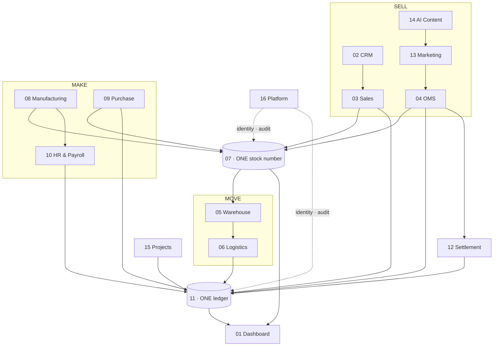

# VASTRANGAM GROUP — BUSINESS OPERATING SYSTEM
## Plan of Action

A multi-company operating system for a Surat ethnic & western fashion manufacturer running
three sister companies — D2C, six marketplaces, B2B and export on one order book, one stock
number and one ledger.

**16 modules · 78 apps.** Built in numeric order, Module 01 first through Module 16 last. Each
module is finished — every app working on the shared database, verified in a browser — before
the next begins.

---

## THE ONE LAW

Every figure traces to a record; every record traces to the document that created it. No
screen keeps its own counter. A dashboard number is a query over the ledger, never a total
someone maintained on the side.

## THE TWO THINGS EVERYTHING FUNNELS INTO

## THE FOUNDATION (groundwork, before Module 01)

One shared database under all sixteen modules — this is what lets an order move stock and
stock post to the ledger. It carries: the three companies (company ≠ brand ≠ prefix — Ethnic
Fashion trades as Go4Fashion, invoices read EF, SKUs read GF); money as integer paise, never a
float; effective-dated values (salary, price, tax rate, commission) where a missing value is
an error, never zero; an audit trail that cannot be switched off; and the cascade bus that
carries events between modules. *(This layer is written and tested; it is wired in as Module
01 begins.)*

---

# MODULE 01 · DASHBOARD & BI

Every number in the business, on one screen, as work happens.

**Apps (4):** CEO Dashboard ✓ · Report Builder ✓ · Group Consolidation ✓ · Excel Dashboard
Builder — new

**Data it owns:** none — it reads. Saved reports and dashboard layouts only.

**Screens:** 5 role dashboards (Admin, Manager, Staff, Karigar, Customer) · drag-field report
builder · group consolidation view · the 9-sheet Excel workbook (Index, Financial Summary, HR,
Purchase, Sales, Inventory & Production, GST, Expenses) from 14 source tables.

**Rules:**
- Every KPI is a live query over `journal_lines` and `stock` — no stored counters.
- Every sheet shows Vastrangam / Ethnic Fashion / Adini as three rows + one CONSOLIDATED row;
  consolidated = `=SUM` of the three, never a separate calculation.
- Group P&L = Σ(3 companies) − inter-company sales − inter-company purchases.
- FY auto-detected from the data; zero hardcoded values.

**Reads** ← every module · **Writes** → nothing

**Build tasks:** 1) rewire the three built apps off their private stores onto the shared core;
2) dashboard queries over ledger + stock; 3) the Excel builder (this reuses the proven
formula-workbook engine already in the repo); 4) browser-verify all four, both editions.

**Done when** any figure clicks down to the ledger entry or stock movement behind it.

---

# MODULE 02 · CRM

One record per customer — every lead, order, return, document and conversation, whatever
channel it came from.

**Apps (4):** CRM & Customer 360 ✓ · Documents & eSign ✓ · Helpdesk & Live Chat ✓ · Forms &
Feedback (NPS) — new

**Data it owns:** `customers` · `customer_addresses` · `customer_interactions` ·
`customer_lifecycle_events` · `loyalty_ledger` · `documents` · `tickets` · `nps_responses`.

**Screens:** customer 360 (orders, returns, value, loyalty, history on one page) · pipeline
board · document vault with e-sign send/return · ticket queue tied to the order · NPS form + a
"complaints by design" view.

**Rules:**
- Pipeline: Lead → Qualified → Quoted → Negotiation → Won → Lost; advance stops at Negotiation.
- Lifecycle by order count: New ≥1 · Repeat ≥2 · Loyal ≥4 · VIP ≥7; 90 days idle → Lapsed.
- Triggers: VIP welcome at the 7th order · win-back when a Loyal/VIP goes 90 days idle · review
  request 3 days after first delivery.
- D2C + B2B + export + walk-in + WhatsApp merge to one customer by mobile and email;
  marketplace customers stay separate (no PII shared) but tie by pattern.
- NPS answers attach to the design, so complaint-prone designs surface.

**Reads** ← every module · **Writes** → Sales · OMS · Marketing

**Build tasks:** 1) rewire the three built apps onto the core; 2) `nps_responses` + the
design-complaint view; 3) lifecycle triggers as scheduled jobs; 4) browser-verify, both
editions.

**Done when** one customer's whole cross-channel history is on one screen and a 7th order fires
the VIP trigger on its own.

---

# MODULE 03 · SALES

Counter, wholesale, export and your own website on one order book, drawing on one stock number.
A sale is finished when it is delivered and the COD is in.

**Apps (7):** D2C Sales ✓ · B2B & Credit ✓ · Export ✓ · POS ✓ · Quotes & Proforma ✓ ·
Couriers & AWB — new · Subscriptions — new

**Data it owns:** `sales_orders` · `sales_order_items` · `invoices` · `invoice_items` ·
`b2b_orders` · `b2b_credit_ledger` · `export_orders` · `customization_orders` ·
`subscriptions`.

**Screens:** cart-to-dispatch order desk · B2B credit & ageing · export docs (commercial
invoice, packing list, LUT, FIRA, IGST refund) · POS counter · quote → order · courier compare
& AWB · subscription schedule.

**Rules:**
- Shopify webhooks: order created → reserve stock → invoice → fulfil; cancelled → release.
  Stock pushed to Shopify every 15 min so it never oversells.
- Partial COD: ₹99 advance on Razorpay, balance at the door, courier remits — both legs
  auto-reconciled to one invoice.
- Credit checked before acceptance; reminders −3 days, +1 day, +7 days soft-block.
- Delivery date is derived (cut-off + transit from the warehouse that has stock), never typed;
  an order no warehouse can serve gets no date.
- Export FX variance posts to FX gain/loss; export/LUT lines are 0% GST.

**Reads** ← Inventory · CRM · Warehouse · Logistics · **Writes** → Inventory · Accounting ·
Warehouse · Logistics

**Build tasks:** 1) rewire the five built apps onto the core; 2) Couriers & AWB on the order;
3) Subscriptions engine (schedule → auto-invoice → dunning); 4) wire order → stock reserve →
invoice cascade; 5) browser-verify, both editions.

**Done when** a Shopify order appears in 60s with stock reserved and invoice raised, and a
partial-COD order reconciles both legs by itself.

---

# MODULE 04 · E-COMMERCE / OMS

Seven seller panels and your own store in one queue, one stock number back out to all of them,
and the money side closing in the same module.

**Apps (9):** Marketplace OMS ✓ · Order Management ✓ · Manual Data Check · Reconciliation ·
Claims & Disputes · Returns / RMA · Channels & Storefronts · Labels & Documents · Listing &
Catalog Manager — new

**Data it owns:** `marketplace_orders_raw` · `marketplace_settlements` ·
`marketplace_settlement_lines` · `returns` · `claims` · `channels` · `channel_listings`.

**Screens:** the dispatch queue · order pipeline · upload-your-sheets cross-check · payout
reconciliation · claims desk with a countdown · returns triage · channel connect/switch ·
label batch · bulk listing manager.

**Rules:**
- Channels: Amazon, Flipkart, Myntra, Meesho, Ajio, Nykaa, JioMart + Shopify, WooCommerce,
  Magento, Wix, custom. Orders pulled every 15 min, idempotent by external ID.
- Queue sorts by time remaining, not time received (Amazon 12h, Ajio 48h).
- Commission read from the settlement file, never assumed.
- Returns: customer ₹20 · courier ₹5 · wrong = full selling price, dead stock, never
  restocked; repeat pattern flagged as abuse.
- Labels never uploaded to an outside website to be cropped.

**Reads** ← Inventory · CRM · Sales · Accounting · Logistics · Settlement · **Writes** →
Inventory · Accounting · Warehouse · Logistics · Settlement

**Build tasks:** 1) rewire the two built apps; 2) the six unbuilt apps in order — Channels
first (the pull), then Reconciliation, Claims, Returns, Manual Data Check, Labels; 3) Listing
Manager; 4) wire pull → stock reserve → order cascade; 5) browser-verify, both editions.

**Done when** a full week runs with every channel live, settlements reconciled, no panel
oversells.

---

# MODULE 05 · WAREHOUSE

Pick right the first time, and prove what you sent.

**Apps (3):** Picking & Bins · Barcode Operations · Packing Video

**Data it owns:** `bins` · `pick_lists` · `pick_list_lines` · `barcode_scans` ·
`packing_videos`.

**Screens:** pick list in walking order · phone scanner (pick / pack / dispatch / count) ·
packing-video index by order number.

**Rules:**
- Bin-level instructions so a picker is never sent to an empty rack.
- One scan whatever the channel; every scan writes a stock movement.
- Packing footage attaches itself to the claim that needs it.

**Reads** ← Sales · OMS · Inventory · **Writes** → Inventory · Sales · OMS

**Build tasks:** 1) bins + pick-list generation from open orders; 2) barcode scan → stock
movement; 3) packing video capture + claim attach; 4) browser-verify, both editions.

**Done when** a parcel is picked from the right bin, filmed, and its clip is attached before
the claim arrives.

---

# MODULE 06 · LOGISTICS

The courier network behind the parcel — rates, failed deliveries, and the COD money.

**Apps (4 +1):** Rates & Zones · NDR & RTO Rescue · COD Remittance · Handover & Manifest ·
Fleet — new, optional

**Data it owns:** `courier_rates` · `shipments` · `ndr_cases` · `cod_remittance` ·
`manifests` · `vehicles` (fleet).

**Screens:** rate card by zone/weight/service · NDR worklist · COD collected-vs-banked · daily
manifest with a one-time handover code · fleet log.

**Rules:**
- Cheapest and fastest option both known before booking.
- NDR worked (WhatsApp/call to reconfirm) before it becomes an RTO you pay for twice.
- COD: every shortfall named and aged; second leg of partial COD reconciled here.
- Manifest keeps a signed record of parcels left behind — a lost parcel has an owner.

**Reads** ← Sales · OMS · Warehouse · **Writes** → Accounting · Sales · OMS

**Build tasks:** 1) rate cards + cheapest/fastest compare; 2) NDR workflow; 3) COD remittance
reconciliation; 4) manifest + handover code; 5) Fleet (optional); 6) browser-verify.

**Done when** COD collected reconciles to COD banked parcel by parcel and an NDR is worked
before it turns into an RTO.

---

# MODULE 07 · INVENTORY & CATALOG

One quantity per SKU, per location, per stage — the number every other module reads and writes.

**Apps (4):** Stock · Catalog / PIM · Kit & Combo SKU — new · Master-Data Hygiene — new

**Data it owns:** `designs` · `colors` · `sizes` · `items` (SKU) · `item_aliases` ·
`kit_items` · `stock` · `stock_movements` · `batches` · `opening_stock` · `hsn_codes` ·
`gst_rates` · `locations`.

**Screens:** live stock board (SKU × location × stage, heatmap) · movements log · design →
variant → SKU generator · channel-code & size/weight catalog · kit builder · duplicate
detect/merge · dead-stock register.

**Rules:**
- One stock number, event-driven — not per channel. The last Amazon piece leaves Flipkart in
  the same instant.
- 8 stages: raw → cut → stitched → thread-cut → QC → ironed → packed → dispatched. Movements
  are the ledger; quantities are the running balance.
- 4-level SKU Brand→Design→Variant→SKU, `{BRAND}-{DESIGN}-{COLOR}-{SIZE}`; the string is
  derived, search uses the fields.
- Wrong returns are dead stock — never added back. Valuation (FIFO / weighted-avg / specific)
  sets the balance sheet; stock value must equal the balance-sheet figure.
- A kit sold as one listing decrements each component.

**Reads** ← every module · **Writes** → every module

**Build tasks:** 1) design/variant/SKU generator; 2) stock board + movements (on the core's
`stock` tables); 3) kit expansion at order time; 4) catalog with channel codes + pack
size/weight; 5) master-data dedup; 6) dead-stock + valuation; 7) browser-verify, both editions.

**Done when** stock is one number across every channel, a kit sale decrements all components,
and stock valuation equals the balance sheet.

---

# MODULE 08 · MANUFACTURING

What a unit really costs to make — every operation, every worker's earning.

**Apps (6):** PLM & Development · Production Orders · Piece-rate & Contractors · BOM &
Consumption · Quality Control · Maintenance

**Data it owns:** `production_orders` · `production_stages` · `bom` · `bom_items` · `samples` ·
`karigar_assignments` · `karigar_reports` · `qc_records` · `performance_flags`.

**Screens:** spec → sample → sign-off (versioned) · 10-stage production board with WIP ·
karigar piece-rate register · BOM & consumption cost · QC accept/reject/rework · machine
maintenance log.

**Rules (karigar costing — already implemented and verified in the engine):**
- 23 garment columns → 13 set types. Pool across all karigars per design first, then apply.
- Sets = min across the *populated* member columns. Extras named (Extra Anarkali, Extra
  Plazo), never a generic bucket; no "Set + Extra" total column.
- Cost is per raw piece, independent of set completion — a surplus piece still gets paid.
- Missing rate → ₹0 and a flag, never a guess. Alter earnings = alter hours × ₹100;
  own-mistake alterations = ₹0.
- Performance flag: same person/design/task, hours > previous × 1.2 → WhatsApp asks why.

**Acceptance gate (§16A):** 143 designs · 29 karigar units · **25,307 sets · 59,110 pieces ·
₹26,90,062** · 5 no-rate designs flagged. A mismatch is a bug.

**Reads** ← Sales · Purchase · Inventory · **Writes** → Inventory · HR & Payroll · Accounting

**Build tasks:** 1) port the verified Python karigar/staff engine to the core (Python kept as
the checker — figures must match to the paise); 2) production-order board + 10 stages; 3) BOM &
consumption; 4) QC + performance flags; 5) PLM & Maintenance; 6) verify against §16A + browser,
both editions.

**Done when** three production orders run to completion (self / full job work / partial) and
the §16A totals reproduce exactly.

---

# MODULE 09 · PURCHASE

Nothing over-billed gets paid.

**Apps (2):** Procurement ✓ · Vendor Management ✓

**Data it owns:** `purchase_requisitions` · `purchase_orders` · `purchase_order_items` · `grn`
· `grn_items` · `vendor_invoices` · `three_way_match` · `vendors` · `vendor_materials` ·
`third_party_services`.

**Screens:** requisition → PO → GRN · 3-way match worklist · vendor 360 with scorecard &
ageing.

**Rules:**
- Low stock → requisition draft; PO suggests the priority-1 vendor with their last rate;
  escalation P1→P2→P3.
- 3-way match: invoice must equal received qty × PO rate; flags GRN≠PO, invoice≠grn×rate,
  invoice-before-GRN.
- PO number `PO-{FY}-####`; status DRAFT → SENT → GRN → MATCHED | MISMATCH.
- Scorecard per transaction: quality %, on-time %, rate vs market.

**Reads** ← Inventory · Manufacturing · **Writes** → Inventory · Accounting · Quality Control

**Build tasks:** 1) rewire the two built apps onto the core; 2) wire GRN → stock + 3-way-match
→ payable cascade; 3) browser-verify, both editions.

**Done when** a vendor invoice for more than was received is blocked before payment.

---

# MODULE 10 · HR & PAYROLL

Pay people right, on time — salary and output-based earnings in one register.

**Apps (3):** Staff & Contractors · Time-off & Advances · Appraisal & Hiring (ATS)

**Data it owns:** `staff_salary_history` · `attendance` · `eod_reports` · `leave_requests` ·
`advance_requests` · `payroll_runs` · `payroll_slips` · `karigar_earnings_summary` ·
`piece_rates` · `task_threshold_rates`.

**Screens:** attendance grid (WhatsApp + geofence) · monthly payroll register · salary-history
editor (effective-from) · leave & advance · appraisal + hiring pipeline · salary/earnings
slips.

**Rules (final, from the Combined Master Prompt — already in the engine):**
- Codes P·H·A·HL·OD·PL·UL; Days-Equivalent = P + HL + 0.5×H; a holiday pays a full day.
- Daily Rate = resolved monthly salary ÷ resolved threshold DAYS (both effective-dated).
  Earning = Daily Rate × Days-Equivalent, uncapped both ways.
- Flat basis: full salary regardless of attendance. Piece-rate: hours × flat ₹/hr, no
  attendance row.
- Effective-dated salary: edit once with an effective-from date; past months keep their rate,
  a future raise self-activates. Three states: Not employed / No Data / real month.
- Geofence 50 m, 15-min buffer. Advances deducted at payout. Staff Active/On Leave/Inactive —
  never deleted.

**Reads** ← Manufacturing · **Writes** → Accounting

**Build tasks:** 1) the payroll engine is the ported §3 core from Module 08's port — reuse it;
2) attendance capture + geofence; 3) leave/advance/appraisal/ATS; 4) payroll run → posts
salaries to the ledger; 5) verify against the owner's figures + browser, both editions.

**Done when** a full month's payroll runs end to end with zero manual touch and reconciles.

---

# MODULE 11 · ACCOUNTING & GST

Books that always balance. Medhava keeps the books on its own — no other package required, ever.

**Apps (9):** Accounting · Invoicing · Expenses · GST & Tax · ITC Reconciliation — new ·
Receivables/Payables & PDC — new · Fixed Assets & Depreciation — new · Year-End Close & Period
Lock — new · Finance Reports

**Data it owns:** `chart_of_accounts` · `voucher_series` · `journal_entries` · `journal_lines`
· `gst_returns` · `gst_input_credit` · `tds_entries` · `tcs_entries` · `bank_accounts` ·
`bank_transactions` · `fixed_assets` · `depreciation_entries` · `post_dated_cheques` ·
`bill_allocations` · `period_locks`.

**Screens:** voucher entry (9 types) · GST invoice with round-off & IRN · expense capture +
OCR · GST returns (1/3B/9) · 2A/2B reconciliation · receivables/payables ageing + PDC register
· fixed-asset register + depreciation · year-end close · the 11 reports.

**Rules:**
- One posting engine — every voucher writes the ledger through it; entries balance or they
  don't post.
- CGST+SGST vs IGST auto-determined from the two GSTINs' state codes; rates versioned by
  effective date; ITC-eligibility flag per line.
- 2A/2B reconciliation before GSTR-3B. Bill-wise allocation (FIFO or chosen); PDC posts on
  realisation date. Fixed assets SLM and WDV both.
- Round-off posts to its own ledger. Period locking: no backdated edit without an admin unlock,
  and the unlock is logged. MCA audit trail — cannot be disabled, 8 years.

**Reads** ← every module · **Writes** → Finance Reports

**Build tasks (order fixed by the spec):** 1) chart of accounts + posting engine (already in
the core) + audit from day one; 2) Sales & Purchase Invoice, verify Trial Balance; 3) the other
seven voucher types; 4) year-end close + period lock; 5) GST returns + 2A/2B; 6) receivables/
payables/PDC, fixed assets, reports; 7) browser-verify, both editions.

**Done when** one month of books closes cleanly and GSTR-1 + GSTR-3B generate and verify.

---

# MODULE 12 · SETTLEMENT

Get paid what you are owed, cycle by cycle.

**Apps (3):** Payout Cycles · Fee & Commission Audit · TCS & TDS Register

**Data it owns:** `settlement_cycles` · `fee_audit_lines` · `tcs_tds_register` (reads
`marketplace_settlements` from Module 04).

**Screens:** cycle tracker (should-land vs landed vs when) · published-rate vs charged-rate
audit by category/SKU + tier · TCS/TDS matched to the portal.

**Rules:**
- Portal auto-detected from the file shape. Expected = SP − commission − TCS − GST; flag
  variance > ₹1 or > 0.5%. Commission never assumed.
- Variance kinds: commission overcharged · TCS miscalc · SPF higher than agreed · unbilled
  returns · weight discrepancy · lost in transit.
- A silent commission increase is caught the first time it applies; days-remaining on a claim
  sit next to the amount.
- **Gate: ≥98% settlement match; SKU profit within ₹10 of your records.**

**Reads** ← OMS · Accounting · **Writes** → Accounting

**Build tasks:** 1) portal detect + per-line match; 2) variance categories + claim raise; 3)
fee audit + tier watch; 4) TCS/TDS register; 5) reconciled lines post to books; 6) verify
against a real settlement file (≥98%) + browser.

**Done when** a real settlement file reconciles ≥98% and its variances are ones you agree are
real.

---

# MODULE 13 · MARKETING

Sell more without discounting.

**Apps (6):** Social Calendar · Campaigns · Repricing Engine · Automation · Blog & Pages ·
Events — new

**Data it owns:** `content_calendar` · `campaigns` · `influencers` · `asset_library` ·
`repricing_rules` · `automation_recipes` · `events`.

**Screens:** 7-platform calendar · campaign board (ROAS on revenue) · repricing rules + effect
· automation recipe builder · blog/page editor · event booth/leads.

**Rules:**
- Campaign spend from the ad platforms; ROAS computed on revenue, not opens.
- A price that rose and cut orders shows exactly that, next to the rule that raised it; every
  change audited; repricing never breaks the single stock number.
- Automation recipes: stock < reorder → draft PO + WhatsApp admin; B2B invoice 3 days to due →
  reminder.

**Reads** ← Inventory · CRM · **Writes** → Sales · OMS

**Build tasks:** 1) calendar + campaigns; 2) repricing engine → channel price with audit; 3)
automation recipe engine; 4) blog/pages + events; 5) browser-verify, both editions.

**Done when** a month of content publishes on schedule and a repricing rule can be judged on
what it did to orders.

---

# MODULE 14 · AI CONTENT ENGINE

Write it, shoot it, cut it — from the catalogue you already have.

**Apps (5):** Content Engine · Image Studio · Video Studio · Design Studio · Publisher

**Data it owns:** `ai_runs` · `ai_listings` · `ai_design_analytics` · project state for each
studio.

**Screens:** 14-stage content pipeline · layered image editor · text/image-to-video · design
surface · publish-everywhere with a live/rejected report.

**Rules:**
- Structured data gets keywords; anything a human reads gets feelings. Product nouns banned
  from creative surfaces.
- Draft → 12-point self-critique → rewrite, with session voice memory.
- Generation Studio stays badged a mockup until a paid API is wired — never shown as live.

**Reads** ← Inventory · **Writes** → Marketing · OMS

**Build tasks:** 1) fold the existing standalone Content/Image/Design work onto the core off
the catalogue; 2) Publisher (push + live/rejected report); 3) Video Studio in labelled stages;
4) browser-verify, both editions.

**Done when** a listing generates for one design across six platforms in under 20s and
publishes, rejections explained.

---

# MODULE 15 · PROJECTS & COLLABORATION

The work that is not an order — and the talking around it.

**Apps (6):** Projects & Cases · Timesheets & Planning · Approvals · Forum · Discuss ·
Knowledge Base — new

**Data it owns:** `projects` · `timesheets` · `approvals` · `forum_posts` · `discussions` ·
`knowledge_base`.

**Screens:** project/case board with billable time & real cost · timesheet grid · one approval
queue · forum · record-attached discussion threads · role-scoped SOP wiki.

**Rules:**
- A project, case, engagement or job — the same record with different words.
- Billable time turns straight into an invoice and a real cost, in the ledger.
- Every approval decision goes to the audit record; a decision's reason sits next to it a year
  later.

**Reads** ← CRM · Sales · HR · Inventory · **Writes** → Accounting · HR · CRM

**Build tasks:** 1) projects + timesheets → billable → invoice; 2) unified approvals queue →
audit; 3) forum + discuss; 4) knowledge base; 5) browser-verify, both editions.

**Done when** billable time on a case becomes an invoice and a cost without being re-keyed.

---

# MODULE 16 · PLATFORM

The spine every module runs on — who can see what, how it's configured, and a record of
everything that ever happened.

**Apps (3):** Identity, Settings & Audit ✓(partial) · Ask & Print ✓ · Communications — new

**Data it owns:** `companies` · `users` · `user_companies` · `audit_log` ·
`integration_errors` · `settings_environment` · `whatsapp_messages` · `whatsapp_broadcasts` ·
`email_campaigns` · `notifications`.

**Screens:** users/roles/permissions · company switcher + read-only Group view · tax &
numbering setup · provider config + integration health · audit browser · Ask & Print · WhatsApp
command console + broadcasts.

**Rules:**
- Roles Admin/Manager/Staff/Karigar/Customer, per-company per-role; Praveen & Vishal see all
  three.
- Company ≠ brand ≠ prefix (separate fields). Staff Active/On Leave/Inactive — never deleted.
- Audit trail cannot be switched off — MCA rule, 8 years, before-and-after values.
- Every capability has 3+ interchangeable vendors; a vendor named as the *source of a figure*
  is a bug.
- WhatsApp commands IN / OUT / LEAVE / ADVANCE / REPORT / Print. 5 scheduled jobs. Broadcast
  safety: official API, 200/day warm-up, STOP keyword.
- This app never asks for a marketplace, bank or account password.

**Reads** ← every module · **Writes** → every module

**Build tasks:** 1) finish Identity: login, per-company per-role permissions, company switcher,
Group view; 2) audit browser over the core's audit trail; 3) provider config + health; 4)
Communications (WhatsApp/email/SMS + 5 jobs); 5) browser-verify, both editions.

**Done when** a karigar sees only their own earnings, an admin switches all three companies and
the figures change, and every edit in the test is in the audit browser.

---

# BUILD ORDER

**Foundation → 01 → 02 → 03 → 04 → 05 → 06 → 07 → 08 → 09 → 10 → 11 → 12 → 13 → 14 → 15 → 16.**

Each module is built completely before the next starts. Where a module reads data a
later-numbered module will write, it is finished against the data that exists on its day and
shows more as later modules come online — Module 01's dashboard is real from day one and grows
as Module 11's ledger fills.

| Module | Apps | Built | To build |
|---|---|---|---|
| 01 Dashboard & BI | 4 | 3 | 1 |
| 02 CRM | 4 | 3 | 1 |
| 03 Sales | 7 | 5 | 2 |
| 04 E-commerce / OMS | 9 | 2 | 7 |
| 05 Warehouse | 3 | 0 | 3 |
| 06 Logistics | 4 (+1) | 0 | 4 (+1) |
| 07 Inventory & Catalog | 4 | 0 | 4 |
| 08 Manufacturing | 6 | 0 | 6 |
| 09 Purchase | 2 | 2 | rewire |
| 10 HR & Payroll | 3 | 0 | 3 |
| 11 Accounting & GST | 9 | 0 | 9 |
| 12 Settlement | 3 | 0 | 3 |
| 13 Marketing | 6 | 0 | 6 |
| 14 AI Content Engine | 5 | 0 | 5 |
| 15 Projects & Collaboration | 6 | 0 | 6 |
| 16 Platform | 3 | 1 | 2 |
| **Total** | **78** | **16** | **62** |

---

# WHEN IS A MODULE DONE

1. Every app built, not stubbed.
2. It reads and writes the shared database — no private store.
3. Every cascade it declares actually fires, proved by a test.
4. Its figures reconcile to your own records (the §16A totals where they exist).
5. A real headless-browser run: every screen, every action, zero console errors.
6. Both editions build — Medhava (industry-neutral) and Vastrangam.
7. Manual, PDF and screenshots generated.
8. Every deliverable labelled tool / stub / mockup / spec — nothing called finished that isn't.

**The proof, re-run at every module boundary:** sell one garment on a marketplace and follow
it — order in OMS, stock down in Inventory, pick in Warehouse, AWB in Logistics, revenue and
GST in Accounting, payout matched in Settlement, karigar paid in Manufacturing, all of it on
the dashboard. One transaction, eight modules, one database.
