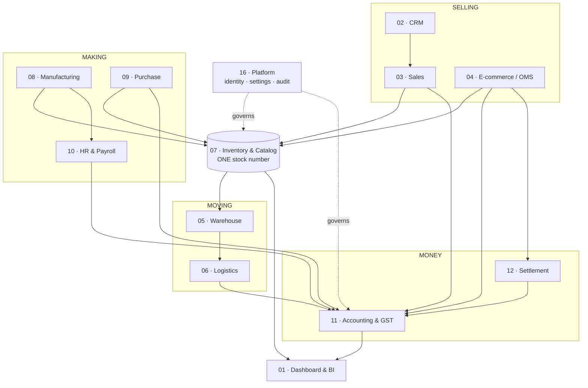
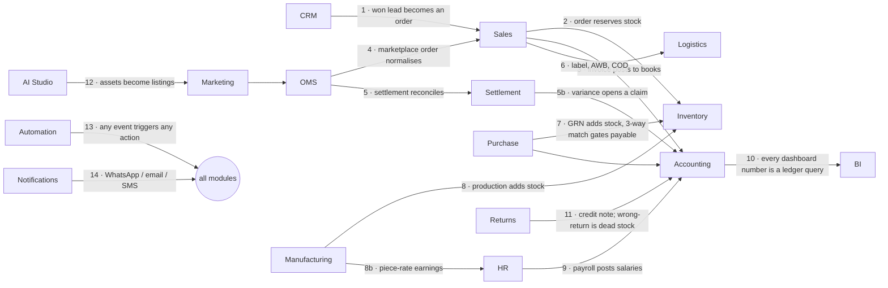
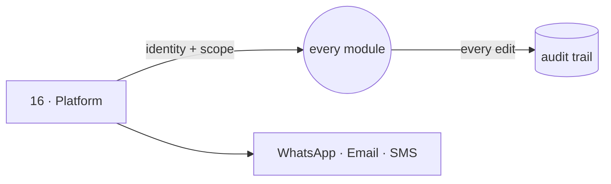
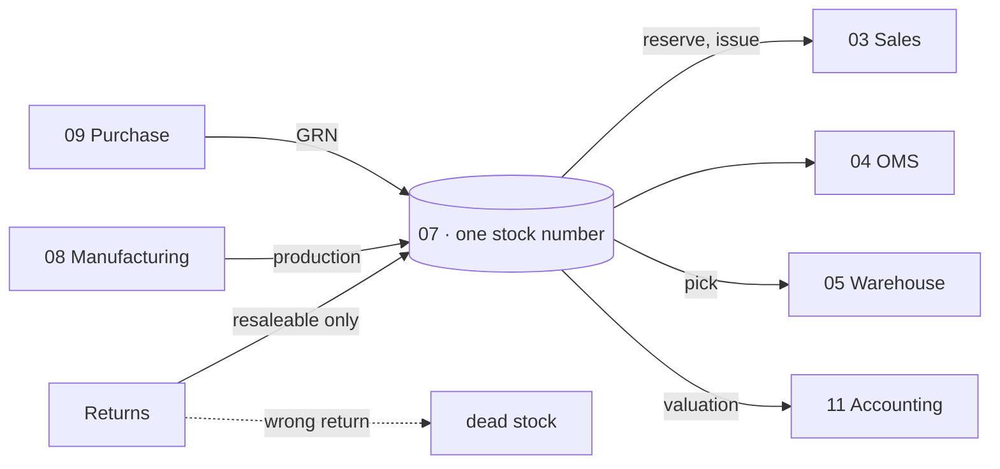
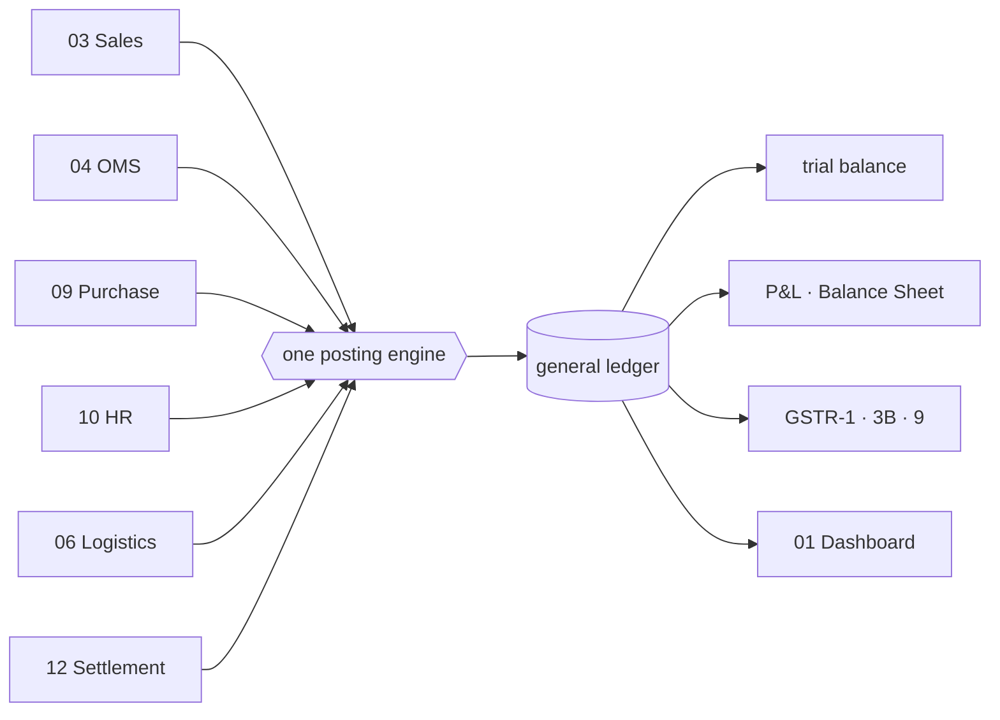
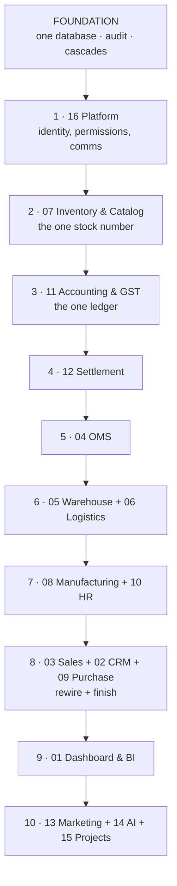

# PLAN OF ACTION
## Vastrangam Group — Business Operating System

**For your reading and approval. Nothing gets built from this until you say so.**

Every module, every point it must carry, how it wires to the others, and the order to build
them in. Where a rule came from a document, the document is named so you can check it.

---

# PART 0 · THE COUNT, RE-DERIVED

You asked the right question: *"if there was 63 apps before and then I added the missing gap,
then busy apps, power bi prompt and many others — how are you again finishing in 16 modules
and 63 apps?"*

I was quoting a stale number. `brand/site/modules.js` says 65 apps, and that file was written
before the feature-gap additions, before the BUSY accounting depth, before the Power BI
specification. Repeating it meant every later thing you added had nowhere to go.

Here is the honest re-derivation, layer by layer.

## 0.1 · The six layers of source material

| # | Source | What it contributes |
|---|---|---|
| 1 | `brand/site/modules.js` | the published list — **16 modules, 65 apps** |
| 2 | ERP Master Prompt v2 §A.7 | a **20-module** cut of the same ground; two of its modules (Communications, Documents) have no app in layer 1 |
| 3 | Feature-Gap analysis §D | **12 additions**, "opted into the ERP" — 7 of them have no home in layer 1 |
| 4 | BUSY Accounting Master Prompt | module 11 is not 5 apps. 9 voucher types, 11 reports, ITC 2A/2B matching, PDC, fixed assets, period locking, budgets |
| 5 | Power BI Dashboard Prompt | a generated 9-sheet workbook from 14 source tables — a deliverable in its own right |
| 6 | Book 2 §§4–15 + Part II | **15 proven browser-tool engines** the ERP must match, and the §16A acceptance numbers |

## 0.2 · Where each addition lands

| Addition | Source | Lands in | Status |
|---|---|---|---|
| Kit / Combo / Bundle SKU | gap #1 | 07 Inventory | **new app** |
| Listing & Catalog Manager | gap #2 | 04 OMS | **new app** |
| Repricing Engine | gap #3 | 13 Marketing | already listed |
| NDR / RTO Workflow | gap #4 | 06 Logistics | already listed |
| Subscriptions / Recurring | gap #5 | 03 Sales | **new app** |
| Forms & Feedback (NPS) | gap #6 | 02 CRM | **new app** |
| Recruitment (ATS) | gap #7 | 10 HR | folds into Appraisal & Hiring |
| Knowledge Base / SOP wiki | gap #8 | 15 Projects | **new app** |
| Events | gap #9 | 13 Marketing | **new app** |
| Barcode Operations | gap #10 | 05 Warehouse | already listed |
| Master-Data Hygiene | gap #11 | 07 Inventory | **new app** |
| Fleet | gap #12 | 06 Logistics | **new, optional** |
| Communications (WhatsApp/SMS/email) | ERP module 17 | 16 Platform | **new app — had no home at all** |
| Excel Dashboard Builder | Power BI prompt | 01 Dashboard | **new app** |
| ITC Reconciliation (GSTR-2A/2B) | Accounting §9 | 11 Accounting | **new app** |
| Receivables, Payables & PDC | Accounting §10 | 11 Accounting | **new app** |
| Fixed Assets & Depreciation | Accounting §11 | 11 Accounting | **new app** |
| Year-End Close & Period Lock | Accounting §8 | 11 Accounting | **new app** |

## 0.3 · The true number

| # | Module | modules.js | Added | **Total** | Built |
|---|---|---|---|---|---|
| 01 | Dashboard & BI | 3 | +1 | **4** | 3 |
| 02 | CRM | 3 | +1 | **4** | 3 |
| 03 | Sales | 6 | +1 | **7** | 5 |
| 04 | E-commerce / OMS | 8 | +1 | **9** | 2 |
| 05 | Warehouse | 3 | — | **3** | 0 |
| 06 | Logistics | 4 | +1 opt | **4 (+1)** | 0 |
| 07 | Inventory & Catalog | 2 | +2 | **4** | 0 |
| 08 | Manufacturing | 6 | — | **6** | 0 |
| 09 | Purchase | 2 | — | **2** | 2 |
| 10 | HR & Payroll | 3 | — | **3** | 0 |
| 11 | Accounting & GST | 5 | +4 | **9** | 0 |
| 12 | Settlement | 3 | — | **3** | 0 |
| 13 | Marketing | 5 | +1 | **6** | 0 |
| 14 | AI Content Engine | 5 | — | **5** | 0 |
| 15 | Projects & Collaboration | 5 | +1 | **6** | 0 |
| 16 | Platform | 2 | +1 | **3** | 1 |
| | **Total** | **65** | **+13** | **78 (+1 optional)** | **16** |

**16 modules · 78 apps · 16 built.** Not 65. The modules stay at 16 because the 20-module cut
is the same ground sliced differently — but the app count moves, and it moves because of the
material you added after that list was written.

**Depth is not in this count.** Module 14's five apps must reach the Canva/Photoshop
blueprint's five phases. Module 08 must reproduce §16A's 25,307 sets and ₹26,90,062. Module 11
must satisfy a 250-line accounting specification. The count says how many screens; it does not
say how much is behind each one.

---

# PART 1 · HOW THE SYSTEM WORKS

## 1.1 · The one law

Every figure traces to a record, and every record traces to a document that created it.
No screen keeps its own copy of a number.

> *"Every financial figure must trace back to a ledger entry, and every ledger entry must
> trace back to a voucher. No report should ever compute a number independently of the
> ledger… numbers must always reconcile, or the business owner stops trusting the software
> entirely."* — Accounting Master Prompt §16

## 1.2 · The shape of it



Everything funnels into two places: **one stock number** and **one ledger**. That is what
makes the dashboard true.

## 1.3 · The fourteen cascades

These are enumerated in the ERP document and declared in `modules.js`. Today nothing executes
them — which is the single reason the existing apps are a suite of demos rather than a system.



## 1.4 · What "module-wise fully functioning" means

You said you don't want single apps — you want a module that works. A module is **done** only
when all of this is true:

1. Every app in the module is built, not stubbed.
2. It reads and writes the shared core — no private store.
3. Every cascade it declares actually fires, proved by a test.
4. Its figures reconcile to your own records (§16A where targets exist).
5. It passes a real headless-browser run: every screen, every action, zero console errors.
6. Both editions build — Medhava (industry-neutral) and Vastrangam.
7. Manual + PDF + screenshots generated.
8. Labelled honestly: **tool / stub / mockup / spec**. Nothing called finished that isn't.

> *"A module is 'done' only when it runs on real data and reconciles."* — Honesty Charter §17

---

# PART 2 · THE MODULES

Each module below: what it is · every point it must carry · its apps · what it reads and
writes · its wiring · what "done" means.

---

## FOUNDATION — built before any module

Not a module. The spine every module stands on.

- **One database.** Multi-company: company ≠ brand ≠ prefix (Ethnic Fashion trades as
  Go4Fashion, invoices read EF, SKUs read GF — three separate fields).
- **Money as integer paise.** Never float.
- **Effective-dated values.** Salary, threshold, price, tax rate, commission. Zero rows in
  force is an error, never zero.
- **The audit trail.** MCA rule: every edit, old and new value, cannot be disabled, 8 years.
- **The cascade bus.** Subscriptions derived from `modules.js` so copy and code cannot drift.
- **The 4-level SKU:** Brand → Design → Style-Variant → SKU, `{BRAND}-{DESIGN}-{COLOR}-{SIZE}`.

**Done when** one order moves stock in a second module and posts to the ledger in a third, in
one transaction, trial balance balancing, audit row for each — and when the ledger refuses,
the stock never moved.

---

## 16 · PLATFORM — **BUILD FIRST**

**3 apps** · 1 built

Identity, permissions and the audit browser. Everything else assumes it, so it cannot be
retrofitted.

- Login; roles Admin · Manager · Staff · Karigar · Customer
- Per-company per-role permissions; Praveen + Vishal see all three companies
- Company switcher, default Vastrangam; read-only **Group** view
- Staff lifecycle: Active / On Leave / Inactive — **never deleted**
- Provider configuration — every capability has 3+ interchangeable vendors
- Integration health; environment variables, encrypted
- **Communications**: WhatsApp commands (`IN` `OUT` `LEAVE` `ADVANCE` `REPORT`), broadcasts,
  5 scheduled jobs, email, SMS
- Audit browser — who changed what, when, from what to what

| App | Status |
|---|---|
| Identity, Settings & Audit | to build |
| Communications | to build (had no home before) |
| Ask & Print | built |



**Done when** a karigar logs in and sees only their own earnings, an admin switches all three
companies and the figures change, and every edit made during the test appears in the audit
browser.

---

## 07 · INVENTORY & CATALOG — **BUILD SECOND**

**4 apps** · 0 built

*"The most important number in the system: one quantity per SKU, per location, per stage —
read and written by every other module."*

- One stock number, event-driven — **not per channel**. Last piece sold on Amazon leaves
  Flipkart in the same instant, not as a cancellation three hours later
- Stock by SKU × location × **stage**: raw → cut → stitched → thread-cut → QC → ironed →
  packed → dispatched
- Movements are immutable; quantities are their running balance
- Closing = Opening + Net Purchase + Production (Set + Unset + Job Work) − Net Sales
- **Wrong returns are dead stock — never added back**
- Valuation method explicit: FIFO / weighted average / specific cost — it sets the balance
  sheet, not a display preference
- Multi-UOM: fabric bought in kg, sold as pieces
- **Kit / Combo SKU** — a 3-piece set sold as one listing decrements each component
- **Master-Data Hygiene** — fuzzy duplicate detect and merge; protects every downstream report
- Dead-stock analyser: not moved in 60+ days, ranked by tied-up capital
- Reservation on order, auto-released after 48h

| App | Status |
|---|---|
| Stock | to build |
| Catalog / PIM | to build |
| Kit & Combo SKU | to build (new) |
| Master-Data Hygiene | to build (new) |



**Done when** stock is one number across every channel, a kit sale decrements all components,
and stock valuation equals the balance-sheet figure.

---

## 11 · ACCOUNTING & GST — **BUILD THIRD**

**9 apps** · 0 built · *the largest module, and 5 in `modules.js` was wrong*

Every other module posts into it, so building it early means everything after it is wired
correctly at birth rather than retrofitted.

- **One posting engine.** Every voucher type writes the ledger through it — *"this is where
  most home-built accounting tools break"*
- 9 voucher types: Sales · Purchase · Credit Note · Debit Note · Payment · Receipt · Journal ·
  Contra · POS — credit/debit notes must reference the original invoice
- Chart of accounts, Indian hierarchy, pre-seeded
- GST: CGST+SGST vs IGST **auto-determined from the two GSTINs' state codes**, never chosen by
  hand; RCM flag; ITC-eligibility per line; rates versioned by effective date
- GSTR-1 / 3B / 9 as portal-format JSON; HSN summary
- **ITC reconciliation** against GSTR-2A/2B — *"without it, GSTR-3B filing is essentially a
  guess"*
- **Bill-wise allocation** — a payment settles named invoices, FIFO or chosen; partial
  settlement; true per-invoice balance
- **Post-dated cheques** — a register, posting on realisation date, not cheque date
- **Fixed assets** — SLM **and** WDV, because book and tax depreciation differ
- **Year-end close** — P&L resets, balance sheet carries forward, years stay separable
- **Period locking** — no backdated edit without an admin unlock, and the unlock is logged
- **Round-off to its own ledger** — never absorbed into the sale, which would corrupt GST
- TDS by section (194C/194J…), Form 26Q, Form 16A; TCS on marketplace settlements
- Bank reconciliation; 11 core reports; ratios; Budget vs Actual; cost-centre P&L
- Group P&L = Σ(3 companies) − inter-company sales − inter-company purchases

| App | Status |
|---|---|
| Accounting (COA + vouchers + posting engine) | to build |
| Invoicing (+ templates, round-off, e-invoice IRN) | to build |
| Expenses | to build |
| GST & Tax (returns, TDS, TCS) | to build |
| **ITC Reconciliation (2A/2B)** | to build (new) |
| **Receivables, Payables & PDC** | to build (new) |
| **Fixed Assets & Depreciation** | to build (new) |
| **Year-End Close & Period Lock** | to build (new) |
| Finance Reports (+ MIS, ratios, budget) | to build |



**Build order inside the module** is prescribed by the specification itself: posting engine
first, audit trail wrapping every write from day one, then Sales and Purchase Invoice verified
against Trial Balance, then the other seven vouchers, then year-end and period locking, then
GST returns and 2A/2B last.

**Done when** one month of books closes cleanly and GSTR-1 + GSTR-3B generate and verify.

---

## 12 · SETTLEMENT — **BUILD FOURTH**

**3 apps** · 0 built · *"the biggest money-recovery module"*

- Import settlement + return files; **auto-detect the portal** from the file shape
- Match each settlement line to its order line
- Expected = SP − commission − TCS − GST; flag variance **> ₹1 or > 0.5%**
- **Commission is never assumed** — it is read from the actual settlement file
- Variance categories: commission overcharged · TCS miscalculated · SPF higher than agreed ·
  unbilled returns · weight discrepancy · lost in transit
- One-click dispute with an evidence pack; claims have a clock, and a claim closed for no
  response is worth nothing
- Per-order and per-SKU P&L, 20 columns, profit after every fee
- Net TCS and TDS per settlement; reconciled lines post to books with channel-specific splits
- **Acceptance gate: ≥98% settlement match, SKU profit within ₹10 of your records**

| App | Status |
|---|---|
| Payout Cycles | to build |
| Fee & Commission Audit | to build |
| TCS & TDS Register | to build |

**Done when** a real settlement file reconciles ≥98% and the variances it finds are ones you
agree are real.

---

## 04 · E-COMMERCE / OMS — **BUILD FIFTH**

**9 apps** · 2 built

- Every marketplace and storefront in **one queue** — Amazon, Flipkart, Myntra, Meesho, Ajio,
  Nykaa, JioMart + Shopify, WooCommerce, Magento, Wix, custom
- Orders pulled every 15 minutes, **idempotent by external ID**; raw JSON kept first
- Queue sorts by **time remaining, not time received** — Amazon gives 12 hours, Ajio 48
- Return costs: customer ₹20 · courier ₹5 · wrong = full selling price, dead stock
- Price parity checked across every panel
- Labels: crop to your label size, your own code printed large, invoice and packing slip
  merged, batch to the label printer — **never uploaded to an outside website**
- Channel connect/disconnect without touching data; a channel's own report is a first-class
  input where there is no API
- **Listing & Catalog Manager** — bulk push from one Item master; detect "listed but
  out-of-stock / unlisted but in-stock"
- Manual Data Check — upload the sheets you already download, get ten cross-checks back

| App | Status |
|---|---|
| Marketplace OMS · Order Management | built |
| Manual Data Check · Reconciliation · Claims & Disputes · Returns/RMA · Channels & Storefronts · Labels & Documents | to build |
| **Listing & Catalog Manager** | to build (new) |

**Done when** a full week runs with every channel live and settlements reconciled.

---

## 05 · WAREHOUSE and 06 · LOGISTICS — **BUILD SIXTH**

**3 + 4 (+1) apps** · 0 built

**Warehouse** — pick lists in walking order · barcode scan to pick, pack, dispatch, count ·
packing video indexed by order number so a wrong-item claim is answered with the clip.

**Logistics** — every courier's rate card by zone, weight and service before you book ·
**NDR/RTO rescue**: work a failed delivery while it can still be saved · COD remittance,
parcel by parcel, every shortfall named and aged · handover manifest with a one-time code, so
a parcel lost between your table and their van has an owner · Fleet (optional).

**Done when** a parcel is picked, packed on video, booked, tracked and its COD reconciled.

---

## 08 · MANUFACTURING and 10 · HR & PAYROLL — **BUILD SEVENTH**

**6 + 3 apps** · 0 built · *this is where the verified karigar & staff engine lands*

**Manufacturing** — 10-stage pipeline · four production modes (self / full job work / partial
/ mixed) · BOM versioning · sample approval · QC with alter quantities · performance flags
(same person, same design, same task, hours > previous × 1.2 → WhatsApp asks why) · 7 named
third-party services.

**Karigar costing — locked, and already implemented and tested:**
- 23 garment columns → 13 set types
- Pool across **all** karigars per design first, then apply the set formula
- **Sets = min across the populated member columns**
- Extras named, never a generic bucket; no "Total Pieces (Set + Extra)" column
- Cost is **per raw piece, independent of set completion** — a surplus piece still gets paid
- Missing rate → ₹0 **and a flag**, never a guess
- Alter earnings: `+ admin-assigned alter hours × ₹100`; own-mistake alterations = ₹0

**HR & Payroll** — attendance P/H/A/HL/OD/PL/UL · geofence 50 m, 15-min buffer · EOD wizard ·
effective-dated salary · **daily rate = salary ÷ threshold days** · holiday pays as a full
present day · Flat and piece-rate exceptions · advances · festival leave · salary slips.

**Acceptance gate (§16A):** 143 designs · 29 karigar units · **25,307 sets · 59,110 pieces ·
₹26,90,062** · 5 no-rate designs flagged.

**Done when** those numbers reproduce exactly and a full month's payroll runs with no manual
touch.

---

## 03 · SALES · 02 · CRM · 09 · PURCHASE — **BUILD EIGHTH**

**7 + 4 + 2 apps** · 5 + 3 + 2 built

Mostly built; needs rewiring onto the core, plus Couriers & AWB, Subscriptions, and Forms/NPS.

- D2C: Shopify sync both ways, three shopping modes, **partial COD** (₹99 advance, balance on
  delivery, both legs auto-reconciled), loyalty tiers
- B2B: credit limits, ageing, reminders at −3 days / +1 day / +7 days soft block, tiers
- Export: Commercial Invoice, Packing List, LUT bond, FIRA, IGST refund, FX variance
- Purchase: vendor priority P1→P2→P3, last-rate suggest, **3-way match**, scorecards

---

## 01 · DASHBOARD & BI — **BUILD NINTH**

**4 apps** · 3 built

- Every number a query on the ledger and the stock table — **never a separate counter**
- **Every sheet shows Vastrangam / Ethnic Fashion / Adini + one CONSOLIDATED row. No
  exceptions**
- Consolidated is `=SUM` of the three above, never a separate calculation
- Group P&L with inter-company eliminated
- **Excel Dashboard Builder** — the 9-sheet workbook from 14 source tables, FY auto-detected,
  every figure a live formula, zero hardcoded values
- 5 role dashboards: Admin · Manager · Staff · Karigar · Customer

---

## 13 · MARKETING · 14 · AI CONTENT · 15 · PROJECTS — **BUILD LAST**

**6 + 5 + 6 apps** · 0 built

Marketing — content calendar across 7 platforms · campaigns with ROAS · **repricing engine** ·
automation recipes · **Events** (Surat expos → leads → CRM).

AI Content Engine — Content Engine (structured data gets keywords, anything a human reads gets
feelings) · Image Studio · Design Studio · Video Studio · Publisher. The Canva/Photoshop
blueprint's five phases set the depth here; its own estimate is 12–20 months for full parity,
so this module ships in stages and each stage is labelled honestly.

Projects — projects & cases · timesheets · approvals · forum · discuss · **Knowledge Base**
(cutting SOP, QC checklist, packing standard, marketplace playbooks).

---

# PART 3 · THE ORDER, AND WHY



| Position | Why there |
|---|---|
| Foundation | 78 apps with 78 private databases is not a system. Nothing else can be right first. |
| **16 Platform** | every module needs identity, company scope and the audit trail. Retrofitting permissions is a rewrite. |
| **07 Inventory** | every module reads or writes stock. Build it before anything that touches it. |
| **11 Accounting** | every module posts into the ledger. Build it early and everything after is wired correctly at birth. |
| 12 Settlement | needs the ledger. Biggest money recovery — earliest cash return. |
| 04 OMS | needs stock, ledger and settlement to be honest about profit. |
| 05 + 06 | fulfilment sits on top of orders. |
| 08 + 10 | needs stock and the ledger to post production and payroll into. The engine is already verified. |
| 03 + 02 + 09 | largely built; rewiring is cheaper once the core is proven. |
| 01 Dashboard | reads everything, so it goes after there is something true to read. |
| 13 + 14 + 15 | reach and polish. Valuable, but nothing else waits on them. |

**Start with module 16 · Platform.**

---

# PART 4 · WHAT ALREADY EXISTS

| | Count | What happens to it |
|---|---|---|
| Deep apps (modules 01, 02, 03, 04, 09, 16) | 16 | rewired onto the core in step 8; screens and engines unchanged |
| Shallow demos in `brand/suite/out/` | 16 | superseded module by module — never deleted before their replacement is verified |
| Karigar & staff engine (Python, 251 tests) | — | ported to the core in step 7, Python kept as the independent checker |
| `core/` foundation code | — | **built but parked** — nothing depends on it until you approve this plan |

---

# PART 5 · HOW EACH MODULE IS VERIFIED

```
node core/tests/cascades.js       every declared cascade fires
node core/tests/acceptance.js     the §16A known-good totals
node brand/suite/deep/audit.js    structural audit
node brand/suite/deep/verify_mNN  real browser: every screen, every action, zero errors
python3 engine/tests/selftest.py  the karigar/staff oracle stays green
```

**The end-to-end proof, re-run at every module boundary:** sell one garment on a marketplace
and follow it — order in OMS, stock down in Inventory, pick list in Warehouse, AWB in
Logistics, revenue and GST in Accounting, payout matched in Settlement, karigar paid in
Manufacturing, all of it on the dashboard. One transaction, eight modules, one database.

---

# PART 6 · WHAT I STILL OWE YOU

Reading not yet finished, and it continues alongside the build rather than blocking it:
**68 images**, the Material tool spec, Part III's fuller Power BI text, the Universal prompt,
and one `.docx`. Everything read so far is recorded in `SOURCE_REGISTER.md` with line
references you can check.

Files still needed from you, and these are the last time I will list them:
`Vastrangam_Master_Excel_Sheet_[FY].xlsx` (14 sheets, contains the stitching rate master) ·
`Karigar_Reports_April_2025_to_June_2027.xlsx` (the §16A gate) · the 5 BUSY `.bds` files
(opening balances).

---

*Nothing in this plan gets built until you approve it.*
