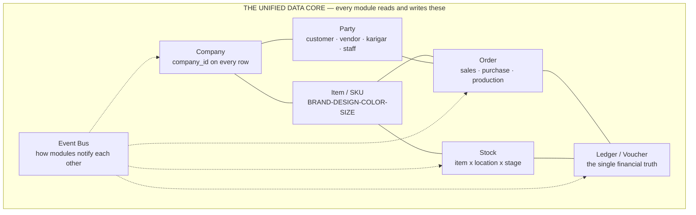
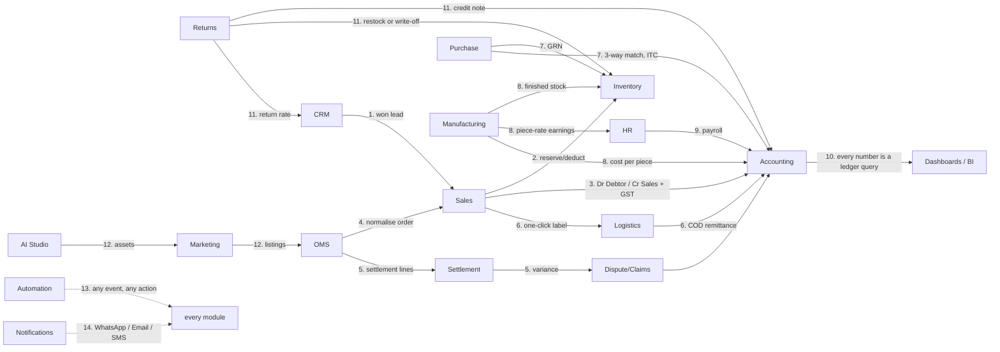
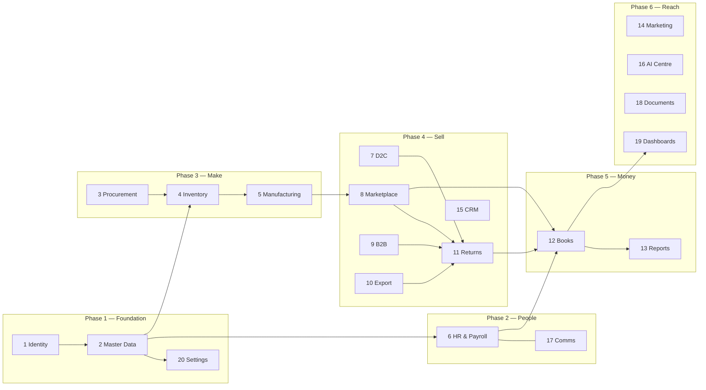
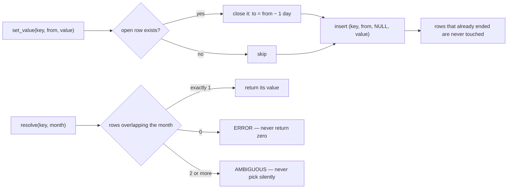
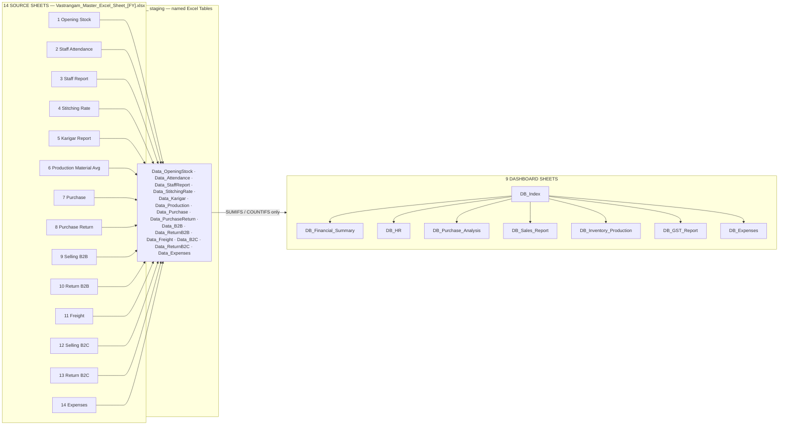
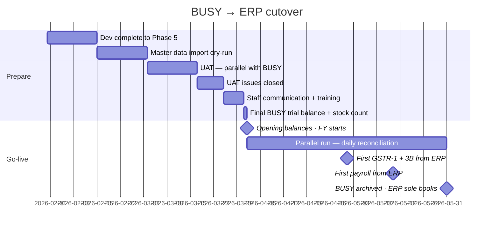
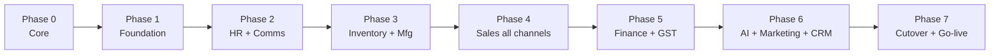

# VASTRANGAM GROUP ERP — PROJECT REPORT v2

**Every module, every rule, every conflict, and the order to build it.**

Vastrangam · Ethnic Fashion (Go4Fashion) · Adini Couture — Surat
Version 2 · 12 August 2026 · Confidential

---

## WHAT CHANGED SINCE VERSION 1

Version 1 of this report was written after reading about **7%** of the master document.
I extracted its text, read roughly 300 of its 4,349 lines, grepped for headings, and
described that as having read it. This version is written after reading the rest.

The sections I had never opened, and what was in them:

| Section | Lines | Contents |
|---|---|---|
| B.1 Database schema | 335 | 13 table groups, ~90 tables, every column |
| B.2 Module specs 1–20 | 333 | Screens, flows, formulas, RLS patterns, vendor lists |
| B.3 API surface | 55 | ~40 REST routes, 5 inbound webhooks |
| B.4 Integrations map | 31 | 15 external systems |
| B.5–B.7 | 40 | PWA/Capacitor, security, DPDP, 8 performance targets |
| C.1–C.9 | 150 | Cutover D-60→D+60, opening balances, smoke tests, runbooks, risks, metrics |
| D.1–D.4 | 80 | Replacement map, brand reference, glossary, canonical roster |
| Accounting engine | 220 | The BUSY-equivalent core |
| Book 2 §3–§17 | 240 | **The locked business logic for all 12 tools** |
| Part II tool specs | 469 | The verbatim authoritative specifications |
| Part III Power BI | 1,628 | 9 dashboard sheets, 14 source sheets |

Reading them produced **six rule conflicts**, **one previously unknown acceptance
dataset**, and **eight rules never implemented**. All are in Book 0.

**How claims are labelled throughout, and the labels are kept honest:**

| | |
|---|---|
| **Proven** | Run on your files, reproducing figures from your own records. The test is named. |
| **Built** | Code runs. Not checked against your numbers. |
| **Specified** | A document describes it. No code. |
| **Contested** | Two of your own documents disagree. Both readings shown, difference measured. |

---

# BOOK 0 · FINDINGS

---

## 0.1 The set-completion rule — your document contradicts itself

This is the most consequential finding, and it is not a simple error on either side.

**Reading A — "populated member columns only"** · Book 2 §4.2.2 and §4.2.3

> §4.2.2: *"Sets = min(piece counts across the set's **populated** member columns).
> Multi-col sets take the minimum of only the columns that actually have pieces."*
>
> §4.2.3: *"**Anarkali-only special case**: some designs have only Anarkali (no Plazo) —
> e.g. V267, V518, V282, V293, V502, V513, V528, V530, V152, V534, BandhniKurta, BFM
> Anarkali Sample, Black Anarkali. Then Sets = MIN(Anarkali, Dupatta) if Dupatta exists,
> else Sets = Anarkali."*

**Reading B — "all member columns, including empty ones"** · §16A methodology, and both
delivered output files

> §16A.5: *"Sets = MIN(primary piece pools) — e.g. for an Anarkali Plazo Set design,
> Sets = MIN(total Anarkali, total Plazo, total Dupatta)."*

The accepted output in §16A contains the decisive evidence:

> **ANB Ville · Lehenga Choli Set · Total Sets 0 · Total Pieces 240 · ₹26,400**

A design with 240 pieces stitched and paid for, and **zero** complete sets — exactly what
Reading B produces when a member column is empty.

### What each reading gives on your real data

| | Complete sets | V518 | GreenKurtiPlazzo |
|---|---|---|---|
| Reading A — populated members | **31,024** | 22 | 854 |
| Reading B — all members | **30,811** | 0 | 854 |
| Your karigar file records | 30,811 | 0 | 854 |

Difference: **213 sets.** Both are now implemented; `run.py` prints both.

The thirteen designs §4.2.3 names by name, twelve of which are in your file:

| Design | Pieces made | Reading A | Reading B / your file |
|---|---|---|---|
| V518 | 22 Anarkali, 22 Dupatta, no Plazo | 22 | **0** |
| V513 · V528 · V530 | 12 + 12, no Plazo | 12 each | **0** |
| V502 | 12 Anarkali, 13 Dupatta | 12 | **0** |
| V282 · V293 · V152 · Black Anarkali | 6 / 2 / 1 / 2 | as made | **0** |
| V534 · BandhniKurta · BFM Anarkali Sample | all three columns filled | same | same |
| | | **132 total** | **51 total** |

Note GreenKurtiPlazzo gives **854 under both readings** once the set type's member
columns are respected — its dupattas are not part of a Kurti Plazo Set at all. That is the
proof that the two readings differ only on *empty member columns*, nothing else.

### Where I got this wrong, and what is actually true

In an earlier note I said the engine contained an error because it did not follow §4.2.3.
That was too strong. The engine follows **Reading B**, which is the rule that produced
both of your delivered output files and which §16A states explicitly. What is true is
narrower and more useful:

**Your specification contains two incompatible rules, and I tuned a lookup table to match
an output file rather than noticing the contradiction.** `engine/fixtures/set_types.json`
reproduces the file 158/158, but it was reverse-engineered from the answer instead of
derived from a stated rule — and that is why it could not have caught the conflict.

**Both readings are now implemented** in `engine/vastrangam/karigar.py` as `ALL_MEMBERS`
and `POPULATED`. `ALL_MEMBERS` stays the default because it is what your delivered reports
contain; `run.py` prints the other alongside it on every run so the gap is never invisible.

### Why the model underneath is genuinely wrong either way

§4.1 defines the garment columns grouped into 13 set types, including **four separate
dupatta columns** — Dupatta (Anarkali Plazo), Dupatta (Kurti Palazzo), Dupatta (Lehenga
Choli) — plus a standalone Dupatta Set column. The engine collapses all of them into one
"Dupatta" slot, so dupattas belonging to different set types land in the same bucket.

Under the correct 23-column model, Reading A resolves both hard cases with one rule:

- **V518** — Anarkali Plazo Set, columns 2/3/4. Plazo empty → min(22, 22) = **22**
- **GreenKurtiPlazzo** — Kurti Plazo Set, columns 11/12 only. Dupatta is **not a member
  column**, so it cannot constrain → min(854, 855) = **854**

That is why neither of my candidate rules fitted every design: I was testing rules against
a three-slot model that cannot express the distinction the rules depend on.

**The input that would settle it is missing.** §4.2.5 and §16A.5 both name
`Stitching_Rates_Master.xlsx` (Design | Set | Attribute | Rate) as the authority for which
set type a design belongs to — used for 138 of 143 designs, inferred and flagged for the
rest. **I have never had that file.**

> **DECISION 1 — OWNER.** Which reading is your rule? Reading B is what your two delivered
> reports contain. Reading A is what §4.2.2/§4.2.3 say and is arguably the more sensible
> business answer (a made-and-paid-for Anarkali is real output). The gap is 530 sets on
> this dataset. Send `Stitching_Rates_Master.xlsx` and both readings can be computed
> against the true 23-column model.

---

## 0.2 A second acceptance dataset I had never seen — §16A

§16A is headed *"real known-good outputs — the 'match your own records' gate"* and states:
*"Any tool/module reprocessing this data must reproduce these; a mismatch means a bug, not
a new answer."*

It describes a **different dataset from the one I verified against**.

| | §16A gate | What I verified |
|---|---|---|
| Source | `Karigar_Reports_*.xlsx` + `Stitching_Rates_Master.xlsx` — the **original wide files** | `Karigar_Production_and_Payment_Report_FY202527.xlsx` — a **derived report** |
| Period | Apr 2025 → Jun 2027 | FY2025-26 + FY2026-27 |
| Designs | 143 | 158 |
| Karigar units | 29 | 32 |
| Completed sets | 25,307 | 30,811 |
| Pieces stitched | 59,110 | 54,436.5 |
| Stitching cost | ₹26,90,062.00 | ₹34,27,498.25 |
| No-rate designs | 5, costed ₹0 and flagged | not applicable to that file |

**I have never held the source files §16A refers to.** Everything I proved was proved
against a report derived from them.

### The §16A by-set-type gate — thirteen rows that must reproduce exactly

| Set Type | Designs | Sets | Pieces | Cost ₹ |
|---|---|---|---|---|
| Anarkali Plazo Set | 35 | 11,061 | 34,462 | 14,21,305 |
| Kurti Palazzo Set | 25 | 3,027 | 9,154 | 3,88,105 |
| Uniform Set | 1 | 3,566 | 3,566 | 2,85,280 |
| Kurti Plazo Set | 14 | 3,288 | 6,692 | 2,46,154 |
| Lehenga Choli Set | 35 | 333 | 1,186 | 1,58,420 |
| Top Set | 19 | 2,743 | 2,743 | 1,09,036 |
| Alter Set | 1 | 251 | 251 | 25,100 |
| Bottom Wear Set | 7 | 223 | 223 | 20,240 |
| Kurta Set | 1 | 432 | 432 | 15,552 |
| Dupatta Set | 2 | 321 | 321 | 6,420 |
| Co-Ords Set | 1 | 18 | 36 | 6,300 |
| Readymade Blouse Set | 1 | 31 | 31 | 6,200 |
| Readymade Saree Set | 1 | 13 | 13 | 1,950 |
| **TOTAL** | **143** | **25,307** | **59,110** | **26,90,062** |

Top design MuskanPurple: 4,992 sets, 15,046 pieces, ₹6,02,890. Top karigar Sajid:
₹2,85,280 on a single design (Uniform Regular, 3,566 pieces).

The same section also carries **two acceptance gates for modules I have not touched at
all**:

- **Offline sales** — 124 unique items, 2,601 pieces (Yeshan Supplier 271 · Vastrangam Exp
  1,881 · Vastrangam Delhi 449)
- **E-commerce** — 59 unique items · Sale 9,048 · Return 3,995 · **Net Sale 5,053** ·
  Wrong Return 78 · **Total Inventory 4,975**

> **DECISION 2 — OWNER.** Send `Karigar_Reports_April_2025_to_June_2027.xlsx` and
> `Stitching_Rates_Master.xlsx`. Until then the §16A gate — the one your own document calls
> the record-matching gate — cannot be run at all.

---

## 0.3 The daily-rate divisor — ₹20,055 on one year

Three places state the same rule:

> B.2.6: *"Salary base = monthly / 27 days."*
> Book 2 §3.3: *"Daily rate (DR) = round(salary / 27) // ÷27 base"*
> §16 rule index: *"Daily rate — salary ÷ 27"*

With the stated property: *"26 P + 2 H at full attendance earns exactly the monthly
salary"* — 26 + 1 = 27 days-equivalent, and 27 × (salary ÷ 27) = salary.

The engine divides by the **threshold-days log** instead: 28, moving to 27 for Ibrahim and
Karim from November 2025 — which is what your own Threshold Log in
`FY202526_Staff_Productivity_Report.xlsx` records.

| | FY2025-26 payroll |
|---|---|
| Engine — threshold-days log (28 → 27) | **₹9,75,648.81** |
| Specification — `round(salary ÷ 27)` | ₹9,95,704.00 |
| Difference | **₹20,055.19** |
| Your published report | ₹9,75,649 |

The specification's own property **cannot hold** under a 28-day threshold: 27 ÷ 28 =
0.9643, so a fully-present month would pay 96.43% of salary, not 100%.

> **DECISION 3 — OWNER.** Either the divisor is 27 flat (and your published ₹9,75,649 is
> ₹20,055 short), or it is the threshold-days log (and three sections of the spec plus the
> stated property need correcting). The engine currently follows your published figure.

---

## 0.4 Working hours — three different tables in your own documents

| Source | Male weekday | Male Sunday | Female weekday | Female Sunday |
|---|---|---|---|---|
| B.2.6 | 9:00–19:30 = **10h** | 9:00–14:00 = **4.5h** | 9:00–18:00 = **8.5h** | 9:00–16:00 = **6h** |
| Book 2 §3.2 | 09:30–20:00 = **10h** | 09:30–14:00 = **4.5h** | 09:30–18:30 = **8.5h** | 09:30–16:00 = **6h** |
| **You, in this project** | **10h** | **5h** | **8h** | **5.5h** |

Only your figures reproduce the engine's verified hour totals:

- 30 present days, male, April 2025 (26 weekdays + 4 Sundays): 26×10 + 4×5 = **280** ✓
- 29 present days, female: 25×8 + 4×5.5 = **222** ✓

The documents' figures give 278 and 236.5. Note also that both documents put the female
weekday at 8.5 hours, which conflicts with the 230-hour monthly threshold they also state
(28 × 8.5 = 238).

---

## 0.5 Threshold hours

> B.1.10: *"threshold_hours — unchanged across raises (M 270 / F 230)"*
> §16 rule index: *"Thresholds — M 270 / F 230 (all companies)"*

You told me: **280** until October 2025 · **270** from November 2025 **for Ibrahim and
Karim only** · **280** for everyone else · female **230** throughout. That is what
reproduces all ten blended hourly rates, including Ibrahim's 164.43 and Karim's 63.49.

Under a flat 270 for every man, Jamil's rate would be 166.67 rather than the 160.71 you
stated.

---

## 0.6 Karim's salary dates — ₹3,000

> B.1.10, B.2.6 and Book 2 §3.4 all state: *"Karim: ₹15,000 (2025-04-01 → 2025-06-30) →
> ₹18,000 (2025-07-01 → 2026-03-31) → ₹20,000 (2026-04-01 → open)."*

You told me ₹15,000 to **31 May 2025**, ₹18,000 from **1 June**.

| | FY2025-26 flat earning |
|---|---|
| Your dates — 2 months at 15k + 10 at 18k | **₹2,10,000** ✓ reconciles to the ₹65,000 advance |
| Spec dates — 3 months at 15k + 9 at 18k | ₹2,07,000 |

---

## 0.7 Eight rules never implemented

1. **Karigar alter earnings** — `karigar_net = Σ(pieces × rate) + (admin-assigned alter
   hours × ₹100) − advances`. Own-mistake alterations are **₹0**, the karigar's
   responsibility. Alter is garment column 23 and its own set type; §16A costs it at
   ₹25,100 across 251 pieces. The engine has none of this.
2. **Performance flags** — *same person + same design + same task + similar quantity →
   current hours > previous × 1.2 → flag raised → WhatsApp asks the staff member for a
   reason → five preset reasons auto-approve, a custom reason needs admin review; rejected
   flags are a permanent negative mark.* I implemented utilisation bands (90% / 70%) from
   the Power BI prompt, which is a different mechanism answering a different question.
3. **Design-specific return cost** — B.2.11: *alteration average + iron cost + packing*,
   worked example MuskanPurple = 10 + 11 + 4.5 = **₹25.50/pc**, against the flat ₹20 stated
   in §12/§13 and the Power BI prompt.
4. **The V101 worked example** — pooled 5027 / 5027 / 4972 → **4,972 sets**, extras
   Anarkali 55, Plazo 55, Dupatta 0; cost 5027×30 + 5027×12 + 4972×8. A known-answer test.
5. **Set-type inference order** when the Rates Master has no entry — Lehenga → Anarkali →
   Kurti Palazzo → Kurti Plazo → Co-Ords → single-column, and the result must be **flagged
   as inferred**.
6. **Extras must be named** — Extra Dupatta, Extra Anarkali, Extra Plazo, never a generic
   "extra". A *"Total Pieces (Set + Extra)"* column is **explicitly rejected as confusing**.
7. **Festival-leave rule** — the religion flag exists for this and nothing else; universal
   Diwali shutdown of 4–5 days for everyone. Non-Muslim: Upender, Priyanka, Shubhankar.
8. **Geofence** — 50 m radius around the production unit, 15-minute buffer, late-arrival
   flags, admin override at any time.

---

## 0.8 Roster conflicts

| | Book A §2 / D.4 | What you told me |
|---|---|---|
| Active karigar | **8 groups** — Sajid · Aamir · Mustakim · Sohrab & Team · Rizwan & Tahid · Ekabot & Team · Shubhankar · Rabiyul & Team | **6 paying units, 15 people** |
| Historical karigar | **29 earning units** (named in full in §2.3) | 32 labels in the report file |
| Staff not yet named | **Staff-1, Staff-2** — "name TBD", both F, ₹9,000, threshold 230 | — |
| Status to confirm | Surender · Jamil · Sarfaraz · Krishna · Shivam · Bharti · Maasi | you listed all as inactive |
| Upender, Priyanka | roles "to confirm" | FY2026-27 joiners |

§16A's karigar ranking lists all 29 units with earnings — Sajid ₹2,85,280 down to Meraz
₹13,200 — which is the authoritative historical list.

---

# BOOK 1 · THE SYSTEM

---

## 1.1 The One Law

> **A business event is entered once and flows everywhere it belongs. No module re-enters
> data another module already has. No number is maintained separately from its source.**
> — §A0

Everything else in this report serves that sentence.

## 1.2 The seven shared entities



One `Party` table means a karigar who is also a customer is one row. One `Stock` number
means every channel reads the same quantity. One `Ledger` means the dashboard cannot
disagree with the books.

## 1.3 The fourteen cascades

§A4 enumerates every required flow. This is the integration fabric.



**Cascade 10 is the one that decides whether the system can be trusted.** The moment a
dashboard keeps its own running total instead of querying the ledger, the numbers begin to
disagree and nobody can say which is right. §16 states it as a rule: *"Every report — 3
company rows + 1 CONSOLIDATED"*, and the consolidated row is `=SUM()` of the three above
it, never a separate query.

## 1.4 Master wiring — modules and the outside world

```mermaid
graph TB
    subgraph EXT["EXTERNAL"]
        SHOP[Shopify Avon] & AMZ[Amazon SP-API] & FLIP[Flipkart] & MYN[Myntra] & MEE[Meesho] & AJIO[Ajio]
        RZP[Razorpay] & PP[PayPal] & SHIP[Shiprocket] & INT[Interakt WhatsApp]
        ANTH[Anthropic] & GD[Google Drive] & RBI[RBI FX] & GSTN[GSTN] & IM[IndiaMART]
    end
    subgraph ERP["VASTRANGAM GROUP ERP — one app, one data core"]
        M1[1 Identity] --> BUS(((Event Bus)))
        M2[2 Master Data] --> BUS
        M3[3 Procurement] --> BUS
        M4[4 Inventory] --> BUS
        M5[5 Manufacturing] --> BUS
        M6[6 HR & Payroll] --> BUS
        M7[7 D2C] --> BUS
        M8[8 Marketplace] --> BUS
        M9[9 B2B] --> BUS
        M10[10 Export] --> BUS
        M11[11 Returns] --> BUS
        M12[12 Books] --> BUS
        M13[13 Fin Reports] --> BUS
        M14[14 Marketing] --> BUS
        M15[15 CRM] --> BUS
        M16[16 AI Centre] --> BUS
        M17[17 Comms] --> BUS
        M18[18 Documents] --> BUS
        M19[19 Dashboards] --> BUS
        M20[20 Settings] --> BUS
    end
    SHOP <--> M7
    AMZ & FLIP & MYN & MEE & AJIO --> M8
    IM --> M9
    RZP & PP --> M12
    SHIP --> M11
    INT <--> M17
    ANTH --> M16
    GD <--> M18
    RBI --> M10
    M13 --> GSTN
```



n8n sits between the ERP and the marketplace APIs, running the 15-minute order pull.
Ollama runs locally for Bengali/Hindi and anything carrying PII.

## 1.5 The UI shell

One application. Left sidebar grouping every domain; top bar with company switcher
(VS / EF / AC / Group), financial year, global search, quick-create, notifications; main
canvas rendering the active module. On a phone the sidebar collapses to a drawer with
bottom-tab quick actions — Home / Operations / Sales / Money / Me. Every grid exports to
branded Excel. Key actions within two taps of home.

## 1.6 The five role dashboards

| Role | Sees |
|---|---|
| **Admin** (Praveen, Vishal) | Today's revenue across 3 companies and all channels, orders, dispatch count, stock value, cash position · 12-month revenue trend per brand · channel-mix donut · AI cards (design winners, dead stock, low stock, settlement variances, overdue receivables) · live activity feed · quick actions |
| **Manager** (Karim) | Today's dispatch queue · QC pending and alter queue · karigar attendance and piece counts · low-stock alerts · incoming returns |
| **Staff** | My tasks today · my attendance and cumulative hours · my earnings month-to-date · my salary slip · pending alterations assigned to me · my 12-month performance matrix |
| **Karigar** | Today's assignments · today's piece count · this month's running earnings · past 12 months |
| **Customer** | Orders and tracking · wishlist · loyalty balance and tier · returns history · customisation timeline |

## 1.7 Stack and the bridge

**Decision taken: one local core first, then host it.**

The destination is unchanged — Next.js 15 (React 19, App Router, TypeScript) + Tailwind +
shadcn/ui, Supabase (PostgreSQL 16 + Auth + Storage + Realtime + RLS), n8n on a Hostinger
VPS, Interakt, Anthropic, Razorpay, PayPal, Shiprocket, Vercel, Sentry + BetterStack.

§3.3 makes the bridge legitimate:

> *"No provider SDK in business logic — always behind a service interface. Swapping
> Supabase→Firebase, Claude→GPT, Interakt→Wati = a config change, never a rewrite."*

| Interface | Local now | Hosted later |
|---|---|---|
| `DatabaseService` | Postgres on your machine | Supabase Postgres 16 + RLS |
| `StorageService` | local `data/` | Supabase Storage / Drive |
| `AIService` | already built | unchanged |
| `WhatsAppService` | logging stub | Interakt |
| `PaymentService` | stub | Razorpay / PayPal |
| `ShippingService` | stub | Shiprocket |
| `AutomationService` | in-process rules | n8n |

Schema identical from day one, `company_id` on every table, scoping enforced in middleware
locally and by Postgres RLS when hosted — §B.6 requires both anyway, as defence in depth.

## 1.8 The nine non-negotiable architecture principles

1. **One transaction, one source of truth.**
2. **One stock number per SKU, event-driven** — never per channel, never a periodic batch.
   Architected this way from day one; retrofitting causes overselling.
3. **Modular and vendor-agnostic** — service interfaces, keys in one `.env` mirrored to
   `settings_environment`.
4. **Multi-company first** — `company_id` FK everywhere, RLS at the database layer, so an
   application bug cannot leak across companies.
5. **Audit everything, delete nothing** — `created_at/by`, `updated_at/by`, `deleted_at`,
   `version`; critical mutations write before/after JSON. Staff get "deactivate", never
   "delete".
6. **AI-agnostic** — one `AIService.generate()`, admin picks the model per use case, cost
   tracked per module.
7. **Mobile-first PWA + Capacitor-ready** — offline-first for attendance, EOD and karigar
   reports, with background sync.
8. **Idempotent and resilient** — every external write idempotent by external ID; retries
   at 1m, 5m, 30m; no silent failures.
9. **India-specific** — INR default, money `numeric(14,2)` never float, Indian FY, GST
   sequential numbering per series, HSN on every item, place-of-supply drives IGST versus
   CGST+SGST.

---

# BOOK 2 · THE TWENTY MODULES

Each chapter carries: purpose · screens · flows · tables · API · rules · status ·
dependencies · definition of done · gaps.



---

## MODULE 1 · IDENTITY & ACCESS · Phase 1 · Specified

**Purpose** — authentication, role-based access control, multi-company switching, sessions.

**Screens** — Login · OTP verify · Forgot password · Company switcher (modal) · Profile ·
My team (manager) · Users admin · Permissions matrix.

**Flows**
1. Email or mobile OTP login.
2. After login the user sees a company switcher listing only companies they may access.
3. Active company stored as a JWT custom claim plus a cookie; every query scoped
   automatically.
4. Permission checks at **both** the API middleware and the UI layer.

**Tables** — `users`, `user_companies` (with `permissions_override jsonb`), `companies`,
`audit_log`.

**The RLS pattern every table follows**

```sql
CREATE POLICY "company_isolation" ON sales_orders
FOR ALL TO authenticated
USING (company_id = current_setting('app.current_company')::uuid);
```

**Account tiers** — Admin/Owner · Manager/Supervisor · Staff · Karigar (self-service) ·
Customer portal · Vendor portal (later). Scoping is **per user**, not only per role.
Standard auth features required: OTP login, reset, 2FA for admin, deactivate-never-delete,
every login and access-denial audited.

**Depends on** — nothing. **Feeds** — every module.

**Done when** — an admin logs in, switches VS → EF → AC → VS with data correctly scoped,
and a karigar logging in sees only their own earnings and cannot reach an admin page.

---

## MODULE 2 · MASTER DATA · Phase 1 · Specified

**Purpose** — the single source of truth for brands, designs, SKUs, vendors, customers,
locations, tax and the GL chart.

**Screens** — Designs list + detail · SKU list · Vendor master · Customer master · Tax
rates · HSN codes · GL chart · Brands · Locations · Colours + Sizes · Voucher series.

**Flows**
1. **Design creation** — admin enters a design name → the system suggests a code
   (MuskanPurple → MUSPUR) → admin confirms or overrides → uploads photos → assigns
   category, brand, target MRP, occasion tags.
2. **Variant generation** — admin selects available colours and sizes → SKU rows created
   automatically, each with its own barcode, cost from BOM, and channel prices.
3. **Bulk import** — CSV for designs, vendors, customers, with a validation report shown
   before commit.
4. **Search** — full-text across all masters (Postgres `tsvector`).

**The SKU hierarchy**

```
BRAND → DESIGN → STYLE-VARIANT → SKU
SKU = {BRAND}-{DESIGN}-{COLOR}-{SIZE}        e.g. VS-MUSPUR-LAV-M
```

> **Analytics always query the structured fields. Never substring-match the SKU string.**
> The string exists for humans to read.

**Tables** — `brands` · `designs` (with `legacy_busy_code`, `primary_fabric`,
`embellishment`, `occasion_tags`, `target_mrp`, `target_cost_per_piece`) ·
`design_categories` (self-referencing, `ladder_path`) · `colors` · `sizes` (with
`bust_in`, `waist_in`, `hip_in`, `length_in`) · `items` (the SKU table, with
`channel_pricing jsonb`, `stock_alert_qty`, `is_self_made`, `is_third_party`,
`dimensions_cm`, `weight_kg`) · `item_aliases` (per-marketplace SKU / ASIN / FSN) ·
`hsn_codes` · `gst_rates` · `vendors` (with three rating columns) · `vendor_materials`
(priority rank) · `third_party_services` · `customers` · `customer_addresses` ·
`countries` · `states` (with `gst_state_code`) · `currencies` · `fx_rates` · `locations`.

**Gap-analysis addition** — Master-Data Hygiene: fuzzy duplicate detection and merge for
customers, vendors and designs.

**Done when** — an admin creates a design with 5 colours × 7 sizes in **under five
minutes**.

---

## MODULE 3 · PROCUREMENT · Phase 3 · Built (Procurement + Vendors tools)

**Purpose** — vendor management, RFQ, PO, GRN, three-way matching.

**Flows**
1. A low-stock alert drafts a `purchase_requisition`.
2. Admin reviews → converts to a PO → the system suggests the **priority-1 vendor with
   their last rate**.
3. The PO PDF generates and goes to the vendor by WhatsApp and email.
4. On arrival Karim creates a GRN — quantity received, quantity rejected, QC check.
5. The vendor invoice is captured; the **three-way match** runs automatically.
6. On pass, the invoice posts to the books and a payable is created.

**Locked rules** (Book 2 §6)
- **Seven locked service providers**: Queen Worth (embroidery) · VD Enterprises (digital
  print) · Lambodhar Print (foil) · Hasan Bhai (hand dyeing) · Rajesh Khan (handwork) ·
  Cotton Sudaah (full stitching) · Aarya Trendz (partial stitching).
- **Vendor priority escalation** — contact Priority-1, then Priority-2, then Priority-3.
- **Last-rate auto-suggest** — the most recent PO rate by that vendor for that material;
  else that vendor's most recent rate for anything; else null.
- **Three-way match** — invoice must equal `received qty × PO rate`. Flags: GRN qty ≠ PO
  qty · invoice ≠ grnQty × rate · invoice entered before GRN.
- **PO status ladder** — DRAFT → SENT → GRN → (MATCHED | MISMATCH).
- **PO number** — `PO-{FY}-{####}`, FY April–March. July 2026 → `PO-2026-27-0007`.
- **Hygiene flags** — a material with no Priority-1 vendor; two vendors both marked
  Priority-1.

**Vendor scorecard** — quality %, on-time delivery %, rate competitiveness, recalculated
on every transaction, driving the priority ranking.

**Tables** — `purchase_requisitions` · `purchase_orders` · `purchase_order_items` · `grn` ·
`grn_items` · `vendor_invoices` · `three_way_match`.

**Done when** — a PO runs to a matched invoice and the payable appears in the books.

---

## MODULE 4 · INVENTORY · Phase 3 · Built (lite)

**Purpose** — real-time stock by SKU × location × stage, with multi-stage WIP visible.

**The eight stages**

```
raw_material → cut → stitched → thread_cut → qc_passed → ironed → packed → dispatched
```

**Features**
- **Live stock board** — filter by brand, design, location, stage, status; heatmap of
  inventory value.
- **Stock movements log** — every transition writes one immutable row; time-travel queries
  by date.
- **Dead-stock analyser** — nothing moved in 60+ days, ranked by tied-up capital.
- **Batch tracking** — optional per production order, for tracing a defect back to a
  karigar or a fabric lot.
- **Stock alerts** — below `stock_alert_qty` (default 5) → admin and Karim by WhatsApp at
  19:00 daily.
- **Reservation** — a pulled marketplace order reserves stock for 48 hours, auto-released
  if not dispatched.

**Locked rules** (Book 2 §8)
```
closing = opening + Σ IN − Σ OUT
status  = closing < 0 → NEG ; closing = 0 → OUT ;
          (reorder > 0 and closing < reorder) → LOW ; else OK
```
Alert-first sort: NEG → OUT → LOW → OK. Negative stock means an OUT beyond available →
*"recount and fix"*. Moves are validated: known item, type IN or OUT, whole quantity > 0.

**The executive-dashboard query**
```sql
SELECT brand_id, SUM(qty_available * cost_per_piece) AS inventory_value
FROM stock JOIN items USING(item_id)
WHERE company_id = $1 AND stage IN ('packed','qc_passed','ironed')
GROUP BY brand_id;
```

**Tables** — `stock` (PK item × location × stage) · `stock_movements` · `batches` ·
`stock_adjustments` · `opening_stock`.

**Gap-analysis additions** — Kit/Combo SKU (`kit_items`, expanded at order time) ·
Barcode Operations (scan pick/pack/count) · WMS bins.

---

## MODULE 5 · MANUFACTURING · Phase 3 · **Proven** (karigar engine)

**Purpose** — end-to-end production execution and piece-rate costing.

**The ten stages** — Purchase · Material Check · Sampling / 3P-Service · Pattern + Cutting ·
Stitching · Thread Cut · QC · Iron · Packing · Dispatch. Each logs responsible person,
start and end, quantity in and out, wastage, alter quantity, status, notes.

**Production modes** — self · full job work (Cotton Sudaah) · partial job work (cutting
in-house, stitching out — Aarya Trendz) · mixed (100 self + 50 job work, same design).

**BOM versioning** — each design has one active BOM; editing creates v2, v3. Sample BOMs
are separate from bulk BOMs, with different wastage percentages.

**Sample workflow** — admin requests → Ibrahim creates → photo uploaded → admin reviews →
APPROVED locks the bulk BOM, or REJECTED loops back with feedback.

### 5.1 The garment columns → 13 set types

This is the heart of the production maths and the engine currently models only three
slots. The authoritative map (§4.1), with source column letters.

> **A counting error in the source.** §4.1 and §16A both say *"23 garment columns"*, and
> both then enumerate **22** — columns C to X, indices 2 to 23. The 13 set types reference
> all 22 and no 23rd. `engine/fixtures/garment_columns.json` holds the 22 that exist and
> records the discrepancy, so if a 23rd column does turn up in the real file its arrival is
> visible rather than silent.

| Col | Garment | Col | Garment | Col | Garment |
|---|---|---|---|---|---|
| C | Anarkali | K | Dupatta (Lehenga Choli) | S | Dupatta (Dupatta Set) |
| D | Plazo | L | Top | T | Blouse (Co-Ords) |
| E | Dupatta (Anarkali Plazo) | M | Bottom | U | Plazzo (Co-Ords) |
| F | Kurti | N | Tunic Top | V | Jacket |
| G | Palazzo | O | Bottom Wear | W | Kurta |
| H | Dupatta (Kurti Palazzo) | P | Uniform Regular | X | Alter |
| I | Blouse (Lehenga Choli) | Q | Readymade Saree | | |
| J | Lehenga | R | Readymade Blouse | | |

| Set Type | Member columns |
|---|---|
| Anarkali Plazo Set | Anarkali · Plazo · Dupatta(AP) |
| Kurti Palazzo Set | Kurti · Palazzo · Dupatta(KP) |
| Lehenga Choli Set | Blouse(LC) · Lehenga · Dupatta(LC) |
| Kurti Plazo Set | Top · Bottom |
| Co-Ords Set | Blouse(CO) · Plazzo(CO) · Jacket |
| Top Set | Tunic Top |
| Bottom Wear Set | Bottom Wear |
| Uniform Set | Uniform Regular |
| Dupatta Set | Dupatta(DS) |
| Kurta Set | Kurta |
| Alter Set | Alter |
| Readymade Saree Set | Readymade Saree |
| Readymade Blouse Set | Readymade Blouse |

**Three separate dupatta columns.** This is exactly what the engine's three-slot model
cannot express, and the reason the set-completion conflict in §0.1 could not be resolved
from the derived report alone.

### 5.2 Set completion — **CONTESTED**, see §0.1

```
Reading A (§4.2.2/§4.2.3): sets = min over the set type's POPULATED member columns
Reading B (§16A.5, both output files): sets = min over ALL member columns, empty = 0
Extras = each column − sets, positive only, NAMED (Extra Dupatta / Extra Anarkali / …)
```
No generic "extra". No *"Total Pieces (Set + Extra)"* column — explicitly rejected.

**Pool across all karigars for a design first, then apply the set formula.**

### 5.3 Piece-rate earnings — independent of set completion

```
karigar_earnings = Σ over columns ( pieces[col] × rate(design, col) )
```

> *"A karigar earns for every Anarkali, Plazo, or Dupatta piece produced, whether or not it
> ended up matched into a full set."* — §16A

Rate lookup comes from `Stitching_Rates_Master.xlsx` by design + attribute. **A missing
rate is flagged "no rate" and contributes 0 — never guessed.** "& Team" karigars are one
unit and are never split.

**Worked example (§4.3, a self-test):** V101 pooled 5027 / 5027 / 4972 → **4,972 sets**,
extras Anarkali 55, Plazo 55, Dupatta 0; cost = 5027×30 + 5027×12 + 4972×8.

### 5.4 Performance flags — **NOT IMPLEMENTED**

Same person + same design + same task + similar quantity → current hours > previous ×
**1.2** → flag raised → WhatsApp asks for a reason → five preset reasons auto-approve, a
custom reason needs admin review. **Rejected flags are a permanent negative mark.**

### 5.5 Third-party services (stage 3B)

Embroidery → Queen Worth · Digital Print → VD Enterprises · Foil → Lambodhar Print ·
Hand Dyeing → Hasan Bhai · Handwork → Rajesh Khan · Full Stitching → Cotton Sudaah ·
Partial Stitching → Aarya Trendz.

**Tables** — `production_orders` (with `size_breakup jsonb`, `color_breakup jsonb`,
`production_mode`) · `production_stages` · `bom` · `bom_items` · `samples` ·
`karigar_assignments` · `karigar_reports` (with `pieces_by_garment_type jsonb`,
`alter_hours_admin_assigned`) · `qc_records` · `performance_flags` · `piece_rates` ·
`task_threshold_rates`.

**Done when** — three production orders (self, full job work, partial) run to completion,
and the §16A by-set-type table reproduces exactly.

---

## MODULE 6 · HR & PAYROLL · Phase 2 · **Proven**

**Purpose** — attendance, effective-dated salary, karigar earnings, leave, payroll, slips.

### 6.1 Attendance codes

| Code | Meaning | Pay weight | Productive hours |
|---|---|---|---|
| P | Present | 1.0 | full |
| H | Half day | 0.5 | half |
| HL | Holiday | 1.0 | **0** |
| OD | On duty, offsite | 1.0 | full |
| PL | Paid leave | 1.0 | **0** |
| UL | Unpaid leave | 0.0 | 0 |
| A | Absent | 0.0 | 0 |
| *(blank)* | see 6.4 | 0.0 | 0 |

Tap-cycle order in the entry grid: blank → P → H → A → HL → OD → PL → UL → blank.

Paid is not productive. HL and PL carry a full day of pay and zero hours, and that gap is
why unallocated labour must appear as its own line in costing.

### 6.2 The formulas — **CONTESTED divisor, see §0.3**

```
days_equivalent = Σ pay_weight(code)
daily_rate      = salary ÷ threshold_days      ← engine (28, then 27 from Nov 2025)
                = round(salary ÷ 27)           ← spec §3.3, B.2.6, §16
hourly_rate     = salary ÷ threshold_hours     ← THE rate rule; not daily ÷ 10, not ÷ 8

Earned = (P + HL + OD + PL) × DR + H × 0.5 × DR
Net    = Earned − advances                     (may go negative — flagged, not hidden)

Productivity per hour = salary ÷ (Female ? 230 : 270)
Productivity cost/day = (salary in force that month ÷ threshold) × active hours
```

`daily_rate` and `hourly_rate` use **different divisors on purpose**. For the men they
coincide (salary ÷ 28 ÷ 10 = salary ÷ 280); for the women they do not (÷224 versus ÷230).
Neither is ever derived from the other.

### 6.3 Effective-dated salary — non-negotiable

```
set_value(staff, from_date, value):
    close the open row   →  effective_to = from_date − 1 day
    insert the new row   →  (staff, from_date, NULL, value)
    never touch rows that already ended
```

Resolution returns **exactly one row** for a month. Zero matches is an **error, not zero**.
A future-dated raise activates by itself when that month is run. Past payroll is never
rewritten.

**Salary update UX (required)** — one screen: pick staff → new monthly salary → "effective
from" month → save.

### 6.4 The three states

- **Not employed** — no spell covers the month. Excluded from every average. Not an
  absence.
- **No data** — employed, nothing recorded. A tracking gap. Rated "No Data", never "Below
  Average".
- **Absent** — employed, marked A or blank. A real zero, scored normally.

In FY2025-26 the source held **2,215 blank cells against 152 marked 'A'**. Collapsing them
would have scored eight people as failing months they never worked.

### 6.5 Karigar and contract pay

```
Karigar net   = Σ(pieces × rate) + (admin-assigned alter hours × ₹100) − advances
                own-mistake alterations = ₹0        ← NOT IMPLEMENTED
Joginder wage = staff-report hours × ₹100/hr        ← no attendance row, no salary
```

### 6.6 Festival leave — **NOT IMPLEMENTED**

Religion-based festival calendar matches a leave request and suggests paid leave. Universal
Diwali shutdown, 4–5 days, everyone. Non-Muslim: Upender, Priyanka, Shubhankar.
**The religion flag exists for this rule and nothing else.**

### 6.7 Geofence — **NOT IMPLEMENTED**

50 m radius around the production unit, 15-minute buffer, late-arrival flags, admin
override at any time.

**Tables** — `staff_salary_history` (the source of truth) · `attendance` (with
`check_in_location point`, `check_in_geofence_ok`) · `eod_reports` · `leave_requests` ·
`advance_requests` · `payroll_runs` · `payroll_slips` · `karigar_earnings_summary`.

**Property that must hold** — full attendance earns exactly the monthly salary. Under the
spec that is 26 P + 2 H with DR = salary ÷ 27; under the engine it is days-equivalent =
threshold days.

**Done when** — a full month's payroll runs end to end with zero manual touch.

---

## MODULE 7 · SALES — D2C · Phase 4 · Built

**Shopify integration** — `orders/create` → ERP creates the sales order, reserves stock,
generates the invoice, triggers fulfilment · `orders/paid` → payment status paid, picklist
fires · `orders/cancelled` → stock released, partial work reversed · **inventory pushed
ERP → Shopify every 15 minutes** so Shopify can never oversell.

**Three shopping modes** — Shop (standard) · Swipe/Lookbook (Tinder-style outfit swiping,
heart to wishlist) · Customisation (upload reference, negotiate, 50% advance, custom
production order).

**Partial COD** — customer pays a configurable advance (default ₹99) via Razorpay at
checkout; the order proceeds; the courier collects the balance; Shiprocket remits and the
ERP **auto-reconciles both legs to one invoice**.

**Loyalty** — ₹100 spent = 1 point, D2C only, 6-month expiry. Tiers: New (10% off next) ·
Regular 3+ (15%) · Loyal 7+ (20%) · VIP (custom).

**Tables** — `sales_orders` · `sales_order_items` · `customization_orders` ·
`loyalty_ledger`.

---

## MODULE 8 · SALES — MARKETPLACE · Phase 4 · Built (OMS tool)

**Order pull every 15 minutes via n8n** — Amazon SP-API · Flipkart Seller · Myntra Partner ·
Meesho Supplier · Ajio Seller (+ Nykaa and JioMart added by the gap analysis). Each pull
writes raw JSON to `marketplace_orders_raw` first, **idempotent by external order ID**,
then normalises into `sales_orders`. Stock reserved immediately; picklist generated.

### 8.1 Settlement reconciliation — the money-recovery core

> *"This is where money is being silently lost today."*

1. Import the settlement file (CSV/Excel) or pull by API.
2. Match each line to its original `sales_order_item`.
3. Compute `expected = SP − expected_commission − expected_TCS − GST`.
4. Compare to actual received → flag variances **> ₹1 or > 0.5%**.
5. Group variances: commission overcharged · TCS miscalculated · SPF higher than agreed ·
   unbilled returns · weight discrepancy · lost in transit · wrong-return abuse.
6. One-click **Raise dispute** → drafts the marketplace ticket with an evidence pack.
7. Reconciled lines post to the books with channel-specific GL splits.

> ⚠ **Commission percentage is NOT fixed.** The admin enters the actual commission from
> the settlement file per invoice. **No assumed rates, ever.**

### 8.2 Return cost — **CONTESTED, see §0.7 item 3**

| Type | Flat rule (§12, §13, Power BI) | Design-specific (B.2.11) |
|---|---|---|
| Customer return (worn/altered) | ₹20/pc | alteration avg + iron + packing — MuskanPurple 10 + 11 + 4.5 = ₹25.50 |
| Courier return (unopened) | ₹5/pc | repacking ₹4–5 |
| **Wrong return** | **full selling price, written off — NOT restocked** | same |

**Tables** — `marketplace_orders_raw` · `marketplace_settlements` (commission, fixed fee,
closing fee, pick-pack fee, shipping fee, refunds, TCS, TDS, GST on commission,
net settled) · `marketplace_settlement_lines` (with `expected_amount`, `variance`).

**Finance Intelligence output** — a 15-tab branded Excel: per-transaction reco, SKU-level
P&L, 20-column order P&L, claims (SPF / DNE / >60-day, non-order SPF claims with Claim ID),
net TCS and TDS, GST framework, structured P&L.

**Acceptance gate** — ≥ 98% settlement match · SKU profit within ₹10 of the owner's
records · missing returns ≥ the manual sheet.

---

## MODULE 9 · SALES — B2B · Phase 4 · Built

**Flow** — RFQ → Proforma → customer PO → Tax Invoice → Dispatch.

**Credit management** — every B2B customer has a credit limit and payment terms; new orders
check available credit before acceptance. Ageing buckets 0–30 / 31–60 / 61–90 / 90+.

**Reminders** — 3 days before due → admin WhatsApp with party, amount, invoice · 1 day
overdue → escalation · 7 days overdue → **soft block** on new orders, overridable.

**Tiers** — Silver (< ₹2L lifetime) · Gold (₹2L–₹10L) · Platinum (₹10L+). Tier sets the
default discount slab and payment terms.

**IndiaMART** — lead webhook → lead created → routed to Vishal by WhatsApp → tracked →
converted.

**Quotes/Proforma rules** (Book 2 §10)
```
doc number  = (Proforma ? "PI-" : "Q-") + {FY} + "-" + ####
line_amount = (qty > 0 and rate >= 0) ? qty × rate : 0
sub = Σ line_amount ; gst = sub × gstPct/100 ; grand = sub + gst      (export/LUT → 0%)
```

---

## MODULE 10 · SALES — EXPORT · Phase 4 · Built

**Fields** — buyer country, currency, Incoterms (FOB/CIF/EXW), port of loading and
discharge, LUT bond number and year.

**Documents auto-generated** — Commercial Invoice (exporter GSTIN, IEC, LUT reference) ·
Packing List (boxes, weights, dimensions) · Shipping Bill (port-generated number entered
manually).

**Post-shipment** — shipping bill number and date · **FIRA** tracking (date and INR
amount) · IGST refund tracker (without LUT → refund pending; with LUT → zero-rated, no
refund).

**FX variance** — invoice value at billing rate versus FIRA value at receipt rate, posted
to *FX gain/loss*. Currencies INR, USD, EUR, GBP, MYR; rates pulled daily from the RBI
reference rate.

---

## MODULE 11 · RETURNS · Phase 4 · Specified

| Type | Handling |
|---|---|
| **1 · Courier return** (unopened) | repack ₹4–5 (Muskan); stock added back after a visual check |
| **2 · Customer return** (worn/altered) | alteration + iron + packing, design-specific; posts to *Return Processing Expenses* |
| **3 · Wrong return** (different item received) | **full SP written off as lost inventory. NOT restocked.** Pattern detection flags marketplace abuse |

```
NET       = SALE − RETURN
INVENTORY = NET − WRONG_RETURN        ← wrong return is dead stock, never added back
```
Return-only items go negative and are **surfaced, not hidden**.

**Gap-analysis addition** — NDR/RTO workflow: on a failed delivery, auto-trigger a
WhatsApp or call to reconfirm the address → re-attempt or cancel; RTO analytics by pincode
and courier.

---

## MODULE 12 · FINANCE — BOOKS · Phase 5 · Specified

**Purpose** — BUSY-grade double-entry, GST, TDS/TCS, ITC, bank reconciliation.

> **Every business event posts a journal entry with balanced lines. Every. Single. One.**
> And every voucher type posts through **one shared posting engine** — no voucher type gets
> its own ledger logic. *"This is where most home-built accounting tools break."*

**Worked example** — one lehenga, ₹2,000 + 12% IGST, out of state:
```
Dr  Customer A/c            2,240
    Cr  Sales — Lehenga (VS)      2,000
    Cr  Output IGST 12%             240
```

**Voucher types** — Sales Invoice · Purchase Invoice · Sales Return/Credit Note (original
invoice reference mandatory) · Purchase Return/Debit Note · Payment · Receipt · Journal ·
Contra · POS Invoice.

**GST** — CGST+SGST intra-state, IGST inter-state, **auto-determined by comparing the
seller's and buyer's state codes from GSTIN, never manually selected** · rates default from
the item's HSN, overridable per line · RCM flag · ITC-eligibility flag per line ·
e-invoice IRN when turnover crosses the threshold · e-way bill · GSTR-1 / 3B / 9 exported
as GSTN-format JSON · HSN summary.

> **GST rates must be versioned by effective date**, not a single static field, so
> historical invoices stay correct when a rate changes.

**ITC reconciliation** — import GSTR-2A/2B, auto-match by GSTIN + invoice number + amount,
flag three failure modes: supplier hasn't uploaded · amount mismatch · missing from your
books entirely. *"Without it, GSTR-3B filing is essentially a guess."*

**TDS/TCS** — TDS by section code (194C, 194J…), Form 26Q quarterly export, Form 16A
certificates. TCS auto-applied on marketplace settlements (1%).

**Bill-wise allocation** — payments allocate against specific open invoices, FIFO or
manual. Partial payments supported; the outstanding report reflects the true remaining
balance **per invoice**, not only per customer.

**Post-dated cheques** — tracked separately, posting to the ledger **on realisation, not
on cheque date**, with a PDC register of upcoming due dates.

**Fixed assets** — register plus depreciation, **both SLM and WDV** (companies need book
and tax depreciation calculated differently), automatic period-end entries, disposal with
profit/loss to P&L.

**Inventory valuation** — FIFO, weighted average or specific cost, explicit and consistent
per item category; changing mid-year requires an explicit adjustment entry. Multi-UOM
conversion (fabric in kg, garments in pieces) so COGS is correct through the BOM chain.

**Round-off** — posts to a dedicated Round Off ledger account, **never silently absorbed
into the sale amount**, which would corrupt the GST calculation.

### 12.1 Period locking and the audit trail — a legal requirement

> Indian company law (MCA rule, FY2023-24 onward) requires accounting software to log
> **every edit to every transaction** — who, what, old value, new value, when — that this
> logging **cannot be disabled**, and that it is preserved for **eight years**.
>
> *"Architecturally impossible to turn off, not a settings toggle defaulting to on."*

Also mandatory: year-end closing carrying balance-sheet accounts forward while P&L resets ·
year-wise data segregation · period locking after filing, with the unlock itself logged.

**Tables** — `chart_of_accounts` · `voucher_series` · `journal_entries` · `journal_lines` ·
`gst_returns` · `gst_input_credit` · `tds_entries` · `tcs_entries` · `bank_accounts` ·
`bank_transactions`.

---

## MODULE 13 · FINANCE — REPORTS · Phase 5 · Built (Reports, Group Consolidation)

| Report | Filters | Output |
|---|---|---|
| P&L per company | Month / Quarter / FY | PDF + Excel |
| P&L group consolidated | + inter-company eliminations shown | PDF + Excel |
| Balance Sheet | As-of date | PDF + Excel |
| Cash Flow | Month / Quarter / FY | PDF + Excel |
| GSTR-1 | Month | GSTN JSON + Excel |
| GSTR-3B | Month | Summary + Excel |
| GSTR-9 | Annual | JSON + Excel |
| GSTR-2B reconciliation | Month | Excel, matched/unmatched |
| Receivables ageing | As-of, customer-wise | Excel |
| Payables ageing | As-of, vendor-wise | Excel |
| TDS register | Month / Quarter | Excel, Form 26Q ready |
| Channel-wise P&L | Month, by channel | Comparison |
| Design-wise P&L | Month, by design | Winners / losers |
| Karigar productivity | Month | Pieces / earnings / efficiency |

Plus, from the Busy prompt: Day Book · Ledger with running balance · Trial Balance ·
Stock valuation (must tie to the balance sheet) · Bank Reconciliation Statement · ratio
analysis · budget versus actual · cost-centre P&L.

### 13.1 The locked P&L structure

```
(+) B2C Marketplace Sales Net (after ACTUAL commissions)
(+) D2C Sales Net (after gateway fee)
(+) B2B Sales Net
(+) Export Sales Net
(+) Returns Recovered Value
=   GROSS REVENUE
(−) Raw Material Purchases
(−) Karigar Wages
(−) Third Party Job Work Cost
(−) Third Party Services Cost (embroidery / print / dye / handwork)
(−) Packaging Material
=   GROSS PROFIT
(−) Staff Salaries
(−) Shipping + Freight
(−) Marketplace Commissions (actual from settlements)
(−) Return Processing Costs
(−) Factory Rent + Utilities
(−) Marketing + Ads
(−) Export Costs (DHL / FedEx / forwarder)
(−) Other Expenses
=   NET PROFIT / LOSS
    ± FX Gain/Loss (export FIRA variance)
    ± IGST refund recovered
```

**Group P&L = Σ(3 companies) − inter-company sales − inter-company purchases.**

---

## MODULE 14 · MARKETING · Phase 6 · Specified

Content calendar — drag-and-drop monthly view across 7 platforms (Instagram, Facebook,
YouTube, Pinterest, X, LinkedIn, WhatsApp/email). Each card carries pillar (product, style,
BTS, customer love, festive, education, founder), format, copy, hashtags, asset, music
brief, AI-generated flag.

Campaigns — plan → daily spend from Meta and Google Ads APIs → ROAS per campaign →
influencer collaborations with payment timeline. Asset library per design, tagged by mood,
occasion, colour, with an approved-for-use flag.

**Gap-analysis additions** — Listing & Catalog Manager (create/edit/push listings to every
channel from the single Item master; detect "listed but out of stock" and "unlisted but in
stock") · Repricing Engine (floor/ceiling, match-lowest, margin-target, festival overrides,
every change audited) · Events (Surat textile expos, booth, budget, leads → CRM) ·
Forms & NPS.

---

## MODULE 15 · CRM · Phase 4 · Built

**Unified customer** — D2C, B2B, export, walk-in and WhatsApp merge to one row by mobile +
email. Marketplace customers stay separate (marketplaces share no PII) but are tied by
pattern.

**Locked pipeline** (Book 2 §9) — Lead → Qualified → Quoted → Negotiation → Won → Lost.
Advance stops at Negotiation; Won and Lost are explicit. Sources: IndiaMART, Website,
WhatsApp, Walk-in, Forum.

**Locked lifecycle** — tier by order count: New ≥1 · Repeat ≥2 · Loyal ≥4 · VIP ≥7 ·
90+ days inactive → Lapsed.

**Triggers** — first order delivered + 3 days → review request · **VIP welcome exactly at
the 7th order** · win-back when a **Loyal or VIP** goes 90 days inactive (*a lapsed New
gets no win-back*) · birthday/anniversary offer.

**Follow-up rule** — an open lead needs follow-up when days since last touch ≥ threshold
(default 7). Won and Lost are never followed up. Pipeline open value excludes Won and Lost;
win rate = won ÷ (won + lost), null when there are no decisions.

---

## MODULE 16 · AI COMMAND CENTRE · Phase 6 · **Built and in use**

| Code | Module | Trigger | Output |
|---|---|---|---|
| A | Listing Generator | item × platform | title + bullets + description + keywords |
| B | Content Calendar | month + brand + platforms | 30-day plan with copy and hashtags |
| C | Performance Analysis | staff/karigar profile | plain-English monthly summary |
| D | P&L Summary | end of month | BI report → admin WhatsApp + email |
| E | FAQ Bot | customer chat | answers, escalates when it cannot |
| F | Design Analytics | dashboard widget | feature / restock / discount / archive |
| G | Bug Monitor | 24/7 | detects errors → diagnoses → fix PR → admin approves |
| H | Photo Recognition | photo upload | identifies the design from the library |

All share one `AIService`. Admin picks the model per module in Settings; cost tracked per
module in `ai_runs`.

> **Privacy rule — customer PII never leaves Indian data residency.** Use the Mumbai region
> or Bedrock IN. PII-free prompts may use any region.

**The Content Engine's one law** — *structured data gets keywords; anything a human reads
gets feelings.* Product nouns are banned from creative surfaces and banned outright from
song lyrics. Draft → 12-point self-critique → rewrite, with session voice-memory.
Songwriting: Mukhda → Antara → Mukhda, Hinglish, emotion not product, original lines only.

**Image Studio Pro** — website-size presets grouped by use, auto-fit crop-fill, adjust
filters, AI background and erase, circle guide with transparent-corner PNG, Ctrl+T free
transform, layers, SEO alt-text, quality-first export (JPG/WebP/ZIP, 2× supersample),
apply-white-background for marketplaces, watermark, Excel import.

**Generation Studio** — image, video and lip-sync. **Badged as a mockup until a paid API is
wired. Never presented as live.**

---

## MODULE 17 · COMMUNICATIONS · Phase 2 & 6 · Specified

| Command | Who | Action |
|---|---|---|
| `IN` | Staff / Karigar | GPS verified → check in, once a day |
| `OUT` | Staff | check out → hours calculated → EOD wizard |
| `LEAVE` | All | leave wizard |
| `ADVANCE` | All | advance request wizard |
| `REPORT` | Karigar | piece count → earnings calculated → logged |
| `Print Invoice VS01` | Admin | routes to the normal printer |
| `Print Barcode KajalWhite 50pcs` | Admin | routes to the barcode printer |

**Schedules** — 08:00 daily schedule to each person **in their own language** · 19:00 stock
summary and low-stock alerts to admin · 20:00 EOD reminder to anyone who checked in and did
not submit · 3 days before a B2B due date · 1st of the month, payroll generation.

**Broadcast safety** — a fresh number separate from personal WhatsApp · Interakt official
API only · max 200/day during warm-up · mandatory STOP keyword · personalisation ·
10:00–12:00 or 18:00–20:00 slots only.

---

## MODULE 18 · DOCUMENTS · Phase 6 · Built (Documents & eSign)

Auto-generated PDFs — sales invoice (GST-compliant, QR for e-invoicing) · proforma ·
credit/debit note · commercial invoice + packing list · GRN · purchase order · salary slip ·
karigar earnings slip · customer return slip · picklist · dispatch label with AWB.

**Google Drive structure**
```
📁 VASTRANGAM MASTER
├── 📁 [VS / EF / AC]
│   ├── 01_HR_Payroll      slips · attendance · karigar earnings · advances
│   ├── 02_Production      orders · BOM · QC · samples · performance flags
│   ├── 03_Inventory       opening & closing stock · raw material · design library
│   ├── 04_Sales           settlements · B2B · D2C · export docs · returns
│   ├── 05_Finance         P&L · GST returns · payment ledger · balance sheet
│   ├── 06_Marketing       calendar · AI listings · photos · campaign reports
│   ├── 07_Vendor          vendor master · POs · third-party log · incoming QC
│   └── 08_Customer        customer DB · loyalty · reviews · customisation
└── 📁 _Group              Group P&L · combined inventory · group KPIs
```

**Gap-analysis addition** — Knowledge Base / SOP wiki, role-scoped and searchable.

---

## MODULE 19 · DASHBOARDS · Phase 6 · Built (CEO Dashboard)

See §1.6 for the five role dashboards. The rule that governs all of them is cascade 10:
**every number is a query on the ledger, never a separately maintained counter.**

---

## MODULE 20 · SETTINGS · Phase 1 · Specified

Companies (3 + future) · Users (invite, deactivate, role, company scope) · Voucher series
per company per type · Tax rates, TDS and TCS sections · Chart of accounts as a
drag-and-drop tree · Provider config (DB / WhatsApp / AI / Payment / Shipping /
Automation) · Environment variables, encrypted and scoped · **Webhook test** (simulate
Shopify, marketplace and payment webhooks) · **Integration health** (green/red per
integration with last sync and error count) · **Smoke test runner**.

**Gap-analysis addition** — the Automation / Workflow engine: visual trigger → condition →
action across every module, pre-seeded with textile-SME recipes (low stock → draft PO to
the priority-1 vendor + WhatsApp admin · B2B invoice 3 days to due → reminder · settlement
variance > ₹500 → alert · festival leave · win-back · karigar payout day).

---

# BOOK 3 · DATA

---

## 3.1 The thirteen table groups

Every business table carries: `id uuid PK` · `company_id uuid FK NOT NULL` · `created_at` ·
`created_by` · `updated_at` · `updated_by` · `deleted_at` · `version int`.

| Group | Tables |
|---|---|
| **B.1.1 Foundation** | companies · users · user_companies · audit_log · integration_errors · settings_environment |
| **B.1.2 Master data** | brands · designs · design_categories · colors · sizes · items · item_aliases · hsn_codes · gst_rates · vendors · vendor_materials · third_party_services · customers · customer_addresses · countries · states · currencies · fx_rates · locations |
| **B.1.3 Inventory** | stock · stock_movements · batches · stock_adjustments · opening_stock |
| **B.1.4 Procurement** | purchase_requisitions · purchase_orders · purchase_order_items · grn · grn_items · vendor_invoices · three_way_match |
| **B.1.5 Manufacturing** | production_orders · production_stages · bom · bom_items · samples · karigar_assignments · karigar_reports · qc_records · performance_flags |
| **B.1.6 Sales common** | sales_orders · sales_order_items · invoices · invoice_items |
| **B.1.7 Sales channel** | marketplace_orders_raw · marketplace_settlements · marketplace_settlement_lines · b2b_orders · b2b_credit_ledger · export_orders · customization_orders |
| **B.1.8 Returns** | returns |
| **B.1.9 Finance** | chart_of_accounts · voucher_series · journal_entries · journal_lines · gst_returns · gst_input_credit · tds_entries · tcs_entries · bank_accounts · bank_transactions |
| **B.1.10 HR** | staff_salary_history · attendance · eod_reports · leave_requests · advance_requests · payroll_runs · payroll_slips · karigar_earnings_summary · piece_rates · task_threshold_rates |
| **B.1.11 Marketing/CRM** | content_calendar · campaigns · influencers · asset_library · customer_interactions · customer_lifecycle_events · loyalty_ledger |
| **B.1.12 Communications** | whatsapp_messages · whatsapp_broadcasts · email_campaigns · notifications |
| **B.1.13 AI & Documents** | ai_runs · ai_listings · ai_design_analytics · documents |

## 3.2 The one column that is a deliberate trap

```sql
users (
  ...
  current_salary_monthly, current_daily_rate, is_piece_rate,
  -- CONVENIENCE CACHE ONLY: the current effective values.
  -- Authoritative history lives in staff_salary_history.
  -- Payroll for any month MUST resolve the salary effective that month, never this cache.
)
```

Reading `users.current_salary_monthly` inside a payroll run for a past month is the single
easiest way to silently corrupt historical pay. The schema says so in a comment; the code
must make it impossible.

## 3.3 The effective-dated pattern, generalised

Anything that changes over time is a log, never a column: salary · threshold days ·
threshold hours · pay basis · piece rate · **GST rate** · channel price · task threshold.



## 3.4 The Power BI data model — 14 source sheets → 9 dashboards



Adding one row to a source sheet updates every dashboard, because the dashboards reference
named tables and never fixed ranges.

**Sheet colours** — DB_Index `#1B2A4A` · DB_Financial_Summary `#0D7377` · DB_HR `#1A7C54` ·
DB_Purchase_Analysis `#2C3E50` · DB_Sales_Report `#D35400` · DB_Inventory_Production
`#7B5EA7` · DB_GST_Report `#117A65` · DB_Expenses `#1A5276`.

**Theme** — NAV `#1B2A4A` · Teal `#0D7377` · Gold `#C4975A` · Purple `#7B5EA7` · currency
`#,##0` · gridlines off · freeze row 1 and column A · dead-stock rows filled black.

---

# BOOK 4 · MONEY

---

## 4.1 The 10 Golden Rules

| # | Rule |
|---|---|
| R1 | **Zero missing entries** — every row from every sheet. No `.head()`, no `.sample()`, no row limits anywhere |
| R2 | **No hardcoded values** — every dashboard number is a formula referencing a staging table |
| R3 | **INR only** — quantities in units or metres as per source |
| R4 | **Auto-detect FY** from the data; label every sheet dynamically. Never hardcode a year |
| R5 | **No overlapping elements** — charts, KPI boxes and tables never cover each other |
| R6 | **No excessive blank rows or columns** — every row earns its place |
| R7 | **Graphics mandatory** — at least one chart and one formatted table per sheet |
| R8 | **All output sheets present** and validated before saving |
| R9 | **Dynamic data tables** — written as named Excel Tables so ranges expand automatically |
| R10 | **Dynamic formulas** — KPI boxes reference table columns |

## 4.2 The reporting structure — every table, no exceptions

```
| Company        | Metric 1   | Metric 2   |
| Vastrangam     | =SUMIFS... | =SUMIFS... |
| Ethnic Fashion | =SUMIFS... | =SUMIFS... |
| Adini          | =SUMIFS... | =SUMIFS... |
| CONSOLIDATED   | =SUM(above)| =SUM(above)|
```

The consolidated row is `=SUM()` of the three above it — **never a separate SUMIFS**. Navy
background, white bold. This applies to KPI cards, summary tables, grouped breakdowns, P&L
tables, GST tables, inventory tables — everything.

## 4.3 The full financial formula chain

```
NET_PURCHASE      = TOTAL_PURCHASE − PURCHASE_RETURN

GROSS_B2B_NET     = GROSS_B2B_SALES − B2B_RETURN − FREIGHT_TOTAL

B2C selling price = Price − Shipping − Commission − Fixed Fee − GST 18% − TCS − TDS
TOTAL_RETURN_B2C  = Claim Amount + Return Charges + Return GST 18% + Return Cost
GROSS_B2C_SALES   = SELLING_PRICE_B2C − TOTAL_RETURN_B2C
NET_B2C_SALES     = GROSS_B2C_SALES + GROSS_B2B_NET

TOTAL_REVENUE     = GROSS_B2B_SALES + Σ Data_B2C[Price]
NET_REVENUE       = NET_B2C_SALES
COGS              = NET_PURCHASE
GROSS_PROFIT      = NET_REVENUE − COGS

STAFF_PROD_COST   = Σ Data_Attendance[Prod_Cost]        ← the engine produces this
KARIGAR_WAGES     = Σ Data_Karigar[Karigar_Wages]       ← the engine produces this
JOGINDER_WAGES    = Σ Data_StaffReport[Joginder_Wage]   ← hours × ₹100
TOTAL_EXPENSES    = FREIGHT + EXPENSES + STAFF_PROD_COST + KARIGAR_WAGES + JOGINDER_WAGES

NET_PROFIT        = GROSS_PROFIT − TOTAL_EXPENSES

Net GST           = Input − Output
```

**Return cost by type** — Customer `qty × 20` · Courier `qty × 5` · **Wrong = full selling
price, LOST / dead stock, `Is_Dead_Stock = True`, never returned to inventory.**

## 4.4 The BUSY migration

**Proven extractable** — 827 masters, 7,352 vouchers, 6,906 billing-detail rows.
`Tran1.PartyCode1/2` joins `Master1.Code`, so every voucher resolves to a real party.
Extracted proof CSVs already exist.

**Do not copy BUSY's schema.** It keeps every entity in one polymorphic `Master1` table and
every voucher in `Tran1`, with generic fields (`CM1`–`CM11`, `D1`–`D13`) whose meaning
depends on a type code. Efficient for a twenty-year-old desktop product; unreadable and
error-prone for anything new. **Carry the concepts, not the structure**: TDS and TCS as
first-class entities · GST per voucher line not per voucher · item serial numbers ·
AMC/warranty per item sold · POS as a distinct path into the same ledger · deleted-voucher
audit rather than hard deletes · multiple numbering series per voucher type.

### Cutover timeline



**Opening balances on 1 April 2026, per company ×3** — capital and reserves · bank balances
reconciled to statement · cash on hand · all open receivables invoice-wise · all open
payables · GST balances (output liability, ITC, electronic cash ledger) · TDS
receivable/payable · fixed assets with accumulated depreciation · loans.

**Shared** — 315 active customers · all vendors with priority rankings · 330 designs with
colour × size variants generated to SKUs (`legacy_busy_code` preserved) · opening stock per
SKU per location after a physical count · BOM v1 per design · voucher series · chart of
accounts · HSN codes · GST rates · all staff and karigar with current rates · piece rates
per garment type · task threshold rates · third-party service vendors.

**Daily parallel-run check (08:00, five minutes)** — yesterday's ERP sales total = sum of
all channels? · ERP bank inflow = statement credits? · ERP cash = physical count? · open
invoices = BUSY ageing? · GST output accruing correctly? **Variance > ₹100 investigated the
same day.**

---

# BOOK 5 · BUILD

---

## 5.1 The eight phases



> **Phase N+1 does not start until Phase N's tests all pass.** That is the spec's golden
> rule and it stays.

### Phase 0 · The core — the thing that does not exist yet

1. One database. Every business table with the eight audit columns and `company_id`.
2. The seven shared entities of §1.2.
3. The event bus — modules announce, never call each other directly.
4. The seven service interfaces, each with a local implementation.
5. An audit trail that **cannot be switched off**.
6. Soft delete everywhere.
7. Scoping middleware equivalent to RLS.

**Done when** — a row written by one module is read by another, every write is audited, and
an attempt to write around the audit function fails.

### Phase 1 · Foundation — Modules 1, 2, 20 · W3–W5

Three companies with the correct prefix and brand-code split (**VS/VS · EF/GF · AC/AC** —
the second deliberately differs and confusing it corrupts every report). Roles and company
switching. Staff and karigar master. Design library. SKU model. Vendors, customers.

**Done when** — a design with 5 colours × 7 sizes is created in under five minutes.

### Phase 2 · HR + Comms — Modules 6, 17 · W6–W9

WhatsApp IN/OUT/REPORT/LEAVE/ADVANCE · EOD wizard · geofence · payroll engine · salary
slips · karigar earnings. **The Python engine lifts in whole** — it is proven; it gets
wrapped, not rewritten.

**Done when** — a full month's payroll runs end to end with zero manual touch.

*This phase is the test of the whole approach. If the proven engine runs unchanged against
the new core, the architecture is right. If it needs rewriting to fit, the core is wrong —
and that is far cheaper to learn in month one than in month eight.*

### Phase 3 · Inventory + Manufacturing — Modules 4, 5, 3 · W10–W14

Stock by SKU × location × stage · the 10-stage pipeline · BOM · sample workflow · QC ·
performance flags · barcodes · third-party service tracking.

**Done when** — three production orders (self, full job work, partial) run to completion,
**and the §16A by-set-type table reproduces exactly**.

### Phase 4 · Sales, all channels — Modules 7–11, 15 · W15–W20

Shopify sync · marketplace order pull · settlement reconciliation · B2B · export ·
customisation · POS · returns.

**Done when** — a full week of operations with all eight channels live and settlements
reconciled.

### Phase 5 · Finance + GST — Modules 12, 13 · W21–W25

Double-entry through one posting engine · GL chart · voucher series · GSTR-1/3B · ITC
matching · TDS/TCS · bank reconciliation · the full report suite.

**Done when** — one month of books closes cleanly and GSTR-1 + GSTR-3B generate and verify.

### Phase 6 · AI + Marketing + CRM — Modules 14, 16, 18, 19 · W26–W30

All eight AI modules · content calendar · campaign tracker · influencer CRM · customer 360 ·
loyalty · broadcasts.

**Done when** — 50 listings and a month of content generate, and loyalty redemption works.

### Phase 7 · Cutover + go-live · W31–W32

Opening balances · parallel run prep · training · smoke tests · performance tuning.

**Done when** — the first real transaction posts in the ERP.

## 5.2 Smoke tests — run before every release

**A · Identity** — log in as admin, switch VS → EF → AC → VS, data scoped correctly · log
in as karigar, see only own earnings, cannot reach admin pages.

**B · Sales** — Shopify order → picked up within 60s → stock reserved → invoice generated ·
pull last week's settlements → reconciliation runs → variances flagged · B2B order over
credit limit → blocked → admin override → posted · export order → CI and PL PDFs generated,
FX rate captured.

**C · Production** — production order, 60 pieces mixed colour and size → stages assigned →
karigar reports pieces → earnings calculated → batch closes → stock updates.

**D · Finance** — post all open journals → **trial balance balances to zero** · GSTR-1 for
last month → totals match the books · P&L per company ×3 → group consolidation = Σ minus
inter-company.

**E · HR** — karigar sends `IN` → check-in logged with GPS · karigar sends
`REPORT Anarkali-10 Plazo-5` → earnings calculated correctly → saved → reply sent · monthly
payroll → all slips generated, no missing days.

**F · Integrations** — Razorpay webhook → payment status updated → reflected in books ·
Shiprocket COD remittance → second leg of partial COD reconciled · Interakt outbound
delivered → logged.

## 5.3 Runbooks

| Cadence | Owner | Contents |
|---|---|---|
| **Daily 15 min** | Praveen | revenue dashboard · settlement variances triaged · stock alerts · overdue receivables · EOD reports · karigar piece counts approved |
| **Weekly 60 min** | Vishal | channel-wise P&L · design performance and AI recommendations · next week's content locked · influencer pipeline · marketplace ratings |
| **Monthly 4 h** | Praveen + CA | physical stock reconciliation · bank reconciliation per account per company · GSTR-1 + 3B filed · payroll run and disbursement · P&L per company and group · karigar earnings disbursed |
| **Quarterly ½ day** | Praveen + Vishal | channel mix · design winners and losers · vendor scorecards · pricing per channel · dead-stock cleanup · AI module ROI · marketing budget |
| **Annually 2 days** | + CA | FY closure and opening balances · GSTR-9 and 9C · ITR · strategic targets |

## 5.4 Risk register

| Risk | Likelihood | Impact | Mitigation |
|---|---|---|---|
| Marketplace API rate limits | Med | Med | backoff, per-channel pull windows, CSV fallback |
| Interakt outage | Low | High | Wati hot-swap via the adapter; SMS fallback |
| Supabase downtime | Low | **Critical** | daily S3 snapshot, standby replica, documented Firebase migration |
| GSTN portal down at filing | **High** | Med | generate 5 days early, retry queue, manual filing |
| Karigar resistance to digital reporting | Med | Med | WhatsApp is familiar; voice notes accepted; weekly review with Karim |
| Power cuts at the unit | Med | Low | PWA offline mode covers attendance and reports |
| Settlement variance volume | **High** first 60 days | Med | auto-categorise, bulk actions, alert only above ₹500 |
| Bank statement format changes | Med | Low | CSV upload with a column-mapping UI |

## 5.5 Success metrics — 12 months after go-live

| Metric | BUSY era | Target |
|---|---|---|
| Order received → handed to courier | 24 h | **6 h** |
| Settlement reconciliation lag | 30+ days | **< 7 days** |
| Settlement disputes recovered | ~50% lost | **80%+ recovered** |
| Stock count variance | 5–10% annually | **< 1% quarterly** |
| Karigar earnings disputes | 5–10 / month | **< 1 / month** |
| Month-end close to GSTR-ready | 25 days | **5 days** |
| D2C repeat customer rate | ~15% | **25%** |
| Dead stock as % of inventory | unknown | **< 5%** |
| D2C average order value | — | **+20%** |
| Listings fresher than 30 days | low | **80%** |

## 5.6 Performance targets (p95)

Cached page < 1s · uncached < 3s · marketplace pull < 60s per channel · settlement import
of 1,000 lines < 30s · invoice PDF < 2s · AI listing for 1 item × 6 platforms < 20s · daily
P&L refresh < 10s · live stock query < 500ms.

---

# BOOK 6 · DECISIONS FOR THE OWNER

Every one changes a number. None can be settled from the files.

| # | Decision | What each source says | Measured difference |
|---|---|---|---|
| **1** | **Set completion rule** | §4.2.2/§4.2.3: min over *populated* member columns · §16A.5 + both output files: min over *all* member columns | **213 sets** (31,024 vs 30,811); 81 on the 13 named designs |
| **2** | **Daily-rate divisor** | §3.3, B.2.6, §16: `round(salary ÷ 27)` · your Threshold Log and published report: threshold days 28 → 27 | **₹20,055** on FY2025-26 |
| **3** | **Working hours** | B.2.6 and §3.2: M 10/4.5, F 8.5/6 · you: M 10/5, F 8/5.5 | only yours gives the verified 280 and 222 |
| **4** | **Threshold hours** | spec: flat M 270 / F 230 · you: 280 → 270 for Ibrahim and Karim only | changes 8 of 10 blended rates |
| **5** | **Karim's raise date** | spec ×3: 15k to 30 Jun · you: to 31 May | **₹3,000**; only yours reconciles to the ₹65,000 advance |
| **6** | **Return cost** | flat ₹20 / ₹5 / full SP · B.2.11 design-specific (MuskanPurple ₹25.50) | per-return, compounding |
| **7** | **Active karigar count** | §2.3 and D.4: 8 groups · you: 6 units, 15 people | roster and payout list |
| **8** | **Anarkali Plazo Set composition** | data says Top + Bottom + Dupatta across 41 designs | confirms or overturns decision 1 |

## Files still needed

| File | Blocks |
|---|---|
| **`Stitching_Rates_Master.xlsx`** | the authoritative Design → Set Type map (138 of 143 designs) and every piece rate. Without it, set composition is inferred and decision 1 cannot be settled properly |
| **`Karigar_Reports_April_2025_to_June_2027.xlsx`** | the §16A acceptance gate — 143 designs, 25,307 sets, 59,110 pieces, ₹26,90,062 — cannot be run at all |
| Joginder & Ikram FY2026-27 ₹/piece | those months report *Unresolvable*, deliberately visible |
| FY2026-27 attendance beyond 4 Aug 2026 | that year's payroll |
| The 14-sheet master workbook | **the whole of Phase 5** |
| Offline sales + e-commerce source files | the §16A gates: 2,601 pieces / 124 items, and Net Sale 5,053 / Inventory 4,975 |

---

# APPENDIX

## A.1 What the ERP replaces

| Today | After |
|---|---|
| BUSY (5 `.bds` files) | archived for reference; books in the ERP |
| Google Sheets (marketplace orders, karigar earnings, attendance) | replaced |
| WhatsApp groups (informal) | replaced for operations by formal commands |
| Manual invoices and packing lists | auto-generated |
| Image Studio Pro | **kept** — feeds asset URLs into `asset_library` |
| Shopify (Avon theme) | **kept** — two-way sync |
| Krea / Suno / ElevenLabs / Canva | **kept** — outputs uploaded to `asset_library` |
| Make / Interakt | **kept** |
| Notion | **kept** for internal docs |

## A.2 Brand reference

Lavender `#7B5EA7` · Deep purple `#4A2D82` · Gold `#C4963A` · Dark `#12091C` · Display
Cormorant Garamond · Body DM Sans / Jost · *Desire to Attire* · Made in Surat · founded
April 2015 · free shipping ₹1,999+ · sizes XS (34") to 3XL (46") · vastrangam.com.

## A.3 The Honesty Charter — §17, and the standard this report is held to

- Every deliverable labelled: **finished tool · stub · mockup · spec**.
- **Every operational number must match the owner's own records** — numbers he verifies,
  not promises. *A module is "done" only when it runs on real data and reconciles.*
- API keys stay in the owner's browser or `.env`, never in a public repository.
- **Say "I can't" rather than fake a capability.**
- Code checked — syntax, wiring, IDs, engine self-test — before "done". Click-testing and
  acceptance are the owner's.

Version 1 of this report failed the second and fourth of those. This version states what
was read, what was not, what reconciles, and what is contested.

## A.4 Running what exists today

```bash
# Every rule, one line per check
python3 engine/tests/selftest.py

# The same, plus your real files
VAS_CORPUS=Staff_Report_FY_202526.xlsx \
VAS_KARIGAR=Karigar_Production_and_Payment_Report_FY202527.xlsx \
VAS_CORPUS_OLD=<the uncorrected staff workbook> \
python3 engine/tests/selftest.py

# A full run — gates, run log, diff against last time
python3 engine/run.py --fy 2025-26 \
    --attendance <file> --work <file> --payments <file> --karigar <file>

# Rebuild this report
python3 tools/report_pdf.py && node tools/report_pdf.js
```

`engine/README.md` documents every rule, every gate, and how to correct data without
touching code.

---

*Vastrangam Group · Desire to Attire · Surat · Confidential — not to be shared outside the company.*
