# VASTRANGAM GROUP — THE OPERATING SYSTEM, APP BY APP

This is not the plan. The plan lists what each module is for. This book goes one level down — into
each individual app, the actual screen it shows, the cards along its top, the columns in its table,
the tags on its rows, and one real transaction walked through it. Where an app is already built and
working, the screens described here are the screens that are really in it, taken from the app's own
manual. Where an app is not built yet, it is marked **[SPEC]** and the screen described is the one it
is being built to — stated concretely so there is something to build against, not a slogan.

**Legend.** **[BUILT]** — a working single-file app you can open today, with self-tests.
**[SPEC]** — designed to this screen, not yet built.

**Count.** 16 modules, 78 apps. 16 apps built (across Modules 01–04, 09 and 16), 62 to build.

---

# MODULE 01 · DASHBOARD & BI
*Every number in the business, on one screen — and you never type one in*

Four apps, all reading the same shared records; none of them stores a figure of its own. Two dials
govern every screen: **which period** and **which company**. Change either and every number on every
screen re-computes.

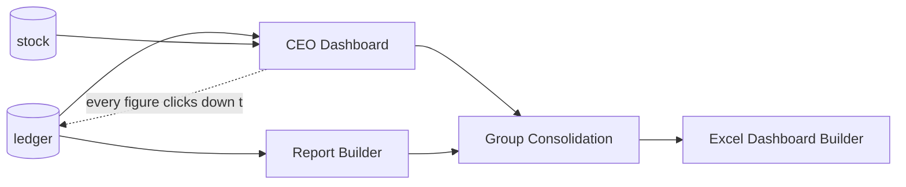

## Companies and channels — how many of each

Three companies and seven marketplaces is the data this business has today. It is not a limit, and
nothing in the structure below is built around either number.

- **A company is a row.** Every business record carries the company it belongs to. Each company's
  books balance on their own, and no journal line can point at an account belonging to another one.
- **A channel is a row.** Every sale carries the channel it came through — a marketplace account,
  the D2C site, the Surat counter, the B2B desk, an export buyer. Module 01 Platform holds the
  registry; Module 15 E-commerce carries **Channels & Storefronts**, the full listing-side version,
  which is designed and not yet built.
- **Stock is one number per SKU, never one per channel.** The channel is a dimension of the sale.
- **The group figure is the sum minus inter-company trade**, and the elimination is returned
  alongside it rather than folded in silently.

Proven rather than asserted: `core/tests/core.test.js` posts across a 10 × 10 grid — a hundred
channels — and checks every company's books balance, that no line reaches into another company, and
that the group is ₹2,10,500 gross minus ₹50,000 inter-company = ₹1,60,500; it then runs 11 × 11
with nothing in the code changed. In the working Dashboard & BI app you can add a fourth company and
an eleventh channel yourself. The shipped plan cap is 20 companies and says so on screen; the
software has no limit of its own.

---

## App 01.1 · CEO Dashboard — **[BUILT]**

**The screen.** Five screens behind one app. **Overview** opens with five cards — Net sales (after
returns, *not* the marketplace's gross), Net profit (with margin % beneath), Cash + bank, To collect,
Open alerts (red if any) — then a *Net sales by month* bar panel with each month's profit written
beside its bar, and a *What needs you* list of the top six alerts, each with an **Open →** button
that jumps to the screen that fixes it. **Sales & Channels** carries the uncomfortable question in a
table: one row per channel with gross, returns, return %, net, units, and a tag that turns red at 12%
returns — so Flipkart at 14% on a big gross can be shown earning less than the website at 11% on a
smaller one. **Money** lists who owes you (tagged *ok* / *overdue* >30d / *chase now* >60d) and who
you owe, and ends with the profit build-up read line by line: Net sales − Fabric & trims − Making =
Gross profit − Running expenses = Net profit. **Stock & Making** and **Companies** finish it.

**Walk one through.** Set the period to *last month* and the company to *All*. Net profit reads,
say, ₹4.1L at 18%. You click **Open →** on a red *chase now* alert; it lands you on the buyer owing
₹90,000 for 63 days. You switch the company dial to Ethnic Fashion — every figure narrows to that one
company. Nothing was typed; you moved two dials.

**Reads / Writes.** Reads `journal_lines`, `stock`, `sales_orders`. Writes nothing but saved
dashboard layouts.

## App 01.2 · Report Builder — **[BUILT]**

**The screen.** A drag-a-field report surface: pick the fields, the grouping and the date range; the
result is a live query over the ledger, exportable. No figure is stored — re-open the report next
month and it has moved because the ledger moved.

**Walk one through.** Drag *Channel* to rows, *Net sales* and *Return %* to values, set *this
quarter*; you get channel profitability without anyone maintaining a spreadsheet.

**Reads / Writes.** Reads the ledger and stock; writes only the saved report definition.

## App 01.3 · Group Consolidation — **[BUILT]**

**The screen.** **Group figures** shows five cards — group net sales *after internal billing is
removed*, group profit, group cash, group stock, and the internal-billing figure itself — because a
sale from Vastrangam to Ethnic Fashion is real for each company and *not* a sale for the group.
**Company by company** puts the three side by side; **Between your own companies** shows exactly what
was billed internally and taken back out; **Who may file** lists which company holds which
registration.

**Walk one through.** Vastrangam bills Ethnic Fashion ₹2L of stock. Each company's own P&L shows it.
The group card subtracts that ₹2L, so group sales are not inflated by money the group moved from one
pocket to another.

**Reads / Writes.** Reads all three companies' ledgers; writes nothing.

## App 01.4 · Excel Dashboard Builder — **[SPEC]**

**The screen.** Generates the nine-sheet workbook (Index, Financial Summary, HR, Purchase, Sales,
Inventory & Production, GST, Expenses) from 14 source tables, each sheet showing Vastrangam / Ethnic
Fashion / Adini as three rows plus one CONSOLIDATED row that is `=SUM` of the three — a live formula,
never a fourth hand-calculated number.

**Walk one through.** Export for last FY; the Financial Summary sheet's consolidated row foots to the
sum of the three company rows because it literally is `=SUM(...)`, so an auditor can trust it.

**Reads / Writes.** Reads 14 tables; writes an `.xlsx` file only.

## The data this module owns
None. It reads. It stores only saved report definitions and dashboard layouts.

## Done when
Any figure on any screen clicks down to the ledger entry or stock movement behind it, in both the
neutral (Medhava) and Vastrangam editions.

---

# MODULE 02 · CRM
*One record per customer — every lead, order, return, document and conversation, whatever channel it came from*

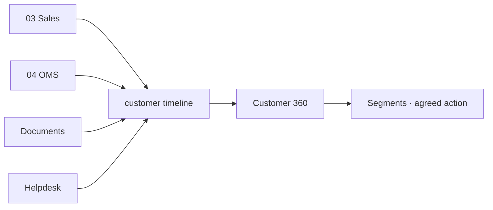

## App 02.1 · CRM & Customer 360 — **[BUILT]**

**The screen.** Six screens. **Overview** — five cards of what you are chasing and what is
outstanding. **Pipeline** — every open deal, honestly valued, four cards plus an *every open deal*
table; a deal advances Lead → Qualified → Quoted → Negotiation and stops there (Won/Lost is a
separate act). **Customers** — everyone won, one row each. **Customer 360** — the screen the module
exists for: five worked-out cards (Worth, Orders with average, Returns %, Days since last order,
Group), a *What to do next* line that is the agreed action for that buyer's group, and the
*Everything that has happened* timeline — Order, Document, Ticket, Note, Lead — five kinds of thing
from three apps in one list, each line read live from the app that owns it. You can add exactly one
thing here: a Call / Visit / Email / Meeting note. **Segments & Offers** places every buyer in
exactly one of six groups from two facts only — how many orders and how long since the last:
Champion (4+, ≤45d), Loyal (2+, ≤60d), Needs attention (2+, 60–90d quiet), At risk (90–180d),
Sleeping (>180d), New. Nobody tags anyone; a buyer moves group by themselves.

**Walk one through.** Rajmandir Wholesale places its 4th order today; it crosses into *Champion* on
its own, and the *What to do next* line changes to the Champion action agreed once, for everyone.

**Reads / Writes.** Reads Sales, OMS, Documents, Helpdesk. Writes `customers`,
`customer_interactions`, `customer_lifecycle_events`.

## App 02.2 · Documents & eSign — **[BUILT]**

**The screen.** A document vault filed against a buyer or against one of their orders, each with its
state (draft / sent / signed / returned), and an e-sign send-and-return flow. Every document raised
here surfaces on that buyer's 360 timeline as a *Document* line.

**Walk one through.** Send a dealership agreement for e-sign; when it returns signed, the buyer's
*On file for them* panel flips it to signed without anyone re-filing it.

**Reads / Writes.** Reads `customers`, `sales_orders`. Writes `documents`.

## App 02.3 · Helpdesk & Live Chat — **[BUILT]**

**The screen.** A ticket queue tied to the order it is about, each ticket showing how fast it was
answered; tickets surface on the 360 timeline as *Ticket* lines and in the 360's *Questions they
asked* panel.

**Walk one through.** A buyer messages about a torn kurta; the ticket carries their order, so the
agent sees the design, the channel and the delivery date without asking.

**Reads / Writes.** Reads `sales_orders`, `customers`. Writes `tickets`.

## App 02.4 · Forms & Feedback (NPS) — **[SPEC]**

**The screen.** An NPS form whose answers attach to the *design*, not just the buyer, plus a
*complaints by design* view — so a complaint-prone design surfaces as a pattern instead of a
scatter of individual gripes. A review request fires 3 days after first delivery.

**Walk one through.** Twelve buyers score the same anarkali low and mention the neckline; the
design's complaint tile lights up, and Manufacturing sees which design to fix.

**Reads / Writes.** Reads deliveries from Sales/OMS. Writes `nps_responses`.

## The data this module owns
`customers`, `customer_addresses`, `customer_interactions`, `customer_lifecycle_events`,
`loyalty_ledger`, `documents`, `tickets`, `nps_responses`.

## Done when
One customer's whole cross-channel history is on one screen, and a 7th order fires the VIP trigger on
its own.

---

# MODULE 03 · SALES
*Counter, wholesale, export and your own website on one order book, drawing on one stock number*

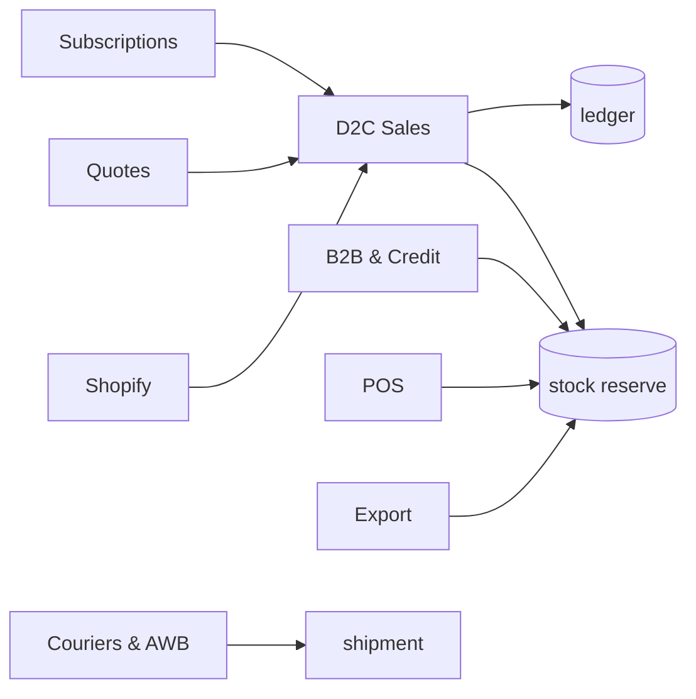

## App 03.1 · D2C Sales — **[BUILT]**

**The screen.** **Overview** (five cards). **Orders** — five stage cards with the value sitting at
each, a *Take an order* box (customer, item from catalogue with its price, quantity, prepaid or COD,
advance, coupon with its minimum), and the order table column by column: Order, Item (qty × rate),
Gross, Coupon (green with amount if it qualified, grey "below minimum" if not — nothing hidden), Net,
Payment, On delivery (red if the courier still collects), Stage. Every row steps exactly one stage
forward, never skipping, never backward; a delivered order cannot be cancelled. **Abandoned carts**
and **Loyalty points** follow.

**The one rule that saves real money.** A COD order *cannot be packed* until it carries a 20%
advance. Press "Mark packed" on a COD order with too small an advance and the app refuses and names
the figure it needs — because a refused COD parcel costs the courier fee both ways and comes back
handled.

**Walk one through.** A ₹2,000 COD order with ₹0 advance: "Mark packed" is refused until ₹400 is
taken on Razorpay; then it packs, ships, and the *On delivery* column shows the ₹1,600 the courier
must still collect.

**Reads / Writes.** Reads `items`, `stock`. Writes `sales_orders`, `invoices`; reserves stock.

## App 03.2 · B2B & Credit — **[BUILT]**

**The screen.** **Overview** (five cards). **Orders** table. **Credit limits** — a limit per buyer,
checked *before* an order is accepted. **Ageing** — outstanding bucketed by age, with reminders at
−3 days, +1 day, and a +7-day soft block.

**Walk one through.** Rajmandir has a ₹5L limit and ₹4.6L outstanding; a ₹60,000 order is blocked at
acceptance, not discovered as a bad debt later.

**Reads / Writes.** Reads `customers`, `stock`. Writes `b2b_orders`, `b2b_credit_ledger`.

## App 03.3 · Export — **[BUILT]**

**The screen.** Export orders with their documents — commercial invoice, packing list, LUT, FIRA,
IGST-refund lines — all at 0% GST, with FX variance posting to FX gain/loss.

**Walk one through.** A $3,000 order invoiced at ₹83/$ and realised at ₹84/$ posts the ₹3,000 FX
gain to its own ledger, and the export lines carry 0% GST under LUT.

**Reads / Writes.** Reads `stock`, `customers`. Writes `export_orders`, ledger FX lines.

## App 03.4 · POS — **[BUILT]**

**The screen.** A counter till: pick items, take payment, print the bill — drawing the same stock
number as every other channel, so a counter sale drops stock everywhere at once.

**Walk one through.** A walk-in buys the last piece of a design at the counter; it disappears from
Amazon and Flipkart in the same instant.

**Reads / Writes.** Reads `items`, `stock`. Writes `sales_orders` (POS), issues stock.

## App 03.5 · Quotes & Proforma — **[BUILT]**

**The screen.** A quote that becomes an order in one step, and a proforma invoice, without re-keying
the lines.

**Walk one through.** A ₹1.2L wholesale quote is accepted; "Convert to order" carries every line,
price and quantity straight into B2B.

**Reads / Writes.** Reads `items`. Writes `quotes`; hands to `b2b_orders`/`sales_orders`.

## App 03.6 · Couriers & AWB — **[SPEC]**

**The screen.** On the order, a courier compare (cheapest and fastest both shown) and one-click AWB
generation, so the label comes from inside the system.

**Walk one through.** For a Jaipur delivery, three couriers are compared; you pick, the AWB prints,
and Logistics picks up the shipment record.

**Reads / Writes.** Reads `sales_orders`, `courier_rates`. Writes `shipments`.

## App 03.7 · Subscriptions — **[SPEC]**

**The screen.** A schedule that auto-invoices on its cycle and duns on failure — for repeat B2B
replenishment or a saree-of-the-month.

**Walk one through.** A monthly ₹40,000 replenishment raises its own invoice on the 1st; a failed
payment starts the dunning sequence without anyone watching a calendar.

**Reads / Writes.** Reads `customers`, `items`. Writes `subscriptions`, `invoices`.

## The data this module owns
`sales_orders`, `sales_order_items`, `invoices`, `invoice_items`, `b2b_orders`, `b2b_credit_ledger`,
`export_orders`, `customization_orders`, `subscriptions`.

## Done when
A Shopify order appears in 60 seconds with stock reserved and invoice raised, and a partial-COD order
reconciles both legs by itself.

---

# MODULE 04 · E-COMMERCE / OMS
*Seven seller panels and your own store in one queue, one stock number back out to all of them*

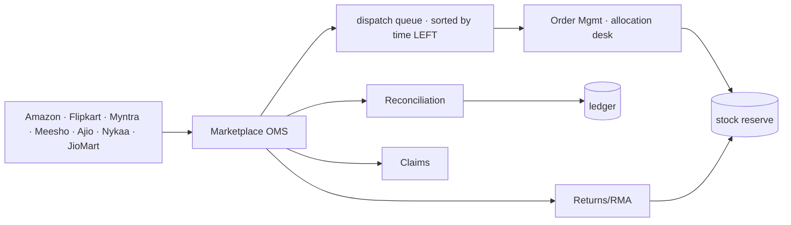

## App 04.1 · Marketplace OMS — **[BUILT]**

**The screen.** **Overview** (five cards). **Order book** — every marketplace order in one list,
pulled every 15 minutes, idempotent by external ID so the same order never doubles. The queue sorts
by **time remaining**, not time received, because Amazon's dispatch window is 12h and Ajio's is 48h —
a later Amazon order can be more urgent than an earlier Ajio one.

**Walk one through.** An Amazon order placed at 2pm and an Ajio order placed at noon: the Amazon one
sits above the Ajio one in the queue because it is closer to breaching.

**Reads / Writes.** Reads channel APIs, `stock`. Writes `marketplace_orders_raw`; reserves stock.

## App 04.2 · Order Management — **[BUILT]**

**The screen.** **Order book**, then the **Allocation desk** — a grid of every item (rows) against
every warehouse (columns) with a total, a zero shown red, an item with nothing anywhere tagged
*nothing anywhere*. Per waiting order, a panel lists every warehouse with *In stock there · Transit ·
WOULD PROMISE · can it serve it* — you are choosing between **dates**, not warehouse codes — with
"Ship from here" and "Allocate the fastest way", and *no buttons at all* if nothing can serve it. A
**Move stock** box shifts pieces between warehouses; the business total never changes (there is a
self-test for exactly that). **Promise & Transit** holds the transit matrix (warehouses × zones, the
bold cell being the fastest warehouse for that zone) and every open order tagged *in 4 days / due
tomorrow / due today / 2d past / in transit / cannot be promised*. **Returns & Refunds** closes it.

**Walk one through.** Move one piece to the warehouse nearer the customer, return to the order book —
the promised date changed by itself. You did not edit a date; you moved a piece of stock.

**Reads / Writes.** Reads `stock`, `marketplace_orders_raw`. Writes allocations; reserves/moves stock.

## App 04.3 · Manual Data Check — **[SPEC]**

**The screen.** Upload your own marketplace sheets; the app cross-checks them against what it pulled,
and lists every order it has that your sheet does not, and vice versa.

**Walk one through.** Your Flipkart export has 3 orders the pull missed (an API gap); they are listed
so none ships late.

**Reads / Writes.** Reads uploaded sheets, `marketplace_orders_raw`. Writes flags.

## App 04.4 · Reconciliation — **[SPEC]**

**The screen.** Each settlement payout matched line by line to its orders, with commission read from
the file (never assumed) and any shortfall named.

**Walk one through.** A ₹1.2L payout is matched to 40 orders; two lines are short by the commission
delta and flagged for Settlement.

**Reads / Writes.** Reads `marketplace_settlements`. Writes reconciled lines to the ledger.

## App 04.5 · Claims & Disputes — **[SPEC]**

**The screen.** A claims desk with a countdown per claim — lost, damaged, wrong-fee — each showing
days remaining in the marketplace's dispute window beside the rupees at stake.

**Walk one through.** A parcel marked lost in transit worth ₹1,800 shows *4 days left to file*; it is
worked before the window shuts.

**Reads / Writes.** Reads settlements/shipments. Writes `claims`.

## App 04.6 · Returns / RMA — **[SPEC]**

**The screen.** Return triage with the cost rules made explicit: a customer-choice return costs ₹20,
a courier return ₹5, and a *wrong* return is charged at full selling price, is dead stock, and is
**never restocked**; a repeat pattern is flagged as abuse.

**Walk one through.** A buyer returns a worn saree as "wrong item"; it is booked as dead stock, not
added back, and the buyer's abuse counter ticks.

**Reads / Writes.** Reads `sales_orders`, `stock`. Writes `returns`; retires stock.

## App 04.7 · Channels & Storefronts — **[SPEC]**

**The screen.** Connect or switch a channel — Amazon, Flipkart, Myntra, Meesho, Ajio, Nykaa, JioMart,
plus Shopify, WooCommerce, Magento, Wix and custom — the pull that feeds everything else.

**Walk one through.** Add a new Nykaa account; within one pull cycle its orders join the same queue as
the rest.

**Reads / Writes.** Reads channel APIs. Writes `channels`.

## App 04.8 · Labels & Documents — **[SPEC]**

**The screen.** Batch label printing — and the rule that a label is *never* uploaded to an outside
website to be cropped, because that is where addresses leak.

**Walk one through.** Forty labels for the day print as one batch, inside the system.

**Reads / Writes.** Reads orders/shipments. Writes label batches.

## App 04.9 · Listing & Catalog Manager — **[SPEC]**

**The screen.** Bulk listing management across channels, mapping each SKU to its per-channel code.

**Walk one through.** One design's price and title are pushed to six channels at once, each in that
channel's required format.

**Reads / Writes.** Reads `items`, `channel_listings`. Writes `channel_listings`.

## The data this module owns
`marketplace_orders_raw`, `marketplace_settlements`, `marketplace_settlement_lines`, `returns`,
`claims`, `channels`, `channel_listings`.

## Done when
A full week runs with every channel live, settlements reconciled, and no panel oversells.

---

# MODULE 05 · WAREHOUSE
*Pick right the first time, and prove what you sent*

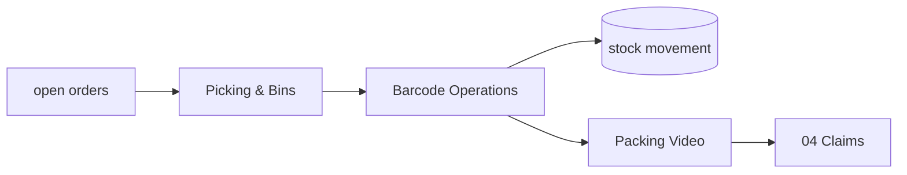

## App 05.1 · Picking & Bins — **[SPEC]**

**The screen.** A pick list generated from open orders in **walking order** — bin by bin, so a picker
is never sent to an empty rack — each line showing item, bin, quantity and the order it is for.

**Walk one through.** Twelve orders collapse into one route of nine bins; the picker walks it once,
not twelve times.

**Reads / Writes.** Reads open orders, `bins`, `stock`. Writes `pick_lists`, `pick_list_lines`.

## App 05.2 · Barcode Operations — **[SPEC]**

**The screen.** A phone scanner with four modes — pick, pack, dispatch, count — one scan whatever the
channel; **every scan writes a stock movement**, so the quantity is always a running balance of real
events.

**Walk one through.** Scanning a piece at dispatch moves it from *packed* to *dispatched* and drops
on-hand by one, on the shared number every other module reads.

**Reads / Writes.** Reads `items`, `stock`. Writes `barcode_scans`, `stock_movements`.

## App 05.3 · Packing Video — **[SPEC]**

**The screen.** Packing footage captured against the order number and indexed by it, so the clip
attaches itself to the claim that later needs it.

**Walk one through.** A buyer claims an empty box; the packing clip for that order number is already
attached to the claim in OMS — the dispute is won with evidence, not argument.

**Reads / Writes.** Reads `sales_orders`. Writes `packing_videos`; links to `claims`.

## The data this module owns
`bins`, `pick_lists`, `pick_list_lines`, `barcode_scans`, `packing_videos`.

## Done when
A parcel is picked from the right bin, filmed, and its clip is attached before the claim arrives.

---

# MODULE 06 · LOGISTICS
*The courier network behind the parcel — rates, failed deliveries, and the COD money*

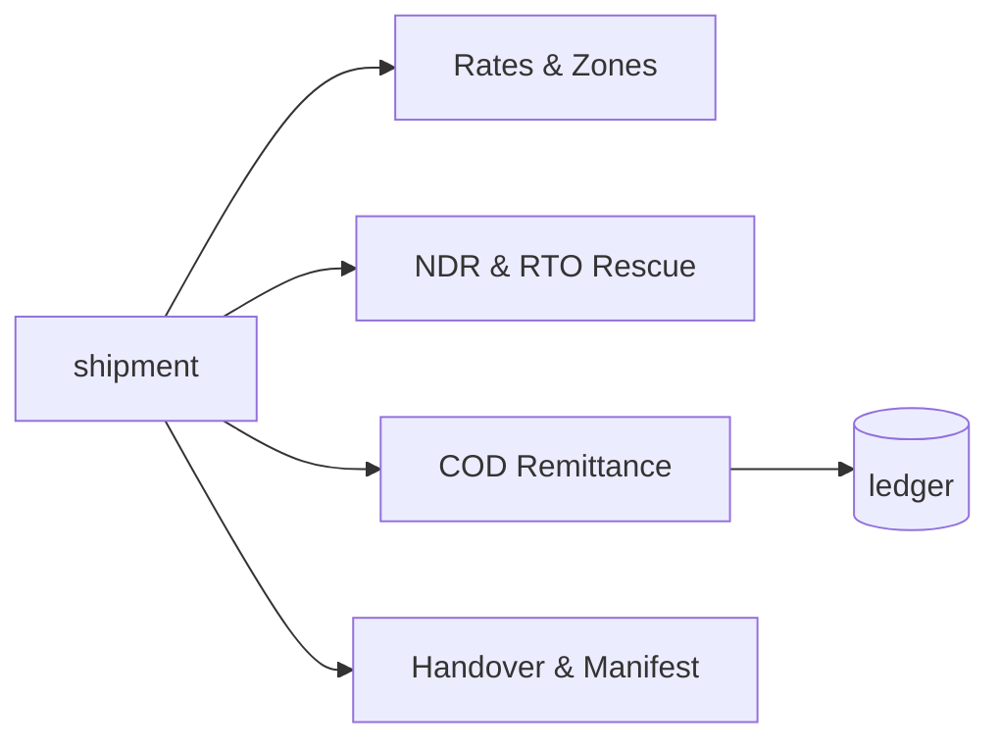

## App 06.1 · Rates & Zones — **[SPEC]**

**The screen.** A rate card by zone, weight and service, with the cheapest and the fastest option
both shown before a booking is made.

**Walk one through.** A 500g parcel to Zone C shows ₹48 cheapest (3 days) and ₹71 fastest (1 day);
you choose knowing both.

**Reads / Writes.** Reads `courier_rates`. Writes the booking choice onto `shipments`.

## App 06.2 · NDR & RTO Rescue — **[SPEC]**

**The screen.** A worklist of non-delivery cases, each to be worked — a WhatsApp or call to reconfirm
— *before* it becomes an RTO you pay for twice.

**Walk one through.** A "customer unavailable" case is reconfirmed by WhatsApp and re-attempted, so
it delivers instead of returning at double freight.

**Reads / Writes.** Reads `shipments`. Writes `ndr_cases`.

## App 06.3 · COD Remittance — **[SPEC]**

**The screen.** COD collected against COD banked, parcel by parcel, every shortfall named and aged;
the second leg of a partial-COD order is reconciled here.

**Walk one through.** The courier remits ₹1,600 for the partial-COD order whose ₹400 advance was
already taken; both legs tie to the one invoice, and a ₹1,600-owed-₹1,550-banked gap is flagged.

**Reads / Writes.** Reads `shipments`, `sales_orders`. Writes `cod_remittance`; posts to ledger.

## App 06.4 · Handover & Manifest — **[SPEC]**

**The screen.** A daily manifest with a one-time handover code and a signed record of parcels left
behind — so a lost parcel has an owner.

**Walk one through.** 38 parcels handed over; the courier signs the manifest with the code, and the
one parcel not scanned onto it is the one you can prove was never handed over.

**Reads / Writes.** Reads `shipments`. Writes `manifests`.

## App 06.5 · Fleet — **[SPEC, optional]**

**The screen.** An own-vehicle log for local runs — vehicle, trips, cost — for the deliveries you do
yourself.

**Reads / Writes.** Writes `vehicles`.

## The data this module owns
`courier_rates`, `shipments`, `ndr_cases`, `cod_remittance`, `manifests`, `vehicles`.

## Done when
COD collected reconciles to COD banked parcel by parcel, and an NDR is worked before it turns into an
RTO.

---

# MODULE 07 · INVENTORY & CATALOG
*One quantity per SKU, per location, per stage — the number every other module reads and writes*

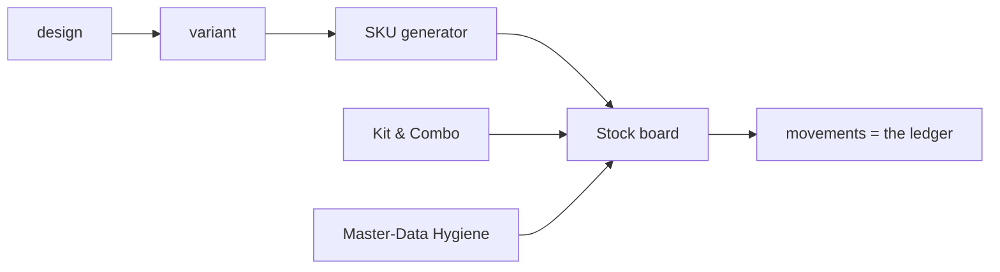

## App 07.1 · Stock — **[SPEC]**

**The screen.** A live board of SKU × location × stage as a heatmap, over the shared `stock` tables,
with a movements log beneath. Eight stages: raw → cut → stitched → thread-cut → QC → ironed → packed →
dispatched. **Movements are the ledger; the quantity is the running balance** — so "how did we get to
4?" is always answerable. The one stock number is event-driven, not per channel: the last Amazon piece
leaves Flipkart in the same instant.

**Walk one through.** A piece moves cut → stitched; the board's *cut* count drops by one and *stitched*
rises by one, and the movements log carries a row with who and when.

**Reads / Writes.** Reads/writes `stock`, `stock_movements` — the numbers every other module uses.

## App 07.2 · Catalog / PIM — **[SPEC]**

**The screen.** The catalogue with a design → variant → SKU generator: a 4-level SKU
Brand→Design→Colour→Size, `{BRAND}-{DESIGN}-{COLOR}-{SIZE}`, the string *derived* from the fields
while search uses the fields. Per-channel codes and pack size/weight live here too.

**Walk one through.** Design *ADI-2287* in Maroon, size L becomes `AC-2287-MRN-L`; you never type the
string, and Amazon's code for it is stored alongside.

**Reads / Writes.** Writes `designs`, `colors`, `sizes`, `items`, `item_aliases`, `hsn_codes`,
`gst_rates`.

## App 07.3 · Kit & Combo SKU — **[SPEC]**

**The screen.** A kit builder: a set sold as one listing is defined as component SKUs, and it
**decrements each component** at order time.

**Walk one through.** A 3-piece set sells once; the three component SKUs each drop by one, so stock is
right for every piece, not just the set.

**Reads / Writes.** Reads `items`. Writes `kit_items`; drives stock at order time.

## App 07.4 · Master-Data Hygiene — **[SPEC]**

**The screen.** Duplicate detect-and-merge plus a dead-stock register; valuation (FIFO /
weighted-avg / specific) sets the balance-sheet figure, and **stock value must equal the
balance-sheet figure**.

**Walk one through.** Two records for the same design are merged into one; the dead-stock register
lists the wrong-returns that were retired, never re-added.

**Reads / Writes.** Reads/writes `items`, `stock`, `batches`, `opening_stock`.

## The data this module owns
`designs`, `colors`, `sizes`, `items`, `item_aliases`, `kit_items`, `stock`, `stock_movements`,
`batches`, `opening_stock`, `hsn_codes`, `gst_rates`, `locations`.

## Done when
Stock is one number across every channel, a kit sale decrements all components, and stock valuation
equals the balance sheet.

---

# MODULE 08 · MANUFACTURING
*What a unit really costs to make — every operation, every worker's earning*

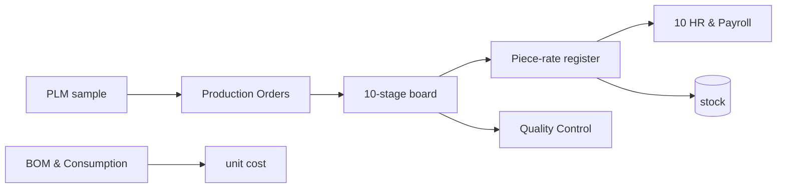

## App 08.1 · PLM & Development — **[SPEC]**

**The screen.** Spec → sample → sign-off, versioned, so a design's development history is kept.

**Reads / Writes.** Writes `samples`.

## App 08.2 · Production Orders — **[SPEC]**

**The screen.** A 10-stage production board with WIP at each stage, one production order per batch —
self-made, full job-work, or partial.

**Walk one through.** A 200-piece order moves through cut → stitch → thread-cut → QC → iron → pack;
the board shows how many pieces sit at each stage right now.

**Reads / Writes.** Writes `production_orders`, `production_stages`; feeds `stock`.

## App 08.3 · Piece-rate & Contractors (karigar costing) — **[SPEC]**

**The screen.** The karigar piece-rate register — the heart of the module, and the part already
proven in the Python engine. **23 garment columns collapse to 13 set types.** The system pools
across all karigars per design first, then applies the rule: **Sets = the minimum across the
*populated* member columns** of a set type. Extras are named individually (Extra Anarkali, Extra
Plazo) — never a generic bucket, and there is **no "Set + Extra" total column**. Cost is per raw
piece, independent of set completion — a surplus piece is still paid. A missing rate posts **₹0 and a
flag**, never a guess. Alteration earning = alter-hours × ₹100; an own-mistake alteration = ₹0. A
performance flag fires when the same person/design/task takes more than 1.2× the previous hours, and
WhatsApp asks why.

**The acceptance gate (§16A) — figures that must reproduce to the rupee.** 143 designs · 29 karigar
units · **25,307 sets · 59,110 pieces · ₹26,90,062** · 5 no-rate designs flagged. If any of these
does not reproduce, it is a bug, not a rounding difference.

**Walk one through.** A design has 40 anarkalis and 37 plazos populated; the set count is min(40,37)
= 37 sets, the 3 surplus anarkalis are named *Extra Anarkali* and still paid per piece, and no
combined total column is shown.

**Reads / Writes.** Reads `karigar_reports`, `piece_rates`. Writes `karigar_assignments`,
`karigar_earnings_summary`.

## App 08.4 · BOM & Consumption — **[SPEC]**

**The screen.** Bill of materials and consumption, giving the material cost per unit.

**Reads / Writes.** Writes `bom`, `bom_items`.

## App 08.5 · Quality Control — **[SPEC]**

**The screen.** QC accept / reject / rework, with the performance flags.

**Reads / Writes.** Writes `qc_records`, `performance_flags`.

## App 08.6 · Maintenance — **[SPEC]**

**The screen.** A machine maintenance log.

**Reads / Writes.** Writes maintenance records.

## The data this module owns
`production_orders`, `production_stages`, `bom`, `bom_items`, `samples`, `karigar_assignments`,
`karigar_reports`, `qc_records`, `performance_flags`.

## Done when
Three production orders run to completion (self / full job-work / partial) and the §16A totals
reproduce exactly.

---

# MODULE 09 · PURCHASE
*Nothing over-billed gets paid*

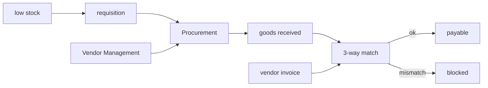

## App 09.1 · Procurement — **[BUILT]**

**The screen.** Requisition → PO → GRN, with a **3-way match** worklist: the invoice must equal
received quantity × PO rate, and the app flags GRN≠PO, invoice≠GRN×rate, and invoice-before-GRN. A
PO is numbered `PO-{FY}-####` and runs DRAFT → SENT → GRN → MATCHED | MISMATCH. Low stock drafts a
requisition and suggests the priority-1 vendor at their last rate, escalating P1→P2→P3.

**Walk one through.** A vendor invoices 120 pieces when the GRN recorded 100; the 3-way match blocks
it as a MISMATCH before a rupee is paid.

**Reads / Writes.** Reads `stock`, `vendors`. Writes `purchase_orders`, `grn`, `three_way_match`;
feeds stock and payables.

## App 09.2 · Vendor Management — **[BUILT]**

**The screen.** A vendor 360 with a scorecard per transaction — quality %, on-time %, rate vs market
— and ageing.

**Walk one through.** A mill that shipped late twice this quarter drops down the priority list, so
the next requisition suggests a better-scoring vendor.

**Reads / Writes.** Reads POs/GRNs. Writes `vendors`, `vendor_materials`.

## The data this module owns
`purchase_requisitions`, `purchase_orders`, `purchase_order_items`, `grn`, `grn_items`,
`vendor_invoices`, `three_way_match`, `vendors`, `vendor_materials`, `third_party_services`.

## Done when
A vendor invoice for more than was received is blocked before payment.

---

# MODULE 10 · HR & PAYROLL
*Pay people right, on time — salary and output-based earnings in one register*

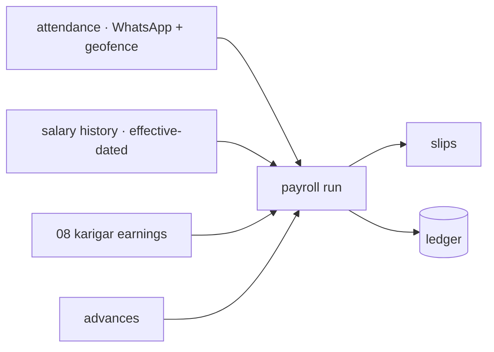

## App 10.1 · Staff & Contractors — **[SPEC]**

**The screen.** An attendance grid fed by WhatsApp and a 50 m geofence (15-minute buffer), and a
monthly payroll register, plus a salary-history editor that is **effective-dated**: edit a salary
once with an effective-from date and past months keep their old rate while a future raise
self-activates. Staff are Active / On Leave / Inactive — never deleted.

**The pay rule, exactly (from the Combined Master Prompt — already in the engine).** Attendance codes
are P · H · A · HL · OD · PL · UL. **Days-Equivalent = P + HL + 0.5×H** — a holiday (HL) pays a full
day. **Daily Rate = resolved monthly salary ÷ resolved threshold DAYS** (both effective-dated).
**Earning = Daily Rate × Days-Equivalent, uncapped both ways.** A flat-basis worker draws full salary
regardless of attendance; a piece-rate worker is hours × flat ₹/hr with no attendance row at all.
Three month-states are distinguished: *Not employed* / *No Data* / a real month.

**Walk one through.** Salary ₹15,000, threshold 26 days → Daily Rate ₹576.92. A month of 24 P, 1 HL,
2 H → Days-Equiv = 24 + 1 + 1.0 = 26.0 → earning ₹15,000.0. The same person working 28 equivalent
days earns ₹16,153.85 — it scales past the threshold, uncapped.

**Reads / Writes.** Reads `attendance`, `staff_salary_history`, karigar earnings. Writes
`payroll_runs`, `payroll_slips`.

## App 10.2 · Time-off & Advances — **[SPEC]**

**The screen.** Leave requests and salary advances; advances are deducted at payout.

**Walk one through.** A ₹3,000 advance taken mid-month is subtracted from that month's net on the
slip automatically.

**Reads / Writes.** Writes `leave_requests`, `advance_requests`.

## App 10.3 · Appraisal & Hiring (ATS) — **[SPEC]**

**The screen.** Appraisal records and a hiring pipeline.

**Reads / Writes.** Writes appraisal and applicant records.

## The data this module owns
`staff_salary_history`, `attendance`, `eod_reports`, `leave_requests`, `advance_requests`,
`payroll_runs`, `payroll_slips`, `karigar_earnings_summary`, `piece_rates`, `task_threshold_rates`.

## Done when
A full month's payroll runs end to end with zero manual touch and reconciles to the owner's figures.

---

# MODULE 11 · ACCOUNTING & GST
*Books that always balance — Medhava keeps them on its own, no other package required, ever*

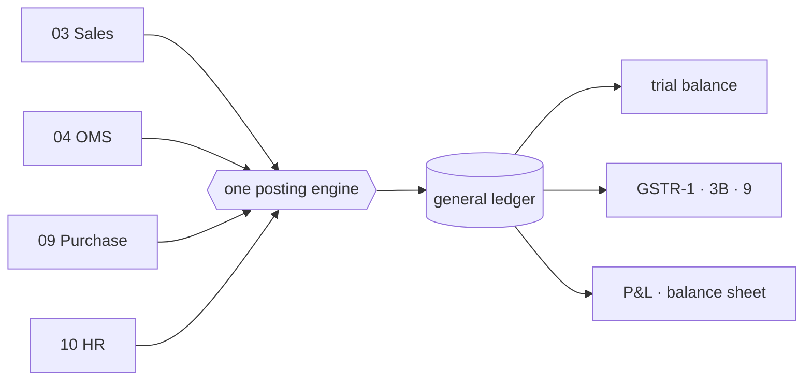

## App 11.1 · Accounting — **[SPEC]**

**The screen.** The chart of accounts, nine voucher types, and the **one posting engine** every
voucher writes through — entries balance or they do not post. This is the piece already sitting in the
tested core (double-entry, audit-wrapped).

**Walk one through.** A ₹1,180 sale posts Dr Debtors ₹1,180 / Cr Sales ₹1,000 / Cr GST ₹180 — it
balances, so it posts; an unbalanced attempt is refused, not saved half-done.

**Reads / Writes.** Writes `journal_entries`, `journal_lines`, `chart_of_accounts`.

## App 11.2 · Invoicing — **[SPEC]**

**The screen.** GST tax invoices computed from the lines to the paise, with round-off posted to its
own ledger and an e-invoice IRN. **CGST+SGST vs IGST is determined from the two GSTINs' state codes**,
never chosen by hand; rates default from the HSN, versioned by effective date.

**Walk one through.** Gujarat-to-Gujarat posts CGST+SGST; Gujarat-to-Maharashtra posts IGST — the
software decides from the state codes, so nobody can pick the wrong tax type.

**Reads / Writes.** Reads `items`, `gst_rates`. Writes `invoices`, ledger lines.

## App 11.3 · Expenses — **[SPEC]**

**The screen.** Spend by category with approvals and bill OCR.

**Reads / Writes.** Writes expense vouchers.

## App 11.4 · GST & Tax — **[SPEC]**

**The screen.** CGST, SGST, IGST, TDS, TCS, input credit, and the GSTR returns (1 / 3B / 9) filed per
registration.

**Reads / Writes.** Reads the ledger. Writes `gst_returns`, `tds_entries`, `tcs_entries`.

## App 11.5 · ITC Reconciliation — **[SPEC]**

**The screen.** Your purchases matched against the government's GSTR-2A/2B; unmatched credit flagged
before GSTR-3B.

**Walk one through.** A vendor who did not upload their invoice leaves ₹1,800 of your claimed credit
unmatched; it is flagged so you do not over-claim in 3B.

**Reads / Writes.** Reads `gst_input_credit`, portal 2A/2B. Writes match results.

## App 11.6 · Receivables, Payables & PDC — **[SPEC]**

**The screen.** Bill-wise allocation (FIFO or chosen) and a post-dated-cheque register that posts on
the realisation date, not the writing date.

**Reads / Writes.** Writes `bill_allocations`, `post_dated_cheques`.

## App 11.7 · Fixed Assets & Depreciation — **[SPEC]**

**The screen.** The asset register with both Straight-Line and Written-Down-Value depreciation, and
profit/loss on disposal flowing to the P&L.

**Reads / Writes.** Writes `fixed_assets`, `depreciation_entries`.

## App 11.8 · Year-End Close & Period Lock — **[SPEC]**

**The screen.** P&L accounts reset and balance-sheet accounts carry forward; a reviewed period is
locked, and no backdated edit is possible without an admin unlock — which is itself logged.

**Reads / Writes.** Writes `period_locks`.

## App 11.9 · Finance Reports — **[SPEC]**

**The screen.** P&L, balance sheet, and profit by channel / product / SKU, with the MIS ratios —
every figure a query over the ledger, never a stored total.

**Reads / Writes.** Reads the ledger; writes nothing.

## The data this module owns
`chart_of_accounts`, `voucher_series`, `journal_entries`, `journal_lines`, `gst_returns`,
`gst_input_credit`, `tds_entries`, `tcs_entries`, `bank_accounts`, `bank_transactions`,
`fixed_assets`, `depreciation_entries`, `post_dated_cheques`, `bill_allocations`, `period_locks`.

## Done when
One month of books closes cleanly and GSTR-1 + GSTR-3B generate and verify.

---

# MODULE 12 · SETTLEMENT
*Get paid what you are owed, cycle by cycle*

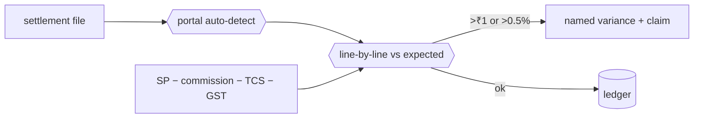

## App 12.1 · Payout Cycles — **[SPEC]**

**The screen.** A tracker per cycle and channel — should-land vs landed vs when — so a delayed or
short payout is visible the day it is late. The portal is recognised **from the shape of the file**,
not chosen from a menu.

**Walk one through.** Flipkart's cycle should land ₹1.4L on the 14th; ₹1.28L landed on the 16th — the
gap and the delay both show without anyone reconciling by hand.

**Reads / Writes.** Reads `marketplace_settlements`. Writes `settlement_cycles`.

## App 12.2 · Fee & Commission Audit — **[SPEC]**

**The screen.** Published rate vs charged rate, by category, SKU and tier. **Expected = SP −
commission − TCS − GST**; a line is flagged only past **₹1 or 0.5%**. Variance kinds are named:
commission overcharged, TCS miscalc, shipping fee above agreed, unbilled return, weight discrepancy,
lost in transit. A silent commission increase is caught the first time it applies; days-remaining on
a claim sit beside the amount. **Gate: ≥98% match, SKU profit within ₹10.**

**Walk one through.** A category's commission quietly rises from 18% to 20%; the first order at 20%
throws a *commission overcharged* variance of the 2% delta, with 6 days left to claim.

**Reads / Writes.** Reads settlement lines. Writes `fee_audit_lines`; raises claims into OMS.

## App 12.3 · TCS & TDS Register — **[SPEC]**

**The screen.** The tax the marketplace withheld, matched against what the portal reports it
deposited, so the credit you claim in Accounting is the credit that actually exists.

**Reads / Writes.** Writes `tcs_tds_register`; posts to the ledger.

## The data this module owns
`settlement_cycles`, `fee_audit_lines`, `tcs_tds_register` (reads `marketplace_settlements` from
Module 04).

## Done when
A real settlement file reconciles at 98% or better, and every variance it raises is one you agree is
genuinely real.

---

# MODULE 13 · MARKETING
*Sell more without discounting*

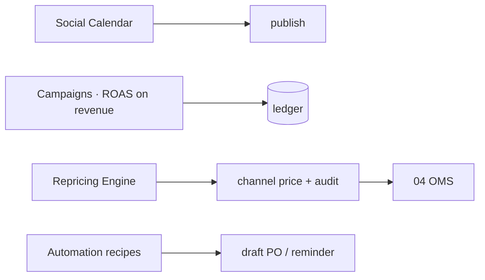

## App 13.1 · Social Calendar — **[SPEC]**

**The screen.** One calendar across seven platforms; a gap on any platform is obvious because they
are planned together, not in seven separate tools.

**Reads / Writes.** Writes `content_calendar`.

## App 13.2 · Campaigns — **[SPEC]**

**The screen.** A campaign board whose spend is pulled from the ad platforms and whose return is
**ROAS on revenue**, not opens — so a campaign that trended but sold nothing shows a return of
nothing.

**Reads / Writes.** Reads ad-platform spend, `sales_orders`. Writes `campaigns`.

## App 13.3 · Repricing Engine — **[SPEC]**

**The screen.** Rules that set marketplace prices, every change audited, and — the point — a price
that rose and cut orders shown as exactly that, next to the rule that raised it. Repricing sets price
only; it can never touch the single stock number.

**Walk one through.** A rule lifts a saree ₹150; orders fall 20%; the drop is shown beside the rule,
so the decision is judged on evidence, not defended on instinct.

**Reads / Writes.** Reads `items`. Writes `repricing_rules`; pushes channel price.

## App 13.4 · Automation — **[SPEC]**

**The screen.** A recipe builder: *stock < reorder → draft PO + WhatsApp admin*; *B2B invoice 3 days
to due → reminder*.

**Reads / Writes.** Writes `automation_recipes`.

## App 13.5 · Blog & Pages — **[SPEC]**

**The screen.** The editor for the site's written content and landing pages.

**Reads / Writes.** Writes page content.

## App 13.6 · Events — **[SPEC]**

**The screen.** Booth and lead capture for fairs; leads land in the same CRM as everything else.

**Reads / Writes.** Writes `events`; feeds `customers`.

## The data this module owns
`content_calendar`, `campaigns`, `influencers`, `asset_library`, `repricing_rules`,
`automation_recipes`, `events`.

## Done when
A month of content publishes on schedule, and a repricing rule can be judged by what it did to orders.

---

# MODULE 14 · AI CONTENT ENGINE
*Write it, shoot it, cut it — from the catalogue you already have*

The module the platform is named for, deliberately at number fourteen: it produces content *about* the
catalogue, so the catalogue (Module 07) must exist and be right first. Its governing rule — structured
data gets keywords, anything a human reads gets feelings; product nouns are banned from creative
surfaces.

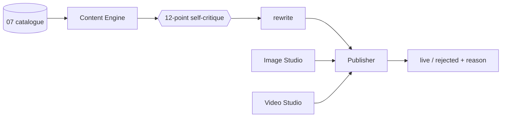

## App 14.1 · Content Engine — **[SPEC, partial standalone exists]**

**The screen.** A fourteen-stage pipeline turning a design into listing copy and captions, each
surface in its own register; a draft is run through a 12-point self-critique and rewritten before you
see it, with brand voice held in session memory.

**Walk one through.** For one design it writes an Amazon back-end field dense with search terms *and*
an Instagram caption with none of those nouns in it — the same product, two registers.

**Reads / Writes.** Reads `items`. Writes `ai_listings`, `ai_runs`.

## App 14.2 · Image Studio — **[SPEC, standalone exists]**

**The screen.** A layered image editor building product visuals from the catalogue's own photographs.

## App 14.3 · Video Studio — **[SPEC]**

**The screen.** Text-to-video and image-to-video, in **clearly labelled stages** — generation stays
badged a mockup until a paid API is wired, never shown as live.

## App 14.4 · Design Studio — **[SPEC, standalone exists]**

**The screen.** The design surface that sits alongside the copy and imagery.

## App 14.5 · Publisher — **[SPEC]**

**The screen.** One place that pushes finished content everywhere and reports what went live and what
was rejected, with the reason.

**Walk one through.** A listing publishes to six platforms; two reject it for a missing size chart —
the report names both, so you are never told you are present where you are not.

**Reads / Writes.** Reads `ai_listings`. Writes publish results; feeds Marketing/OMS.

## The data this module owns
`ai_runs`, `ai_listings`, `ai_design_analytics`, and the project state for each studio.

## Done when
A listing generates for one design across six platforms in under twenty seconds and publishes, with
every rejection explained.

---

# MODULE 15 · PROJECTS & COLLABORATION
*The work that is not an order — and the talking around it*

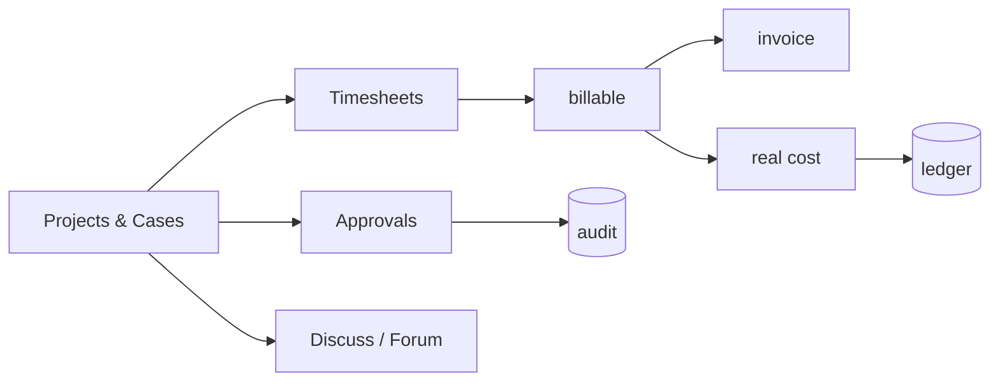

## App 15.1 · Projects & Cases — **[SPEC]**

**The screen.** One board for any non-order engagement — a project, case, engagement or job is the
same record with different words — tracking billable time against real cost so a project's margin is
visible while it runs.

**Reads / Writes.** Writes `projects`.

## App 15.2 · Timesheets & Planning — **[SPEC]**

**The screen.** A grid where time is logged against a project and becomes both an invoice line and a
cost — entered once, never re-keyed.

**Walk one through.** 12 hours on a custom bulk enquiry become a ₹12,000 invoice line and a ₹6,000
cost, both in the ledger, from one entry.

**Reads / Writes.** Writes `timesheets`; feeds invoices and the ledger.

## App 15.3 · Approvals — **[SPEC]**

**The screen.** One queue for every kind of approval, each decision carrying its reason into the
audit record.

**Reads / Writes.** Writes `approvals`; every decision to `audit_log`.

## App 15.4 · Forum — **[SPEC]**
**The screen.** The open, browsable team discussion space. **Reads / Writes.** Writes `forum_posts`.

## App 15.5 · Discuss — **[SPEC]**
**The screen.** Record-attached threads — a conversation about an order lives on that order.
**Reads / Writes.** Writes `discussions`.

## App 15.6 · Knowledge Base — **[SPEC]**
**The screen.** A role-scoped SOP wiki — a karigar sees the procedures that concern a karigar.
**Reads / Writes.** Writes `knowledge_base`.

## The data this module owns
`projects`, `timesheets`, `approvals`, `forum_posts`, `discussions`, `knowledge_base`.

## Done when
Billable time on a case becomes an invoice and a cost without being re-keyed once.

---

# MODULE 16 · PLATFORM
*The spine every module runs on — who can see what, how it's configured, and a record of everything that ever happened*

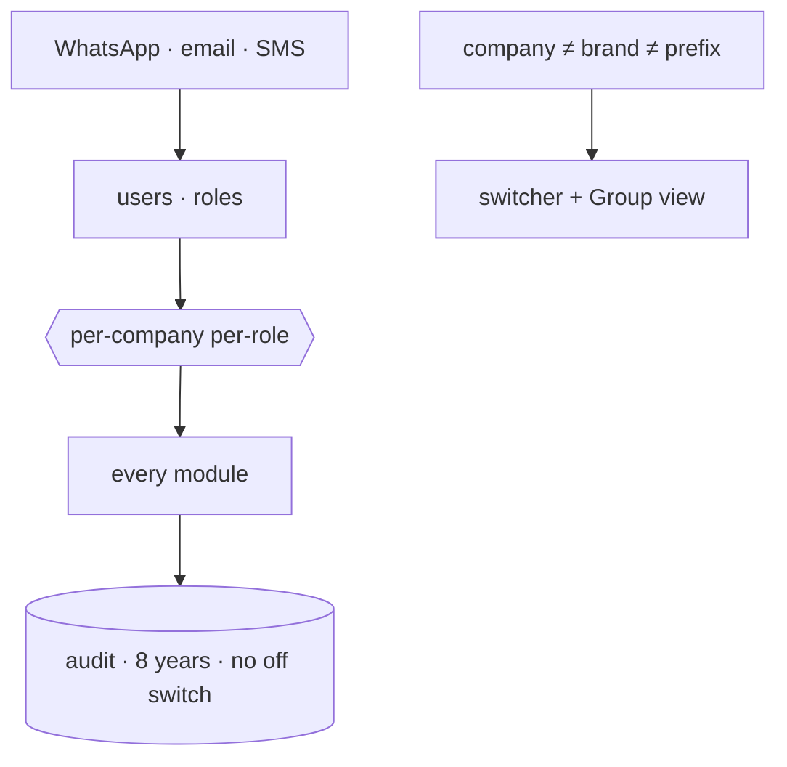

## App 16.1 · Identity, Settings & Audit — **[BUILT, partial]**

**The screen.** Users, roles and permissions — Admin / Manager / Staff / Karigar / Customer, set
**per company, per role** (Praveen and Vishal see all three); a company switcher with a **read-only**
Group view; tax and numbering setup; provider config with an integration-health view; and a browser
over the audit trail. **Company, brand and prefix are three separate fields** — Ethnic Fashion the
company trades as Go4Fashion, SKUs read GF. The **audit trail cannot be switched off** — MCA rule,
8 years, before-and-after values, so there is no switch. **A vendor named as the source of a figure is
a bug** — every capability has 3+ interchangeable vendors; the ledger is the source of every number.

**Walk one through.** A karigar logs in and sees only their own earnings; an admin switches from
Vastrangam to Adini and every figure on every screen changes with the company; every edit made during
the test is already in the audit browser.

**Reads / Writes.** Reads/writes `users`, `user_companies`, `companies`, `audit_log`,
`settings_environment`.

## App 16.2 · Ask & Print — **[BUILT]**

**The screen.** A natural-language query over the business and the one consistent way anything is
printed.

**Walk one through.** Ask "net profit for Adini last month" and get the figure with the ledger path
behind it; print any screen the same way everywhere.

**Reads / Writes.** Reads the ledger and stock; writes nothing.

## App 16.3 · Communications — **[SPEC]**

**The screen.** A WhatsApp command console (IN / OUT / LEAVE / ADVANCE / REPORT / Print), broadcasts,
email and SMS, and five scheduled jobs. Broadcasts go through the official API, warm up at 200/day,
and honour a STOP keyword. **This app never asks for a marketplace, bank or account password** — a
stated, built-in promise, because a tool that asks for those has become the phishing risk it should
protect against.

**Reads / Writes.** Writes `whatsapp_messages`, `whatsapp_broadcasts`, `email_campaigns`,
`notifications`.

## The data this module owns
`companies`, `users`, `user_companies`, `audit_log`, `integration_errors`, `settings_environment`,
`whatsapp_messages`, `whatsapp_broadcasts`, `email_campaigns`, `notifications`.

## Done when
A karigar sees only their own earnings, an admin switches all three companies and the figures change,
and every edit in the test is in the audit browser.

---

## THE PROOF — ONE TRANSACTION, EIGHT MODULES, ONE DATABASE

The test that these are one system and not sixteen programs sharing a login: sell one garment on a
marketplace and follow it. The order lands in **OMS (04)**. Stock falls by one in **Inventory (07)**,
in the same instant, on every other channel. It is picked from the right bin in **Warehouse (05)** and
an AWB is booked in **Logistics (06)**. Revenue and GST post to **Accounting (11)**. Weeks later the
payout is matched to the paise in **Settlement (12)**. The karigar who stitched it was paid for it in
**Manufacturing (08)** and **HR (10)**. And every step is a live figure on the **Dashboard (01)**,
each number clicking down to the record beneath it.

One transaction. Eight modules. One database. Everything in this book exists to make that one sentence
true — and the honest state today is that six modules of the eight in that sentence are still on the
right-hand column of the count on page one.
