# VASTRANGAM GROUP — BUSINESS OPERATING SYSTEM
## The Complete Module Book

Every module, described in full. For each one: what it is and why it exists, how it wires to
the rest of the system, each app it ships, and then **every rule and capability written out
point by point** — what the point means, why it is there, and what goes wrong without it — with
a diagram of how the module connects.

The whole system rests on one idea: **one order book, one stock number, one ledger.** A sale
does not update three separate records that later disagree; it moves stock once and posts to
the ledger once, and every report is a question asked of those two places. That is the
difference between an operating system and a folder of spreadsheets.

**16 modules · 78 apps.** Built Module 01 first through Module 16 last, each finished before the
next begins.

---

## HOW THE WHOLE THING CONNECTS

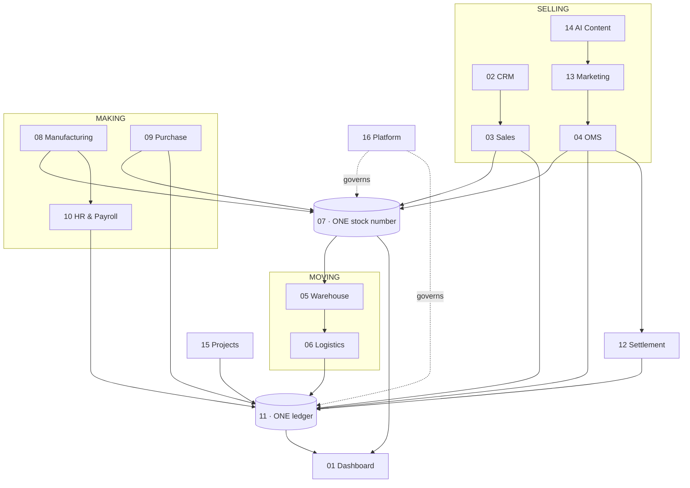

Read the diagram as water running downhill. Selling, making and moving all pour into the two
reservoirs at the centre — the stock number and the ledger. The dashboard drinks from those
reservoirs; it never keeps its own bucket. The platform sits over everything, deciding who may
touch what and recording every touch.

---

# MODULE 01 · DASHBOARD & BI
*See the whole business without asking anyone*

## What this module is

The place a business owner looks first in the morning and last at night. Every number the
company produces — a sale on Amazon, a piece stitched by a karigar, a courier that failed to
deliver, a vendor bill that arrived — rolls up here as it happens. There is no export to run,
no month-end to wait for, no calling three people to send their sheet. The screen is the
business, live.

It matters because the alternative is what most growing companies actually live with: numbers
scattered across seller panels, a WhatsApp group, an accountant's file and a stock register,
none of which agree, and a decision made on whichever one was closest to hand. This module
ends that by refusing to hold a number of its own. Everything it shows is a live query against
the two places that cannot lie — the ledger and the stock table.

## Wiring

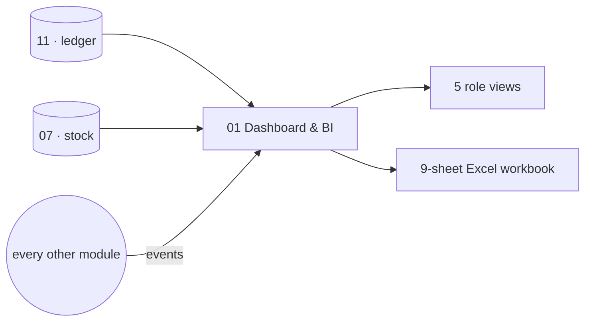

It reads from every module and writes to none. That one-way relationship is deliberate: a
reporting layer that can write is a reporting layer that can be wrong in a way nobody notices.

## The apps

**CEO Dashboard** *(built)* — cash position, sales, stock value, profit and the day's alerts
on a single screen, refreshed as work happens. This is the "one glance" view: is the business
up or down today, and is anything on fire.

**Report Builder** *(built)* — drag the fields you want into a report, save it, and the whole
team sees the same thing. It exists so that a question asked once ("show me returns by
courier") does not have to be re-asked and re-built every month.

**Group Consolidation** *(built)* — several companies rolled into one set of figures, with
inter-company sales and purchases removed so the group total is real and not double-counted.
It handles the awkward case explicitly: a company with no tax registration of its own — a
job-work arm, a new venture — still belongs in the group figures without being dragged into a
tax return it does not owe.

**Excel Dashboard Builder** *(new)* — the nine-sheet analytical workbook, generated from
fourteen source tables, every figure a live formula, delivered as a file a person can open in
Excel and trust.

## Every point, one by one

**1. Every number is a query, never a stored counter.** A KPI on this screen is computed from
`journal_lines` and `stock` at the moment you look at it. Nothing is kept up to date by hand or
by a background job that might drift. This is the single rule that makes the dashboard
trustworthy: if the ledger says sales are ₹4,000, the dashboard cannot say ₹4,200, because
there is no second number to disagree.

**2. Three companies plus a consolidated row, on every sheet, without exception.** Vastrangam,
Ethnic Fashion and Adini each appear as their own row or section, and beneath them sits one
CONSOLIDATED row. This is not decoration — it is how the owner sees both the parts and the
whole at once, and it is applied to every table on every sheet so there is never a screen where
one company is quietly missing.

**3. Consolidated is the sum of the three, never a fourth calculation.** The consolidated row
is literally `=SUM` of the three company rows above it. It is never computed independently,
because an independently-computed total is exactly how a consolidated figure ends up not
matching the parts it is supposed to summarise.

**4. Group profit removes inter-company trade.** When Vastrangam sells stock to Adini, that is
revenue for one and cost for the other, but for the group it is neither — the money did not
leave the group. Group P&L is therefore Σ(the three companies) minus inter-company sales minus
inter-company purchases, so the group's profit is the profit actually made from the outside
world.

**5. The financial year is detected from the data.** The workbook reads the earliest and latest
dates in the file and labels itself accordingly. No year is ever typed into the code, so the
same builder produces FY2025-26 this year and FY2026-27 next year with nothing changed.

**6. Five role dashboards, each showing only what that person should see.** The Admin sees
everything across three companies; the Manager sees operations but not the P&L or salaries; a
Staff member sees their own attendance and earnings; a Karigar sees only their own piece
earnings; a Customer sees their own orders. The same underlying data, filtered by who is
looking.

## The data it owns

Almost none — this module reads. It stores only saved report definitions and dashboard layouts,
so that a report built once persists.

## Done when

Every figure on every screen can be clicked and followed down to the exact ledger entry or
stock movement that produced it, and the three companies plus their consolidated total appear
on every sheet.

---

# MODULE 02 · CRM
*Know every customer completely — and answer them fast*

## What this module is

One record per customer, carrying every lead, order, return, document and conversation that
customer has ever had with the business — no matter which channel it arrived on. When the next
question comes in, whoever picks it up can already see everything that came before, so the
customer is not asked to repeat themselves and the answer is fast and right.

The reason this matters is that a customer does not experience your channels; they experience
you. Someone who bought on your website, returned something on Amazon and asked a question on
WhatsApp is one person, and treating them as three is how a loyal customer is lost to a small
avoidable friction.

## Wiring

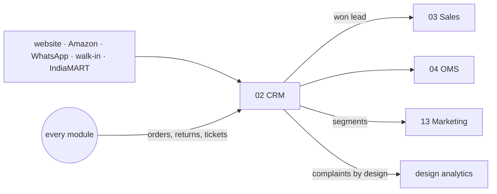

## The apps

**CRM & Customer 360** *(built)* — the lead from first contact to won, and then the full
lifetime after: every order, every return, lifetime value, and a prompt for what to offer next.

**Documents & eSign** *(built)* — every agreement, receipt, certificate and scan filed against
the record it belongs to — an order, a party, an employee — so it is found by that record
rather than by remembering which folder it went in. Send one out for signature and the signed
copy files itself back automatically.

**Helpdesk & Live Chat** *(built)* — a question arriving by chat, email or phone becomes a
ticket tied to the order or account it concerns, with the whole history already on the screen
when the agent opens it.

**Forms & Feedback (NPS)** *(new)* — a post-delivery feedback form and Net Promoter Score,
tied back to the customer record and, critically, to the design, so you learn which designs
draw complaints.

## Every point, one by one

**1. The sales pipeline is a fixed ladder.** Lead → Qualified → Quoted → Negotiation → Won →
Lost. A lead advances one rung at a time, and advancing stops at Negotiation — Won and Lost are
explicit human decisions, not something the software slides into automatically. This keeps the
pipeline honest: a deal is only "won" because someone said so.

**2. Lead sources are a closed list.** IndiaMART, Website, WhatsApp, Walk-in, Forum. Every lead
is tagged with where it came from, so you can see which source actually produces customers
rather than just enquiries.

**3. An open lead needs a follow-up after seven days.** If nobody has touched an open lead in a
week, it surfaces as needing attention. Won and Lost leads never follow up, because there is
nothing left to chase. Seven days is the default and can be changed.

**4. Win rate is won over decided, not won over everything.** Win rate = won ÷ (won + lost).
Open leads are excluded because they have not been decided yet; counting them as losses would
make every salesperson look bad on a busy week. With no decisions yet, the rate is simply null
rather than a misleading zero.

**5. Customer tier is set by how many times they have bought.** New at the first order, Repeat
at two, Loyal at four, VIP at seven; ninety days with no order marks them Lapsed. The tier
drives what the business does for them — a VIP gets treated like a VIP automatically.

**6. Two triggers fire on their own.** A VIP welcome message goes out exactly at the seventh
order, the moment the customer crosses into VIP. A win-back offer goes to a Loyal or VIP
customer who has gone ninety days quiet — but not to a lapsed New customer, because a
one-time buyer who drifted off is not worth a win-back campaign.

**7. One customer, many channels, merged by mobile and email.** A person who bought on the
website, at the counter, on B2B and over WhatsApp is one `customers` row, matched by phone and
email. Marketplace buyers are the exception: Amazon and the others do not share the customer's
real contact details, so those stay separate but are tied together by pattern where possible.

**8. Complaints attach to the design.** When an NPS response is negative, it is linked to the
design the order contained. Over time this tells you which designs generate unhappy customers —
information that a generic "we got some complaints this month" completely hides.

## The data it owns

`customers`, `customer_addresses`, `customer_interactions`, `customer_lifecycle_events`,
`loyalty_ledger`, `documents`, `tickets`, `nps_responses`.

## Done when

One customer's entire cross-channel history is on a single screen, and placing a seventh order
fires the VIP trigger without anyone doing anything.

---

# MODULE 03 · SALES
*Every way you sell, one order book — to the doorstep*

## What this module is

Retail counter, wholesale, export and your own website all write to the same order and draw on
the same stock number. And a sale is not treated as finished when it is billed — it is finished
when it is delivered and, for a cash-on-delivery order, when the money is actually in your bank.
The courier side lives here too, because booking the shipment is part of completing the sale.

The point is that a business selling four different ways usually has four different order books
that never reconcile. Here there is one, and every one of them decrements the same stock, so
you cannot sell the last piece twice.

## Wiring

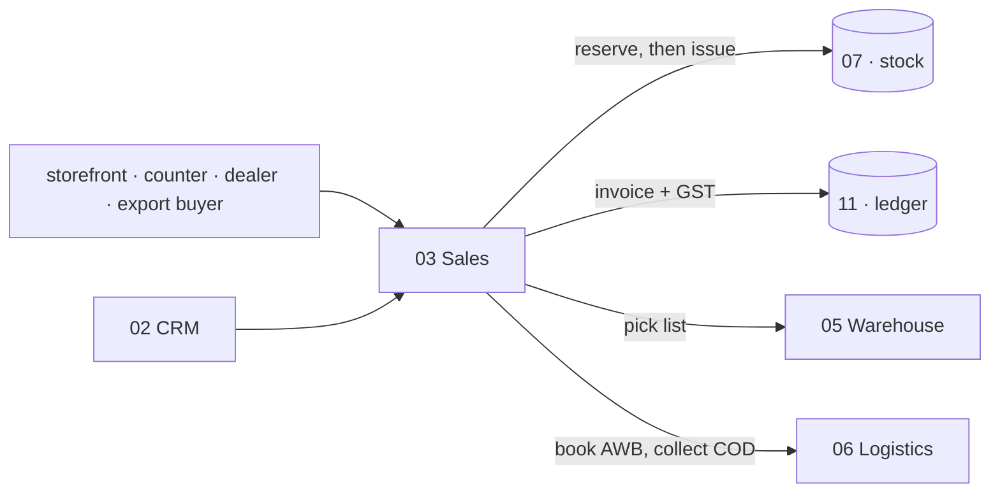

## The apps

**D2C Sales** *(built)* — orders from your own storefront, Shopify or WooCommerce or a custom
site, from cart to dispatch, with loyalty points and partial COD.

**B2B & Credit** *(built)* — wholesale orders with credit limits, tier pricing and outstanding
ageing, so a dealer's account is under control before the next order ships.

**Export** *(built)* — the commercial invoice, packing list, LUT bond and IGST-refund tracking
that an export order needs, with the foreign-exchange gain or loss worked out when the money
arrives.

**POS** *(built)* — counter billing that draws on the same stock as the website, so a piece
sold at the shop is gone from the online listing immediately.

**Quotes & Proforma** *(built)* — send a quote, and convert it to a confirmed order in one
click when the customer says yes.

**Couriers & AWB** *(new)* — book the shipment on the order itself, compare couriers, print the
label, and follow the tracking number to the door.

**Subscriptions** *(new)* — recurring orders such as festive or loyalty boxes: a schedule that
auto-invoices, auto-charges, and chases a failed payment (dunning).

## Every point, one by one

**1. Shopify drives the order through webhooks.** When Shopify says an order was created, the
system reserves the stock, raises the invoice and starts fulfilment; when Shopify says paid, it
generates the picklist; when Shopify says cancelled, it releases the stock. And the stock
number is pushed back to Shopify every fifteen minutes, so Shopify never sells something you no
longer have.

**2. Partial COD is reconciled as one invoice across two payments.** The customer pays a small
advance (default ₹99) online at checkout via Razorpay; the balance is collected at the door by
the courier; the courier remits that balance; and the system stitches both legs back to the
single invoice automatically. Without this, COD orders are a permanent reconciliation headache
where the advance and the doorstep cash live in two unrelated places.

**3. Credit is checked before an order is accepted, not after.** A B2B customer has a credit
limit and payment terms. A new order that would breach the limit is blocked up front. Reminders
go out three days before a bill is due, one day after it is overdue, and at seven days overdue
the account is soft-blocked from new orders — with an override for when you decide to extend
trust anyway.

**4. The delivery date is derived, never typed.** The promised date is the channel's cut-off
time plus the transit time from the warehouse that actually holds the stock. Nobody keys in a
date, because a keyed-in date is wrong within a month. And an order that no warehouse can serve
is given no date at all — it needs a production or purchase order, not a promise.

**5. Export handles the money crossing a border.** Incoterms (FOB, CIF, EXW), the LUT bond, the
shipping bill, the FIRA when the foreign payment lands, and the IGST refund are all tracked. The
difference between the exchange rate at billing and the rate at receipt is posted to a
foreign-exchange gain/loss account, so the rupee value in the books is the rupee value you
actually received.

**6. Numbering and tax follow fixed rules.** Quotes are `Q-{FY}-####`, proformas `PI-{FY}-####`.
Export and LUT lines carry 0% GST. These are not cosmetic — a GST invoice series that resets or
skips is a compliance problem, so the series is sequential and per financial year.

## The data it owns

`sales_orders`, `sales_order_items`, `invoices`, `invoice_items`, `b2b_orders`,
`b2b_credit_ledger`, `export_orders`, `customization_orders`, `subscriptions`.

## Done when

An order placed on Shopify appears within sixty seconds with stock reserved and an invoice
raised, and a partial-COD order reconciles both of its payment legs by itself.

---

# MODULE 04 · E-COMMERCE / OMS
*Every marketplace and your own website, one queue*

## What this module is

Stop logging into seven seller panels and your own store admin. Every order — Amazon, Flipkart,
Meesho, Ajio, Nykaa, JioMart, Myntra, and your Shopify, WooCommerce, Magento or custom site —
lands in one pipeline, and one stock number goes back out to all of them. Then the money side
closes in the same module: what each channel paid, what it kept as fees, what came back as a
return, and what you are still owed.

This is the module that turns "we sell on a lot of marketplaces" from a source of chaos into a
single operation. The order queue and the settlement reconciliation live together on purpose,
because the order and the money for that order are the same event seen twice.

## Wiring

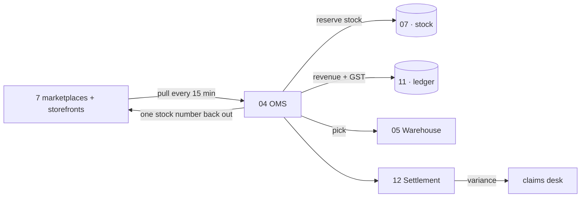

## The apps

**Marketplace OMS** *(built)* — every marketplace and storefront in one order queue, with the
real stages each channel uses and the correct cut-off counting down on every order.

**Order Management** *(built)* — one pipeline from new to delivered, whatever the source.

**Manual Data Check** — upload the sheets you already download — marketplace orders and returns,
your own counter registers — and read ten cross-checks back, every figure clickable down to the
transactions behind it, the whole thing exportable to Excel.

**Reconciliation** — match every marketplace payout to the order line that earned it, and show
the gap.

**Claims & Disputes** — turn shortfalls, weight disputes and lost parcels into filed claims with
evidence, and answer them before the clock runs out. A claim awaiting your response is worth
money; one closed for no response is worth nothing — so the days remaining sit next to the
amount.

**Returns / RMA** — customer, courier and wrong returns, and the dead stock they actually cost.

**Channels & Storefronts** — connect a channel once and it stays in step: catalogue out, price
out, stock out, orders in. Where a channel has no open interface, its own downloaded report is a
first-class way in.

**Labels & Documents** — the channel gives you a PDF; this turns it into something a packer can
work from — cropped to your label size, your own product code printed large, invoice and packing
slip merged behind it — and nothing is ever uploaded to an outside website to be cropped.

**Listing & Catalog Manager** *(new)* — push listings to every channel from one Item master, and
detect the two silent leaks: listed-but-out-of-stock, and unlisted-but-in-stock.

## Every point, one by one

**1. Orders are pulled every fifteen minutes and never double-counted.** Each pull is idempotent
by the channel's own external order ID, and the raw JSON is stored before it is normalised. If
the same order is pulled twice — which happens — it is recognised and not turned into two orders.

**2. The queue sorts by time remaining, not time received.** Amazon might give twelve hours to
ship; Ajio might give forty-eight. A one-hour-old Amazon order is more urgent than a day-old
Ajio order, and opening seven panels separately makes exactly this judgement impossible. Here
the whole day is one queue, most-urgent first, grouped by product so an item is picked once
rather than once per parcel.

**3. Commission is read from the settlement file, never assumed.** A ₹4,999 saree on Myntra is
not ₹4,999 to you — after a 30% commission and shipping it is closer to ₹3,424. The system takes
the actual commission from the settlement file line by line, because a 30%-commission channel
and a 12%-commission channel are simply not comparable on gross, and any screen that shows gross
as your money is lying to you.

**4. Return cost depends on the kind of return.** A customer return costs ₹20 (QC, alteration,
iron, packing); a courier return that never opened costs ₹5 (re-packing only); a wrong-product
return is the full selling price written off as lost inventory and is never added back to stock.
A repeated wrong-return from the same buyer or on the same SKU is flagged as marketplace abuse.

**5. Price parity is checked across every panel.** Marketplaces read each other's prices. A
discount left switched on after an event on one channel makes that listing the cheapest, and the
cheap listing buries your other listings — on the very channel you are paying commission to be
seen on. So parity is watched across all panels at once.

**6. A trading name is a label on a channel, not a second company.** A channel may know you by a
different trading name. That tags the order and the payout without splitting your books, because
it is one business wearing a channel's label, not two businesses.

## The data it owns

`marketplace_orders_raw`, `marketplace_settlements`, `marketplace_settlement_lines`, `returns`,
`claims`, `channels`, `channel_listings`.

## Done when

A full week of operations runs with every channel live, settlements reconciled, and no panel
oversells.

---

# MODULE 05 · WAREHOUSE
*Pick right the first time — and prove what you sent*

## What this module is

Bin-level instructions and barcode scanning, so the right item leaves the building and the stock
stays honest — and a recording of each parcel being packed, so an argument about what was in the
box is settled by footage instead of by memory. It is the physical floor made accountable.

## Wiring

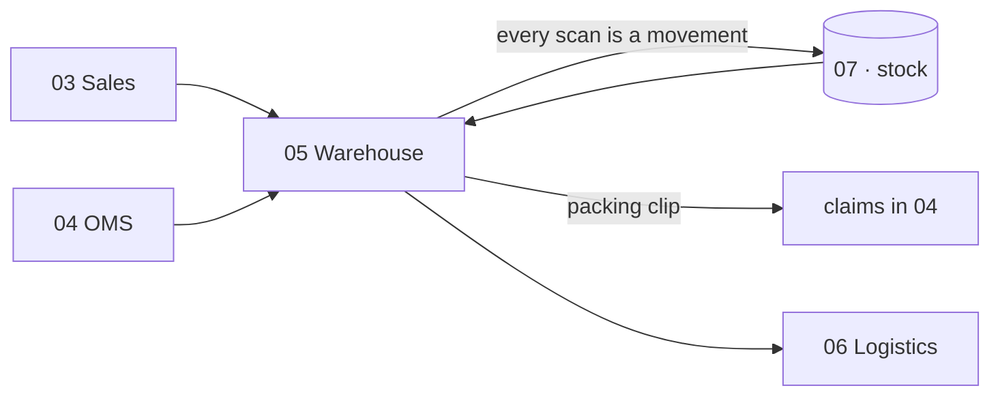

## The apps

**Picking & Bins** — pick lists that tell staff exactly which bin to walk to, in walking order,
so a picker crosses the floor once and never lands at an empty rack.

**Barcode Operations** — scan to pick, pack, dispatch and run a physical stock count, all from a
phone, with the same scan whatever channel the order came from.

**Packing Video** — every parcel recorded as it is packed and indexed by its order number, so a
wrong-item claim is answered with the clip, and the footage attaches itself to the claim that
needs it.

## Every point, one by one

**1. Pick lists are ordered by the walk, not by the order.** Staff are told which bin to visit
next in the order that minimises walking, so picking is fast and a picker is never sent to a bin
that is already empty.

**2. One scan, every channel.** The same barcode operation covers a marketplace order, a Shopify
order and a counter sale. The floor does not need to know or care where the order came from.

**3. Every scan writes a stock movement.** Picking, packing and dispatching each post to the
stock ledger as they happen. Nothing moves silently; the running stock balance is always the sum
of real, timestamped movements.

**4. The packing clip finds its own claim.** When a wrong-item dispute is raised on a channel,
the packing video for that order number is already attached, because it was indexed by order
number the moment it was filmed. The argument is over before it starts.

## The data it owns

`bins`, `pick_lists`, `pick_list_lines`, `barcode_scans`, `packing_videos`.

## Done when

A parcel is picked from the correct bin, filmed as it is packed, and its clip is already attached
to the claim by the time the claim arrives.

---

# MODULE 06 · LOGISTICS
*The courier network — rates, failures and the COD money*

## What this module is

Booking one parcel happens on the order, in Sales. This module is the network behind it: what
every courier charges before you pick one, what happens to a delivery that fails, and whether the
cash collected at the door actually reached your bank. It is the difference between "we shipped
it" and "we got paid for shipping it, at the price we expected."

## Wiring

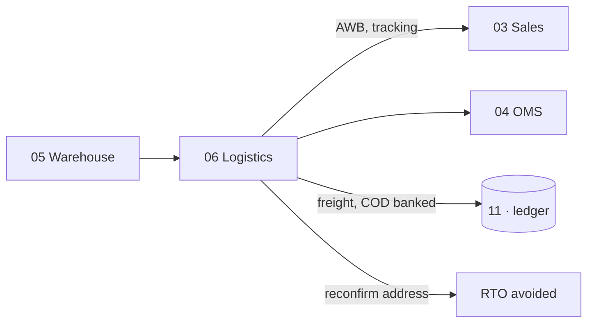

## The apps

**Rates & Zones** — every courier's rate card by zone, weight slab and service, so the cheapest
and the fastest option for this exact parcel are both known before it is booked.

**NDR & RTO Rescue** — a failed delivery worked while it can still be saved: reattempt, call,
correct the address, before it becomes a return you pay for in both directions.

**COD Remittance** — what the courier collected at the door against what actually reached your
bank, parcel by parcel, with every shortfall named and aged.

**Handover & Manifest** — what is expected out today against what the courier actually took,
counted per courier and per service, with a one-time code to confirm the handover and a signed
record of what was left behind.

**Fleet** *(new, optional)* — for a business with its own delivery vans: vehicle register, fuel
and maintenance log, and trip cost folded into freight.

## Every point, one by one

**1. Cheapest and fastest are both known before booking.** The rate cards are compared for the
specific parcel — its zone, its weight, the service level — so the decision is made on facts, not
on habit or on whichever courier's panel was already open.

**2. A failed delivery is worked, not abandoned.** When a delivery fails (an NDR), the customer
is contacted automatically to reconfirm the address, and the parcel is reattempted or cancelled
deliberately — before it silently becomes a return-to-origin that costs you the outbound freight,
the return freight, and the sale. RTO patterns are analysed by pincode and by courier so the
worst combinations are visible.

**3. COD is reconciled parcel by parcel.** For every COD parcel, the amount the courier collected
is matched against the amount that reached your bank. Shortfalls are named and aged, so money
that a courier is sitting on does not simply disappear into a monthly total that looks roughly
right.

**4. A lost parcel has an owner.** The handover manifest records what was expected out, what the
courier actually took, and — signed — what was left behind. So a parcel lost in the gap between
your packing table and the courier's van is somebody's responsibility, not a mystery.

## The data it owns

`courier_rates`, `shipments`, `ndr_cases`, `cod_remittance`, `manifests`, `vehicles`.

## Done when

COD collected reconciles to COD banked, parcel by parcel, and a failed delivery is worked before
it turns into a return.

---

# MODULE 07 · INVENTORY & CATALOG
*One number everyone trusts*

## What this module is

The most important number in the system: one quantity per SKU, per location, per stage, read and
written by every other module. And one product record that every channel lists from. If this
number is wrong, everything downstream is wrong — the dashboard, the P&L, the marketplace
listings — so the whole design of the system is built to keep it right.

## Wiring

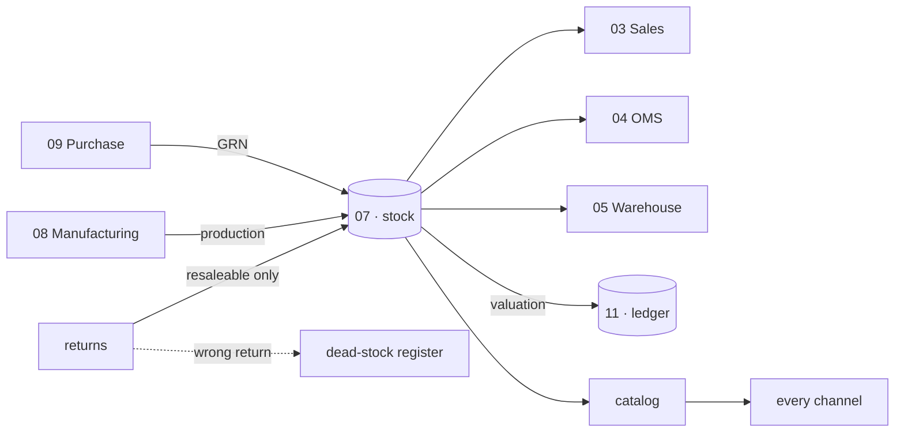

## The apps

**Stock** — live quantity by SKU, location and stage, with reorder alerts, batches, kits and
dead-stock. Goods you still own but that sit in a channel's own warehouse are a location like any
other, so consignment stock is counted, valued and aged instead of vanishing until it sells.

**Catalog / PIM** — one product record: attributes, images, HSN, MRP and the price each channel
actually sells at, pushed to every marketplace and your own storefront and scored for each
channel's rules before it lists. It also holds the two things everything downstream depends on —
the code each channel knows this product by, and the packed size and weight that decide the
courier rate and settle every weight dispute.

**Kit & Combo SKU** *(new)* — a sellable SKU made of component SKUs, such as a three-piece set
sold as one listing. Selling the kit decrements each component.

**Master-Data Hygiene** *(new)* — fuzzy duplicate detection and merge for designs, so one clean
master record protects every downstream report.

## Every point, one by one

**1. One stock number, event-driven, not per channel.** Inventory is not held separately for
Amazon and Flipkart. There is one number, and when the last piece sells on Amazon it leaves
Flipkart in the same instant — not three hours later as a cancellation. This matters because a
cancellation is what a marketplace account rating is lost to, and holding per-channel stock
guarantees cancellations.

**2. Stock is tracked through eight stages.** raw → cut → stitched → thread-cut → QC-passed →
ironed → packed → dispatched. A garment part-way through production is real inventory at a known
stage, so work-in-progress is visible and countable, not a black box between "bought fabric" and
"have product."

**3. Movements are the ledger; quantities are the running balance.** Every transition writes one
immutable movement row. The quantity you see is the sum of those movements. So "how did we get to
four?" is always answerable, and the number can never be edited into being — only moved into
being.

**4. The SKU has four levels, and its code is derived.** Brand → Design → Style-Variant → SKU,
written `{BRAND}-{DESIGN}-{COLOR}-{SIZE}` — for example `VS-MUSPUR-LAV-M`. A person can read the
barcode and know the brand, design, colour and size at a glance. But the system searches and
reports on the structured fields underneath, never by matching text inside the SKU string, so a
rename never breaks a report.

**5. Closing stock is a formula, and wrong returns are held out of it.** Closing = Opening + Net
Purchase + Production (finished sets, unset pieces, and job work) − Net Sales. A wrong return —
where the customer sent back a different item — is dead stock: it is written off, kept in its own
register, and never added back into the number you can sell.

**6. The valuation method sets the balance sheet.** FIFO, weighted-average or specific-cost is a
real decision, not a display preference, because it decides the rupee value of stock on the
balance sheet. Whatever is chosen, stock value in this module must equal the stock figure in the
accounts — the two are not allowed to drift.

**7. A kit decrements its components.** When a three-piece set sold as one listing is sold, the
top, the bottom and the dupatta each come out of stock. Otherwise the components read as still
available and are oversold.

## The data it owns

`designs`, `colors`, `sizes`, `items`, `item_aliases`, `kit_items`, `stock`, `stock_movements`,
`batches`, `opening_stock`, `hsn_codes`, `gst_rates`, `locations`.

## Done when

Stock is one number across every channel, a kit sale decrements all its components, and stock
valuation equals the balance-sheet figure.

---

# MODULE 08 · MANUFACTURING
*Know what a unit really costs to make*

## What this module is

From the first operation to the finished unit — including what every worker earned and what each
product actually cost. You define the stages, the rates and the rules; nothing here is fixed to
one trade. For this business specifically, it holds the karigar piece-rate costing that has
already been built and proven to the rupee against the owner's own records.

## Wiring

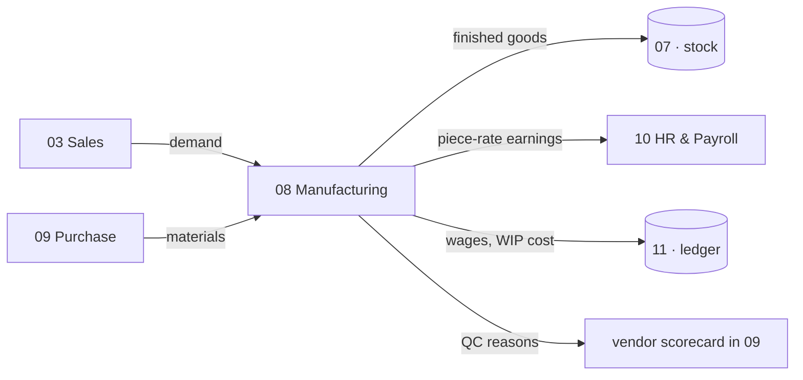

## The apps

**PLM & Development** — first idea to something you can actually make: specification, sample
rounds, costed trials and sign-off, with every version kept.

**Production Orders** — your own stages from first operation to finished goods, with
work-in-progress visible at each one.

**Piece-rate & Contractors** — output-based pay for anyone paid by the piece: pooled completion,
per-unit rates, rework and advances resolved into a single payout.

**BOM & Consumption** — what each product consumes, costed at today's material rates.

**Quality Control** — accept, reject or rework, with reasons that feed the supplier scorecard.

**Maintenance** — machines and tools: what is due for service, when it was last done, what it
cost, and what stopped while it was down.

## Every point, one by one

**1. Production runs through ten stages.** purchase, material check, sampling / third-party
service, pattern + cutting, stitching, thread cut, QC, iron, packing, dispatch. Each stage
records who was responsible, the quantity in and out, wastage and alterations, so the cost and
the loss at every step are visible rather than smeared across the whole run.

**2. There are four ways to make a piece.** Self production (entirely in-house), full job work
(outsourced end to end), partial job work (cutting in-house, stitching outside), and mixed (some
of a design self, some job-worked). The costing follows the mode, because a job-worked piece and
a self-made piece do not cost the same and must not be averaged into a lie.

**3. Karigar set completion is pooled, then bottlenecked.** For each design, the pieces made by
every karigar are pooled together first, and only then is the set formula applied. A set's count
is the minimum across the member columns that actually have pieces — a Lehenga Choli set is the
minimum of blouse, lehenga and dupatta when a dupatta exists, otherwise the minimum of blouse and
lehenga. Pooling first matters because two karigars each making half a design's tops and bottoms
complete real sets together that neither completes alone.

**4. Extras are named, and there is no "total pieces" column.** Pieces above the bottleneck are
reported as named surpluses — Extra Anarkali, Extra Plazo, Extra Dupatta — never lumped into one
undifferentiated bucket, and there is deliberately no "Total Pieces (Set + Extra)" column
anywhere, because that column was found to mislead every time it appeared.

**5. Payment is per raw piece, independent of set completion.** A karigar earns for every piece
they actually stitched, whether or not it ended up inside a completed set — a surplus piece is
still paid. Set completion is a production question; payment is a labour question; conflating
them cheats the worker.

**6. A missing rate is flagged, never guessed.** If a design has no rate in the rates master,
that piece type is costed at ₹0 and the design is flagged, rather than a plausible-looking rate
being invented. A visible gap is honest; a guessed number is a landmine.

**7. Alteration pay has one exception.** A karigar earns their piece-rate plus admin-assigned
alteration hours at ₹100 an hour — except that alterations needed because of the karigar's own
mistake are paid ₹0, because you do not pay someone to fix their own error.

**8. Performance is flagged, not punished automatically.** When the same person does the same
task on the same design at a similar quantity but takes more than 1.2× their previous hours, a
flag is raised and a WhatsApp message asks why. Five preset reasons auto-approve; a custom reason
needs an admin. The system asks a question; it does not dock pay on its own.

## Acceptance gate (§16A)

The karigar figures must reproduce the owner's real records exactly: **143 designs, 29 karigar
units, 25,307 completed sets, 59,110 pieces stitched, ₹26,90,062 total stitching cost, and 5
no-rate designs flagged.** A mismatch here is a bug in the software, never a new answer.

## The data it owns

`production_orders`, `production_stages`, `bom`, `bom_items`, `samples`, `karigar_assignments`,
`karigar_reports`, `qc_records`, `performance_flags`.

## Done when

Three production orders — self, full job work, partial — run to completion, and the §16A totals
reproduce to the rupee.

---

# MODULE 09 · PURCHASE
*Nothing over-billed gets paid*

## What this module is

The buy side, end to end — and the control that stops you paying for goods you rejected. Its
whole reason to exist is the three-way match: the check that a vendor's bill agrees with what
you ordered and what you actually received, before a single rupee goes out.

## Wiring

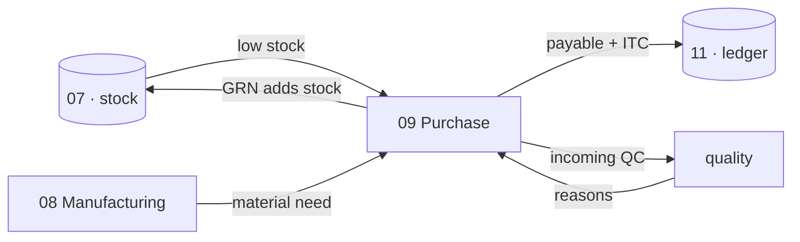

## The apps

**Procurement** — RFQ to purchase order to goods receipt, with a strict three-way match before
any bill is paid.

**Vendor Management** — vendor 360, payables, ageing, a real risk score, and sourcing that
follows performance.

## Every point, one by one

**1. Low stock drafts its own requisition.** When a SKU falls below its reorder level, a purchase
requisition draft is created, and when it becomes a PO the system suggests the priority-1 vendor
for that material at their last rate. Buying starts from a fact, not from memory.

**2. Vendors escalate in priority order.** Priority-1 is contacted first; on no response,
priority-2, then priority-3. The ranking is per material, so the right first call is made every
time without someone having to remember who is good at what.

**3. The three-way match is the gate.** A vendor invoice must equal the received quantity times
the PO rate. Three things are flagged and block payment: the GRN quantity not matching the PO,
the invoice not matching received-quantity × rate, and an invoice entered before the goods were
received. This one control is the difference between paying what you owe and paying what you were
billed.

**4. Purchase orders have a fixed number and a fixed lifecycle.** `PO-{FY}-####`, moving through
DRAFT → SENT → GRN → MATCHED or MISMATCH. A PO's state is always one of those, so its status is
never ambiguous.

**5. The vendor scorecard is earned, not entered.** Quality percentage, on-time-delivery
percentage and rate-versus-market are computed automatically on every transaction, and they drive
the priority ranking. A vendor's standing is the sum of how they have actually performed.

## The data it owns

`purchase_requisitions`, `purchase_orders`, `purchase_order_items`, `grn`, `grn_items`,
`vendor_invoices`, `three_way_match`, `vendors`, `vendor_materials`, `third_party_services`.

## Done when

A vendor invoice for more than was received is blocked before it can be paid.

---

# MODULE 10 · HR & PAYROLL
*Pay people right, on time*

## What this module is

Salaries and output-based earnings in one register, with attendance driving both — whether people
are on a monthly wage, an hourly rate or paid by what they finish. The pay rules here are final,
taken from the Combined Master Prompt, and the calculation engine behind them is already built and
tested against the owner's own payroll to the rupee.

## Wiring

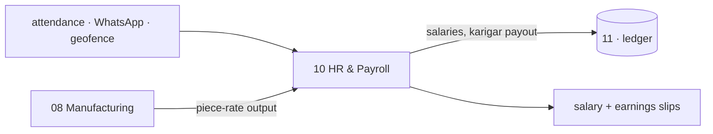

## The apps

**Staff & Contractors** — attendance, effective-dated salary and output-based earnings in a
single register, whoever is on it.

**Time-off & Advances** — leave, festival advances, and exactly how they change this month's
payout.

**Appraisal & Hiring** — performance reviews, and a hiring pipeline that ends in an employee
record.

## Every point, one by one

**1. Attendance has seven codes with fixed pay weights.** P (present, 1.0), H (half-day, 0.5), A
(absent, 0), HL (holiday, 1.0), OD (on duty, 1.0), PL (paid leave, 1.0), UL (unpaid leave, 0). A
blank cell is treated as absent. These weights are the whole basis of a day's pay.

**2. A month's worked days are Present + Holiday + half the Half-days.** The Days-Equivalent for a
month is P + HL + 0.5 × H. A holiday pays as a full present day — this is the settled rule — and
absent, unpaid-leave and blank contribute nothing.

**3. The daily rate is salary over threshold days, resolved for that month.** Daily Rate = the
monthly salary in force that month ÷ the threshold days in force that month. Both are looked up
from the effective-dated logs for the specific month, never taken as one flat figure, because a
person's salary changes over time and last year's rate must not be applied to last year's work.

**4. Pay scales both ways, uncapped.** Earning = Daily Rate × Days-Equivalent. Someone who works
more than the threshold earns more; someone who works less earns less. Thirty days worked against
a twenty-seven-day threshold pays for thirty.

**5. Flat and piece-rate people are the exceptions.** A person on the flat basis is paid their
full monthly salary every month regardless of attendance. A person on piece-rate has no salary,
no threshold and no attendance row at all — their wage is the hours they logged against designs
times their flat hourly rate.

**6. A raise is entered once and applies itself.** Editing a salary from one screen with an
effective-from date automatically closes the previous period and opens the new one. Past months
keep their old rate; a raise dated in the future activates on its own when that month is
processed. No historical payroll is ever rewritten.

**7. A blank month is "No Data," not a bad month.** Every month is one of three states: not
employed, No Data, or a real recorded month. A blank month inside an employment spell is a
tracking gap, and it is called No Data — never scored as "Below Average," because nobody logging
attendance is not the same as somebody failing.

**8. Attendance can be captured from the shop floor.** WhatsApp commands and a geofence (50 m
radius, 15-minute buffer) let staff and karigars check in from where they actually are, with an
admin override for the edge cases. Advances are deducted at payout, and a net that goes negative
is flagged rather than hidden. Staff are Active, On Leave or Inactive — and never deleted.

## The data it owns

`staff_salary_history`, `attendance`, `eod_reports`, `leave_requests`, `advance_requests`,
`payroll_runs`, `payroll_slips`, `karigar_earnings_summary`, `piece_rates`,
`task_threshold_rates`.

## Done when

A full month's payroll runs end to end with no manual touch and reconciles to the owner's own
figures.

---

# MODULE 11 · ACCOUNTING & GST
*Books that always balance*

## What this module is

A full double-entry ledger built for Indian compliance — not a tax report bolted onto a
spreadsheet. Medhava keeps the books on its own: no other accounting package is required, ever.
Tally, BUSY and Zoho stay available as connectors for anyone who already runs one, but no figure
in the business is ever sourced from them. This is the largest module in the system, because
proper Indian accounting is genuinely large.

## Wiring

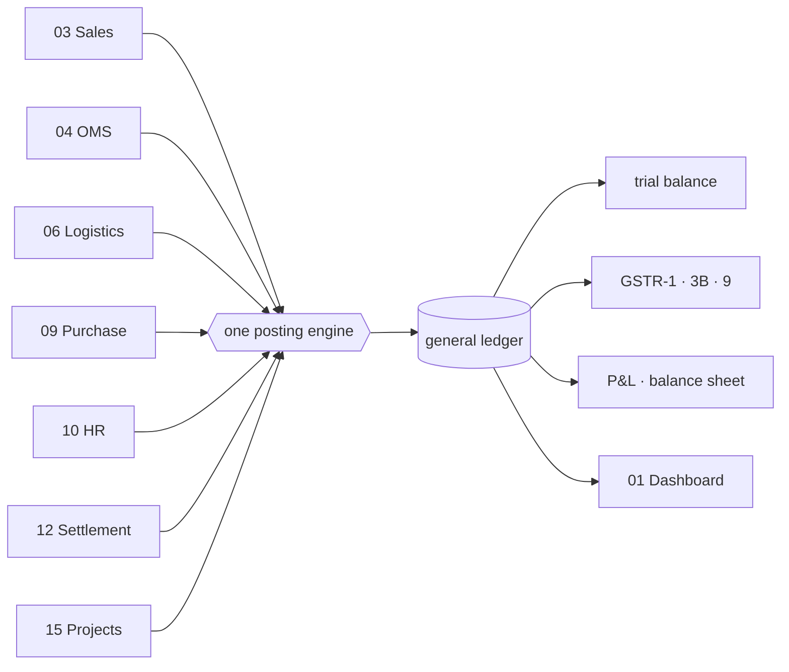

## The apps

**Accounting** — the chart of accounts, nine voucher types, and the one posting engine every
voucher writes through.

**Invoicing** — GST tax invoices and receipts, totals computed from the lines to the paise, with
round-off and e-invoice IRN.

**Expenses** — spend captured by category with approvals, and bill OCR to save typing.

**GST & Tax** — CGST, SGST, IGST, TDS, TCS, input credit, and the GSTR returns, filed per
registration.

**ITC Reconciliation** *(new)* — matching your purchases against the government's GSTR-2A/2B.

**Receivables, Payables & PDC** *(new)* — bill-wise allocation and a post-dated-cheque register.

**Fixed Assets & Depreciation** *(new)* — the asset register with both depreciation methods.

**Year-End Close & Period Lock** *(new)* — carry-forward and locking of a closed period.

**Finance Reports** — the P&L, balance sheet, and profit by channel, product and SKU, with the
MIS ratios.

## Every point, one by one

**1. One posting engine, no exceptions.** Every voucher — sale, purchase, payment, receipt,
journal — writes to the general ledger through a single shared posting engine. No voucher type
has its own private way of updating the books. This is precisely where home-built accounting
tools break: the moment two voucher types post differently, the numbers stop matching between
screens, and the owner stops trusting the software.

**2. Nine voucher types, and notes reference their original.** Sales Invoice, Purchase Invoice,
Credit Note, Debit Note, Payment, Receipt, Journal, Contra, POS. A credit or debit note must name
the invoice it reverses, so a reduction can always be traced to what it reduced.

**3. GST tax is determined from the two GSTINs, not chosen by hand.** Whether a sale is
CGST+SGST (intra-state) or IGST (inter-state) is worked out by comparing the seller's and buyer's
state codes. Nobody picks it from a dropdown, because a hand-picked tax type is a hand-made
error. Rates default from the item's HSN and are versioned by effective date, so an invoice from
last year keeps last year's rate even after a rate change.

**4. Input tax credit is reconciled against the government's own data.** Every purchase with GST
records its input credit, and that is matched against GSTR-2A/2B pulled from the portal.
Un-matched credit is flagged. Without this reconciliation, a GSTR-3B filing is essentially a
guess about how much credit you may legitimately claim.

**5. Payments settle named bills, and post-dated cheques wait.** A payment or receipt is
allocated against specific open invoices — oldest-first or chosen by hand — so the outstanding
report shows the true balance per invoice, not just a lump per customer. Post-dated cheques sit in
their own register and post to the ledger on the date they are realised, not the date they were
written.

**6. Fixed assets carry both depreciations.** The asset register computes depreciation by both
Straight-Line and Written-Down-Value methods, because Indian businesses need book depreciation and
tax depreciation calculated differently, and disposal correctly flows profit or loss on sale to
the P&L.

**7. A period can be closed and locked.** At year-end, P&L accounts reset and balance-sheet
accounts carry forward, with each year's data kept separable. Once a period is reviewed — after a
GST filing or an audit — it is locked, and no backdated edit is possible without an admin
unlocking it, an action that is itself recorded.

**8. Round-off has its own account.** Invoice totals rounded to the rupee post the difference to a
dedicated Round Off ledger. It is never absorbed into the sale amount, because absorbing it would
corrupt the GST calculation underneath.

**9. The audit trail cannot be turned off.** Every edit to every transaction is logged with who,
when, and the value before and after. By law (the MCA rule) this cannot be a setting that defaults
to on — it must be impossible to switch off, and kept for eight years. So there is no switch.

**10. Every figure traces to a voucher.** No report computes a number on its own. "Total sales
this month" is a query over the ledger, which traces to the invoices, which trace to the orders.
This is the integrity rule the whole module exists to keep: numbers must always reconcile, or the
business drifts back to Excel.

## The data it owns

`chart_of_accounts`, `voucher_series`, `journal_entries`, `journal_lines`, `gst_returns`,
`gst_input_credit`, `tds_entries`, `tcs_entries`, `bank_accounts`, `bank_transactions`,
`fixed_assets`, `depreciation_entries`, `post_dated_cheques`, `bill_allocations`, `period_locks`.

## Build order inside this module

Fixed by the specification itself: the posting engine and the audit trail first, wrapping every
write from day one; then Sales and Purchase Invoice, verified against the trial balance; then the
other seven voucher types; then year-end close and period locking; and the GST returns and 2A/2B
reconciliation last.

## Done when

One month of books closes cleanly, and GSTR-1 and GSTR-3B generate and verify.

---

# MODULE 12 · SETTLEMENT
*Get paid what you are owed, cycle by cycle*

## What this module is

A marketplace does not pay you what the customer paid. It pays you the selling price minus a
commission, minus a collection fee, minus a shipping charge it decided, minus a return it may or
may not have handled, minus taxes it withheld — and it hands you a settlement file that is a wall
of lines with no total you can trust. Settlement is the module that reads that file, works out what
each line *should* have been, and puts the two side by side. It is the difference between a
business that knows its real margin per order and one that only knows its turnover.

The reason this is a module of its own, rather than a screen inside OMS, is that the money side of a
marketplace runs on a different clock from the order side. An order ships today; its settlement
lands two or three weeks later, sometimes split across two cycles, sometimes with a return clawed
back a month after that. Settlement follows the money on the money's own timeline, matches each
rupee back to the order that earned it, and raises a claim the first time a number is wrong.

## Wiring

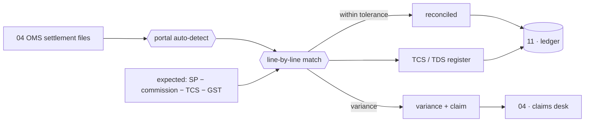

## The apps

**Payout Cycles** — a tracker that shows, per cycle and per channel, what should have landed, what
actually landed, and when — so a delayed or short payout is visible the day it is late, not at
year-end.

**Fee & Commission Audit** — the published commission rate against the rate actually charged, by
category, by SKU and by tier, so a silent increase is caught the first time it applies.

**TCS & TDS Register** — the tax the marketplace withheld, matched against what the portal reports
it deposited, so the credit you claim in Accounting is the credit that actually exists.

## Every point, one by one

**1. The portal is recognised from the shape of the file, not chosen from a menu.** Amazon,
Flipkart, Myntra, Meesho, Ajio, Nykaa and JioMart each publish a settlement file with its own
columns in its own order. The module reads the shape and knows which portal it came from. Asking a
human to pick "this is the Flipkart format" is an invitation to pick wrong, and a wrong parser
silently mis-reads every line.

**2. Every line has an expected value, computed independently.** For each settled order the module
computes what it should have received: selling price, minus the commission that the *agreed* rate
gives, minus the TCS the law sets, minus GST. That expected figure is worked out from your own
records, not read back from the file — because the whole point is to compare the file against an
answer the file cannot influence.

**3. Commission is read from the file, never assumed — and then challenged.** The commission the
marketplace actually charged is taken from the settlement line. But the commission it was *entitled*
to charge is computed from the published rate for that category and tier. When the two differ, that
is the finding. A system that assumes the commission is whatever the file says can never detect an
overcharge, because it has already agreed to it.

**4. A variance is only real past a tolerance.** Rounding means no two systems agree to the last
paise, so a line is flagged only when it is off by more than ₹1 or more than half a percent.
Below that it reconciles silently. This keeps the variance list to genuine problems, not a thousand
one-paise arguments nobody will ever pursue.

**5. Every variance has a named kind.** A shortfall is never just "less than expected." It is one
of: commission overcharged, TCS miscalculated, shipping fee higher than agreed, an unbilled return,
a weight discrepancy, or a parcel lost in transit. Naming the kind is what makes the claim
actionable — you dispute a weight discrepancy differently from a lost parcel, and the claims desk in
OMS needs to know which one it is.

**6. A silent commission increase is caught the first time it bites.** Marketplaces raise category
commissions with little notice. Because every line's commission is checked against the published
rate, the first order that pays the new higher rate throws a variance — you learn about the increase
from your own system on day one, not from a slow bleed in your margin discovered months later.

**7. Days-remaining on a claim sit next to the amount.** Every marketplace gives a limited window to
dispute a settlement. The module shows how many days are left to raise each claim beside the rupees
at stake, so the ones about to expire are worked first. A valid claim that lapses because nobody saw
the clock is money given away.

**8. Reconciled lines post to the books; they are not just ticked off.** Once a settlement line
matches, it flows to Accounting as a real receipt against the real invoice, so the ledger's picture
of "paid" comes from settlements, not from assuming every shipped order was paid in full. The
unreconciled remainder is exactly your marketplace receivable.

**9. The gate is 98% and ₹10.** The module is not finished on a demo. It must reconcile at least
98% of a real settlement file automatically, and the per-SKU profit it reports must land within ₹10
of your own records. Below that it is not trustworthy enough to run the money on, and a settlement
tool you cannot trust is worse than none, because it lends false confidence to a wrong number.

## The data it owns

`settlement_cycles`, `fee_audit_lines`, `tcs_tds_register`. It reads `marketplace_settlements` and
`marketplace_settlement_lines` from Module 04.

## Done when

A real settlement file reconciles at 98% or better, and every variance it raises is one you agree is
genuinely real.

---

# MODULE 13 · MARKETING
*Sell more without discounting*

## What this module is

Marketing here is not a separate world of vanity metrics; it is the demand-generation side of the
same order book. It plans and publishes content across the platforms, runs campaigns whose return is
measured on revenue rather than likes, moves marketplace prices by rule rather than by nerve, and
automates the small repetitive nudges that otherwise never happen. Its discipline is that every
lever it pulls is judged by what it did to orders and margin, using the same single stock number and
the same ledger as everything else.

The hardest and most valuable piece is repricing. On a marketplace, price is a live control that
interacts with rank, with competitors, and with your own stock. This module lets you raise and lower
prices by rules, records every change, and — crucially — shows you when a price rise cost you orders,
so a pricing decision can be judged on evidence instead of defended on instinct.

## Wiring

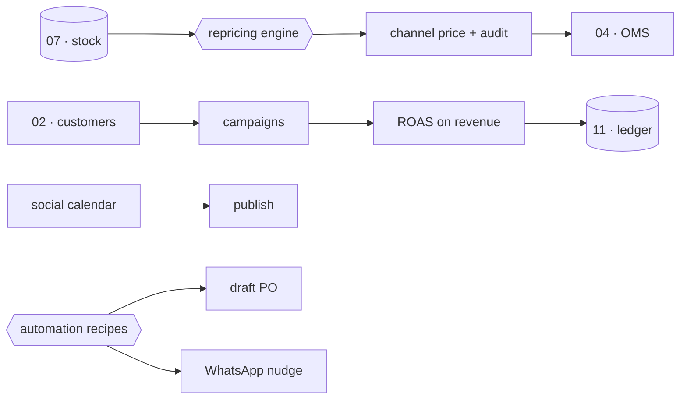

## The apps

**Social Calendar** — one calendar across seven platforms, so what goes out where and when is
planned in one place rather than improvised per channel.

**Campaigns** — a campaign board whose spend is pulled from the ad platforms and whose return is
computed on revenue, so a campaign is judged on sales, not impressions.

**Repricing Engine** — rules that set marketplace prices, with every change audited and its effect
on orders shown next to the rule that caused it.

**Automation** — a recipe builder for the standing "when this, do that" nudges that keep the
business tidy without someone remembering to act.

**Blog & Pages** — the editor for the site's written content and landing pages.

**Events** *(new)* — booth and lead capture for exhibitions and trade fairs, so offline demand lands
in the same CRM as everything else.

## Every point, one by one

**1. Campaign spend comes from the ad platforms; return is computed on revenue.** The money spent on
a campaign is read from the ad account, not typed in. The return is calculated as revenue over spend
— real orders attributed to the campaign — not opens, clicks or reach. A campaign that trended but
sold nothing shows a return of nothing, which is the truth a vanity metric hides.

**2. A price rise that cost orders is shown as exactly that.** When a repricing rule raises a price
and orders fall, the module puts the drop in orders next to the rule that raised the price. Pricing
is the one lever where the damage is invisible until you look for it — you simply sell fewer without
being told why — so the module makes the cause and the effect sit together.

**3. Every price change is audited.** Who changed a price, when, from what to what, and by which
rule, is recorded for every change on every channel. A price is money; a change to it with nobody
accountable is the same failure as an unexplained ledger entry.

**4. Repricing never breaks the single stock number.** A repricing rule sets price and only price.
It cannot touch quantity. The one stock number stays owned by Inventory, so no pricing automation
can ever oversell by fiddling a figure it had no business touching.

**5. Automation recipes are standing "when this, then that" rules.** When stock falls below its
reorder point, draft a purchase order and message the admin. When a B2B invoice is three days from
due, send a reminder. These are the small, repetitive, easily-forgotten actions that keep a business
from leaking, expressed once as a recipe and then left to run.

**6. The calendar is one surface across seven platforms.** Instagram, Facebook, and the rest are
planned on a single calendar rather than seven separate tools, so the week's content is visible as a
whole and a gap on one platform is obvious.

**7. Events feed the same CRM.** Leads captured at a booth or fair land as customers and interactions
in Module 02, not on a paper list that never gets typed up. Offline demand and online demand meet in
one customer record.

## The data it owns

`content_calendar`, `campaigns`, `influencers`, `asset_library`, `repricing_rules`,
`automation_recipes`, `events`.

## Done when

A month of content publishes on schedule, and a repricing rule can be judged by what it actually did
to orders.

---

# MODULE 14 · AI CONTENT ENGINE
*Write it, shoot it, cut it — from the catalogue you already have*

## What this module is

This is the module the whole platform is named for, and it is deliberately placed at number
fourteen, not number one, because it produces content *about* the catalogue — so the catalogue has
to exist and be correct before there is anything true to write about. It takes a design that already
lives in Inventory and turns it into the words, images and video that sell it, across every platform,
in the right voice for each. It is a studio wired to the same database as the shop floor, which is
what stops it from inventing a product that isn't real or a claim that isn't true.

The engine's governing idea is that different surfaces want different things. A marketplace listing
wants keywords a search engine can match. A caption a human reads wants a feeling. The engine knows
the difference, and it refuses to smear product-catalogue nouns across a creative surface where they
would read as spam. It drafts, then it criticises its own draft against a checklist, then it
rewrites — and it remembers the brand's voice across a session so the tenth caption sounds like the
first.

## Wiring

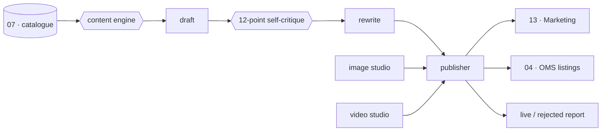

## The apps

**Content Engine** — the fourteen-stage pipeline that turns a design into listing copy and captions,
in the right register for each surface.

**Image Studio** — a layered image editor for building the product visuals from the photographs the
catalogue already holds.

**Video Studio** — text-to-video and image-to-video, presented in clearly labelled stages so nobody
mistakes a mockup for a finished, paid-for render.

**Design Studio** — the surface for design work that sits alongside the copy and imagery.

**Publisher** — the one place that pushes finished content everywhere and reports back what went live
and what was rejected, with the reason.

## Every point, one by one

**1. Structured data gets keywords; anything a human reads gets feelings.** A listing's back-end
fields are written for a search algorithm — dense with the terms a shopper types. A caption, a
headline, a description a person actually reads is written for a person — with rhythm and feeling.
The engine writes each surface in its own register rather than pasting one flat block of text
everywhere, which is what makes machine-written content read as machine-written.

**2. Product nouns are banned from creative surfaces.** "Anarkali georgette semi-stitched flared" is
exactly right in a search field and exactly wrong in an Instagram caption. The engine refuses to let
catalogue nouns bleed into the creative surfaces, because that bleed is the single clearest tell of
lazy automated content.

**3. The engine critiques its own draft before showing it.** A first draft is generated, then run
against a twelve-point self-critique, then rewritten in light of it. The draft you see is the second
draft, not the first. A model's first attempt is rarely its best, and building the criticism into the
pipeline is how the output clears the bar of "good enough to publish" rather than "good enough to
demo."

**4. Voice is remembered across a session.** As the engine writes through a batch, it holds the
brand's voice in session memory, so the tenth piece is consistent with the first. Content written as
a series of disconnected one-shots drifts in tone; holding the voice is what makes a batch feel
authored rather than assembled.

**5. Generation stays badged a mockup until a real paid API is wired.** Any studio feature that would
call a paid generation API is shown clearly as a mockup until that API is actually connected. It is
never presented as live when it is not. Showing a simulated render as a finished one is exactly the
kind of dishonesty the whole platform is built to avoid, so the label is not optional.

**6. Everything is generated from the catalogue that already exists.** The engine works from the real
designs, real photographs and real attributes in Inventory. It does not invent a product, a colour or
a claim. This is the wiring that keeps the marketing honest: it can only describe what the business
actually makes.

**7. The publisher reports live and rejected, with reasons.** When content is pushed out, the
Publisher reports back what went live on each platform and what was rejected — and why. A publish that
silently fails on two of six channels leaves you believing you are present where you are not; the
report closes that gap.

## The data it owns

`ai_runs`, `ai_listings`, `ai_design_analytics`, and the project state for each studio.

## Done when

A listing generates for one design across six platforms in under twenty seconds and publishes, with
every rejection explained.

---

# MODULE 15 · PROJECTS & COLLABORATION
*The work that is not an order — and the talking around it*

## What this module is

Not everything a business does is an order. There is the custom bulk enquiry that runs for six weeks
before it becomes an invoice, the wholesale onboarding, the internal initiative, the customer
complaint that turns into a small project of its own. This module is where that work lives — as
projects, cases, engagements and jobs, which are the same record wearing different words — together
with the timesheets, approvals and discussion that surround it. Its point is that this work, too, is
made of billable time and real cost, and both belong in the ledger like everything else.

The collaboration half exists so the conversation about work stays attached to the work. A decision
argued out in a chat that lives nowhere is a decision nobody can reconstruct a year later. Here, a
discussion thread hangs off the record it is about, and an approval carries its reason into the audit
trail, so the "why" survives as long as the "what."

## Wiring

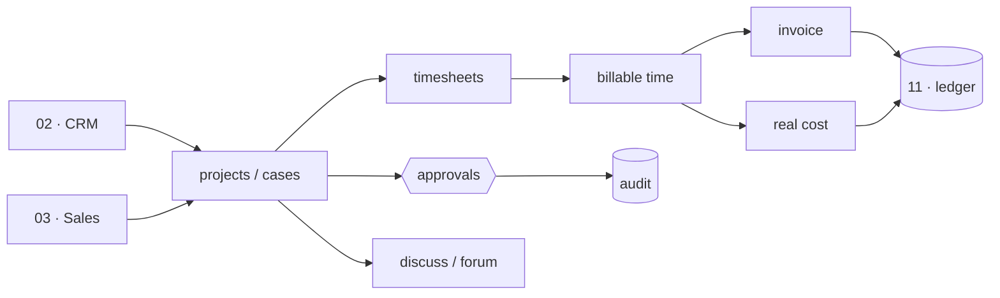

## The apps

**Projects & Cases** — one board for any non-order engagement, tracking billable time against real
cost so a project's true margin is visible while it runs, not after.

**Timesheets & Planning** — the grid where time is logged against projects and turned into both an
invoice line and a cost.

**Approvals** — a single queue for every kind of approval in the business, each decision carrying its
reason into the audit record.

**Forum** — the open, browsable discussion space for the wider team.

**Discuss** — record-attached threads, so a conversation about an order, a customer or a design lives
on that thing rather than in a separate chat.

**Knowledge Base** *(new)* — a role-scoped wiki of standard operating procedures, so how-we-do-it is
written down and visible to the people it applies to.

## Every point, one by one

**1. A project, a case, an engagement and a job are one record with different words.** Rather than
four half-built modules for four names of the same thing, there is one record type. What differs is
the vocabulary shown to different users; what stays the same is the underlying object, its time and
its cost. Building it once is what keeps it consistent.

**2. Billable time becomes an invoice and a cost without re-keying.** Time logged on a case flows
straight into an invoice line for the customer and a cost entry in the ledger. It is entered once.
Re-keying billable hours from a timesheet into an invoice by hand is exactly where hours get lost and
margin quietly leaks, so the module removes the hand.

**3. Real cost sits next to billable value, live.** A project shows what it is earning and what it is
costing at the same time, as it runs. A margin discovered only at the end is a margin you could not
steer; showing both while the work is in flight is what lets you act before a project goes underwater.

**4. There is one approval queue for the whole business.** A leave request, a purchase order, a
discount, a price change — every approval lands in one queue rather than scattered across modules.
One place to look is what stops approvals from silently stalling because no one knew they were
waiting.

**5. Every approval decision carries its reason into the audit trail.** When something is approved or
rejected, the reason goes to the audit record beside the decision. A year later, "why did we approve
this" has an answer that sits next to the approval itself, not in someone's memory.

**6. Discussion is attached to the record it is about.** A thread about a particular order lives on
that order. This is what keeps the reasoning behind a decision findable — you open the thing and the
conversation about it is right there, instead of scrolling a general chat for a discussion you half
remember.

**7. The knowledge base is scoped by role.** Standard operating procedures are written down once and
shown to the roles they apply to. A karigar sees the procedures that concern a karigar. Documented,
role-scoped process is what lets a new person be brought up to speed without a senior person
repeating themselves.

## The data it owns

`projects`, `timesheets`, `approvals`, `forum_posts`, `discussions`, `knowledge_base`.

## Done when

Billable time on a case becomes an invoice and a cost without being re-keyed once.

---

# MODULE 16 · PLATFORM
*The spine every module runs on*

## What this module is

Every other module assumes there is an answer to three questions: who is allowed to see this, how is
this business configured, and what happened here before. Platform is where those answers live. It
holds the companies, the users and their roles, the settings that make Vastrangam Vastrangam and
Ethnic Fashion Ethnic Fashion, the connections to outside providers, and the audit trail that records
everything anyone ever did. It is the spine — thin, but load-bearing, because if identity or the
audit trail is wrong, every module above it is wrong in a way no one can see.

It is also where the platform's promises about vendors and secrets are kept honest. Every capability
that touches an outside service has three or more interchangeable providers, so the business is never
hostage to one. No figure in the business is ever sourced from a provider — a provider that is named
as the origin of a number is a bug. And the product never asks a user for a marketplace, bank or
account password, because a system that asks for those has already become the thing it warns its
users about.

## Wiring

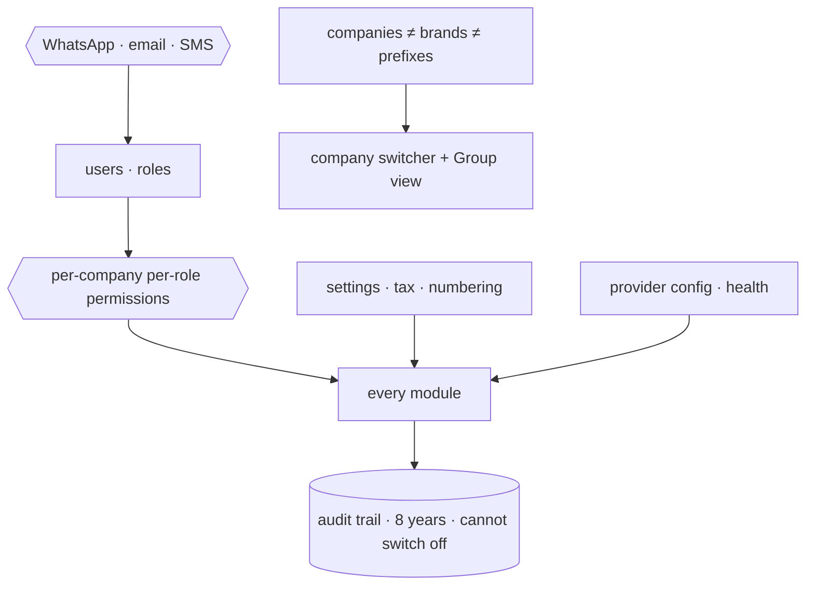

## The apps

**Identity, Settings & Audit** *(partial)* — login, per-company per-role permissions, the company
switcher with a read-only Group view, tax and numbering setup, provider configuration with an
integration-health view, and the browser over the audit trail.

**Ask & Print** — the natural-language query and the one consistent way anything in the system is
printed.

**Communications** *(new)* — the WhatsApp command console, broadcasts, email and SMS, and the handful
of scheduled jobs that drive daily nudges.

## Every point, one by one

**1. Roles are Admin, Manager, Staff, Karigar and Customer — per company, per role.** A person's
permissions are set for each company separately, so someone can be a manager in one company and see
nothing in another. Praveen and Vishal see all three. Access is a matrix, not a single global level,
because a group of sister companies is exactly where a single global level leaks data across a
boundary it shouldn't.

**2. Company, brand and prefix are three separate fields.** A company is a legal entity; a brand is
what it trades as; a prefix is what its SKUs and invoices read. Ethnic Fashion the company trades as
Go4Fashion the brand and its SKUs read GF. Collapsing these into one field is the mistake that makes
a whole multi-company system subtly wrong, so they are kept apart at the root.

**3. Staff are Active, On Leave or Inactive — never deleted.** A person who leaves is marked
inactive, not removed, because their name is attached to years of earnings, approvals and audit
records that must still resolve. Deleting a user orphans history; the history is the point.

**4. The audit trail cannot be switched off.** Every edit to every transaction, across every module,
records who, when, and the value before and after — kept for eight years, as the MCA rule requires.
This is not a setting that defaults to on; it is impossible to turn off, because an audit trail with
an off switch is one a bad actor can silence exactly when it matters. So there is no switch.

**5. Every capability has three or more interchangeable vendors.** SMS, email, payments, shipping —
each runs through any of at least three providers, chosen in settings. The business is never locked
to one vendor's price or uptime. Provider health is shown so a failing integration is visible before
it costs an order.

**6. A vendor named as the source of a figure is a bug.** Providers move messages and money; they
never originate a number that the business reports. If a report's total can be traced to "because the
provider said so" rather than to the ledger, that is a defect to fix, not a design to accept. The
ledger is the single source of every figure.

**7. WhatsApp is a command console, safely.** Staff run IN, OUT, LEAVE, ADVANCE, REPORT and Print by
message. Broadcasts go through the official API, warm up at two hundred a day, and honour a STOP
keyword. The convenience of running the business from WhatsApp is real, and so is the way an
unofficial blast gets a number banned — so it is done by the book.

**8. The product never asks for a marketplace, bank or account password.** It is a stated, built-in
promise: this system will never ask you for a marketplace, bank or account password. A tool that asks
for those credentials has become the phishing risk it should protect its users from, so the promise
is a hard rule, not a line of marketing.

**9. Group view is read-only.** Switching to the consolidated Group view shows all three companies
together but lets you change nothing, because a group is a lens for seeing, not an entity that
transacts. Edits happen inside a company; the group only reports.

## The data it owns

`companies`, `users`, `user_companies`, `audit_log`, `integration_errors`, `settings_environment`,
`whatsapp_messages`, `whatsapp_broadcasts`, `email_campaigns`, `notifications`.

## Done when

A karigar sees only their own earnings, an admin switches across all three companies and the figures
change with the company, and every edit made during the test is present in the audit browser.

---

## CLOSING — ONE TRANSACTION, EIGHT MODULES, ONE DATABASE

The proof that these sixteen modules are one system, and not sixteen programs sharing a login, is a
single garment followed end to end. It sells on a marketplace — the order lands in **OMS (04)**.
Stock falls by one in **Inventory (07)**, in the same instant, on every other channel too. It is
picked from the right bin in **Warehouse (05)**, and an AWB is booked in **Logistics (06)**. The
revenue and its GST post to **Accounting (11)**. Weeks later the payout is matched, to the paise, in
**Settlement (12)**. The karigar who stitched it was paid for it in **Manufacturing (08)** and
**HR (10)**. And all of it — every step — is a live figure on the **Dashboard (01)**, each number
clicking down to the record beneath it.

One transaction. Eight modules. One database. That is the whole design, and everything in this book
exists to make that single sentence true.
