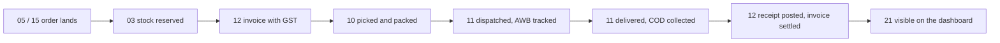
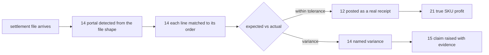
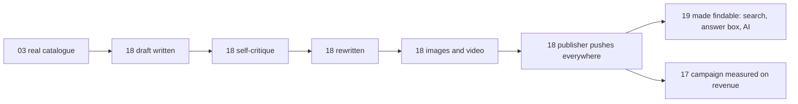

# Vastrangam — the tenant guide

**Onboarding one business onto Medhava, and proving the platform on it.**

18 steps · 13 acceptance checks · compiled 2026-08-24

---

## What this document is

Two things, and the second is the reason it exists.

**Onboarding.** How this business gets set up on the platform: its trade, its companies, its
channels, its data, its people. Every step says what to do, what you should see, and the condition
that makes it finished.

**The acceptance test.** This tenant was given complete data, real rules and real logic in order to
answer one question — *does the platform actually work?* Parts 7 and 8 are 13 checks derived
from the platform's own stated criteria. Each either passes or finds something.

**You install nothing.** No repository, no server, no toolchain. Those belong to the people building
Medhava and they have their own guide. Everything here happens in a browser.

| Label | Means |
|---|---|
| `WORKS TODAY` | The software for this step exists and runs. |
| `MANUAL` | No command — a browser, a phone, a form, or somebody else’s website. |
| `DEMO` | It runs, but on its own storage rather than the shared data core. |
| `SPEC` | Designed and documented. The code does not exist yet. |
| `NOT BUILT` | Nothing exists. This step *is* the work. |

**What is actually finished, stated once so no step has to hedge:** 16 of 113 apps run
today, and they run on their own storage rather than the shared core. The industry pack engine is
finished and proven. Tenancy is **not** — and Part 9 opens with that, rather than letting the rest of
the document imply otherwise.

---

## Part 0 · What you are on this platform

Medhava is the software. **Vastrangam is a tenant on it** — one business among many,
the same way a business is a tenant on Zoho or Odoo. You sign up, you take a plan, and you run your
companies inside it.

That distinction decides everything in this document. **You do not install anything.** No repository,
no server, no toolchain, no deployment. Those belong to the people building Medhava and they
have their own guide. Everything here happens in a browser.

#### 0.1 · Understand what is a row and what is code  `MANUAL`

This is not trivia — it is why onboarding is a morning rather than a project. The
22 modules, the 113 tables and the 285 rules are **code**: identical for every
tenant, and nothing you do changes them. Your trade, your companies, your channels, your locations,
your stages and your roles are **rows**. Configuration, not a version of the software built for you.

| Thing | Row or code | What that means for you |
|---|---|---|
| Your account | row | Signing up creates it. No deployment. |
| A company inside it | row | Up to **20** on the shipped plan. The software itself has no ceiling. |
| A channel | row | A new marketplace is a row you add, not a release you wait for. |
| Your trade’s words | row | An industry pack. The screens change wording, not structure. |
| Location, stage, role | row | A godown, a production stage and a job title are all settings. |
| The 22 modules | code | The same for every tenant. This is the product. |
| The 285 rules | code | Which ones apply is configurable. What they refuse is not. |

**Done when:** You can say which of the above you will be creating (rows) and which you will never touch (code).

#### 0.2 · Know the two addresses and what each one is  `MANUAL`

They are easy to confuse and confusing them wastes a day. **`vastrangam.com` is your shop** —
where customers browse apparel and buy. It runs on Shopify and it is not Medhava.
**Medhava is where you run the business** — the orders from that shop arrive in it as one
channel among several.

| Address | What it is | Who uses it |
|---|---|---|
| `vastrangam.com` | Your Shopify storefront | Your customers |
| the Medhava app | The business operating system | You and your staff |

**Done when:** You are clear that your storefront is a channel feeding the platform, not the platform itself.

#### 0.3 · Know what this run is for  `MANUAL`

You have given this tenant complete data, real rules and real logic. That is not so the
tenant can start trading tomorrow — it is so the platform gets **tested against a real business
instead of a demo**. Every check in Parts 7 and 8 either passes, or finds something. Findings are the
output.

> Part 9 already carries three gaps found while writing this document, by reading the code
> rather than by running anything. That is what the exercise is for.

**Done when:** You expect this run to produce a list of gaps, and you have somewhere to write them down.

---

## Part 1 · What to have ready before you start

Gathering these first turns onboarding into one sitting. Hunting for them mid-way turns it
into a week.

#### 1.1 · Collect the registration details for every company  `MANUAL`

Each company issues its own invoices under its own registration, so each needs its own details.

**Have ready:**

- Legal name of each company — the registered one, not the trading name
- GSTIN and PAN for each company that has them
- The state each is registered in
- The invoice prefix each already uses, if the business has been trading
- The financial year start month (April, for an Indian business)

> **Careful.** A company that does job work and has no registration of its own still belongs in the
> group figures — it just must not be pulled into a return it does not belong in. Note which companies
> are in that position now, rather than discovering it at filing time.

**Done when:** You have all of the above for every company you intend to create.

#### 1.2 · Export what you already have, as spreadsheets  `MANUAL`

Everything gets imported with a validation report **before** anything commits, so messy
data is fine. Missing data is not — you cannot validate what you did not bring.

**Have ready:**

- Customers — name, contact, address, GSTIN if B2B, and any outstanding balance
- Suppliers and vendors — the same
- Items and SKUs — code, description, HSN, MRP, GST rate, unit
- Opening stock — SKU, location, quantity, and the value you carry it at
- Opening balances, if you are not starting fresh

**Done when:** Five spreadsheets exist, exported from wherever the data lives today.

#### 1.3 · Have Shopify admin access to the storefront  `MANUAL`

Connecting the shop as a channel needs admin on it. Getting that access can take a day if it sits with someone else.

**Done when:** You can sign in to the Shopify admin for `vastrangam.com` yourself.

---

## Part 2 · Sign up and load your trade

The industry pack is what stops every screen being blank. It carries the vocabulary, the
stages your work moves through, the extra fields your records need, the documents you issue and a
starting chart of accounts — all as one configuration file, never a separate version of the software.

#### 2.1 · Create the account and choose a plan  `SPEC`

The plan sets the company cap. The shipped default is 20; the software has no ceiling of its own.

**Where:** The Medhava sign-up page.

> Marked SPEC because self-serve sign-up is designed and not yet built — it is Phase 7. The
> account is created for you until then.

**Done when:** The account exists and you know its company cap.

#### 2.2 · Load the `manufacturing` pack  `SPEC`

Of the 6 packs shipped, `manufacturing` is the closest fit for a business that makes
what it sells. Loading it renames concepts across every screen at once — the same order record reads
in your trade’s words with identical columns underneath.

> **Careful.** **Read Part 9 finding 2 before you do this.** The shipped `manufacturing` pack speaks
> *discrete manufacturing* — it calls an item a part and a person an operator. A clothing manufacturer
> says piece and karigar. There is currently **no way for a tenant to override a pack’s word**, so this
> step gives you close-but-wrong vocabulary. That is a real gap and it is written down rather than
> worked around.

**Done when:** Screens use trade vocabulary rather than generic labels, and the stage lists are populated.

---

## Part 3 · Create your companies

A company is a row. Creating three is doing this three times, and a fourth the day you open
one. **Company, brand and invoice prefix are three separate fields** — collapsing them is the single
most likely mistake at this step, and this business is a live example of why they are separate.

#### 3.1 · Create each company with its own name, brand and prefix  `WORKS TODAY`

One of these companies trades under a name that is not its own, and its SKUs carry a
third code. If brand and legal name were one field, its invoices would carry the wrong name — which
is a compliance problem, not a cosmetic one.

| Legal name | Trades as | Brand code | Invoice prefix |
|---|---|---|---|
| Vastrangam | Vastrangam | `VS` | `VS` |
| Ethnic Fashion | Go4Fashion | `GF` | `EF` |
| Adini | Adini Couture | `AC` | `AC` |

Look at the second row. The company is **Ethnic Fashion**, it trades as **Go4Fashion**, its SKUs read `GF` and its invoices read `EF` — four fields, three different answers. Collapse any two of them and its invoices carry a name that is not its registered one.

**Done when:** Every company exists with its legal name, trading name, brand code and invoice prefix set separately.

#### 3.2 · Check the group view adds up  `WORKS TODAY`

The group figure is the sum of the companies **minus trade between them**. Selling stock
from one of your own companies to another is not group revenue, and a system that counts it is
overstating the business to its owner.

**You should see:** Each company’s books balance on their own, and no ledger line in one points at another’s account.

> This is already proven in code rather than promised: the core test posts across a grid of
> ten companies and ten channels, then runs eleven by eleven with nothing changed. Your three companies
> are a small case of something tested much wider.

**Done when:** The group total equals the sum of the companies minus inter-company sales, and you have checked one such sale.

---

## Part 4 · Register your channels

A channel is where a sale came from. It is a row per company — two companies may each sell
on the same marketplace and they are two different rows whose figures never merge. **Stock stays one
number per SKU**, never split per channel, which is what stops the same piece being sold twice.

#### 4.1 · Add a channel row for every way each company sells  `WORKS TODAY`

| Kind | What it is |
|---|---|
| `d2c` | Your own storefront — `vastrangam.com` is this |
| `marketplace` | A marketplace account. One row per marketplace per company |
| `b2b` | Wholesale, on credit terms |
| `export` | Overseas, with its own documents |
| `pos` | A counter, drawing on the same stock as the website |
| `reseller` | Somebody selling on your behalf |

**Done when:** Every route to market you actually use exists as a row against the company that owns it.

#### 4.2 · Connect `vastrangam.com` as the Shopify D2C channel  `SPEC`

Orders placed on your shop become sales orders in Medhava — stock reserved, invoice
raised, ledger posted — without anyone re-keying them. That automatic chain is checked in Part 7.

**Where:** The channel row for `vastrangam.com`, kind `d2c`, then its Shopify connection settings.

> **Careful.** Marked SPEC, and honestly so. The D2C Sales app names Shopify as a supported storefront,
> but **the connector is not built** — no code in this platform talks to Shopify today. Writing this
> step as though it works would be exactly the kind of claim these documents exist to prevent. Until it
> is built, storefront orders come in through import like any other spreadsheet.

**Done when:** An order placed on the storefront appears as a sales order without anyone typing it in.

---

## Part 5 · Load the real data

Every import produces a validation report **before** anything commits. Errors come back as
rows to fix. Nothing is silently skipped — a silently skipped row is a wrong stock figure that nobody
can explain three months later.

#### 5.1 · Import in dependency order, checking each report before committing  `SPEC`

Later imports reference earlier ones. Items need their categories; opening stock needs its items and locations.

| # | Import | Needs first |
|---|---|---|
| 1 | Customers | — |
| 2 | Suppliers and vendors | — |
| 3 | Items and SKUs | the pack’s categories |
| 4 | Locations | — |
| 5 | Opening stock | items, locations |
| 6 | Opening balances | customers, suppliers |

**You should see:** A validation report for each, listing every problem row before anything is written.

**Done when:** All six imported, every validation report read, and every error row fixed rather than skipped.

#### 5.2 · Reconcile the imported figures against your own workbooks  `WORKS TODAY`

The number that matters is whether the platform agrees with what you already know. If
stock value or a karigar payout differs, one of the two is wrong and you need to know which **now**,
not after a month of trading on it.

**You should see:** Totals match your own sheets, or every difference has a named cause.

> A browser tool already exists that reads your own sale, return and karigar workbooks with
> no upload and no account, and emits one pair of columns per company found in the sheets. It is the
> fastest way to get a second opinion on these totals.

**Done when:** Stock quantity, stock value and outstanding balances agree with your books, or each gap is explained.

---

## Part 6 · Invite people and set roles

Permissions are per company per role from the first minute, not bolted on once something goes wrong.

#### 6.1 · Invite each person and give them a role in each company they work for  `SPEC`

Somebody who works for one company should not see another’s figures. That is enforced in
the database rather than only in the screens — but read Part 9 finding 1 before relying on it.

**Done when:** Everyone can sign in and each sees only the companies they belong to.

#### 6.2 · Set up the WhatsApp route for the shop floor  `DEMO`

The people making the product do not open a laptop. A short message becomes a real record:
attendance with the time and place, a production report against the design, a request in the approvals
queue.

> **Careful.** Nothing in this route ever asks anyone for a password, a bank detail or a document
> number, and it never will. If something claiming to be this system asks, it is not.

**Done when:** One worker has sent one message and it became a record you can see.

---

## Part 7 · The eight cascades

These are the checks that decide whether this is a system or a set of screens. **A single
action must update every consequence of it, in one transaction, with nobody re-keying anything.**
If one of these needs a human to carry a number from one screen to another, the platform has
failed at the only thing that makes it a platform.

Each row is a check: do the thing on the left, then confirm **every** item on the right
happened by itself.

### Check 7.1 · A sale, any channel

Do that one thing. **Every item below must then be true, without you touching it:**

- stock deducted
- invoice with GST
- ledger (Dr Debtor/Bank, Cr Sales + Output GST)
- customer outstanding and lifecycle
- settlement expectation
- dashboard

**Done when:** all of the above are true from the one action, and you can click the dashboard figure down to the voucher that produced it.

### Check 7.2 · A marketplace order pull

Do that one thing. **Every item below must then be true, without you touching it:**

- sales order created
- stock reserved
- pick list
- fulfilment
- on payout, reconciliation and variance check
- books

**Done when:** all of the above are true from the one action, and you can click the dashboard figure down to the voucher that produced it.

### Check 7.3 · A settlement import

Do that one thing. **Every item below must then be true, without you touching it:**

- each line matched to its order
- commission, fees, TCS, TDS to books
- variance
- claim raised
- bank reconciliation
- SKU profit
- dashboard

**Done when:** all of the above are true from the one action, and you can click the dashboard figure down to the voucher that produced it.

### Check 7.4 · A return

Do that one thing. **Every item below must then be true, without you touching it:**

- credit note
- refund
- a wrong return becomes dead stock, never restocked
- return cost to P&L
- return rate feeds design analytics

**Done when:** all of the above are true from the one action, and you can click the dashboard figure down to the voucher that produced it.

### Check 7.5 · A karigar production report

Do that one thing. **Every item below must then be true, without you touching it:**

- pooled set completion and piece-rate earnings
- finished stock in
- payout in HR
- Karigar Wages posted
- cost per piece
- design profit

**Done when:** all of the above are true from the one action, and you can click the dashboard figure down to the voucher that produced it.

### Check 7.6 · A material purchase

Do that one thing. **Every item below must then be true, without you touching it:**

- PO
- GRN
- three-way match
- raw stock in
- vendor payable
- input tax credit
- landed cost into COGS

**Done when:** all of the above are true from the one action, and you can click the dashboard figure down to the voucher that produced it.

### Check 7.7 · A staff attendance mark

Do that one thing. **Every item below must then be true, without you touching it:**

- effective-dated salary resolved
- payroll
- Salaries posted
- productivity cost
- design cost

**Done when:** all of the above are true from the one action, and you can click the dashboard figure down to the voucher that produced it.

### Check 7.8 · A generated image or listing

Do that one thing. **Every item below must then be true, without you touching it:**

- asset library
- product listing on the storefront and each marketplace
- marketing calendar
- published
- campaign return tracked back

**Done when:** all of the above are true from the one action, and you can click the dashboard figure down to the voucher that produced it.

> **Where these came from.** Read out of `PLAN_OF_ACTION.md` §A0 when this document was generated, not copied into it. If a cascade is edited out of that section, this generator refuses to build rather than quietly shipping a shorter acceptance test.

---

## Part 8 · The five end-to-end flows

A cascade proves one action fans out correctly. A flow proves the business can be **run**
start to finish. Each crosses many modules, which is the point — no module completes any of them
alone, and the gaps between modules are where systems usually fail.

Run each one with real data, once. Not a demo record — a real design, a real order, a real
karigar report.

### Check 8.1 · Design to dispatch

```mermaid
flowchart LR
  A["02 spec + sample"] --> B["02 sign-off"] --> C["03 becomes SKUs"]
  C --> D["06 demand becomes requirement"] --> E["07 buy the material"]
  E --> F["09 inspect on receipt"] --> G["08 make it, 10 stages"]
  G --> H["09 QC accept or rework"] --> I["03 finished stock in"]
  I --> J["10 pick and pack"] --> K["11 book the courier"]
```

**The same chain, step by step:**

1. 02 spec + sample
2. 02 sign-off
3. 03 becomes SKUs
4. 06 demand becomes requirement
5. 07 buy the material
6. 09 inspect on receipt
7. 08 make it, 10 stages
8. 09 QC accept or rework
9. 03 finished stock in
10. 10 pick and pack
11. 11 book the courier

**Done when:** one real case has travelled the whole chain above, every step triggered by the one before it, and the figure at the end can be traced back to the record at the start.

### Check 8.2 · Order to cash

**The same chain, step by step:**

1. 05 / 15 order lands
2. 03 stock reserved
3. 12 invoice with GST
4. 10 picked and packed
5. 11 dispatched, AWB tracked
6. 11 delivered, COD collected
7. 12 receipt posted, invoice settled
8. 21 visible on the dashboard

**Done when:** one real case has travelled the whole chain above, every step triggered by the one before it, and the figure at the end can be traced back to the record at the start.

### Check 8.3 · Settlement to books

**The same chain, step by step:**

1. settlement file arrives
2. 14 portal detected from the file shape
3. 14 each line matched to its order
4. 12 posted as a real receipt
5. 14 named variance
6. 15 claim raised with evidence
7. 21 true SKU profit

**Done when:** one real case has travelled the whole chain above, every step triggered by the one before it, and the figure at the end can be traced back to the record at the start.

### Check 8.4 · Karigar to payroll

```mermaid
flowchart LR
  A["karigar reports pieces by WhatsApp"] --> B["08 pooled across all karigars per design"]
  B --> C["08 sets = min across populated columns"]
  C --> D["08 earnings per raw piece"] --> E["16 into the month's register"]
  E --> F["16 advances deducted"] --> G["16 paid, method and reference recorded"]
  G --> H["12 Karigar Wages posted"] --> I["08 true cost per piece"]
```

**The same chain, step by step:**

1. karigar reports pieces by WhatsApp
2. 08 pooled across all karigars per design
3. 08 sets = min across populated columns
4. 08 earnings per raw piece
5. 16 into the month's register
6. 16 advances deducted
7. 16 paid, method and reference recorded
8. 12 Karigar Wages posted
9. 08 true cost per piece

**Done when:** one real case has travelled the whole chain above, every step triggered by the one before it, and the figure at the end can be traced back to the record at the start.

### Check 8.5 · Content to published

**The same chain, step by step:**

1. 03 real catalogue
2. 18 draft written
3. 18 self-critique
4. 18 rewritten
5. 18 images and video
6. 18 publisher pushes everywhere
7. 19 made findable: search, answer box, AI
8. 17 campaign measured on revenue

**Done when:** one real case has travelled the whole chain above, every step triggered by the one before it, and the figure at the end can be traced back to the record at the start.

> Read out of `PLAN_OF_ACTION.md` §A5 at generation time. Same rule as Part 7: if a flow disappears from the plan, this document refuses to build.

---

## Part 9 · What this run proved, and what it found

This is the output. A tenant run that produces a clean sheet has not been run properly — it
has been described. The three findings below were produced by reading the platform’s own code while
writing this guide, before a single check in Parts 7 and 8 was executed.

### Finding 1 · There is no tenant in the database  `NOT BUILT`

The plan says a tenant is a row, above company — that is what makes onboarding a
business data entry rather than a deployment. **No `tenants` table exists** in either schema
file, and the word does not appear in `modules.js` or anywhere in `core/`. Companies exist;
the level above them does not.

**Why it matters.** Every promise in Part 0 about one account holding up to 20 companies rests on a layer
that is not modelled. And the isolation between two tenants — the thing that keeps another
business from reading yours — has nowhere to hang.

**Evidence:** `core/schema.postgres.sql`, `core/schema.sql` — searched, absent

### Finding 2 · A tenant cannot override a word its pack got wrong  `NOT BUILT`

`term()` resolves a concept’s name from the **pack only** — there is no tenant-level
override. The shipped `manufacturing` pack speaks discrete manufacturing: it calls an item a
*part* and a person an *operator*. A clothing manufacturer says *piece* and *karigar*.

**Why it matters.** The product’s claim is that the screens use your words. For this tenant they use words
from a neighbouring trade, and there is no supported way to correct them short of writing a new
pack. Close-but-wrong vocabulary is worse than generic vocabulary, because it reads as though
somebody chose it.

**Evidence:** `core/packs.js` — `term()` reads `pack.vocabulary` and nothing else

### Finding 3 · A tenant gets one pack, and this business spans two  `DESIGN QUESTION`

`resolve()` takes a single pack. Of the 6 shipped, this business is both
`manufacturing` (it makes what it sells) and `retail-ecommerce` (it sells across D2C,
marketplaces, B2B and export). Neither alone describes it, and there is no apparel pack.

**Why it matters.** A business that makes and sells is not unusual — it is most of the target market. If one
pack per tenant is the intended design, the packs need to cover combined trades. If packs are
meant to compose, that is not built.

**Evidence:** `core/packs.js` — `resolve(pack)`, single argument; `core/packs/` — no apparel pack

#### 9.1 · Record every gap as it is found, with the evidence  `MANUAL`

A gap described from memory turns into an argument later. A gap with a file and a line
number in it turns into a fix.

| Write down | Why |
|---|---|
| What you did | so it can be reproduced |
| What you expected | from this guide, or from your own books |
| What actually happened | the figure, the error, or the silence |
| Where you looked | the screen, or the file and line |

**Done when:** Every gap has those four things. None is only in somebody’s head.

#### 9.2 · Separate "not built yet" from "built wrong"  `MANUAL`

They need opposite responses. Not built is a schedule question and the plan already
answers it. Built wrong is a defect, and it means something that passed its own tests still gets a
real business’s figures wrong — which is worth stopping for.

**Done when:** Each finding is marked as one or the other, and the built-wrong ones are raised immediately.

---

*Generated by `brand/delivery/website/mktenant.js` from `brand/site/tenant.js`, the canonical
lists, and the acceptance criteria in `PLAN_OF_ACTION.md`. Every count, every company code, every
channel kind, every cascade and every flow is read from its source at generation time. Nothing here
is maintained by editing this file — edit the source and regenerate.*
