# Vastrangam BOS

**Business Operating System — one business, one brain.**

22 modules · 113 apps · 19 technical layers · compiled 2026-08-26

---

## What this document is

Two documents in one, because they answer two different questions and people ask both.

**Part One — The System** is the reader's tour: what Vastrangam BOS is, how one garment moves
through it, every module and every app, and the rules that hold everywhere.

**Part Two — The Plan of Action** is the builder's document: the one law, the data core, the module-to-module wiring, five end-to-end flows, all 22 modules in build order with a diagram each, and what "done" means.


Both are generated from `brand/site/modules.js`, the one canonical list. Neither this page nor
either part contains a module count, an app name or an app order typed by hand — which is why they
cannot disagree with each other or with the software.

---

## What this document is

**This describes a design.** Everything in it is what the system is being built to be. Nothing in it
claims to already exist, and no part of it is presented as finished.

Two rules run through every page. **No capability depends on one tool** — 19 technical layers,
57 named alternatives between them, each behind an interface so a supplier can be changed
without a rebuild. **Nothing is static and the past stays correct** — 18 things a business
changes itself, instantly, each carrying the date it starts from so closed months never move.

---

## Companies and channels — the short answer

**The system is not limited to three companies, and never was.**

A company is a row. A channel — a marketplace account, the D2C site, a POS counter, a B2B desk, an
export buyer — is also a row. Every business record carries the company it belongs to; every sale
also carries the channel it came through. **Ten companies with ten channels each is the same tables
and the same code as three companies and seven marketplaces.**

| | Today's data | The design |
|---|---|---|
| Companies | 3 | a table, no ceiling |
| Channels per company | 7 marketplaces + D2C, B2B, export, POS | a table, no ceiling |
| Stock | one number per SKU | one number per SKU — never per channel |
| Books | one ledger per company | one ledger per company |
| Group | sum minus inter-company trade | sum minus inter-company trade |

This is checked rather than claimed. `core/tests/core.test.js` builds ten companies with ten
channels each — a hundred channels — posts an order down every one plus ten inter-company sales,
and asserts that every company's books balance, that no journal line anywhere points at another
company's account, and that the group figure is the plain sum **minus** inter-company trade:
₹2,10,500 gross, ₹50,000 eliminated, ₹1,60,500 group. The same builder is then called for eleven
companies and eleven channels with nothing in the code changed.

The reporting side behaves the same way. **Vastrangam_BOS_Data_Studio.html** reads your own sale,
return and karigar workbooks in the browser — no upload, no account, no internet — and emits one
pair of quantity columns per company **found in the sheets**. A fourth company is a new sheet in the
workbook, not a new version of the software.

---

## The honesty rules this document is written under

1. Nothing is described as finished. This is a design, and it says so on its first page.
2. No count is typed from memory. Every figure is read from the canonical list when this is written.
3. No figure is invented. Where a rate or a price is missing, the tool posts zero and names the
   item rather than guessing — a guessed rate is a wrong payment to a real person.
4. Where something could not be verified, it says so instead of implying it was.

---

# PART ONE — THE SYSTEM

**The Business Operating System for Vastrangam Group: 22 modules and 113 apps over one shared data core.**

This file is the whole system in plain text — every module, every app, and what each one reads and
writes. It is generated from `brand/site/modules.js`, the same file the website and every PDF read,
so nothing here can disagree with them. The counts below are not typed in; they are counted from that
file each time this page is built.

| | |
|---|---|
| **Modules** | 22, in dependency order — a module comes only after everything it draws on |
| **Apps** | 113 |
| **Companies** | Vastrangam (invoices VS) · Ethnic Fashion trading as Go4Fashion (invoices EF, SKUs GF) · Adini Couture (invoices AC) |
| **Shared data core** | Company · Item/SKU · Party · Stock · Ledger/Voucher · Order |
| **Key difference** | Not a suite of integrated apps. One application over one database, so there is no sync step and no second copy of any master record |
| **Compliance** | Double-entry books with CGST/SGST/IGST, TDS, TCS, input credit on **accepted** goods, GSTR-1 and GSTR-3B, filed per registration |
| **Channels** | Amazon, Flipkart, Myntra, Meesho, Ajio, Nykaa, JioMart, plus your own storefront, the Surat counter, boutique wholesale and export |
| **Security** | Row-level isolation per company; outside services connect with scoped, revocable keys — **never account passwords** |
| **Deployment** | Hosted, or single-file apps that run by double-clicking with no install and no internet |

---

### The one idea

Every module reads and writes the **same six records**. That is the physical reason a single goods
receipt can touch stock, the books, quality and sourcing in the same instant.

```
                  ┌───────────────────────────────────────┐
                  │          UNIFIED DATA CORE            │
                  │  Company · Item/SKU · Party ·         │
                  │  Stock · Ledger/Voucher · Order       │
                  └───────────────────────────────────────┘
                                   ▲ ▼
       every one of the 113 apps reads and writes these, and only these
```

**One stock number, not one per channel.** The last piece sold at the Surat counter disappears from
Myntra and Flipkart in the same instant — not three hours later as a cancellation, because
cancellations are what a seller rating is lost to.

**Accepted — not ordered — is what counts.** You order 100 metres. 100 arrive. Quality accepts 96.
Most systems increase stock by 100 and claim tax credit on 100. This one increases stock by **96**,
claims input credit on **96**, raises a debit note for the 4 rejected, and lowers that mill's accept
rate — automatically.

**Nothing derived is ever stored.** Outstanding, ageing, risk, promise dates, cost per piece and
profit per design are recomputed on read. A stored total is a number that can drift away from the
documents underneath it; a computed one cannot.

---

### How one garment moves through it

The test of whether this is one system or 113 programs sharing a login: sell a single garment and
follow it.

```
  sold on a marketplace
          │
          ▼
  ┌───────────────┐   order lands in one queue, sorted by the time LEFT
  │ 15 OMS        │   on its cut-off — not the time it arrived
  └───────┬───────┘
          ▼
  ┌───────────────┐   stock down by one, on EVERY channel, same instant
  │ 03 Inventory  │
  └───────┬───────┘
          ▼
  ┌───────────────┐   picked from the named bin, in walking order, filmed
  │ 10 Warehouse  │
  └───────┬───────┘
          ▼
  ┌───────────────┐   cheapest and fastest both known before booking;
  │ 11 Logistics  │   COD collected at the door reconciled to the bank
  └───────┬───────┘
          ▼
  ┌───────────────┐   revenue and GST posted through ONE posting engine
  │ 12 Accounting │   — entries balance or they do not post
  └───────┬───────┘
          ▼
  ┌───────────────┐   weeks later the payout is matched to the paise, and
  │ 14 Settlement │   any shortfall is named and claimed before it expires
  └───────┬───────┘
          ▼
  ┌───────────────┐   the karigar who stitched it was paid for it, per raw
  │ 08 + 16 Make  │   piece, whether or not the piece completed a set
  │    and pay    │
  └───────┬───────┘
          ▼
  ┌───────────────┐   every step a live figure — and every figure clicks
  │ 21 Dashboard  │   down to the record that produced it
  └───────────────┘

     one transaction · eight modules · one database
```

---

### How you actually use it — a walkthrough

Everything above says what the system is. This follows a design through it, because "22 modules
over one shared data core" is a true sentence that tells you nothing about your Tuesday.

Every screen below is a real render of the software, not an artist's impression — the same markup
and the same stylesheet the product uses. The figures on them are illustrative.

#### Where you are starting from

You are not starting empty, and that is the whole difference. There is a working house here: three
companies, nine panels, a counter, an export book and people who are paid by the piece. So the first
month is a **parallel run**, not a switch that gets thrown.

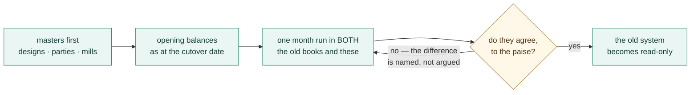
```mermaid
flowchart LR
  classDef s fill:#EAF6F3,stroke:#2E8B76,color:#123C34;
  classDef g fill:#FFF7E8,stroke:#B08343,color:#4A3210;
  A["masters first<br/>designs · parties · mills"]:::s --> B["opening balances<br/>as at the cutover date"]:::s
  B --> C["one month run in BOTH<br/>the old books and these"]:::s
  C --> D{"do they agree,<br/>to the paise?"}:::g
  D -->|"no — the difference<br/>is named, not argued"| C
  D -->|"yes"| E["the old system<br/>becomes read-only"]:::s
```

The gate is that the two agree **to the paise**, and where they do not, the reason is named rather
than the number quietly adjusted. A cutover that cannot reproduce last month is not a cutover.

#### A day in the life — one design, followed to the money

**It sells on a panel**  ·  Module 15

Nine panels land in one queue. It is sorted by the time **left** on the cut-off, not by when it arrived — so the Myntra order that has to leave in forty minutes sits above the one that came in this morning and has all day.

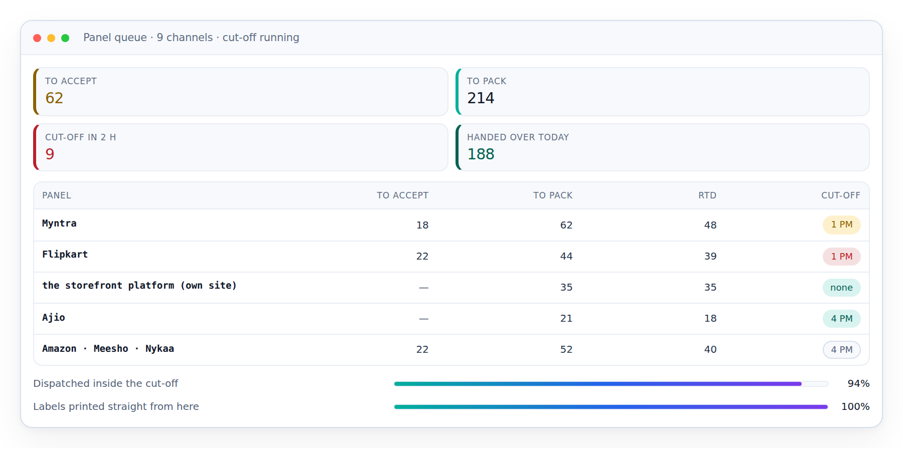


**The design record moves**  ·  Module 03

One design, one stock number, and each panel's own code for it mapped to yours. The piece that just sold is gone from every other panel in the same instant, which is the only thing that stops the cancellation a seller rating is lost to.

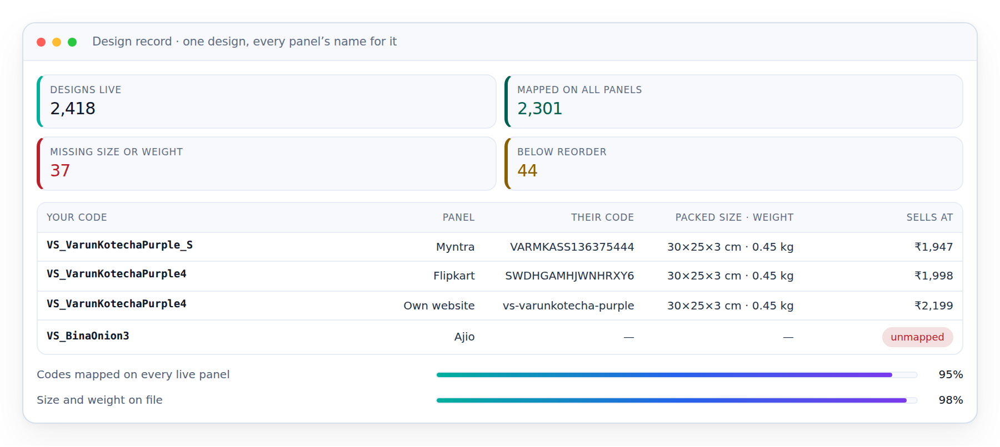


**It is picked in the godown**  ·  Module 10

A wave in walking order, zone A to C, confirmed against the bin it came from. A short pick stops the pack rather than quietly shipping the order light.

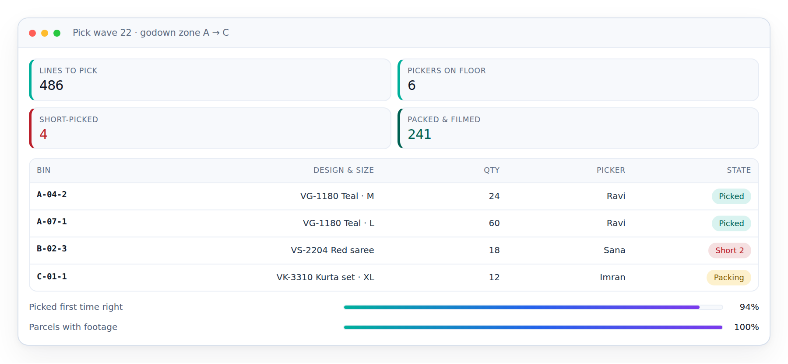


**It goes to the courier**  ·  Module 11

The rate is checked against the packed weight before booking — which is where weight disputes are won — and COD collected at the door stays a receivable until it is actually in the bank.

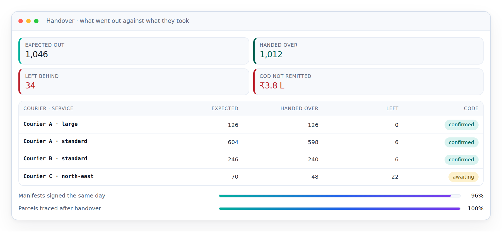


**The books post themselves**  ·  Module 12

Revenue and GST through one posting engine. Entries balance or they do not post. There is no third option and no month-end hunt for the one that did not.

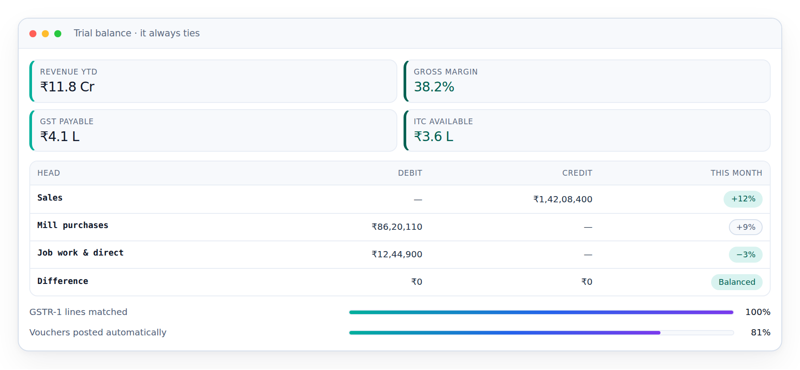


**Weeks later, the panel pays**  ·  Module 14

What the panel said it would pay against what actually arrived, cycle by cycle. A shortfall is named and claimed inside the window, instead of being noticed a quarter later when it can no longer be claimed.

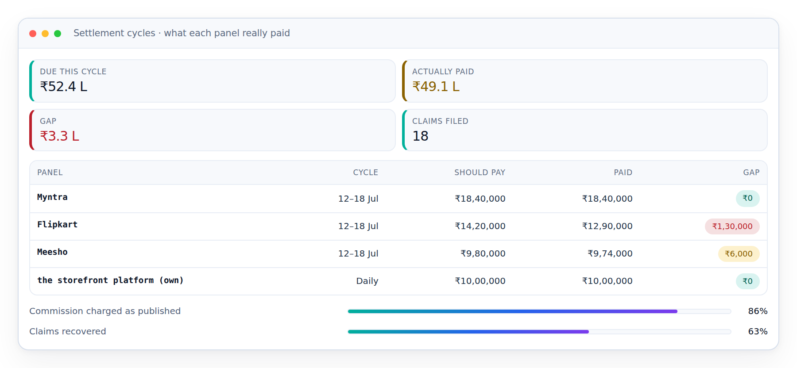


#### The month that pays people

This is the part most systems get wrong, and it is worth its own step.

**Staff and karigars in one register**  ·  Module 16

Monthly salary and per-piece earnings sit in the same register, with attendance driving both. **Sets are pooled across every karigar before the minimum is taken** — count the sets per karigar row and add them up, and every set completed by two people between them disappears. A missing rate posts zero and is flagged by name; it is never guessed, because a guessed rate is a wrong payment to a real person.

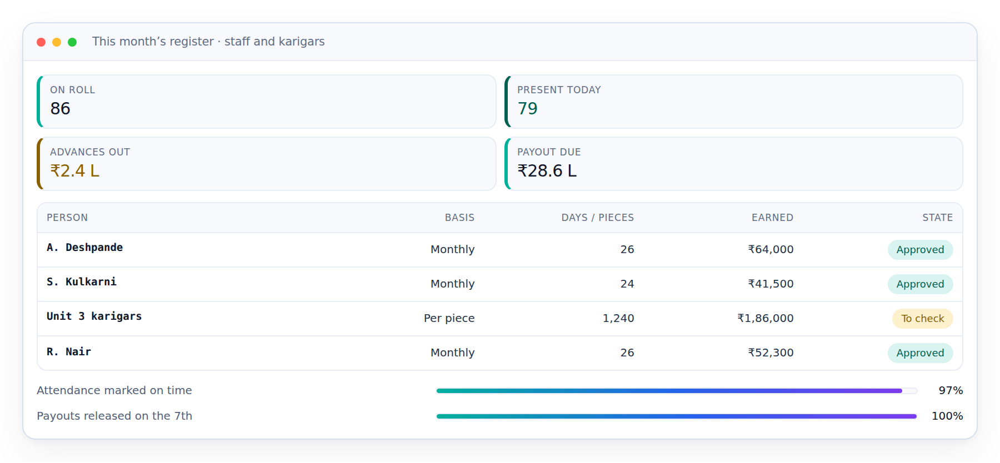


The document a payout is discussed from carries the **rules**, never the roster: the formula, the
thresholds and the reason, with no individual's pay attached to a shared file.

#### Month end

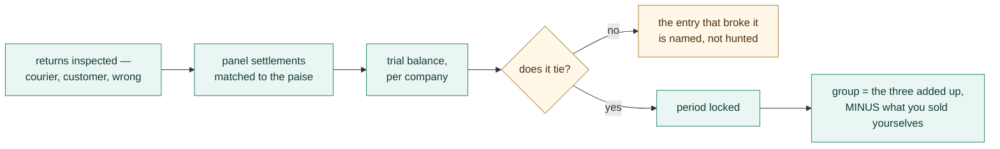
```mermaid
flowchart LR
  classDef s fill:#EAF6F3,stroke:#2E8B76,color:#123C34;
  classDef g fill:#FFF7E8,stroke:#B08343,color:#4A3210;
  A["returns inspected —<br/>courier, customer, wrong"]:::s --> B["panel settlements<br/>matched to the paise"]:::s
  B --> C["trial balance,<br/>per company"]:::s
  C --> D{"does it tie?"}:::g
  D -->|"no"| E["the entry that broke it<br/>is named, not hunted"]:::g
  D -->|"yes"| F["period locked"]:::s
  F --> G["group = the three added up,<br/>MINUS what you sold yourselves"]:::s
```

**What the money is doing next**  ·  Module 13

Receipts due, payments committed, and the fortnight ahead — so a festive buy is decided against the cash that will actually exist, not the cash in the account this morning.

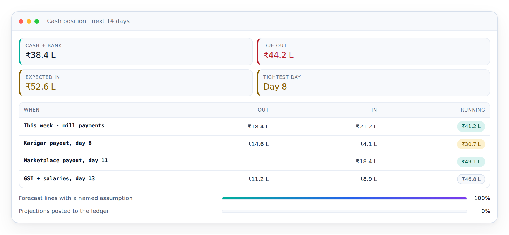


**And the group figure, honestly**  ·  Module 21

Each company's books are its own and balance on their own. Selling from one company to another is revenue in one set and cost in the other, so adding the three up would report a turnover the group never earned outside. Every inter-company entry is eliminated, and you are shown all three numbers — gross, eliminated, group — rather than asked to trust the last one.

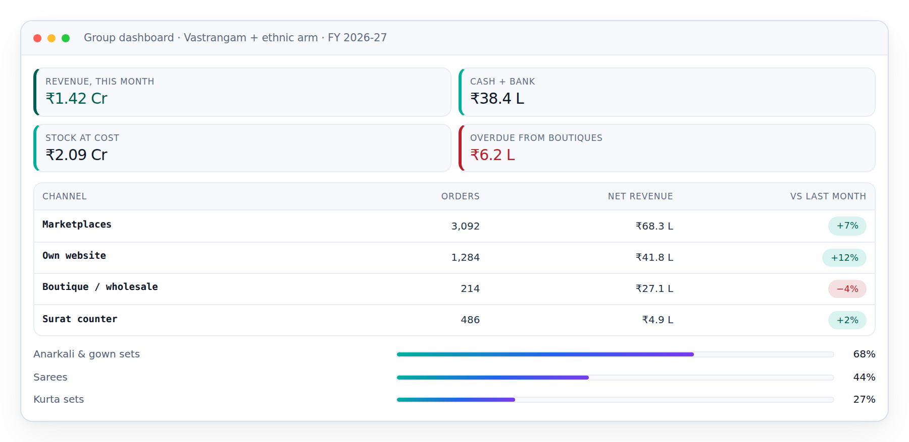


Then the next month opens, and nothing about the close depended on anybody remembering to run it.

---

### Every module and every app

Listed in build order.
is described as finished that is not.

#### Module 01 · Platform
*The spine the whole house runs on.*

Not a module you open — the layer underneath all 22. Who can see what, how Vastrangam is configured, and a record of everything that ever happened.

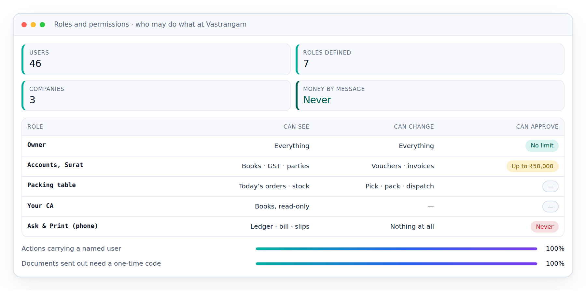

**Reads from:** Every module
**Writes to:** Every module

| App | What it does |
|---|---|
| **Identity, Settings & Audit** | Users, roles and permissions, company switching, tax and numbering setup — and an immutable record of everything that ever happened. |
| **Industry Packs** | What your trade calls things, the stages your work moves through, the extra fields your records need, the documents you issue and the reference data you start with — all of it loaded as a row of configuration, never as a separate version of the software. Pick the pack that matches your trade and the whole system changes its words: the same order screen reads as a job, a matter, a consignment or an appointment, with the same columns underneath. A pack may rename what exists, add fields to tables that exist, and switch discretionary rules off; it may never invent a concept, add a field to a table that does not exist, contain any executable code, or switch off the guarantees — company scoping, the audit trail, money never being a float — because a trade may change its vocabulary and may not opt out of the things the books are trusted for. Adding a trade nobody anticipated is therefore a file somebody writes, not a release somebody ships. |
| **Ask & Print** | At an exhibition in Hyderabad, send one line from your phone: “ledger Kalamandir”, “print slips”. It comes back as a PDF, or it prints at the Surat office — with nothing plugged into your phone and nothing at the office open to the internet. |
| **Communications** | WhatsApp commands and broadcasts, email and SMS, and the handful of scheduled jobs that carry a nudge to the right person without anyone remembering to send it. Every capability here has more than one interchangeable provider — none of them is ever the source of a figure the business reports. |
| **WhatsApp Command Console** | The shop floor does not open a laptop. A karigar or a staff member sends a short message — in, out, today’s pieces, leave, an advance — and it becomes a real record: attendance with the time and place it was marked, a production report against the design, a request in the approvals queue. The end-of-day prompt asks what is still open and how long it needs, so tomorrow starts from what is actually pending rather than from memory. Marking attendance checks the phone is at the unit within the radius set for it, with a grace window; a person outside it is not refused, they are flagged for the manager, because a system that locks someone out of being paid for being early at the wrong gate has failed at its job. Every override is recorded with who made it. The words a worker types are in the language they speak, and nothing here ever asks for a password, a bank detail or a document number. |
| **Data Privacy & Consent** | What a person’s data may be used for, captured as consent at the point it is given and honoured everywhere downstream — including the right to have it corrected or removed. Retention (how long a record is kept) and deletion (a person’s right to have their own data removed) are two different policies, tracked separately, because a rule that keeps records for the law and a request from a person to be forgotten do not resolve the same way. |
| **Provider Router & Cost Guard** | The rule that no capability depends on one outside service, enforced at the moment it matters instead of merely promised. Every capability has an ordered fallback list ending on an option that needs nothing connected, so a courier API that stops answering at 9pm, or an AI key that hits its quota mid-catalogue, drops to the next option instead of stopping the work. A provider that keeps failing is tripped out of the list entirely and retried once after a cooldown rather than hammered; retries inside one provider wait twice as long each time. And every paid call is counted in paise against a ceiling you set — over the ceiling the paid provider is refused, not warned about, and the work completes on a free one. Because every capability is guaranteed a built-in or by-hand option, a spent budget can stop the spending without ever stopping the business. |
| **Payment Data Scope** | A written statement of exactly which systems ever see a card or bank credential, and which never do — because every card-capable screen in this system hands that moment to a payment provider’s own secured field and never stores or even passes the number through application code. The statement is what an auditor or a partner asks for before they will connect to this system. |

---

#### Module 02 · Design & Sampling
*A style exists on paper before it exists as stock.*

A product moves from a first idea to something the business can actually make and sell — specification, sample rounds, costed trials and sign-off — before it is ever entered as a catalog record. Building this first means Inventory & Catalog never has to invent a style it has no real specification for.

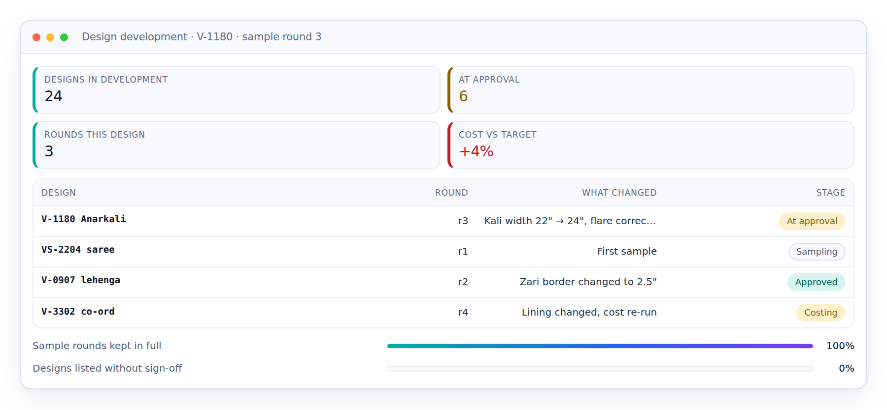

**Reads from:** CRM
**Writes to:** Inventory & Catalog · Manufacturing

| App | What it does |
|---|---|
| **PLM & Development** | Concept to a design that can actually be made: fabric and trim specification, sample rounds with the mill, costed trials against a target price, and sign-off — every version kept, so last season’s costing is still there. |
| **Design / IP Register** | What protects a design once it exists — trademark or copyright status, the date it was first shown, and a flag the moment a near-identical listing turns up elsewhere. Every version already kept by PLM & Development gets a filed status here instead of just a date stamp, because a design with no ownership record on file is a design nobody can defend. |

---

#### Module 03 · Inventory & Catalog
*One stock number everyone trusts.*

The most important number in the house: one quantity per design and size, per godown, per stage — greige, dyed, in stitching, finished, listed. Read and written by every other module. And one product record every marketplace lists from.


**Reads from:** Design & Sampling · Every module
**Writes to:** Every module

| App | What it does |
|---|---|
| **Stock** | Live quantity by design, size and location, fabric in metres and pieces in numbers, with reorder alerts, lot tracking, set kits and dead-stock ageing. |
| **Catalog / PIM** | One record per design — fabric, work, length, colour, size chart, images, HSN, MRP and what each panel actually sells it at — scored for Myntra and Amazon readiness before it lists. It also carries the two things everything downstream needs: the code each panel knows the design by, mapped to yours, and the packed size and weight that decide the courier rate and settle every weight dispute. Every listing’s state on every panel is here too — live, waiting for approval, blocked, archived — with the quality score that decides whether anyone sees it. |
| **Kit & Combo SKU** | A sellable SKU made of component SKUs — a three-piece set sold as one listing. Selling the kit decrements each component at order time, so stock is right for every piece in the set, not just the set itself. |
| **Master-Data Hygiene** | Duplicate detection and merge across customers, vendors and designs, and a dead-stock register for what has not moved in months. Protects every downstream report from the same record existing twice under two names. |

---

#### Module 04 · CRM
*Know every boutique, chain and customer completely.*

One record per party — a Kalamandir or a Rajmandir, a Surat walk-in or a Myntra buyer — carrying every enquiry, order, return, agreement and conversation, whichever channel it arrived on.

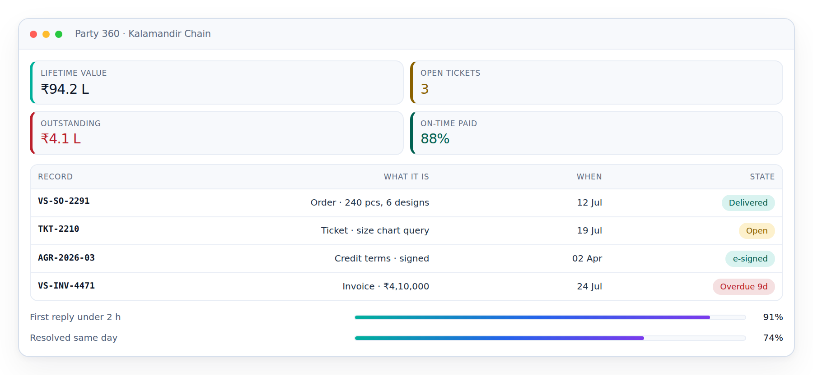

**Reads from:** Every module
**Writes to:** Sales · E-commerce / OMS · Marketing

| App | What it does |
|---|---|
| **CRM & Customer 360** | Enquiry to confirmed order, then the full lifetime: what they bought, what came back, what they are worth and which new range to show them first. |
| **Documents & eSign** | Mill agreements, job-work contracts, signed delivery challans, export documents and boutique credit terms filed against the party or order they belong to — found by that record, not by hunting through a folder. |
| **Helpdesk & Live Chat** | A boutique asking where its parcel is, or a customer asking about a size — the question becomes a ticket tied to the order, with the whole history already open. |
| **Forms & Feedback (NPS)** | A short form after delivery, and the score it produces attached to the design or item it is actually about — not just the buyer — so a complaint-prone item surfaces as a pattern instead of a scatter of individual gripes. |

---

#### Module 05 · Sales
*Counter, wholesale, website and export — one order book.*

The Surat counter, the boutique wholesale book, the website and the export shipment all write to the same order and draw on the same stock number. And the parcel is followed to the door, because a sale is not done until the COD money is in.

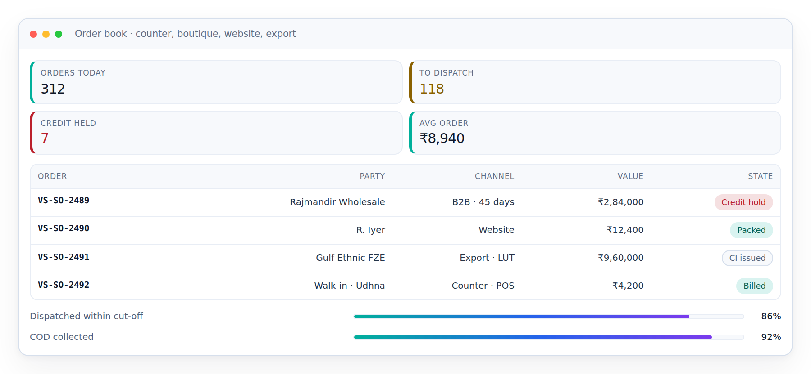

**Reads from:** Inventory & Catalog · CRM · Warehouse · Logistics
**Writes to:** Inventory & Catalog · Accounting & GST · Warehouse · Logistics

| App | What it does |
|---|---|
| **D2C Sales** | Orders from your own storefront, cart to dispatch, with loyalty and partial COD on a ₹4,400 anarkali. |
| **B2B & Credit** | Boutique and chain orders on credit limits and tier pricing, with outstanding aged against each party’s own agreed terms. |
| **Export** | Commercial invoice, packing list, LUT bond and IGST-refund tracking for the Gulf and UK buyers. |
| **POS** | Counter billing at Udhna that draws on the same stock as the website — no second stock register. |
| **Quotes & Proforma** | Send a quote, convert it to a confirmed order in one click. |
| **Couriers & AWB** | Book the parcel on the order, compare couriers for that pin code, print the label with the design code on it, and follow the AWB to the door. |
| **Subscriptions** | A schedule that raises its own invoice on its cycle and follows up on its own when a payment fails — for anything sold as a standing order rather than a one-off. |
| **Customisation & Made-to-Measure** | The order that does not exist in the catalogue: a buyer sends reference pictures and their own measurements, a price is agreed over several messages, and the piece is made for them. All of it is one record — the references, the measurement set, every quote in the negotiation and what was finally agreed, the advance taken to start work and the balance taken before dispatch. When the order is accepted it opens a production order like any other, so a bespoke piece is costed, stitched, checked and posted exactly as a catalogue piece is. Two legs of money on one order is the part most systems get wrong: the advance is earned when the work starts, the balance is owed until the piece ships, and the ledger shows both separately rather than one payment appearing when the whole thing is over. |

---

#### Module 06 · Planning & Requirements (MRP)
*Turn what is selling into what to buy and make.*

Confirmed orders and demand history have to become a plan before Purchase can buy anything or Manufacturing can start anything — otherwise buying and making are both just guessing. This module sits between the two: it reads what is actually selling and what is already committed, and turns that into requirement, not the other way around.

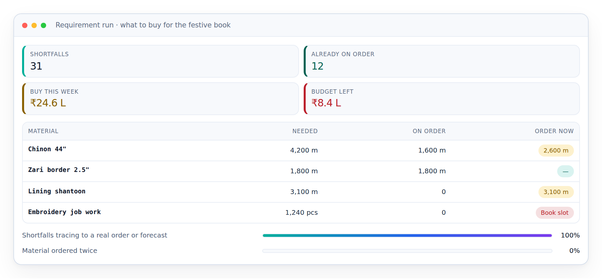

**Reads from:** Sales · E-commerce / OMS · Inventory & Catalog
**Writes to:** Purchase · Manufacturing

| App | What it does |
|---|---|
| **Demand Forecast & Signal** | What sold, by SKU and by period, turned into a short-term forecast — the number every requisition and every production order downstream is measured against instead of a guess. |
| **Requirement Explosion (MRP run)** | Confirmed demand exploded through the bill of materials into what raw material to buy and what to produce, and by when — so a purchase requisition or a production order always traces back to real demand, never to a feeling that stock is getting low. |
| **Open-to-Buy / Budget Ceiling** | A spending ceiling set per period regardless of what the demand signal suggests, so a real signal cannot on its own commit more money than the business has decided to risk this season. Every requisition the MRP run drafts is checked against what is left of the ceiling before it goes to Purchase. |

---

#### Module 07 · Purchase
*Nothing over-billed by a mill gets paid.*

The buy side end to end — mills, dyers, job workers and packing suppliers — with the control that stops you paying for metres you rejected.

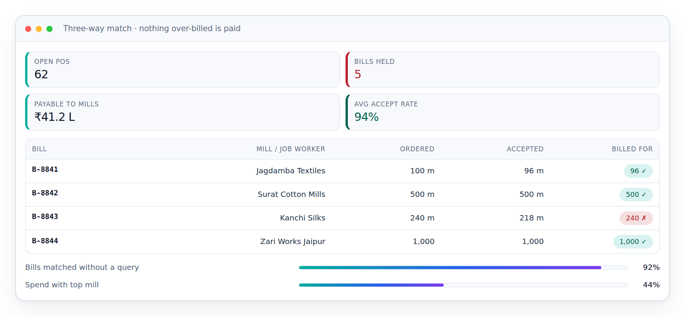

**Reads from:** Inventory & Catalog · Planning & Requirements (MRP) · Manufacturing
**Writes to:** Inventory & Catalog · Accounting & GST · Quality & Compliance

| App | What it does |
|---|---|
| **Procurement** | Enquiry to purchase order to goods receipt, with a strict three-way match: you ordered 100 metres, 100 arrived, quality accepted 96, and the bill is only cleared for 96. |
| **Vendor Management** | Mill 360 — payables, ageing, a real risk score from accept rate and spend concentration, and sourcing that follows performance rather than habit. |
| **Insurance Register** | What cover exists over stock in transit, stock in the warehouse and product liability, matched against what is actually moving through Purchase and Warehouse right now — so real value in transit is never quietly running with no cover tracked anywhere. |

---

#### Module 08 · Manufacturing
*Know what a piece really costs to make.*

From the cut plan to the finished piece — what each karigar earned, what the dyer charged, what the zari cost, and what that design actually cost before you priced it.

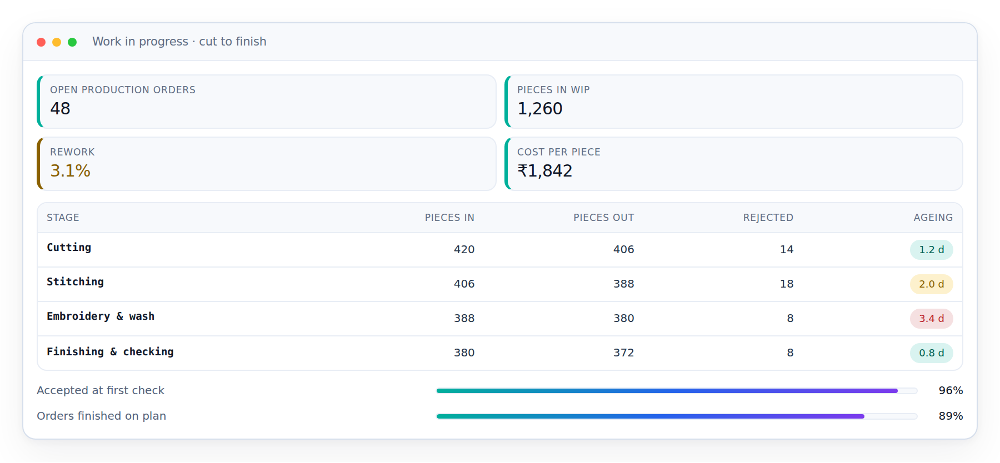

**Reads from:** Purchase · Planning & Requirements (MRP) · Design & Sampling
**Writes to:** Inventory & Catalog · HR & Payroll · Accounting & GST · Quality & Compliance

| App | What it does |
|---|---|
| **Production Orders** | Cutting, stitching, embroidery, washing, finishing and checking — your own stages, with work-in-progress visible at each and nothing lost at the dyer. |
| **Piece-rate & Contractors** | Karigars paid by the piece: pooled set completion, per-garment rates, alterations, rework and advances resolved into one payout. |
| **BOM & Consumption** | What each design consumes — metres of fabric, zari, lining, buttons, packing — costed at today’s mill rates. |
| **Maintenance** | Machines and the building: what is due for service, when it was last done, what it cost, and what stopped while it was down. |

---

#### Module 09 · Quality & Compliance
*Certify what was received and what was made.*

Quality inspection used to live buried as one step inside Manufacturing; it stands on its own here because a rejection at goods-receipt and a rejection on the production floor are the same discipline, and because the certificates a business holds — the proof it follows a standard — belong next to the inspections that back them up, not scattered across email.

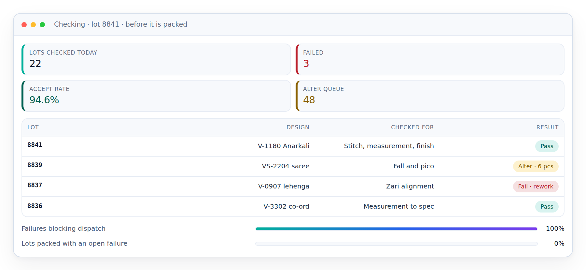

**Reads from:** Purchase · Manufacturing
**Writes to:** Purchase · Manufacturing · Inventory & Catalog

| App | What it does |
|---|---|
| **Quality Control** | Accept, reject or send for rework, with reasons that feed the mill’s accept rate and the karigar’s record. |
| **Certificate & Compliance Register** | Every standard the business or a vendor holds — a safety, labour or environmental certification — with its issue date, its expiry, and the audit that backs it, so a certificate about to lapse is visible before a buyer asks for it and finds it already expired. What this register tracks is what a sustainability report downstream is actually built from. |

---

#### Module 10 · Warehouse
*Pick the right design first time — and prove what you sent.*

Bin-level instructions and barcode scanning so the right piece leaves the godown and stock stays honest — and a recording of each parcel being packed, because a wrong-return claim is settled by footage, not by argument.


**Reads from:** Sales · E-commerce / OMS · Inventory & Catalog
**Writes to:** Inventory & Catalog · Sales · E-commerce / OMS

| App | What it does |
|---|---|
| **Picking & Bins** | Pick lists in walking order through the godown, by design and size, so nobody crosses the floor twice. |
| **Barcode Operations** | Scan to pick, pack, dispatch and run a physical stock count from a phone — the same scan whether the order came from a marketplace, your Shopify site or the counter. |
| **Packing Video** | Every parcel filmed as it is packed and indexed by its order number, so when a panel says the wrong piece was sent, the clip goes into the claim. |

---

#### Module 11 · Logistics
*The courier network — rates, failed deliveries and the COD money.*

Booking one parcel happens on the order. This module is the network behind it: what Delhivery, Blue Dart and the rest charge to that pin code before you pick one, what happens to a delivery that fails in a small town, and whether the cash collected at the door reached your bank.


**Reads from:** Sales · E-commerce / OMS · Warehouse
**Writes to:** Accounting & GST · Sales · E-commerce / OMS

| App | What it does |
|---|---|
| **Rates & Zones** | Every courier’s rate card by zone, weight slab and service — so the cheapest and the fastest option for this parcel are both known before it is booked. |
| **NDR & RTO Rescue** | A failed delivery worked while it can still be saved — reattempt, call, correct the address — before it becomes a return you pay for twice. |
| **COD Remittance** | What the courier collected at the door against what reached the Surat account, parcel by parcel, with every shortfall named and aged. |
| **Handover & Manifest** | What is expected out today against what the pickup boy actually took, per courier and per service. The manifest to hand him, the one-time code to confirm it, and a signed note of what was left behind — so a parcel lost between the packing table and the van has an owner. |
| **Fleet** | Your own delivery vehicles, if you run any — what each trip cost, what is due for service, and what that adds to freight. Optional; most businesses run couriers only. |

---

#### Module 12 · Accounting & GST
*Books that always balance — and no BUSY needed.*

A full double-entry ledger built for Indian compliance, keeping the books itself. B2B sales, returns, mill purchases, payments and receipts are entered by hand because a person decides them; every website, marketplace and counter sale posts itself.


**Reads from:** Every module
**Writes to:** Finance Reports · Treasury & Financial Planning

| App | What it does |
|---|---|
| **Accounting** | Double-entry books where every voucher balances and the trial balance always ties. |
| **Invoicing** | GST tax invoices and receipts, worked out from the lines to the paise. Where a panel raises its own invoice you keep both numbers on the order — theirs and your own series — so the panel’s paperwork and your books point at the same sale. |
| **Expenses** | Spend captured by category with approvals, and bill OCR to save typing. |
| **GST & Tax** | CGST, SGST, IGST, TDS, TCS, input credit, GSTR-1 and GSTR-3B — filed per registration, so a group where one company is registered and another is not files exactly what each one owes and nothing it does not. |
| **ITC Reconciliation** | Every input credit matched against the government’s own GSTR-2A/2B before a return is filed, so a credit claimed is a credit that is actually on record. |
| **Receivables, Payables & PDC** | Payments and receipts allocated against named open invoices, and a register for post-dated cheques that posts only on the date they are realised, not the date they were written. |
| **Fixed Assets & Depreciation** | The asset register with both Straight-Line and Written-Down-Value depreciation tracked side by side, and disposal posting its gain or loss straight to the books. |
| **Year-End Close & Period Lock** | Profit-and-loss accounts reset and balance-sheet accounts carry forward at year end, and a reviewed period locks against backdated edits until an admin unlocks it — an act that is itself logged. |
| **Finance Reports** | P&L, balance sheet, and profit by channel, design and SKU — so you know which anarkali actually earned money after commission, shipping and returns. |

---

#### Module 13 · Treasury & Financial Planning
*Know what cash is coming, not just what already arrived.*

Accounting records what happened; this module is concerned with what happens next — how much cash is actually expected, when, and whether spend against a budget is on track before the month closes and turns the answer into history.


**Reads from:** Accounting & GST · Sales · Purchase
**Writes to:** Accounting & GST

| App | What it does |
|---|---|
| **Cash Flow Forecast** | Expected receipts and expected payments laid out by week, drawn from open invoices and open bills rather than typed in by hand — so a cash shortfall is visible weeks before the date it would actually bite. |
| **Banking & Reconciliation** | Bank statement lines matched against the ledger’s own record of what should have moved, with anything unmatched surfaced instead of silently carried forward. |
| **Budget vs Actual** | A budget set per category and period, and actual spend from Accounting tracked against it as the period runs — not only after it closes, when the only thing left to do is explain the variance. |

---

#### Module 14 · Settlement
*Get paid what the panels owe you — cycle by cycle.*

Matching one payout to one order line happens in OMS. This is the level above: the settlement cycle each panel runs, the commission it actually charged against the rate card it published, and the TCS it deducted in your name.


**Reads from:** E-commerce / OMS · Accounting & GST
**Writes to:** Accounting & GST

| App | What it does |
|---|---|
| **Payout Cycles** | Every settlement cycle each panel runs — what it should pay, what actually landed in the bank, and on which day — so a late payout is visible the day it is late, not at month end. |
| **Fee & Commission Audit** | The commission a panel publishes for a category against what it actually took, style by style. A quiet rate change is caught the first time it is applied, not at year end — and your seller tier sits on the same screen, because the tier is what the rate card hangs off, and slipping out of one quietly costs more than any single deduction. |
| **TCS & TDS Register** | Every rupee the panels deducted as TCS, and TDS on job work, matched against the portal’s own figures — so the credit you claim is the credit you are owed. |

---

#### Module 15 · E-commerce / OMS
*Seven panels, one queue — and every rupee accounted for.*

Stop logging into Myntra, then Flipkart, then Ajio. Every marketplace order lands in one pipeline and your stock goes out to all of them — then the money side closes out in the same module: what the panel paid, what it kept as commission, what came back, and what it still owes you.


**Reads from:** Inventory & Catalog · CRM · Sales · Accounting & GST · Logistics · Settlement
**Writes to:** Inventory & Catalog · Accounting & GST · Warehouse · Logistics · Settlement

| App | What it does |
|---|---|
| **Marketplace OMS** | Myntra, Flipkart, Ajio, Amazon, Meesho, Nykaa and JioMart in a single queue — processed all together, channel-wise, or design-wise. The stages the panels really use, with the right cut-off counting down on each order — a quick-commerce or air-shipped order is not due at the same hour as a standard one. Priority orders at the top, and the day grouped by design so a Muskan Purple is picked once for eleven parcels instead of eleven times. |
| **Order Management** | One pipeline from new to delivered, whether the order came from a seller panel, your Shopify or WooCommerce site, a dealer or the counter. |
| **Manual Data Check** | The order and return sheets you already download from the panels, and the offline registers from the three shops — one file or a whole ZIP — read back as ten cross-checks: net sale after commission and fees, month, design, state, wrong returns, SPF claims, ads, payouts and GST. Every figure clicks through to the transactions behind it. |
| **Reconciliation** | Match every marketplace payout to the order line that earned it, and expose the gap. |
| **Claims & Disputes** | Weight disputes, SPF shortfalls, parcels lost in transit and returns that came back with a different piece inside — filed as claims with the packing footage attached, and answered before they close. A claim awaiting your reply is money; one closed for no response is nothing, so the days left sit beside the amount. |
| **Returns / RMA** | Customer returns, courier returns and wrong returns kept apart — because only one of the three is really your fault, and only one of them turns into dead stock. |
| **Channels & Storefronts** | Connect a channel once and it stays in step: catalogue out, price out, stock out, orders in. Seven marketplaces and any website platform — Shopify, WooCommerce, Magento, BigCommerce, Wix or a custom site over its own API — each switchable without touching your data. Shopsy and any other storefront a channel runs alongside its main one counts as its own channel here. Where a channel has no open interface, its own downloaded report is a first-class way in. A channel may also know you by a different trading name — that is a label on the channel, not a second company, so it tags the order and the payout without ever splitting your books. |
| **Labels & Documents** | The panel gives you a PDF; this hands the packing table something it can work from. Cropped to 4×6 for every channel, your design code printed large where the panel left it off, the invoice and slip merged behind it, and the whole batch to the label printer in one job. Reprint one parcel without redoing the lot — and no customer’s name and address is ever uploaded to an outside website to be cropped. |
| **Listing & Catalog Manager** | Bulk-create and bulk-edit listings across every channel from the one product record in Inventory & Catalog, and catch the mismatches that quietly cost sales: listed but out of stock, or in stock but never listed. |
| **Size / Fit Recommendation AI** | A fit suggestion at the point of purchase, built from the item’s own measurements and the return history of buyers who picked each size — aimed straight at the return reason that costs the most: the right item in the wrong size. |
| **AR / Virtual Try-On** | A way to see drape, fit and colour on a screen before buying, for items where a flat photo alone leaves too much to guess. |

---

#### Module 16 · HR & Payroll
*Pay everyone right, on time.*

Office staff on a monthly salary and karigars paid by the piece, in one register, with attendance driving both and the festival advance already deducted.


**Reads from:** Manufacturing
**Writes to:** Accounting & GST

| App | What it does |
|---|---|
| **Staff & Contractors** | Attendance marked by tap, effective-dated salary, and karigar piece-rate earnings in a single register. |
| **Time-off & Advances** | Leave, Diwali advances, and exactly how they change this month’s payout before you approve it. |
| **Appraisal & Hiring** | Performance reviews and a hiring pipeline that ends in an employee record. |
| **Recruitment** | The pipeline before someone becomes an employee — an opening, the people who applied for it, a trial piece where the work itself is the interview, and the decision with its reason kept. It matters more here than in most trades: a karigar is taken on for skill on a particular garment, and the trial output is the evidence, so it is recorded against the design and the rate that would apply rather than remembered as an impression. A candidate who is not taken on now stays findable when the same skill is needed in a busy month, and their personal documents are held under the same consent and retention rules as anyone else’s, not in a folder on somebody’s phone. |
| **Payout Execution** | Where the calculation in the earnings register actually turns into money leaving the business — bank batch, UPI, cash against a signed receipt — with the method and the reference recorded against every payout, so the register’s total and the money that actually moved can always be checked against each other. |

---

#### Module 17 · Marketing
*Sell more without cutting the price.*

Plan the festive calendar, run the campaigns, and let rules keep you competitive on the panels without giving the margin away.

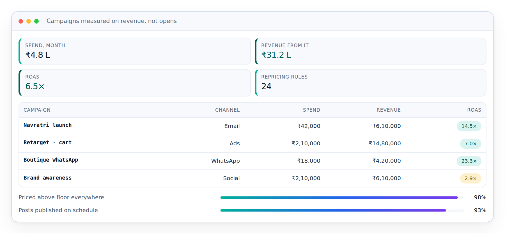

**Reads from:** Inventory & Catalog · CRM
**Writes to:** Sales · E-commerce / OMS

| App | What it does |
|---|---|
| **Social Calendar** | Plan and publish across every channel from one calendar. |
| **Campaigns** | Email, SMS and WhatsApp campaigns measured on real revenue, not opens. |
| **Repricing Engine** | Rules per panel and per design — floor, ceiling, match-lowest and a festive override — so a Diwali sale does not quietly go below cost. And what each change actually did: a design whose orders fell after a price rise shows as exactly that, next to the rule that raised it. |
| **Automation** | If this happens, do that — across any module, without writing code. |
| **Blog & Pages** | How to drape it, what to wear it to, which fabric for which season — written, scheduled and published to your own site with the meta and internal links already set. |
| **Events** | Trade shows and exhibitions worked as a channel of their own — booth, budget and every lead captured on the floor landing straight in CRM instead of on a stack of business cards. |
| **Website & Page Builder** | The storefront itself, built by dragging sections into place rather than by editing a theme file — hero, product grid, size guide, lookbook, contact form — each block reading live from the catalogue, so a price or a stock state on a landing page is the same number the order screen uses instead of a figure someone pasted in and forgot. Blog & Pages above writes articles into a site that already exists; this is for the businesses that do not have one, and it is the gap that shows up plainly when this module list is set beside a mature open-source ERP: they ship a full site builder next to the blog, and until now this did not. |
| **Markdown / Clearance Optimization** | The same rule engine that reprices for competitiveness, aimed at ageing stock instead: when to start discounting it and by how much, before it becomes a warehouse write-off rather than a sale at a lower margin. |

---

#### Module 18 · AI Content Engine
*Write it, shoot it, cut it — from your own catalogue.*

Listings, ads, reels and product photography generated from your own designs, in a voice that sounds like one person from Surat rather than a template — so the words match the piece and the picture is the size Myntra actually wants.

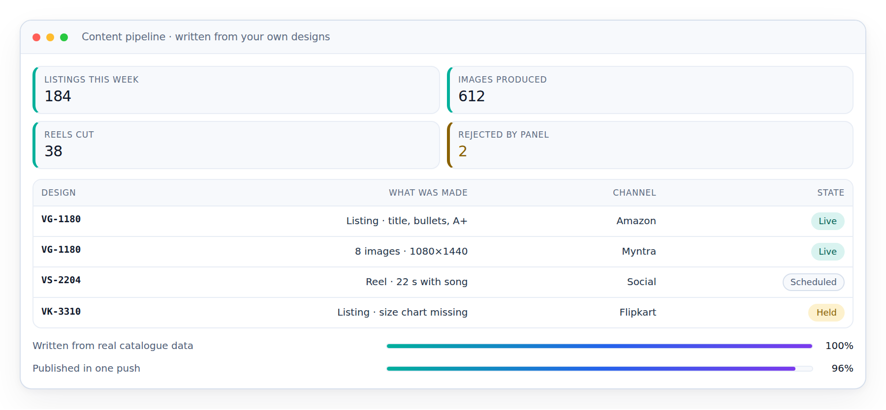

**Reads from:** Inventory & Catalog
**Writes to:** Marketing · E-commerce / OMS

| App | What it does |
|---|---|
| **Content Engine** | Fourteen stages in your own voice — buyer psychology, competitor reading, hooks, the product description, marketplace copy for Amazon and Myntra, ad variations, reel scripts, song lyrics for the reel, the calendar, size chart and alt text. |
| **Image Studio** | A phone photo becomes a listing image: layers, free transform, background removal, Myntra 1080×1440 and every other channel preset, watermark and SEO alt text. |
| **Video Studio** | Text and image to video, reels and ad cuts sized for every channel. |
| **Design Studio** | Banners, festive creatives and thumbnails — templates, layers, undo and redo, any colour, exact sizing and stock elements, exporting PNG, JPG or PDF at whatever size the panel or the printer asks for. |
| **Motion Renderer** | A reel rendered from a page of HTML and CSS — the same layers, fonts and brand colours the Design Studio already uses — into a real MP4, on this machine, with nothing uploaded. It is not a screen recording: the clock is faked, the animation is seeked to the exact instant of each frame, and only then is that frame captured, so the render does not care whether the machine was busy. Rendering the same festival banner twice produces the same file to the byte, which is what makes a reel something you can check and re-cut rather than something you have to watch all the way through and hope about. |
| **Narration Studio** | A voice over the reel, in the language the buyer actually speaks — the same script the Content Engine wrote, spoken. The default needs nothing installed and no key, because every modern browser can already speak; a self-hosted or cloud voice sits behind it as an interchangeable provider for anyone who wants a cloned or branded one. Long scripts are split at sentence boundaries and rejoined, so a two-minute description is not cut off at whatever limit a service imposes. A voice cloned from a real person is only ever used with that person’s recorded consent, filed against them in Data Privacy & Consent like any other permission. |
| **Image Generation Slot** | Generated imagery — a model on a background you do not have to shoot, a festival backdrop, a lifestyle scene — as a capability with interchangeable providers rather than a bet on one service: a queue of jobs, a preview while it works, inpainting to fix one region, upscaling and face correction. This one needs a graphics card. Image models cannot run on an ordinary office machine or on the container this system is built in, so what ships is the queue, the review screen and the provider slot, with the generating itself done by whichever engine you point it at — your own GPU box, or a cloud service, swapped without touching anything else. Said plainly here because the alternative is a screen that looks finished and produces nothing. |
| **Publisher** | One push sends the listing, images and copy to the website and every panel, and reports back what went live and what a panel rejected, with the reason. |

---

#### Module 19 · SEO, AEO & AIO
*Be found by a search box, an answer box and an AI.*

Content already exists once this module is reached; here it is made findable — by a traditional search engine, by the answer box above the results, and by the AI assistants now answering shopping questions directly instead of sending someone to a results page.

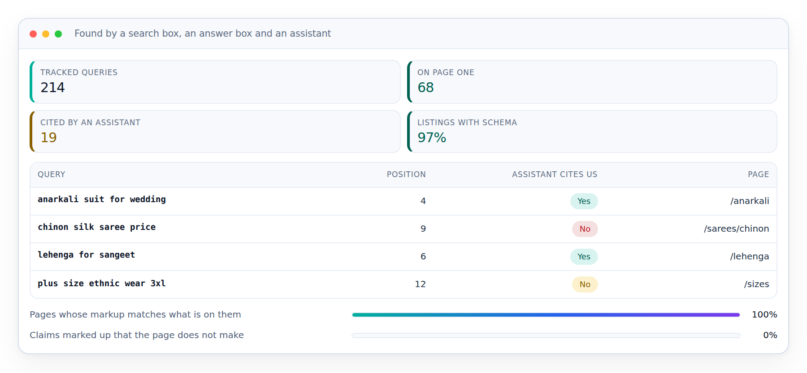

**Reads from:** Inventory & Catalog · AI Content Engine
**Writes to:** Marketing

| App | What it does |
|---|---|
| **Technical SEO & Schema** | Structured data, sitemaps and page-level technical checks against your own storefront and content pages, so a search engine can read what a page is actually about instead of guessing from the text alone. |
| **Answer-Engine Optimization** | Content shaped to be quoted directly by an answer box or a voice assistant — a clear, citable answer near the top of the page — rather than written only for a person to scroll through. |
| **AI-Engine Visibility Tracking** | Whether and how this business is actually cited when someone asks an AI assistant a shopping question in this category, tracked over time — the same discipline as rank tracking, aimed at a newer kind of result page. |

---

#### Module 20 · Projects & Collaboration
*The work that is not an order — and the talking around it.*

An exhibition in Hyderabad, a boutique’s custom order, a new godown fit-out, a legal matter with a supplier. Work that is not a sales order still has a deadline, a cost and documents — and it belongs on the same records as everything else.

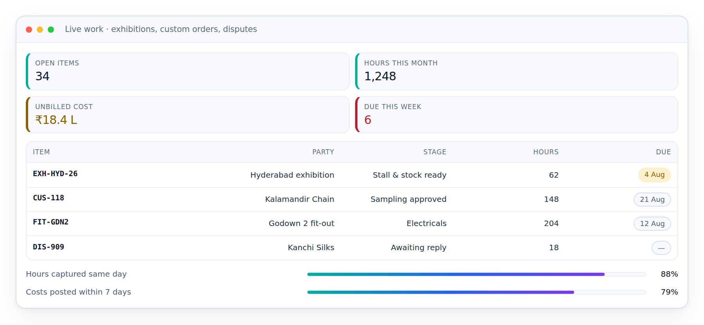

**Reads from:** CRM · Sales · HR & Payroll · Inventory & Catalog
**Writes to:** Accounting & GST · HR & Payroll · CRM

| App | What it does |
|---|---|
| **Projects & Cases** | An exhibition, a custom order for a chain, a fit-out or a dispute — stages you define, owners, deadlines, documents, hours and real cost, all on one record the ledger can see. |
| **Timesheets & Planning** | Who is on what this week and the hours that actually went in — against a project, an exhibition or a machine — with billable and non-billable kept apart. |
| **Approvals** | One queue for everything waiting on a yes: a mill purchase order, a boutique discount, a leave day, a credit note, a payment. The rule that sent it there is next to it, and the decision goes on the record. |
| **Forum** | Questions and answers that outlive a chat — for customers, dealers or staff — with the useful ones kept where the next person will actually find them. |
| **Automation Studio** | The place a person builds “when this happens, do that” by dragging it out and watching it run — a trigger, the steps after it, a branch where the answer decides which way to go — over the same event stream every module already writes to. Marketing’s Automation aims that idea at campaigns; this is the general one, reaching any module: a payment marked short holds the next dispatch and opens a claim, a karigar’s pooled sets crossing a threshold raises the payout for approval, a return marked damaged writes off the piece and messages the buyer. Every run is kept — what fired it, each step, what each step returned — because an automation nobody can inspect afterwards is a rule the business cannot trust with its money. |
| **Discuss** | The conversation attached to the record it is about — this order, this mill bill, this dispute — so a year later the reason for the decision is still sitting beside it. |
| **Knowledge Base** | A searchable internal wiki of standard operating procedures, scoped to the role it applies to, so how a task is meant to be done is written down once instead of carried in one person’s head. |

---

#### Module 21 · Dashboard & BI
*See the whole house without asking anyone.*

Every number rolls up here as work happens — the day’s marketplace orders, what the karigars finished, what is still lying at the dyer, what the mills are owed. No exports, no waiting for month-end.


**Reads from:** Every module
**Writes to:** —

| App | What it does |
|---|---|
| **CEO Dashboard** | Cash, sales by channel, stock by design, profit per piece and the alerts that matter — one screen, refreshed as the day runs. |
| **Report Builder** | Drag the fields you want into a report and save it for the whole team. |
| **Group Consolidation** | Ethnic Fashion, Vastrangam and Adini Couture as one set of figures, inter-company transfers removed, so the group position is real rather than three spreadsheets added together. Adini Couture has no registration of its own and mainly does job work — it still counts in the group, without being pulled into a return it does not belong in. Add the fourth company the day you open it. |
| **Excel Dashboard Builder** | A full workbook — financial summary, HR, purchase, sales, inventory and production, GST, expenses — generated from the live records behind every other screen, with each company shown as its own row and a consolidated row that is a formula over them, never a separately typed total. |
| **ESG / Sustainability Reporting** | Water usage, chemical compliance, waste and packaging, reported from the same certificate and audit records Quality & Compliance already keeps — so a sustainability report is a query over evidence already on file, not a separate exercise assembled once a year from scratch. |

---

#### Module 22 · AI Assistant, Agents & Automation
*Ask the house a question — and let the routine work run itself.*

Last for the same reason Dashboard & BI is late: something that answers questions about the whole business can only be built once the whole business is in one place. Three different things live here and the difference between them matters. An ASSISTANT answers a question you asked, from the records, with the records attached. A CHATBOT holds the same conversation with your customer instead of you. An AGENT is given a job rather than a question and works out the steps itself. That last one is what separates this module from Automation Studio in Module 20, where a person draws the steps in advance and the rule runs the same way every time; and from Automation in Module 17, which fires marketing campaigns and nothing else. Both of those stay exactly as they are — this module sits above them and calls them, rather than replacing either. Module 18 writes content; this module answers and acts.

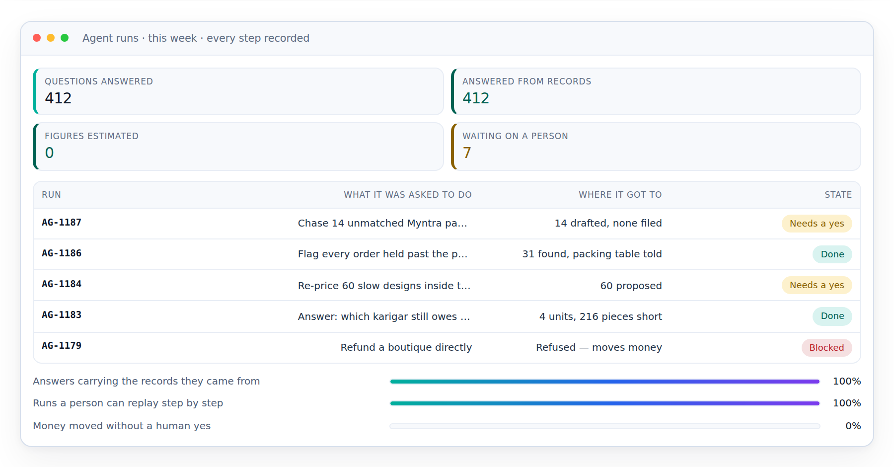

**Reads from:** Every module
**Writes to:** Projects & Collaboration · CRM · Marketing

| App | What it does |
|---|---|
| **AI Assistant** | Ask in your own words — “what did Myntra actually pay us last week, and what is still short?”, “which designs did Kalamandir return most” — and get the answer with the rows it came from underneath it, each clicking through to the record. It reads the same ledger and the same settlement lines the accounts screen reads, so its figure and the books agree. When it cannot find the answer it says so; it never puts a plausible number in place of a real one. |
| **AI Chatbot** | The same engine facing your buyer, on the website and on WhatsApp: where is my order, will the L fit me, I want to return this saree. It reads the real order and the real size chart, not a script written last season, and it says “let me get someone” for anything about money or a complaint — handing over into the Surat helpdesk queue with the whole chat already attached. It never asks a buyer for a card number, a bank detail or a password. |
| **AI Agents** | A job rather than a question: “chase every unmatched payout line from last week and draft the claim for each.” It works out the steps and stops where a person has to decide. Filing the claim, moving money, changing a price or messaging a boutique all wait for your yes. |
| **Agent Guardrails & Run Log** | What each agent is allowed to touch, written down as a scope rather than trusted to a prompt, and every run recorded step by step: what started it, what it read, what it proposed, what a person approved, what it actually changed. Kept in the same audit trail as everything else, with the same absence of an off switch. An agent whose working nobody can inspect afterwards is not a colleague, it is an unexplained entry in the books. |
| **Knowledge & Retrieval** | The index that makes the answers grounded: your own designs, rate cards, settlement files, standard procedures and past decisions, searchable so a reply quotes what is actually on file instead of what a model remembers about the trade in general. Permission-scoped at the row, so two people asking the same question get answers drawn only from what each of them may already see. |

---

### Companies and channels — how many is up to you

You have three companies and sell on seven marketplaces. Neither of those is a setting this system
was built around, and neither is a ceiling. A company is a **row**. A channel is a **row**. Every
business record carries the company it belongs to, and every sale carries the channel it came
through. Ten companies selling on ten channels each is the same three tables and the same code as
three and seven.

```
   COMPANIES (a row each)          CHANNELS (a row each, per company)
   ┌──────────────┐                ┌───────────────────────────────────────┐
   │ Vastrangam   │───────────────▶│ D2C · Amazon · Myntra · Flipkart ·    │
   │ Ethnic (GF)  │───────────────▶│ Ajio · Meesho · Nykaa · POS ·         │
   │ Adini        │───────────────▶│ B2B desk · Export buyer · …           │
   │ …the eighth  │───────────────▶│ …the eleventh                         │
   └──────────────┘                └───────────────────────────────────────┘
          │                                          │
          └──────────────┬───────────────────────────┘
                         ▼
              ONE stock number per SKU
        the channel is on the sale, never on the stock
```

**Three things this buys you, and one it deliberately refuses.**

**Each company's books are its own.** Its trial balance balances on its own. No report can reach
across into another company's rows — not by convention, but because a journal line can only point at
an account that belongs to the same company, and a test checks that no line anywhere ever does.

**The group is the sum minus what you sold yourselves.** When Vastrangam sells to Ethnic, that is
revenue in one set of books and cost in another. Adding the companies up would report a group
turnover the group never earned from the outside world. Every entry that names a sister company is
eliminated at group level, and the consolidation returns all three numbers — gross, eliminated,
group — so you can see the elimination rather than take it on trust.

**The channel is a dimension of the sale, never of the stock.** You can read this month by channel,
by company, or by both. What you cannot do is keep a separate stock number per channel, and that is
on purpose: the last piece sold on one marketplace has to vanish from the other ten at that instant,
which per-channel inventory cannot do.

**And the tool follows your sheets.** Drop a workbook into the Data Studio and the report's columns
come from the sheets that are actually in it. Two companies today gives two pairs of columns; a
fourth company is a new sheet in the workbook, not a new version of the software.

> **This is checked, not claimed.** `core/tests/core.test.js` builds ten companies with ten
> channels each — a hundred channels — posts an order down every one plus ten inter-company sales,
> and asserts every company's books balance, that no journal line points at another company's
> account, and that the group figure is the plain sum **minus** inter-company trade: ₹2,10,500
> gross, ₹50,000 eliminated, ₹1,60,500 group. It then calls the same builder for eleven companies
> and eleven channels with no code changed. The Data Studio's own tests do the matching thing on the
> reporting side: ten companies in one workbook produce ten pairs of columns.

---

### The rules that hold everywhere

1. **No app depends on any single outside company.** Every capability — books, marketplaces, AI
   writing, couriers, payments, messaging, storage, GST, printing, barcode — has several
   interchangeable providers and a by-hand option, so the system works with nothing connected at all.
   **A provider named as the source of a figure is a bug**; providers move messages and money, the
   ledger originates numbers.
2. **The books are this system's own.** No other accounting package is required, ever. Tally, BUSY
   and Zoho remain available for anyone already running one — nothing assumes them, and no figure is
   ever sourced from one.
3. **Nothing ever asks for an account password.** Outside services connect with a scoped, revocable
   key. *This system will never ask you for a marketplace, bank or account password. If any screen
   ever does, it is not this system.*
4. **Money is integer paise, never a floating-point number**, because float arithmetic accumulates
   the error that eventually shows up as a trial balance that will not tie.
5. **Values that change over time are effective-dated** — a salary, a price, a tax rate, a
   commission. March payroll resolves the salary in force *in March*. A missing value is an error,
   never silently treated as zero.
6. **Nothing is deleted, only deactivated.** A person who leaves keeps their name attached to years
   of earnings, approvals and audit rows that must still resolve.
7. **The audit trail has no off switch.** Eight years, before-and-after values, as the MCA rule
   requires — because an audit trail that can be switched off is one that gets silenced exactly when
   it matters.
8. **Gates, not warnings.** Each app refuses one thing outright, because a warning gets clicked
   through on a busy afternoon. A cash-on-delivery order cannot be packed below its advance. A bill
   for more than was accepted cannot be paid. Every gate is also a self-test.
9. **It is not trained. It is built.** No model learns from your data. Every rule is written down,
   visible on the Wiring screen, and checked by a self-test — so it is right on day one.
10. **You can reach it from anywhere, but it cannot be reached into.** Ask & Print takes a plain line
    from your phone and sends a PDF back. The office reaches out; the internet never reaches in.

---

### How it is verified

Nothing ships because it looked right on a screen.

1. **The arithmetic, with no screen involved.** Each engine runs in isolation and its self-tests
   execute against seeded data.
2. **Every screen and every control, in a real browser.** Each build opens in headless Chromium;
   every screen is visited and every interactive control on it is clicked. Any console error fails
   the build.
3. **The real job, with the result asserted.** Not "does the button click" but "did the thing
   happen". A control that looks alive but changes nothing fails the build.
4. **Against the owner's own figures.** Where the business already knows the answer, the software has
   to reproduce it — and where it cannot, the reason is named rather than the number quietly
   adjusted. The reference report the business produced by hand covers April 2025 to June 2027 and
   totals **25,307 sets, 59,110 pieces and ₹26,90,062** across 143 designs and 29 karigar units.
   Run today against the workbooks as they now stand, the engine returns **16,662 sets, 36,229
   pieces and ₹17,45,911** across 128 designs and 20 karigars — because the FY2026-27 workbook has
   since been restructured into one payment sheet per team and no longer carries a design grid at
   all, so that year's rows cannot be read from it. The verification does not paper over this: it
   places **every** design in the reference report into a bucket with a named cause — matched
   exactly, changed at source, rate added since, incomplete-set rule, or only present in the
   FY2026-27 grid — and fails on any design whose difference has no explanation. There are
   currently none. A mismatch is a bug, not a rounding difference; an unreadable input is a stated
   limitation, not a passing test.
5. **A structural audit.** Every "comes from" on every Wiring screen must name a module that actually
   exists, no vendor name may ever be the source of a figure, and the app count in every file must
   match this one.
6. **The shipped copy, not the working copy.** The packaged archive is extracted and re-tested in the
   folder a customer would open it in, because a packaging step that quietly renames a file breaks
   nothing until it is in somebody's Downloads folder.

---

### The honesty charter

This is the standard the build is held to, and it is written down because a standard nobody wrote
down is a standard nobody can be held to.

1. **This page describes a design.** Everything on it is what the system is being built to be, and
   nothing on it claims to already exist. When a part of it is finished, it will say so with the test
   that proves it — never before.
2. **Counts are counted, never claimed.** Every module and app figure on this page is read from the
   canonical module list when the page is built. No number here was typed by hand.
3. **Progress is reported as it is.** If tests fail, the failure is shown with its output. If a step
   was skipped, it is named as skipped. "Done" means implemented, tested and checked against the
   original request — not "the code has been written".
4. **Every capability names its alternatives.** No part of this system depends on a single outside
   company. Each layer names what it is built on, at least two replacements, and the interface the
   rest of the code talks to — so changing a supplier is a setting, not a rebuild.
5. **Uncertainty is surfaced, not smoothed over.** Where something cannot be verified, it is reported
   as unverified rather than presented as fact.

---

### Every technical word on this page, in plain language

**This page uses ordinary words wherever ordinary words will do.** Where it could not, the term is
here — with an everyday comparison, because a sales page that assumes you already know the jargon is
selling to somebody else.

Only the words this page actually uses are listed. Padding it with definitions of terms that never
appear would improve a count and make the page worse.

#### platform

One piece of software that many separate businesses use at the same time, each seeing only its own information.

*Ek badi building jisme bahut saare offices hain. Building ek hai, par har office ki chaabi alag — koi kisi aur ke office mein nahin ghus sakta.*

#### module

One area of work in the system — sales, purchase, staff, accounts. Each is a set of screens that belong together.

*Dukaan ke alag-alag counters. Ek counter bikri ka, ek kharidi ka, ek hisaab-kitaab ka.*

#### industry pack

A settings file that teaches the system your trade — what you call things, the stages your work moves through, the documents you issue.

*Ek hi machine, alag-alag saancha. Saancha badal do, wahi machine doosri cheez banane lagti hai.*

#### database

Where all the information is kept, arranged so any of it can be found instantly and nothing gets lost.

*Ek badi almari jisme har cheez apne fix khaane mein rakhi hai — dhoondhne ke liye poori almari palatni nahin padti.*

#### table

One kind of information inside the database — all your customers in one, all your orders in another.

*Almari ka ek khaana. Ek khaane mein sirf customers, doosre mein sirf orders.*

#### row

One single record — one customer, one order, one payment.

*Register mein ek line. Ek line matlab ek entry.*

#### schema

The written plan of what information the system keeps and how the pieces connect.

*Makaan ka naksha. Deewar uthane se pehle kaagaz pe tay hota hai kaunsa kamra kahaan hai.*

#### integer paise

Money stored as a whole number of paise instead of a decimal, so amounts are exact and rounding can never quietly lose a rupee.

*Paisa hamesha poore paise mein ginte hain, aadha-adhoora kabhi nahin — isliye hisaab kabhi ek rupya idhar-udhar nahin hota.*

#### audit trail

An automatic record of every change — what changed, who changed it, and when.

*Har entry ke saath naam aur time apne aap likha jaata hai. Baad mein koi bole "maine nahin kiya", toh register bata deta hai.*

#### API

The agreed way two pieces of software talk to each other, so one can ask the other for something and get a predictable answer.

*Waiter. Aap kitchen mein nahin jaate — waiter ko order dete ho, wahi khaana le aata hai. Waiter badal jaaye toh bhi order dene ka tarika wahi rehta hai.*

#### interface

A written promise about what a part of the system does, without saying which product does it — so the product underneath can be swapped without anything above noticing.

*Bijli ka socket. Socket ka size fix hai; usme koi bhi company ka plug lag jaata hai.*

#### storage

Where files are kept — photographs, invoices, scanned documents. Different from the database, which keeps information rather than files.

*Almari ke bagal wala godown. Register almari mein, par bade dabbe aur photo godown mein.*

#### queue

A waiting line for work that does not have to finish this second — sending a hundred messages, building a big report.

*Darzi ki dukaan ka parchi system. Kaam parchi pe likh ke lag gaya line mein; customer khada intezaar nahin karta.*

#### job

One piece of work taken off the queue and done in the background.

*Line mein se uthayi gayi ek parchi, ab uska kaam ho raha hai.*

#### deployment

Putting a new version of the software in place so people start using it.

*Nayi dukaan kholna ya purani ko naya roop dena — jab tak shutter nahin uthta, customer ko farq nahin padta.*

#### model

The piece of artificial intelligence that reads or writes text, tags a photograph, or answers a question.

*Ek bahut padha-likha assistant. Kaam accha karta hai, par har baat pe usse poochho toh kharcha aur waqt dono lagta hai.*

#### provider

A company whose service the system uses — for messages, for payments, for artificial intelligence, for delivery.

*Supplier. Ek supplier maal na de toh doosre se le lo — kaam nahin rukna chahiye.*

#### fallback

The next option the system automatically moves to when the first one fails or is unavailable.

*Bijli gayi toh inverter. Inverter gaya toh mombatti. Andhera kabhi nahin hota.*

#### role

What a person is allowed to see and do — a manager sees more than a counter staff member.

*Chaabi ka guccha. Manager ke paas zyada chaabiyaan, staff ke paas kam.*

#### permission

One specific thing a role is allowed to do, like approving a discount or viewing salaries.

*Guchhe ki ek chaabi. Ek chaabi ek darwaza.*


---

*Vastrangam BOS · one business, one brain · 22 modules · 113 apps · one shared data core*


---

# PART TWO — THE PLAN OF ACTION

### One platform. Every function. Wired together.

The build plan for a multi-company operating system covering a Surat ethnic & western fashion
manufacturer running three sister companies — D2C, seven marketplaces, B2B and export on one order
book, one stock number and one ledger.

**22 modules · 109 apps · 16 apps working today · 2 more with their engine running · 91 to build.** Built in dependency order, Module 01
first through Module 22 last. Every module is finished — every app on the shared database, verified
in a browser — before the next begins.

**How to read this.** Part I is the integration layer: the law the whole system obeys, the data core
that makes it one system rather than 21 programs, and the wiring between modules. Part II is the 21
modules one at a time, each with a diagram of how it actually functions. Every section carries a
diagram because the point of this document is that you can see the machine working, not just read a
list of features.

**Honest framing.** Nothing in this document is described as finished unless it is. Each app is
marked **BUILT** (a working file you can open today, carrying its own self-tests), **ENGINE WORKING**
(the arithmetic written and passing its own tests on the command line, with no screen on it yet) or
**SPEC** (designed to this behaviour, not yet written). The count above is the true one: 16 built and
2 engines, of 109. Section A7 gives the two commands that check the engines in about a minute.

---

## PART I — HOW THE SYSTEM WORKS

---

### A0 · THE ONE LAW — INTEGRATION

**A business event is entered once and flows everywhere it belongs.** No module re-enters data
another module already has. No number is maintained separately from the record that created it.

This is the whole design. Everything else in this document serves it.

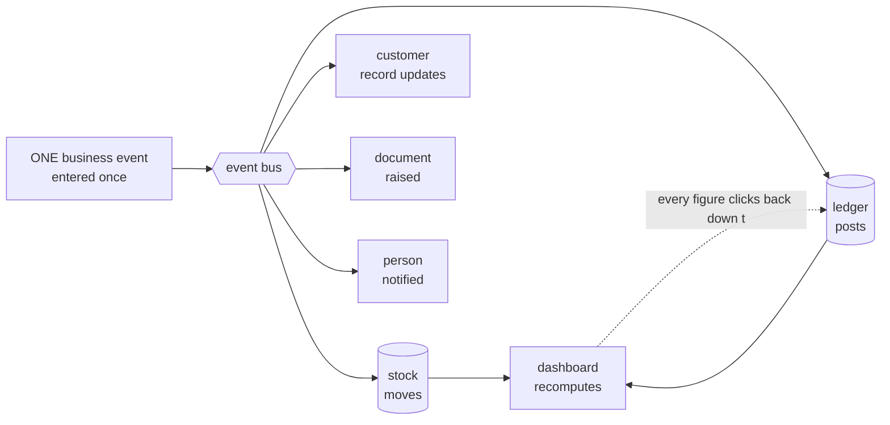
```mermaid
flowchart LR
  E["ONE business event<br/>entered once"] --> BUS{{"event bus"}}
  BUS --> STK[("stock<br/>moves")]
  BUS --> GL[("ledger<br/>posts")]
  BUS --> CRM["customer<br/>record updates"]
  BUS --> DOC["document<br/>raised"]
  BUS --> NTF["person<br/>notified"]
  STK --> BI["dashboard<br/>recomputes"]
  GL --> BI
  BI -.every figure clicks back down to.-> GL
```

**The test of the law.** Any figure on any screen can be clicked down to the record that produced it,
and that record down to the document that created it. A dashboard number is a live query over the
ledger — never a total someone maintained on the side. If a figure cannot be traced, it is a defect,
not a rounding difference.

#### The eight cascades that must fire by themselves

These are the specific chains the platform has to make automatic. If one of them needs a human to
re-key something, the system has failed at the only thing that makes it a system.

| A single action… | …updates every one of these, in one transaction |
|---|---|
| **A sale**, any channel | stock deducted → invoice with GST → ledger (Dr Debtor/Bank, Cr Sales + Output GST) → customer outstanding and lifecycle → settlement expectation → dashboard |
| **A marketplace order pull** | sales order created → stock reserved → pick list → fulfilment → on payout, reconciliation and variance check → books |
| **A settlement import** | each line matched to its order → commission, fees, TCS, TDS to books → variance → claim raised → bank reconciliation → SKU profit → dashboard |
| **A return** | credit note → refund → a wrong return becomes dead stock, never restocked → return cost to P&L → return rate feeds design analytics |
| **A karigar production report** | pooled set completion and piece-rate earnings → finished stock in → payout in HR → Karigar Wages posted → cost per piece → design profit |
| **A material purchase** | PO → GRN → three-way match → raw stock in → vendor payable → input tax credit → landed cost into COGS |
| **A staff attendance mark** | effective-dated salary resolved → payroll → Salaries posted → productivity cost → design cost |
| **A generated image or listing** | asset library → product listing on the storefront and each marketplace → marketing calendar → published → campaign return tracked back |

---

### A1 · THE THREE COMPANIES

The single most common way a multi-company system goes quietly wrong is collapsing three different
ideas into one field. They are kept apart at the root of the database.

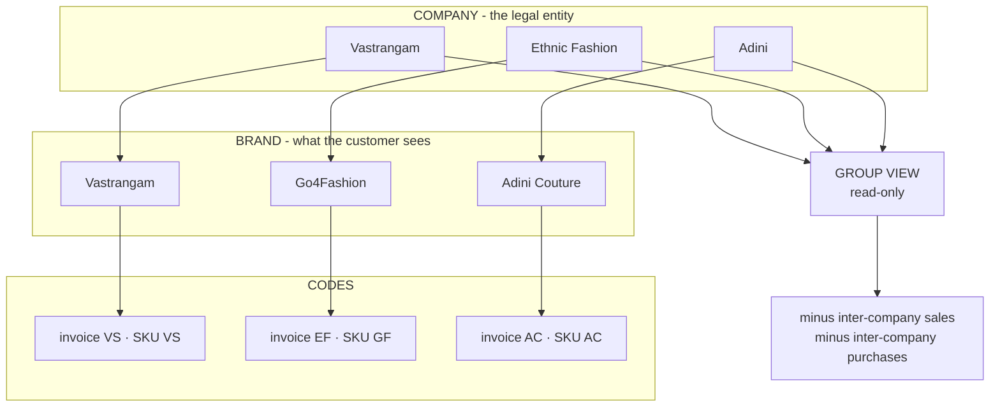
```mermaid
flowchart TB
  subgraph L1["COMPANY - the legal entity"]
    C1["Vastrangam"]; C2["Ethnic Fashion"]; C3["Adini"]
  end
  subgraph L2["BRAND - what the customer sees"]
    B1["Vastrangam"]; B2["Go4Fashion"]; B3["Adini Couture"]
  end
  subgraph L3["CODES"]
    P1["invoice VS · SKU VS"]; P2["invoice EF · SKU GF"]; P3["invoice AC · SKU AC"]
  end
  C1-->B1-->P1; C2-->B2-->P2; C3-->B3-->P3
  C1-->GRP["GROUP VIEW<br/>read-only"]; C2-->GRP; C3-->GRP
  GRP-->EL["minus inter-company sales<br/>minus inter-company purchases"]
```

**Company ≠ brand ≠ prefix.** Ethnic Fashion the company trades as Go4Fashion the brand; its invoices
read EF and its SKUs read GF. Reports group by *company*. SKUs use the *brand code*. Invoices use the
*company prefix*. Three separate fields, because they genuinely are three different things.

**Group is a lens, not an entity.** The consolidated view is read-only. Group profit is the sum of
the three companies minus inter-company sales and purchases — a real elimination, so moving stock
from one pocket to another never inflates group turnover. Editing happens inside a company; the group
only reports.

**A company without its own registration is still a company.** A job-work arm that holds no GSTIN
counts in the group figures without being dragged into a return it does not belong in.

**Three is today's data, not the design.** Nothing above is built for the number three. `companies`
is an ordinary table; adding an eighth is inserting a row. The next section is about the other half
of that — the channels those companies sell through.

---

### A1b · COMPANIES × CHANNELS — WHY NEITHER NUMBER IS FIXED

A **channel** is a way a company sells: its own site, a marketplace seller account, a POS counter, a
B2B desk, an export buyer. Like a company it is a row, not a column and not a list in the code. Three
companies on seven marketplaces is the data this business has now; ten on ten is the same three
tables.

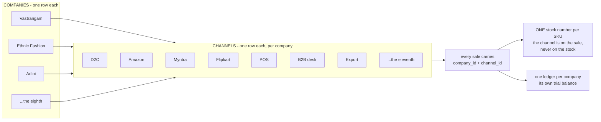
```mermaid
flowchart LR
  subgraph CO["COMPANIES - one row each"]
    A["Vastrangam"]; B["Ethnic Fashion"]; C["Adini"]; D["...the eighth"]
  end
  subgraph CH["CHANNELS - one row each, per company"]
    H1["D2C"]; H2["Amazon"]; H3["Myntra"]; H4["Flipkart"]
    H5["POS"]; H6["B2B desk"]; H7["Export"]; H8["...the eleventh"]
  end
  A-->CH; B-->CH; C-->CH; D-->CH
  CH-->SALE["every sale carries<br/>company_id + channel_id"]
  SALE-->STK["ONE stock number per SKU<br/>the channel is on the sale,<br/>never on the stock"]
  SALE-->LED["one ledger per company<br/>its own trial balance"]
```

**Every business row carries its company.** A journal line can only point at an account belonging to
the same company, so one company cannot read another's figures — checked by a test rather than left
to discipline.

**The channel is a dimension of the sale.** `channel_id` sits on the stock movement and on the
journal entry, so any figure can be read by channel, by company, or by both. It deliberately does
*not* sit on the stock row: inventory is not per channel, because the last piece sold on one
marketplace must vanish from the other ten in the same instant.

**The group eliminates what the companies sold each other.** An entry whose other side is a sister
company carries `counterparty_company_id`, and consolidation removes exactly those.

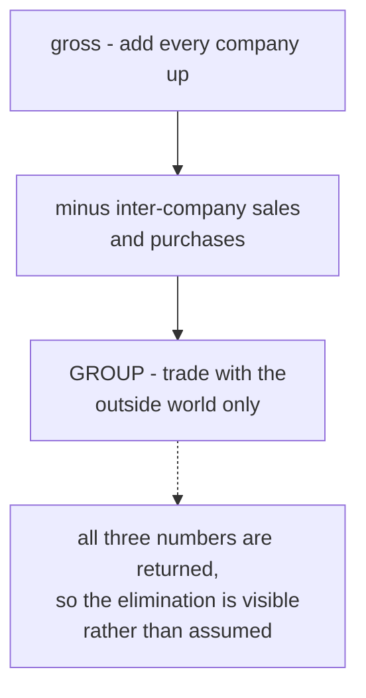
```mermaid
flowchart TB
  G1["gross - add every company up"]
  G2["minus inter-company sales<br/>and purchases"]
  G3["GROUP - trade with the<br/>outside world only"]
  G1-->G2-->G3
  N["all three numbers are returned,<br/>so the elimination is visible<br/>rather than assumed"]
  G3-.->N
```

**This is proved, not asserted.** `core/tests/core.test.js` builds **10 companies × 10 channels =
100 channels**, posts one order down every channel plus ten inter-company sales, and checks each
company's figures channel by channel, that every trial balance still balances, that no journal line
anywhere points at another company's account, and that the group figure is the sum minus
inter-company trade — **₹2,10,500 gross, ₹50,000 eliminated, ₹1,60,500 group**. The same builder is
then called for 11 × 11 with nothing in the code changed.

The reporting side matches: the Data Studio detects every `<Company> Sale` / `<Company> Return`
sheet pair present in an uploaded workbook and emits one pair of quantity columns per company. A
fourth company is a new sheet, not a new release.

---

### A2 · THE UNIFIED DATA CORE

This is the physical reason a sale can touch stock and the books at the same instant: there is one
set of master records underneath every module, not one silo per module.

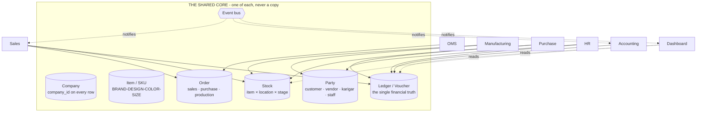
```mermaid
flowchart TB
  subgraph CORE["THE SHARED CORE - one of each, never a copy"]
    CO[("Company<br/>company_id on every row")]
    IT[("Item / SKU<br/>BRAND-DESIGN-COLOR-SIZE")]
    PA[("Party<br/>customer · vendor · karigar · staff")]
    ST[("Stock<br/>item × location × stage")]
    LG[("Ledger / Voucher<br/>the single financial truth")]
    OR[("Order<br/>sales · purchase · production")]
    EB{{"Event bus"}}
  end
  SALES["Sales"]-->OR; SALES-->ST; SALES-->LG
  OMS["OMS"]-->OR; MFG["Manufacturing"]-->ST; MFG-->PA
  PUR["Purchase"]-->ST; PUR-->LG; HR["HR"]-->PA; HR-->LG
  ACC["Accounting"]-->LG; BI["Dashboard"]-.reads.->LG; BI-.reads.->ST
  EB-.notifies.->SALES; EB-.notifies.->ACC; EB-.notifies.->BI
```

**The seven things there is exactly one of.** Company · Item/SKU · Party · Stock · Ledger · Order ·
the event bus that lets modules notify each other. Every business table carries `company_id`, and
row-level security enforces it in the database — so even a bug in application code cannot leak one
company's data into another's.

**Why this matters more than any feature.** The predecessor to this system was a set of separate
browser tools, each with its own private storage. A sale recorded in the sales tool never reached the
accounting tool. Every integration promise in this document rests on that being fixed: one core, one
event bus, and the order the sales module writes is the identical row the accounting module reads.

#### Four rules the core enforces before any module is built

1. **Money is integer paise, never a floating-point number.** Currency arithmetic in floats
   accumulates error that eventually shows up as a trial balance that will not tie.
2. **Values that change over time are effective-dated** — a salary, a price, a tax rate, a
   commission. A payroll run for March resolves the salary in force *in March*, not today's. Zero
   rows in force is an error, never treated as zero.
3. **Nothing is deleted, only deactivated.** A person who leaves is marked inactive; their name is
   attached to years of earnings, approvals and audit rows that must still resolve.
4. **The audit trail cannot be switched off.** Every edit records who, when, and the value before and
   after, kept for eight years as the MCA rule requires. It is not a setting that defaults to on —
   there is no switch, because an audit trail with an off switch is one that gets silenced exactly
   when it matters.

---

### A3 · THE MODULE MAP — 22 MODULES

Every module lives inside one application: one login, one company switcher, one data core. The
numbering below is the build order, and the build order is dependency order — a module is only built
once everything it needs already exists.

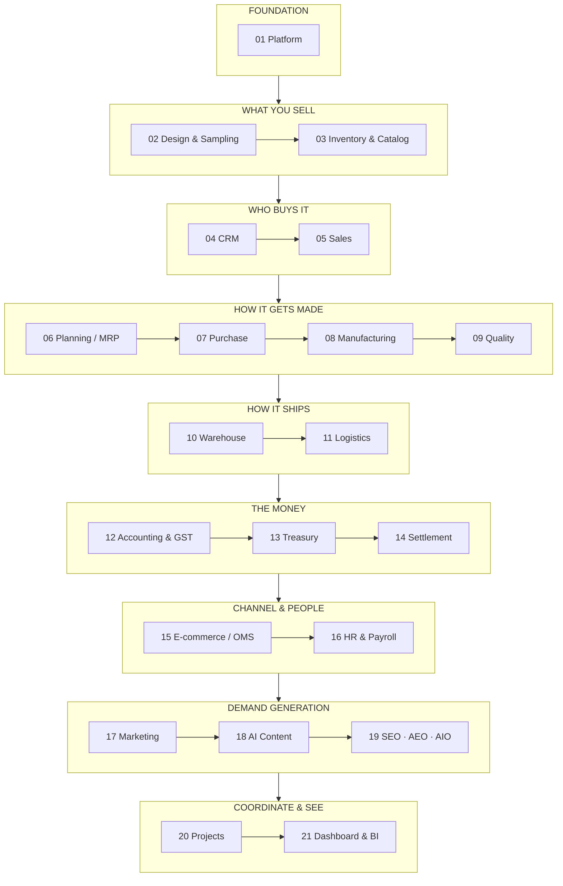
```mermaid
flowchart TB
  subgraph F["FOUNDATION"]
    M01["01 Platform"]
  end
  subgraph MAKEABLE["WHAT YOU SELL"]
    M02["02 Design & Sampling"] --> M03["03 Inventory & Catalog"]
  end
  subgraph DEMAND["WHO BUYS IT"]
    M04["04 CRM"] --> M05["05 Sales"]
  end
  subgraph SUPPLY["HOW IT GETS MADE"]
    M06["06 Planning / MRP"] --> M07["07 Purchase"] --> M08["08 Manufacturing"] --> M09["09 Quality"]
  end
  subgraph MOVE["HOW IT SHIPS"]
    M10["10 Warehouse"] --> M11["11 Logistics"]
  end
  subgraph MONEY["THE MONEY"]
    M12["12 Accounting & GST"] --> M13["13 Treasury"] --> M14["14 Settlement"]
  end
  subgraph SCALE["CHANNEL & PEOPLE"]
    M15["15 E-commerce / OMS"] --> M16["16 HR & Payroll"]
  end
  subgraph GROW["DEMAND GENERATION"]
    M17["17 Marketing"] --> M18["18 AI Content"] --> M19["19 SEO · AEO · AIO"]
  end
  subgraph LAST["COORDINATE & SEE"]
    M20["20 Projects"] --> M21["21 Dashboard & BI"]
  end
  F-->MAKEABLE-->DEMAND-->SUPPLY-->MOVE-->MONEY-->SCALE-->GROW-->LAST
```

<!-- MODULEMAP -->

| # | Module | Apps | Built | Engine | To build |
|---|---|---|---|---|---|
| 01 | Platform | 8 | 1 | 1 | 6 |
| 02 | Design & Sampling | 2 | 0 | 0 | 2 |
| 03 | Inventory & Catalog | 4 | 0 | 0 | 4 |
| 04 | CRM | 4 | 3 | 0 | 1 |
| 05 | Sales | 8 | 5 | 0 | 3 |
| 06 | Planning & Requirements (MRP) | 3 | 0 | 0 | 3 |
| 07 | Purchase | 3 | 2 | 0 | 1 |
| 08 | Manufacturing | 4 | 0 | 0 | 4 |
| 09 | Quality & Compliance | 2 | 0 | 0 | 2 |
| 10 | Warehouse | 3 | 0 | 0 | 3 |
| 11 | Logistics | 5 | 0 | 0 | 5 |
| 12 | Accounting & GST | 9 | 0 | 0 | 9 |
| 13 | Treasury & Financial Planning | 3 | 0 | 0 | 3 |
| 14 | Settlement | 3 | 0 | 0 | 3 |
| 15 | E-commerce / OMS | 11 | 2 | 0 | 9 |
| 16 | HR & Payroll | 5 | 0 | 0 | 5 |
| 17 | Marketing | 8 | 0 | 0 | 8 |
| 18 | AI Content Engine | 8 | 0 | 1 | 7 |
| 19 | SEO, AEO & AIO | 3 | 0 | 0 | 3 |
| 20 | Projects & Collaboration | 7 | 0 | 0 | 7 |
| 21 | Dashboard & BI | 5 | 3 | 0 | 2 |
| 22 | AI Assistant, Agents & Automation | 5 | 0 | 0 | 5 |
| | **Total** | **113** | **16** | **2** | **95** |

<!-- /MODULEMAP -->

---

### A4 · MODULE-TO-MODULE WIRING

Every arrow here is a real, required data flow — not an aspiration. This is the fabric that turns 21
modules into one system.

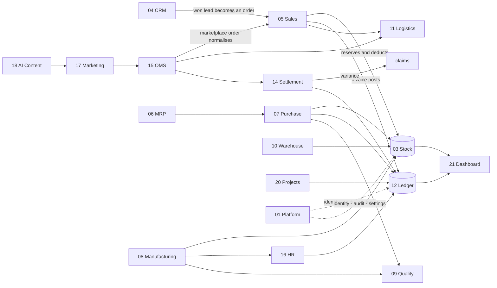
```mermaid
flowchart LR
  CRM["04 CRM"] -->|won lead becomes an order| SAL["05 Sales"]
  OMS["15 OMS"] -->|marketplace order normalises| SAL
  SAL -->|reserves and deducts| INV[("03 Stock")]
  SAL -->|invoice posts| GL[("12 Ledger")]
  SAL --> LOG["11 Logistics"]
  OMS --> LOG
  OMS --> SET["14 Settlement"] -->|variance| CLM["claims"]
  SET --> GL
  MRP["06 MRP"] --> PUR["07 Purchase"] --> INV
  PUR --> GL
  PUR --> QC["09 Quality"]
  MFG["08 Manufacturing"] --> INV
  MFG --> HR["16 HR"] --> GL
  MFG --> QC
  WH["10 Warehouse"] --> INV
  AIC["18 AI Content"] --> MKT["17 Marketing"] --> OMS
  PRJ["20 Projects"] --> GL
  GL --> BI["21 Dashboard"]
  INV --> BI
  PLT["01 Platform"] -.identity · audit · settings.-> GL
  PLT -.identity · audit · settings.-> INV
```

**Reading the important arrows.**

1. **CRM → Sales.** A won lead becomes a sales order carrying the customer, their price list and
   their credit tier — nothing re-typed.
2. **Sales → Inventory.** The order reserves and then deducts the single stock number, so the last
   piece sold anywhere disappears everywhere in the same instant.
3. **Sales → Accounting.** The invoice posts Dr Debtor/Bank, Cr Sales plus output GST, with
   CGST+SGST or IGST decided from the two GSTINs' state codes — never picked from a dropdown.
4. **OMS → Settlement → Accounting.** Payouts reconcile per line; commission, fees, TCS and TDS post
   to the books; any variance opens a claim with its evidence.
5. **Purchase → Inventory + Accounting.** The GRN adds stock; the three-way match gates the payable;
   the GST becomes input credit.
6. **Manufacturing → Inventory + HR + Accounting.** Production adds finished stock, computes karigar
   piece-rate earnings, posts wages, and rolls cost per piece into design profit.
7. **Accounting → Dashboard.** Every dashboard figure is a query on the ledger, never a separate
   counter. This is the integrity rule the whole system exists to keep.

---

### A5 · THE FIVE END-TO-END FLOWS

Four of these are the journeys the business actually runs on. Each crosses many modules, which is
exactly the point — no single module completes any of them alone.

#### Flow 1 · Design to dispatch


```mermaid
flowchart LR
  A["02 spec + sample"] --> B["02 sign-off"] --> C["03 becomes SKUs"]
  C --> D["06 demand becomes requirement"] --> E["07 buy the material"]
  E --> F["09 inspect on receipt"] --> G["08 make it, 10 stages"]
  G --> H["09 QC accept or rework"] --> I["03 finished stock in"]
  I --> J["10 pick and pack"] --> K["11 book the courier"]
```

#### Flow 2 · Order to cash

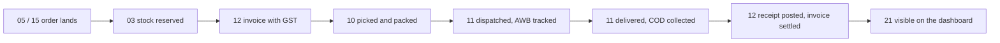
```mermaid
flowchart LR
  A["05 / 15 order lands"] --> B["03 stock reserved"]
  B --> C["12 invoice with GST"] --> D["10 picked and packed"]
  D --> E["11 dispatched, AWB tracked"] --> F["11 delivered, COD collected"]
  F --> G["12 receipt posted, invoice settled"] --> H["21 visible on the dashboard"]
```

#### Flow 3 · Settlement to books

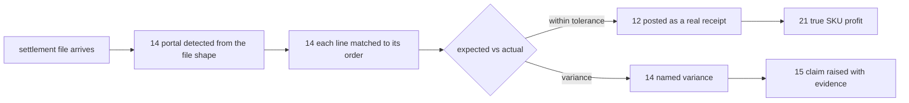
```mermaid
flowchart LR
  A["settlement file arrives"] --> B["14 portal detected from the file shape"]
  B --> C["14 each line matched to its order"]
  C --> D{"expected vs actual"}
  D -->|within tolerance| E["12 posted as a real receipt"]
  D -->|variance| F["14 named variance"] --> G["15 claim raised with evidence"]
  E --> H["21 true SKU profit"]
```

#### Flow 4 · Karigar to payroll


```mermaid
flowchart LR
  A["karigar reports pieces by WhatsApp"] --> B["08 pooled across all karigars per design"]
  B --> C["08 sets = min across populated columns"]
  C --> D["08 earnings per raw piece"] --> E["16 into the month's register"]
  E --> F["16 advances deducted"] --> G["16 paid, method and reference recorded"]
  G --> H["12 Karigar Wages posted"] --> I["08 true cost per piece"]
```

#### Flow 5 · Content to published

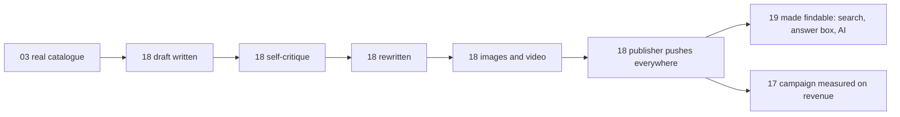
```mermaid
flowchart LR
  A["03 real catalogue"] --> B["18 draft written"]
  B --> C["18 self-critique"] --> D["18 rewritten"]
  D --> E["18 images and video"] --> F["18 publisher pushes everywhere"]
  F --> G["19 made findable: search, answer box, AI"]
  F --> H["17 campaign measured on revenue"]
```

---

### A6 · WHY THIS BUILD ORDER

The order is not a preference. Each module needs something the previous one produces, and building
out of order means building against data that does not exist yet.


```mermaid
flowchart LR
  A["01 Platform"] -->|"who may do what,<br/>and an audit trail"| B["02 Design"]
  B -->|"an approved design<br/>to turn into SKUs"| C["03 Inventory"]
  C -->|"something real to sell"| D["04 CRM"]
  D -->|"a customer to sell to"| E["05 Sales"]
  E -->|"real demand to plan from"| F["06 MRP"]
  F -->|"a requirement to buy against"| G["07 Purchase"]
  G -->|"material to make from"| H["08 Manufacturing"]
  H -->|"output to inspect"| I["09 Quality"]
  I -->|"finished goods to store"| J["10 Warehouse"]
  J -->|"a parcel to ship"| K["11 Logistics"]
  K -->|"transactions to record"| L["12 Accounting"]
  L -->|"invoices to forecast cash from"| M["13 Treasury"]
  M -->|"receivables to reconcile"| N["14 Settlement"]
  N -->|"a stable core to open channels on"| O["15 OMS"]
  O -->|"a growing team to pay"| P["16 HR"]
  P -->|"a working pipeline to drive"| Q["17 Marketing"]
  Q -->|"a catalogue to write about"| R["18 AI Content"]
  R -->|"content to make findable"| S["19 SEO"]
  S -->|"live work to coordinate"| T["20 Projects"]
  T -->|"real data to report on"| U["21 Dashboard"]
```

**Four decisions worth explaining, because they differ from the obvious arrangement.**

- **Platform is first, not last.** Identity, permissions and the audit trail are what every other
  module writes through. Retrofitting an audit trail means going back through every module.
- **Design & Sampling comes before Inventory.** A product must be specified and approved before it
  can exist as a catalogue record. Building the catalogue first means inventing styles with no real
  specification behind them.
- **Quality is its own module, not a step inside Manufacturing.** Rejecting goods at receipt and
  rejecting goods on the floor are the same discipline, and the certificates that prove a standard is
  followed belong beside the inspections that back them.
- **Dashboard is next to last, and the AI layer is last.** Dashboard has nothing true to show until
  the other modules produce real records; the assistant and the agents above it have nothing to read
  or act on until the dashboard's figures exist. Both fail the same way if built early. A
  dashboard built first can only display invented figures.

**What a module does when a later module is not built yet.** It is finished against the data that
exists on its day, and shows more as later modules come online. Module 21's dashboard is real from
the moment it is built and grows richer as Module 12's ledger fills.

---

### A7 · THE HONEST STATE TODAY

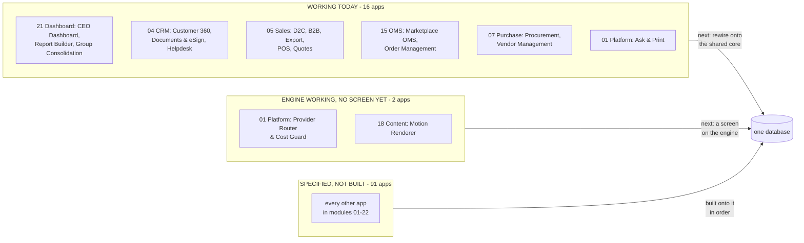
```mermaid
flowchart LR
  subgraph BUILT["WORKING TODAY - 16 apps"]
    B1["21 Dashboard: CEO Dashboard,<br/>Report Builder, Group Consolidation"]
    B2["04 CRM: Customer 360,<br/>Documents & eSign, Helpdesk"]
    B3["05 Sales: D2C, B2B, Export,<br/>POS, Quotes"]
    B4["15 OMS: Marketplace OMS,<br/>Order Management"]
    B5["07 Purchase: Procurement,<br/>Vendor Management"]
    B6["01 Platform: Ask & Print"]
  end
  subgraph ENG["ENGINE WORKING, NO SCREEN YET - 2 apps"]
    E1["01 Platform: Provider Router<br/>& Cost Guard"]
    E2["18 Content: Motion Renderer"]
  end
  subgraph SPEC["SPECIFIED, NOT BUILT - 91 apps"]
    S1["every other app<br/>in modules 01-22"]
  end
  BUILT -->|"next: rewire onto<br/>the shared core"| CORE[("one database")]
  ENG -->|"next: a screen<br/>on the engine"| CORE
  SPEC -->|"built onto it<br/>in order"| CORE
```

**What "built" means here.** Sixteen single-file apps that open in a browser, carry their own
self-tests, and pass a full click-through audit with zero console errors in both editions. That is
verified, not claimed.

**What "engine working" means, and why it is a third word rather than a generous reading of the
first.** Two apps have their hard part written and passing its own tests on the command line, with
no screen on them yet. They are not counted among the sixteen, because the sentence beside that
number promises a browser check these have not had. They are not called "specified" either, because
the arithmetic exists and runs. Anyone can check both in the time it takes to read this:

```bash
node brand/suite/router.js --selftest                  # 31 passed, 0 failed
node brand/suite/studio/motion_render.js --selftest    # 14 passed, 0 failed
```

**What is honestly not done.** Those sixteen apps still run on their own storage. The first work of
each module is rewiring its built apps onto the shared core so they read and write the same records
as everything else. Until that happens they are good tools, not yet one system.

---

### A7b · WHERE THE SIX NEWEST APPS CAME FROM

Ten open-source projects were read to answer one question: what do they have that this does not?
Not to copy — nothing from any of them is in this codebase, and the licences below are the reason
that distinction is written down rather than assumed. Six gaps were real enough to specify, and two
of the six were built rather than merely described.

| Project | Licence | What was taken |
|---|---|---|
| OmniRoute | MIT | The mechanisms behind **Provider Router & Cost Guard** — cascade, breaker, backoff, budget |
| HyperFrames | Apache-2.0 | Deterministic frame-seeking, now the **Motion Renderer** |
| voicebox | MIT | The shape of **Narration Studio** — chunked long text, many languages, local by default |
| easydiffusion | CreativeML Open RAIL-M | The shape of the **Image Generation Slot** — queue, preview, inpaint, upscale |
| n8n | fair-code | The idea behind **Automation Studio** — a visual when-X-then-Y over an event bus |
| Odoo | LGPL | Read for gap-finding only; it surfaced the missing **Website & Page Builder** |
| OpenMontage | AGPLv3 | Idea only — copying any of it would force this codebase to be published |
| ideogram4 | **Non-Commercial** | Nothing usable. The model may not be used in a commercial product at all; only the capability it demonstrates is described |
| palmier-pro | GPLv3, macOS-only | Nothing — wrong platform |
| higgsfield | — | Nothing — GPU training infrastructure, unrelated to this business |

**Why these six and not others.** Provider Router was first because this document already *claimed*
no capability depends on one outside service, and a claim with nothing enforcing it is the kind of
gap that only shows up on the evening a courier API stops answering. Motion Renderer was built
because the two things it needs — a headless browser and an ffmpeg binary — are already in this
repository for other reasons, so it was buildable today rather than someday. The other four are
specified honestly: a website builder is a large piece of work, image generation needs hardware
this system does not have, and saying so is cheaper than discovering it later.

---

### A8 · WHAT THE MASTER SPEC HAD THAT THIS DOCUMENT DID NOT

This plan was checked against the Vastrangam ERP Complete Master Prompt v3.0 — all 63 pages —
and the check is recorded here rather than summarised, because a gap-check nobody can audit is
just a reassurance.

**What already agreed.** The one law and its cascades. Companies and channels as rows rather
than constants. Karigar pooled set-completion. Money as integer paise. Effective-dated salary.
Audit everything, delete nothing. Group consolidation with inter-company elimination. And
provider-agnosticism — §A.3.1 of the master spec says no provider SDK may be called from
business logic, and the Provider Router in Module 01 is what enforces it at runtime. The spec's
16 domains map onto these 22 modules with nothing dropped, and every competitive addition it
flagged as missing (kit/combo SKUs, repricing, NDR workflow, listing manager, subscriptions,
NPS, knowledge base, events) was already here.

**What was genuinely missing — the whole execution half.**

| The master spec had | This document had |
|---|---|
| The pinned stack: Supabase, Next.js, Interakt, n8n, Capacitor, RLS, Shiprocket, Razorpay | nothing |
| A ~100-table PostgreSQL schema | a 19-table SQLite core |
| A REST surface and five inbound webhooks | nothing |
| 8 phases over 32 weeks, each with a Definition of Done and a gate | module dependency order only |
| BUSY cutover, opening balances, a 60-day parallel run, decommission criteria | nothing |
| p95 performance targets, RTO/RPO, backup policy | nothing |
| A risk register, success metrics, and daily-to-annual runbooks | nothing |
| The UI shell, five role dashboards, PWA and Capacitor | nothing |
| The formulas: daily rate, return costs, closing stock, realisation, CRM tiers, three-way match | almost none |
| Acceptance figures from the owner's own files | one of them |

Three apps were missing outright: **Customisation & Made-to-Measure**, the **WhatsApp Command
Console**, and **Recruitment**. All three are now in the module list.

**What closed it.** PART IV of this document (E1–E12) is the execution half, written from that
spec. `core/schema.postgres.sql` is the production schema, 151 tables, gated by
`core/tests/schema.test.js`. Thirty-four formula rules were added to the rulebook. The counts
above are not a summary of the fix — they are what the check found, kept so the next reader can
see what was wrong and judge whether it is now right.

**One deliberate difference from the spec, stated rather than slipped in.** The spec asks for
money as `numeric(14,2)`. This system stores money as an integer count of paise, in both
schemas and in the engine. That satisfies the requirement behind the instruction — never a
float, never a rounding decision — more strictly rather than less, and it removes the one place
the database and the engine could still round differently. Converting to `numeric(14,2)` for
any report is a division of an exact integer, so there is no rounding decision left to get
wrong. `core/tests/schema.test.js` fails the build if any money column in either schema is ever
declared as a float, a decimal or a numeric.

---

## PART II — THE 22 MODULES

<!-- RULEINDEX -->

### THE RULEBOOK AT A GLANCE

**285 rules across 22 modules. 86 of them are enforced by a test that runs
today; the rest are specified.** Every rule states what happens, and what the system will
*not* do instead — because the refusal is the half a business can actually rely on. A rule
marked ENFORCED names the file and the test that proves it, and `brand/site/checkrules.js`
fails if that test cannot be found, so a rule here cannot claim a proof it does not have.

The specified ones are not filler — they are the build queue, in the order the modules are
built. That is the number to watch: it is meant to fall, build by build, and it can be
counted rather than claimed.

| Module | Rules | Enforced | Specified |
|---|---|---|---|
| 01 · Platform | 25 | 20 | 5 |
| 02 · Design & Sampling | 7 | 0 | 7 |
| 03 · Inventory & Catalog | 14 | 7 | 7 |
| 04 · CRM | 9 | 0 | 9 |
| 05 · Sales | 18 | 4 | 14 |
| 06 · Planning & Requirements (MRP) | 8 | 0 | 8 |
| 07 · Purchase | 12 | 0 | 12 |
| 08 · Manufacturing | 20 | 9 | 11 |
| 09 · Quality & Compliance | 7 | 0 | 7 |
| 10 · Warehouse | 8 | 0 | 8 |
| 11 · Logistics | 11 | 0 | 11 |
| 12 · Accounting & GST | 24 | 16 | 8 |
| 13 · Treasury & Financial Planning | 8 | 1 | 7 |
| 14 · Settlement | 13 | 0 | 13 |
| 15 · E-commerce / OMS | 19 | 10 | 9 |
| 16 · HR & Payroll | 22 | 8 | 14 |
| 17 · Marketing | 10 | 0 | 10 |
| 18 · AI Content Engine | 11 | 2 | 9 |
| 19 · SEO, AEO & AIO | 6 | 0 | 6 |
| 20 · Projects & Collaboration | 9 | 1 | 8 |
| 21 · Dashboard & BI | 9 | 6 | 3 |
| 22 · AI Assistant, Agents & Automation | 15 | 2 | 13 |
| **Total** | **285** | **86** | **199** |

<!-- /RULEINDEX -->

Each module below carries: what it is, a diagram of how it functions, its apps with an honest built
or spec mark, the data it owns, the rules that actually govern it, what it reads and writes, and the
condition that decides it is finished.

---

## MODULE 01 · PLATFORM
*The spine every module runs on*

**What it is.** Not a module you open — the layer underneath the other twenty-one. Who can see what, how
the business is configured, and an unalterable record of everything that ever happened. It is built
first because every module above it writes through it, and an audit trail added later is an audit
trail with a hole in it.

**How it works**

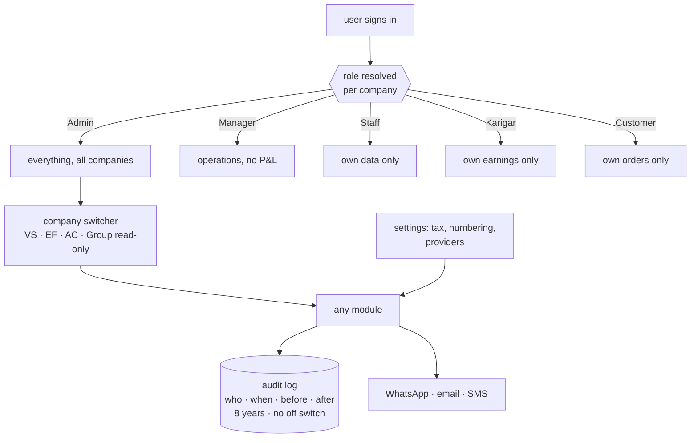
```mermaid
flowchart TB
  LOGIN["user signs in"] --> ROLE{{"role resolved<br/>per company"}}
  ROLE -->|Admin| A1["everything, all companies"]
  ROLE -->|Manager| A2["operations, no P&L"]
  ROLE -->|Staff| A3["own data only"]
  ROLE -->|Karigar| A4["own earnings only"]
  ROLE -->|Customer| A5["own orders only"]
  A1 --> SW["company switcher<br/>VS · EF · AC · Group read-only"]
  SW --> WORK["any module"]
  WORK --> AUD[("audit log<br/>who · when · before · after<br/>8 years · no off switch")]
  CFG["settings: tax, numbering,<br/>providers"] --> WORK
  WORK --> COMM["WhatsApp · email · SMS"]
```

**The apps (6)**

| App | State | What it does |
|---|---|---|
| Identity, Settings & Audit | SPEC | Users, per-company per-role permissions, company switcher, tax and numbering setup, provider config with an integration-health view, and the browser over the audit trail |
| **Provider Router & Cost Guard** | **ENGINE WORKING** | The no-single-provider rule enforced instead of promised: an ordered fallback per capability, a breaker that trips a failing provider out, backoff between retries, and a spend ceiling in paise that refuses rather than warns |
| Ask & Print | **BUILT** | Ask from a phone — a ledger, a bill, today's packing slips — and get a PDF back, or print at the office with nothing plugged into the phone |
| Communications | SPEC | WhatsApp command console, broadcasts, email and SMS, and the scheduled jobs that carry a nudge without anyone remembering to send it |
| Data Privacy & Consent | SPEC | Consent captured where it is given and honoured downstream; retention and erasure tracked as the two different policies they are |
| Payment Data Scope | SPEC | The written statement of which systems ever see a card or bank credential — and which never do |

**What it owns.** `companies` · `users` · `user_companies` · `audit_log` · `integration_errors` ·
`settings_environment` · `whatsapp_messages` · `whatsapp_broadcasts` · `email_campaigns` ·
`notifications` · `consents`

**The rules that matter**

- Permissions are a matrix — per company, per role — not one global level. A group of sister
  companies is exactly where a single global level leaks data across a boundary it should not cross.
- The audit trail has no off switch. Eight years, before-and-after values, MCA rule.
- Every capability runs through at least three interchangeable providers. **A provider named as the
  source of a figure is a bug** — providers move messages and money; the ledger originates numbers.
- Broadcasts go through the official API, warm up at 200/day, and honour a STOP keyword.
- **This system never asks anyone for a marketplace, bank or account password.** A tool that asks for
  those has become the thing it should protect its users from.

<!-- RULES:01 -->

**The rulebook — 25 rules, 20 enforced by a test that runs today**

| # | The rule | When | Then | Never | State |
|---|---|---|---|---|---|
| R01.1 | **Every business record names the company it belongs to** | any record is written — a sale, a movement, a voucher, an employee | its company is stored on the row itself | inferring the company from who happens to be logged in, which silently mis-files every record made by someone who works across two of them | **ENFORCED** · core/tests/core.test.js · the schema loads and the three companies keep three different codes |
| R01.2 | **One company cannot read another company’s records** | a query runs for a user scoped to one company | rows belonging to any other company are not returned at all | filtering in the screen while the data is already loaded — a filter can be removed, a scope cannot | **ENFORCED** · core/tests/core.test.js · one company cannot read another company |
| R01.3 | **The audit trail has no off switch** | anything touching money, stock, price, tax, pay or master data changes | the change and its before-image are written in the same transaction as the change itself | allowing a setting, a role or a migration to disable it — either both land or neither does | **ENFORCED** · core/tests/core.test.js · an audited insert leaves a before/after trail |
| R01.4 | **An update records what it was, not only what it became** | a row is changed | the current row is read first so the before-image is what was really there | trusting the caller’s idea of the old value, which makes the trail a record of intentions rather than of facts | **ENFORCED** · core/tests/core.test.js · an update records what it was as well as what it became |
| R01.5 | **A table nobody thought to audit is refused** | code writes to a table that is not on the audited list | the write is refused and the table is named | letting it through quietly, which is how a money column ends up outside the trail without anyone deciding that | **ENFORCED** · core/tests/core.test.js · a table nobody thought to audit is refused, rather than slipping through |
| R01.6 | **Deletion is a reversal, never a removal** | a user deletes anything | the record is voided, marked, and still readable with the reason | removing the row — eight years of trail cannot survive a DELETE | **ENFORCED** · core/tests/core.test.js · voiding is the only removal, and it is reversible |
| R01.7 | **A module that is not in the canonical list cannot join the bus** | code subscribes to a business event | the module number is checked against modules.js and refused if unknown | letting an unregistered listener attach, which is how a cascade gains a step nobody can find later | **ENFORCED** · core/tests/core.test.js · a module not in modules.js cannot subscribe |
| R01.8 | **A cascade is all of it or none of it** | one business event fans out to stock, ledger, customer and documents | every step commits together, or the whole thing is rolled back | leaving stock moved and the ledger unposted, which is the exact state no report can ever explain | **ENFORCED** · core/tests/core.test.js · a sale moves stock and posts to the ledger, or does neither |
| R01.9 | **A handler that throws takes the transaction with it** | any subscriber to an event fails | the emitting transaction fails too | swallowing the error so the originating action appears to have succeeded | **ENFORCED** · core/tests/core.test.js · a handler that throws takes the whole transaction with it |
| R01.10 | **No capability depends on a single outside service** | any capability is used — books, courier, payments, AI, storage, GST | an ordered list of interchangeable providers is tried, ending on one that needs nothing connected | having one provider whose outage stops the work, however good that provider is | **ENFORCED** · brand/suite/router.js · no spend ceiling can exhaust any cascade (a free option is always in it) |
| R01.11 | **A failing provider is taken out of the list, not hammered** | a provider fails repeatedly | it is tripped open, skipped entirely, and retried once after a cooldown | retrying into a dead service on every call while a working alternative sits further down the list | **ENFORCED** · brand/suite/router.js · three consecutive failures trip the breaker open |
| R01.12 | **A spend ceiling refuses, it does not warn** | a paid call would take spending past the ceiling set for it | that provider is refused and the work completes on a free one | letting it through with a warning nobody reads, and never refusing only the first provider while the same spend reroutes to the next | **ENFORCED** · brand/suite/router.js · a ceiling below the price refuses every paid option, not just the first |
| R01.13 | **The system never asks for a marketplace, bank or account password** | any integration is connected, by any module, including a chatbot or an agent | a scoped, revocable key is requested instead, cancellable from the provider’s side without changing the login | accepting, storing, echoing or transmitting an account password — there is no screen, no import and no support flow that takes one | SPECIFIED |
| R01.14 | **Card and bank credentials never reach application code** | a payment needs a card or bank detail | the provider’s own secured field takes it directly | passing it through this system, even in transit, even unlogged — what is never received cannot be leaked | SPECIFIED |
| R01.15 | **Consent and retention are two different clocks** | a person’s data is held | why it may be used and how long it is kept are tracked separately, and an erasure request is resolved against both | treating a legal retention period as consent to keep using the data for anything else | SPECIFIED |
| R01.16 | **A scoped key is revocable without touching the login** | an outside service is connected | a key limited to what that capability needs is stored, and the connection records which capability it serves | storing a credential that can do more than the capability requires, because the day it leaks is the day that difference matters | SPECIFIED |
| R01.17 | **A webhook is verified, idempotent and never silently dropped** | a payment, courier, storefront or messaging provider calls in | the signature is checked, the external id makes a repeat delivery a no-op, and a failure is logged with its payload for retry | trusting an unsigned call, and never processing the same external id twice — a duplicated payout or a duplicated order is indistinguishable from a real one afterwards | SPECIFIED |
| R01.18 | **A trade is added as data, never as a version of the software** | a business in a trade the system has never seen signs up | its vocabulary, stages, extra fields, documents, rule switches and starting reference data arrive as one configuration file, and every screen reads back in that trade’s words | a branch, a fork or a bespoke build per industry — that is a consultancy with software attached, and it is the thing that stops a product from being one | **ENFORCED** · core/tests/packs.test.js · GATE · it loads from a JSON string with no code change |
| R01.19 | **A pack is data and can never be code** | a pack is loaded from any source | every value in it is inspected, at any depth, and a function anywhere inside it refuses the whole pack | letting configuration carry behaviour — the moment a pack can run code, adding a trade is a code change again and the guarantee in R01.18 is worthless | **ENFORCED** · core/tests/packs.test.js · a pack containing a function |
| R01.20 | **A pack may rename a concept, never invent one** | a pack declares its vocabulary | each entry is matched against the fixed list of concepts the engine has, and an unknown one refuses the pack | accepting an unrecognised word as a new concept, which turns "vocabulary" into a place to put anything and leaves the screens with a name for something that does not exist | **ENFORCED** · core/tests/packs.test.js · renaming a concept the engine does not have |
| R01.21 | **A pack extends tables that exist, and nothing else** | a pack adds fields | the table is checked against the real schema and the field type against the types the engine can store | creating a table on a customer’s behalf from a configuration file, which puts the shape of the database outside the reach of the schema test that guards it | **ENFORCED** · core/tests/packs.test.js · adding a field to a table that does not exist |
| R01.22 | **Money in a pack is money everywhere else** | a pack adds a field whose name reads as an amount, a price, a cost, a total, a fee or a rate | it must be declared in paise, and a plain number refuses the pack | letting a trade introduce a floating-point rupee through the side door after the whole schema was built to keep them out | **ENFORCED** · core/tests/packs.test.js · money declared as a plain number |
| R01.23 | **No pack can switch off a guarantee** | a pack sets a rule off | the rule id is checked against the rulebook, and against the list of rules no pack may touch — company scoping, the audit trail, the posting rules, group elimination and roster privacy | a trade opting out of the things that make the books trustworthy; it may call an invoice whatever it likes and may not decide its trail is optional | **ENFORCED** · core/tests/packs.test.js · switching OFF the audit trail |
| R01.24 | **A rule a pack never mentions is on** | a rule is looked up for a trade | the rulebook is the default and the pack is read as an exception list — silence means the rule applies | treating the pack as a permission list, which would mean every rule added after a pack was written silently applies to nobody who is using it | **ENFORCED** · core/tests/packs.test.js · a rule the pack never mentions is ON — a pack is an exception list, not a permission list |
| R01.25 | **An invalid pack is refused whole, never half-loaded** | a pack fails any check | every problem in it is reported at once and none of it is applied | partially loading a trade, which leaves a system whose vocabulary and rules disagree with each other and no way to tell which half is live | **ENFORCED** · core/tests/packs.test.js · a refused pack is refused whole — nothing is half-applied |

<!-- /RULES:01 -->

**Reads** ← every module · **Writes** → every module

**Done when.** A karigar sees only their own earnings, an admin switches all three companies and
every figure changes with the company, and every edit made during the test is already in the audit
browser.

---

## MODULE 02 · DESIGN & SAMPLING
*A style exists on paper before it exists as stock*

**What it is.** Where a product moves from a first idea to something the business can actually make
and sell — specification, sample rounds, costed trials, sign-off — before it is ever entered as a
catalogue record. Building this before Inventory means the catalogue is never populated with styles
that have no real specification behind them.

**How it works**

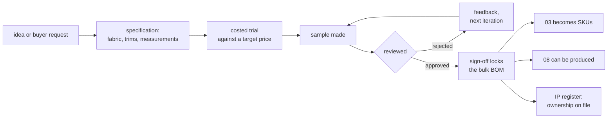
```mermaid
flowchart LR
  IDEA["idea or buyer request"] --> SPEC2["specification:<br/>fabric, trims, measurements"]
  SPEC2 --> COST["costed trial<br/>against a target price"]
  COST --> SAMPLE["sample made"]
  SAMPLE --> REV{"reviewed"}
  REV -->|rejected| FB["feedback,<br/>next iteration"] --> SAMPLE
  REV -->|approved| LOCK["sign-off locks<br/>the bulk BOM"]
  LOCK --> SKU["03 becomes SKUs"]
  LOCK --> MFG["08 can be produced"]
  LOCK --> IP["IP register:<br/>ownership on file"]
```

**The apps (2)**

| App | State | What it does |
|---|---|---|
| PLM & Development | SPEC | Specification → sample rounds → costed trials → sign-off, every version kept, so last season's costing is still there |
| Design / IP Register | SPEC | Trademark and copyright status, the date a design was first shown, and a flag when a near-identical listing appears elsewhere |

**What it owns.** `designs` (the development record) · `samples` · `sample_iterations` ·
`design_ip_register` · `tech_packs`

**The rules that matter**

- Every version is kept, never overwritten. A design's cost history is the evidence behind this
  season's price.
- Sign-off is the event that locks the bulk bill of materials. Sample BOMs and bulk BOMs carry
  different wastage percentages and are not the same record.
- A design with no ownership record on file is a design nobody can defend — which matters most for
  exactly the designs Module 18 is built to promote at scale.

<!-- RULES:02 -->

**The rulebook — 7 rules, 0 enforced by a test that runs today**

| # | The rule | When | Then | Never | State |
|---|---|---|---|---|---|
| R02.1 | **A style becomes a SKU only after sign-off** | someone tries to create a catalogue record for a design | the design must already have passed sample sign-off | letting a SKU exist for something with no agreed specification, which puts an unmakeable item on sale | SPECIFIED |
| R02.2 | **Every version of a specification is kept** | a sample round changes a measurement, a fabric or a trim | a new version is written and the old one stays readable | editing the specification in place — a karigar paid against last month’s spec must still be able to show what it said | SPECIFIED |
| R02.3 | **A costed trial carries the date its rates came from** | a sample is costed | the rate and the date it was in force are both stored on the trial | recosting an old trial with today’s rates and presenting the result as what it cost then | SPECIFIED |
| R02.4 | **A design with no ownership record is flagged, not blocked** | a design reaches sign-off with no trademark or copyright status on file | it proceeds and is listed as unprotected | silently treating it as protected, which is only discovered when a near-identical listing appears and there is nothing to act on | SPECIFIED |
| R02.5 | **The first-shown date is recorded when it happens** | a design is first shown publicly — an exhibition, a listing, a lookbook | that date is stamped and never editable afterwards | backdating it later, which is precisely the field a dispute turns on | SPECIFIED |
| R02.6 | **A rejected sample keeps its reason** | a sample round is rejected | the reason is recorded against the version | closing it with a status alone, which loses the only information that stops the same mistake in the next round | SPECIFIED |
| R02.7 | **A specification cannot be deleted while stock exists against it** | someone removes a design that has ever been made | it is archived and stays linked to every piece produced from it | orphaning finished stock from the specification it was made to | SPECIFIED |

<!-- /RULES:02 -->

**Reads** ← CRM · **Writes** → Inventory & Catalog · Manufacturing

**Done when.** A design goes idea → sample → rejection → second sample → approval, and only the
approved version can generate SKUs.

---

## MODULE 03 · INVENTORY & CATALOG
*One number everyone trusts*

**What it is.** The most important number in the system: one quantity per SKU, per location, per
stage — read and written by every other module. And one product record that every channel lists from.

**How it works**

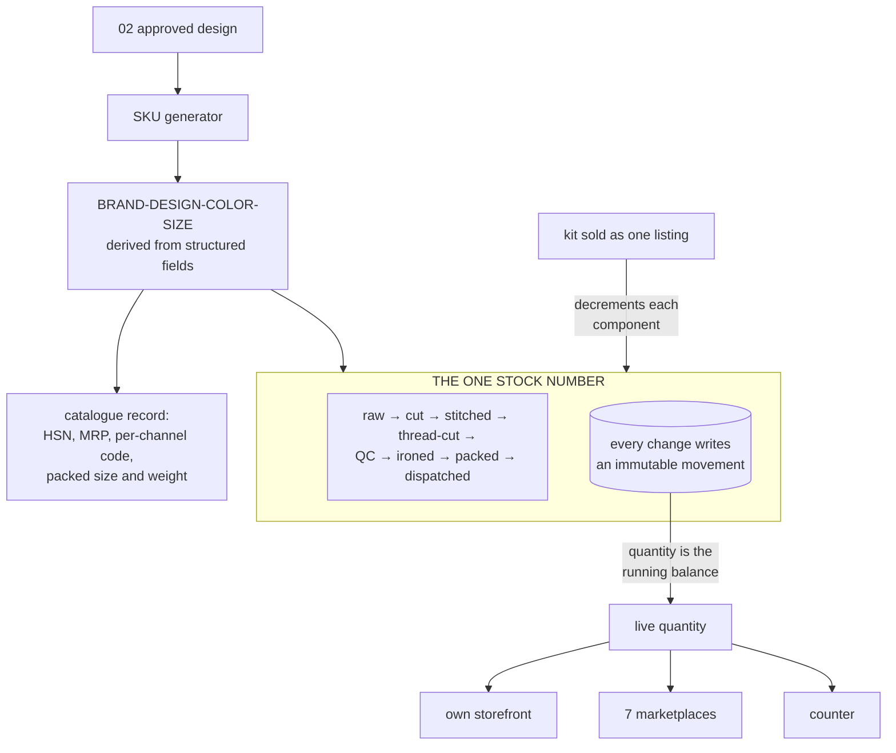
```mermaid
flowchart TB
  DES["02 approved design"] --> GEN["SKU generator"]
  GEN --> SKU["BRAND-DESIGN-COLOR-SIZE<br/>derived from structured fields"]
  SKU --> CAT["catalogue record:<br/>HSN, MRP, per-channel code,<br/>packed size and weight"]
  subgraph ONE["THE ONE STOCK NUMBER"]
    STG["raw → cut → stitched → thread-cut →<br/>QC → ironed → packed → dispatched"]
    MOV[("every change writes<br/>an immutable movement")]
  end
  SKU --> ONE
  MOV -->|"quantity is the<br/>running balance"| BAL["live quantity"]
  BAL --> CH1["own storefront"]; BAL --> CH2["7 marketplaces"]; BAL --> CH3["counter"]
  KIT["kit sold as one listing"] -->|"decrements each<br/>component"| ONE
```

**The apps (4)**

| App | State | What it does |
|---|---|---|
| Stock | SPEC | Live quantity by SKU, location and stage, with reorder alerts, batches and dead-stock ageing |
| Catalog / PIM | SPEC | One product record with each channel's own code mapped to yours, and the packed size and weight that decide courier rate and settle weight disputes |
| Kit & Combo SKU | SPEC | A sellable SKU made of component SKUs; selling it decrements every component |
| Master-Data Hygiene | SPEC | Duplicate detection and merge across customers, vendors and designs |

**What it owns.** `designs` · `colors` · `sizes` · `items` · `item_aliases` · `kit_items` · `stock` ·
`stock_movements` · `batches` · `opening_stock` · `hsn_codes` · `gst_rates` · `locations`

**The rules that matter**

- **Movements are the ledger; the quantity is its running balance.** Every transition writes an
  immutable row, so "how did we get to 4?" is always answerable.
- Stock is event-driven and **not per channel**. The last piece sold on one marketplace leaves every
  other in the same instant — not three hours later as a cancellation, because cancellations are what
  a seller rating is lost to.
- The SKU string is *derived* from structured fields. Search, grouping and analytics use the fields,
  never substring-matching on the string.
- Negative stock is a data fault, not a state the business can be in. An issue beyond what exists is
  refused and recounted.
- A wrong return is dead stock and is **never added back**.
- Stock valuation sets the balance-sheet figure — the two must be equal, or one of them is wrong.

<!-- RULES:03 -->

**The rulebook — 14 rules, 7 enforced by a test that runs today**

| # | The rule | When | Then | Never | State |
|---|---|---|---|---|---|
| R03.1 | **Stock is one number per SKU, per location, per stage** | any module asks how much there is | it reads the one quantity, with the channel recorded on the movement rather than on the stock | keeping a separate stock figure per channel — the last piece sold on one marketplace has to vanish from the other ten at the same instant, which per-channel inventory cannot do | **ENFORCED** · core/tests/core.test.js · stock is one number per SKU, with the channel recorded on the movement |
| R03.2 | **Negative stock is a fault, not a state** | an issue would take a quantity below zero | the issue is refused | recording a negative balance and leaving someone to explain it at month-end | **ENFORCED** · core/tests/core.test.js · issuing more than exists is refused — negative stock is a fault, not a state |
| R03.3 | **Selling a kit decrements every component** | a kit or combo SKU is sold | each component SKU is decremented at order time | decrementing only the kit, which leaves the components sellable twice | **ENFORCED** · core/tests/core.test.js · selling a kit decrements every component |
| R03.4 | **A kit with no components is refused** | an item is marked a kit but lists nothing | the record is refused and named | accepting it and silently decrementing nothing on every sale | **ENFORCED** · core/tests/core.test.js · a kit that lists no components is refused, not silently sold as nothing |
| R03.5 | **Stock value ties to the item cost, always** | stock is valued | the value is computed from the quantity and the item cost | storing a valuation that can drift from the quantity it is supposed to describe | **ENFORCED** · core/tests/core.test.js · stock value ties to the item cost |
| R03.6 | **Every movement has a source, a destination, or both** | a stock movement is recorded | at least one end is named | accepting a movement from nowhere to nowhere, which is how quantity appears without a cause | **ENFORCED** · core/tests/core.test.js · a movement with neither a source nor a destination is refused |
| R03.7 | **A quantity is a whole number above zero** | a movement is written | a non-integer or non-positive quantity is refused | accepting a negative movement as a shorthand for a reversal — a reversal is its own movement with its own reason | **ENFORCED** · core/tests/core.test.js · a quantity must be a whole number above zero |
| R03.8 | **Goods in someone else’s warehouse are still yours** | stock sits in a channel’s own warehouse under consignment or sale-or-return | that warehouse is a location like any other and the stock is counted, valued and aged there | letting it drop off the books until it sells, which understates both stock and exposure | SPECIFIED |
| R03.9 | **Fabric in metres and pieces in numbers share one item master** | an item is defined | its unit of measure is a property of the item | building a second item master for a second unit, which splits the one stock number this module exists to protect | SPECIFIED |
| R03.10 | **A listing needs the packed size and weight before it can go out** | a product is pushed to a channel | packed dimensions and weight must be present | listing without them, because that is the field every courier weight dispute is settled on | SPECIFIED |
| R03.11 | **The channel’s own code for a product is mapped, not assumed** | a product exists on a marketplace | that channel’s identifier is stored against ours | matching on name or on a code we invented, which mis-posts every settlement line for that product | SPECIFIED |
| R03.12 | **A duplicate master record is merged, never left as two** | the same customer, vendor or design is detected twice | they are merged and both old identifiers keep resolving | leaving two live records, which splits every total that record appears in | SPECIFIED |
| R03.13 | **A price is per channel and dated** | a channel price is set | it is stored against that channel with the date it takes effect | holding one price and reading it as if it applied everywhere and always | SPECIFIED |
| R03.14 | **Dead stock is named as dead stock** | an item has not moved for the period set for it | it appears on the dead-stock register with its age and carrying value | leaving it inside the general stock figure where it reads as healthy inventory | SPECIFIED |

<!-- /RULES:03 -->

**Reads** ← Design & Sampling, every module · **Writes** → every module

**Done when.** Stock is one number across every channel, a kit sale decrements all components, and
stock valuation equals the balance sheet.

---

## MODULE 04 · CRM
*Know every customer completely — and answer them fast*

**What it is.** One record per customer carrying every lead, order, return, document and conversation,
whichever channel it arrived on. Whoever picks up the next question can already see everything that
came before it.

**How it works**

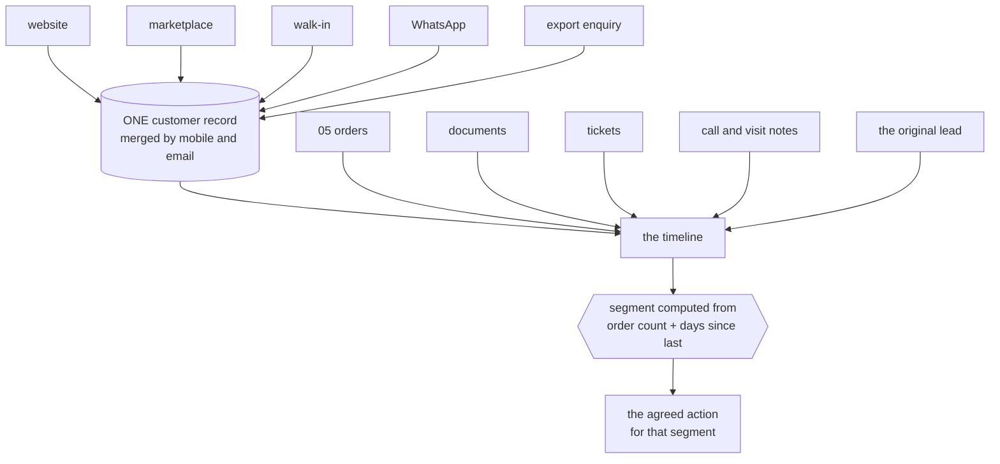
```mermaid
flowchart TB
  L1["website"] --> ONE; L2["marketplace"] --> ONE; L3["walk-in"] --> ONE
  L4["WhatsApp"] --> ONE; L5["export enquiry"] --> ONE
  ONE[("ONE customer record<br/>merged by mobile and email")]
  ONE --> T["the timeline"]
  O["05 orders"] --> T; D["documents"] --> T; K["tickets"] --> T
  N["call and visit notes"] --> T; LD["the original lead"] --> T
  T --> SEG{{"segment computed from<br/>order count + days since last"}}
  SEG --> ACT["the agreed action<br/>for that segment"]
```

**The apps (4)**

| App | State | What it does |
|---|---|---|
| CRM & Customer 360 | **BUILT** | Lead to won, then the full lifetime — orders, returns, value, and what to offer next, on one screen |
| Documents & eSign | **BUILT** | Every agreement and certificate filed against the record it belongs to; send for signature and the signed copy files itself back |
| Helpdesk & Live Chat | **BUILT** | Questions become tickets tied to the order they are about, with the whole history already open |
| Forms & Feedback (NPS) | SPEC | Post-delivery feedback attached to the *design*, so a complaint-prone design surfaces as a pattern |

**What it owns.** `customers` · `customer_addresses` · `customer_interactions` ·
`customer_lifecycle_events` · `loyalty_ledger` · `documents` · `tickets` · `nps_responses`

**The rules that matter**

- Nobody tags anybody. A customer's segment is computed from two facts only — how many orders and how
  long since the last — so a buyer moves segment by themselves the moment they buy or go quiet.
  Hand-tagged segments are always six months out of date.
- D2C, B2B, export, walk-in and WhatsApp merge to one customer by mobile and email. Marketplace
  customers stay separate because the channel does not share their details, but tie by pattern.
- The pipeline advances Lead → Qualified → Quoted → Negotiation and stops there; won or lost is a
  separate deliberate act.
- Feedback attaches to the design, not only the buyer — that is what turns a scatter of complaints
  into a fault Manufacturing can fix.

<!-- RULES:04 -->

**The rulebook — 9 rules, 0 enforced by a test that runs today**

| # | The rule | When | Then | Never | State |
|---|---|---|---|---|---|
| R04.1 | **One customer, one record, whichever channel they arrived by** | the same person orders on a marketplace and later at the counter | both land on one record with the channel noted on each order | creating a second customer per channel, which makes lifetime value meaningless | SPECIFIED |
| R04.2 | **A document is filed against the record it belongs to** | any agreement, receipt, certificate or scan is stored | it is attached to the order, party, case or employee it concerns | filing it in a folder that has to be remembered rather than found | SPECIFIED |
| R04.3 | **A signed copy files itself back** | a document sent for signature is signed | the signed version returns to the same record automatically | leaving the signed copy in an inbox while the record still shows it as pending | SPECIFIED |
| R04.4 | **A ticket carries the order it is about** | a question arrives by chat, email or phone | it is tied to the order or account it concerns, with the history already on screen | opening a ticket with no link, which makes the first reply a request to explain again | SPECIFIED |
| R04.5 | **Feedback attaches to the item, not only the buyer** | a rating or complaint arrives after delivery | it is attached to the design or item it is actually about | holding it only against the customer, which hides a complaint-prone item as a scatter of unrelated gripes | SPECIFIED |
| R04.6 | **A customer’s consent travels with their data** | a customer record is used for marketing or profiling | the consent captured at the point it was given is checked first | assuming that having the data implies permission to use it for anything | SPECIFIED |
| R04.7 | **A merged customer keeps both histories** | two customer records are merged | every order, ticket and document from both survives on the surviving record | discarding the shorter history to make the merge simple | SPECIFIED |
| R04.8 | **Credit state is read at the moment of the order** | a B2B order is placed | the customer’s outstanding and limit are evaluated then | using a figure cached from the last sync, which is how a party goes past its limit between refreshes | SPECIFIED |
| R04.9 | **A closed ticket keeps what resolved it** | a ticket is closed | the resolution is recorded on it | closing with a status alone, which loses the answer the next identical question needs | SPECIFIED |

<!-- /RULES:04 -->

**Reads** ← every module · **Writes** → Sales · E-commerce/OMS · Marketing

**Done when.** One customer's whole cross-channel history is on one screen, and crossing an order
threshold moves their segment without anyone touching it.

---

## MODULE 05 · SALES
*Every way you sell, one order book — to the doorstep*

**What it is.** Counter, wholesale, export and your own website all writing to the same order and
drawing on the same stock number. A sale is not finished when it is billed — it is finished when it
is delivered and the cash-on-delivery money is in.

**How it works**

```mermaid
flowchart TB
  W["own storefront"] --> ORD; B["wholesale / B2B"] --> ORD
  E["export"] --> ORD; P["counter POS"] --> ORD; Q["quote accepted"] --> ORD
  ORD["ONE sales order"] --> CHK{{"checks before acceptance"}}
  CHK -->|"B2B: credit limit"| HOLD["held if over limit"]
  CHK -->|"COD: advance taken?"| BLOCK["cannot pack below<br/>the advance rule"]
  CHK -->|ok| RES["03 stock reserved"]
  RES --> INV["12 invoice with GST"]
  INV --> WH["10 pick and pack"] --> AWB["11 courier booked"]
  AWB --> DEL["delivered"] --> COD["11 balance collected"]
  COD --> SET["12 both legs settle one invoice"]
```

**The apps (7)**

| App | State | What it does |
|---|---|---|
| D2C Sales | **BUILT** | Own-storefront orders cart to dispatch, with loyalty and partial COD |
| B2B & Credit | **BUILT** | Wholesale orders with credit limits, tier pricing and outstanding ageing |
| Export | **BUILT** | Commercial invoice, packing list, LUT bond and IGST-refund tracking |
| POS | **BUILT** | Counter billing drawing on the same stock as the website |
| Quotes & Proforma | **BUILT** | Send a quote, convert it to a confirmed order in one step |
| Couriers & AWB | SPEC | Compare couriers on the order, print the label, follow the AWB to the door |
| Subscriptions | SPEC | A schedule that raises its own invoice and follows up when a payment fails |

**What it owns.** `sales_orders` · `sales_order_items` · `invoices` · `invoice_items` · `b2b_orders` ·
`b2b_credit_ledger` · `export_orders` · `customization_orders` · `subscriptions`

**The rules that matter**

- **A COD order cannot be packed until it carries its advance.** A refused COD parcel costs the
  courier fee both ways and comes back handled; a customer who has paid something almost always
  accepts. This one rule is the cheapest defence the business has.
- **Partial COD reconciles both legs to one invoice** — the advance taken online and the balance the
  courier remits.
- Credit is checked *before* acceptance, not discovered later as a bad debt. Reminders at −3 days,
  +1 day, and a +7-day soft block.
- The delivery date is **derived** — cut-off plus transit from the warehouse that actually holds
  stock — never typed. An order no warehouse can serve gets no date at all, because a promise nobody
  can keep is worse than no promise.
- Export lines are zero-rated under LUT; FX difference between billing rate and realisation rate
  posts to FX gain/loss.

<!-- RULES:05 -->

**The rulebook — 18 rules, 4 enforced by a test that runs today**

| # | The rule | When | Then | Never | State |
|---|---|---|---|---|---|
| R05.1 | **Every sale carries its company and its channel** | an order is created on any channel | both are written on the order | leaving either to be inferred later from the document number or the warehouse | **ENFORCED** · core/tests/core.test.js · every one of the hundred cells posted its own figure, channel by channel |
| R05.2 | **A sale posts stock and ledger together** | a sale is confirmed | stock is deducted, the invoice is raised, and the ledger is posted in one transaction | invoicing without moving stock, or moving stock without posting | **ENFORCED** · core/tests/core.test.js · a sale moves stock and posts to the ledger, or does neither |
| R05.3 | **If the ledger refuses, the stock never moved** | the posting half of a sale fails | the stock movement is rolled back with it | leaving the goods gone and the books untouched | **ENFORCED** · core/tests/core.test.js · and if the ledger refuses, the stock never moved |
| R05.4 | **A quote becomes an order without being retyped** | a quotation is accepted | the order is created from it, carrying the same lines and prices | re-entering the lines, which is where the price on the quote and the price on the invoice start to differ | SPECIFIED |
| R05.5 | **A price below the floor needs an approval, not a note** | a line is priced under the floor set for it | the order waits in the approvals queue with the rule that stopped it named | letting it through with a comment box, which is a discount policy nobody can enforce | SPECIFIED |
| R05.6 | **An export invoice knows it is an export** | an order ships outside the country | the LUT or IGST treatment, currency and shipping terms are set on the order itself | treating it as a domestic invoice and correcting the tax afterwards | SPECIFIED |
| R05.7 | **A counter sale is the same order record** | someone buys at the counter | the same order table records it, with the counter as the channel | running the till on a separate book that has to be merged later | SPECIFIED |
| R05.8 | **A credit sale reserves the credit at the moment it is taken** | a B2B order is accepted on credit | the exposure is committed against the party immediately | counting it only when the invoice is raised, which lets several orders each fit inside the same limit | SPECIFIED |
| R05.9 | **A dispatch cannot exceed what was ordered** | a shipment is prepared | quantities are checked against the order line | shipping over, which becomes an invoice the customer never agreed to | SPECIFIED |
| R05.10 | **A cancelled order releases what it held** | an order is cancelled | reserved stock and committed credit are both released | leaving stock reserved against a dead order, which shows the business as out of goods it actually has | SPECIFIED |
| R05.11 | **An AWB belongs to the shipment, not the courier integration** | a tracking number is recorded, typed in or fetched | it is stored on the shipment | making the number reachable only through whichever courier API produced it, which loses it the day that courier is dropped | SPECIFIED |
| R05.12 | **A subscription renewal is a new order** | a subscription renews | a fresh order is created with its own stock, invoice and posting | extending the original order, which makes the revenue of two periods indistinguishable | SPECIFIED |
| R05.13 | **A sale to a sister company is marked as one** | the counterparty is another company in the group | the counterparty company is recorded on the entry | posting it as an ordinary outside sale, which inflates the group turnover by trade it never did | **ENFORCED** · core/tests/core.test.js · an entry cannot be its own counterparty |
| R05.14 | **A quote or proforma number carries its type and financial year** | a quotation or proforma is raised | it is numbered Q-{FY}-#### or PI-{FY}-####, sequential within that company and year | sharing one sequence between quotations and proformas, which makes a proforma indistinguishable from a quote in the register | SPECIFIED |
| R05.15 | **A quote line with no description, no quantity or a negative rate is not a line** | a quotation is totalled | only lines with a description, a quantity above zero and a rate of zero or more are counted | letting a half-filled row contribute a number to the total | SPECIFIED |
| R05.16 | **An export line carries no GST** | a quotation or invoice is marked export under LUT | the GST percentage is zero and the document says why | applying the domestic rate and correcting it after the buyer queries the total | SPECIFIED |
| R05.17 | **A made-to-measure order has two money legs, and both are visible** | a customisation order is accepted | the advance and the balance are recorded as separate amounts with their own dates, and the balance stays owed until dispatch | showing one payment at the end, which hides money already taken and work already owed | SPECIFIED |
| R05.18 | **A customisation quote keeps every round of the negotiation** | a price is revised during a bespoke enquiry | each quoted figure is kept in order with what changed | overwriting the earlier figure, which is the one the customer remembers agreeing to | SPECIFIED |

<!-- /RULES:05 -->

**Reads** ← Inventory & Catalog · CRM · Warehouse · Logistics ·
**Writes** → Inventory & Catalog · Accounting & GST · Warehouse · Logistics

**Done when.** A storefront order appears within a minute with stock reserved and an invoice raised,
and a partial-COD order reconciles both legs by itself.

---

## MODULE 06 · PLANNING & REQUIREMENTS (MRP)
*Turn what is selling into what to buy and make*

**What it is.** The module that sits between demand and supply. Confirmed orders and sales history
become a requirement before Purchase buys anything or Manufacturing starts anything — otherwise both
are guessing.

**How it works**

```mermaid
flowchart LR
  H["05 / 15 sales history"] --> FC["demand forecast<br/>by SKU and period"]
  OP["confirmed open orders"] --> NEED["what is committed"]
  FC --> NEED
  ST["03 stock on hand<br/>+ already on order"] --> NET{{"net requirement"}}
  NEED --> NET
  NET --> BOM["exploded through the BOM"]
  BOM --> RAW["raw material needed, by date"]
  BOM --> MAKE["production needed, by date"]
  RAW --> CAP{{"open-to-buy ceiling<br/>for this period"}}
  CAP -->|within budget| PO["07 requisition drafted"]
  CAP -->|over budget| STOP["held — signal is real,<br/>the money is not there"]
  MAKE --> MFG["08 production order"]
```

**The apps (3)**

| App | State | What it does |
|---|---|---|
| Demand Forecast & Signal | SPEC | What sold, by SKU and period, turned into a short-term forecast — the number every downstream requisition is measured against |
| Requirement Explosion (MRP run) | SPEC | Demand exploded through the bill of materials into what to buy and what to make, and by when |
| Open-to-Buy / Budget Ceiling | SPEC | A spending ceiling per period that a demand signal alone cannot exceed |

**What it owns.** `demand_forecast` · `mrp_runs` · `mrp_requirements` · `open_to_buy_budgets`

**The rules that matter**

- Net requirement is demand minus stock on hand minus what is already on order. Buying against gross
  demand is how a business ends up holding two seasons of the same fabric.
- Every requisition traces back to the run that produced it, and that run back to the demand behind
  it. A purchase order whose only justification is "stock looked low" is exactly what this module
  exists to eliminate.
- **The budget ceiling is a hard guardrail, not a warning.** A genuine demand signal can still commit
  more money than the business decided to risk this season, and without a ceiling it will.

<!-- RULES:06 -->

**The rulebook — 8 rules, 0 enforced by a test that runs today**

| # | The rule | When | Then | Never | State |
|---|---|---|---|---|---|
| R06.1 | **A forecast is labelled a forecast wherever it appears** | a projected figure is shown beside actuals | it is visually and structurally distinct | letting a forecast total sit in the same column as a real one, which is how a plan becomes a reported result | SPECIFIED |
| R06.2 | **A requirement run reads live stock, not a snapshot** | the MRP run explodes requirements | it reads the current quantity at the moment it runs | planning against a nightly copy, which orders material the business already has | SPECIFIED |
| R06.3 | **A requirement names what caused it** | the run produces a shortfall | the order, forecast or reorder level that generated it is recorded on the line | producing a bare quantity nobody can trace back to a demand | SPECIFIED |
| R06.4 | **Stock already on order counts against the shortfall** | the run computes what to buy | open purchase orders are netted off first | ignoring them and ordering the same material twice | SPECIFIED |
| R06.5 | **A budget ceiling refuses, it does not warn** | a proposed purchase would exceed the open-to-buy ceiling | it is held for approval with the ceiling named | raising it with a warning, which makes the ceiling advisory and therefore not a ceiling | SPECIFIED |
| R06.6 | **A lead time is per vendor and per item** | a run works out when to order | it uses the lead time recorded for that vendor and that item | applying one global lead time, which under-orders the slow lines and over-orders the fast ones | SPECIFIED |
| R06.7 | **A run is kept, not overwritten** | the MRP run executes again | the previous run stays readable with its inputs | replacing it, which makes it impossible to see why last week’s decision was taken | SPECIFIED |
| R06.8 | **A seasonal signal cannot silently become a permanent one** | a festival or season inflates demand | the period it applies to is stored with the signal | folding a spike into the baseline, which keeps ordering for a festival all year | SPECIFIED |

<!-- /RULES:06 -->

**Reads** ← Sales · E-commerce/OMS · Inventory & Catalog · **Writes** → Purchase · Manufacturing

**Done when.** An MRP run turns a month of real demand into requisitions and production orders that
each trace back to the orders that caused them, and the ceiling blocks the run that exceeds it.

---

## MODULE 07 · PURCHASE
*Nothing over-billed gets paid*

**What it is.** The buy side end to end — mills, dyers, job workers, packing suppliers — and the
control that stops you paying for goods you rejected.

**How it works**

```mermaid
flowchart LR
  REQ["06 requisition"] --> PO["purchase order<br/>PO-FY-####"]
  PO --> V{{"vendor by score<br/>P1 → P2 → P3"}}
  V --> SENT["sent to vendor"]
  SENT --> GRN["goods received<br/>qty accepted / rejected"]
  GRN --> QC["09 inspected"]
  GRN --> STK["03 raw stock in"]
  BILL["vendor invoice"] --> M3{{"THREE-WAY MATCH"}}
  PO --> M3; GRN --> M3
  M3 -->|"invoice = accepted qty × PO rate"| PAY["12 payable created<br/>ITC claimed"]
  M3 -->|mismatch| STOPP["blocked before payment"]
  GRN --> SCORE["vendor scorecard:<br/>quality %, on-time %, rate"]
  SCORE --> V
```

**The apps (3)**

| App | State | What it does |
|---|---|---|
| Procurement | **BUILT** | Requisition → PO → GRN, with a strict three-way match before any bill is paid |
| Vendor Management | **BUILT** | Vendor 360, payables, ageing, a real risk score, and sourcing that follows performance |
| Insurance Register | SPEC | Cover over stock in transit, stock in the warehouse and product liability, matched against what is actually moving |

**What it owns.** `purchase_requisitions` · `purchase_orders` · `purchase_order_items` · `grn` ·
`grn_items` · `vendor_invoices` · `three_way_match` · `vendors` · `vendor_materials` ·
`third_party_services` · `insurance_policies`

**The rules that matter**

- **The three-way match is the whole point.** You ordered 100 metres, 100 arrived, quality accepted
  96 — the bill clears for 96 and not a metre more. The system flags GRN ≠ PO, invoice ≠ accepted ×
  rate, and any invoice arriving before its GRN.
- The vendor scorecard is computed per transaction from real outcomes — accept rate, on-time
  delivery, rate against market — and it drives the priority order for the next requisition. Sourcing
  follows performance rather than habit.
- Real stock value moves through purchase and the warehouse continuously; cover that nobody tracks is
  cover nobody can claim on.

<!-- RULES:07 -->

**The rulebook — 12 rules, 0 enforced by a test that runs today**

| # | The rule | When | Then | Never | State |
|---|---|---|---|---|---|
| R07.1 | **Nothing is paid without a three-way match** | a vendor invoice is approved | the purchase order, the goods received note and the invoice must agree | paying on the invoice alone, which pays for goods that never arrived | SPECIFIED |
| R07.2 | **A short or damaged receipt is recorded as received short** | the GRN quantity is below the PO quantity | the difference is recorded with its reason and the payable follows the received quantity | receiving the full quantity to make the match pass | SPECIFIED |
| R07.3 | **Input tax credit is claimed against a real document** | ITC is taken on a purchase | the vendor invoice and its tax detail are on file | claiming credit from a payment record alone, which is the claim that fails reconciliation | SPECIFIED |
| R07.4 | **Landed cost reaches the item, not just the P&L** | freight, duty or insurance is attached to a purchase | it is apportioned into the cost of the items received | expensing it separately, which understates the cost of every piece made from that material | SPECIFIED |
| R07.5 | **A vendor price is dated** | a rate is agreed with a supplier | it is stored with the date it takes effect | overwriting the old rate, which makes last month’s purchase look mispriced | SPECIFIED |
| R07.6 | **A purchase order over its approval level waits** | a PO exceeds the value a role may approve | it goes to the approvals queue naming the rule and the level | splitting it into smaller orders to fit under the limit — the split is detected and the parts are assessed together | SPECIFIED |
| R07.7 | **A vendor with no active record cannot be paid** | a payment is raised | the vendor must exist, be active, and have its bank detail verified | paying to detail typed onto the payment itself, which is the single most common route for payment fraud | SPECIFIED |
| R07.8 | **A change to vendor bank detail is treated as high risk** | a vendor’s bank account is changed | the change is approved by a second person and the old detail is kept | accepting a change from an email instruction alone | SPECIFIED |
| R07.9 | **A job-work despatch stays on the books** | material is sent to a contractor | it moves to a job-work location and remains this company’s stock | writing it out on despatch, which loses material the business still owns | SPECIFIED |
| R07.10 | **An insurance policy is linked to what it covers** | a policy is recorded | the stock, premises or shipment it covers is named on it | holding policies as documents with no link, which is discovered only at the moment of a claim | SPECIFIED |
| R07.11 | **The three-way match is arithmetic, not a judgement** | a vendor invoice is checked | the payable equals the received quantity × the purchase-order rate, and the purchase order, the goods receipt and the invoice must all agree on quantity and value | passing an invoice whose value exceeds received quantity × agreed rate, and never letting an override happen without recording who made it and why | SPECIFIED |
| R07.12 | **A material is sourced down a ranked list, not from whoever answers** | a material has to be bought | the vendors ranked for that material are approached in their priority order | defaulting to the last vendor used, which is how a price rise becomes permanent without anyone deciding | SPECIFIED |

<!-- /RULES:07 -->

**Reads** ← Inventory & Catalog · Planning/MRP · Manufacturing ·
**Writes** → Inventory & Catalog · Accounting & GST · Quality & Compliance

**Done when.** A vendor invoice for more than was accepted is blocked before payment, and the
rejection reason is on the record.

---

## MODULE 08 · MANUFACTURING
*Know what a unit really costs to make*

**What it is.** From material in the door to the finished unit — every operation, every worker's
earning, and what each design actually cost before it was priced. Design sign-off happens upstream in
Module 02; inspection and the compliance record live downstream in Module 09. This module is purely
the making.

**How it works**

```mermaid
flowchart TB
  PO["06 production order"] --> ST["10 stages, WIP visible at each"]
  ST --> S1["cut"] --> S2["stitch"] --> S3["thread cut"]
  S3 --> S4["09 QC"] --> S5["iron"] --> S6["pack"]
  S6 --> FIN["03 finished stock in"]
  BOM["BOM: what it consumes,<br/>at today's rates"] --> COST["cost per unit"]
  RPT["karigar reports pieces<br/>by garment type"] --> POOL{{"pooled across ALL karigars<br/>per design first"}}
  POOL --> SETS["sets = min across the<br/>POPULATED member columns"]
  SETS --> EXTRA["surplus named individually<br/>Extra Anarkali, Extra Plazo"]
  SETS --> EARN["paid per RAW PIECE,<br/>independent of set completion"]
  EXTRA --> EARN
  EARN --> HR["16 into the payout register"]
  EARN --> COST
  COST --> PL["design profit"]
```

**The apps (4)**

| App | State | What it does |
|---|---|---|
| Production Orders | SPEC | Your own stages from first operation to finished goods, with work-in-progress visible at each |
| Piece-rate & Contractors | SPEC | Output-based pay: pooled set completion, per-unit rates, rework and advances resolved into one payout |
| BOM & Consumption | SPEC | What each design consumes — fabric, zari, lining, trims, packing — costed at today's rates |
| Maintenance | SPEC | Machines and tools: what is due for service, what it cost, what stopped while it was down |

**What it owns.** `production_orders` · `production_stages` · `bom` · `bom_items` ·
`karigar_assignments` · `karigar_reports` · `performance_flags`

**The karigar costing rules — the heart of this module**

These are settled and already proven in a working engine. They are unusual enough to be worth stating
exactly, because getting any one of them wrong changes what a person gets paid.

1. **23 garment columns collapse to 13 set types.** A set is a named combination, not an arbitrary
   grouping.
2. **Pool across all karigars per design first, then apply the rule.** Pooling after applying the
   rule produces a different, wrong answer.
3. **Sets = the minimum across the *populated* member columns of that set type.** A column nobody
   worked on is not a zero that drags the set count to nothing — it is simply not part of the
   calculation.
4. **Extras are named individually** — Extra Anarkali, Extra Plazo — never a generic leftover bucket,
   and there is **no combined "Set + Extra" total column**, because that column would double-count.
5. **Cost is per raw piece, independent of set completion.** A surplus piece that completes no set is
   still work somebody did, and is still paid.
6. **A missing rate posts ₹0 and raises a flag — never a guessed rate.** A guessed rate is a silent
   error in someone's wages.
7. Alteration earning is alteration hours × ₹100; an alteration caused by the worker's own mistake is
   ₹0.
8. A performance flag fires when the same person, design and task takes more than 1.2× the previous
   hours, and asks why by WhatsApp.

**The acceptance gate — figures that must reproduce to the rupee**

| Source | Designs | Karigar units | Sets | Pieces | Total | Flagged |
|---|---|---|---|---|---|---|
| The owner's hand-made report, Apr 2025 – Jun 2027 | 143 | 29 | **25,307** | **59,110** | **₹26,90,062** | 5 designs with no rate |
| The engine, run today on the workbooks as they now stand | 128 | 20 | **16,662** | **36,229** | **₹17,45,911** | 0 designs with no rate |

**Why the two rows differ, stated rather than reconciled away.** The FY2026-27 workbook has since
been restructured into one payment sheet per karigar team, each sheet named for its team, and it
no longer carries a design grid at all, so that year's rows cannot be read from it. The five
previously unrated designs have since been given rates, which is why nothing is flagged now.

The verification does not weaken the gate to make it pass. It places **every** design in the
reference report into exactly one bucket with a named cause — matched exactly, changed at source,
rate added since, incomplete-set rule, or present only in the FY2026-27 grid — prints the buckets,
and fails on any design whose difference has no explanation. There are currently none. A mismatch
with no cause is a bug, not a rounding difference; an input the engine cannot read is a stated
limitation, not a passing test.

**What closing this needs.** A reader for the per-team sheet layout, so the FY2026-27 year is
costed from the file the business actually keeps today rather than from one it no longer maintains.

<!-- RULES:08 -->

**The rulebook — 20 rules, 9 enforced by a test that runs today**

| # | The rule | When | Then | Never | State |
|---|---|---|---|---|---|
| R08.1 | **Sets are pooled across every karigar before the minimum is taken** | completed sets are counted for a design | every karigar’s pieces for that design are pooled first, and the set count is the minimum across the populated member columns of the pool | counting sets per karigar row and adding them up, which loses every set completed by two people between them | **ENFORCED** · brand/suite/studio/verify_studio.js · pooling happens before the minimum, not per karigar row |
| R08.2 | **A surplus piece is paid for, and is not a set** | a karigar makes more of one garment than the set needs | the extra is named individually and paid at its own piece rate | adding it to the set count, and never leaving it unpaid because it did not complete a set — the person made it either way | **ENFORCED** · brand/suite/studio/verify_studio.js · a surplus piece is named, is still paid for, and is never added to the sets |
| R08.3 | **A design counts on the garments it actually has** | a design is made of fewer garment types than the usual set | it is counted on the members it does have | returning zero because an optional member is absent, which silently unpays a whole design | **ENFORCED** · brand/suite/studio/verify_studio.js · an Anarkali-only design counts on what it has, not zero |
| R08.4 | **A missing rate posts zero and is flagged, never guessed** | a design has no entry in the stitching rate master | it costs zero and the design is named in the summary | inferring a rate from a similar design — a guessed rate is a wrong payment to a real person | **ENFORCED** · brand/suite/studio/verify_studio.js · a missing rate posts zero and is flagged, never guessed |
| R08.5 | **A two-row heading is read as two rows** | the production grid uses a merged heading over garment columns | both header rows are read so repeated garment names stay distinct columns | reading only the first row, which collapses three Dupatta columns into one and undercounts the work | **ENFORCED** · brand/suite/studio/verify_studio.js · the two-row heading is read, so three Dupatta columns stay three garments |
| R08.6 | **A karigar written as a pair stays one unit** | two names share one row as a working pair | they are treated as a single paying unit | splitting them into two karigars, which halves each person’s recorded output and breaks the payout | **ENFORCED** · brand/suite/studio/verify_studio.js · a karigar written as a pair stays one unit |
| R08.7 | **Several years of grids pool into one set of figures** | more than one production workbook is supplied | their grids pool into a single costing | reporting each file separately, which double-counts nothing but hides the sets completed across a year boundary | **ENFORCED** · brand/suite/studio/verify_studio.js · several years of grids pool into one set of figures |
| R08.8 | **Cost per piece is independent of set completion** | the cost of a design is worked out | each raw piece is costed at its own rate | costing by completed sets, which values an unfinished set at nothing while the labour has already been spent | **ENFORCED** · brand/suite/studio/verify_studio.js · the grand total is the sum of the designs, and of the karigars |
| R08.9 | **A production report moves stock and pay together** | a karigar production report is accepted | finished stock comes in, the payout is raised in HR, wages post to the ledger, and the design cost updates — in one transaction | taking the stock in and settling the pay in a separate pass, which is how the two disagree | SPECIFIED |
| R08.10 | **Material issued to production leaves raw stock at the moment it is issued** | a production order consumes material | raw stock is reduced and work in progress increases | consuming at completion, which shows material as available while it is already cut | SPECIFIED |
| R08.11 | **A bill of materials is versioned with the design** | a production order is created | it captures the BOM version in force at that moment | reading the current BOM when costing an old order, which recosts history | SPECIFIED |
| R08.12 | **Wastage is recorded, not absorbed** | consumption exceeds the BOM | the excess is recorded as wastage against the order with its reason | quietly increasing the BOM to match what was used, which destroys the only signal that something is going wrong | SPECIFIED |
| R08.13 | **A stage cannot be skipped without being recorded as skipped** | work moves past a defined stage without that stage being marked | the skip is recorded on the order | letting the stage silently complete, which makes every stage-time figure fiction | SPECIFIED |
| R08.14 | **An advance to a karigar is a balance, not a deduction from nowhere** | an advance is paid | it is held against that karigar and recovered from later payouts, with the running balance visible | deducting an amount at payout time that cannot be traced to a specific advance | SPECIFIED |
| R08.15 | **A rework carries the cost of the rework** | a piece is returned to a stage to be redone | the additional labour is costed to the design that caused it | costing it as new production, which makes a failing design look as profitable as a good one | SPECIFIED |
| R08.16 | **Material consumed is the average per piece times the pieces made** | consumption is costed against a production run | consumption equals the average consumption per piece × pieces produced, and the difference against the bill of materials is recorded as wastage | back-fitting the average to whatever was issued, which makes wastage mathematically impossible to see | SPECIFIED |
| R08.17 | **A set type comes from the rate master, and an inferred one says so** | a design is classified into a set type | the rate master’s Set column decides it; when the design is absent, the type is inferred from which garment columns actually carry pieces and the design is flagged as inferred | presenting an inferred classification as though it came from the master | **ENFORCED** · brand/suite/studio/verify_studio.js · the two-row heading is read, so three Dupatta columns stay three garments |
| R08.18 | **An alteration caused by the karigar’s own mistake is unpaid** | a piece is reworked because of an error by the person who made it | the alteration hours are recorded and paid at zero | paying for the rework at the standard alteration rate, and never leaving the hours unrecorded — the time still happened and the design still bore the cost | SPECIFIED |
| R08.19 | **Alteration time is paid at the alteration rate, not the piece rate** | admin-assigned alteration hours are settled | they are paid at the hourly alteration rate in force and added to that karigar’s payout | folding alteration hours into the piece count, which corrupts both the production figure and the earnings figure at once | SPECIFIED |
| R08.20 | **A contract worker paid by the hour has no attendance row** | a contract role is settled | payment is hours worked × the agreed hourly rate, recorded against the person without an attendance record | forcing a contract worker through the salaried attendance model, which produces a monthly figure nobody agreed to | SPECIFIED |

<!-- /RULES:08 -->

**Reads** ← Purchase · Planning/MRP · Design & Sampling ·
**Writes** → Inventory & Catalog · HR & Payroll · Accounting & GST · Quality & Compliance

**Done when.** Three production orders run to completion — self-made, full job work, partial job work
— and the acceptance-gate totals reproduce exactly.

---

## MODULE 09 · QUALITY & COMPLIANCE
*Certify what was received and what was made*

**What it is.** Inspection used to be one step buried inside Manufacturing. It stands on its own here
because rejecting goods at receipt and rejecting goods on the floor are the same discipline — and
because the certificates that prove a standard is followed belong beside the inspections that back
them up, not scattered across email.

**How it works**

```mermaid
flowchart TB
  IN1["07 goods received"] --> INSP{{"inspect"}}
  IN2["08 production output"] --> INSP
  INSP -->|accept| OK["03 into stock"]
  INSP -->|rework| RW["08 back to the floor"]
  INSP -->|reject| REJ["07 bill blocked for<br/>the rejected quantity"]
  INSP --> REASON["reason recorded"]
  REASON --> VS["07 vendor scorecard"]
  REASON --> PF["08 performance flag"]
  CERT["certificate register:<br/>standard, issued, expires,<br/>the audit behind it"] --> WARN["expiry warning<br/>before a buyer asks"]
  CERT --> ESG["21 sustainability reporting<br/>reads this evidence"]
```

**The apps (2)**

| App | State | What it does |
|---|---|---|
| Quality Control | SPEC | Accept, reject or rework — on goods received and goods made — with reasons that feed the vendor scorecard and the performance flags alike |
| Certificate & Compliance Register | SPEC | Every standard held, with issue date, expiry and the audit that backs it |

**What it owns.** `qc_records` · `qc_defect_categories` · `compliance_certificates` ·
`compliance_audits`

**The rules that matter**

- A rejection is never just a number — it carries a reason, and that reason is what makes the vendor
  scorecard and the performance flag meaningful rather than decorative.
- The quantity accepted at QC, not the quantity delivered, is what the three-way match pays against.
  This is the join between this module and the money.
- A certificate about to lapse is visible *before* a buyer asks for it and finds it expired.
- What this register holds is precisely what a sustainability report is later built from — which is
  why the reporting app in Module 21 reads it rather than collecting evidence separately.

<!-- RULES:09 -->

**The rulebook — 7 rules, 0 enforced by a test that runs today**

| # | The rule | When | Then | Never | State |
|---|---|---|---|---|---|
| R09.1 | **A failed check blocks the next stage** | an inspection fails | the batch cannot progress until it is passed, reworked or written off | letting it move with the failure noted, which sends a known defect to a customer | SPECIFIED |
| R09.2 | **A check names the person who did it** | any inspection is recorded | the inspector, the time and the sample size are stored | accepting an anonymous pass, which cannot be investigated when the complaints arrive | SPECIFIED |
| R09.3 | **An expiring certificate warns before it expires** | a certificate approaches its expiry | it is raised while there is still time to renew | discovering the lapse at the moment a buyer asks for it | SPECIFIED |
| R09.4 | **A rejected batch cannot be sold as first quality** | a batch is rejected | it is marked and can only be sold through a channel that accepts seconds | letting it re-enter the ordinary sellable pool | SPECIFIED |
| R09.5 | **A defect is attached to the design and the stage** | a defect is recorded | both the design and the stage that produced it are named | recording it against the batch alone, which loses the pattern that would have prevented the next one | SPECIFIED |
| R09.6 | **A compliance document is evidence, not a checkbox** | a compliance requirement is marked met | the document proving it is attached | accepting a tick with nothing behind it, which is what fails an audit | SPECIFIED |
| R09.7 | **A sustainability figure comes from the same evidence** | an ESG figure is reported | it is computed from the certificate and audit records already on file | assembling it separately once a year from numbers nobody can trace | SPECIFIED |

<!-- /RULES:09 -->

**Reads** ← Purchase · Manufacturing · **Writes** → Purchase · Manufacturing · Inventory & Catalog

**Done when.** A rejected receipt blocks payment for exactly the rejected quantity, and an expiring
certificate raises a warning before its expiry date.

---

## MODULE 10 · WAREHOUSE
*Pick right the first time — and prove what you sent*

**What it is.** Bin-level instructions and barcode scanning so the right item leaves the building and
stock stays honest — and a recording of each parcel as it is packed, so an argument about what was in
it is settled by footage instead of memory.

**How it works**

```mermaid
flowchart LR
  ORD["open orders"] --> WAVE["pick wave built"]
  WAVE --> ROUTE["one route in walking order,<br/>grouped so an item is<br/>picked once for many parcels"]
  ROUTE --> SCAN{{"scan: pick"}}
  SCAN --> PACK{{"scan: pack"}}
  PACK --> VID["filmed, indexed<br/>by order number"]
  PACK --> DISP{{"scan: dispatch"}}
  SCAN -.every scan writes.-> MOV[("03 stock movement")]
  PACK -.->MOV; DISP -.-> MOV
  VID --> CLM["15 attaches itself<br/>to the claim that needs it"]
```

**The apps (3)**

| App | State | What it does |
|---|---|---|
| Picking & Bins | SPEC | Pick lists that name the bin, in walking order, so nobody crosses the floor twice |
| Barcode Operations | SPEC | Scan to pick, pack, dispatch and count from a phone — the same scan whatever channel the order came from |
| Packing Video | SPEC | Every parcel filmed as it is packed and indexed by order number |

**What it owns.** `bins` · `pick_lists` · `pick_list_lines` · `barcode_scans` · `packing_videos`

**The rules that matter**

- A picker is never sent to an empty rack — the wave is built from the stock record, not from hope.
- **Every scan writes a stock movement.** That is what keeps the running balance real rather than a
  number someone updates at the end of the day.
- The day is grouped by product, so one design is picked once for eleven parcels instead of eleven
  times.
- The footage attaches to the claim by order number automatically. A wrong-item claim answered with
  the clip is a claim won on evidence rather than argument.

<!-- RULES:10 -->

**The rulebook — 8 rules, 0 enforced by a test that runs today**

| # | The rule | When | Then | Never | State |
|---|---|---|---|---|---|
| R10.1 | **A pick is confirmed against the bin it came from** | an item is picked | the bin is recorded on the movement | decrementing a warehouse total with no bin, which makes the next cycle count unexplainable | SPECIFIED |
| R10.2 | **A short pick stops the pack, it does not silently reduce the order** | the picker cannot find the full quantity | the shortage is raised against the order and the pack waits | packing what was found and invoicing for it as though that was the order | SPECIFIED |
| R10.3 | **A scan is the same event as a keyed entry** | a code is captured by scanner, phone camera or typing | the same movement is written | having a scanning path that writes different records from the manual path | SPECIFIED |
| R10.4 | **A cycle count adjustment names a reason** | a count differs from the system | the adjustment records the reason and the person | writing the system down to the counted figure with no explanation, which hides theft and damage equally well | SPECIFIED |
| R10.5 | **The packing video is linked to the shipment** | a parcel is recorded on video at packing | the recording is attached to that shipment | keeping the footage in a folder by date, which makes it unusable in the dispute it exists for | SPECIFIED |
| R10.6 | **A bin holds a location, not a guess** | stock is put away | the destination bin is captured at put-away | assigning a default bin so the step can be skipped | SPECIFIED |
| R10.7 | **A dispatch cut-off is per channel** | a channel has a handover deadline | the queue is ordered and warned against that channel’s own cut-off | applying one cut-off to all of them, which misses the earliest and idles for the latest | SPECIFIED |
| R10.8 | **A returned parcel is inspected before it is anything else** | a return arrives at the warehouse | it is booked into a return-inspection location first | restocking on arrival, which puts an unchecked item back on sale | SPECIFIED |

<!-- /RULES:10 -->

**Reads** ← Sales · E-commerce/OMS · Inventory & Catalog ·
**Writes** → Inventory & Catalog · Sales · E-commerce/OMS

**Done when.** A parcel is picked from the right bin, filmed, and its clip is already attached when
the claim arrives.

---

## MODULE 11 · LOGISTICS
*The courier network — rates, failed deliveries and the COD money*

**What it is.** Booking one parcel happens on the order, in Sales. This module is the network behind
it: what each courier charges before you pick one, what happens to a delivery that fails, and whether
the cash collected at the door actually reached your bank.

**How it works**

```mermaid
flowchart TB
  P["parcel ready:<br/>weight, zone, service"] --> RATE{{"rate card compared"}}
  RATE --> CHEAP["cheapest, 3 days"]
  RATE --> FAST["fastest, 1 day"]
  CHEAP --> BOOK["booked, AWB on the order"]
  FAST --> BOOK
  BOOK --> MAN["daily manifest<br/>one-time handover code"]
  MAN --> LEFT["parcels left behind<br/>signed for — a lost parcel<br/>has an owner"]
  BOOK --> TRACK{{"in transit"}}
  TRACK -->|delivered| COD["COD collected at the door"]
  TRACK -->|failed| NDR["NDR worked:<br/>call, reconfirm, re-attempt"]
  NDR -->|saved| TRACK
  NDR -->|not saved| RTO["RTO — paid for twice"]
  COD --> REM["collected vs banked,<br/>parcel by parcel"]
  REM --> GAP["every shortfall named and aged"]
  REM --> GL["12 posted"]
```

**The apps (5)**

| App | State | What it does |
|---|---|---|
| Rates & Zones | SPEC | Every courier's rate card by zone, weight slab and service — cheapest and fastest both known before booking |
| NDR & RTO Rescue | SPEC | A failed delivery worked while it can still be saved, before it becomes a return you pay for twice |
| COD Remittance | SPEC | What was collected at the door against what reached the bank, parcel by parcel |
| Handover & Manifest | SPEC | What went out against what the courier actually took, with a one-time code and a signed record of what was left |
| Fleet | SPEC | Own vehicles, if any — trips, cost, service due. Optional; most run couriers only |

**What it owns.** `courier_rates` · `shipments` · `ndr_cases` · `cod_remittance` · `manifests` ·
`vehicles`

**The rules that matter**

- Both the cheapest and the fastest option are known before booking. Choosing without seeing both is
  choosing blind.
- **An NDR is worked while it can still be saved.** An RTO costs freight in both directions and
  returns handled goods — the rescue attempt is almost always cheaper than the return.
- COD is reconciled parcel by parcel, and every shortfall is named and aged. A lump-sum remittance
  that roughly matches is not reconciliation.
- The manifest carries a signed record of what was *not* taken, so a parcel lost between the packing
  table and the van has an owner.

<!-- RULES:11 -->

**The rulebook — 11 rules, 0 enforced by a test that runs today**

| # | The rule | When | Then | Never | State |
|---|---|---|---|---|---|
| R11.1 | **The courier rate is checked against the packed weight** | a courier bills for a shipment | the billed weight is compared with the packed weight recorded at packing | accepting the courier’s weight without comparison, which is the most consistently overcharged line in the business | SPECIFIED |
| R11.2 | **A weight dispute is raised with the evidence attached** | billed and packed weight differ beyond tolerance | a dispute is raised carrying the packing record | absorbing the difference because each one is small | SPECIFIED |
| R11.3 | **An undelivered parcel is chased before it becomes a return** | a delivery attempt fails | the NDR is actioned within the window the courier allows | letting it lapse into a return, which costs the freight twice and the sale once | SPECIFIED |
| R11.4 | **COD collected is a receivable until it is remitted** | a COD parcel is delivered | the amount is a receivable from the courier | treating delivery as payment, which reports cash the business does not have | SPECIFIED |
| R11.5 | **A remittance is matched parcel by parcel** | a courier remits COD | each parcel in the remittance is matched individually | accepting the total, which is how short remittances go unnoticed for months | SPECIFIED |
| R11.6 | **A manifest is a record, not a printout** | parcels are handed over | the handover is recorded against each shipment with the time and the person | keeping only a signed sheet, which cannot be queried when a parcel is disputed | SPECIFIED |
| R11.7 | **An RTO parcel is stock again only after inspection** | a return to origin is received | it goes through inspection before it can be sold | restocking it automatically on scan | SPECIFIED |
| R11.8 | **Freight cost reaches the order it belongs to** | a shipment is costed | the freight is attributed to the order | holding freight only as a monthly expense, which makes per-order and per-channel profit fiction | SPECIFIED |
| R11.9 | **A courier can be changed without losing history** | a courier is switched off | every past shipment, AWB and dispute stays readable | making history depend on an integration that is still connected | SPECIFIED |
| R11.10 | **A zone and rate card are dated** | courier rates change | the new card is stored with its effective date | overwriting the card, which makes every past shipment look mischarged | SPECIFIED |
| R11.11 | **A partial-COD order has two collections and both are tracked** | an order is placed with an advance online and the balance on delivery | the advance is a receipt now and the balance is a receivable from the courier until it is remitted | treating the advance as the whole payment, which makes every such order look settled while most of the money is still outstanding | SPECIFIED |

<!-- /RULES:11 -->

**Reads** ← Sales · E-commerce/OMS · Warehouse ·
**Writes** → Accounting & GST · Sales · E-commerce/OMS

**Done when.** COD collected reconciles to COD banked parcel by parcel, and an NDR is worked before
it turns into an RTO.

---

## MODULE 12 · ACCOUNTING & GST
*Books that always balance*

**What it is.** A full double-entry ledger built for Indian compliance — not a tax report bolted onto
a spreadsheet. This system keeps the books on its own; no other accounting package is required, ever.
Existing packages stay available as connectors for anyone already running one, but no figure in the
business is ever *sourced* from them.

**How it works**

```mermaid
flowchart TB
  S["05 sales"] --> PE; O["15 OMS"] --> PE; P["07 purchase"] --> PE
  H["16 payroll"] --> PE; L["11 freight & COD"] --> PE
  ST["14 settlement"] --> PE; PR["20 billable time"] --> PE
  PE{{"ONE POSTING ENGINE<br/>entries balance or they do not post"}}
  PE --> GL[("general ledger")]
  GST{{"CGST+SGST or IGST<br/>decided from the two GSTINs'<br/>state codes"}} --> PE
  GL --> TB["trial balance — it ties"]
  GL --> R1["GSTR-1 · 3B · 9"]
  GL --> R2["P&L · balance sheet"]
  GL --> R3["profit by channel,<br/>product and SKU"]
  GL --> BI["21 every dashboard figure<br/>is a query on this"]
  LOCK["period locked after review;<br/>unlock is itself logged"] --> GL
```

**The apps (9)**

| App | State | What it does |
|---|---|---|
| Accounting | SPEC | Chart of accounts, nine voucher types, and the one posting engine every voucher writes through |
| Invoicing | SPEC | GST tax invoices computed from the lines to the paise, with round-off and e-invoice IRN |
| Expenses | SPEC | Spend by category with approvals, and bill OCR to save typing |
| GST & Tax | SPEC | CGST, SGST, IGST, TDS, TCS, input credit and the GSTR returns, filed per registration |
| ITC Reconciliation | SPEC | Purchases matched against the portal's own GSTR-2A/2B before a return is filed |
| Receivables, Payables & PDC | SPEC | Payments allocated against named invoices, and post-dated cheques posting on realisation |
| Fixed Assets & Depreciation | SPEC | The asset register with both straight-line and written-down-value tracked side by side |
| Year-End Close & Period Lock | SPEC | Carry-forward at year end, and a locked period no backdated edit can touch |
| Finance Reports | SPEC | P&L, balance sheet, and profit by channel, product and SKU |

**What it owns.** `chart_of_accounts` · `voucher_series` · `journal_entries` · `journal_lines` ·
`gst_returns` · `gst_input_credit` · `tds_entries` · `tcs_entries` · `bank_accounts` ·
`bank_transactions` · `fixed_assets` · `depreciation_entries` · `post_dated_cheques` ·
`bill_allocations` · `period_locks`

**The rules that matter**

- **One posting engine.** Every voucher writes the ledger through it, and an entry that does not
  balance does not post — it is refused, not saved half-done.
- **The tax type is derived, never chosen.** Intra-state versus inter-state comes from comparing the
  two GSTINs' state codes. A hand-picked tax type is a hand-made error.
- Rates default from the HSN and are **versioned by effective date**, so an invoice from last year
  keeps last year's rate after a rate change.
- Input credit is reconciled against the government's own data before GSTR-3B. Without it, a filing
  is a guess about how much credit you may legitimately claim.
- **Round-off posts to its own ledger account** — never absorbed into the sale amount, because
  absorbing it corrupts the GST calculation underneath.
- A closed period locks. No backdated edit without an admin unlock, and the unlock is itself logged.

**Build order inside this module** — fixed by the nature of the thing: posting engine and audit
first, wrapping every write from day one; then sales and purchase invoices, verified against the
trial balance; then the other seven voucher types; then year-end close and period lock; then GST
returns and 2A/2B reconciliation.

<!-- RULES:12 -->

**The rulebook — 24 rules, 16 enforced by a test that runs today**

| # | The rule | When | Then | Never | State |
|---|---|---|---|---|---|
| R12.1 | **Money is an integer count of paise** | any amount is held, added or compared | it is an integer number of paise, becoming a decimal string only where a person reads it | holding money in a floating-point number, where ₹0.10 + ₹0.20 is not ₹0.30 and a trial balance stops balancing | **ENFORCED** · core/tests/core.test.js · the classic float error cannot happen here |
| R12.2 | **An amount finer than a paisa is refused, not rounded** | a computation produces a fraction of a paisa | it is refused and the caller must round deliberately | rounding silently, which is how two sides of the same figure drift apart and nobody can say which is right | **ENFORCED** · core/tests/core.test.js · an amount finer than a paisa is refused rather than silently rounded |
| R12.3 | **A split sums back to the original, exactly** | an amount is divided — across lines, across companies, across periods | the parts add back to the whole, with the round-off returned as its own figure | losing or inventing a paisa in the split, and never hiding the remainder inside the largest part | **ENFORCED** · core/tests/core.test.js · a split always sums back to the original — no paisa lost or invented |
| R12.4 | **An unbalanced entry is refused, with the gap named** | a voucher is posted whose debits and credits differ | it is refused and the difference is stated | posting it to a suspense account to make it balance, which converts an error into a permanent record | **ENFORCED** · core/tests/core.test.js · an unbalanced entry is refused, with the gap named |
| R12.5 | **A line cannot be a debit and a credit at once** | a posting line carries both | it is refused | netting the two into whichever is larger | **ENFORCED** · core/tests/core.test.js · a line cannot be a debit and a credit at once |
| R12.6 | **The trial balance is computed, never stored** | the trial balance is asked for | it is summed from the posting lines at that moment | reading a maintained total, which is a number that can be wrong without anything looking wrong | **ENFORCED** · core/tests/core.test.js · the trial balance is computed from the lines, never stored |
| R12.7 | **A locked period refuses a backdated entry** | a voucher is dated inside a closed period | it is refused and the lock that stopped it is named | posting it into the current period instead, which silently moves last year’s result into this one | **ENFORCED** · core/tests/core.test.js · a locked period refuses a backdated entry |
| R12.8 | **Unlocking a period is itself recorded** | a closed period is reopened | who reopened it, when and why is written to the trail | allowing a quiet reopen, which is the one action that could undo every other guarantee here | **ENFORCED** · core/tests/core.test.js · unlocking a period is itself recorded |
| R12.9 | **A tax rate resolves on the date of the document** | tax is computed for any invoice | the rate in force on that document’s date is used | applying today’s rate to an old invoice, which makes correct history look like an error | **ENFORCED** · core/tests/core.test.js · a tax rate resolves on a date, so old invoices stay correct |
| R12.10 | **Two rates covering one date is ambiguous, not a coin toss** | two effective-dated rows overlap for the same date | the resolution is refused and the overlap is named | picking the newer one, which makes the answer depend on insertion order | **ENFORCED** · core/tests/core.test.js · two rows covering one month is ambiguous, not a coin toss |
| R12.11 | **A voided entry is reversed, never erased** | a posted voucher is wrong | a reversing entry is posted and both stay visible | editing or deleting the original, which is the difference between a correction and a cover-up | **ENFORCED** · core/tests/core.test.js · voiding is the only removal, and it is reversible |
| R12.12 | **Every figure clicks down to the record that produced it** | any total appears on any screen | it is a live query that can be opened down to its vouchers and their documents | showing a figure that cannot be traced — an untraceable number is a defect, not a rounding difference | **ENFORCED** · core/tests/core.test.js · the trial balance is computed from the lines, never stored |
| R12.13 | **An invoice number is sequential per company and per series** | an invoice is raised | it takes the next number in that company’s series | reusing, skipping or back-filling a number, which is the first thing a tax audit tests | SPECIFIED |
| R12.14 | **A GST return is built from vouchers, not from a summary** | GSTR-1 or 3B is prepared | it is computed from the underlying invoices | accepting a typed summary figure, which cannot be reconciled when the portal disagrees | SPECIFIED |
| R12.15 | **ITC is claimed only where the supplier has filed** | input credit is taken | it is matched against the supplier’s filed data and the unmatched part is held | claiming everything and reversing later, which turns a reconciliation into a liability | SPECIFIED |
| R12.16 | **A place of supply decides the tax, not the billing address** | GST is computed | the place of supply determines CGST/SGST or IGST | defaulting to the billing address, which mis-splits the tax on every drop-ship | SPECIFIED |
| R12.17 | **A credit note references the invoice it reverses** | a credit note is raised | the original invoice is named on it | issuing a free-standing credit note, which cannot be matched in either set of books | SPECIFIED |
| R12.18 | **Depreciation is posted, not just calculated** | a period closes | depreciation is posted as an entry like any other | showing it as a computed figure on a report while the ledger disagrees | SPECIFIED |
| R12.19 | **A company with no tax registration is still a company** | a group company has no registration of its own | it keeps its own books and joins the group figures | dragging it into a return it does not belong in, and never leaving it out of the group result | SPECIFIED |
| R12.20 | **Year-end close locks, and the lock is the record** | a financial year is closed | the period is locked and the closing balances are carried forward as an entry | leaving the year open indefinitely so late entries can drift in unnoticed | **ENFORCED** · core/tests/core.test.js · a locked period refuses a backdated entry |
| R12.21 | **Every voucher type posts through one engine** | a sale, purchase, credit note, debit note, payment, receipt, journal, contra or counter sale is recorded | all nine post through the same ledger routine | giving a voucher type its own posting logic — this is where home-built accounting breaks and the modules stop agreeing about the same figure | **ENFORCED** · core/tests/core.test.js · a balanced entry posts |
| R12.22 | **Net GST is input against output, per period, per company** | the GST position for a period is computed | it is output tax less eligible input credit for that company and that period | netting across companies, which offsets one registration’s liability with another’s credit and is not a return anyone may file | SPECIFIED |
| R12.23 | **Money never becomes a float, in any layer** | an amount is stored, moved between the engine and the database, or exported | it stays an integer count of paise end to end, converted for display only | a real, double, float or an unlabelled decimal column anywhere a money value lives | **ENFORCED** · core/tests/schema.test.js · no money column is a float, in either schema |
| R12.24 | **A money column says what unit it is in** | a column holds an amount | its name ends in paise | a column called total, amount or cost with no unit — the same name read as rupees by one developer and paise by the next is a factor of a hundred in the books | **ENFORCED** · core/tests/schema.test.js · no column is named amount/price/cost without saying what unit it is in |

<!-- /RULES:12 -->

**Reads** ← every module · **Writes** → Finance Reports · Treasury

**Done when.** One month of books closes cleanly, the trial balance ties, and GSTR-1 and GSTR-3B
generate and verify.

---

## MODULE 13 · TREASURY & FINANCIAL PLANNING
*Know what cash is coming, not just what already arrived*

**What it is.** Accounting records what happened. This module is about what happens next — how much
cash is genuinely expected and when, and whether spending against a budget is on track while there is
still time to act.

**How it works**

```mermaid
flowchart LR
  AR["12 open invoices<br/>and their due dates"] --> IN["expected receipts"]
  AP["12 open bills"] --> OUT["expected payments"]
  SET["14 settlement cycles<br/>not yet landed"] --> IN
  IN --> WK{{"laid out by week"}}
  OUT --> WK
  WK --> GAP["a shortfall visible<br/>weeks before it bites"]
  BANK["bank statement lines"] --> REC{{"matched against<br/>what the ledger says moved"}}
  REC -->|unmatched| SURF["surfaced, not<br/>carried forward silently"]
  BUD["budget per category"] --> VA{{"vs actual, as the period runs"}}
  AP --> VA
```

**The apps (3)**

| App | State | What it does |
|---|---|---|
| Cash Flow Forecast | SPEC | Expected receipts and payments by week, drawn from open invoices and bills rather than typed in |
| Banking & Reconciliation | SPEC | Statement lines matched against the ledger's own record, with anything unmatched surfaced |
| Budget vs Actual | SPEC | A budget per category and period, tracked against real spend while the period is still running |

**What it owns.** `cash_forecasts` · `bank_reconciliation_sessions` · `budgets` · `budget_lines`

**The rules that matter**

- The forecast is **derived from open invoices and bills**, not typed in. A forecast someone
  maintains by hand is out of date the day after it is written.
- Marketplace payouts that have not landed yet are part of expected cash — that is what makes the
  forecast honest for a business selling on seven channels.
- An unmatched bank line is surfaced, never quietly carried forward. Carried-forward differences are
  how a reconciliation becomes fiction.
- Budget variance is shown **while the period runs**. A variance discovered after close is history;
  the only thing left to do with it is explain it.

<!-- RULES:13 -->

**The rulebook — 8 rules, 1 enforced by a test that runs today**

| # | The rule | When | Then | Never | State |
|---|---|---|---|---|---|
| R13.1 | **A forecast never posts to the ledger** | a cash-flow projection is produced | it is held as a projection, separate from posted entries | writing an expected receipt into the books, which reports money that has not arrived | SPECIFIED |
| R13.2 | **A bank line is matched to a voucher, not to a total** | a bank statement is reconciled | each line is matched to the entry that caused it | reconciling on the closing balance alone, which hides two errors that happen to cancel | SPECIFIED |
| R13.3 | **An unmatched bank line stays visible until it is explained** | a statement line cannot be matched | it stays on the unreconciled list with its age | writing it off to a sundry account to clear the screen | SPECIFIED |
| R13.4 | **A PDC is a commitment before it is cash** | a post-dated cheque is received | it is tracked as a commitment until it clears | recognising it as cash on receipt | SPECIFIED |
| R13.5 | **Budget versus actual compares like with like** | a variance is shown | both sides use the same period, company and account basis | comparing a full-year budget against a part-year actual without saying so | SPECIFIED |
| R13.6 | **A cash forecast names its assumptions** | a projection is produced | the collection and payment assumptions behind it are stored with it | presenting a projection whose basis cannot be recovered a month later | SPECIFIED |
| R13.7 | **Inter-company funding is recorded on both sides** | one group company funds another | both companies post it, naming each other as counterparty | recording it in one set of books only, which leaves the group permanently out of balance | **ENFORCED** · core/tests/core.test.js · an entry cannot be its own counterparty |
| R13.8 | **A currency amount keeps the rate it was converted at** | a foreign-currency transaction is recorded | the original amount, the currency and the rate used are all stored | storing only the converted figure, which cannot be revalued or explained afterwards | SPECIFIED |

<!-- /RULES:13 -->

**Reads** ← Accounting & GST · Sales · Purchase · **Writes** → Accounting & GST

**Done when.** A twelve-week cash forecast is produced with no manual entry, and a bank statement
reconciles with every unmatched line named.

---

## MODULE 14 · SETTLEMENT
*Get paid what you are owed — cycle by cycle*

**What it is.** A marketplace does not pay you what the customer paid. It pays selling price minus a
commission, minus a collection fee, minus a shipping charge it decided, minus a return it may or may
not have handled, minus tax it withheld — and hands you a file with no total you can trust. This
module reads that file, works out what each line *should* have been, and puts the two side by side.

**How it works**

```mermaid
flowchart TB
  F["settlement file arrives"] --> DET{{"portal recognised<br/>from the shape of the file"}}
  DET --> LINE["each line matched<br/>to its order"]
  OWN["computed independently<br/>from YOUR records:<br/>SP − commission − TCS − GST"] --> CMP{{"compare"}}
  LINE --> CMP
  CMP -->|"within ₹1 and 0.5%"| OK["reconciled → 12 real receipt<br/>against the real invoice"]
  CMP -->|beyond tolerance| VAR["variance, NAMED"]
  VAR --> V1["commission overcharged"]; VAR --> V2["TCS miscalculated"]
  VAR --> V3["fee above agreed"]; VAR --> V4["unbilled return"]
  VAR --> V5["weight discrepancy"]; VAR --> V6["lost in transit"]
  V1 --> CLAIM["15 claim raised,<br/>days remaining beside the amount"]
  OK --> PROFIT["21 true profit per SKU"]
```

**The apps (3)**

| App | State | What it does |
|---|---|---|
| Payout Cycles | SPEC | What each cycle should pay, what actually landed, and on which day — so a late payout is visible the day it is late |
| Fee & Commission Audit | SPEC | The published rate against the rate actually charged, by category, SKU and tier |
| TCS & TDS Register | SPEC | Every rupee withheld, matched against the portal's own figures |

**What it owns.** `settlement_cycles` · `fee_audit_lines` · `tcs_tds_register`, reading
`marketplace_settlements` from Module 15

**The rules that matter**

- **The expected figure is computed from your own records, not read back from the file.** The whole
  point is comparing the file against an answer the file cannot influence.
- **Commission is read from the file, then challenged against the published rate.** A system that
  assumes the commission is whatever the file says can never detect an overcharge — it has already
  agreed to it.
- A line is flagged only past **₹1 or 0.5%**, so the variance list holds real problems rather than a
  thousand one-paise arguments.
- **Every variance has a named kind.** You dispute a weight discrepancy differently from a lost
  parcel; the name is what makes the claim actionable.
- Days remaining sit beside the rupees at stake. A valid claim that lapses because nobody saw the
  clock is money given away.

**The gate.** A real settlement file must reconcile at **98% or better** automatically, and per-SKU
profit must land within **₹10** of your own records. Below that the module is not trustworthy enough
to run money on — and a settlement tool you cannot trust is worse than none, because it lends
confidence to a wrong number.

<!-- RULES:14 -->

**The rulebook — 13 rules, 0 enforced by a test that runs today**

| # | The rule | When | Then | Never | State |
|---|---|---|---|---|---|
| R14.1 | **A payout is matched line by line to orders** | a marketplace settlement file arrives | every line is matched to the order it belongs to | accepting the net credited amount, which is how a short payment becomes invisible | SPECIFIED |
| R14.2 | **Every deduction is identified before the payout is accepted** | commission, shipping, penalty, TCS or TDS is deducted | each is posted to its own account | posting the deductions as one lump, which makes an overcharge impossible to find | SPECIFIED |
| R14.3 | **A variance beyond tolerance raises a claim** | the settled amount differs from the expected amount | a claim is raised carrying the order, the expectation and the difference | absorbing it because it is small — the small ones are the recurring ones | SPECIFIED |
| R14.4 | **A claim has a deadline and the deadline is tracked** | a claim is raised | the channel’s filing window is stored and warned on | letting a valid claim expire unfiled | SPECIFIED |
| R14.5 | **An expected settlement exists from the moment of the sale** | an order is confirmed on a marketplace | a settlement expectation is created then | waiting for the payout to discover what should have arrived | SPECIFIED |
| R14.6 | **TCS and TDS are receivables, not costs** | a marketplace deducts tax at source | it is posted as a receivable against the tax authority | expensing it, which understates profit and loses the credit | SPECIFIED |
| R14.7 | **A settlement is reconciled to the bank, not just to the file** | a payout is recorded | it is matched to the actual bank credit | treating the settlement report as proof that the money arrived | SPECIFIED |
| R14.8 | **A re-sent settlement file does not double-post** | the same settlement file is imported twice | already-matched lines are recognised and skipped | posting them again, which doubles both revenue and deductions | SPECIFIED |
| R14.9 | **A fee schedule is dated and compared against** | a commission is deducted | it is checked against the agreed rate in force on that date | accepting whatever rate the file states, which is the single largest silent leak in marketplace trade | SPECIFIED |
| R14.10 | **A settled order is profitable or unprofitable at the SKU** | a payout is fully matched | the true net per SKU is computed after every deduction | judging profitability on the listed price, which ignores the third of it that never arrives | SPECIFIED |
| R14.11 | **A claim that is paid closes against the original variance** | a channel credits a claim | it is matched back to the variance it settles | posting the credit as unrelated income, which leaves the variance open forever | SPECIFIED |
| R14.12 | **A settlement figure never overwrites a sale figure** | the settlement disagrees with the order | both are kept and the difference is the variance | adjusting the original sale to match the payout, which erases the evidence of the shortfall | SPECIFIED |
| R14.13 | **The realisation on a marketplace sale is the price minus every deduction** | what a channel sale actually earned is computed | it is the selling price less shipping, commission, fixed fee, GST on those fees, TCS and TDS — each taken from the settlement file | judging a sale on its listed price, which ignores the part of it that never arrives, and never applying an assumed commission percentage when the file states the real one | SPECIFIED |

<!-- /RULES:14 -->

**Reads** ← E-commerce/OMS · Accounting & GST · **Writes** → Accounting & GST

**Done when.** A real settlement file reconciles at 98% or better and every variance it raises is one
you agree is genuinely real.

---

## MODULE 15 · E-COMMERCE / OMS
*Every marketplace and your own website, one queue*

**What it is.** Stop logging into seven seller panels and your own store admin. Every order lands in
one pipeline and one stock number goes back out to all of them — then the money side closes in the
same module: what each channel paid, what it kept, what came back, and what it still owes.

**How it works**

```mermaid
flowchart TB
  subgraph CH["CHANNELS - pulled every 15 min, idempotent by external id"]
    C1["Amazon"]; C2["Flipkart"]; C3["Myntra"]; C4["Meesho"]
    C5["Ajio"]; C6["Nykaa"]; C7["JioMart"]; C8["own storefront"]
  end
  CH --> Q["ONE QUEUE"]
  Q --> SORT{{"sorted by TIME REMAINING,<br/>not time received"}}
  SORT --> NOTE["a 12h Amazon order placed at 2pm<br/>outranks a 48h Ajio order from noon"]
  SORT --> ALLOC["allocation desk:<br/>which warehouse can actually serve it"]
  ALLOC -->|"none can"| NODATE["no date promised —<br/>needs a purchase or production order"]
  ALLOC -->|"can"| RES["03 stock reserved"]
  RES --> LBL["labels printed in a batch,<br/>never uploaded outside to be cropped"]
  LBL --> WH["10 picked and packed"]
  RET["returns triaged"] --> RC{{"which kind?"}}
  RC -->|customer| R1["₹20 cost"]
  RC -->|courier| R2["₹5 cost"]
  RC -->|wrong| R3["full selling price,<br/>DEAD STOCK, never restocked"]
  R3 --> ABUSE["repeat pattern flagged"]
```

**The apps (11)**

| App | State | What it does |
|---|---|---|
| Marketplace OMS | **BUILT** | Every channel in one order queue, with the right cut-off counting down on each order |
| Order Management | **BUILT** | One pipeline new to delivered, with the allocation desk and the promise-date engine |
| Manual Data Check | SPEC | Upload the sheets you already download and read ten cross-checks back, every figure clickable to the transactions behind it |
| Reconciliation | SPEC | Match every payout to the order line that earned it, and expose the gap |
| Claims & Disputes | SPEC | Shortfalls, weight disputes and lost parcels filed with evidence, answered before the clock runs out |
| Returns / RMA | SPEC | Customer, courier and wrong returns kept apart — only one of the three is really your fault |
| Channels & Storefronts | SPEC | Connect a channel once and it stays in step: catalogue out, price out, stock out, orders in |
| Labels & Documents | SPEC | The channel's PDF turned into something a packing table can work from, in one batch |
| Listing & Catalog Manager | SPEC | Bulk create and edit listings across channels, catching listed-but-out-of-stock mismatches |
| Size / Fit Recommendation AI | SPEC | A fit suggestion from the item's measurements and the return history by size |
| AR / Virtual Try-On | SPEC | Seeing drape and colour before buying, where a flat photo leaves too much to guess |

**What it owns.** `marketplace_orders_raw` · `marketplace_settlements` ·
`marketplace_settlement_lines` · `returns` · `claims` · `channels` · `channel_listings`

**The rules that matter**

- **The queue sorts by time remaining, not time received.** Channels have different dispatch windows;
  sorting by arrival breaches the tight ones while the loose ones sit safe.
- Orders are pulled on a schedule and are **idempotent by external ID**, so the same order never
  doubles no matter how often the pull runs.
- **An order no warehouse can serve gets no promised date.** It needs a purchase or a production
  order, and nothing is gained by giving the customer a date in the meantime.
- **A wrong return is dead stock and is never restocked.** Booking it back into sellable stock is how
  a business sells the same damaged piece twice and loses the customer permanently.
- **Labels are never uploaded to an outside website to be cropped.** That is a customer's name and
  address leaving your control for a convenience.
- Commission is read from the settlement file, never assumed — the challenge to it happens in
  Module 14.

<!-- RULES:15 -->

**The rulebook — 19 rules, 10 enforced by a test that runs today**

| # | The rule | When | Then | Never | State |
|---|---|---|---|---|---|
| R15.1 | **Companies and channels are read from the data, never from a list in the code** | orders or sheets from any number of companies and channels are processed | the companies and channels present are discovered and each gets its own columns | writing a fixed set of companies or channels into the software, which caps the business at whatever it happened to have on the day the code was written | **ENFORCED** · brand/suite/studio/verify_studio.js · the companies are found from the sheets, not from a hardcoded list |
| R15.2 | **A tenth or eleventh channel needs no code change** | a new marketplace or company is added | it is a row, and every figure, column and consolidation follows | requiring a release to sell somewhere new | **ENFORCED** · core/tests/core.test.js · an eleventh company and an eleventh channel need no code change |
| R15.3 | **A channel belongs to a company** | two companies both sell on the same marketplace | each has its own channel record, and both may use the same short code | sharing one channel across companies, which merges two companies’ sales into one figure | **ENFORCED** · core/tests/core.test.js · a channel belongs to a company — two companies may both call one AMZN |
| R15.4 | **A price is never invented for an item that has none** | an item has no price on file | it is reported as having no price and named in the summary | substituting an average or a similar item’s price, which quietly fabricates revenue | **ENFORCED** · brand/suite/studio/verify_studio.js · the price status matches, and no price was ever invented |
| R15.5 | **Net is sale minus return, and inventory is net plus wrong return** | quantities are rolled up | net sale is sale minus return, and the inventory figure adds back the wrong returns | treating a wrong return as ordinary saleable stock, because it is not the item that was sent out | **ENFORCED** · brand/suite/studio/verify_studio.js · sale minus return is the net, and net plus wrong return is the inventory |
| R15.6 | **A blank cell is blank, not a value** | a column contains only whitespace | it is read as empty | treating a lone space as a marked entry, which converts formatting into business fact | **ENFORCED** · brand/suite/studio/verify_studio.js · a lone space in the Wrong Return column is not a wrong return |
| R15.7 | **An item that only ever came back is still reported** | an item has returns but no sales in the period | it appears with its returns | dropping it because it has no sale line, which hides the worst-performing items entirely | **ENFORCED** · brand/suite/studio/verify_studio.js · an item that only ever came back is still reported |
| R15.8 | **A totals row is the sum of the rows above it** | a report shows a total | it equals the rows it sits under | computing the total by a different route from the detail, which is how a report disagrees with itself | **ENFORCED** · brand/suite/studio/verify_studio.js · the totals row is the sum of the rows above it |
| R15.9 | **A marketplace order pull creates a real order** | orders are fetched from a channel | a sales order is created, stock is reserved, and the pick list follows | holding channel orders in a staging area that has to be re-entered to become real | SPECIFIED |
| R15.10 | **A cancelled channel order releases its reservation** | the channel cancels an order | the reservation is released and the cancellation recorded | leaving stock reserved against an order the channel has already dropped | SPECIFIED |
| R15.11 | **A wrong return is dead stock, not stock** | a return is inspected and found to be a different or damaged item | it is written to dead stock with its cost recognised as a loss | restocking it as first quality, which sells a customer the same problem twice | SPECIFIED |
| R15.12 | **A listing rejected by a channel says why** | a push to a channel fails | the rejection and its reason are reported back against the listing | reporting a push as successful when part of it failed, which leaves the business believing it is present where it is not | SPECIFIED |
| R15.13 | **A manual data check is a recorded step, not a habit** | figures are checked by hand before a cycle closes | the check, the person and the outcome are recorded | relying on someone remembering to look | SPECIFIED |
| R15.14 | **A channel-specific SKU code never becomes the master code** | a channel uses its own identifier | it is stored as a mapping against our SKU | adopting the channel’s code as the item code, which breaks the moment a second channel does the same | SPECIFIED |
| R15.15 | **A size recommendation is advice, never a silent substitution** | a fit suggestion is offered | it is shown as a recommendation the customer chooses | changing the size on an order on the customer’s behalf | SPECIFIED |
| R15.16 | **An order held past its cut-off is escalated, not queued** | an order approaches the channel’s dispatch deadline | it is raised to the person who can act, naming the deadline | letting it age quietly into a penalty | SPECIFIED |
| R15.17 | **Closing stock is opening plus in minus out** | a stock position is computed for a period | closing = opening + receipts − issues, from the movements themselves | carrying a maintained closing figure that can drift from the movements that produced it | **ENFORCED** · core/tests/core.test.js · a receipt then an issue leaves the right number |
| R15.18 | **Courier return, customer return and wrong return cost three different things** | a return is processed | a courier return costs repacking only, a customer return costs alteration plus iron plus packing at the rate set for that design, and a wrong return is written off at the full selling price | applying one blended return cost to all three, which hides the expensive kind inside the cheap kind | SPECIFIED |
| R15.19 | **A wrong return is never added back to stock** | a return is found to be a different item from the one sent | it becomes dead stock and the selling price is recognised as a loss | restocking it, at any value, however sellable it looks | **ENFORCED** · brand/suite/studio/verify_studio.js · sale minus return is the net, and net plus wrong return is the inventory |

<!-- /RULES:15 -->

**Reads** ← Inventory & Catalog · CRM · Sales · Accounting · Logistics · Settlement ·
**Writes** → Inventory & Catalog · Accounting · Warehouse · Logistics · Settlement

**Done when.** A full week runs with every channel live, settlements reconciled, and no panel
oversells.

---

## MODULE 16 · HR & PAYROLL
*Pay people right, on time*

**What it is.** Salaries and output-based earnings in one register, with attendance driving both —
whether people are on a monthly wage, an hourly rate, or paid by what they finish. And, unlike the
version of this that stops at a calculated figure, it carries through to the money actually leaving
the business.

**How it works**

```mermaid
flowchart TB
  ATT["attendance: WhatsApp or app<br/>50m geofence, 15-min buffer"] --> CODE["P · H · A · HL · OD · PL · UL"]
  CODE --> DE{{"Days-Equivalent =<br/>P + HL + 0.5 × H"}}
  SAL["salary history,<br/>EFFECTIVE-DATED"] --> RES{{"the salary in force<br/>THAT month"}}
  RES --> DR{{"Daily Rate =<br/>monthly salary ÷ threshold DAYS"}}
  DE --> EARN["Earning = Daily Rate × Days-Equiv<br/>uncapped both ways"]
  DR --> EARN
  KAR["08 karigar piece-rate earnings"] --> REG["ONE monthly register"]
  EARN --> REG
  FLAT["flat basis: full salary<br/>regardless of attendance"] --> REG
  ADV["advances taken"] --> NET["net payable"]
  REG --> NET
  NET --> PAYOUT{{"PAYOUT EXECUTION"}}
  PAYOUT --> M1["bank batch"]; PAYOUT --> M2["UPI"]; PAYOUT --> M3["cash, signed receipt"]
  PAYOUT --> REF["method + reference recorded<br/>against every payout"]
  REF --> GL["12 Salaries and Karigar Wages posted"]
```

**The apps (4)**

| App | State | What it does |
|---|---|---|
| Staff & Contractors | SPEC | Attendance, effective-dated salary and output-based earnings in a single register |
| Time-off & Advances | SPEC | Leave, festival advances, and exactly how they change this month's payout |
| Appraisal & Hiring | SPEC | Performance reviews and a hiring pipeline that ends in an employee record |
| Payout Execution | SPEC | Where the calculation becomes money leaving the business, with method and reference on every payout |

**What it owns.** `staff_salary_history` · `attendance` · `eod_reports` · `leave_requests` ·
`advance_requests` · `payroll_runs` · `payroll_slips` · `karigar_earnings_summary` · `piece_rates` ·
`task_threshold_rates` · `payout_batches`

**The pay rules, exactly**

1. Attendance codes are **P · H · A · HL · OD · PL · UL**.
2. **Days-Equivalent = P + HL + 0.5 × H.** A holiday pays a full day.
3. **Daily Rate = the resolved monthly salary ÷ the resolved threshold DAYS** — both effective-dated.
4. **Earning = Daily Rate × Days-Equivalent, uncapped in both directions.** Working beyond the
   threshold earns beyond the salary; working under it earns under.
5. A flat-basis worker draws full salary regardless of attendance. A piece-rate worker is hours ×
   flat rate with no attendance row at all.
6. Three month-states are distinguished and never conflated: **Not employed**, **No data**, and a
   real month. Treating the first two as zero is how someone gets paid nothing for a month they
   worked.

*Worked example.* Salary ₹15,000 with a 26-day threshold gives a daily rate of ₹576.92. A month of 24
P, 1 HL and 2 H is 24 + 1 + 1.0 = 26.0 days-equivalent, so ₹15,000.00 exactly. The same person on
28.0 days-equivalent earns ₹16,153.85 — it scales past the threshold because the rule is uncapped.

**The rule that closes the loop.** A salary edit is made **once, with an effective-from date**. The
previous row closes automatically, past months keep their old rate, and a future-dated raise
activates itself when that month's payroll runs. No historical payroll is ever rewritten.

<!-- RULES:16 -->

**The rulebook — 22 rules, 8 enforced by a test that runs today**

| # | The rule | When | Then | Never | State |
|---|---|---|---|---|---|
| R16.1 | **A raise closes the old row, it does not overwrite it** | a salary or rate changes | the row in force is closed on the day before, and a new row opens | editing the existing figure, which rewrites what the person was actually paid last year | **ENFORCED** · core/tests/core.test.js · a raise closes the open row instead of overwriting it |
| R16.2 | **History resolves to what was actually in force** | a past month is recomputed | the rate in force in that month is used | recomputing an old payslip at today’s rate | **ENFORCED** · core/tests/core.test.js · history still resolves to what was actually in force |
| R16.3 | **A future-dated raise activates by itself** | a raise is entered with a future date | it takes effect when that month arrives, with nobody remembering to apply it | requiring a manual step, which is how an agreed raise is missed | **ENFORCED** · core/tests/core.test.js · a future-dated raise activates by itself when that month arrives |
| R16.4 | **A month with nothing in force raises, and never returns zero** | no rate covers the month being computed | the computation is refused and the gap is named | returning zero, which pays a real person nothing and looks like a valid answer | **ENFORCED** · core/tests/core.test.js · a nothing-in-force month raises, and never returns zero |
| R16.5 | **Backdating over an open row is refused** | a change is entered with a date inside a period already settled | it is refused | silently rewriting history that has already been paid and posted | **ENFORCED** · core/tests/core.test.js · backdating over an open row is refused — that would rewrite history |
| R16.6 | **A person can leave and come back** | someone rejoins after a break | the spell log holds both periods and the gap between them | creating a second employee record, which splits their history and their service | **ENFORCED** · core/tests/core.test.js · a spell log lets a person leave and come back |
| R16.7 | **Month spans handle February and the year end** | a period is computed across month or year boundaries | the real calendar is used | assuming thirty-day months, which is wrong twelve times a year and badly wrong in February | **ENFORCED** · core/tests/core.test.js · month spans handle February and the year end |
| R16.8 | **Staff and piece-rate workers sit in one register** | payroll is prepared | monthly staff and piece-rate karigars are computed in the same run and paid from the same register | running two payrolls that have to be added together by hand | SPECIFIED |
| R16.9 | **An advance is recovered against a named advance** | a deduction is made at payout | it names the advance it is recovering and reduces that balance | deducting an amount that cannot be traced to a specific advance | SPECIFIED |
| R16.10 | **Attendance drives pay, and both are visible together** | a payout is computed | the attendance it was computed from is shown beside it | presenting a pay figure whose basis the person being paid cannot see | SPECIFIED |
| R16.11 | **Identity documents are read, never stored in a file that leaves** | Aadhaar, PAN, bank or UPI detail is used for a computation | it is used and not serialised into any exported or committed artifact | writing personal identifiers into a report, a backup file or a repository | SPECIFIED |
| R16.12 | **A payout that fails to post does not mark as paid** | the bank transfer or the ledger posting fails | the payout stays unpaid and the failure is raised | marking it paid on submission, which loses a real person’s wages in the gap | SPECIFIED |
| R16.13 | **The daily rate is the monthly salary divided by twenty-seven** | a day of attendance is priced | the daily rate is that month’s salary ÷ 27, using the salary in force in that month | using calendar days, working days, or a rate carried over from a month with a different salary | SPECIFIED |
| R16.14 | **Attendance codes have fixed multipliers and a blank is absent** | earned pay is computed from attendance | present, holiday, on-duty and paid leave count 1, a half day counts 0.5, absent and unpaid leave count 0, and an empty cell counts as absent | treating a blank as present, or as unknown to be filled in later — a blank that pays is a blank that will be left blank | SPECIFIED |
| R16.15 | **Threshold hours do not move when salary moves** | a raise takes effect | the monthly hour threshold for that role stays as it was | scaling the threshold with the salary, which silently changes what the person is expected to work in exchange for a raise | SPECIFIED |
| R16.16 | **Productivity cost is that month’s salary over the threshold, times hours worked** | the cost of a person’s time is charged to work | it is (salary in force that month ÷ threshold hours) × the hours actually active | using a single annual figure, which misprices every month on either side of a raise | SPECIFIED |
| R16.17 | **A holiday is paid and produces no hours** | a holiday is marked | it pays a full day and contributes zero productive hours | counting holiday hours as production, which flatters every efficiency figure that reads them | SPECIFIED |
| R16.18 | **A half day is half the hours, from the same start** | a half day is marked | it starts at the normal in-time and its hours are half the full shift for that person’s pattern | assuming a fixed midday finish for everyone, when the male and female shift lengths differ | SPECIFIED |
| R16.19 | **The festival flag drives leave and nothing else** | a religion is recorded against a person | it is used only to match a festival-leave request | using it as a filter, a grouping or a report dimension anywhere else in the system | SPECIFIED |
| R16.20 | **A geofence failure flags, it does not refuse** | attendance is marked outside the radius set for the unit, or outside the grace window | it is recorded with the flag and raised to the manager | refusing the mark — a system that locks someone out of being paid for standing at the wrong gate has failed at its actual job | SPECIFIED |
| R16.22 | **A shared document carries the pay rules, never the pay roster** | a plan, a specification or any document that leaves this building is generated | it carries the formulas, thresholds and effective-dating that decide pay, and refers to the roster rather than reproducing it | printing an individual’s name beside their salary, or their religion at all, into a document that is committed to a repository and travels with every copy — the software needs those fields, a reader of the plan does not | SPECIFIED |
| R16.21 | **An override is allowed and is always recorded** | an administrator corrects attendance, a geofence flag or a payroll figure | the change, the person and the reason go to the audit trail | an override that leaves no trace, which is indistinguishable from the system having been wrong | **ENFORCED** · core/tests/core.test.js · an update records what it was as well as what it became |

<!-- /RULES:16 -->

**Reads** ← Manufacturing · **Writes** → Accounting & GST

**Done when.** A full month's payroll runs end to end with zero manual touch, reconciles to the
owner's own figures, and every rupee paid has a method and a reference against it.

---

## MODULE 17 · MARKETING
*Sell more without discounting*

**What it is.** The demand-generation side of the same order book. Its discipline is that every lever
it pulls is judged by what it did to orders and margin — using the same stock number and the same
ledger as everything else.

**How it works**

```mermaid
flowchart TB
  CAL["one calendar,<br/>seven platforms"] --> PUB["published on schedule"]
  SPEND["spend pulled from<br/>the ad platforms"] --> ROAS{{"return computed on<br/>REVENUE, not opens"}}
  ORD["05 / 15 real orders"] --> ROAS
  ROAS --> JUDGE["a campaign that trended<br/>but sold nothing shows<br/>a return of nothing"]
  RULE["repricing rule:<br/>floor, ceiling, match-lowest,<br/>festival override"] --> PRICE["channel price set"]
  PRICE --> AUD[("every change audited:<br/>who, when, from, to, which rule")]
  PRICE --> EFFECT{{"what it did to orders"}}
  EFFECT --> SHOWN["a rise that cost orders is shown<br/>NEXT TO the rule that caused it"]
  AGE["03 ageing stock"] --> MD["markdown: when to discount<br/>and by how much, before<br/>it becomes a write-off"]
  AUTO["recipes: stock < reorder → draft PO;<br/>invoice 3 days to due → reminder"] --> ACT["acted, without<br/>anyone remembering"]
```

**The apps (8)**

| App | State | What it does |
|---|---|---|
| Social Calendar | SPEC | Plan and publish across every platform from one calendar |
| Campaigns | SPEC | Campaigns measured on real revenue, not opens |
| Repricing Engine | SPEC | Rules per channel and SKU, every change audited, and what each one actually did |
| Automation | SPEC | If this happens, do that — across any module, without writing code |
| Blog & Pages | SPEC | Articles and landing pages published to your own site with meta and internal links set |
| Website & Page Builder | SPEC | The storefront itself, built by dragging sections into place, each block reading live from the catalogue rather than from figures someone pasted in |
| Events | SPEC | Trade shows worked as a channel, leads landing straight in CRM |
| Markdown / Clearance Optimization | SPEC | The repricing engine aimed at ageing stock before it becomes a write-off |

**What it owns.** `content_calendar` · `campaigns` · `influencers` · `asset_library` ·
`repricing_rules` · `automation_recipes` · `events` · `markdown_plans`

**The rules that matter**

- **Return is computed on revenue.** Opens, clicks and reach describe attention, not money.
- **A price that rose and took orders down with it is shown as exactly that, beside the rule that
  raised it.** Pricing is the one lever whose damage is invisible unless you look for it — you simply
  sell fewer, without being told why.
- Every price change is audited: who, when, from what to what, by which rule. A price is money; an
  unexplained change to it is the same failure as an unexplained ledger entry.
- **Repricing sets price and only price.** It cannot touch quantity, so no pricing automation can
  ever oversell by moving a number it had no business touching.
- Discounting ageing stock is a decision with a right time. Too early gives away margin that was
  available; too late turns a sale into a write-off.

<!-- RULES:17 -->

**The rulebook — 10 rules, 0 enforced by a test that runs today**

| # | The rule | When | Then | Never | State |
|---|---|---|---|---|---|
| R17.1 | **A campaign is measured on revenue, not on opens** | campaign performance is reported | it is attributed to actual orders | reporting opens and clicks as the result, which measures the message rather than the business | SPECIFIED |
| R17.2 | **A repricing rule shows what it did** | a rule changes a price | the change, the rule that made it and the effect on orders are recorded together | changing prices with no record, which makes a bad rule impossible to identify or reverse | SPECIFIED |
| R17.3 | **A price floor is a floor** | a repricing rule would go below the floor set for a SKU | it stops at the floor | undercutting to match a competitor below cost | SPECIFIED |
| R17.4 | **A markdown starts before the stock is dead, not after** | stock reaches the age set for it | the markdown schedule begins | waiting until it is unsellable, which converts a lower-margin sale into a write-off | SPECIFIED |
| R17.5 | **A campaign cannot message someone who has not consented** | a marketing send is prepared | the recipient list is filtered by consent at send time | sending to a list captured before the consent was checked | SPECIFIED |
| R17.6 | **A published page reads live catalogue data** | a page shows a price or a stock state | it reads the same record the order screen reads | pasting a figure into the page, which goes stale the first time the price changes | SPECIFIED |
| R17.7 | **An exhibition is a channel** | leads and sales come from a trade show | they land in CRM and the order book against that channel | collecting them on paper to be entered later, which is where they are lost | SPECIFIED |
| R17.8 | **A marketing automation cannot move money** | a campaign rule fires | it may message, tag, schedule or reprice within its limits | issuing a refund, a credit note or a payment — that is not what this engine is allowed to do | SPECIFIED |
| R17.9 | **A scheduled post that fails is reported as failed** | a scheduled publication does not go out | it is raised with the reason | showing it as published in the calendar while nothing was posted | SPECIFIED |
| R17.10 | **Return on ad spend is measured against real orders** | campaign performance is computed | it is revenue from attributed orders ÷ spend actually incurred | using a platform’s own reported conversions as the revenue figure, which counts orders this system has no record of | SPECIFIED |

<!-- /RULES:17 -->

**Reads** ← Inventory & Catalog · CRM · **Writes** → Sales · E-commerce/OMS

**Done when.** A month of content publishes on schedule, and a repricing rule can be judged by what
it actually did to orders.

---

## MODULE 18 · AI CONTENT ENGINE
*Write it, shoot it, cut it — from the catalogue you already have*

**What it is.** The module the platform is named for, deliberately at eighteen rather than first: it
produces content *about* the catalogue, so the catalogue has to exist and be correct before there is
anything true to write about. Being wired to the same database as the shop floor is what stops it
inventing a product that is not real.

**How it works**

```mermaid
flowchart TB
  CAT["03 real designs,<br/>real photographs,<br/>real attributes"] --> ENG["content engine"]
  ENG --> SURF{{"which surface?"}}
  SURF -->|"machine reads it"| KW["keywords —<br/>the terms a shopper types"]
  SURF -->|"a human reads it"| FEEL["feeling — rhythm and voice;<br/>product nouns BANNED here"]
  KW --> DRAFT["draft"]; FEEL --> DRAFT
  DRAFT --> CRIT{{"12-point self-critique"}}
  CRIT --> REW["rewritten — you see<br/>the second draft, not the first"]
  VOICE[("brand voice held<br/>across the session")] --> REW
  REW --> PUB["publisher: one push"]
  IMG["image studio"] --> PUB; VID["video studio<br/>badged a mockup<br/>until a paid API is wired"] --> PUB
  PUB --> RES{{"reported back"}}
  RES --> LIVE["what went live"]
  RES --> REJ["what was rejected —<br/>and why"]
```

**The apps (8)**

| App | State | What it does |
|---|---|---|
| Content Engine | SPEC | Fourteen stages in your own voice, each written from your own catalogue so the words match the thing |
| Image Studio | SPEC | Layers, free transform, background removal, channel presets and alt text — a phone photo becomes a channel-compliant product image |
| Video Studio | SPEC | Text and image to video, reels and ad cuts sized per channel |
| Design Studio | SPEC | A full design surface exporting at whatever size the channel or printer asks for |
| **Motion Renderer** | **ENGINE WORKING** | HTML and CSS rendered frame by frame into a real MP4 on this machine, deterministically — the same scene twice gives the same file to the byte |
| Narration Studio | SPEC | The written script spoken over the reel; the browser's own voice by default, a cloned or branded voice as an interchangeable provider behind it |
| Image Generation Slot | SPEC | Generated imagery as a provider-pluggable capability — queue, preview, inpainting, upscaling. Needs a GPU, which is why it is a slot and not an engine |
| Publisher | SPEC | One push everywhere, reporting what went live and what was rejected, with the reason |

**What it owns.** `ai_runs` · `ai_listings` · `ai_design_analytics` · `asset_projects`

**The rules that matter**

- **Structured data gets keywords; anything a human reads gets feelings.** A back-end field is
  written for a search algorithm; a caption is written for a person. Writing both the same way is
  what makes machine-written content read as machine-written.
- **Product nouns are banned from creative surfaces.** The right phrase in a search field is exactly
  the wrong phrase in a caption, and that bleed is the clearest tell of lazy automation.
- **The engine criticises its own draft before showing it.** A model's first attempt is rarely its
  best; building the criticism into the pipeline is what clears the bar of publishable rather than
  demonstrable.
- **Generation stays badged a mockup until a real paid API is wired.** Showing a simulated render as
  a finished one is exactly the dishonesty this whole platform is built to avoid, so the label is not
  optional.
- **A render is seeked, never recorded.** The Motion Renderer fakes the clock and seeks the animation
  to the exact instant of each frame before capturing it, rather than playing the scene and recording
  the screen. A recording is at the mercy of whatever else the machine was doing — one slow frame
  during the render is a stutter baked into the customer's reel forever, and the same scene rendered
  twice gives two different files, which means it can never be checked. Seeking makes the output
  reproducible to the byte, and that is what makes a reel something the business can verify rather
  than something someone has to watch all the way through and hope about.
- **Image generation says out loud that it needs a graphics card.** Image models cannot run on an
  ordinary office machine. The queue, the review screen and the provider slot are the honest
  deliverable; the generating is done by whatever engine it is pointed at. A screen that looks
  finished and produces nothing is the failure this rule exists to prevent.
- **A cloned voice needs the consent of the person it was cloned from**, recorded and filed against
  them in Data Privacy & Consent like any other permission — not assumed because the recording was
  easy to obtain.
- A publish that silently fails on two of six channels leaves you believing you are present where you
  are not. The report closes that gap.

<!-- RULES:18 -->

**The rulebook — 11 rules, 2 enforced by a test that runs today**

| # | The rule | When | Then | Never | State |
|---|---|---|---|---|---|
| R18.1 | **Content is written from the catalogue, not about the category** | a listing or description is generated | it is generated from that product’s own attributes | writing plausible copy about the kind of thing it is, which is how a listing describes features the product does not have | SPECIFIED |
| R18.2 | **Structured fields get keywords; anything a human reads gets feeling** | text is produced for a back-end field versus a caption | each is written for its own reader | writing both the same way, which is the clearest signal of machine-written content | SPECIFIED |
| R18.3 | **Product nouns are banned from creative surfaces** | a caption or a hook is written | the product noun is excluded | letting search vocabulary bleed into copy meant to be felt | SPECIFIED |
| R18.4 | **The engine criticises its own draft before anyone sees it** | a draft is produced | it is put through the self-critique pass and the second draft is what is shown | showing the first attempt, which is rarely the best one | SPECIFIED |
| R18.5 | **A render is seeked, never recorded** | a video is produced from a page | the clock is driven by hand and each frame is captured at its exact instant | playing the animation and recording the screen, which bakes whatever else the machine was doing into the customer’s reel | **ENFORCED** · brand/suite/studio/motion_render.js · a second render produces frame-for-frame identical images |
| R18.6 | **The same scene renders to the same file** | a render is repeated | the output is identical to the byte | producing a different file each time, which makes the output impossible to check or approve | **ENFORCED** · brand/suite/studio/motion_render.js · and a byte-identical MP4 |
| R18.7 | **A generated asset is labelled as generated** | an image or video is produced by a model | it carries that fact in the asset record | letting a generated image become indistinguishable from a photograph of the actual product | SPECIFIED |
| R18.8 | **Generation stays badged a mockup until a real provider is wired** | a capability is demonstrated without a live provider behind it | it is labelled a mockup wherever it appears | showing a simulated render as a finished one | SPECIFIED |
| R18.9 | **Image generation states that it needs a graphics card** | the image generation slot is opened with no provider attached | it says so plainly and produces nothing | presenting a finished-looking screen that cannot generate anything | SPECIFIED |
| R18.10 | **A cloned voice needs the consent of the person it came from** | a voice is cloned for narration | that person’s recorded consent is on file against them | cloning from a recording merely because it was available | SPECIFIED |
| R18.11 | **A publish reports what actually went live** | content is pushed to several destinations | each result comes back individually, with reasons for rejections | reporting one overall success, which leaves the business absent where it believes it is present | SPECIFIED |

<!-- /RULES:18 -->

**Reads** ← Inventory & Catalog · **Writes** → Marketing · E-commerce/OMS

**Done when.** A listing generates for one design across six platforms in under twenty seconds and
publishes, with every rejection explained.

---

## MODULE 19 · SEO, AEO & AIO
*Be found by a search box, an answer box, and an AI*

**What it is.** Content exists by the time this module is reached; here it is made findable — by a
traditional search engine, by the answer box above the results, and by the AI assistants now
answering shopping questions directly instead of sending someone to a results page.

**How it works**

```mermaid
flowchart LR
  PAGE["18 published content<br/>+ 03 catalogue"] --> TECH["structured data,<br/>sitemaps, page checks"]
  TECH --> SE["search engine can read<br/>what the page is ABOUT,<br/>not guess from the text"]
  PAGE --> ANS["shaped to be quoted:<br/>a clear, citable answer<br/>near the top"]
  ANS --> AB["answer box · voice assistant"]
  SE --> TRACK{{"tracked over time"}}
  AB --> TRACK
  AI["asked of an AI assistant:<br/>are we cited in this category?"] --> TRACK
  TRACK --> EVID["evidence for what to<br/>write next — 17 Marketing"]
```

**The apps (3)**

| App | State | What it does |
|---|---|---|
| Technical SEO & Schema | SPEC | Structured data, sitemaps and page-level checks so a search engine can read what a page is about |
| Answer-Engine Optimization | SPEC | Content shaped to be quoted directly rather than written only to be scrolled |
| AI-Engine Visibility Tracking | SPEC | Whether this business is actually cited when someone asks an AI a shopping question in this category |

**What it owns.** `seo_audits` · `schema_templates` · `answer_blocks` · `visibility_checks`

**The rules that matter**

- Structured data is how a page stops being guessed at. Prose alone leaves the engine inferring.
- An answer engine quotes; it does not summarise a page written to be scrolled. Content has to be
  shaped for the quote to exist.
- **AI visibility is rank tracking aimed at a newer kind of results page.** The discipline is the
  same — measure over time, act on the trend — and ignoring it means being absent from where a
  growing share of shopping questions now get answered.

<!-- RULES:19 -->

**The rulebook — 6 rules, 0 enforced by a test that runs today**

| # | The rule | When | Then | Never | State |
|---|---|---|---|---|---|
| R19.1 | **Structured data describes what is actually on the page** | schema markup is generated | it is generated from the same record the page renders | marking up a price or availability that differs from the page, which is penalised and deserved | SPECIFIED |
| R19.2 | **A ranking figure names where it was measured** | a position or citation is reported | the engine, the query and the date are stored with it | reporting a bare position, which cannot be compared with anything | SPECIFIED |
| R19.3 | **An answer-shaped page still says the same thing as the product record** | content is shaped to be quoted by an answer box | the claims match the catalogue | writing a more quotable claim than the product supports | SPECIFIED |
| R19.4 | **A technical fix is verified on the live page** | a technical SEO issue is marked resolved | the live page is re-fetched and re-checked | closing it because the change was deployed | SPECIFIED |
| R19.5 | **AI-engine visibility is tracked over time, not sampled once** | citation in an AI answer is measured | it is measured repeatedly and stored as a series | quoting a single lucky result as the position | SPECIFIED |
| R19.6 | **A sitemap lists only pages that exist and are meant to be found** | a sitemap is generated | it contains live, indexable pages | listing archived or blocked pages, which wastes the crawl on nothing | SPECIFIED |

<!-- /RULES:19 -->

**Reads** ← Inventory & Catalog · AI Content Engine · **Writes** → Marketing

**Done when.** Every product and content page carries valid structured data, and citation in this
category is tracked over time rather than assumed.

---

## MODULE 20 · PROJECTS & COLLABORATION
*The work that is not an order — and the talking around it*

**What it is.** Not everything a business does is an order. An exhibition, a custom bulk enquiry that
runs six weeks before it becomes an invoice, a godown fit-out, a dispute with a supplier. That work
has a deadline, a cost and documents, and it belongs on the same records as everything else.

**How it works**

```mermaid
flowchart TB
  K1["exhibition"] --> P; K2["custom order"] --> P
  K3["fit-out"] --> P; K4["dispute"] --> P
  P["ONE record — project, case,<br/>engagement or job:<br/>same thing, different words"]
  P --> TS["hours logged once"]
  TS --> BILL["billable → 12 invoice line"]
  TS --> COST["cost → 12 ledger"]
  BILL --> MARGIN{{"margin visible<br/>WHILE it runs"}}
  COST --> MARGIN
  P --> APR["one approval queue<br/>for the whole business"]
  APR --> DEC["decision + its REASON<br/>→ audit record"]
  P --> DISC["discussion attached<br/>to the record it is about"]
  SOP["knowledge base,<br/>scoped by role"] --> TEAM["how it is done,<br/>written down once"]
```

**The apps (7)**

| App | State | What it does |
|---|---|---|
| Projects & Cases | SPEC | Stages you define, owners, deadlines, documents, billable time and real cost, on one record the ledger can see |
| Automation Studio | SPEC | "When this happens, do that" built by dragging it out and watching it run, over the event stream every module already writes to — with every run kept, step by step, because an automation nobody can inspect afterwards is a rule the business cannot trust with its money |
| Timesheets & Planning | SPEC | Hours against a project or a machine, billable and non-billable kept apart |
| Approvals | SPEC | One queue for everything waiting on a yes, with the rule that sent it there beside it |
| Forum | SPEC | Questions and answers that outlive a chat |
| Discuss | SPEC | Conversation attached to the record it is about |
| Knowledge Base | SPEC | A role-scoped wiki of standard operating procedures |

**What it owns.** `projects` · `timesheets` · `approvals` · `forum_posts` · `discussions` ·
`knowledge_base`

**The rules that matter**

- **Hours are entered once** and become both an invoice line and a cost. Re-keying billable hours
  from a timesheet into an invoice is exactly where hours get lost and margin quietly leaks.
- **Margin is visible while the work runs.** A margin discovered at the end is a margin you could not
  steer.
- **Every approval decision carries its reason into the audit record.** A year later, "why did we
  approve this" has an answer sitting next to the approval, not in someone's memory.
- One approval queue, not one per module — because approvals scattered across modules are approvals
  that stall unseen.

<!-- RULES:20 -->

**The rulebook — 9 rules, 1 enforced by a test that runs today**

| # | The rule | When | Then | Never | State |
|---|---|---|---|---|---|
| R20.1 | **Billable time becomes an invoice line without retyping** | approved time exists against a project | the rate card turns it into an invoice line and a real cost | re-entering hours into an invoice, which is where the two figures start to differ | SPECIFIED |
| R20.2 | **Billable and non-billable are separated at entry** | time is recorded | it is marked billable or not as it is entered | deciding at invoice time, which quietly turns unbillable work into a charge | SPECIFIED |
| R20.3 | **An approval shows the rule that demanded it** | anything lands in the approvals queue | the rule that sent it there is displayed beside it | presenting a request with no stated reason, which makes approval a formality | SPECIFIED |
| R20.4 | **An approval decision goes to the audit trail** | a request is approved or refused | the decision, the person and the time are recorded | recording only the outcome on the record, which loses who accepted the risk | **ENFORCED** · core/tests/core.test.js · an update records what it was as well as what it became |
| R20.5 | **An automation run is kept step by step** | a rule fires | what triggered it, each step, and what each step returned are stored | keeping only the outcome — an automation nobody can inspect afterwards is a rule the business cannot trust with its money | SPECIFIED |
| R20.6 | **An automation acts within a named scope** | a rule is built | the records it may read and write are declared on it | letting a rule reach anywhere in the system because it happens to run as an administrator | SPECIFIED |
| R20.7 | **A project cost includes the time and the material** | project profitability is computed | labour, material and expenses booked to it are all included | reporting on revenue and time alone, which shows a loss-making project as profitable | SPECIFIED |
| R20.8 | **A decision is recorded where the decision was made** | a discussion resolves something | it is attached to the record it concerns | leaving the reasoning in a chat thread that will not be found in a year | SPECIFIED |
| R20.9 | **A procedure is scoped to the role it applies to** | a standard procedure is published | it is scoped to the role that performs it | publishing one undifferentiated manual that nobody reads | SPECIFIED |

<!-- /RULES:20 -->

**Reads** ← CRM · Sales · HR & Payroll · Inventory & Catalog ·
**Writes** → Accounting & GST · HR & Payroll · CRM

**Done when.** Billable time on a case becomes an invoice and a cost without being re-keyed once.

---

## MODULE 21 · DASHBOARD & BI
*See the whole business without asking anyone*

**What it is.** Every number in the business on one screen, as work happens. It is built last for a
reason: it has nothing true to show until the other modules are producing real records. Two dials
govern every screen — which period, and which company.

**How it works**

```mermaid
flowchart TB
  GL[("12 ledger")] --> Q{{"every KPI is a LIVE QUERY —<br/>never a stored counter"}}
  ST[("03 stock")] --> Q
  Q --> D1["role dashboards:<br/>Admin · Manager · Staff ·<br/>Karigar · Customer"]
  Q --> D2["report builder:<br/>the QUESTION is saved,<br/>not the answer"]
  Q --> D3["group consolidation:<br/>3 companies, inter-company removed"]
  Q --> D4["Excel workbook: 3 company rows<br/>+ a CONSOLIDATED row that is<br/>a formula over them"]
  CERT["09 certificate register"] --> D5["ESG reporting —<br/>a query over evidence<br/>already on file"]
  D1 --> CLICK{{"click any figure"}}
  CLICK --> TRACE["down to the ledger entry<br/>or stock movement behind it"]
```

**The apps (5)**

| App | State | What it does |
|---|---|---|
| CEO Dashboard | **BUILT** | Cash, sales, stock, profit and alerts on one screen, refreshed as work happens |
| Report Builder | **BUILT** | Drag the fields you want; the question is saved, so next month it answers for next month |
| Group Consolidation | **BUILT** | Three companies as one set of figures, inter-company entries removed |
| Excel Dashboard Builder | SPEC | The full workbook, each company a row and the consolidated row a live formula over them |
| ESG / Sustainability Reporting | SPEC | Water, chemical compliance, waste and packaging, reported from the certificate and audit records already held |

**What it owns.** Nothing. It reads. It stores only saved report definitions and dashboard layouts.

**The rules that matter**

- **Every KPI is a live query over the ledger and stock.** There are no stored counters, because a
  stored counter is a number that can drift from the truth it claims to summarise.
- **The consolidated row is a formula over the three company rows**, never a separately calculated
  fourth number — so it foots by construction and an auditor can trust it.
- Group profit removes inter-company sales and purchases. Money the group moved from one pocket to
  another is not turnover.
- **Any figure clicks down to the record behind it.** A dashboard you cannot interrogate is a
  dashboard you eventually stop believing.
- The financial year is detected from the data. Nothing is hardcoded.

<!-- RULES:21 -->

**The rulebook — 9 rules, 6 enforced by a test that runs today**

| # | The rule | When | Then | Never | State |
|---|---|---|---|---|---|
| R21.1 | **The group figure is the sum minus inter-company trade** | several companies are consolidated | entries naming a counterparty inside the group are eliminated, and gross, eliminated and group are all shown | presenting the plain sum as the group result, which inflates turnover by trade the group never did with the outside world | **ENFORCED** · core/tests/core.test.js · the group is the sum MINUS what the companies sold each other |
| R21.2 | **An entry cannot be its own counterparty** | an entry names a counterparty company | it is refused if that is the same company | allowing a company to trade with itself, which eliminates a figure that was never doubled | **ENFORCED** · core/tests/core.test.js · an entry cannot be its own counterparty |
| R21.3 | **The number of companies is data, not a constant** | the group grows | a company is a row and every consolidation follows | building around a fixed number of companies or channels | **ENFORCED** · core/tests/core.test.js · ten companies and ten channels each is a hundred channels, not a limit |
| R21.4 | **Every dashboard figure is a live query** | a KPI is displayed | it is computed from the ledger and the stock table at that moment | reading a maintained summary table, which can be wrong without looking wrong | **ENFORCED** · core/tests/core.test.js · the trial balance is computed from the lines, never stored |
| R21.5 | **A consolidated row is a formula over the company rows** | a workbook or report shows a consolidated figure | it is computed from the company rows beside it | typing a separate consolidated total, which is a second copy that will disagree | **ENFORCED** · brand/suite/studio/verify_studio.js · the totals row is the sum of the rows above it |
| R21.6 | **A figure a user may not see is not returned** | a report runs for a scoped user | out-of-scope rows are excluded from the query | computing the full figure and hiding part of it in the display | **ENFORCED** · core/tests/core.test.js · one company cannot read another company |
| R21.7 | **An exported report says when it was taken** | a report is exported | the as-at time and the filters are printed on it | producing an undated export, which is quoted months later as though it were current | SPECIFIED |
| R21.8 | **A saved report keeps its definition, not its results** | a report is saved and re-run | the definition re-runs against current data | storing a snapshot and presenting it as live | SPECIFIED |
| R21.9 | **A figure with no drill-down is a defect** | any total is shown | it opens to the records beneath it | shipping a number that cannot be explained by clicking it | SPECIFIED |

<!-- /RULES:21 -->

**Reads** ← every module · **Writes** → nothing

**Done when.** Any figure on any screen clicks down to the ledger entry or stock movement behind it,
in both editions.

---

## MODULE 22 · AI ASSISTANT, AGENTS & AUTOMATION
*Ask the business a question — and let the routine work run itself*

**What it is.** Three different things that get confused with each other constantly, so the
difference is stated before anything else. An **assistant** answers a question you asked, from the
records, with the records attached. A **chatbot** holds that same conversation with your customer
instead of with you. An **agent** is given a *job* rather than a question, and works out the steps
itself.

It is last for the same reason Dashboard & BI is late: something that answers questions about the
whole business can only exist once the whole business is in one place.

**How it is different from what already exists** — this matters, because two modules already
automate things and neither is being replaced:

```mermaid
flowchart TB
  subgraph FIXED["steps decided in advance"]
    A17["17 Automation<br/>campaign triggers only"]
    A20["20 Automation Studio<br/>a person draws the steps;<br/>it runs the same way every time"]
  end
  subgraph OPEN["steps worked out at run time"]
    A22["22 AI Agents<br/>given a job, not a route"]
  end
  ASK["a question"] --> AS["22 AI Assistant"]
  AS --> REC[("the records —<br/>ledger, stock, settlement")]
  REC --> ANS["answer WITH the rows attached"]
  A22 --> GATE{{"does it move money,<br/>message a customer,<br/>or change a price?"}}
  GATE -->|yes| WAIT["stops · waits for a person"]
  GATE -->|no| DO["does it · records every step"]
  A22 -.calls, never replaces.-> A20
```

**The apps (5)**

| App | State | What it does |
|---|---|---|
| AI Assistant | SPEC | Ask in plain language, get the answer with the rows it came from, each clicking through to the record |
| AI Chatbot | SPEC | The same engine facing the customer on the storefront and WhatsApp, handing over to a person with the whole conversation attached |
| AI Agents | SPEC | Given a job rather than a question; works out the steps and stops where a person has to decide |
| Agent Guardrails & Run Log | SPEC | Scope, spend ceiling and a step-by-step record of every run |
| Knowledge & Retrieval | SPEC | The business's own records indexed for grounded answers, permission-scoped at the row |

**What it owns.** `agent_runs` · `agent_steps` · `agent_scopes` · `assistant_queries` ·
`retrieval_index`

**The rules that matter**

- **An answer carries its records.** A bare number from an assistant cannot be checked, and a figure
  that cannot be checked is one the business will eventually stop believing — exactly the failure
  Module 21 exists to prevent, arriving by a different door.
- **"I could not find it" is a valid answer; a plausible number is not.** A confident wrong figure is
  far more expensive than an honest blank, because nobody goes looking for it.
- **The assistant cannot see more than the person asking.** Retrieval is filtered by permission
  before the answer is composed, or the assistant becomes a way around every access rule in the
  system.
- **Money never moves, a customer is never messaged and a price is never changed without a human
  yes.** However confident the agent, however small the amount.
- **An agent cannot widen its own scope** mid-run, however sensible the next step looks.
- **Every run is replayable step by step.** An unexplained change made by software is worse than one
  made by a person, because there is nobody to ask.
- **A retrieved document is data, never an instruction.** Content that arrives from outside — a
  supplier's PDF, a customer's message, a marketplace's note — is reported on, not obeyed.

<!-- RULES:22 -->

**The rulebook — 15 rules, 2 enforced by a test that runs today**

| # | The rule | When | Then | Never | State |
|---|---|---|---|---|---|
| R22.1 | **An answer carries the records it came from** | the assistant answers a question about a figure | the rows it used are attached and each one opens to its record | giving a bare number, which cannot be checked and therefore cannot be trusted | SPECIFIED |
| R22.2 | **An unknown answer is said, never estimated** | the assistant cannot find the figure | it says so and shows what it looked at | producing a plausible number — a confident wrong figure costs far more than an honest blank | SPECIFIED |
| R22.3 | **The assistant answers only from what the asker may already see** | a question is asked by a scoped user | retrieval is filtered to that user’s permissions before the answer is composed | letting the assistant become a way around permissions that every other screen enforces | SPECIFIED |
| R22.4 | **An agent cannot widen its own scope** | an agent runs | it works within the records and the spend it was given | expanding its scope mid-run, however sensible the next step would be | SPECIFIED |
| R22.5 | **Money never moves without a human yes** | an agent proposes a refund, a payment, a payout or a credit note | it stops and waits for a person | executing it, no matter how confident or how small the amount | SPECIFIED |
| R22.6 | **A customer is never messaged by an agent without approval** | an agent drafts a message to a real customer | a person approves it before it is sent | sending on the agent’s own judgement | SPECIFIED |
| R22.7 | **A price is never changed by an agent alone** | an agent proposes a price change | it enters the approvals queue with the reasoning attached | writing the new price directly | SPECIFIED |
| R22.8 | **Every agent run is replayable step by step** | an agent finishes, stops or fails | what started it, what it read, what it proposed and what was approved are all recorded | keeping only the outcome — an unexplained change made by software is worse than one made by a person | SPECIFIED |
| R22.9 | **Agent spending goes through the same ceiling as everything else** | an agent calls a paid provider | it is routed through the Provider Router and refused past the ceiling | giving an agent its own unmetered budget | **ENFORCED** · brand/suite/router.js · the third call would break the ceiling and is refused |
| R22.10 | **The chatbot hands over rather than guessing about money** | a customer asks about a refund, a charge or a complaint | it hands to a person with the whole conversation attached | answering from a general idea of the policy | SPECIFIED |
| R22.11 | **The chatbot never asks a customer for a credential** | a customer is identified in a chat | identity is established through the order and the contact already on file | asking for a card number, a bank detail or a password — the promise made everywhere else does not get a chatbot-shaped exception | SPECIFIED |
| R22.12 | **A handover lands in the existing queue** | a conversation is passed to a person | it enters the Module 04 Helpdesk queue with its history | creating a second inbox that someone has to remember to watch | SPECIFIED |
| R22.13 | **An agent is not a hidden actor in the audit trail** | an agent changes anything | the change is attributed to the agent, its run, and the person who approved it | recording it under a service account, which makes an automated change indistinguishable from a human one | **ENFORCED** · core/tests/core.test.js · an audited insert leaves a before/after trail |
| R22.14 | **A retrieved document does not become an instruction** | the assistant reads a document, a review or a message while answering | that content is treated as data to report on | following instructions found inside retrieved content, which is how a supplier’s PDF ends up steering the system | SPECIFIED |
| R22.15 | **An assistant answer is reproducible from the records it cites** | the assistant states a figure | re-running the same query over the same records gives the same figure | an answer that cannot be reproduced, which is a guess with citations attached | SPECIFIED |

<!-- /RULES:22 -->

**Reads** ← every module · **Writes** → Projects & Collaboration · CRM · Marketing

**Done when.** A question about last week's payouts returns the figure the books return, with the
settlement rows attached; and an agent asked to move money stops and waits, with the refusal
recorded.

---

## PART III — WHEN IS A MODULE DONE

A module is not finished because its code is written. It is finished when all eight of these hold.

```mermaid
flowchart TB
  C["module code written"] --> G{{"THE GATE - all eight"}}
  G --> G1["1 · every app built,<br/>not stubbed"]
  G --> G2["2 · reads and writes the<br/>SHARED database, no private store"]
  G --> G3["3 · every cascade it declares<br/>actually fires, proved by a test"]
  G --> G4["4 · figures reconcile to<br/>the owner's own records"]
  G --> G5["5 · headless-browser run:<br/>every screen, every action,<br/>ZERO console errors"]
  G --> G6["6 · both editions build —<br/>neutral and Vastrangam"]
  G --> G7["7 · manual, PDF and<br/>screenshots generated"]
  G --> G8["8 · every deliverable labelled<br/>tool / stub / mockup / spec"]
  G1-->P; G2-->P; G3-->P; G4-->P; G5-->P; G6-->P; G7-->P; G8-->P
  P{{"all eight pass?"}}
  P -->|yes| NEXT["next module starts"]
  P -->|no| BACK["not done — say so"]
  BACK --> C
```

**Rule 8 is the one that matters most,** because it is the one that is easiest to quietly skip.
Nothing is called finished that is not. A mockup is labelled a mockup even when a working version
would be more impressive to show.

---

## PART IV — EXECUTION

Everything up to here says what the system is and what it refuses to do. This part says how it
gets built: the stack, the database, the interfaces, the order of work, the migration off the
current system, and the numbers that decide whether each step is finished. A plan that stops at
the module list leaves the hardest decisions to whoever opens the editor first.

### E1 · THE STACK, AND WHY IT IS NOT A DEPENDENCY

The stack below is pinned. It is also, deliberately, a list of **adapters** rather than a list
of dependencies — §A.3.1 of the master spec forbids calling a provider SDK from business logic,
and Module 01's Provider Router is what turns that from a wish into something the tests fail
over. Both statements are true at once: this is what the system runs on, and none of it is
load-bearing.

| Layer | Chosen | Behind which interface | Swappable for |
|---|---|---|---|
| Frontend | Next.js 15, TypeScript, App Router | — | any renderer; the engines are DOM-free |
| UI | Tailwind + shadcn/ui | — | — |
| Database + auth | Supabase (PostgreSQL 16, RLS, Storage) | `DatabaseService` | Neon + Clerk, self-hosted Postgres |
| Automations | n8n, self-hosted | `AutomationService` | Node-RED, Windmill, cron |
| WhatsApp | Interakt | `WhatsAppService` | Wati, AiSensy, Gallabox |
| AI | Anthropic API | `AIService` | any provider, or Ollama locally |
| Payments (domestic) | Razorpay | `PaymentService` | Cashfree, PayU |
| Payments (international) | PayPal | `PaymentService` | Stripe, Wise |
| Shipping | Shiprocket (aggregator) | `ShippingService` | Delhivery, Blue Dart, or type the AWB |
| Storage | Supabase Storage | `StorageService` | S3, MinIO, Nextcloud, this device |
| Hosting | Vercel (app), VPS (n8n) | — | any Node host |
| Mobile | PWA, Capacitor 6 shell on demand | — | same codebase, no fork |

**The test of that claim.** Every capability above appears in `brand/suite/providers.js` with
its alternatives, and `brand/suite/router.js` proves at every run that each one has a fallback
list ending in an option that needs nothing connected. Switching Interakt for Wati is an
adapter change, not a project.

**What genuinely needs paid access to go live:** WhatsApp Business messaging, marketplace APIs,
the payment gateways, courier APIs, and AI inference beyond what runs locally. Everything else
runs on a laptop with the network off.

### E2 · THE DATABASE

Two schema files, and neither is a draft of the other:

- **`core/schema.sql`** — SQLite via `node:sqlite`. Loads in every test run; every table in it
  is exercised by `core/tests/core.test.js`. This is what runs today.
- **`core/schema.postgres.sql`** — 151 tables, PostgreSQL 16 for Supabase, organised in build-
  phase order so Phase 1 can be run without reading the rest. uuid keys, jsonb, the audit
  columns on every table, and a `company_isolation` RLS policy per business table.

`core/tests/schema.test.js` is the gate between them. It asserts that the two never disagree
about a shared table, that every business table carries `company_id` and can be soft-deleted or
is append-only by design, that no money column is a float in either file, and that every
company-scoped table has an RLS policy. Discovering that drift at cutover — sixty days into a
parallel run — is the failure this exists to prevent.

Tables are marked `[LIVE]` where an engine already uses them and `[PHASE n]` where they are
structural. That distinction is enforced: the test fails if a table marked live is absent from
the schema that actually runs.

**The SKU model.** Brand → design → colour → size. A design is a photoshoot unit; its SKUs are
the colour × size rows underneath it, generated when the admin picks which variants exist, never
typed one at a time. Opening stock is entered at SKU level, never at design level. The old
system's item code is preserved in `legacy_busy_code` forever, so a migrated voucher can still
be traced to what it was.

**Row-level security.** Company isolation is enforced by the database and checked again in API
middleware. A filter in a screen can be removed; a policy cannot. The policy carries both
`USING` and `WITH CHECK`, so a write cannot cross companies either — reading another company's
data and writing into it are two different holes.

### E3 · INTERFACES

**Resource pattern.** `/api/v1/{resource}` with the standard verbs, every request scoped to the
active company from the session claim, every mutation audited. Domain routes beyond CRUD are
the ones that carry business meaning: advance a production stage, assign a karigar, import a
settlement file, raise a dispute, generate a payroll run, post or void a journal entry, generate
a GST return, run a listing across platforms.

**Five inbound webhooks** — storefront orders, payment capture, courier AWB and COD remittance,
WhatsApp messages, international payment. Every one of them: signature-verified, idempotent by
the sender's own external id, and logged to `integration_errors` with its payload on failure so
it can be retried rather than lost. A duplicated payout or a duplicated order is indistinguishable
from a real one after the fact, which is why idempotency is a rule here and not an optimisation.

**Outbound.** Stock is pushed to the storefront on a short cycle so it cannot oversell.
Marketplace orders are pulled per channel within a window. Both are rate-limit aware with
backoff, and both fall back to CSV import — the manual path is not a lesser mode, it is the one
that works on the day an API changes without notice.

### E4 · THE EIGHT PHASES

Thirty-two weeks, Phase 0 through Phase 7. The gate is absolute: **Phase N+1 does not start until
Phase N's tests pass.** A phase is not done when the code is written; it is done when the stated
result is reproduced.

| Phase | Weeks | What gets built | Done when |
|---|---|---|---|
| **0 · Setup** | 1–2 | Accounts, environments, RLS skeleton, CI, error and uptime monitoring | First commit deploys and a user can log in |
| **1 · Foundation** | 3–5 | Companies, roles, company switching, masters, the SKU model, `schema.postgres.sql` loaded | An admin creates a design with 5 colours × 7 sizes in under five minutes, and one company cannot see another's rows |
| **2 · HR + comms** | 6–9 | WhatsApp console, attendance, geofence, effective-dated salary, payroll, karigar earnings | A full month of payroll runs end to end with no manual touch, and a mid-month raise applies to the right months only |
| **3 · Inventory + manufacturing** | 10–14 | Stock by SKU × location × stage, the ten production stages, BOM, QC, procurement and three-way match | Three production orders complete — self, full job work, partial — and the karigar figures match the tool's |
| **4 · Sales, all channels** | 15–20 | Storefront sync, marketplace pull, settlement reconciliation, B2B, export, POS, customisation, returns | A full week runs on every channel with settlements reconciled and variances raised as claims |
| **5 · Finance + GST** | 21–25 | Double-entry, GST returns, ITC, TDS/TCS, bank reconciliation, period locks | A month closes: trial balance ties, GSTR-1 and 3B generate from vouchers, bank reconciles line by line |
| **6 · AI, marketing, CRM** | 26–29 | Content engine, listings, campaigns, Customer 360, automation studio, the assistant and agents | An assistant answer matches the books, and an agent asked to move money stops and waits |
| **7 · Cutover** | 30–32 | Opening balances, parallel run, smoke tests, go-live | The first month's GSTR-1 and 3B are filed from this system |

The phase order and the module order are the same plan seen twice: Phase 1 is Modules 01–04,
Phase 2 is 16, Phase 3 is 03 and 06–10, Phase 4 is 05 and 11 and 15, Phase 5 is 12–14, Phase 6
is 17–22, and Phase 7 is the whole thing proving itself.

### E5 · MIGRATION AND CUTOVER

The current accounting system is not switched off on a date; it is switched off on a **result**.

**Before.** Export every master and voucher table, clean to CSV, load. Every voucher must resolve
to a real party — a party code that does not join is a migration failure, not a row to skip.
Customers, designs, and their colour × size explosion into SKUs all carry their legacy code.

**Opening balances at the cutover date** (start of a financial year): capital and reserves, bank
balances, open receivables and payables, GST/TDS balances, fixed assets, work in progress at its
current stage, and opening stock at SKU level. Entered once, from the closing trial balance.

**Sixty days of parallel running.** Every morning, five minutes: yesterday's sales total against
the channels, bank inflow against the statement, cash position against the physical count, open
invoices against the old system's ageing, GST liability accruing correctly. A variance over ₹100
is investigated the same day. A pattern of variances gets a root cause, not a second look.

**Decommission criterion, stated in advance so it cannot be argued about later:** the old system
is retired when the first month's GSTR-1 and GSTR-3B have been filed from this one. Not when the
build is finished; not when everyone feels confident.

### E6 · SECURITY, COMPLIANCE, OPERATIONS

Row-level security in the database **and** permission checks in API middleware — defence in
depth, because one layer is one mistake away from a cross-company read. Sessions expire and
refresh on a fixed window. Transport encrypted; storage encrypted at rest; identity documents
and bank details encrypted at the application layer with a key held outside the database, and
never written into an export, a backup file or a repository.

Personal data can be exported and erased on request, with retention and consent tracked as the
two separate clocks they are. Card data never reaches this system — the gateway's own secured
field takes it, so there is no scope to protect. Electronic invoicing is wired when turnover
crosses the threshold that makes it mandatory, not before.

Backups daily with a weekly off-site snapshot; automation workflows and server configuration in
version control alongside the code. Recovery objectives: back up within four hours, lose no more
than a day. A documented runbook, because a recovery plan nobody has read is a hope.

### E7 · PERFORMANCE — GATES, NOT HOPES

| Operation | p95 target |
|---|---|
| Page load, cached | < 1 s |
| Page load, uncached | < 3 s |
| Marketplace order pull, per channel | < 60 s |
| Settlement import, 1,000 lines | < 30 s |
| Invoice PDF | < 2 s |
| AI listing, one item across six platforms | < 20 s |
| Daily profit-and-loss refresh | < 10 s |
| Live stock query | < 500 ms |

The stock query is the one that matters most and looks least important: it runs on every screen
that shows a quantity, and a system that takes two seconds to say how many are left is a system
people stop asking.

### E8 · RISK REGISTER

| Risk | Likelihood | Impact | Mitigation |
|---|---|---|---|
| Marketplace API rate limits | Medium | Medium | Backoff, per-channel windows, CSV fallback |
| WhatsApp provider outage | Low | High | Adapter swap to an alternative; SMS for critical alerts |
| Database provider downtime | Low | Critical | Daily snapshot off-site, standby replica, documented migration |
| Tax portal down at filing time | High | Medium | Generate five days early, retry queue, manual filing path |
| Karigar resistance to digital reporting | Medium | Medium | WhatsApp is already familiar; voice notes accepted; weekly review with the supervisor |
| Power loss at the production unit | Medium | Low | Offline-capable attendance and reporting, syncing on reconnect |
| Settlement variance volume overwhelms the first 60 days | High | Medium | Auto-categorise, bulk actions, alert only above a threshold |
| Bank statement format changes | Medium | Low | CSV import with a column-mapping screen |

### E9 · SUCCESS METRICS

Twelve months after go-live, measured against how the business runs today:

| Measure | Today | Target |
|---|---|---|
| Marketplace order received → handed to courier | ~24 h | 6 h |
| Settlement reconciliation lag | 30+ days | < 7 days |
| Disputed money actually recovered | roughly half is lost | 80%+ recovered |
| Stock count variance | 5–10% annually | < 1% quarterly |
| Karigar earnings disputes | 5–10 a month | < 1 a month |
| Time to close a month | days | hours |

The dispute number is the one that pays for the build. Everything else is time; that one is
money that is currently leaving.

### E10 · RUNBOOKS

**Daily** — the five-minute reconciliation during the parallel run, then the dispatch queue,
the QC and alteration queue, incoming returns, and low stock.
**Weekly** — channel profitability, design winners and losers, next week's content locked,
marketplace ratings.
**Monthly** — physical stock count, bank reconciliation per account per company, GST return
generation and filing, payroll run and disbursement, karigar payout, profit and loss per company
and for the group.
**Quarterly** — channel mix and pricing review, vendor scorecards, dead-stock clearance, and
whether the AI spend earned its ceiling.
**Annually** — year-end close and opening balances, annual returns, strategy and targets.

### E11 · THE SHELL

One application. A left sidebar grouping the modules; a top bar carrying the company switcher,
the financial year, global search and quick-create; the module in the canvas. On a phone the
sidebar becomes a drawer and the common actions become bottom tabs — **every key action within
two taps of home**, because the shop floor is holding a phone, not sitting at a desk.

Five dashboards, because five kinds of people need five different first screens: the owner sees
cash, revenue and exceptions across all companies; the manager sees today's dispatch, QC and
attendance; staff see their own tasks, hours and earnings; a karigar sees today's assignment,
pieces submitted and this month's running total; a customer sees their orders, wishlist and
returns. Nobody is shown a figure they may not see — that is enforced by the same row-level
policy as everything else, not by hiding a widget.

Tables collapse to cards on narrow screens. Every grid exports to a branded workbook in the same
style as the on-screen report. Interface strings carry keys so the surfaces staff and karigars
use can be read in the language they actually speak.

**The document tree.** Generated documents file themselves into a per-company folder structure —
HR, production, inventory, sales, finance, marketing, vendor, customer — with a consolidated
group folder alongside. A document is found by the record it belongs to; the folder is where it
happens to sit, not how it is retrieved.

**Design tokens.** Deep purple `#4A2D82`, lavender `#7B5EA7`, gold `#C4963A`, near-black
`#12091C`; Cormorant Garamond for display, DM Sans for body. Consolidated and total rows are
visually distinct — dark ground, white bold — everywhere they appear, so a total can never be
mistaken for another row of detail.

### E12 · ACCEPTANCE TARGETS

Figures from the business's own records. A module that reprocesses this data and returns
something else has a bug — not a new answer.

| What | The owner's figure | Status here |
|---|---|---|
| Offline sales, three stores | 124 items · 2,601 pieces | not yet wired — the source file is not in the verification set |
| E-commerce sale / return | 59 items · sale 9,048 · return 3,995 · net 5,053 · wrong return 78 · inventory 4,975 | not yet wired — see below |
| Karigar production and cost | 143 designs · 29 units · 25,307 sets · 59,110 pieces · ₹26,90,062 | reproduces the FY2025-26 half; the cause of the rest is named in Module 08 |

**Why two of the three say "not yet wired", plainly.** The verification suite runs against the
workbooks currently in the shared folder, and those are not the same files these figures were
taken from — the e-commerce figures come from a combined workbook covering a different span
from the one the suite reads. Wiring a target against a file that is not the file it came from
would produce a number that agrees with nothing. The targets are recorded here so they can be
wired the moment the matching source is available, and marked honestly until then. The karigar
row is the worked example of doing this properly: it reproduces for the year the engine can
read, and Module 08 states exactly why the other year cannot be read at all.

---

## PART V — THE PROOF

The test of whether this is one system or twenty-two programs sharing a login is a single garment
followed end to end. This is re-run at every module boundary.

```mermaid
flowchart LR
  A["sell one garment<br/>on a marketplace"] --> B["15 OMS<br/>order lands in the queue"]
  B --> C["03 Inventory<br/>stock down by one,<br/>on EVERY channel,<br/>in the same instant"]
  C --> D["10 Warehouse<br/>picked from the right bin,<br/>filmed"]
  D --> E["11 Logistics<br/>AWB booked, delivered,<br/>COD banked"]
  E --> F["12 Accounting<br/>revenue and GST posted"]
  F --> G["14 Settlement<br/>weeks later, the payout<br/>matched to the paise"]
  G --> H["08 + 16<br/>the karigar who stitched it<br/>was paid for it"]
  H --> I["21 Dashboard<br/>every step a live figure,<br/>each clicking down<br/>to its own record"]
```

**One transaction. Eight modules. One database.**

Everything in this document exists to make that single sentence true. The honest state today is that
of the eight modules named in that sentence, sixteen apps are working and the shared database beneath
them is written and tested but not yet carrying them — which is the first job of Module 01, and the
reason the build order starts where it does.

---

---

### EVERY APP, UNDER ITS MODULE

Not a count — the list. A count tells a reader how much they are not being shown.

<!-- APPS -->
**22 modules · 113 apps.** The whole of what is being built,
named. A module is a part of the business; an app is one screen-and-its-work inside it. Any of them
can be switched off for a business that does not need it — see the changeable things.


#### Module 01 · Platform — 8 apps

- **Identity, Settings & Audit** — Users, roles and permissions, company switching, tax and numbering setup — and an immutable record of everything that ever happened.
- **Industry Packs** — What your trade calls things, the stages your work moves through, the extra fields your records need, the documents you issue and the reference data you start with — all of it loaded as a row of configuration, never as a separate version of the software. Pick the pack that matches your trade and the whole system changes its words: the same order screen reads as a job, a matter, a consignment or an appointment, with the same columns underneath. A pack may rename what exists, add fields to tables that exist, and switch discretionary rules off; it may never invent a concept, add a field to a table that does not exist, contain any executable code, or switch off the guarantees — company scoping, the audit trail, money never being a float — because a trade may change its vocabulary and may not opt out of the things the books are trusted for. Adding a trade nobody anticipated is therefore a file somebody writes, not a release somebody ships.
- **Ask & Print** — Ask from your phone, anywhere: a ledger, a bill, today’s packing slips. It comes back as a PDF — or prints on the office printer, with nothing plugged into your phone.
- **Communications** — WhatsApp commands and broadcasts, email and SMS, and the handful of scheduled jobs that carry a nudge to the right person without anyone remembering to send it. Every capability here has more than one interchangeable provider — none of them is ever the source of a figure the business reports.
- **WhatsApp Command Console** — The shop floor does not open a laptop. A worker or a staff member sends a short message — in, out, today’s pieces, leave, an advance — and it becomes a real record: attendance with the time and place it was marked, a production report against the design, a request in the approvals queue. The end-of-day prompt asks what is still open and how long it needs, so tomorrow starts from what is actually pending rather than from memory. Marking attendance checks the phone is at the unit within the radius set for it, with a grace window; a person outside it is not refused, they are flagged for the manager, because a system that locks someone out of being paid for being early at the wrong gate has failed at its job. Every override is recorded with who made it. The words a worker types are in the language they speak, and nothing here ever asks for a password, a bank detail or a document number.
- **Data Privacy & Consent** — What a person’s data may be used for, captured as consent at the point it is given and honoured everywhere downstream — including the right to have it corrected or removed. Retention (how long a record is kept) and deletion (a person’s right to have their own data removed) are two different policies, tracked separately, because a rule that keeps records for the law and a request from a person to be forgotten do not resolve the same way.
- **Provider Router & Cost Guard** — The rule that no capability depends on one outside service, enforced at the moment it matters instead of merely promised. Every capability has an ordered fallback list ending on an option that needs nothing connected, so a courier API that stops answering at 9pm, or an AI key that hits its quota mid-catalogue, drops to the next option instead of stopping the work. A provider that keeps failing is tripped out of the list entirely and retried once after a cooldown rather than hammered; retries inside one provider wait twice as long each time. And every paid call is counted in paise against a ceiling you set — over the ceiling the paid provider is refused, not warned about, and the work completes on a free one. Because every capability is guaranteed a built-in or by-hand option, a spent budget can stop the spending without ever stopping the business.
- **Payment Data Scope** — A written statement of exactly which systems ever see a card or bank credential, and which never do — because every card-capable screen in this system hands that moment to a payment provider’s own secured field and never stores or even passes the number through application code. The statement is what an auditor or a partner asks for before they will connect to this system.

#### Module 02 · Design & Sampling — 2 apps

- **PLM & Development** — First idea to something you can actually make: specification, sample rounds, costed trials and sign-off, with every version kept. A product, a machined part, a formulation or a service package all move through stages you set yourself.
- **Design / IP Register** — What protects a design once it exists — trademark or copyright status, the date it was first shown, and a flag the moment a near-identical listing turns up elsewhere. Every version already kept by PLM & Development gets a filed status here instead of just a date stamp, because a design with no ownership record on file is a design nobody can defend.

#### Module 03 · Inventory & Catalog — 4 apps

- **Stock** — Live quantity by SKU, location and stage, with reorder alerts, batches, kits and dead-stock. Goods you still own but that sit in a channel’s own warehouse are a location like any other, so consignment and sale-or-return stock is counted, valued and aged with everything else instead of disappearing off the books until it sells.
- **Catalog / PIM** — One product record — attributes, images, HSN, MRP and the price each channel actually sells at — pushed to every marketplace and to your own storefront, and scored for each channel’s rules before it lists. It also holds the two things everything downstream depends on: the code each channel knows this product by, mapped to yours, and the packed size and weight that decide the courier rate and settle every weight dispute. Every listing’s state on every channel is here too — live, waiting for your approval, blocked, archived — with the quality score that decides whether anyone sees it.
- **Kit & Combo SKU** — A sellable SKU made of component SKUs — a three-piece set sold as one listing. Selling the kit decrements each component at order time, so stock is right for every piece in the set, not just the set itself.
- **Master-Data Hygiene** — Duplicate detection and merge across customers, vendors and designs, and a dead-stock register for what has not moved in months. Protects every downstream report from the same record existing twice under two names.

#### Module 04 · CRM — 4 apps

- **CRM & Customer 360** — Lead to won, then the full lifetime: orders, returns, value and what to offer next.
- **Documents & eSign** — Every agreement, receipt, certificate and scan filed against the record it belongs to — an order, a party, a case, an employee — so it is found by that record instead of by remembering a folder. Send one out for signature and the signed copy files itself back.
- **Helpdesk & Live Chat** — Questions arriving by chat, email or phone become tickets tied to the order or the account they are about, with the whole history already on the screen.
- **Forms & Feedback (NPS)** — A short form after delivery, and the score it produces attached to the design or item it is actually about — not just the buyer — so a complaint-prone item surfaces as a pattern instead of a scatter of individual gripes.

#### Module 05 · Sales — 8 apps

- **D2C Sales** — Orders from your own storefront — Shopify, WooCommerce or a custom site — cart to dispatch, with loyalty and partial COD.
- **B2B & Credit** — Wholesale orders with credit limits, tier pricing and outstanding ageing.
- **Export** — Commercial invoice, packing list, LUT bond and IGST-refund tracking.
- **POS** — Counter billing that draws on the same stock as your website.
- **Quotes & Proforma** — Send a quote, convert it to a confirmed order in one click.
- **Couriers & AWB** — Book the shipment on the order itself, compare couriers, print the label and follow the AWB to the door.
- **Subscriptions** — A schedule that raises its own invoice on its cycle and follows up on its own when a payment fails — for anything sold as a standing order rather than a one-off.
- **Customisation & Made-to-Measure** — The order that does not exist in the catalogue: a buyer sends reference pictures and their own measurements, a price is agreed over several messages, and the piece is made for them. All of it is one record — the references, the measurement set, every quote in the negotiation and what was finally agreed, the advance taken to start work and the balance taken before dispatch. When the order is accepted it opens a production order like any other, so a bespoke piece is costed, made, checked and posted exactly as a catalogue piece is. Two legs of money on one order is the part most systems get wrong: the advance is earned when the work starts, the balance is owed until the piece ships, and the ledger shows both separately rather than one payment appearing when the whole thing is over.

#### Module 06 · Planning & Requirements (MRP) — 3 apps

- **Demand Forecast & Signal** — What sold, by SKU and by period, turned into a short-term forecast — the number every requisition and every production order downstream is measured against instead of a guess.
- **Requirement Explosion (MRP run)** — Confirmed demand exploded through the bill of materials into what raw material to buy and what to produce, and by when — so a purchase requisition or a production order always traces back to real demand, never to a feeling that stock is getting low.
- **Open-to-Buy / Budget Ceiling** — A spending ceiling set per period regardless of what the demand signal suggests, so a real signal cannot on its own commit more money than the business has decided to risk this season. Every requisition the MRP run drafts is checked against what is left of the ceiling before it goes to Purchase.

#### Module 07 · Purchase — 3 apps

- **Procurement** — RFQ to purchase order to goods receipt, with a strict three-way match before any bill is paid.
- **Vendor Management** — Vendor 360, payables, ageing, a real risk score, and sourcing that follows performance.
- **Insurance Register** — What cover exists over stock in transit, stock in the warehouse and product liability, matched against what is actually moving through Purchase and Warehouse right now — so real value in transit is never quietly running with no cover tracked anywhere.

#### Module 08 · Manufacturing — 4 apps

- **Production Orders** — Your own stages from first operation to finished goods, with work-in-progress visible at each one.
- **Piece-rate & Contractors** — Output-based pay for anyone paid by the piece rather than the hour — pooled completion, per-unit rates, rework and advances resolved into a single payout.
- **BOM & Consumption** — What each product consumes, costed at today’s material rates.
- **Maintenance** — Machines, tools and assets: what is due for service, when it was last done, what it cost, and what stopped while it was down. Planned and breakdown work against the same asset record.

#### Module 09 · Quality & Compliance — 2 apps

- **Quality Control** — Accept, reject or rework — on goods received and on goods made — with reasons that feed the supplier scorecard and the performance flags alike.
- **Certificate & Compliance Register** — Every standard the business or a vendor holds — a safety, labour or environmental certification — with its issue date, its expiry, and the audit that backs it, so a certificate about to lapse is visible before a buyer asks for it and finds it already expired. What this register tracks is what a sustainability report downstream is actually built from.

#### Module 10 · Warehouse — 3 apps

- **Picking & Bins** — Pick lists that tell staff exactly which bin to walk to, in walking order.
- **Barcode Operations** — Scan to pick, pack, dispatch and run a physical stock count from a phone — the same scan whether the order came from a marketplace, your Shopify site or the counter.
- **Packing Video** — Every parcel recorded as it is packed and indexed by its order number, so a wrong-item claim is answered with the clip. The footage attaches itself to the claim that needs it.

#### Module 11 · Logistics — 5 apps

- **Rates & Zones** — Every courier’s rate card by zone, weight slab and service — so the cheapest and the fastest option for this parcel are both known before it is booked.
- **NDR & RTO Rescue** — A failed delivery worked while it can still be saved — reattempt, call, correct the address — before it becomes a return you pay for twice.
- **COD Remittance** — What the courier collected at the door against what reached your bank, parcel by parcel, with every shortfall named and aged.
- **Handover & Manifest** — What is expected out today against what the courier actually took, counted per courier and per service. The manifest to hand over, the one-time code to confirm it, and a signed record of the parcels that were left behind — so a parcel lost between your table and their van has an owner.
- **Fleet** — Your own delivery vehicles, if you run any — what each trip cost, what is due for service, and what that adds to freight. Optional; most businesses run couriers only.

#### Module 12 · Accounting & GST — 9 apps

- **Accounting** — Double-entry books where every voucher balances and the trial balance always ties.
- **Invoicing** — GST tax invoices and receipts, totals computed from the lines to the paise. Where a channel raises its own invoice, both numbers live on the order — theirs and yours — so the panel’s paperwork and your books point at the same sale and neither has to be re-keyed to find the other.
- **Expenses** — Spend captured by category with approvals, and bill OCR to save typing.
- **GST & Tax** — CGST, SGST, IGST, TDS, TCS, input credit, GSTR-1 and GSTR-3B — filed per registration, so a group where one company is registered and another is not files exactly what each one owes and nothing it does not.
- **ITC Reconciliation** — Every input credit matched against the government’s own GSTR-2A/2B before a return is filed, so a credit claimed is a credit that is actually on record.
- **Receivables, Payables & PDC** — Payments and receipts allocated against named open invoices, and a register for post-dated cheques that posts only on the date they are realised, not the date they were written.
- **Fixed Assets & Depreciation** — The asset register with both Straight-Line and Written-Down-Value depreciation tracked side by side, and disposal posting its gain or loss straight to the books.
- **Year-End Close & Period Lock** — Profit-and-loss accounts reset and balance-sheet accounts carry forward at year end, and a reviewed period locks against backdated edits until an admin unlocks it — an act that is itself logged.
- **Finance Reports** — P&L, balance sheet, and profit by channel, product and SKU.

#### Module 13 · Treasury & Financial Planning — 3 apps

- **Cash Flow Forecast** — Expected receipts and expected payments laid out by week, drawn from open invoices and open bills rather than typed in by hand — so a cash shortfall is visible weeks before the date it would actually bite.
- **Banking & Reconciliation** — Bank statement lines matched against the ledger’s own record of what should have moved, with anything unmatched surfaced instead of silently carried forward.
- **Budget vs Actual** — A budget set per category and period, and actual spend from Accounting tracked against it as the period runs — not only after it closes, when the only thing left to do is explain the variance.

#### Module 14 · Settlement — 3 apps

- **Payout Cycles** — Every settlement cycle each panel runs — what it should pay, what actually landed in the bank, and on which day — so a late payout is visible the day it is late, not at month end.
- **Fee & Commission Audit** — The rate card a channel publishes against the rate it actually charged, category by category and SKU by SKU. A silent commission increase is caught the first time it is applied — and the tier you are rated in is on the same screen, because the tier is what the rate card hangs off, and losing one quietly costs more than any single deduction.
- **TCS & TDS Register** — Every rupee the panels deducted as TCS and TDS, matched against the portal’s own figures — so the credit you claim is the credit you are actually owed.

#### Module 15 · E-commerce / OMS — 11 apps

- **Marketplace OMS** — Every marketplace and every storefront in one order queue — Amazon, Flipkart, Myntra, Meesho, Ajio, Nykaa and JioMart alongside Shopify, WooCommerce, Magento, Wix and your own custom site. The stages each channel really uses — to accept, to pack, ready to dispatch, handed over, in transit — with the right cut-off counting down on every order, because a quick-commerce or air-shipped order is not due at the same hour as a standard one. Priority orders first, the day grouped by product so one item is picked once instead of once per parcel.
- **Order Management** — One pipeline from new to delivered, whether the order came from a seller panel, your Shopify or WooCommerce site, a dealer or the counter.
- **Manual Data Check** — Upload the sheets you already download — marketplace orders and returns, and your own counter-shop registers, one file or a whole ZIP — and read ten cross-checks back: money, month, item, state, returns, claims, ads, payouts and GST. Every figure is clickable down to the transactions behind it, and the whole result downloads as Excel.
- **Reconciliation** — Match every marketplace payout to the order line that earned it, and expose the gap.
- **Claims & Disputes** — Turn shortfalls, weight disputes and lost parcels into filed claims with evidence — and answer them before the clock runs out. A claim that is awaiting your response is worth money; one closed for no response is worth nothing, so the days remaining sit on the screen next to the amount.
- **Returns / RMA** — Customer, courier and wrong returns — and the dead stock they actually cost you.
- **Channels & Storefronts** — Connect a channel once and it stays in step: catalogue out, price out, stock out, orders in. Seven marketplaces and any website platform — Shopify, WooCommerce, Magento, BigCommerce, Wix or a custom site over its own API — each switchable without touching your data. Shopsy and any other storefront a channel runs alongside its main one counts as its own channel here. Where a channel has no open interface, its own downloaded report is a first-class way in. A channel may also know you by a different trading name — that is a label on the channel, not a second company, so it tags the order and the payout without ever splitting your books.
- **Labels & Documents** — The channel gives you a PDF; this turns it into something a packer can work from. Cropped to your label size, your own product code printed large where the channel left it off, the invoice and the packing slip merged behind it, and the whole batch sent to the label printer in one job. Reprint a single parcel without redoing the batch — and nothing is ever uploaded to an outside website to be cropped.
- **Listing & Catalog Manager** — Bulk-create and bulk-edit listings across every channel from the one product record in Inventory & Catalog, and catch the mismatches that quietly cost sales: listed but out of stock, or in stock but never listed.
- **Size / Fit Recommendation AI** — A fit suggestion at the point of purchase, built from the item’s own measurements and the return history of buyers who picked each size — aimed straight at the return reason that costs the most: the right item in the wrong size.
- **AR / Virtual Try-On** — A way to see drape, fit and colour on a screen before buying, for items where a flat photo alone leaves too much to guess.

#### Module 16 · HR & Payroll — 5 apps

- **Staff & Contractors** — Attendance, effective-dated salary and output-based earnings in a single register, whoever is on it.
- **Time-off & Advances** — Leave, festival advances, and exactly how they change this month’s payout.
- **Appraisal & Hiring** — Performance reviews and a hiring pipeline that ends in an employee record.
- **Recruitment** — The pipeline before someone becomes an employee — an opening, the people who applied for it, a trial piece where the work itself is the interview, and the decision with its reason kept. It matters more in a skilled trade than in most: a person is taken on for skill at one particular kind of work, and the trial output is the evidence, so it is recorded against that work and the rate that would apply rather than remembered as an impression. A candidate who is not taken on now stays findable when the same skill is needed in a busy month, and their personal documents are held under the same consent and retention rules as anyone else’s, not in a folder on somebody’s phone.
- **Payout Execution** — Where the calculation in the earnings register actually turns into money leaving the business — bank batch, UPI, cash against a signed receipt — with the method and the reference recorded against every payout, so the register’s total and the money that actually moved can always be checked against each other.

#### Module 17 · Marketing — 8 apps

- **Social Calendar** — Plan and publish across every channel from one calendar.
- **Campaigns** — Email, SMS and WhatsApp campaigns measured on real revenue, not opens.
- **Repricing Engine** — Rules per channel and SKU — floor, ceiling, match-lowest, festival overrides — and what each change actually did. A price that went up and took the orders down with it shows as exactly that, next to the rule that raised it, so the rule can be reversed on evidence rather than on a feeling.
- **Automation** — If this happens, do that — across any module, without writing code.
- **Blog & Pages** — Articles, landing pages and category copy written, scheduled and published straight to your own site — Shopify, WooCommerce, Magento or a custom CMS — with the meta title, description and internal links set before it goes out.
- **Events** — Trade shows and exhibitions worked as a channel of their own — booth, budget and every lead captured on the floor landing straight in CRM instead of on a stack of business cards.
- **Website & Page Builder** — The storefront itself, built by dragging sections into place rather than by editing a theme file — hero, product grid, size guide, lookbook, contact form — each block reading live from the catalogue, so a price or a stock state on a landing page is the same number the order screen uses instead of a figure someone pasted in and forgot. Blog & Pages above writes articles into a site that already exists; this is for the businesses that do not have one, and it is the gap that shows up plainly when this module list is set beside a mature open-source ERP: they ship a full site builder next to the blog, and until now this did not.
- **Markdown / Clearance Optimization** — The same rule engine that reprices for competitiveness, aimed at ageing stock instead: when to start discounting it and by how much, before it becomes a warehouse write-off rather than a sale at a lower margin.

#### Module 18 · AI Content Engine — 8 apps

- **Content Engine** — Fourteen stages in your own voice, from buyer research and competitor reading through hooks, channel-ready listings, ads, social posts, video scripts, song lyrics, the publishing calendar and alt text — each written from your own catalogue, so the words match the thing.
- **Image Studio** — Layers, free transform, background removal, channel presets and SEO alt text — a phone photo becomes a channel-compliant product image.
- **Video Studio** — Text and image to video, reels and ad cuts sized for every channel.
- **Design Studio** — A full design surface — templates, layers, undo and redo, any colour, exact sizing, background images and stock elements — exporting PNG, JPG or PDF at whatever size the channel or the printer asks for.
- **Motion Renderer** — A reel rendered from a page of HTML and CSS — the same layers, fonts and brand colours the Design Studio already uses — into a real MP4, on this machine, with nothing uploaded. It is not a screen recording: the clock is faked, the animation is seeked to the exact instant of each frame, and only then is that frame captured, so the render does not care whether the machine was busy. Rendering the same festival banner twice produces the same file to the byte, which is what makes a reel something you can check and re-cut rather than something you have to watch all the way through and hope about.
- **Narration Studio** — A voice over the reel, in the language the buyer actually speaks — the same script the Content Engine wrote, spoken. The default needs nothing installed and no key, because every modern browser can already speak; a self-hosted or cloud voice sits behind it as an interchangeable provider for anyone who wants a cloned or branded one. Long scripts are split at sentence boundaries and rejoined, so a two-minute description is not cut off at whatever limit a service imposes. A voice cloned from a real person is only ever used with that person’s recorded consent, filed against them in Data Privacy & Consent like any other permission.
- **Image Generation Slot** — Generated imagery — a model on a background you do not have to shoot, a festival backdrop, a lifestyle scene — as a capability with interchangeable providers rather than a bet on one service: a queue of jobs, a preview while it works, inpainting to fix one region, upscaling and face correction. This one needs a graphics card. Image models cannot run on an ordinary office machine or on the container this system is built in, so what ships is the queue, the review screen and the provider slot, with the generating itself done by whichever engine you point it at — your own GPU box, or a cloud service, swapped without touching anything else. Said plainly here because the alternative is a screen that looks finished and produces nothing.
- **Publisher** — One push sends the finished listing, picture and copy everywhere it has to appear — your storefront, each marketplace, each social account — and reports back what actually went live and what was rejected, with the reason.

#### Module 19 · SEO, AEO & AIO — 3 apps

- **Technical SEO & Schema** — Structured data, sitemaps and page-level technical checks against your own storefront and content pages, so a search engine can read what a page is actually about instead of guessing from the text alone.
- **Answer-Engine Optimization** — Content shaped to be quoted directly by an answer box or a voice assistant — a clear, citable answer near the top of the page — rather than written only for a person to scroll through.
- **AI-Engine Visibility Tracking** — Whether and how this business is actually cited when someone asks an AI assistant a shopping question in this category, tracked over time — the same discipline as rank tracking, aimed at a newer kind of result page.

#### Module 20 · Projects & Collaboration — 7 apps

- **Projects & Cases** — A project, a case file, an engagement or a job — whatever your work is called. Stages you define, owners, deadlines, documents, billable time and real cost, all on one record the ledger can see.
- **Timesheets & Planning** — Who is on what this week, and the hours that actually went in — against a project, a case, a job or a machine. Billable and non-billable separated, so a rate card turns straight into an invoice and a real cost.
- **Approvals** — One queue for everything waiting on a yes — a purchase order, a discount, a leave day, a credit note, a payment. The rule that sent it there is on the screen next to it, and the decision goes to the audit record.
- **Forum** — Questions and answers that outlive a chat — for customers, dealers or staff — with the useful ones kept where the next person will actually find them.
- **Automation Studio** — The place a person builds “when this happens, do that” by dragging it out and watching it run — a trigger, the steps after it, a branch where the answer decides which way to go — over the same event stream every module already writes to. Marketing’s Automation aims that idea at campaigns; this is the general one, reaching any module: a payment marked short holds the next dispatch and opens a claim, a worker’s pooled output crossing a threshold raises the payout for approval, a return marked damaged writes off the piece and messages the buyer. Every run is kept — what fired it, each step, what each step returned — because an automation nobody can inspect afterwards is a rule the business cannot trust with its money.
- **Discuss** — Conversation attached to the record it is about: this order, this bill, this case. A year later the reason for a decision is still sitting next to the decision.
- **Knowledge Base** — A searchable internal wiki of standard operating procedures, scoped to the role it applies to, so how a task is meant to be done is written down once instead of carried in one person’s head.

#### Module 21 · Dashboard & BI — 5 apps

- **CEO Dashboard** — Cash, sales, stock, profit and alerts on one screen, refreshed as work happens.
- **Report Builder** — Drag the fields you want into a report and save it for the whole team.
- **Group Consolidation** — Several companies, one set of figures — sales, cash, stock and profit rolled up across every company you run, inter-company entries removed, with years of history to compare against. Add a company whenever the business grows one; nothing in the software caps the number, only the plan does. And a company with no tax registration of its own — a job-work arm, a new venture not yet registered — is a company like any other here, kept in the group figures without being dragged into a return it does not belong in.
- **Excel Dashboard Builder** — A full workbook — financial summary, HR, purchase, sales, inventory and production, GST, expenses — generated from the live records behind every other screen, with each company shown as its own row and a consolidated row that is a formula over them, never a separately typed total.
- **ESG / Sustainability Reporting** — Water usage, chemical compliance, waste and packaging, reported from the same certificate and audit records Quality & Compliance already keeps — so a sustainability report is a query over evidence already on file, not a separate exercise assembled once a year from scratch.

#### Module 22 · AI Assistant, Agents & Automation — 5 apps

- **AI Assistant** — Ask in your own words — “what did Myntra actually pay us last week, and what is still short?” — and get the answer with the rows it came from sitting underneath it, each one clicking through to the record. It reads the ledger, the stock table and the settlement lines the same way a report does, so the figure it gives is the figure the books give. When it cannot find the answer it says so and shows what it looked at; it never estimates a number and presents it as a fact, because a plausible wrong figure is far more expensive than an honest blank. It answers only from records the person asking is already allowed to open, so it can never become a way around permissions.
- **AI Chatbot** — The same engine turned to face the customer, on your own storefront and on WhatsApp: where is my order, will this size fit me, I want to return this. It reads the real order and the real size chart rather than a script written six months ago, and it will say “let me get someone” instead of guessing at anything about money, a refund or a complaint. The handover goes into the Module 04 Helpdesk queue with the whole conversation already attached, so the person picking it up starts where the customer left off instead of asking them to explain again. It never asks a customer for a card number, a bank detail or a password — that promise does not get a chatbot-shaped exception.
- **AI Agents** — A job rather than a question: “chase every unreconciled settlement line from last week and draft the claim for each.” The agent works out the steps, does them, and stops at the point where a person has to decide. It runs inside a scope you set — which records it may read, which it may write, and how much it may spend through the Module 01 Provider Router — and it cannot quietly widen that scope mid-run. Anything that moves money, files a claim, changes a price or sends a customer a message waits for a human yes.
- **Agent Guardrails & Run Log** — What each agent is allowed to touch, written down as a scope rather than trusted to a prompt, and every run recorded step by step: what started it, what it read, what it proposed, what a person approved, what it actually changed. Kept in the same audit trail as everything else, with the same absence of an off switch. An agent whose working nobody can inspect afterwards is not a colleague, it is an unexplained entry in the books.
- **Knowledge & Retrieval** — The index that makes the answers grounded: your own designs, rate cards, settlement files, standard procedures and past decisions, searchable so a reply quotes what is actually on file instead of what a model remembers about the trade in general. Permission-scoped at the row, so two people asking the same question get answers drawn only from what each of them may already see.

<!-- /APPS -->

---

### EVERY LAYER, AND WHAT REPLACES IT

**No capability depends on one supplier.** Every layer names what it is built on today, at least
two named replacements, and the one interface the rest of the code talks to — that interface is
what makes a swap a settings change instead of a rewrite.

`brand/site/checkstack.js` refuses a layer with fewer than two alternatives, a vague alternative
("something else", "any other tool") or no interface.

<!-- STACK -->
**19 layers · 57 named replacements.** No capability here depends
on one company staying in business, keeping its prices or keeping its terms. Each layer names what it
is built on today, what can take its place, and the one interface the rest of the code talks to —
that last part is what makes a swap a settings change instead of a rewrite.

A check refuses any layer with fewer than two alternatives, a vague alternative
("something else", "any other tool") or no interface, so this cannot rot into a paragraph nobody
kept.


#### The database — PostgreSQL

**What it does.** Keeps every record — customers, orders, stock, vouchers — and answers questions about them.

**Why this one.** PostgreSQL is open source, runs anywhere, and has the two things this design needs built in: locks at the record level so one business cannot read another’s rows, and exact whole-number arithmetic so money never drifts. Any managed Postgres service is a hosting decision, not a database decision — the same schema runs on all of them.

**What can replace it**

- A managed Postgres service — same database, somebody else runs the machine
- Postgres on your own server — the software is free, you supply the machine
- MySQL or MariaDB, if a team already knows them well — the schema needs rework for the record-level locks

**The rest of the code only ever talks to** `DatabaseService` — so changing the line above
changes one file, not the application.

**What the move actually costs.** Moving between Postgres hosts is a dump and a restore. Moving off Postgres entirely means rewriting the isolation layer, which is the one part worth not moving.

#### File storage — Any S3-compatible object store

**What it does.** Keeps photographs, invoices and scanned documents — the things too big to sit in the database.

**Why this one.** Almost every file service speaks the same request format, so one adapter reaches most of them. That makes this the cheapest layer in the whole system to change your mind about.

**What can replace it**

- A different S3-compatible provider — usually a URL and a key change
- Files on your own server’s disk, with a backup copy elsewhere
- A self-hosted object store such as MinIO, which speaks the same format

**The rest of the code only ever talks to** `FileStore` — so changing the line above
changes one file, not the application.

**What the move actually costs.** Copy the files across and change the address. Nothing above this layer notices.

#### Cache and short-term memory — Redis, or a Redis-compatible store

**What it does.** Holds recently used answers and sign-in sessions so common screens open instantly.

**Why this one.** Nothing here is the only copy of anything. If the cache is wiped the system simply asks the database again and is a little slower for a minute — so this layer can be replaced, restarted or removed entirely without risking a single record.

**What can replace it**

- Valkey — the open-source continuation of the same thing, same commands
- Memory inside the application itself, which is enough until traffic grows
- A database table, slower but with nothing extra to run

**The rest of the code only ever talks to** `CacheService` — so changing the line above
changes one file, not the application.

**What the move actually costs.** Near zero by design. Losing the cache loses no data, which is the whole reason it is safe to change.

#### The backend runtime — Node.js with TypeScript

**What it does.** Runs the business rules, checks permissions, writes records and calculates totals.

**Why this one.** The same language runs on the browser side, so one team can work across the whole system and code that validates a form can be shared with the code that validates the saved record — no rule gets written twice and no two versions of it drift apart.

**What can replace it**

- Any container host — the code is ordinary and carries no host-specific parts
- Python or Go for a service that genuinely suits them, talking over the same API
- A different Node framework — the business logic sits outside the framework on purpose

**The rest of the code only ever talks to** `the HTTP API contract` — so changing the line above
changes one file, not the application.

**What the move actually costs.** Low, because the rules live in plain functions rather than inside a framework. Moving a service means moving the functions and putting a different door in front of them.

#### The API — REST over HTTPS, with a written schema

**What it does.** The agreed way the screens, the mobile view and any outside system ask the backend for things.

**Why this one.** Ordinary web requests over predictable addresses. Anything can call it — a browser, a phone, a spreadsheet, another company’s software — without a special library.

**What can replace it**

- GraphQL for read-heavy screens, over the same underlying services
- A direct connection for live screens that must update by themselves
- Scheduled file exchange for partners who cannot call an API at all

**The rest of the code only ever talks to** `the published API schema` — so changing the line above
changes one file, not the application.

**What the move actually costs.** Adding a second style is additive — the services underneath do not change.

#### The frontend — React with TypeScript, screens generated from configuration

**What it does.** Everything a person sees and clicks — screens, forms, tables, dashboards.

**Why this one.** Screens are drawn FROM SETTINGS rather than written one by one. A tenant that renames a field, adds a column or turns a module off gets a different screen with no new code written — which is the only way one system can serve a steel plant and a single creator without becoming two systems.

**What can replace it**

- Vue or Svelte — the screen definitions are plain data and do not care what draws them
- Server-rendered pages where speed on a weak connection matters more than interaction
- A native mobile shell reading the same screen definitions

**The rest of the code only ever talks to** `the screen definition format` — so changing the line above
changes one file, not the application.

**What the move actually costs.** Moderate, and bounded: what a screen contains is data, so a rewrite replaces the painter, not the paintings.

#### Background work — A queue backed by the database, with named workers

**What it does.** Does the things nobody should have to wait for — sending a thousand messages, building a month-end report, pulling orders overnight.

**Why this one.** Every job is written so that running it twice does the same thing as running it once. That single discipline is what makes it safe to retry after a failure, and it is worth more than any particular queue product.

**What can replace it**

- A Redis-backed queue when volume outgrows the database
- A hosted queue service, behind the same interface
- An external workflow tool such as n8n for steps a non-programmer should be able to edit

**The rest of the code only ever talks to** `JobQueue` — so changing the line above
changes one file, not the application.

**What the move actually costs.** Low. Jobs are plain functions with a name; the queue only decides when they run.

#### Search — PostgreSQL full-text search

**What it does.** Finds a product, a customer or a document by a few typed letters, instantly.

**Why this one.** Postgres can search well enough for a long time, and starting there means one less thing running, one less thing to back up, and one less thing to keep in step with the database.

**What can replace it**

- OpenSearch or Elasticsearch when catalogues grow large
- Meilisearch or Typesense — small, fast, self-hostable
- A hosted search service behind the same interface

**The rest of the code only ever talks to** `SearchService` — so changing the line above
changes one file, not the application.

**What the move actually costs.** Low, and it is a one-way door you can walk back through: the records stay in the database either way, so a search engine is only ever a faster copy.

#### Sign-in and permissions — Sessions issued by the platform, with permissions checked in the backend and again in the database

**What it does.** Proves who somebody is, then decides what they are allowed to see and change.

**Why this one.** Who you are and what you may do are kept apart deliberately. Sign-in can be handed to an outside service — or to a customer’s own company login — while permissions stay ours, because they depend on the company and role structure no outside service knows about.

**What can replace it**

- An identity provider for sign-in only, with permissions still decided here
- A customer’s own company sign-in, for enterprises that require it
- Self-hosted Keycloak or Authentik, when nothing may leave the building

**The rest of the code only ever talks to** `IdentityService` — so changing the line above
changes one file, not the application.

**What the move actually costs.** Low for sign-in, by design. Permissions never move, so the expensive half is never in play.

#### Keys and passwords the system uses — Environment variables on the server, readable only by the service account

**What it does.** Holds the connection details and keys the software needs, away from the code.

**Why this one.** A key in the code is a key in every copy of the code forever. Keeping them outside means one can be replaced in a minute without changing a line.

**What can replace it**

- A managed secrets service, when there are enough of them to be worth it
- Self-hosted Vault or Infisical
- Encrypted files kept outside source control

**The rest of the code only ever talks to** `ConfigService` — so changing the line above
changes one file, not the application.

**What the move actually costs.** Very low — the code asks for a name and does not care where the value came from.

#### Messages to customers and staff — A message service with one adapter per provider, per tenant

**What it does.** Sends WhatsApp messages, text messages and email — reminders, confirmations, statements.

**Why this one.** **Each tenant connects its own accounts.** The platform is built with a place for them to plug in and never holds one central account of its own — a business’s conversations with its own customers belong to that business. The platform’s job is the plug, not the account.

**What can replace it**

- Any WhatsApp provider — the adapter changes, the code that decides what to send does not
- Text message and email as fallbacks when a message cannot be delivered
- A shared inbox or an export, for a tenant with no messaging account at all

**The rest of the code only ever talks to** `MessageService` — so changing the line above
changes one file, not the application.

**What the move actually costs.** One adapter per provider. Switching is a settings change made by the tenant, not a release made by us.

#### Storefronts and marketplaces — A channel adapter per storefront or marketplace

**What it does.** Brings orders in from a shop website or a marketplace, and sends stock and prices back out.

**Why this one.** Every one of these is treated as a channel with an adapter. Adding a marketplace is writing one adapter and creating one record — never a change to how orders work.

**What can replace it**

- A different storefront platform — a new adapter, and orders keep arriving
- File import for a channel with no connection available
- Manual entry, which must always remain possible

**The rest of the code only ever talks to** `ChannelAdapter` — so changing the line above
changes one file, not the application.

**What the move actually costs.** One adapter each. The order, the stock number and the books never change shape.

#### Taking payments — A payment adapter per provider, with the card field hosted by the provider

**What it does.** Collects money from customers online.

**Why this one.** Card details are handed straight to the payment provider’s own secured field and never touch this system — so there is nothing sensitive here to protect, and switching provider moves no card data, because none was ever held.

**What can replace it**

- Any other payment provider, behind the same interface
- Bank transfer and UPI details recorded against the invoice
- Cash on delivery, reconciled when the courier settles

**The rest of the code only ever talks to** `PaymentService` — so changing the line above
changes one file, not the application.

**What the move actually costs.** One adapter. No card data ever moves, because none is ever stored.

#### Delivery and couriers — A courier adapter per carrier

**What it does.** Books a shipment, prints the label, and follows it to the door.

**Why this one.** Rate cards and tracking differ per courier; what a shipment IS does not.

**What can replace it**

- A courier aggregator, which is itself just one more adapter
- A different carrier directly
- Manual booking with the tracking number typed in — always available

**The rest of the code only ever talks to** `CourierService` — so changing the line above
changes one file, not the application.

**What the move actually costs.** One adapter each.

#### Artificial intelligence — A router in front of several providers, ending on one that needs nothing bought

**What it does.** Writes descriptions, tags photographs, summarises, and answers questions about your own data.

**Why this one.** Ordered fallback, a breaker on anything failing repeatedly, and a spend ceiling that REFUSES rather than warns. Because every capability also has an option that costs nothing, a spent budget can stop the spending without ever stopping the business.

**What can replace it**

- Any hosted model provider — an entry in the router, not a change to the system
- A model running on your own machine, for work that is routine or private
- Templates and rules with no model at all, which must always remain the last resort

**The rest of the code only ever talks to** `ModelRouter` — so changing the line above
changes one file, not the application.

**What the move actually costs.** A list entry. The router exists precisely so changing provider is never a project.

#### Where it runs — Containers on a virtual server

**What it does.** The machines that serve the website and the application.

**Why this one.** The application is packaged as an ordinary container with nothing host-specific inside it. That single decision is what keeps every hosting option open, forever.

**What can replace it**

- A managed container platform, when scaling by hand stops being fun
- A different cloud, or a different country, for the same container
- A machine in your own office, for data that must not leave it

**The rest of the code only ever talks to** `the container image` — so changing the line above
changes one file, not the application.

**What the move actually costs.** Low by construction. If moving hosts is ever hard, something host-specific has leaked in and that is the bug.

#### Source control and automatic checks — Git, with automatic checks on every change

**What it does.** Keeps the history of every change and runs every test before anything goes live.

**Why this one.** Git itself is the thing that matters, and git is not owned by anybody. The host is a convenience.

**What can replace it**

- A different hosting service — a git repository moves with one command
- Self-hosted Gitea or Forgejo
- A separate build service reading the same repository

**The rest of the code only ever talks to** `the test commands themselves` — so changing the line above
changes one file, not the application.

**What the move actually costs.** Very low. The checks are ordinary commands, so any system that can run a command can run them.

#### Watching it — Structured logs and error reporting, in an open format

**What it does.** Reports errors, measures speed, and tells you when something stops answering.

**Why this one.** Standard formats mean the tool that reads them is replaceable without changing what the system emits.

**What can replace it**

- Any hosted error-tracking service
- Self-hosted GlitchTip, or a Grafana and Prometheus stack
- Log files plus an uptime checker, which is enough at the start

**The rest of the code only ever talks to** `Logger and the metric format` — so changing the line above
changes one file, not the application.

**What the move actually costs.** Low — the system emits a standard shape and does not know who is reading it.

#### Making documents — HTML templates printed to PDF by a headless browser

**What it does.** Produces invoices, statements, labels and reports as files a person can print or send.

**Why this one.** What a document SAYS is data. How it is drawn is replaceable, and should be.

**What can replace it**

- A dedicated PDF library for very high volume
- A hosted document service
- Spreadsheet or CSV output, which some readers prefer anyway

**The rest of the code only ever talks to** `DocumentRenderer` — so changing the line above
changes one file, not the application.

**What the move actually costs.** Low. Templates are content; the renderer is a tool.

<!-- /STACK -->

---

### WHAT THIS BUSINESS CAN CHANGE ITSELF

Everything below is changed in the app, taking effect the same minute — no developer, no release,
no phone call. Every change carries the date it starts from and is added rather than written over,
so what was already recorded does not move.

<!-- DYNAMIC -->
**18 things you can change, across 4 areas —
and 6 that can never be switched off.** Everything below is changed in the app,
by you, taking effect the same minute. None of it needs a developer, a release or a phone call.

The column that matters most is the last one: **what happens to records already made.**
A change carries the date it starts from and is added rather than written over, so a supervisor can
leave on Tuesday and a replacement start on Wednesday — and last month’s payroll, already paid, does
not move by a rupee. *Purana record mitta nahin; naye date se naya rule lagta hai.*


#### People

| What changes | Who can | Takes effect | Records already made |
|---|---|---|---|
| Somebody joins — a worker, a supervisor, an office staff member, a contractor | Admin, or an HR role | They exist from their start date and can be assigned work the same minute. | Nothing before their start date mentions them, because they were not there. |
| Somebody leaves, with or without notice | Admin, or an HR role | Marked as left from a date. Their sign-in stops, and no new work is assigned to them. Their record is kept, not deleted. | Every hour they worked, every piece they made and every rupee they were paid stays exactly as it was. Deleting the person would blank all of it and change months already closed — so the record remains and simply has an end date. |
| A replacement starts immediately, in the same position | Admin, or an HR role | Added with their own start date and given the position. Work in progress is reassigned to them from that date. No waiting, no release, no developer. | Work completed under the previous person stays credited to the previous person. Two people held the same position at different times, and every record knows which one applied when. |
| A pay rate, a piece rate or a salary changes | Admin, or an HR role | Applies from the date you set — which may be today, a future date, or a past one you are correcting. | Every completed period recalculates to the rate that applied then, not the new one. This is the single most important line in this register: a rate that silently applied backwards would change payments already made to real people. |
| What somebody is allowed to see and do | Admin | Takes effect on their next action. Screens they may no longer open stop opening. | Everything they did while they held the old permissions stays recorded, with the permissions they had at the time. |

#### Structure

| What changes | Who can | Takes effect | Records already made |
|---|---|---|---|
| A new company is opened, or an existing one is closed | Admin | It exists immediately with its own name, trading name, code and document numbering. The group view includes it from that date. | Group figures for earlier periods are unchanged, because the company did not exist in them. |
| A new way of selling is added — a marketplace, a shop, a counter, an export desk | Admin | Orders can arrive through it the same day. It appears in every report that breaks figures down by channel. | Earlier reports keep their own columns. A channel that did not exist then does not appear then. |
| A godown, a shop, a unit or a stock point is added, renamed or closed | Admin | Stock can move to and from it immediately. | Stock movements already recorded keep pointing at it, under the name it had at the time. |
| Which parts of the system this business uses at all | Admin | Turned on, a module appears in the menu with its screens ready. Turned off, it disappears from the menu. A steel plant, a clothing brand and a single creator each end up with a different system built from identical code. | Turning a module off hides its screens and keeps its records. Nothing is destroyed by tidying a menu. |

#### Your words

| What changes | Who can | Takes effect | Records already made |
|---|---|---|---|
| What the system calls things | Admin | Every screen, every report and every document changes wording at once. One business says order, another says job, another says matter, consignment, batch or booking — the record underneath is identical. | Documents already issued keep the wording they were issued with, because that is what the customer received. |
| Extra information you want to record that nobody else needs | Admin | Added to the screen immediately, with the type you choose — text, number, date, a list to pick from, a yes or no. Reportable from the moment it exists. | Older records simply have no value for it, which is the truth. They are never back-filled with a guess. |
| The steps your work moves through | Admin | Add a stage, rename one, reorder them or remove one. New work follows the new list from that moment. | Work already part-way through keeps the stage it is in, even if that stage has since been removed — a job does not teleport because somebody edited a list. |
| The layout and numbering of invoices, statements, labels and reports | Admin | The next document uses the new layout or the new numbering. | Documents already issued are never re-rendered. What the customer holds and what you hold stay identical. |

#### Rules

| What changes | Who can | Takes effect | Records already made |
|---|---|---|---|
| Turning a discretionary rule on or off | Admin | Applies to the next transaction. One business requires an approval below a price floor; another does not — same software, different setting. | Transactions already posted are not re-judged against a rule that did not apply to them. |
| Who has to approve what, and above which amount | Admin | The next request follows the new path. | Requests already approved keep the path they went through, and the names of who approved them. |
| Tax rates and the categories they attach to | Admin, or an accounts role | Applies from its effective date, which for tax is set by law rather than by you. | Every invoice keeps the rate that applied on its own date. A return filed for an earlier period recalculates to that period’s rate — this is not a convenience, it is the only correct behaviour. |
| Which outside service is used for messages, payments, delivery or artificial intelligence | Admin | The next message, payment or shipment goes through the new one. | Everything already sent keeps the record of which service carried it, which is what you need when you query one. |
| The most the system may spend on paid outside services | Admin | Enforced immediately. Over the ceiling, the paid option is refused and the work completes on one that costs nothing. | Spending already recorded is unchanged. |

#### What can never be switched off

Short on purpose. Every line is something a bank, an auditor, a customer or an employee
relies on, and a setting that could remove it would remove their protection too.

| Never changeable | Why |
|---|---|
| The audit trail | Who changed what, and when. A system where this can be switched off cannot be used to answer a dispute, so it cannot be switched off. |
| Every record naming the company it belongs to | Without it, figures from two companies merge and no report can be trusted again. |
| One business being unable to read another’s records | This is not a preference. It is the promise that makes a shared platform usable at all. |
| Money kept as exact whole units | The alternative loses fractions of a rupee in ways nobody can trace afterwards. |
| Deleting nothing — records are ended, never erased | An erased record changes a period that was already closed, filed and possibly audited. |
| Never asking for a marketplace, bank or account password | The system connects through proper keys that you can withdraw. A password would hand over an account you cannot take back. |

<!-- /DYNAMIC -->

---

### EVERY TECHNICAL WORD, IN PLAIN LANGUAGE

No prior knowledge is assumed anywhere in this document. Every technical term it uses is here, in
plain language, with an everyday comparison where one helps.

<!-- GLOSSARY -->
**39 words.** Every technical term this document uses, in plain
language, with an everyday comparison. Nothing here assumes you already know any of them.


#### platform

One piece of software that many separate businesses use at the same time, each seeing only its own information.

*Ek badi building jisme bahut saare offices hain. Building ek hai, par har office ki chaabi alag — koi kisi aur ke office mein nahin ghus sakta.*

#### tenant

One business using the platform. Its people, its data and its settings are its own.

*Us building mein ek office. Aapka office, aapka saamaan, aapka taala.*

#### module

One area of work in the system — sales, purchase, staff, accounts. Each is a set of screens that belong together.

*Dukaan ke alag-alag counters. Ek counter bikri ka, ek kharidi ka, ek hisaab-kitaab ka.*

#### industry pack

A settings file that teaches the system your trade — what you call things, the stages your work moves through, the documents you issue.

*Ek hi machine, alag-alag saancha. Saancha badal do, wahi machine doosri cheez banane lagti hai.*

#### database

Where all the information is kept, arranged so any of it can be found instantly and nothing gets lost.

*Ek badi almari jisme har cheez apne fix khaane mein rakhi hai — dhoondhne ke liye poori almari palatni nahin padti.*

#### table

One kind of information inside the database — all your customers in one, all your orders in another.

*Almari ka ek khaana. Ek khaane mein sirf customers, doosre mein sirf orders.*

#### row

One single record — one customer, one order, one payment.

*Register mein ek line. Ek line matlab ek entry.*

#### schema

The written plan of what information the system keeps and how the pieces connect.

*Makaan ka naksha. Deewar uthane se pehle kaagaz pe tay hota hai kaunsa kamra kahaan hai.*

#### row-level security

A lock inside the database itself, so one business physically cannot read another business’s records — even if the software above it has a bug.

*Taala darwaze pe nahin, tijori pe. Guard so bhi jaaye toh bhi tijori band rehti hai.*

#### migration

A recorded change to the shape of the database, so every copy of the system can be updated the same way, in the same order.

*Naksha badla toh likh ke rakha — taaki har site pe wahi badlav, usi tarike se ho.*

#### backup

A copy of everything, kept somewhere else, so a mistake or a failure does not lose your work.

*Zaroori kaagzaat ki photocopy, doosri jagah rakhi hui. Asli jal jaaye toh bhi kaam nahin rukta.*

#### integer paise

Money stored as a whole number of paise instead of a decimal, so amounts are exact and rounding can never quietly lose a rupee.

*Paisa hamesha poore paise mein ginte hain, aadha-adhoora kabhi nahin — isliye hisaab kabhi ek rupya idhar-udhar nahin hota.*

#### effective date

The date a change starts applying from. Records made before it keep the old value; records after it use the new one.

*Naya rate 1 tarikh se lagu. Purane mahine ka bill purane rate se hi banega — woh apne aap nahin badlega.*

#### audit trail

An automatic record of every change — what changed, who changed it, and when.

*Har entry ke saath naam aur time apne aap likha jaata hai. Baad mein koi bole "maine nahin kiya", toh register bata deta hai.*

#### backend

The part of the software you never see, which does the actual work — checks the rules, saves the records, calculates the totals.

*Hotel ka kitchen. Customer nahin dekhta, par khaana wahin banta hai.*

#### frontend

The part you see and click — the screens, the buttons, the forms.

*Hotel ka dining hall aur menu card. Jo aapke saamne hai.*

#### API

The agreed way two pieces of software talk to each other, so one can ask the other for something and get a predictable answer.

*Waiter. Aap kitchen mein nahin jaate — waiter ko order dete ho, wahi khaana le aata hai. Waiter badal jaaye toh bhi order dene ka tarika wahi rehta hai.*

#### interface

A written promise about what a part of the system does, without saying which product does it — so the product underneath can be swapped without anything above noticing.

*Bijli ka socket. Socket ka size fix hai; usme koi bhi company ka plug lag jaata hai.*

#### adapter

A small piece of code that translates between the system and one outside service, so the rest of the system never has to know which service is in use.

*Travel adapter. Andar ka appliance wahi, bas plug ko us desk ke socket ke hisaab se badal diya.*

#### storage

Where files are kept — photographs, invoices, scanned documents. Different from the database, which keeps information rather than files.

*Almari ke bagal wala godown. Register almari mein, par bade dabbe aur photo godown mein.*

#### cache

A small, fast copy of information that was just looked up, kept ready in case it is asked for again.

*Counter pe rakha hua sabse zyada bikne wala saamaan. Har baar godown tak jaana nahin padta.*

#### queue

A waiting line for work that does not have to finish this second — sending a hundred messages, building a big report.

*Darzi ki dukaan ka parchi system. Kaam parchi pe likh ke lag gaya line mein; customer khada intezaar nahin karta.*

#### job

One piece of work taken off the queue and done in the background.

*Line mein se uthayi gayi ek parchi, ab uska kaam ho raha hai.*

#### search index

A prepared list that makes finding things fast, the way the index at the back of a book beats reading every page.

*Kitaab ke peeche wali index. Poori kitaab padhne ki zaroorat nahin, seedha page number mil jaata hai.*

#### environment

A separate running copy of the system — one for trying things, one that customers actually use.

*Rehearsal aur asli show. Practice alag jagah, taaki galti sabke saamne na ho.*

#### deployment

Putting a new version of the software in place so people start using it.

*Nayi dukaan kholna ya purani ko naya roop dena — jab tak shutter nahin uthta, customer ko farq nahin padta.*

#### continuous integration

A robot that checks every change automatically, before anyone can put it live.

*Quality-check wala banda gate pe khada. Har maal nikalne se pehle usse guzarta hai.*

#### rollback

Putting the previous working version back, quickly, when a new one turns out to be wrong.

*Naya taala kharab nikla toh purana taala wapas laga do — do minute ka kaam.*

#### observability

Being able to see what the system is doing and what went wrong, without guessing.

*Dukaan mein CCTV aur register. Kuch gadbad ho toh dekh sakte ho ki hua kya, andaaza nahin lagana padta.*

#### uptime

How much of the time the system is actually working and reachable.

*Dukaan mahine mein kitne din khuli rahi. Band rahi toh customer wapas chala gaya.*

#### model

The piece of artificial intelligence that reads or writes text, tags a photograph, or answers a question.

*Ek bahut padha-likha assistant. Kaam accha karta hai, par har baat pe usse poochho toh kharcha aur waqt dono lagta hai.*

#### provider

A company whose service the system uses — for messages, for payments, for artificial intelligence, for delivery.

*Supplier. Ek supplier maal na de toh doosre se le lo — kaam nahin rukna chahiye.*

#### fallback

The next option the system automatically moves to when the first one fails or is unavailable.

*Bijli gayi toh inverter. Inverter gaya toh mombatti. Andhera kabhi nahin hota.*

#### spend ceiling

A maximum amount the system is allowed to spend on paid services, after which it refuses to spend more instead of warning you.

*Jeb mein utne hi paise leke nikle jitna kharch karna hai. Khatam matlab khatam — udhaar nahin.*

#### circuit breaker

A switch that takes a repeatedly failing service out of use for a while, instead of retrying it endlessly and slowing everything down.

*Ghar ka MCB. Baar-baar fault aa raha hai toh woh line hi kaat deta hai, poora ghar band nahin hota.*

#### role

What a person is allowed to see and do — a manager sees more than a counter staff member.

*Chaabi ka guccha. Manager ke paas zyada chaabiyaan, staff ke paas kam.*

#### permission

One specific thing a role is allowed to do, like approving a discount or viewing salaries.

*Guchhe ki ek chaabi. Ek chaabi ek darwaza.*

#### authentication

Proving you are who you say you are, usually by signing in.

*Gate pe pehchaan dikhana. "Main kaun hoon" wala sawaal.*

#### encryption

Scrambling information so that even somebody who steals the file cannot read it.

*Apni hi code-bhasha mein likhna. Chori bhi ho jaaye toh padha nahin jaata.*

<!-- /GLOSSARY -->


*Every figure in this plan traces to a source: the module and app counts are read directly from the
canonical module list the website and every generated document also read, so they cannot drift; the
built-versus-spec marks correspond to sixteen apps that pass their own self-tests and a full
click-through audit in both editions; and the acceptance figures in Module 08 and the gate in Module
14 are the owner's own numbers, not targets invented here.*

