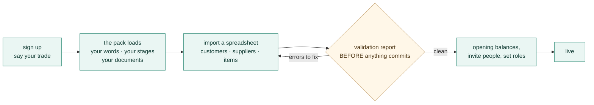
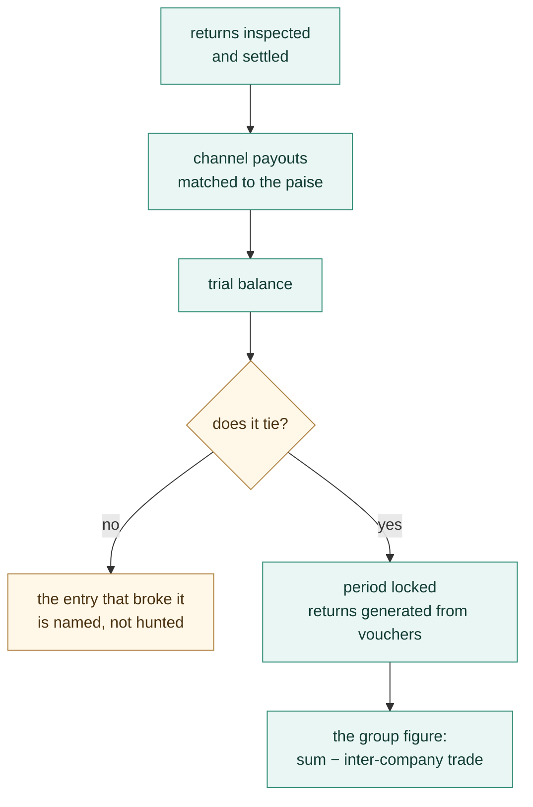

# Medhava — one business, one brain

**One Business Operating System for any trade: 22 modules and 113 apps over one shared data core.**

This file is the whole system in plain text — every module, every app, and what each one reads and
writes. It is generated from `brand/site/modules.js`, the same file the website and every PDF read,
so nothing here can disagree with them. The counts below are not typed in; they are counted from that
file each time this page is built.

| | |
|---|---|
| **Modules** | 22, in dependency order — a module comes only after everything it draws on |
| **Apps** | 113 |
| **Companies** | As many as you have. A company is a row, not a setting — the shipped plan caps a subscription at 20 and the software itself has no ceiling |
| **Shared data core** | Company · Item/SKU · Party · Stock · Ledger/Voucher · Order |
| **Key difference** | Not a suite of integrated apps. One application over one database, so there is no sync step and no second copy of any master record |
| **Compliance** | Double-entry books with CGST/SGST/IGST, TDS, TCS, input credit on **accepted** goods, GSTR-1 and GSTR-3B, filed per registration |
| **Channels** | Any storefront, marketplace, counter, wholesale desk or export buyer — read from your own data, never from a list inside the code |
| **Security** | Row-level isolation per company; outside services connect with scoped, revocable keys — **never account passwords** |
| **Deployment** | Hosted, or single-file apps that run by double-clicking with no install and no internet |

---

## The one idea

Every module reads and writes the **same six records**. That is the physical reason a single goods
receipt can touch stock, the books, quality and sourcing in the same instant.

```
                  ┌───────────────────────────────────────┐
                  │          UNIFIED DATA CORE            │
                  │  Company · Item/SKU · Party ·         │
                  │  Stock · Ledger/Voucher · Order       │
                  └───────────────────────────────────────┘
                                   ▲ ▼
       every one of the 113 apps reads and writes these, and only these
```

**One stock number, not one per channel.** The last unit sold at the counter disappears from every
marketplace you sell on in the same instant — not three hours later as a cancellation, because
cancellations are what a seller rating is lost to.

**Accepted — not ordered — is what counts.** You order 100 units. 100 arrive. Quality accepts 96.
Most systems increase stock by 100 and claim tax credit on 100. This one increases stock by **96**,
claims input credit on **96**, raises a debit note for the 4 rejected, and lowers that supplier's
accept rate — automatically.

**Nothing derived is ever stored.** Outstanding, ageing, risk, promise dates, cost per piece and
profit per design are recomputed on read. A stored total is a number that can drift away from the
documents underneath it; a computed one cannot.

---

## How one order moves through it

The test of whether this is one system or 113 programs sharing a login: take a single order and
follow it. The words below are a product business's; a clinic, a law practice and a freight desk run
the same eight modules with their own words on them.

```
  sold on a marketplace
          │
          ▼
  ┌───────────────┐   order lands in one queue, sorted by the time LEFT
  │ 15 OMS        │   on its cut-off — not the time it arrived
  └───────┬───────┘
          ▼
  ┌───────────────┐   stock down by one, on EVERY channel, same instant
  │ 03 Inventory  │
  └───────┬───────┘
          ▼
  ┌───────────────┐   picked from the named bin, in walking order, filmed
  │ 10 Warehouse  │
  └───────┬───────┘
          ▼
  ┌───────────────┐   cheapest and fastest both known before booking;
  │ 11 Logistics  │   COD collected at the door reconciled to the bank
  └───────┬───────┘
          ▼
  ┌───────────────┐   revenue and GST posted through ONE posting engine
  │ 12 Accounting │   — entries balance or they do not post
  └───────┬───────┘
          ▼
  ┌───────────────┐   weeks later the payout is matched to the paise, and
  │ 14 Settlement │   any shortfall is named and claimed before it expires
  └───────┬───────┘
          ▼
  ┌───────────────┐   the person who made it was paid for it, per unit of
  │ 08 + 16 Make  │   work done, whether or not it completed a set
  │    and pay    │
  └───────┬───────┘
          ▼
  ┌───────────────┐   every step a live figure — and every figure clicks
  │ 21 Dashboard  │   down to the record that produced it
  └───────────────┘

     one transaction · eight modules · one database
```

---

## Every industry, as a row of configuration

This is the part that makes "any trade" a fact rather than a claim. A trade is **not** a fork of the
software, a branch, or a bespoke build. It is a file: what this trade calls things, the stages its
work moves through, the extra fields its records need, the documents it issues, which discretionary
rules apply, and the reference data it starts with.

| Rank | Pack | Sector | Its words for customer · order · worker | Pipelines | Documents |
|---|---|---|---|---|---|
| 1 | `manufacturing` | Manufacturing | buyer · sales order · operator | 2 | 4 |
| 2 | `wholesale-distribution` | Distribution | dealer · sales order · salesman | 2 | 5 |
| 3 | `retail-ecommerce` | Retail | shopper · order · associate | 2 | 4 |
| 4 | `professional-services` | Services | client · matter · fee-earner | 1 | 4 |
| 5 | `healthcare-clinic` | Healthcare | patient · appointment · clinician | 2 | 4 |
| 6 | `logistics-3pl` | Logistics | shipper · consignment · driver | 2 | 5 |
| 7 | `hospitality-food` | Hospitality | guest · ticket · crew member | 2 | 5 |
| 8 | `education` | Education | learner · enrolment · faculty member | 2 | 6 |
| 9 | `construction` | Construction | client · contract · site worker | 2 | 6 |
| 10 | `field-service` | Field service | customer · job · technician | 2 | 5 |

The order is not taste. Manufacturing is the largest ERP user base — around a fifth of all users and
roughly a third of market revenue. Professional and financial services is next at 13.86%, and has no
stock at all, which makes it the hardest case for the claim. Distribution is 9.90%. Retail and
e-commerce is the largest warehouse-management segment at about 28%. Healthcare is under 5% of ERP
users today and the fastest-growing of them all at 22.37% a year. Transportation is the most-served
market among third-party logistics providers at 90%, and **order management ranks first** among the
technology services those providers offer.

**What a pack may never do.** A configuration file that can do anything is not configuration, it is
a hole. A pack may not contain executable code at any depth, invent a concept the engine does not
have, add a field to a table that does not exist, declare money as anything but integer paise, switch
off an immutable rule — company scoping, the audit trail, the posting rules, group elimination,
roster privacy — or be applied in part. Each of those refusals is a named test.

**One default worth stating on its own:** a rule a pack never mentions is **on**. The rulebook is the
default and a pack is an exception list, never a permission list. The other way round, every rule
added after a pack was written would silently apply to nobody using it.

**The test that decides whether this is a product.** `core/tests/packs.test.js` invents a
**commercial laundry** — a trade that appears nowhere in this software, in no pack, in no module and
in no rule — hands the engine a JSON string while the tests are running, and requires the whole
system to answer in that trade's words: an order reads as a docket, a work order as a wash load, a
customer as an account. Its pipeline resolves ordered and terminating, its fields land on real
tables, its rule switches resolve against the real rulebook, and it is refused the audit trail
exactly as the shipped packs are. A final assertion fails the build if the engine file ever contains
a single trade word — because an engine that knows one trade's words has an opinion about which
trades are normal.

**And the product screens are drawn from 12 sectors,** not one: Drone & precision manufacturer, Freight forwarder, HVAC service firm, Law practice, Restaurant group, Interior contractor, Homeware brand · D2C, Precision components maker, Multi-doctor clinic, Training institute, Creative agency, Dairy co-operative. The same module is shown with each of
their figures, one under the other, so the argument is made where it can be checked rather than
believed.

---

## How you actually use it — a walkthrough

The sections above say what Medhava is. This one follows a person through it, because "22
modules over one shared data core" is a true sentence that tells you nothing about your Tuesday.

Every screen below is a real render of the software, not an artist's impression — the same markup
and the same stylesheet the product uses. The figures on them are illustrative.

### Day one — from signing up to working, without a consultant



Nothing is blank when you arrive. Pick manufacturing and the system says sales order;
pick professional services and the same screen says matter; pick
the clinic pack and it says appointment. Same columns underneath, every time.

### A day in the life — one order, followed all the way

**An order arrives**  ·  Module 15

It lands in one queue with every other channel's orders, sorted by the time **left** on its cut-off rather than the time it arrived. The order that must leave in forty minutes is above the one that came in first and has all day.


**Stock moves — everywhere at once**  ·  Module 03

One number per SKU. The unit that just sold disappears from every other channel in the same instant, which is the only way to stop the cancellation that costs you a seller rating.


**It gets picked and packed**  ·  Module 10

A pick list in walking order, confirmed against the bin it came from. A short pick stops the pack rather than quietly reducing the order — because an order silently shipped short is a claim you will pay for later.


**It ships, and the money is chased**  ·  Module 11

The courier rate is checked against the packed weight before booking, and cash collected at the door stays a receivable until it is actually remitted to your bank.


**The books post themselves**  ·  Module 12

Revenue and tax go through one posting engine. Entries balance or they do not post — there is no third option, and no month-end scramble to find out which.


**Weeks later, the payout is checked**  ·  Module 14

What the channel said it would pay, against what arrived, line by line. A shortfall is named and claimed before the window to claim it closes.


### The same day, in three trades that have nothing in common

This is the whole argument, and it is easier to see than to read:

**A law practice runs matters**  ·  Module 20

Same record, same columns, same ledger underneath. A matter instead of an order, a fee-earner instead of an operator, hours instead of units.


**A clinic runs appointments**  ·  Module 19

A patient instead of a customer, an appointment instead of an order, a clinician instead of a salesman.


**A restaurant group watches its cash**  ·  Module 13

Four sites, one cash position, fourteen days ahead. No stock module was removed and no code was forked to make any of these three work.


### Month end



Then the next month opens, and nothing about the close depended on anybody remembering to run it.

---

## Every module and every app

Listed in build order.
is described as finished that is not.

### Module 01 · Platform
*The spine every module runs on.*

Not a module you open — the layer underneath all 22. Who can see what, how the system is configured, and a record of everything that ever happened. Foundation first: nothing downstream can be built before identity, roles and the audit trail exist.


**Reads from:** Every module
**Writes to:** Every module

| App | What it does |
|---|---|
| **Identity, Settings & Audit** | Users, roles and permissions, company switching, tax and numbering setup — and an immutable record of everything that ever happened. |
| **Industry Packs** | What your trade calls things, the stages your work moves through, the extra fields your records need, the documents you issue and the reference data you start with — all of it loaded as a row of configuration, never as a separate version of the software. Pick the pack that matches your trade and the whole system changes its words: the same order screen reads as a job, a matter, a consignment or an appointment, with the same columns underneath. A pack may rename what exists, add fields to tables that exist, and switch discretionary rules off; it may never invent a concept, add a field to a table that does not exist, contain any executable code, or switch off the guarantees — company scoping, the audit trail, money never being a float — because a trade may change its vocabulary and may not opt out of the things the books are trusted for. Adding a trade nobody anticipated is therefore a file somebody writes, not a release somebody ships. |
| **Ask & Print** | Ask from your phone, anywhere: a ledger, a bill, today’s packing slips. It comes back as a PDF — or prints on the office printer, with nothing plugged into your phone. |
| **Communications** | WhatsApp commands and broadcasts, email and SMS, and the handful of scheduled jobs that carry a nudge to the right person without anyone remembering to send it. Every capability here has more than one interchangeable provider — none of them is ever the source of a figure the business reports. |
| **WhatsApp Command Console** | The shop floor does not open a laptop. A worker or a staff member sends a short message — in, out, today’s pieces, leave, an advance — and it becomes a real record: attendance with the time and place it was marked, a production report against the design, a request in the approvals queue. The end-of-day prompt asks what is still open and how long it needs, so tomorrow starts from what is actually pending rather than from memory. Marking attendance checks the phone is at the unit within the radius set for it, with a grace window; a person outside it is not refused, they are flagged for the manager, because a system that locks someone out of being paid for being early at the wrong gate has failed at its job. Every override is recorded with who made it. The words a worker types are in the language they speak, and nothing here ever asks for a password, a bank detail or a document number. |
| **Data Privacy & Consent** | What a person’s data may be used for, captured as consent at the point it is given and honoured everywhere downstream — including the right to have it corrected or removed. Retention (how long a record is kept) and deletion (a person’s right to have their own data removed) are two different policies, tracked separately, because a rule that keeps records for the law and a request from a person to be forgotten do not resolve the same way. |
| **Provider Router & Cost Guard** | The rule that no capability depends on one outside service, enforced at the moment it matters instead of merely promised. Every capability has an ordered fallback list ending on an option that needs nothing connected, so a courier API that stops answering at 9pm, or an AI key that hits its quota mid-catalogue, drops to the next option instead of stopping the work. A provider that keeps failing is tripped out of the list entirely and retried once after a cooldown rather than hammered; retries inside one provider wait twice as long each time. And every paid call is counted in paise against a ceiling you set — over the ceiling the paid provider is refused, not warned about, and the work completes on a free one. Because every capability is guaranteed a built-in or by-hand option, a spent budget can stop the spending without ever stopping the business. |
| **Payment Data Scope** | A written statement of exactly which systems ever see a card or bank credential, and which never do — because every card-capable screen in this system hands that moment to a payment provider’s own secured field and never stores or even passes the number through application code. The statement is what an auditor or a partner asks for before they will connect to this system. |

---

### Module 02 · Design & Sampling
*A style exists on paper before it exists as stock.*

A product moves from a first idea to something the business can actually make and sell — specification, sample rounds, costed trials and sign-off — before it is ever entered as a catalog record. Building this first means Inventory & Catalog never has to invent a style it has no real specification for.


**Reads from:** CRM
**Writes to:** Inventory & Catalog · Manufacturing

| App | What it does |
|---|---|
| **PLM & Development** | First idea to something you can actually make: specification, sample rounds, costed trials and sign-off, with every version kept. A product, a machined part, a formulation or a service package all move through stages you set yourself. |
| **Design / IP Register** | What protects a design once it exists — trademark or copyright status, the date it was first shown, and a flag the moment a near-identical listing turns up elsewhere. Every version already kept by PLM & Development gets a filed status here instead of just a date stamp, because a design with no ownership record on file is a design nobody can defend. |

---

### Module 03 · Inventory & Catalog
*One number everyone trusts.*

The most important number in the system: one quantity per SKU, per location, per stage — read and written by every other module. And one product record that every channel lists from.


**Reads from:** Design & Sampling · Every module
**Writes to:** Every module

| App | What it does |
|---|---|
| **Stock** | Live quantity by SKU, location and stage, with reorder alerts, batches, kits and dead-stock. Goods you still own but that sit in a channel’s own warehouse are a location like any other, so consignment and sale-or-return stock is counted, valued and aged with everything else instead of disappearing off the books until it sells. |
| **Catalog / PIM** | One product record — attributes, images, HSN, MRP and the price each channel actually sells at — pushed to every marketplace and to your own storefront, and scored for each channel’s rules before it lists. It also holds the two things everything downstream depends on: the code each channel knows this product by, mapped to yours, and the packed size and weight that decide the courier rate and settle every weight dispute. Every listing’s state on every channel is here too — live, waiting for your approval, blocked, archived — with the quality score that decides whether anyone sees it. |
| **Kit & Combo SKU** | A sellable SKU made of component SKUs — a three-piece set sold as one listing. Selling the kit decrements each component at order time, so stock is right for every piece in the set, not just the set itself. |
| **Master-Data Hygiene** | Duplicate detection and merge across customers, vendors and designs, and a dead-stock register for what has not moved in months. Protects every downstream report from the same record existing twice under two names. |

---

### Module 04 · CRM
*Know every customer completely — and answer them fast.*

One record per customer carrying every lead, order, return, document and conversation, whichever channel it came from. Whoever picks up the next question can already see everything that came before it.


**Reads from:** Every module
**Writes to:** Sales · E-commerce / OMS · Marketing

| App | What it does |
|---|---|
| **CRM & Customer 360** | Lead to won, then the full lifetime: orders, returns, value and what to offer next. |
| **Documents & eSign** | Every agreement, receipt, certificate and scan filed against the record it belongs to — an order, a party, a case, an employee — so it is found by that record instead of by remembering a folder. Send one out for signature and the signed copy files itself back. |
| **Helpdesk & Live Chat** | Questions arriving by chat, email or phone become tickets tied to the order or the account they are about, with the whole history already on the screen. |
| **Forms & Feedback (NPS)** | A short form after delivery, and the score it produces attached to the design or item it is actually about — not just the buyer — so a complaint-prone item surfaces as a pattern instead of a scatter of individual gripes. |

---

### Module 05 · Sales
*Every way you sell, one order book — to the doorstep.*

Retail counter, wholesale, export and your own website all write to the same order and draw on the same stock number. The courier side lives here too, so a sale is not finished when it is billed — it is finished when it is delivered and the COD money is in.


**Reads from:** Inventory & Catalog · CRM · Warehouse · Logistics
**Writes to:** Inventory & Catalog · Accounting & GST · Warehouse · Logistics

| App | What it does |
|---|---|
| **D2C Sales** | Orders from your own storefront — Shopify, WooCommerce or a custom site — cart to dispatch, with loyalty and partial COD. |
| **B2B & Credit** | Wholesale orders with credit limits, tier pricing and outstanding ageing. |
| **Export** | Commercial invoice, packing list, LUT bond and IGST-refund tracking. |
| **POS** | Counter billing that draws on the same stock as your website. |
| **Quotes & Proforma** | Send a quote, convert it to a confirmed order in one click. |
| **Couriers & AWB** | Book the shipment on the order itself, compare couriers, print the label and follow the AWB to the door. |
| **Subscriptions** | A schedule that raises its own invoice on its cycle and follows up on its own when a payment fails — for anything sold as a standing order rather than a one-off. |
| **Customisation & Made-to-Measure** | The order that does not exist in the catalogue: a buyer sends reference pictures and their own measurements, a price is agreed over several messages, and the piece is made for them. All of it is one record — the references, the measurement set, every quote in the negotiation and what was finally agreed, the advance taken to start work and the balance taken before dispatch. When the order is accepted it opens a production order like any other, so a bespoke piece is costed, made, checked and posted exactly as a catalogue piece is. Two legs of money on one order is the part most systems get wrong: the advance is earned when the work starts, the balance is owed until the piece ships, and the ledger shows both separately rather than one payment appearing when the whole thing is over. |

---

### Module 06 · Planning & Requirements (MRP)
*Turn what is selling into what to buy and make.*

Confirmed orders and demand history have to become a plan before Purchase can buy anything or Manufacturing can start anything — otherwise buying and making are both just guessing. This module sits between the two: it reads what is actually selling and what is already committed, and turns that into requirement, not the other way around.


**Reads from:** Sales · E-commerce / OMS · Inventory & Catalog
**Writes to:** Purchase · Manufacturing

| App | What it does |
|---|---|
| **Demand Forecast & Signal** | What sold, by SKU and by period, turned into a short-term forecast — the number every requisition and every production order downstream is measured against instead of a guess. |
| **Requirement Explosion (MRP run)** | Confirmed demand exploded through the bill of materials into what raw material to buy and what to produce, and by when — so a purchase requisition or a production order always traces back to real demand, never to a feeling that stock is getting low. |
| **Open-to-Buy / Budget Ceiling** | A spending ceiling set per period regardless of what the demand signal suggests, so a real signal cannot on its own commit more money than the business has decided to risk this season. Every requisition the MRP run drafts is checked against what is left of the ceiling before it goes to Purchase. |

---

### Module 07 · Purchase
*Nothing over-billed gets paid.*

The buy side end to end — and the control that stops you paying for goods you rejected.


**Reads from:** Inventory & Catalog · Planning & Requirements (MRP) · Manufacturing
**Writes to:** Inventory & Catalog · Accounting & GST · Quality & Compliance

| App | What it does |
|---|---|
| **Procurement** | RFQ to purchase order to goods receipt, with a strict three-way match before any bill is paid. |
| **Vendor Management** | Vendor 360, payables, ageing, a real risk score, and sourcing that follows performance. |
| **Insurance Register** | What cover exists over stock in transit, stock in the warehouse and product liability, matched against what is actually moving through Purchase and Warehouse right now — so real value in transit is never quietly running with no cover tracked anywhere. |

---

### Module 08 · Manufacturing
*Know what a unit really costs to make.*

From material in the door to the finished unit — including what every worker earned and what each product actually cost. You define the stages, the rates and the rules; nothing here is fixed to one trade. Design and sample sign-off happen upstream now, and quality inspection and the compliance record live in their own module downstream — this module is purely the making.


**Reads from:** Purchase · Planning & Requirements (MRP) · Design & Sampling
**Writes to:** Inventory & Catalog · HR & Payroll · Accounting & GST · Quality & Compliance

| App | What it does |
|---|---|
| **Production Orders** | Your own stages from first operation to finished goods, with work-in-progress visible at each one. |
| **Piece-rate & Contractors** | Output-based pay for anyone paid by the piece rather than the hour — pooled completion, per-unit rates, rework and advances resolved into a single payout. |
| **BOM & Consumption** | What each product consumes, costed at today’s material rates. |
| **Maintenance** | Machines, tools and assets: what is due for service, when it was last done, what it cost, and what stopped while it was down. Planned and breakdown work against the same asset record. |

---

### Module 09 · Quality & Compliance
*Certify what was received and what was made.*

Quality inspection used to live buried as one step inside Manufacturing; it stands on its own here because a rejection at goods-receipt and a rejection on the production floor are the same discipline, and because the certificates a business holds — the proof it follows a standard — belong next to the inspections that back them up, not scattered across email.


**Reads from:** Purchase · Manufacturing
**Writes to:** Purchase · Manufacturing · Inventory & Catalog

| App | What it does |
|---|---|
| **Quality Control** | Accept, reject or rework — on goods received and on goods made — with reasons that feed the supplier scorecard and the performance flags alike. |
| **Certificate & Compliance Register** | Every standard the business or a vendor holds — a safety, labour or environmental certification — with its issue date, its expiry, and the audit that backs it, so a certificate about to lapse is visible before a buyer asks for it and finds it already expired. What this register tracks is what a sustainability report downstream is actually built from. |

---

### Module 10 · Warehouse
*Pick right the first time — and prove what you sent.*

Bin-level instructions and barcode scanning, so the right item leaves the building and stock stays honest — and a recording of each parcel being packed, so an argument about what was in it is settled by footage instead of by memory.


**Reads from:** Sales · E-commerce / OMS · Inventory & Catalog
**Writes to:** Inventory & Catalog · Sales · E-commerce / OMS

| App | What it does |
|---|---|
| **Picking & Bins** | Pick lists that tell staff exactly which bin to walk to, in walking order. |
| **Barcode Operations** | Scan to pick, pack, dispatch and run a physical stock count from a phone — the same scan whether the order came from a marketplace, your Shopify site or the counter. |
| **Packing Video** | Every parcel recorded as it is packed and indexed by its order number, so a wrong-item claim is answered with the clip. The footage attaches itself to the claim that needs it. |

---

### Module 11 · Logistics
*The courier network itself — rates, failures and the COD money.*

Booking one parcel happens on the order, in Sales. This module is the network behind it: what every courier charges before you pick one, what happens to a delivery that fails, and whether the cash collected at the door actually reached your bank.


**Reads from:** Sales · E-commerce / OMS · Warehouse
**Writes to:** Accounting & GST · Sales · E-commerce / OMS

| App | What it does |
|---|---|
| **Rates & Zones** | Every courier’s rate card by zone, weight slab and service — so the cheapest and the fastest option for this parcel are both known before it is booked. |
| **NDR & RTO Rescue** | A failed delivery worked while it can still be saved — reattempt, call, correct the address — before it becomes a return you pay for twice. |
| **COD Remittance** | What the courier collected at the door against what reached your bank, parcel by parcel, with every shortfall named and aged. |
| **Handover & Manifest** | What is expected out today against what the courier actually took, counted per courier and per service. The manifest to hand over, the one-time code to confirm it, and a signed record of the parcels that were left behind — so a parcel lost between your table and their van has an owner. |
| **Fleet** | Your own delivery vehicles, if you run any — what each trip cost, what is due for service, and what that adds to freight. Optional; most businesses run couriers only. |

---

### Module 12 · Accounting & GST
*Books that always balance.*

A full double-entry ledger built for Indian compliance — not a tax report bolted onto a spreadsheet. Medhava keeps the books on its own: no other accounting package is required, ever.


**Reads from:** Every module
**Writes to:** Finance Reports · Treasury & Financial Planning

| App | What it does |
|---|---|
| **Accounting** | Double-entry books where every voucher balances and the trial balance always ties. |
| **Invoicing** | GST tax invoices and receipts, totals computed from the lines to the paise. Where a channel raises its own invoice, both numbers live on the order — theirs and yours — so the panel’s paperwork and your books point at the same sale and neither has to be re-keyed to find the other. |
| **Expenses** | Spend captured by category with approvals, and bill OCR to save typing. |
| **GST & Tax** | CGST, SGST, IGST, TDS, TCS, input credit, GSTR-1 and GSTR-3B — filed per registration, so a group where one company is registered and another is not files exactly what each one owes and nothing it does not. |
| **ITC Reconciliation** | Every input credit matched against the government’s own GSTR-2A/2B before a return is filed, so a credit claimed is a credit that is actually on record. |
| **Receivables, Payables & PDC** | Payments and receipts allocated against named open invoices, and a register for post-dated cheques that posts only on the date they are realised, not the date they were written. |
| **Fixed Assets & Depreciation** | The asset register with both Straight-Line and Written-Down-Value depreciation tracked side by side, and disposal posting its gain or loss straight to the books. |
| **Year-End Close & Period Lock** | Profit-and-loss accounts reset and balance-sheet accounts carry forward at year end, and a reviewed period locks against backdated edits until an admin unlocks it — an act that is itself logged. |
| **Finance Reports** | P&L, balance sheet, and profit by channel, product and SKU. |

---

### Module 13 · Treasury & Financial Planning
*Know what cash is coming, not just what already arrived.*

Accounting records what happened; this module is concerned with what happens next — how much cash is actually expected, when, and whether spend against a budget is on track before the month closes and turns the answer into history.


**Reads from:** Accounting & GST · Sales · Purchase
**Writes to:** Accounting & GST

| App | What it does |
|---|---|
| **Cash Flow Forecast** | Expected receipts and expected payments laid out by week, drawn from open invoices and open bills rather than typed in by hand — so a cash shortfall is visible weeks before the date it would actually bite. |
| **Banking & Reconciliation** | Bank statement lines matched against the ledger’s own record of what should have moved, with anything unmatched surfaced instead of silently carried forward. |
| **Budget vs Actual** | A budget set per category and period, and actual spend from Accounting tracked against it as the period runs — not only after it closes, when the only thing left to do is explain the variance. |

---

### Module 14 · Settlement
*Get paid what you are owed — cycle by cycle.*

Matching one payout to one order line happens in OMS. This module is the level above it: the settlement cycles each panel runs, the fees it actually charged against the fees it published, and the tax it deducted on your behalf.


**Reads from:** E-commerce / OMS · Accounting & GST
**Writes to:** Accounting & GST

| App | What it does |
|---|---|
| **Payout Cycles** | Every settlement cycle each panel runs — what it should pay, what actually landed in the bank, and on which day — so a late payout is visible the day it is late, not at month end. |
| **Fee & Commission Audit** | The rate card a channel publishes against the rate it actually charged, category by category and SKU by SKU. A silent commission increase is caught the first time it is applied — and the tier you are rated in is on the same screen, because the tier is what the rate card hangs off, and losing one quietly costs more than any single deduction. |
| **TCS & TDS Register** | Every rupee the panels deducted as TCS and TDS, matched against the portal’s own figures — so the credit you claim is the credit you are actually owed. |

---

### Module 15 · E-commerce / OMS
*Every marketplace and your own website, one queue.*

Stop logging into seven seller panels and your own store admin. Every order — Amazon, Flipkart, Meesho, Ajio, Nykaa, JioMart, Myntra, and your Shopify, WooCommerce, Magento or custom site — lands in one pipeline, and one stock number goes back out to all of them. Then the money side closes in the same module: what each channel paid, what it kept, what came back, and what you are still owed.


**Reads from:** Inventory & Catalog · CRM · Sales · Accounting & GST · Logistics · Settlement
**Writes to:** Inventory & Catalog · Accounting & GST · Warehouse · Logistics · Settlement

| App | What it does |
|---|---|
| **Marketplace OMS** | Every marketplace and every storefront in one order queue — Amazon, Flipkart, Myntra, Meesho, Ajio, Nykaa and JioMart alongside Shopify, WooCommerce, Magento, Wix and your own custom site. The stages each channel really uses — to accept, to pack, ready to dispatch, handed over, in transit — with the right cut-off counting down on every order, because a quick-commerce or air-shipped order is not due at the same hour as a standard one. Priority orders first, the day grouped by product so one item is picked once instead of once per parcel. |
| **Order Management** | One pipeline from new to delivered, whether the order came from a seller panel, your Shopify or WooCommerce site, a dealer or the counter. |
| **Manual Data Check** | Upload the sheets you already download — marketplace orders and returns, and your own counter-shop registers, one file or a whole ZIP — and read ten cross-checks back: money, month, item, state, returns, claims, ads, payouts and GST. Every figure is clickable down to the transactions behind it, and the whole result downloads as Excel. |
| **Reconciliation** | Match every marketplace payout to the order line that earned it, and expose the gap. |
| **Claims & Disputes** | Turn shortfalls, weight disputes and lost parcels into filed claims with evidence — and answer them before the clock runs out. A claim that is awaiting your response is worth money; one closed for no response is worth nothing, so the days remaining sit on the screen next to the amount. |
| **Returns / RMA** | Customer, courier and wrong returns — and the dead stock they actually cost you. |
| **Channels & Storefronts** | Connect a channel once and it stays in step: catalogue out, price out, stock out, orders in. Seven marketplaces and any website platform — Shopify, WooCommerce, Magento, BigCommerce, Wix or a custom site over its own API — each switchable without touching your data. Shopsy and any other storefront a channel runs alongside its main one counts as its own channel here. Where a channel has no open interface, its own downloaded report is a first-class way in. A channel may also know you by a different trading name — that is a label on the channel, not a second company, so it tags the order and the payout without ever splitting your books. |
| **Labels & Documents** | The channel gives you a PDF; this turns it into something a packer can work from. Cropped to your label size, your own product code printed large where the channel left it off, the invoice and the packing slip merged behind it, and the whole batch sent to the label printer in one job. Reprint a single parcel without redoing the batch — and nothing is ever uploaded to an outside website to be cropped. |
| **Listing & Catalog Manager** | Bulk-create and bulk-edit listings across every channel from the one product record in Inventory & Catalog, and catch the mismatches that quietly cost sales: listed but out of stock, or in stock but never listed. |
| **Size / Fit Recommendation AI** | A fit suggestion at the point of purchase, built from the item’s own measurements and the return history of buyers who picked each size — aimed straight at the return reason that costs the most: the right item in the wrong size. |
| **AR / Virtual Try-On** | A way to see drape, fit and colour on a screen before buying, for items where a flat photo alone leaves too much to guess. |

---

### Module 16 · HR & Payroll
*Pay people right, on time.*

Salaries and output-based earnings in one register, with attendance driving both — whether people are on a monthly wage, an hourly rate or paid by what they finish.


**Reads from:** Manufacturing
**Writes to:** Accounting & GST

| App | What it does |
|---|---|
| **Staff & Contractors** | Attendance, effective-dated salary and output-based earnings in a single register, whoever is on it. |
| **Time-off & Advances** | Leave, festival advances, and exactly how they change this month’s payout. |
| **Appraisal & Hiring** | Performance reviews and a hiring pipeline that ends in an employee record. |
| **Recruitment** | The pipeline before someone becomes an employee — an opening, the people who applied for it, a trial piece where the work itself is the interview, and the decision with its reason kept. It matters more in a skilled trade than in most: a person is taken on for skill at one particular kind of work, and the trial output is the evidence, so it is recorded against that work and the rate that would apply rather than remembered as an impression. A candidate who is not taken on now stays findable when the same skill is needed in a busy month, and their personal documents are held under the same consent and retention rules as anyone else’s, not in a folder on somebody’s phone. |
| **Payout Execution** | Where the calculation in the earnings register actually turns into money leaving the business — bank batch, UPI, cash against a signed receipt — with the method and the reference recorded against every payout, so the register’s total and the money that actually moved can always be checked against each other. |

---

### Module 17 · Marketing
*Sell more without discounting.*

Plan content, run campaigns, and let rules keep your prices competitive while protecting margin.


**Reads from:** Inventory & Catalog · CRM
**Writes to:** Sales · E-commerce / OMS

| App | What it does |
|---|---|
| **Social Calendar** | Plan and publish across every channel from one calendar. |
| **Campaigns** | Email, SMS and WhatsApp campaigns measured on real revenue, not opens. |
| **Repricing Engine** | Rules per channel and SKU — floor, ceiling, match-lowest, festival overrides — and what each change actually did. A price that went up and took the orders down with it shows as exactly that, next to the rule that raised it, so the rule can be reversed on evidence rather than on a feeling. |
| **Automation** | If this happens, do that — across any module, without writing code. |
| **Blog & Pages** | Articles, landing pages and category copy written, scheduled and published straight to your own site — Shopify, WooCommerce, Magento or a custom CMS — with the meta title, description and internal links set before it goes out. |
| **Events** | Trade shows and exhibitions worked as a channel of their own — booth, budget and every lead captured on the floor landing straight in CRM instead of on a stack of business cards. |
| **Website & Page Builder** | The storefront itself, built by dragging sections into place rather than by editing a theme file — hero, product grid, size guide, lookbook, contact form — each block reading live from the catalogue, so a price or a stock state on a landing page is the same number the order screen uses instead of a figure someone pasted in and forgot. Blog & Pages above writes articles into a site that already exists; this is for the businesses that do not have one, and it is the gap that shows up plainly when this module list is set beside a mature open-source ERP: they ship a full site builder next to the blog, and until now this did not. |
| **Markdown / Clearance Optimization** | The same rule engine that reprices for competitiveness, aimed at ageing stock instead: when to start discounting it and by how much, before it becomes a warehouse write-off rather than a sale at a lower margin. |

---

### Module 18 · AI Content Engine
*Write it, shoot it, cut it — from the catalogue you already have.*

Listings, ads, email, product photography and reels, all generated from your own catalogue — so the words match the product and the picture is the right size for the channel it is going to. Words, images and video sit in one module because they are one job.


**Reads from:** Inventory & Catalog
**Writes to:** Marketing · E-commerce / OMS

| App | What it does |
|---|---|
| **Content Engine** | Fourteen stages in your own voice, from buyer research and competitor reading through hooks, channel-ready listings, ads, social posts, video scripts, song lyrics, the publishing calendar and alt text — each written from your own catalogue, so the words match the thing. |
| **Image Studio** | Layers, free transform, background removal, channel presets and SEO alt text — a phone photo becomes a channel-compliant product image. |
| **Video Studio** | Text and image to video, reels and ad cuts sized for every channel. |
| **Design Studio** | A full design surface — templates, layers, undo and redo, any colour, exact sizing, background images and stock elements — exporting PNG, JPG or PDF at whatever size the channel or the printer asks for. |
| **Motion Renderer** | A reel rendered from a page of HTML and CSS — the same layers, fonts and brand colours the Design Studio already uses — into a real MP4, on this machine, with nothing uploaded. It is not a screen recording: the clock is faked, the animation is seeked to the exact instant of each frame, and only then is that frame captured, so the render does not care whether the machine was busy. Rendering the same festival banner twice produces the same file to the byte, which is what makes a reel something you can check and re-cut rather than something you have to watch all the way through and hope about. |
| **Narration Studio** | A voice over the reel, in the language the buyer actually speaks — the same script the Content Engine wrote, spoken. The default needs nothing installed and no key, because every modern browser can already speak; a self-hosted or cloud voice sits behind it as an interchangeable provider for anyone who wants a cloned or branded one. Long scripts are split at sentence boundaries and rejoined, so a two-minute description is not cut off at whatever limit a service imposes. A voice cloned from a real person is only ever used with that person’s recorded consent, filed against them in Data Privacy & Consent like any other permission. |
| **Image Generation Slot** | Generated imagery — a model on a background you do not have to shoot, a festival backdrop, a lifestyle scene — as a capability with interchangeable providers rather than a bet on one service: a queue of jobs, a preview while it works, inpainting to fix one region, upscaling and face correction. This one needs a graphics card. Image models cannot run on an ordinary office machine or on the container this system is built in, so what ships is the queue, the review screen and the provider slot, with the generating itself done by whichever engine you point it at — your own GPU box, or a cloud service, swapped without touching anything else. Said plainly here because the alternative is a screen that looks finished and produces nothing. |
| **Publisher** | One push sends the finished listing, picture and copy everywhere it has to appear — your storefront, each marketplace, each social account — and reports back what actually went live and what was rejected, with the reason. |

---

### Module 19 · SEO, AEO & AIO
*Be found by a search box, an answer box and an AI.*

Content already exists once this module is reached; here it is made findable — by a traditional search engine, by the answer box above the results, and by the AI assistants now answering shopping questions directly instead of sending someone to a results page.


**Reads from:** Inventory & Catalog · AI Content Engine
**Writes to:** Marketing

| App | What it does |
|---|---|
| **Technical SEO & Schema** | Structured data, sitemaps and page-level technical checks against your own storefront and content pages, so a search engine can read what a page is actually about instead of guessing from the text alone. |
| **Answer-Engine Optimization** | Content shaped to be quoted directly by an answer box or a voice assistant — a clear, citable answer near the top of the page — rather than written only for a person to scroll through. |
| **AI-Engine Visibility Tracking** | Whether and how this business is actually cited when someone asks an AI assistant a shopping question in this category, tracked over time — the same discipline as rank tracking, aimed at a newer kind of result page. |

---

### Module 20 · Projects & Collaboration
*The work that is not an order — and the talking around it.*

Not every business runs on orders. A law firm runs on cases, an agency on engagements, a workshop on jobs, a builder on sites. This module holds that work on the same records as everything else, so the time, the cost, the documents and the decisions attached to it end up in the books rather than in somebody’s inbox.


**Reads from:** CRM · Sales · HR & Payroll · Inventory & Catalog
**Writes to:** Accounting & GST · HR & Payroll · CRM

| App | What it does |
|---|---|
| **Projects & Cases** | A project, a case file, an engagement or a job — whatever your work is called. Stages you define, owners, deadlines, documents, billable time and real cost, all on one record the ledger can see. |
| **Timesheets & Planning** | Who is on what this week, and the hours that actually went in — against a project, a case, a job or a machine. Billable and non-billable separated, so a rate card turns straight into an invoice and a real cost. |
| **Approvals** | One queue for everything waiting on a yes — a purchase order, a discount, a leave day, a credit note, a payment. The rule that sent it there is on the screen next to it, and the decision goes to the audit record. |
| **Forum** | Questions and answers that outlive a chat — for customers, dealers or staff — with the useful ones kept where the next person will actually find them. |
| **Automation Studio** | The place a person builds “when this happens, do that” by dragging it out and watching it run — a trigger, the steps after it, a branch where the answer decides which way to go — over the same event stream every module already writes to. Marketing’s Automation aims that idea at campaigns; this is the general one, reaching any module: a payment marked short holds the next dispatch and opens a claim, a worker’s pooled output crossing a threshold raises the payout for approval, a return marked damaged writes off the piece and messages the buyer. Every run is kept — what fired it, each step, what each step returned — because an automation nobody can inspect afterwards is a rule the business cannot trust with its money. |
| **Discuss** | Conversation attached to the record it is about: this order, this bill, this case. A year later the reason for a decision is still sitting next to the decision. |
| **Knowledge Base** | A searchable internal wiki of standard operating procedures, scoped to the role it applies to, so how a task is meant to be done is written down once instead of carried in one person’s head. |

---

### Module 21 · Dashboard & BI
*See the whole business without asking anyone.*

Every number in Medhava rolls up here as work happens — no exports, no waiting for month-end, no asking three people for their sheet. It is the last module built for a reason: it has nothing to show until the other twenty are producing real records for it to read.


**Reads from:** Every module
**Writes to:** —

| App | What it does |
|---|---|
| **CEO Dashboard** | Cash, sales, stock, profit and alerts on one screen, refreshed as work happens. |
| **Report Builder** | Drag the fields you want into a report and save it for the whole team. |
| **Group Consolidation** | Several companies, one set of figures — sales, cash, stock and profit rolled up across every company you run, inter-company entries removed, with years of history to compare against. Add a company whenever the business grows one; nothing in the software caps the number, only the plan does. And a company with no tax registration of its own — a job-work arm, a new venture not yet registered — is a company like any other here, kept in the group figures without being dragged into a return it does not belong in. |
| **Excel Dashboard Builder** | A full workbook — financial summary, HR, purchase, sales, inventory and production, GST, expenses — generated from the live records behind every other screen, with each company shown as its own row and a consolidated row that is a formula over them, never a separately typed total. |
| **ESG / Sustainability Reporting** | Water usage, chemical compliance, waste and packaging, reported from the same certificate and audit records Quality & Compliance already keeps — so a sustainability report is a query over evidence already on file, not a separate exercise assembled once a year from scratch. |

---

### Module 22 · AI Assistant, Agents & Automation
*Ask the business a question — and let the routine work run itself.*

Last for the same reason Dashboard & BI is late: something that answers questions about the whole business can only be built once the whole business is in one place. Three different things live here and the difference between them matters. An ASSISTANT answers a question you asked, from the records, with the records attached. A CHATBOT holds the same conversation with your customer instead of you. An AGENT is given a job rather than a question and works out the steps itself. That last one is what separates this module from Automation Studio in Module 20, where a person draws the steps in advance and the rule runs the same way every time; and from Automation in Module 17, which fires marketing campaigns and nothing else. Both of those stay exactly as they are — this module sits above them and calls them, rather than replacing either. Module 18 writes content; this module answers and acts.


**Reads from:** Every module
**Writes to:** Projects & Collaboration · CRM · Marketing

| App | What it does |
|---|---|
| **AI Assistant** | Ask in your own words — “what did Myntra actually pay us last week, and what is still short?” — and get the answer with the rows it came from sitting underneath it, each one clicking through to the record. It reads the ledger, the stock table and the settlement lines the same way a report does, so the figure it gives is the figure the books give. When it cannot find the answer it says so and shows what it looked at; it never estimates a number and presents it as a fact, because a plausible wrong figure is far more expensive than an honest blank. It answers only from records the person asking is already allowed to open, so it can never become a way around permissions. |
| **AI Chatbot** | The same engine turned to face the customer, on your own storefront and on WhatsApp: where is my order, will this size fit me, I want to return this. It reads the real order and the real size chart rather than a script written six months ago, and it will say “let me get someone” instead of guessing at anything about money, a refund or a complaint. The handover goes into the Module 04 Helpdesk queue with the whole conversation already attached, so the person picking it up starts where the customer left off instead of asking them to explain again. It never asks a customer for a card number, a bank detail or a password — that promise does not get a chatbot-shaped exception. |
| **AI Agents** | A job rather than a question: “chase every unreconciled settlement line from last week and draft the claim for each.” The agent works out the steps, does them, and stops at the point where a person has to decide. It runs inside a scope you set — which records it may read, which it may write, and how much it may spend through the Module 01 Provider Router — and it cannot quietly widen that scope mid-run. Anything that moves money, files a claim, changes a price or sends a customer a message waits for a human yes. |
| **Agent Guardrails & Run Log** | What each agent is allowed to touch, written down as a scope rather than trusted to a prompt, and every run recorded step by step: what started it, what it read, what it proposed, what a person approved, what it actually changed. Kept in the same audit trail as everything else, with the same absence of an off switch. An agent whose working nobody can inspect afterwards is not a colleague, it is an unexplained entry in the books. |
| **Knowledge & Retrieval** | The index that makes the answers grounded: your own designs, rate cards, settlement files, standard procedures and past decisions, searchable so a reply quotes what is actually on file instead of what a model remembers about the trade in general. Permission-scoped at the row, so two people asking the same question get answers drawn only from what each of them may already see. |

---

## Companies and channels — how many is up to you

Whatever number you have, it is not a setting this system was built around, and it is not a ceiling.
A company is a **row**. A channel is a **row**. Every business record carries the company it belongs
to, and every sale carries the channel it came through. Ten companies selling on ten channels each is
the same three tables and the same code as one company selling on one.

```
   COMPANIES (a row each)          CHANNELS (a row each, per company)
   ┌──────────────┐                ┌───────────────────────────────────────┐
   │ Company 1    │───────────────▶│ Own storefront · marketplace ·        │
   │ Company 2    │───────────────▶│ counter · wholesale desk ·            │
   │ Company 3    │───────────────▶│ export buyer · …                      │
   │ …the eighth  │───────────────▶│ …the eleventh                         │
   └──────────────┘                └───────────────────────────────────────┘
          │                                          │
          └──────────────┬───────────────────────────┘
                         ▼
              ONE stock number per SKU
        the channel is on the sale, never on the stock
```

**Three things this buys you, and one it deliberately refuses.**

**Each company's books are its own.** Its trial balance balances on its own. No report can reach
across into another company's rows — not by convention, but because a journal line can only point at
an account that belongs to the same company, and a test checks that no line anywhere ever does.

**The group is the sum minus what you sold yourselves.** When one company in a group sells to
another, that is revenue in one set of books and cost in another. Adding the companies up would
report a group turnover the group never earned from the outside world. Every entry that names a
sister company is eliminated at group level, and the consolidation returns all three numbers —
gross, eliminated, group — so you can see the elimination rather than take it on trust.

**The channel is a dimension of the sale, never of the stock.** You can read this month by channel,
by company, or by both. What you cannot do is keep a separate stock number per channel, and that is
on purpose: the last unit sold on one marketplace has to vanish from the others at that instant,
which per-channel inventory cannot do.

**And the reporting follows your own sheets.** The report's columns come from the sheets that are
actually in the workbook you give it. A fourth company is a new sheet, not a new version of the
software.

> **This is checked, not claimed.** `core/tests/core.test.js` builds ten companies with ten
> channels each — a hundred channels — posts an order down every one plus ten inter-company sales,
> and asserts every company's books balance, that no journal line points at another company's
> account, and that the group figure is the plain sum **minus** inter-company trade: ₹2,10,500
> gross, ₹50,000 eliminated, ₹1,60,500 group. It then calls the same builder for eleven companies
> and eleven channels with no code changed.

---

## The rules that hold everywhere

1. **No app depends on any single outside company.** Every capability — books, marketplaces, AI
   writing, couriers, payments, messaging, storage, GST, printing, barcode — has several
   interchangeable providers and a by-hand option, so the system works with nothing connected at all.
   **A provider named as the source of a figure is a bug**; providers move messages and money, the
   ledger originates numbers.
2. **The books are this system's own.** No other accounting package is required, ever. Tally, BUSY
   and Zoho remain available for anyone already running one — nothing assumes them, and no figure is
   ever sourced from one.
3. **Nothing ever asks for an account password.** Outside services connect with a scoped, revocable
   key. *This system will never ask you for a marketplace, bank or account password. If any screen
   ever does, it is not this system.*
4. **Money is integer paise, never a floating-point number**, because float arithmetic accumulates
   the error that eventually shows up as a trial balance that will not tie.
5. **Values that change over time are effective-dated** — a salary, a price, a tax rate, a
   commission. March payroll resolves the salary in force *in March*. A missing value is an error,
   never silently treated as zero.
6. **Nothing is deleted, only deactivated.** A person who leaves keeps their name attached to years
   of earnings, approvals and audit rows that must still resolve.
7. **The audit trail has no off switch.** Eight years, before-and-after values, as the MCA rule
   requires — because an audit trail that can be switched off is one that gets silenced exactly when
   it matters.
8. **Gates, not warnings.** Each app refuses one thing outright, because a warning gets clicked
   through on a busy afternoon. A cash-on-delivery order cannot be packed below its advance. A bill
   for more than was accepted cannot be paid. Every gate is also a self-test.
9. **It is not trained. It is built.** No model learns from your data. Every rule is written down,
   visible on the Wiring screen, and checked by a self-test — so it is right on day one.
10. **You can reach it from anywhere, but it cannot be reached into.** Ask & Print takes a plain line
    from your phone and sends a PDF back. The office reaches out; the internet never reaches in.

---

## How it is verified

Nothing ships because it looked right on a screen.

1. **The arithmetic, with no screen involved.** Each engine runs in isolation and its self-tests
   execute against seeded data.
2. **Every screen and every control, in a real browser.** Each build opens in headless Chromium;
   every screen is visited and every interactive control on it is clicked. Any console error fails
   the build.
3. **The real job, with the result asserted.** Not "does the button click" but "did the thing
   happen". A control that looks alive but changes nothing fails the build.
4. **Against a business's own figures.** Where a business already knows the answer, the software has
   to reproduce it — and where it cannot, the reason is named rather than the number quietly
   adjusted. In the worked implementation carried furthest, every record in the owner's hand-made
   reference report is placed into a bucket with a named cause — matched exactly, changed at source,
   rate added since, a rule that applies, or present only in a source file that has since been
   restructured and can no longer be read — and the check fails on any record whose difference has
   no explanation. A mismatch is a bug, not a rounding difference; an unreadable input is a stated
   limitation, not a passing test.
5. **A structural audit.** Every "comes from" on every Wiring screen must name a module that actually
   exists, no vendor name may ever be the source of a figure, and the app count in every file must
   match this one.
6. **The shipped copy, not the working copy.** The packaged archive is extracted and re-tested in the
   folder a customer would open it in, because a packaging step that quietly renames a file breaks
   nothing until it is in somebody's Downloads folder.

---

## The honesty charter

This is the standard the build is held to, and it is written down because a standard nobody wrote
down is a standard nobody can be held to.

1. **This page describes a design.** Everything on it is what the system is being built to be, and
   nothing on it claims to already exist. When a part of it is finished, it will say so with the test
   that proves it — never before.
2. **Counts are counted, never claimed.** Every module and app figure on this page is read from the
   canonical module list when the page is built. No number here was typed by hand.
3. **Progress is reported as it is.** If tests fail, the failure is shown with its output. If a step
   was skipped, it is named as skipped. "Done" means implemented, tested and checked against the
   original request — not "the code has been written".
4. **Every capability names its alternatives.** No part of this system depends on a single outside
   company. Each layer names what it is built on, at least two replacements, and the interface the
   rest of the code talks to — so changing a supplier is a setting, not a rebuild.
5. **Uncertainty is surfaced, not smoothed over.** Where something cannot be verified, it is reported
   as unverified rather than presented as fact.

---

## Every technical word on this page, in plain language

**This page uses ordinary words wherever ordinary words will do.** Where it could not, the term is
here — with an everyday comparison, because a sales page that assumes you already know the jargon is
selling to somebody else.

Only the words this page actually uses are listed. Padding it with definitions of terms that never
appear would improve a count and make the page worse.

### platform

One piece of software that many separate businesses use at the same time, each seeing only its own information.

*Ek badi building jisme bahut saare offices hain. Building ek hai, par har office ki chaabi alag — koi kisi aur ke office mein nahin ghus sakta.*

### module

One area of work in the system — sales, purchase, staff, accounts. Each is a set of screens that belong together.

*Dukaan ke alag-alag counters. Ek counter bikri ka, ek kharidi ka, ek hisaab-kitaab ka.*

### industry pack

A settings file that teaches the system your trade — what you call things, the stages your work moves through, the documents you issue.

*Ek hi machine, alag-alag saancha. Saancha badal do, wahi machine doosri cheez banane lagti hai.*

### database

Where all the information is kept, arranged so any of it can be found instantly and nothing gets lost.

*Ek badi almari jisme har cheez apne fix khaane mein rakhi hai — dhoondhne ke liye poori almari palatni nahin padti.*

### table

One kind of information inside the database — all your customers in one, all your orders in another.

*Almari ka ek khaana. Ek khaane mein sirf customers, doosre mein sirf orders.*

### row

One single record — one customer, one order, one payment.

*Register mein ek line. Ek line matlab ek entry.*

### schema

The written plan of what information the system keeps and how the pieces connect.

*Makaan ka naksha. Deewar uthane se pehle kaagaz pe tay hota hai kaunsa kamra kahaan hai.*

### threshold

A number that decides when something counts. Below it nothing happens; at or above it, the system acts or tells somebody.

*Ek hadd. Us se neeche kuch nahin hota, us se upar system kuch karta hai ya kisi ko batata hai.*

### integer paise

Money stored as a whole number of paise instead of a decimal, so amounts are exact and rounding can never quietly lose a rupee.

*Paisa hamesha poore paise mein ginte hain, aadha-adhoora kabhi nahin — isliye hisaab kabhi ek rupya idhar-udhar nahin hota.*

### audit trail

An automatic record of every change — what changed, who changed it, and when.

*Har entry ke saath naam aur time apne aap likha jaata hai. Baad mein koi bole "maine nahin kiya", toh register bata deta hai.*

### API

The agreed way two pieces of software talk to each other, so one can ask the other for something and get a predictable answer.

*Waiter. Aap kitchen mein nahin jaate — waiter ko order dete ho, wahi khaana le aata hai. Waiter badal jaaye toh bhi order dene ka tarika wahi rehta hai.*

### interface

A written promise about what a part of the system does, without saying which product does it — so the product underneath can be swapped without anything above noticing.

*Bijli ka socket. Socket ka size fix hai; usme koi bhi company ka plug lag jaata hai.*

### storage

Where files are kept — photographs, invoices, scanned documents. Different from the database, which keeps information rather than files.

*Almari ke bagal wala godown. Register almari mein, par bade dabbe aur photo godown mein.*

### queue

A waiting line for work that does not have to finish this second — sending a hundred messages, building a big report.

*Darzi ki dukaan ka parchi system. Kaam parchi pe likh ke lag gaya line mein; customer khada intezaar nahin karta.*

### job

One piece of work taken off the queue and done in the background.

*Line mein se uthayi gayi ek parchi, ab uska kaam ho raha hai.*

### deployment

Putting a new version of the software in place so people start using it.

*Nayi dukaan kholna ya purani ko naya roop dena — jab tak shutter nahin uthta, customer ko farq nahin padta.*

### model

The piece of artificial intelligence that reads or writes text, tags a photograph, or answers a question.

*Ek bahut padha-likha assistant. Kaam accha karta hai, par har baat pe usse poochho toh kharcha aur waqt dono lagta hai.*

### provider

A company whose service the system uses — for messages, for payments, for artificial intelligence, for delivery.

*Supplier. Ek supplier maal na de toh doosre se le lo — kaam nahin rukna chahiye.*

### fallback

The next option the system automatically moves to when the first one fails or is unavailable.

*Bijli gayi toh inverter. Inverter gaya toh mombatti. Andhera kabhi nahin hota.*

### role

What a person is allowed to see and do — a manager sees more than a counter staff member.

*Chaabi ka guccha. Manager ke paas zyada chaabiyaan, staff ke paas kam.*

### permission

One specific thing a role is allowed to do, like approving a discount or viewing salaries.

*Guchhe ki ek chaabi. Ek chaabi ek darwaza.*


---

*Medhava · one business, one brain · 22 modules · 113 apps · one shared data core*
